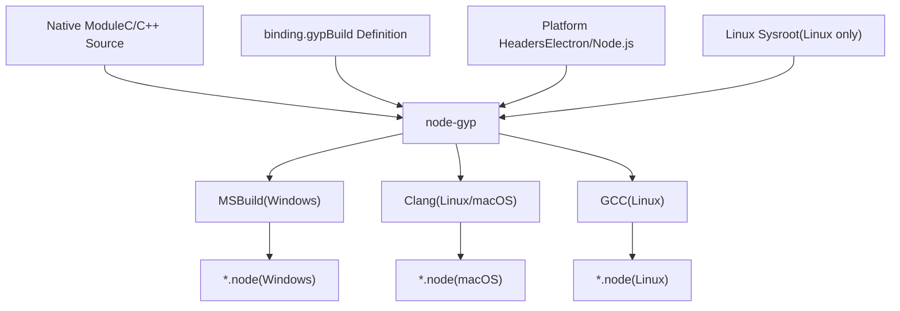
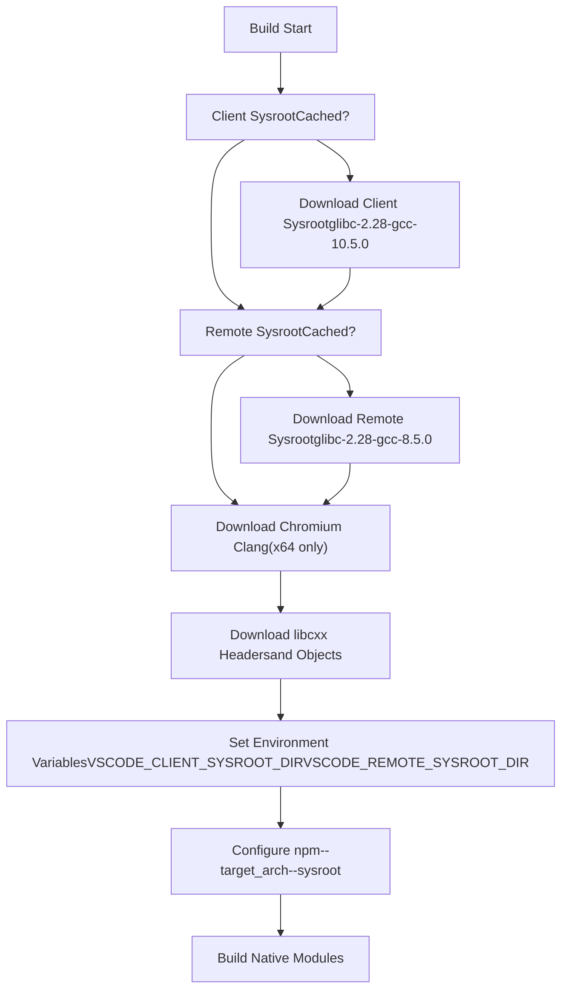
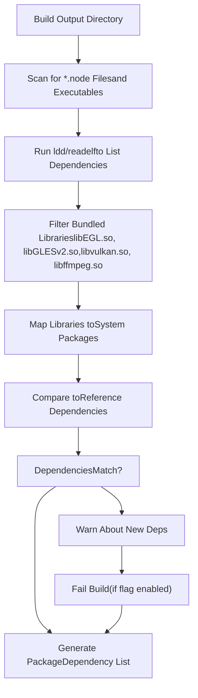

# Native Modules and Cross-Platform Builds

Relevant source files

-   [.npmrc](https://github.com/microsoft/vscode/blob/1be3088d/.npmrc)
-   [.nvmrc](https://github.com/microsoft/vscode/blob/1be3088d/.nvmrc)
-   [build/.moduleignore](https://github.com/microsoft/vscode/blob/1be3088d/build/.moduleignore)
-   [build/.webignore](https://github.com/microsoft/vscode/blob/1be3088d/build/.webignore)
-   [build/azure-pipelines/linux/setup-env.sh](https://github.com/microsoft/vscode/blob/1be3088d/build/azure-pipelines/linux/setup-env.sh)
-   [build/checksums/electron.txt](https://github.com/microsoft/vscode/blob/1be3088d/build/checksums/electron.txt)
-   [build/checksums/nodejs.txt](https://github.com/microsoft/vscode/blob/1be3088d/build/checksums/nodejs.txt)
-   [build/linux/dependencies-generator.ts](https://github.com/microsoft/vscode/blob/1be3088d/build/linux/dependencies-generator.ts)
-   [build/npm/gyp/package-lock.json](https://github.com/microsoft/vscode/blob/1be3088d/build/npm/gyp/package-lock.json)
-   [build/package-lock.json](https://github.com/microsoft/vscode/blob/1be3088d/build/package-lock.json)
-   [build/package.json](https://github.com/microsoft/vscode/blob/1be3088d/build/package.json)
-   [cgmanifest.json](https://github.com/microsoft/vscode/blob/1be3088d/cgmanifest.json)
-   [eslint.config.js](https://github.com/microsoft/vscode/blob/1be3088d/eslint.config.js)
-   [extensions/git/package-lock.json](https://github.com/microsoft/vscode/blob/1be3088d/extensions/git/package-lock.json)
-   [extensions/github-authentication/package-lock.json](https://github.com/microsoft/vscode/blob/1be3088d/extensions/github-authentication/package-lock.json)
-   [extensions/notebook-renderers/package-lock.json](https://github.com/microsoft/vscode/blob/1be3088d/extensions/notebook-renderers/package-lock.json)
-   [extensions/package-lock.json](https://github.com/microsoft/vscode/blob/1be3088d/extensions/package-lock.json)
-   [extensions/package.json](https://github.com/microsoft/vscode/blob/1be3088d/extensions/package.json)
-   [package-lock.json](https://github.com/microsoft/vscode/blob/1be3088d/package-lock.json)
-   [package.json](https://github.com/microsoft/vscode/blob/1be3088d/package.json)
-   [remote/.npmrc](https://github.com/microsoft/vscode/blob/1be3088d/remote/.npmrc)
-   [remote/package-lock.json](https://github.com/microsoft/vscode/blob/1be3088d/remote/package-lock.json)
-   [remote/package.json](https://github.com/microsoft/vscode/blob/1be3088d/remote/package.json)
-   [remote/web/package-lock.json](https://github.com/microsoft/vscode/blob/1be3088d/remote/web/package-lock.json)
-   [remote/web/package.json](https://github.com/microsoft/vscode/blob/1be3088d/remote/web/package.json)
-   [src/vs/base/parts/contextmenu/electron-main/contextmenu.ts](https://github.com/microsoft/vscode/blob/1be3088d/src/vs/base/parts/contextmenu/electron-main/contextmenu.ts)
-   [src/vs/platform/environment/test/node/nativeModules.integrationTest.ts](https://github.com/microsoft/vscode/blob/1be3088d/src/vs/platform/environment/test/node/nativeModules.integrationTest.ts)
-   [src/vs/workbench/contrib/chat/browser/widget/media/chatViewWelcome.css](https://github.com/microsoft/vscode/blob/1be3088d/src/vs/workbench/contrib/chat/browser/widget/media/chatViewWelcome.css)
-   [test/automation/package-lock.json](https://github.com/microsoft/vscode/blob/1be3088d/test/automation/package-lock.json)
-   [test/automation/package.json](https://github.com/microsoft/vscode/blob/1be3088d/test/automation/package.json)
-   [test/integration/browser/package-lock.json](https://github.com/microsoft/vscode/blob/1be3088d/test/integration/browser/package-lock.json)
-   [test/integration/browser/package.json](https://github.com/microsoft/vscode/blob/1be3088d/test/integration/browser/package.json)
-   [test/smoke/package-lock.json](https://github.com/microsoft/vscode/blob/1be3088d/test/smoke/package-lock.json)
-   [test/smoke/package.json](https://github.com/microsoft/vscode/blob/1be3088d/test/smoke/package.json)
-   [test/smoke/src/areas/accessibility/accessibility.test.ts](https://github.com/microsoft/vscode/blob/1be3088d/test/smoke/src/areas/accessibility/accessibility.test.ts)

## Purpose and Scope

This document covers VS Code's native module dependencies and the cross-platform build infrastructure required to compile them for multiple operating systems and architectures. Native modules are Node.js addons written in C/C++ that must be compiled for each target platform. This document explains:

-   The catalog of native module dependencies and their purposes
-   Build configuration for Electron (desktop) vs Node.js (remote server)
-   Platform-specific binary compilation strategies
-   Linux sysroot management for consistent builds across distributions
-   Dependency calculation and packaging rules

For information about the general build pipeline and artifact publishing, see [Build Pipeline and Automation](/microsoft/vscode/2.3-build-pipeline-and-automation). For package structure and dependency management at the npm level, see [Package Structure and Dependencies](/microsoft/vscode/2.1-package-structure-and-dependencies).

---

## Native Module Dependencies

VS Code relies on numerous native modules that provide low-level system integration capabilities. These modules must be compiled from C/C++ source code for each target platform and architecture.

### Core Native Modules

The following table lists the primary native modules used by VS Code:

| Module | Purpose | Platforms |
| --- | --- | --- |
| `@vscode/spdlog` | High-performance logging library | All |
| `@vscode/sqlite3` | SQLite database access | All |
| `@vscode/native-watchdog` | Process health monitoring | All |
| `@vscode/windows-process-tree` | Process tree enumeration | Windows |
| `@vscode/windows-registry` | Windows registry access | Windows |
| `@vscode/windows-mutex` | Named mutex implementation | Windows |
| `@vscode/policy-watcher` | Policy file monitoring | Windows |
| `@vscode/deviceid` | Hardware device identification | All |
| `node-pty` | Pseudo-terminal (PTY) support for integrated terminal | All |
| `@parcel/watcher` | File system watching | All |
| `native-keymap` | Keyboard layout detection | All |
| `native-is-elevated` | Administrator/root privilege detection | All |
| `kerberos` | Kerberos authentication | All |
| `windows-foreground-love` | Window activation on Windows | Windows (optional) |

Sources: [package.json74-122](https://github.com/microsoft/vscode/blob/1be3088d/package.json#L74-L122) [remote/package.json5-43](https://github.com/microsoft/vscode/blob/1be3088d/remote/package.json#L5-L43)

### Native Module Architecture

```mermaid
flowchart TD
    MainProcess["Main Process(Electron/Node.js)"]
    RendererProcess["Renderer Process(Electron)"]
    UtilityProcess["Utility Process(Electron)"]
    ExtensionHost["Extension Host(Node.js)"]
    Logging["@vscode/spdlogLogging"]
    Database["@vscode/sqlite3Database"]
    FileWatch["@parcel/watcherFile Watching"]
    Terminal["node-ptyTerminal PTY"]
    WinRegistry["@vscode/windows-registry"]
    WinProcess["@vscode/windows-process-tree"]
    WinMutex["@vscode/windows-mutex"]
    WinPolicy["@vscode/policy-watcher"]
    Keymap["native-keymapKeyboard Layout"]
    Elevated["native-is-elevatedPrivilege Check"]
    DeviceId["@vscode/deviceidHardware ID"]
    Watchdog["@vscode/native-watchdogProcess Monitor"]

    MainProcess --> Logging
    MainProcess --> Database
    MainProcess --> FileWatch
    MainProcess --> Terminal
    MainProcess --> WinRegistry
    MainProcess --> WinProcess
    MainProcess --> Keymap
    UtilityProcess --> Terminal
    ExtensionHost --> Terminal
    RendererProcess --> Keymap
```


Sources: [package.json74-122](https://github.com/microsoft/vscode/blob/1be3088d/package.json#L74-L122) [remote/package.json5-43](https://github.com/microsoft/vscode/blob/1be3088d/remote/package.json#L5-L43) [src/vs/platform/environment/test/node/nativeModules.integrationTest.ts1-199](https://github.com/microsoft/vscode/blob/1be3088d/src/vs/platform/environment/test/node/nativeModules.integrationTest.ts#L1-L199)

---

## Build Configuration

VS Code uses different build configurations for desktop (Electron) and remote server (Node.js) environments. These configurations are specified in `.npmrc` files.

### Desktop Build Configuration (Electron)

The root `.npmrc` file configures native module compilation for Electron:

```
disturl="https://electronjs.org/headers"
target="39.2.7"
ms_build_id="13098910"
runtime="electron"
build_from_source="true"
legacy-peer-deps="true"
timeout=180000
```
Key parameters:

-   `disturl`: Source for Electron headers needed for compilation
-   `target`: Electron version (39.2.7, based on Chromium 142.0.7444.235)
-   `runtime`: Specifies Electron as the target runtime
-   `build_from_source`: Forces compilation from source rather than using prebuilds
-   `ms_build_id`: Microsoft Visual Studio build tools identifier

Sources: [.npmrc1-8](https://github.com/microsoft/vscode/blob/1be3088d/.npmrc#L1-L8) [cgmanifest.json7-9](https://github.com/microsoft/vscode/blob/1be3088d/cgmanifest.json#L7-L9)

### Remote Server Build Configuration (Node.js)

The `remote/.npmrc` file configures compilation for pure Node.js:

```
disturl="https://nodejs.org/dist"
target="22.21.1"
ms_build_id="374314"
runtime="node"
build_from_source="true"
legacy-peer-deps="true"
timeout=180000
```
Key differences:

-   `disturl`: Uses Node.js headers instead of Electron
-   `target`: Node.js version 22.21.1
-   `runtime`: Specifies Node.js as the target runtime

Sources: [remote/.npmrc1-8](https://github.com/microsoft/vscode/blob/1be3088d/remote/.npmrc#L1-L8) [.nvmrc1](https://github.com/microsoft/vscode/blob/1be3088d/.nvmrc#L1-L1) [build/checksums/nodejs.txt1-8](https://github.com/microsoft/vscode/blob/1be3088d/build/checksums/nodejs.txt#L1-L8)

---

## Platform-Specific Binary Compilation

Native modules must be compiled separately for each operating system and CPU architecture. VS Code supports the following platform/architecture combinations:

### Supported Platforms

| Platform | Architectures | Build Targets |
| --- | --- | --- |
| **Windows** | x64, ia32, arm64 | `win32-x64`, `win32-ia32`, `win32-arm64` |
| **macOS** | x64, arm64 | `darwin-x64`, `darwin-arm64` |
| **macOS (App Store)** | x64, arm64 | `mas-x64`, `mas-arm64` |
| **Linux (glibc)** | x64, arm64, armv7l | `linux-x64`, `linux-arm64`, `linux-armv7l` |
| **Linux (musl/Alpine)** | x64, arm64 | `linux-x64-musl`, `linux-arm64-musl` |
| **FreeBSD** | x64 | `freebsd-x64` |
| **Android** | arm64 | `android-arm64` |

Sources: [build/checksums/electron.txt1-76](https://github.com/microsoft/vscode/blob/1be3088d/build/checksums/electron.txt#L1-L76) [build/checksums/nodejs.txt1-8](https://github.com/microsoft/vscode/blob/1be3088d/build/checksums/nodejs.txt#L1-L8)

### Platform Binary Build Flow


Sources: [build/.moduleignore3-143](https://github.com/microsoft/vscode/blob/1be3088d/build/.moduleignore#L3-L143) [build/npm/gyp/package-lock.json1-1390](https://github.com/microsoft/vscode/blob/1be3088d/build/npm/gyp/package-lock.json#L1-L1390)

### Pre-built vs Source Compilation

Some native modules provide pre-built binaries for common platforms through `node-gyp-build` or similar mechanisms. However, VS Code forces source compilation to ensure:

1.  **ABI Compatibility**: Binaries match the exact Electron/Node.js version
2.  **Security**: Source code can be audited and verified
3.  **Custom Patches**: VS Code-specific modifications can be applied
4.  **Optimization**: Platform-specific compiler flags can be used

The `build_from_source="true"` setting in `.npmrc` enforces this behavior.

Sources: [.npmrc5](https://github.com/microsoft/vscode/blob/1be3088d/.npmrc#L5-L5) [remote/.npmrc5](https://github.com/microsoft/vscode/blob/1be3088d/remote/.npmrc#L5-L5)

---

## Linux Sysroot Management

Linux builds face unique challenges due to glibc version compatibility. VS Code uses sysroots to ensure binaries work across multiple Linux distributions.

### Sysroot Strategy

VS Code maintains two separate sysroots for Linux builds:

1.  **Client Sysroot** (`glibc-2.28-gcc-10.5.0`): For desktop application binaries
2.  **Remote Sysroot** (`glibc-2.28-gcc-8.5.0`): For remote server binaries

Both use glibc 2.28 to maximize compatibility with older distributions while using different GCC versions for specific requirements.

Sources: [build/azure-pipelines/linux/setup-env.sh10-11](https://github.com/microsoft/vscode/blob/1be3088d/build/azure-pipelines/linux/setup-env.sh#L10-L11)

### Sysroot Setup Process


Sources: [build/azure-pipelines/linux/setup-env.sh1-59](https://github.com/microsoft/vscode/blob/1be3088d/build/azure-pipelines/linux/setup-env.sh#L1-L59) [build/linux/dependencies-generator.ts1-91](https://github.com/microsoft/vscode/blob/1be3088d/build/linux/dependencies-generator.ts#L1-L91)

### Sysroot Download Implementation

The `getVSCodeSysroot` function handles sysroot acquisition:

```
// Called during build setup
SYSROOT_ARCH="$SYSROOT_ARCH"
VSCODE_SYSROOT_DIR="$VSCODE_CLIENT_SYSROOT_DIR"
node -e 'import { getVSCodeSysroot } from "./build/linux/debian/install-sysroot.ts";
         (async () => { await getVSCodeSysroot(process.env["SYSROOT_ARCH"]); })()'
```
The function `getVSCodeSysroot` and `getChromiumSysroot` are implemented in the build scripts to fetch and configure the appropriate sysroots.

Sources: [build/azure-pipelines/linux/setup-env.sh16-23](https://github.com/microsoft/vscode/blob/1be3088d/build/azure-pipelines/linux/setup-env.sh#L16-L23) [build/linux/dependencies-generator.ts7](https://github.com/microsoft/vscode/blob/1be3088d/build/linux/dependencies-generator.ts#L7-L7)

### Linux Architecture Support

For x64 Linux builds, additional toolchain components are downloaded:

1.  **Chromium Clang**: Compiler toolchain from Chromium project (version 142.0.7444.235)
2.  **libcxx Headers**: C++ standard library headers from upstream Electron
3.  **libcxx Objects**: Compiled C++ standard library objects

These ensure consistent compilation results across build environments.

Sources: [build/azure-pipelines/linux/setup-env.sh26-36](https://github.com/microsoft/vscode/blob/1be3088d/build/azure-pipelines/linux/setup-env.sh#L26-L36) [cgmanifest.json7-9](https://github.com/microsoft/vscode/blob/1be3088d/cgmanifest.json#L7-L9)

---

## Dependency Calculation

VS Code automatically calculates runtime dependencies for Linux packages (DEB and RPM) by analyzing native module binaries.

### Dependency Generation Process


Sources: [build/linux/dependencies-generator.ts1-91](https://github.com/microsoft/vscode/blob/1be3088d/build/linux/dependencies-generator.ts#L1-L91)

### Bundled Dependencies

VS Code bundles certain shared libraries from Chromium and Electron to avoid version conflicts:

```
// Bundled dependencies (from Chromium)
const bundledDeps = [
    'libEGL.so',
    'libGLESv2.so',
    'libvulkan.so.1',
    'libvk_swiftshader.so',
    'libffmpeg.so'
];
```
These libraries are excluded from system package dependencies.

Sources: [build/linux/dependencies-generator.ts28-34](https://github.com/microsoft/vscode/blob/1be3088d/build/linux/dependencies-generator.ts#L28-L34)

### Package Formats

The dependency calculation supports two Linux package formats:

1.  **DEB Packages** (Debian/Ubuntu): Dependencies calculated by `generatePackageDepsDebian`
2.  **RPM Packages** (RHEL/Fedora): Dependencies calculated by `generatePackageDepsRpm`

Each format has architecture-specific mappings (e.g., `DebianArchString`, `RpmArchString`) and reference dependency lists for validation.

Sources: [build/linux/dependencies-generator.ts8-13](https://github.com/microsoft/vscode/blob/1be3088d/build/linux/dependencies-generator.ts#L8-L13) [build/linux/dependencies-generator.ts36-55](https://github.com/microsoft/vscode/blob/1be3088d/build/linux/dependencies-generator.ts#L36-L55)

### Dependency Validation

The build can optionally fail if unexpected dependencies are detected:

```
const FAIL_BUILD_FOR_NEW_DEPENDENCIES: boolean = true;
```
When enabled, any dependencies not in the reference lists (defined in `debian/dep-lists.ts` and `rpm/dep-lists.ts`) will cause the build to fail, preventing accidental introduction of new system requirements.

Sources: [build/linux/dependencies-generator.ts23](https://github.com/microsoft/vscode/blob/1be3088d/build/linux/dependencies-generator.ts#L23-L23)

---

## Module Cleanup and Packaging

To minimize package size, VS Code strips unnecessary files from native modules before distribution. The `.moduleignore` file defines cleanup rules.

### Native Module Cleanup Rules

The following patterns are removed from native modules:

**Build artifacts and source code:**

```
*/binding.gyp          # Build definition files
*/build/**            # Intermediate build files
*/src/**              # C/C++ source files
*/deps/**             # Dependency sources
*/test/**             # Test files
```
**Documentation:**

```
**/docs/**
**/example/**
**/examples/**
**/*.md
**/LICENSE
```
**TypeScript artifacts:**

```
**/*.ts               # TypeScript source
**/*.d.ts             # Type definitions (except public APIs)
```
Sources: [build/.moduleignore1-191](https://github.com/microsoft/vscode/blob/1be3088d/build/.moduleignore#L1-L191)

### Platform-Specific Binary Preservation

Despite aggressive cleanup, compiled binaries are preserved using negation patterns:

```
# node-pty example
node-pty/build/**                     # Remove build directory
!node-pty/build/Release/*.node        # Keep compiled addon
!node-pty/build/Release/*.exe         # Keep Windows executables
!node-pty/build/Release/*.dll         # Keep Windows DLLs
!node-pty/build/Release/spawn-helper  # Keep Unix helper binary
```
This pattern is repeated for each native module, ensuring only runtime binaries are included.

Sources: [build/.moduleignore100-113](https://github.com/microsoft/vscode/blob/1be3088d/build/.moduleignore#L100-L113)

### Special Module Handling

Some modules require special treatment:

**@vscode/spdlog:**

```
@vscode/spdlog/binding.gyp
@vscode/spdlog/build/**
@vscode/spdlog/deps/**
@vscode/spdlog/src/**
!@vscode/spdlog/build/Release/*.node
```
**@vscode/tree-sitter-wasm** (selective WASM inclusion):

```
@vscode/tree-sitter-wasm/wasm/tree-sitter-*.wasm     # Remove all WASM
!@vscode/tree-sitter-wasm/wasm/tree-sitter-typescript.wasm
!@vscode/tree-sitter-wasm/wasm/tree-sitter-regex.wasm
!@vscode/tree-sitter-wasm/wasm/tree-sitter-ini.wasm
# Only include needed language parsers
```
Sources: [build/.moduleignore15-21](https://github.com/microsoft/vscode/blob/1be3088d/build/.moduleignore#L15-L21) [build/.moduleignore58-64](https://github.com/microsoft/vscode/blob/1be3088d/build/.moduleignore#L58-L64)

### Web Build Cleanup

The `.webignore` file provides similar cleanup rules for web builds, with additional restrictions since native modules cannot run in browsers. All native module directories are excluded, except for specific WASM-based modules.

Sources: [build/.webignore1-65](https://github.com/microsoft/vscode/blob/1be3088d/build/.webignore#L1-L65)

---

## Testing Native Modules

VS Code includes integration tests to verify that all native modules load correctly on each platform.

### Native Module Integration Tests

The test suite at `src/vs/platform/environment/test/node/nativeModules.integrationTest.ts` validates each native module:

```
flakySuite('Native Modules (all platforms)', () => {

    test('kerberos', async () => {
        const { default: kerberos } = await import('kerberos');
        assert.ok(typeof kerberos.initializeClient === 'function');
    });

    test('native-keymap', async () => {
        const keyMap = await import('native-keymap');
        assert.ok(typeof keyMap.getCurrentKeyboardLayout === 'function');
        const result = keyMap.getCurrentKeyboardLayout();
        assert.ok(result);
    });

    // ... additional tests for each module
});
```
Sources: [src/vs/platform/environment/test/node/nativeModules.integrationTest.ts14-51](https://github.com/microsoft/vscode/blob/1be3088d/src/vs/platform/environment/test/node/nativeModules.integrationTest.ts#L14-L51)

### Platform-Specific Tests

Some tests are conditional based on the platform:

```
// Windows-only tests
(isWindows ? test : test.skip)('@vscode/windows-process-tree', async () => {
    const processTree = await import('@vscode/windows-process-tree');
    // Windows-specific assertions
});

// macOS-only tests
(isMacintosh ? test : test.skip)('@vscode/windows-registry', async () => {
    // Should be skipped on macOS
});
```
Sources: [src/vs/platform/environment/test/node/nativeModules.integrationTest.ts53-144](https://github.com/microsoft/vscode/blob/1be3088d/src/vs/platform/environment/test/node/nativeModules.integrationTest.ts#L53-L144)

### Test Error Reporting

Each test includes a descriptive error message helper:

```
function testErrorMessage(module: string): string {
    return `Unable to load "${module}" dependency. ` +
           `It was probably not compiled for the right operating system ` +
           `architecture or had missing build tools.`;
}
```
This helps diagnose compilation issues during development and CI builds.

Sources: [src/vs/platform/environment/test/node/nativeModules.integrationTest.ts10-12](https://github.com/microsoft/vscode/blob/1be3088d/src/vs/platform/environment/test/node/nativeModules.integrationTest.ts#L10-L12)

---

## Build Target Versions

VS Code tracks specific versions of Electron, Node.js, and Chromium components through checksums and manifest files.

### Electron Version

Current Electron version: **39.2.7** (based on Chromium 142.0.7444.235)

Platform-specific Electron binaries are verified using SHA256 checksums stored in `build/checksums/electron.txt`. This file includes checksums for:

-   Electron binaries for all platforms and architectures
-   ChromeDriver for automation testing
-   FFmpeg for media playback
-   Debug symbols and source maps

Sources: [build/checksums/electron.txt1-76](https://github.com/microsoft/vscode/blob/1be3088d/build/checksums/electron.txt#L1-L76) [cgmanifest.json7-10](https://github.com/microsoft/vscode/blob/1be3088d/cgmanifest.json#L7-L10)

### Node.js Version

Current Node.js version: **22.21.1** (for remote server builds)

Node.js binaries are also verified using SHA256 checksums:

```
c170d6554fba83d41d25a76cdbad85487c077e51fa73519e41ac885aa429d8af  node-v22.21.1-darwin-arm64.tar.gz
8e3dc89614debe66c2a6ad2313a1adb06eb37db6cd6c40d7de6f7d987f7d1afd  node-v22.21.1-darwin-x64.tar.gz
c86830dedf77f8941faa6c5a9c863bdfdd1927a336a46943decc06a38f80bfb2  node-v22.21.1-linux-arm64.tar.gz
# ... additional platforms
```
Sources: [build/checksums/nodejs.txt1-8](https://github.com/microsoft/vscode/blob/1be3088d/build/checksums/nodejs.txt#L1-L8) [.nvmrc1](https://github.com/microsoft/vscode/blob/1be3088d/.nvmrc#L1-L1)

### Component Governance

The `cgmanifest.json` file tracks third-party components for security and licensing:

-   **Chromium**: Version 142.0.7444.235, commit `4d74005947d2522c31942de3d609355124455643`
-   **FFmpeg**: Version 5.1.git, commit `092f84b6141055bfab609b6b2666b724eee2e130`

These entries ensure proper attribution and enable automated vulnerability scanning.

Sources: [cgmanifest.json3-66](https://github.com/microsoft/vscode/blob/1be3088d/cgmanifest.json#L3-L66)
