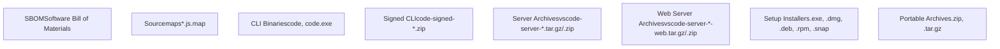

# Build Pipeline and Automation

Relevant source files

-   [.npmrc](https://github.com/microsoft/vscode/blob/1be3088d/.npmrc)
-   [.nvmrc](https://github.com/microsoft/vscode/blob/1be3088d/.nvmrc)
-   [build/.cachesalt](https://github.com/microsoft/vscode/blob/1be3088d/build/.cachesalt)
-   [build/.moduleignore](https://github.com/microsoft/vscode/blob/1be3088d/build/.moduleignore)
-   [build/.webignore](https://github.com/microsoft/vscode/blob/1be3088d/build/.webignore)
-   [build/azure-pipelines/alpine/product-build-alpine.yml](https://github.com/microsoft/vscode/blob/1be3088d/build/azure-pipelines/alpine/product-build-alpine.yml)
-   [build/azure-pipelines/common/installPlaywright.js](https://github.com/microsoft/vscode/blob/1be3088d/build/azure-pipelines/common/installPlaywright.js)
-   [build/azure-pipelines/common/publish-artifact.yml](https://github.com/microsoft/vscode/blob/1be3088d/build/azure-pipelines/common/publish-artifact.yml)
-   [build/azure-pipelines/common/publish.ts](https://github.com/microsoft/vscode/blob/1be3088d/build/azure-pipelines/common/publish.ts)
-   [build/azure-pipelines/config/CredScanSuppressions.json](https://github.com/microsoft/vscode/blob/1be3088d/build/azure-pipelines/config/CredScanSuppressions.json)
-   [build/azure-pipelines/config/tsaoptions.json](https://github.com/microsoft/vscode/blob/1be3088d/build/azure-pipelines/config/tsaoptions.json)
-   [build/azure-pipelines/darwin/product-build-darwin-cli-sign.yml](https://github.com/microsoft/vscode/blob/1be3088d/build/azure-pipelines/darwin/product-build-darwin-cli-sign.yml)
-   [build/azure-pipelines/darwin/product-build-darwin-universal.yml](https://github.com/microsoft/vscode/blob/1be3088d/build/azure-pipelines/darwin/product-build-darwin-universal.yml)
-   [build/azure-pipelines/darwin/product-build-darwin.yml](https://github.com/microsoft/vscode/blob/1be3088d/build/azure-pipelines/darwin/product-build-darwin.yml)
-   [build/azure-pipelines/linux/product-build-linux.yml](https://github.com/microsoft/vscode/blob/1be3088d/build/azure-pipelines/linux/product-build-linux.yml)
-   [build/azure-pipelines/linux/setup-env.sh](https://github.com/microsoft/vscode/blob/1be3088d/build/azure-pipelines/linux/setup-env.sh)
-   [build/azure-pipelines/product-build.yml](https://github.com/microsoft/vscode/blob/1be3088d/build/azure-pipelines/product-build.yml)
-   [build/azure-pipelines/product-compile.yml](https://github.com/microsoft/vscode/blob/1be3088d/build/azure-pipelines/product-compile.yml)
-   [build/azure-pipelines/product-publish.yml](https://github.com/microsoft/vscode/blob/1be3088d/build/azure-pipelines/product-publish.yml)
-   [build/azure-pipelines/web/product-build-web.yml](https://github.com/microsoft/vscode/blob/1be3088d/build/azure-pipelines/web/product-build-web.yml)
-   [build/azure-pipelines/win32/product-build-win32-cli-sign.yml](https://github.com/microsoft/vscode/blob/1be3088d/build/azure-pipelines/win32/product-build-win32-cli-sign.yml)
-   [build/azure-pipelines/win32/product-build-win32.yml](https://github.com/microsoft/vscode/blob/1be3088d/build/azure-pipelines/win32/product-build-win32.yml)
-   [build/checksums/electron.txt](https://github.com/microsoft/vscode/blob/1be3088d/build/checksums/electron.txt)
-   [build/checksums/nodejs.txt](https://github.com/microsoft/vscode/blob/1be3088d/build/checksums/nodejs.txt)
-   [build/linux/dependencies-generator.ts](https://github.com/microsoft/vscode/blob/1be3088d/build/linux/dependencies-generator.ts)
-   [build/npm/gyp/package-lock.json](https://github.com/microsoft/vscode/blob/1be3088d/build/npm/gyp/package-lock.json)
-   [build/package-lock.json](https://github.com/microsoft/vscode/blob/1be3088d/build/package-lock.json)
-   [build/package.json](https://github.com/microsoft/vscode/blob/1be3088d/build/package.json)
-   [cgmanifest.json](https://github.com/microsoft/vscode/blob/1be3088d/cgmanifest.json)
-   [cli/.cargo/config.toml](https://github.com/microsoft/vscode/blob/1be3088d/cli/.cargo/config.toml)
-   [cli/CONTRIBUTING.md](https://github.com/microsoft/vscode/blob/1be3088d/cli/CONTRIBUTING.md)
-   [eslint.config.js](https://github.com/microsoft/vscode/blob/1be3088d/eslint.config.js)
-   [extensions/git/package-lock.json](https://github.com/microsoft/vscode/blob/1be3088d/extensions/git/package-lock.json)
-   [extensions/github-authentication/package-lock.json](https://github.com/microsoft/vscode/blob/1be3088d/extensions/github-authentication/package-lock.json)
-   [extensions/notebook-renderers/package-lock.json](https://github.com/microsoft/vscode/blob/1be3088d/extensions/notebook-renderers/package-lock.json)
-   [extensions/package-lock.json](https://github.com/microsoft/vscode/blob/1be3088d/extensions/package-lock.json)
-   [extensions/package.json](https://github.com/microsoft/vscode/blob/1be3088d/extensions/package.json)
-   [package-lock.json](https://github.com/microsoft/vscode/blob/1be3088d/package-lock.json)
-   [package.json](https://github.com/microsoft/vscode/blob/1be3088d/package.json)
-   [remote/.npmrc](https://github.com/microsoft/vscode/blob/1be3088d/remote/.npmrc)
-   [remote/package-lock.json](https://github.com/microsoft/vscode/blob/1be3088d/remote/package-lock.json)
-   [remote/package.json](https://github.com/microsoft/vscode/blob/1be3088d/remote/package.json)
-   [remote/web/package-lock.json](https://github.com/microsoft/vscode/blob/1be3088d/remote/web/package-lock.json)
-   [remote/web/package.json](https://github.com/microsoft/vscode/blob/1be3088d/remote/web/package.json)
-   [src/vs/base/parts/contextmenu/electron-main/contextmenu.ts](https://github.com/microsoft/vscode/blob/1be3088d/src/vs/base/parts/contextmenu/electron-main/contextmenu.ts)
-   [src/vs/platform/environment/test/node/nativeModules.integrationTest.ts](https://github.com/microsoft/vscode/blob/1be3088d/src/vs/platform/environment/test/node/nativeModules.integrationTest.ts)
-   [src/vs/workbench/contrib/chat/browser/widget/media/chatViewWelcome.css](https://github.com/microsoft/vscode/blob/1be3088d/src/vs/workbench/contrib/chat/browser/widget/media/chatViewWelcome.css)
-   [test/automation/package-lock.json](https://github.com/microsoft/vscode/blob/1be3088d/test/automation/package-lock.json)
-   [test/automation/package.json](https://github.com/microsoft/vscode/blob/1be3088d/test/automation/package.json)
-   [test/integration/browser/package-lock.json](https://github.com/microsoft/vscode/blob/1be3088d/test/integration/browser/package-lock.json)
-   [test/integration/browser/package.json](https://github.com/microsoft/vscode/blob/1be3088d/test/integration/browser/package.json)
-   [test/smoke/package-lock.json](https://github.com/microsoft/vscode/blob/1be3088d/test/smoke/package-lock.json)
-   [test/smoke/package.json](https://github.com/microsoft/vscode/blob/1be3088d/test/smoke/package.json)
-   [test/smoke/src/areas/accessibility/accessibility.test.ts](https://github.com/microsoft/vscode/blob/1be3088d/test/smoke/src/areas/accessibility/accessibility.test.ts)

## Purpose and Scope

This document describes VS Code's Azure DevOps build pipeline, which orchestrates multi-platform compilation, packaging, signing, and distribution. The pipeline produces builds for Windows (x64, arm64), Linux (x64, armhf, arm64), Alpine (x64, arm64), macOS (x64, arm64, universal), and Web platforms across three quality levels: exploration, insider, and stable.

For information about the package structure and dependency management, see [Package Structure and Dependencies](/microsoft/vscode/2.1-package-structure-and-dependencies). For native module compilation specifics, see [Native Modules and Cross-Platform Builds](/microsoft/vscode/2.2-native-modules-and-cross-platform-builds). For code quality enforcement during builds, see [Code Quality and Linting](/microsoft/vscode/2.4-code-quality-and-linting).

## Pipeline Architecture

The build pipeline is defined in [build/azure-pipelines/product-build.yml1-520](https://github.com/microsoft/vscode/blob/1be3088d/build/azure-pipelines/product-build.yml#L1-L520) and uses Azure DevOps 1ES pipeline templates. It consists of multiple stages that run in parallel after an initial compilation stage.

### Pipeline Stages Flow


**Sources:** [build/azure-pipelines/product-build.yml196-520](https://github.com/microsoft/vscode/blob/1be3088d/build/azure-pipelines/product-build.yml#L196-L520)

### Stage Dependencies and Parallelization

The pipeline maximizes parallelization by making most build stages dependent only on the `Compile` stage, not on each other. The `CompileCLI` stage compiles platform-specific CLI binaries in parallel.


**Sources:** [build/azure-pipelines/product-build.yml204-264](https://github.com/microsoft/vscode/blob/1be3088d/build/azure-pipelines/product-build.yml#L204-L264)

## Pipeline Configuration

### Build Parameters

The pipeline exposes several parameters defined in [build/azure-pipelines/product-build.yml20-101](https://github.com/microsoft/vscode/blob/1be3088d/build/azure-pipelines/product-build.yml#L20-L101):

| Parameter | Type | Default | Description |
| --- | --- | --- | --- |
| `VSCODE_QUALITY` | string | insider | Quality level: exploration, insider, or stable |
| `NPM_REGISTRY` | string | Azure feed | Custom NPM registry for dependencies |
| `CARGO_REGISTRY` | string | Azure feed | Custom Cargo registry for Rust dependencies |
| `VSCODE_BUILD_WIN32` | boolean | true | Build Windows x64 |
| `VSCODE_BUILD_WIN32_ARM64` | boolean | true | Build Windows arm64 |
| `VSCODE_BUILD_LINUX` | boolean | true | Build Linux x64 |
| `VSCODE_BUILD_LINUX_ARM64` | boolean | true | Build Linux arm64 |
| `VSCODE_BUILD_LINUX_ARMHF` | boolean | true | Build Linux armhf |
| `VSCODE_BUILD_LINUX_SNAP` | boolean | true | Build Linux x64 Snap |
| `VSCODE_BUILD_ALPINE` | boolean | true | Build Alpine x64 |
| `VSCODE_BUILD_ALPINE_ARM64` | boolean | true | Build Alpine arm64 |
| `VSCODE_BUILD_MACOS` | boolean | true | Build macOS x64 |
| `VSCODE_BUILD_MACOS_ARM64` | boolean | true | Build macOS arm64 |
| `VSCODE_BUILD_MACOS_UNIVERSAL` | boolean | true | Build macOS universal binary |
| `VSCODE_BUILD_WEB` | boolean | true | Build web standalone |
| `VSCODE_PUBLISH` | boolean | true | Publish artifacts to CDN |
| `VSCODE_RELEASE` | boolean | false | Release build if successful |
| `VSCODE_STEP_ON_IT` | boolean | false | Skip tests |

**Sources:** [build/azure-pipelines/product-build.yml20-101](https://github.com/microsoft/vscode/blob/1be3088d/build/azure-pipelines/product-build.yml#L20-L101)

### Environment Variables

Key environment variables configured in [build/azure-pipelines/product-build.yml102-156](https://github.com/microsoft/vscode/blob/1be3088d/build/azure-pipelines/product-build.yml#L102-L156):

-   `VSCODE_MIXIN_REPO`: Repository for distro-specific code mixins (`microsoft/vscode-distro`)
-   `AZURE_DOCUMENTDB_ENDPOINT`: Cosmos DB endpoint for asset metadata
-   `VSCODE_ESRP_SERVICE_CONNECTION_ID`: Service connection for ESRP code signing
-   `PRSS_CDN_URL`: CDN URL for distribution
-   `VSCODE_STAGING_BLOB_STORAGE_ACCOUNT_NAME`: Azure blob storage for staging artifacts

**Sources:** [build/azure-pipelines/product-build.yml131-156](https://github.com/microsoft/vscode/blob/1be3088d/build/azure-pipelines/product-build.yml#L131-L156)

## Compilation Stage

The `Compile` stage runs on macOS agents and produces compilation artifacts shared by all platform builds.

### Node Modules Caching

The pipeline implements aggressive caching for `node_modules` to reduce build times:


The cache key is computed based on lock file hashes and architecture in [build/azure-pipelines/product-compile.yml33-34](https://github.com/microsoft/vscode/blob/1be3088d/build/azure-pipelines/product-compile.yml#L33-L34):

```
node build/azure-pipelines/common/computeNodeModulesCacheKey.ts compile $(node -p process.arch)
```
**Sources:** [build/azure-pipelines/product-compile.yml33-91](https://github.com/microsoft/vscode/blob/1be3088d/build/azure-pipelines/product-compile.yml#L33-L91)

### Compilation Process

The compilation stage defined in [build/azure-pipelines/product-compile.yml1-172](https://github.com/microsoft/vscode/blob/1be3088d/build/azure-pipelines/product-compile.yml#L1-L172) performs:

1.  **Checkout**: Clone repository with distro mixin
2.  **Node Setup**: Install Node.js version from `.nvmrc` ([.nvmrc1](https://github.com/microsoft/vscode/blob/1be3088d/.nvmrc#L1-L1))
3.  **NPM Registry Setup**: Configure custom NPM registry if specified
4.  **Dependency Installation**: Run `npm ci` with retries (up to 5 attempts)
5.  **Distro Mixin**: Mix in distro-specific node modules and quality settings
6.  **Compilation**: Execute `core-ci`, `extensions-ci`, `hygiene`, `eslint`, etc.
7.  **Validation**: Verify compilation output folders exist and are non-empty
8.  **Test Compilation**: Compile smoke and integration test suites
9.  **Sourcemap Upload**: Upload sourcemaps to Azure Storage
10.  **Artifact Creation**: Create `compilation.tar.gz` artifact

**Sources:** [build/azure-pipelines/product-compile.yml12-172](https://github.com/microsoft/vscode/blob/1be3088d/build/azure-pipelines/product-compile.yml#L12-L172)

### Compilation Validation

The pipeline validates compilation output in [build/azure-pipelines/product-compile.yml103-118](https://github.com/microsoft/vscode/blob/1be3088d/build/azure-pipelines/product-compile.yml#L103-L118):

```
# Verify out-build exists and is not empty
[ -d "out-build" ] || exit 1
[ -n "$(find out-build -mindepth 1 2>/dev/null | head -1)" ] || exit 1

# Verify all out-vscode-* folders exist and are not empty
ls -d out-vscode-* >/dev/null 2>&1 || exit 1
for folder in out-vscode-*; do
  [ -d "$folder" ] || exit 1
  [ -n "$(find "$folder" -mindepth 1 2>/dev/null | head -1)" ] || exit 1
done
```
**Sources:** [build/azure-pipelines/product-compile.yml103-118](https://github.com/microsoft/vscode/blob/1be3088d/build/azure-pipelines/product-compile.yml#L103-L118)

## Multi-Platform Build Stages

Each platform stage downloads the `Compilation` artifact, installs platform-specific dependencies, and produces platform-specific packages.

### Windows Builds

Windows builds are defined in [build/azure-pipelines/win32/product-build-win32.yml1-96](https://github.com/microsoft/vscode/blob/1be3088d/build/azure-pipelines/win32/product-build-win32.yml#L1-L96) and produce:

| Artifact | Architecture | Description |
| --- | --- | --- |
| `vscode_client_win32_$(ARCH)_setup` | x64, arm64 | System installer (`.exe`) |
| `vscode_client_win32_$(ARCH)_user-setup` | x64, arm64 | User installer (`.exe`) |
| `vscode_client_win32_$(ARCH)_archive` | x64, arm64 | Portable archive (`.zip`) |
| `vscode_server_win32_$(ARCH)_archive` | x64, arm64 | Server archive (`.zip`) |
| `vscode_web_win32_$(ARCH)_archive` | x64, arm64 | Web server archive (`.zip`) |

The Windows stage also includes a separate CLI signing job that signs CLI binaries using ESRP.

**Sources:** [build/azure-pipelines/win32/product-build-win32.yml1-96](https://github.com/microsoft/vscode/blob/1be3088d/build/azure-pipelines/win32/product-build-win32.yml#L1-L96) [build/azure-pipelines/product-build.yml305-354](https://github.com/microsoft/vscode/blob/1be3088d/build/azure-pipelines/product-build.yml#L305-L354)

### Linux Builds

Linux builds are defined in [build/azure-pipelines/linux/product-build-linux.yml1-113](https://github.com/microsoft/vscode/blob/1be3088d/build/azure-pipelines/linux/product-build-linux.yml#L1-L113) and produce:

| Artifact | Architecture | Format |
| --- | --- | --- |
| `vscode_client_linux_$(ARCH)_archive-unsigned` | x64, armhf, arm64 | `.tar.gz` |
| `vscode_client_linux_$(ARCH)_deb-package` | x64, armhf, arm64 | `.deb` |
| `vscode_client_linux_$(ARCH)_rpm-package` | x64, armhf, arm64 | `.rpm` |
| `vscode_client_linux_x64_snap` | x64 | `.snap` |
| `vscode_server_linux_$(ARCH)_archive-unsigned` | x64, armhf, arm64 | `.tar.gz` |
| `vscode_web_linux_$(ARCH)_archive-unsigned` | x64, armhf, arm64 | `.tar.gz` |

The Linux stage uses sysroot setup for cross-compilation and runs tests on the x64 build.

**Sources:** [build/azure-pipelines/linux/product-build-linux.yml1-113](https://github.com/microsoft/vscode/blob/1be3088d/build/azure-pipelines/linux/product-build-linux.yml#L1-L113) [build/azure-pipelines/product-build.yml355-409](https://github.com/microsoft/vscode/blob/1be3088d/build/azure-pipelines/product-build.yml#L355-L409)

### macOS Builds

macOS builds are defined in [build/azure-pipelines/darwin/product-build-darwin.yml1-87](https://github.com/microsoft/vscode/blob/1be3088d/build/azure-pipelines/darwin/product-build-darwin.yml#L1-L87) and produce:

| Artifact | Architecture | Format |
| --- | --- | --- |
| `vscode_client_darwin_$(ARCH)_archive` | x64, arm64 | `.zip` |
| `vscode_client_darwin_$(ARCH)_dmg` | x64, arm64 | `.dmg` |
| `vscode_server_darwin_$(ARCH)_archive-unsigned` | x64, arm64 | `.zip` |
| `vscode_web_darwin_$(ARCH)_archive-unsigned` | x64, arm64 | `.zip` |

A separate universal build job combines x64 and arm64 binaries using `vscode-universal-bundler`.

**Sources:** [build/azure-pipelines/darwin/product-build-darwin.yml1-87](https://github.com/microsoft/vscode/blob/1be3088d/build/azure-pipelines/darwin/product-build-darwin.yml#L1-L87) [build/azure-pipelines/darwin/product-build-darwin-universal.yml1-124](https://github.com/microsoft/vscode/blob/1be3088d/build/azure-pipelines/darwin/product-build-darwin-universal.yml#L1-L124)

### Alpine Builds

Alpine builds are defined in [build/azure-pipelines/alpine/product-build-alpine.yml1-116](https://github.com/microsoft/vscode/blob/1be3088d/build/azure-pipelines/alpine/product-build-alpine.yml#L1-L116) and produce server archives using Alpine Linux Docker containers with musl libc.

**Sources:** [build/azure-pipelines/alpine/product-build-alpine.yml1-116](https://github.com/microsoft/vscode/blob/1be3088d/build/azure-pipelines/alpine/product-build-alpine.yml#L1-L116)

### Web Builds

Web builds are defined in [build/azure-pipelines/web/product-build-web.yml1-170](https://github.com/microsoft/vscode/blob/1be3088d/build/azure-pipelines/web/product-build-web.yml#L1-L170) and produce:

-   `vscode_web_linux_standalone_archive-unsigned`: Standalone web build as `.tar.gz`

The web build runs `gulp vscode-web-min-ci` and uploads the result to the CDN.

**Sources:** [build/azure-pipelines/web/product-build-web.yml1-170](https://github.com/microsoft/vscode/blob/1be3088d/build/azure-pipelines/web/product-build-web.yml#L1-L170)

## Artifact Types and Outputs

### Build Artifact Structure


**Sources:** [build/azure-pipelines/win32/product-build-win32.yml49-83](https://github.com/microsoft/vscode/blob/1be3088d/build/azure-pipelines/win32/product-build-win32.yml#L49-L83) [build/azure-pipelines/darwin/product-build-darwin.yml48-78](https://github.com/microsoft/vscode/blob/1be3088d/build/azure-pipelines/darwin/product-build-darwin.yml#L48-L78) [build/azure-pipelines/linux/product-build-linux.yml60-102](https://github.com/microsoft/vscode/blob/1be3088d/build/azure-pipelines/linux/product-build-linux.yml#L60-L102)

### SBOM Generation

Each artifact includes a Software Bill of Materials (SBOM) generated by the `ComponentGovernanceComponentDetection` task. SBOM metadata includes:

-   `sbomBuildDropPath`: Path to the unpacked artifact for scanning
-   `sbomPackageName`: Human-readable package name
-   `sbomPackageVersion`: Build source version (commit SHA)

**Sources:** [build/azure-pipelines/product-compile.yml166-171](https://github.com/microsoft/vscode/blob/1be3088d/build/azure-pipelines/product-compile.yml#L166-L171)

## Publishing and Distribution

The `Publish` stage coordinates artifact processing, signing, CDN upload, and metadata recording.

### Publishing Architecture


**Sources:** [build/azure-pipelines/product-publish.yml1-92](https://github.com/microsoft/vscode/blob/1be3088d/build/azure-pipelines/product-publish.yml#L1-L92) [build/azure-pipelines/common/publish.ts1-824](https://github.com/microsoft/vscode/blob/1be3088d/build/azure-pipelines/common/publish.ts#L1-L824)

### ESRP Code Signing

Code signing is performed using the Enterprise Security Release Process (ESRP) service. The signing logic is implemented in [build/azure-pipelines/common/publish.ts44-824](https://github.com/microsoft/vscode/blob/1be3088d/build/azure-pipelines/common/publish.ts#L44-L824)

#### Signing Workflow

> **[Mermaid sequence]**
> *(图表结构无法解析)*

**Sources:** [build/azure-pipelines/common/publish.ts215-485](https://github.com/microsoft/vscode/blob/1be3088d/build/azure-pipelines/common/publish.ts#L215-L485)

#### ESRP Authentication

Authentication to ESRP uses MSAL (Microsoft Authentication Library) with confidential client flow:

```
// From build/azure-pipelines/common/publish.ts
const clientApplication = new ConfidentialClientApplication({
  auth: {
    clientId: e('AZURE_CLIENT_ID'),
    authority: `https://login.microsoftonline.com/${e('AZURE_TENANT_ID')}`,
    clientCertificate: {
      thumbprint: parsedCert.thumbprint,
      privateKey: parsedCert.key
    }
  }
});
```
**Sources:** [build/azure-pipelines/common/publish.ts117-134](https://github.com/microsoft/vscode/blob/1be3088d/build/azure-pipelines/common/publish.ts#L117-L134)

### CDN Upload

Artifacts are uploaded to Azure Blob Storage in the `vscodeweb` storage account. The upload process uses:

-   **Parallel Workers**: Multiple worker threads for concurrent uploads ([build/azure-pipelines/common/publish.ts554-620](https://github.com/microsoft/vscode/blob/1be3088d/build/azure-pipelines/common/publish.ts#L554-L620))
-   **Retry Logic**: Exponential backoff for transient failures ([build/azure-pipelines/common/retry.ts](https://github.com/microsoft/vscode/blob/1be3088d/build/azure-pipelines/common/retry.ts))
-   **SAS Tokens**: Time-limited Shared Access Signatures for secure uploads ([build/azure-pipelines/common/publish.ts486-553](https://github.com/microsoft/vscode/blob/1be3088d/build/azure-pipelines/common/publish.ts#L486-L553))

#### Upload Process


**Sources:** [build/azure-pipelines/common/publish.ts486-679](https://github.com/microsoft/vscode/blob/1be3088d/build/azure-pipelines/common/publish.ts#L486-L679)

### Cosmos DB Metadata

Asset metadata is recorded in Azure Cosmos DB for tracking and validation. Each asset record includes:

-   **Asset Name**: Unique identifier for the asset
-   **Platform**: Target platform (win32-x64, linux-x64, darwin-arm64, etc.)
-   **Type**: Asset type (archive, setup, server, etc.)
-   **URL**: CDN URL for the asset
-   **Hash**: SHA256 hash of the asset
-   **Mooncake URL**: China region CDN URL
-   **Size**: Asset size in bytes
-   **Timestamp**: Upload timestamp

**Sources:** [build/azure-pipelines/common/publish.ts680-824](https://github.com/microsoft/vscode/blob/1be3088d/build/azure-pipelines/common/publish.ts#L680-L824)

## Release Process

The optional `Release` stage publishes builds to the production marketplace and requires approval.

### Release Approval


The approval stage uses the `VSCodePeerApproval` variable group and requires manual intervention before proceeding to release.

**Sources:** [build/azure-pipelines/product-build.yml492-520](https://github.com/microsoft/vscode/blob/1be3088d/build/azure-pipelines/product-build.yml#L492-L520)

### Release Execution

The release stage executes tasks defined in [build/azure-pipelines/product-release.yml](https://github.com/microsoft/vscode/blob/1be3088d/build/azure-pipelines/product-release.yml) which typically:

1.  Updates version tags in the repository
2.  Publishes release notes
3.  Triggers downstream processes (marketplace update, update server notification)

**Sources:** [build/azure-pipelines/product-build.yml506-520](https://github.com/microsoft/vscode/blob/1be3088d/build/azure-pipelines/product-build.yml#L506-L520)

## Build Infrastructure

### Agent Pools

The pipeline uses 1ES (One Engineering System) managed agent pools:

| Pool Name | OS | Used For |
| --- | --- | --- |
| `AcesShared` | macOS | Compilation, macOS builds |
| `1es-windows-2022-x64` | Windows | Windows builds, publishing |
| `1es-ubuntu-22.04-x64` | Linux | Linux builds, web builds |

**Sources:** [build/azure-pipelines/product-build.yml196-497](https://github.com/microsoft/vscode/blob/1be3088d/build/azure-pipelines/product-build.yml#L196-L497)

### Build Caching Strategy

The pipeline implements multiple caching layers:

1.  **Node Modules Cache**: Shared across all stages, keyed by package-lock.json hash
2.  **Compilation Artifact Cache**: Shared compilation output across platform builds
3.  **Electron Cache**: Downloaded Electron binaries cached per version

Cache keys are computed in [build/azure-pipelines/common/computeNodeModulesCacheKey.ts](https://github.com/microsoft/vscode/blob/1be3088d/build/azure-pipelines/common/computeNodeModulesCacheKey.ts) based on:

-   Lock file content hash
-   Target platform
-   Node.js version
-   Architecture

**Sources:** [build/azure-pipelines/product-compile.yml33-45](https://github.com/microsoft/vscode/blob/1be3088d/build/azure-pipelines/product-compile.yml#L33-L45) [build/azure-pipelines/web/product-build-web.yml49-61](https://github.com/microsoft/vscode/blob/1be3088d/build/azure-pipelines/web/product-build-web.yml#L49-L61)

### Conditional Execution

The pipeline supports conditional execution of stages based on build parameters:

```
- ${{ if eq(parameters.VSCODE_BUILD_WIN32, true) }}:
  - template: build/azure-pipelines/win32/product-build-win32.yml@self
```
This allows selective builds (e.g., only Windows x64) to reduce CI time and resource usage.

**Sources:** [build/azure-pipelines/product-build.yml332-348](https://github.com/microsoft/vscode/blob/1be3088d/build/azure-pipelines/product-build.yml#L332-L348) [build/azure-pipelines/product-build.yml382-408](https://github.com/microsoft/vscode/blob/1be3088d/build/azure-pipelines/product-build.yml#L382-L408)

### Security Scanning

The pipeline includes SDL (Security Development Lifecycle) scanning:

-   **BinSkim**: Binary security analyzer for executables and libraries
-   **CredScan**: Credential scanner to detect accidentally committed secrets
-   **ESLint**: JavaScript/TypeScript code quality and security
-   **Component Detection**: Software composition analysis

Scan configurations are defined in [build/azure-pipelines/product-build.yml174-192](https://github.com/microsoft/vscode/blob/1be3088d/build/azure-pipelines/product-build.yml#L174-L192)

**Sources:** [build/azure-pipelines/product-build.yml174-192](https://github.com/microsoft/vscode/blob/1be3088d/build/azure-pipelines/product-build.yml#L174-L192)
