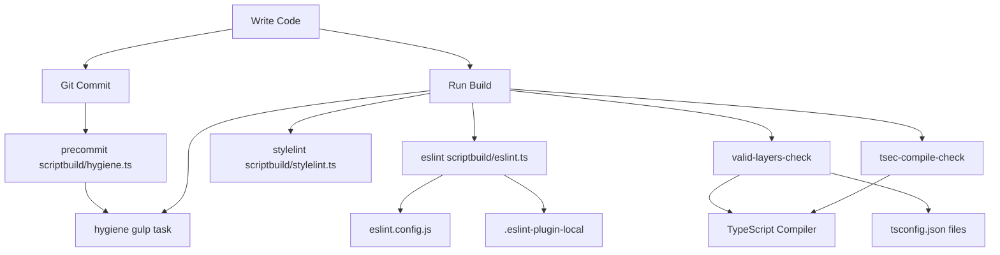
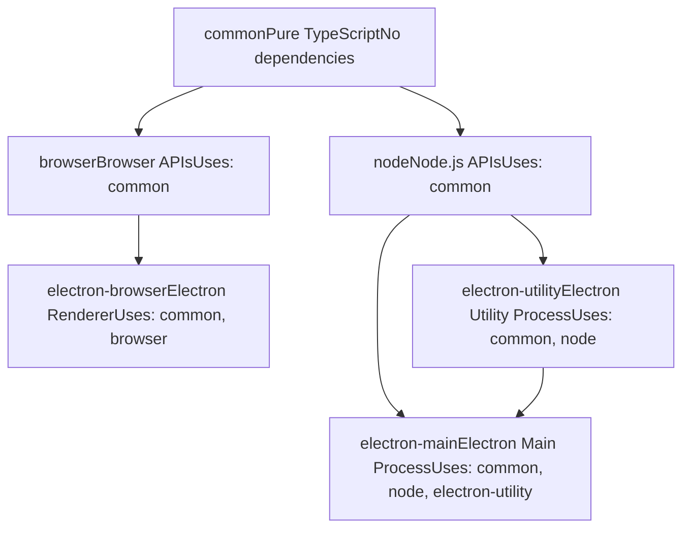
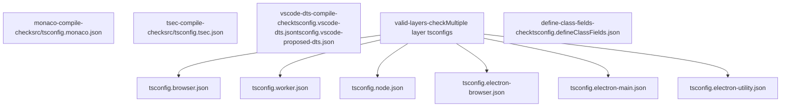
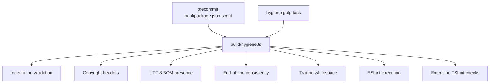
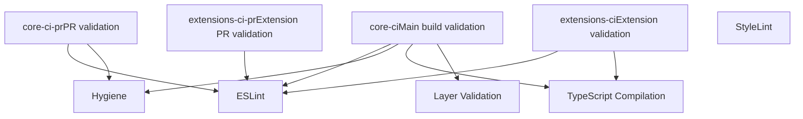

# Code Quality and Linting

Relevant source files

-   [.npmrc](https://github.com/microsoft/vscode/blob/1be3088d/.npmrc)
-   [.nvmrc](https://github.com/microsoft/vscode/blob/1be3088d/.nvmrc)
-   [build/.moduleignore](https://github.com/microsoft/vscode/blob/1be3088d/build/.moduleignore)
-   [build/.webignore](https://github.com/microsoft/vscode/blob/1be3088d/build/.webignore)
-   [build/azure-pipelines/linux/setup-env.sh](https://github.com/microsoft/vscode/blob/1be3088d/build/azure-pipelines/linux/setup-env.sh)
-   [build/checksums/electron.txt](https://github.com/microsoft/vscode/blob/1be3088d/build/checksums/electron.txt)
-   [build/checksums/nodejs.txt](https://github.com/microsoft/vscode/blob/1be3088d/build/checksums/nodejs.txt)
-   [build/linux/dependencies-generator.ts](https://github.com/microsoft/vscode/blob/1be3088d/build/linux/dependencies-generator.ts)
-   [build/npm/gyp/package-lock.json](https://github.com/microsoft/vscode/blob/1be3088d/build/npm/gyp/package-lock.json)
-   [build/package-lock.json](https://github.com/microsoft/vscode/blob/1be3088d/build/package-lock.json)
-   [build/package.json](https://github.com/microsoft/vscode/blob/1be3088d/build/package.json)
-   [cgmanifest.json](https://github.com/microsoft/vscode/blob/1be3088d/cgmanifest.json)
-   [eslint.config.js](https://github.com/microsoft/vscode/blob/1be3088d/eslint.config.js)
-   [extensions/git/package-lock.json](https://github.com/microsoft/vscode/blob/1be3088d/extensions/git/package-lock.json)
-   [extensions/github-authentication/package-lock.json](https://github.com/microsoft/vscode/blob/1be3088d/extensions/github-authentication/package-lock.json)
-   [extensions/notebook-renderers/package-lock.json](https://github.com/microsoft/vscode/blob/1be3088d/extensions/notebook-renderers/package-lock.json)
-   [extensions/package-lock.json](https://github.com/microsoft/vscode/blob/1be3088d/extensions/package-lock.json)
-   [extensions/package.json](https://github.com/microsoft/vscode/blob/1be3088d/extensions/package.json)
-   [package-lock.json](https://github.com/microsoft/vscode/blob/1be3088d/package-lock.json)
-   [package.json](https://github.com/microsoft/vscode/blob/1be3088d/package.json)
-   [remote/.npmrc](https://github.com/microsoft/vscode/blob/1be3088d/remote/.npmrc)
-   [remote/package-lock.json](https://github.com/microsoft/vscode/blob/1be3088d/remote/package-lock.json)
-   [remote/package.json](https://github.com/microsoft/vscode/blob/1be3088d/remote/package.json)
-   [remote/web/package-lock.json](https://github.com/microsoft/vscode/blob/1be3088d/remote/web/package-lock.json)
-   [remote/web/package.json](https://github.com/microsoft/vscode/blob/1be3088d/remote/web/package.json)
-   [src/vs/base/parts/contextmenu/electron-main/contextmenu.ts](https://github.com/microsoft/vscode/blob/1be3088d/src/vs/base/parts/contextmenu/electron-main/contextmenu.ts)
-   [src/vs/platform/environment/test/node/nativeModules.integrationTest.ts](https://github.com/microsoft/vscode/blob/1be3088d/src/vs/platform/environment/test/node/nativeModules.integrationTest.ts)
-   [src/vs/workbench/contrib/chat/browser/widget/media/chatViewWelcome.css](https://github.com/microsoft/vscode/blob/1be3088d/src/vs/workbench/contrib/chat/browser/widget/media/chatViewWelcome.css)
-   [test/automation/package-lock.json](https://github.com/microsoft/vscode/blob/1be3088d/test/automation/package-lock.json)
-   [test/automation/package.json](https://github.com/microsoft/vscode/blob/1be3088d/test/automation/package.json)
-   [test/integration/browser/package-lock.json](https://github.com/microsoft/vscode/blob/1be3088d/test/integration/browser/package-lock.json)
-   [test/integration/browser/package.json](https://github.com/microsoft/vscode/blob/1be3088d/test/integration/browser/package.json)
-   [test/smoke/package-lock.json](https://github.com/microsoft/vscode/blob/1be3088d/test/smoke/package-lock.json)
-   [test/smoke/package.json](https://github.com/microsoft/vscode/blob/1be3088d/test/smoke/package.json)
-   [test/smoke/src/areas/accessibility/accessibility.test.ts](https://github.com/microsoft/vscode/blob/1be3088d/test/smoke/src/areas/accessibility/accessibility.test.ts)

This document describes the code quality and linting infrastructure in VS Code. It covers ESLint configuration, custom lint rules, TypeScript type checking, code layering validation, and automated hygiene checks that ensure code quality and architectural consistency.

For information about the build pipeline that executes these checks, see [Build Tasks and Scripts](/microsoft/vscode/2.3-build-pipeline-and-automation). For native module compilation requirements, see [Native Modules and Cross-Platform Builds](/microsoft/vscode/2.2-native-modules-and-cross-platform-builds).

## 概览

VS Code's code quality system enforces multiple layers of validation:

-   **ESLint** with custom plugins for code style and architectural rules
-   **TypeScript** compiler checks with strict configurations
-   **Custom linters** for layering boundaries, localization, and VS Code-specific patterns
-   **Hygiene checks** that run during build and pre-commit
-   **Security checks** using tsec for trusted types validation


**Sources:** [package.json12-73](https://github.com/microsoft/vscode/blob/1be3088d/package.json#L12-L73) [eslint.config.js1-900](https://github.com/microsoft/vscode/blob/1be3088d/eslint.config.js#L1-L900)

## ESLint Configuration Structure

The ESLint configuration is defined in [eslint.config.js](https://github.com/microsoft/vscode/blob/1be3088d/eslint.config.js) using the TypeScript ESLint flat config format.

```mermaid
flowchart TD
    Config["eslint.config.js"]
    TSParser["typescript-eslint parser"]
    StylisticPlugin["@stylistic/eslint-plugin-ts"]
    LocalPlugin[".eslint-plugin-local"]
    HeaderPlugin["eslint-plugin-header"]
    JsdocPlugin["eslint-plugin-jsdoc"]
    GlobalRules["Global RulesAll JS/TS files"]
    TSRules["TypeScript Rules*.ts files"]
    VSCodeRules["VS Code Rulessrc/**/*.ts"]
    InOperatorRules["In Operator RulesSpecific files"]
    StrictAnyRules["Strict No Any RulesSelected extensions"]
    ESLintIgnore[".eslint-ignoreBuild artifactsnode_modulesout/"]

    Config --> TSParser
    Config --> StylisticPlugin
    Config --> LocalPlugin
    Config --> HeaderPlugin
    Config --> JsdocPlugin
    Config --> GlobalRules
    Config --> TSRules
    Config --> VSCodeRules
    Config --> InOperatorRules
    Config --> StrictAnyRules
    Config --> ESLintIgnore
```


**Sources:** [eslint.config.js1-30](https://github.com/microsoft/vscode/blob/1be3088d/eslint.config.js#L1-L30) [eslint.config.js32-132](https://github.com/microsoft/vscode/blob/1be3088d/eslint.config.js#L32-L132) [eslint.config.js134-161](https://github.com/microsoft/vscode/blob/1be3088d/eslint.config.js#L134-L161)

### Key Configuration Elements

| Configuration Section | File Patterns | Purpose |
| --- | --- | --- |
| Global Rules | All files | Basic code quality and style rules |
| TypeScript Rules | `**/*.{ts,tsx,mts,cts}` | TypeScript-specific linting |
| VS Code Rules | `src/**/*.ts` | Naming conventions for core source |
| In Operator Rules | Most TS files (with exceptions) | Disallow `in` operator except in type predicates |
| Strict No Any | Extensions and `src/**/*.ts` | Prohibit explicit `any` types |

The configuration uses a `.eslint-ignore` file to exclude generated files, build artifacts, and third-party code:

**Sources:** [eslint.config.js17-28](https://github.com/microsoft/vscode/blob/1be3088d/eslint.config.js#L17-L28) [eslint.config.js134-161](https://github.com/microsoft/vscode/blob/1be3088d/eslint.config.js#L134-L161) [eslint.config.js344-900](https://github.com/microsoft/vscode/blob/1be3088d/eslint.config.js#L344-L900)

## Custom ESLint Rules

VS Code implements numerous custom ESLint rules via the `.eslint-plugin-local` plugin. These enforce VS Code-specific coding patterns and architectural constraints.


**Sources:** [eslint.config.js79-96](https://github.com/microsoft/vscode/blob/1be3088d/eslint.config.js#L79-L96) [eslint.config.js152-159](https://github.com/microsoft/vscode/blob/1be3088d/eslint.config.js#L152-L159) [eslint.config.js340-342](https://github.com/microsoft/vscode/blob/1be3088d/eslint.config.js#L340-L342)

### Critical Custom Rules

| Rule | Severity | Purpose |
| --- | --- | --- |
| `code-layering` | warn | Enforces architectural layer boundaries |
| `code-no-localization-template-literals` | error | Prevents template literals in localization |
| `code-no-deep-import-of-internal` | error | Prevents importing internal APIs |
| `code-must-use-super-dispose` | warn | Ensures proper disposal in inheritance |
| `code-declare-service-brand` | warn | Enforces service brand declarations for DI |
| `code-no-unexternalized-strings` | warn | Ensures strings are localized |

**Sources:** [eslint.config.js79-96](https://github.com/microsoft/vscode/blob/1be3088d/eslint.config.js#L79-L96)

## Code Layering Architecture

VS Code enforces strict layering rules to maintain architectural boundaries between different execution contexts.


**Sources:** [eslint.config.js96-120](https://github.com/microsoft/vscode/blob/1be3088d/eslint.config.js#L96-L120)

The `code-layering` rule configuration in [eslint.config.js96-120](https://github.com/microsoft/vscode/blob/1be3088d/eslint.config.js#L96-L120) defines these dependencies:

```
'local/code-layering': [
    'warn',
    {
        'common': [],
        'node': ['common'],
        'browser': ['common'],
        'electron-browser': ['common', 'browser'],
        'electron-utility': ['common', 'node'],
        'electron-main': ['common', 'node', 'electron-utility']
    }
]
```
This ensures that:

-   `common` code has no platform dependencies
-   `node` and `browser` code only depends on `common`
-   `electron-*` layers properly separate concerns

The layering is validated by the `valid-layers-check` script:

**Sources:** [package.json51](https://github.com/microsoft/vscode/blob/1be3088d/package.json#L51-L51) [eslint.config.js96-120](https://github.com/microsoft/vscode/blob/1be3088d/eslint.config.js#L96-L120)

## TypeScript Compilation Checks

Multiple TypeScript compilation checks ensure type safety across different build targets:


**Sources:** [package.json48-52](https://github.com/microsoft/vscode/blob/1be3088d/package.json#L48-L52)

### Check Purposes

| Check Script | Purpose |
| --- | --- |
| `monaco-compile-check` | Validates Monaco editor standalone build |
| `tsec-compile-check` | Runs security-focused TypeScript checker (trusted types) |
| `vscode-dts-compile-check` | Validates extension API type definitions |
| `valid-layers-check` | Ensures layer boundaries via separate tsconfig files |
| `define-class-fields-check` | Validates class field initialization order |

**Sources:** [package.json48-52](https://github.com/microsoft/vscode/blob/1be3088d/package.json#L48-L52)

## Header and Copyright Enforcement

All source files must include the standard Microsoft copyright header, enforced by the `eslint-plugin-header`:

```
'header/header': [
    2,
    'block',
    [
        '---------------------------------------------------------------------------------------------',
        ' *  Copyright (c) Microsoft Corporation. All rights reserved.',
        ' *  Licensed under the MIT License. See License.txt in the project root for license information.',
        ' *--------------------------------------------------------------------------------------------'
    ]
]
```
**Sources:** [eslint.config.js121-131](https://github.com/microsoft/vscode/blob/1be3088d/eslint.config.js#L121-L131)

## Hygiene Checks

The hygiene system performs additional code quality checks beyond ESLint:


**Sources:** [package.json36](https://github.com/microsoft/vscode/blob/1be3088d/package.json#L36-L36) [package.json67](https://github.com/microsoft/vscode/blob/1be3088d/package.json#L67-L67)

The `hygiene` gulp task is invoked by:

-   Pre-commit hooks via `npm run precommit`
-   CI pipelines via `npm run hygiene`
-   Manual execution during development

**Sources:** [package.json36](https://github.com/microsoft/vscode/blob/1be3088d/package.json#L36-L36) [package.json67](https://github.com/microsoft/vscode/blob/1be3088d/package.json#L67-L67)

## Build-Time Quality Enforcement

Code quality checks are integrated into the build pipeline:


**Sources:** [package.json68-71](https://github.com/microsoft/vscode/blob/1be3088d/package.json#L68-L71)

## Execution Flow

The following diagram shows how quality checks are triggered in different workflows:

> **[Mermaid sequence]**
> *(图表结构无法解析)*

**Sources:** [package.json36](https://github.com/microsoft/vscode/blob/1be3088d/package.json#L36-L36) [package.json59](https://github.com/microsoft/vscode/blob/1be3088d/package.json#L59-L59) [package.json51](https://github.com/microsoft/vscode/blob/1be3088d/package.json#L51-L51)

## Configuration Files Summary

| File | Purpose |
| --- | --- |
| [eslint.config.js](https://github.com/microsoft/vscode/blob/1be3088d/eslint.config.js) | Main ESLint configuration with custom rules |
| [.eslint-ignore](https://github.com/microsoft/vscode/blob/1be3088d/.eslint-ignore) | Files excluded from ESLint checking |
| [.eslint-plugin-local/](https://github.com/microsoft/vscode/blob/1be3088d/.eslint-plugin-local/) | Custom ESLint rules specific to VS Code |
| [build/hygiene.ts](https://github.com/microsoft/vscode/blob/1be3088d/build/hygiene.ts) | Additional code hygiene checks |
| [build/eslint.ts](https://github.com/microsoft/vscode/blob/1be3088d/build/eslint.ts) | ESLint execution script |
| [build/stylelint.ts](https://github.com/microsoft/vscode/blob/1be3088d/build/stylelint.ts) | CSS/LESS linting script |
| [tsconfig.\*.json](https://github.com/microsoft/vscode/blob/1be3088d/tsconfig.*.json) | TypeScript configurations for different layers |
| [build/.moduleignore](https://github.com/microsoft/vscode/blob/1be3088d/build/.moduleignore) | Patterns for excluding modules from native builds |
| [build/.webignore](https://github.com/microsoft/vscode/blob/1be3088d/build/.webignore) | Patterns for excluding files from web builds |

**Sources:** [eslint.config.js1-900](https://github.com/microsoft/vscode/blob/1be3088d/eslint.config.js#L1-L900) [package.json59-60](https://github.com/microsoft/vscode/blob/1be3088d/package.json#L59-L60) [package.json36](https://github.com/microsoft/vscode/blob/1be3088d/package.json#L36-L36) [build/.moduleignore1-191](https://github.com/microsoft/vscode/blob/1be3088d/build/.moduleignore#L1-L191) [build/.webignore1-65](https://github.com/microsoft/vscode/blob/1be3088d/build/.webignore#L1-L65)

## Style Checking

In addition to ESLint, VS Code uses StyleLint for CSS and LESS files:

```
npm run stylelint
```
This executes [build/stylelint.ts](https://github.com/microsoft/vscode/blob/1be3088d/build/stylelint.ts) which validates styling files according to the project's style guidelines.

**Sources:** [package.json60](https://github.com/microsoft/vscode/blob/1be3088d/package.json#L60-L60)

## Native Module Quality Checks

Native modules require additional validation to ensure they're built correctly for each platform. The [build/azure-pipelines/linux/verify-glibc-requirements.sh](https://github.com/microsoft/vscode/blob/1be3088d/build/azure-pipelines/linux/verify-glibc-requirements.sh) script validates GLIBC version dependencies:

The script:

1.  Locates all `.node` files and executables
2.  Uses `objdump` to extract GLIBC/GLIBCXX dependencies
3.  Verifies versions don't exceed `EXPECTED_GLIBC_VERSION` and `EXPECTED_GLIBCXX_VERSION`
4.  Fails the build if unexpected dependencies are found

**Sources:** [build/azure-pipelines/linux/verify-glibc-requirements.sh1-44](https://github.com/microsoft/vscode/blob/1be3088d/build/azure-pipelines/linux/verify-glibc-requirements.sh#L1-L44)

## Dependency Validation

The build system validates native dependencies to ensure compatibility:

```mermaid
flowchart TD
    NativeTest["nativeModules.integrationTest.ts"]
    Kerberos["kerberos"]
    Yauzl["yauzl"]
    Yazl["yazl"]
    V8Profiler["v8-inspect-profiler"]
    NativeElevated["native-is-elevated"]
    NativeKeymap["native-keymap"]
    Watchdog["@vscode/native-watchdog"]
    SudoPrompt["@vscode/sudo-prompt"]
    PolicyWatcher["@vscode/policy-watcher"]
    NodePty["node-pty"]
    Spdlog["@vscode/spdlog"]
    ParcelWatcher["@parcel/watcher"]
    DeviceId["@vscode/deviceid"]
    Ripgrep["@vscode/ripgrep"]
    SQLite["@vscode/sqlite3"]

    NativeTest --> Kerberos
    NativeTest --> Yauzl
    NativeTest --> Yazl
    NativeTest --> V8Profiler
    NativeTest --> NativeElevated
    NativeTest --> NativeKeymap
    NativeTest --> Watchdog
    NativeTest --> SudoPrompt
    NativeTest --> PolicyWatcher
    NativeTest --> NodePty
    NativeTest --> Spdlog
    NativeTest --> ParcelWatcher
    NativeTest --> DeviceId
    NativeTest --> Ripgrep
    NativeTest --> SQLite
```


This test suite at [src/vs/platform/environment/test/node/nativeModules.integrationTest.ts](https://github.com/microsoft/vscode/blob/1be3088d/src/vs/platform/environment/test/node/nativeModules.integrationTest.ts) ensures all native modules load correctly and expose expected APIs.

**Sources:** [src/vs/platform/environment/test/node/nativeModules.integrationTest.ts1-150](https://github.com/microsoft/vscode/blob/1be3088d/src/vs/platform/environment/test/node/nativeModules.integrationTest.ts#L1-L150)

## Summary

VS Code's code quality infrastructure combines multiple layers of validation:

1.  **ESLint** with extensive custom rules enforces code style and architectural patterns
2.  **TypeScript** compiler validates types across different build targets and layers
3.  **Custom layering rules** maintain separation between common, node, browser, and electron code
4.  **Hygiene checks** validate formatting, copyright headers, and file consistency
5.  **Pre-commit hooks** catch issues before they enter version control
6.  **CI integration** ensures all checks pass before merging
7.  **Native module validation** confirms binary compatibility across platforms

These systems work together to maintain code quality and prevent architectural violations throughout the codebase.

**Sources:** [eslint.config.js1-900](https://github.com/microsoft/vscode/blob/1be3088d/eslint.config.js#L1-L900) [package.json12-73](https://github.com/microsoft/vscode/blob/1be3088d/package.json#L12-L73) [build/.moduleignore1-191](https://github.com/microsoft/vscode/blob/1be3088d/build/.moduleignore#L1-L191) [build/.webignore1-65](https://github.com/microsoft/vscode/blob/1be3088d/build/.webignore#L1-L65)
