# Application Lifecycle and Bootstrap

Relevant source files

-   [build/lib/i18n.resources.json](https://github.com/microsoft/vscode/blob/1be3088d/build/lib/i18n.resources.json)
-   [cli/src/bin/code/legacy\_args.rs](https://github.com/microsoft/vscode/blob/1be3088d/cli/src/bin/code/legacy_args.rs)
-   [resources/completions/bash/code](https://github.com/microsoft/vscode/blob/1be3088d/resources/completions/bash/code)
-   [resources/completions/zsh/\_code](https://github.com/microsoft/vscode/blob/1be3088d/resources/completions/zsh/_code)
-   [src/vs/base/node/terminalEncoding.ts](https://github.com/microsoft/vscode/blob/1be3088d/src/vs/base/node/terminalEncoding.ts)
-   [src/vs/code/browser/workbench/workbench-dev.html](https://github.com/microsoft/vscode/blob/1be3088d/src/vs/code/browser/workbench/workbench-dev.html)
-   [src/vs/code/browser/workbench/workbench.html](https://github.com/microsoft/vscode/blob/1be3088d/src/vs/code/browser/workbench/workbench.html)
-   [src/vs/code/browser/workbench/workbench.ts](https://github.com/microsoft/vscode/blob/1be3088d/src/vs/code/browser/workbench/workbench.ts)
-   [src/vs/code/electron-main/app.ts](https://github.com/microsoft/vscode/blob/1be3088d/src/vs/code/electron-main/app.ts)
-   [src/vs/code/electron-main/main.ts](https://github.com/microsoft/vscode/blob/1be3088d/src/vs/code/electron-main/main.ts)
-   [src/vs/code/node/cli.ts](https://github.com/microsoft/vscode/blob/1be3088d/src/vs/code/node/cli.ts)
-   [src/vs/code/node/cliProcessMain.ts](https://github.com/microsoft/vscode/blob/1be3088d/src/vs/code/node/cliProcessMain.ts)
-   [src/vs/platform/environment/common/argv.ts](https://github.com/microsoft/vscode/blob/1be3088d/src/vs/platform/environment/common/argv.ts)
-   [src/vs/platform/environment/common/environment.ts](https://github.com/microsoft/vscode/blob/1be3088d/src/vs/platform/environment/common/environment.ts)
-   [src/vs/platform/environment/common/environmentService.ts](https://github.com/microsoft/vscode/blob/1be3088d/src/vs/platform/environment/common/environmentService.ts)
-   [src/vs/platform/environment/electron-main/environmentMainService.ts](https://github.com/microsoft/vscode/blob/1be3088d/src/vs/platform/environment/electron-main/environmentMainService.ts)
-   [src/vs/platform/environment/node/argv.ts](https://github.com/microsoft/vscode/blob/1be3088d/src/vs/platform/environment/node/argv.ts)
-   [src/vs/platform/environment/node/argvHelper.ts](https://github.com/microsoft/vscode/blob/1be3088d/src/vs/platform/environment/node/argvHelper.ts)
-   [src/vs/platform/environment/node/environmentService.ts](https://github.com/microsoft/vscode/blob/1be3088d/src/vs/platform/environment/node/environmentService.ts)
-   [src/vs/platform/environment/node/stdin.ts](https://github.com/microsoft/vscode/blob/1be3088d/src/vs/platform/environment/node/stdin.ts)
-   [src/vs/platform/extensionManagement/common/extensionManagementCLI.ts](https://github.com/microsoft/vscode/blob/1be3088d/src/vs/platform/extensionManagement/common/extensionManagementCLI.ts)
-   [src/vs/server/node/remoteExtensionHostAgentCli.ts](https://github.com/microsoft/vscode/blob/1be3088d/src/vs/server/node/remoteExtensionHostAgentCli.ts)
-   [src/vs/server/node/server.cli.ts](https://github.com/microsoft/vscode/blob/1be3088d/src/vs/server/node/server.cli.ts)
-   [src/vs/server/node/serverEnvironmentService.ts](https://github.com/microsoft/vscode/blob/1be3088d/src/vs/server/node/serverEnvironmentService.ts)
-   [src/vs/server/node/serverServices.ts](https://github.com/microsoft/vscode/blob/1be3088d/src/vs/server/node/serverServices.ts)
-   [src/vs/workbench/browser/web.api.ts](https://github.com/microsoft/vscode/blob/1be3088d/src/vs/workbench/browser/web.api.ts)
-   [src/vs/workbench/browser/web.factory.ts](https://github.com/microsoft/vscode/blob/1be3088d/src/vs/workbench/browser/web.factory.ts)
-   [src/vs/workbench/browser/web.main.ts](https://github.com/microsoft/vscode/blob/1be3088d/src/vs/workbench/browser/web.main.ts)
-   [src/vs/workbench/electron-browser/desktop.main.ts](https://github.com/microsoft/vscode/blob/1be3088d/src/vs/workbench/electron-browser/desktop.main.ts)
-   [src/vs/workbench/services/environment/browser/environmentService.ts](https://github.com/microsoft/vscode/blob/1be3088d/src/vs/workbench/services/environment/browser/environmentService.ts)
-   [src/vs/workbench/services/environment/common/environmentService.ts](https://github.com/microsoft/vscode/blob/1be3088d/src/vs/workbench/services/environment/common/environmentService.ts)
-   [src/vs/workbench/services/environment/electron-browser/environmentService.ts](https://github.com/microsoft/vscode/blob/1be3088d/src/vs/workbench/services/environment/electron-browser/environmentService.ts)
-   [src/vs/workbench/services/extensions/electron-browser/nativeExtensionService.ts](https://github.com/microsoft/vscode/blob/1be3088d/src/vs/workbench/services/extensions/electron-browser/nativeExtensionService.ts)
-   [src/vs/workbench/workbench.common.main.ts](https://github.com/microsoft/vscode/blob/1be3088d/src/vs/workbench/workbench.common.main.ts)
-   [src/vs/workbench/workbench.desktop.main.ts](https://github.com/microsoft/vscode/blob/1be3088d/src/vs/workbench/workbench.desktop.main.ts)
-   [src/vs/workbench/workbench.web.main.ts](https://github.com/microsoft/vscode/blob/1be3088d/src/vs/workbench/workbench.web.main.ts)

This document describes how VS Code starts up and initializes across different execution modes. It covers the bootstrap sequence from initial process entry points through service initialization, explaining the multi-process architecture and how the various processes coordinate during startup.

For information about the workbench UI framework initialized after bootstrap, see [Workbench（工作台） Architecture](/microsoft/vscode/5-workbench-architecture). For extension host initialization specifically, see [Extension System](/microsoft/vscode/6-extension-system).

---

## Execution Modes and Entry Points

VS Code supports multiple execution modes, each with its own entry point and bootstrap sequence:

| Mode | Entry Point | Purpose |
| --- | --- | --- |
| Electron Desktop | `src/vs/code/electron-main/main.ts` | Native desktop application |
| Web Workbench | `src/vs/workbench/browser/web.main.ts` | Browser-based editor |
| CLI Process | `src/vs/code/node/cli.ts` | Command-line interface |
| Remote Server | `src/vs/server/node/serverServices.ts` | Remote development server |

**Electron Desktop Main Process Bootstrap**

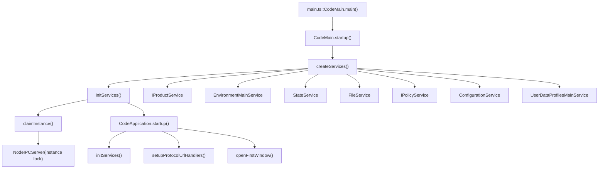
Sources: [src/vs/code/electron-main/main.ts88-159](https://github.com/microsoft/vscode/blob/1be3088d/src/vs/code/electron-main/main.ts#L88-L159) [src/vs/code/electron-main/main.ts162-227](https://github.com/microsoft/vscode/blob/1be3088d/src/vs/code/electron-main/main.ts#L162-L227)

---

## Electron Desktop Main Process

The main process is responsible for creating windows, managing the application lifecycle, and coordinating other processes.

### CodeMain Class

The `CodeMain` class in `main.ts` orchestrates the initial bootstrap:

1.  **Error Handling Setup**: Configures `setUnexpectedErrorHandler` before any other initialization
2.  **Service Creation**: Instantiates core services via `createServices()`
3.  **Service Initialization**: Calls `initServices()` to initialize state and configuration
4.  **Instance Claiming**: Attempts to claim the single-instance lock via `claimInstance()`
5.  **Application Launch**: Creates `CodeApplication` instance if successful

**Instance Claiming and IPC Server**

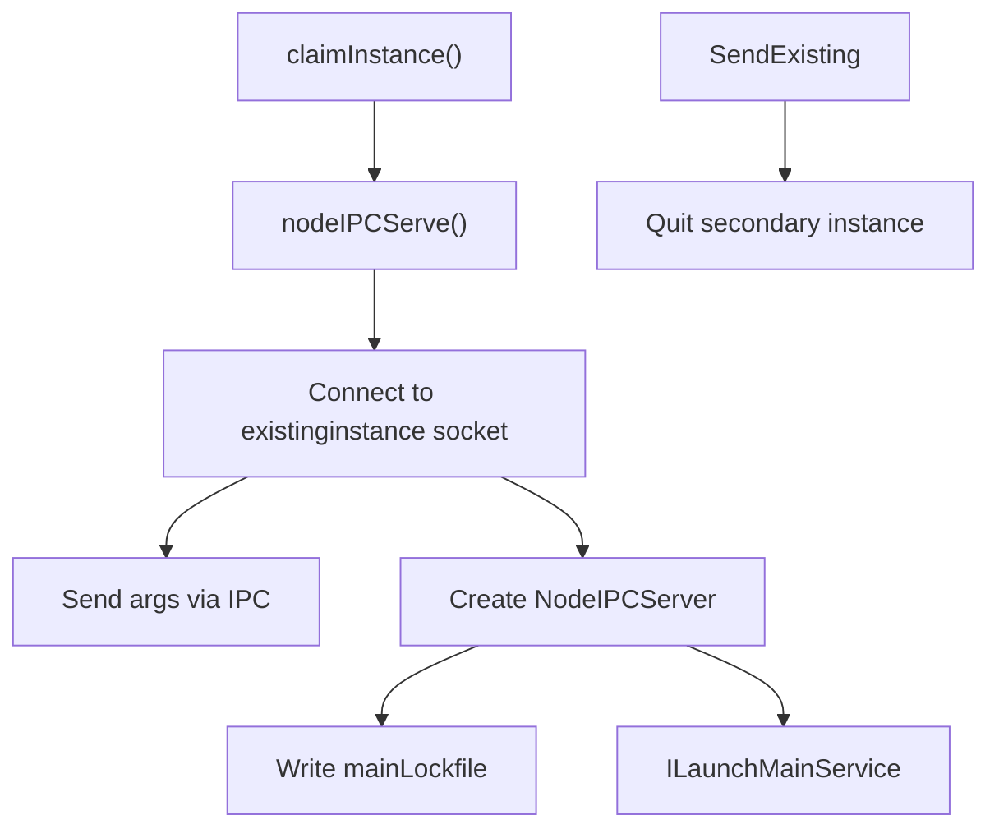
The instance lock mechanism uses a Unix domain socket (or named pipe on Windows) to ensure only one VS Code instance runs per user data directory. Secondary instances send their command-line arguments to the primary instance via IPC.

Sources: [src/vs/code/electron-main/main.ts228-390](https://github.com/microsoft/vscode/blob/1be3088d/src/vs/code/electron-main/main.ts#L228-L390) [src/vs/base/parts/ipc/node/ipc.net.ts](https://github.com/microsoft/vscode/blob/1be3088d/src/vs/base/parts/ipc/node/ipc.net.ts)

### CodeApplication（CodeApplication 应用） Initialization

After the main process claims the instance lock, it creates a `CodeApplication` instance which handles the full application lifecycle:

**CodeApplication.startup() Flow**

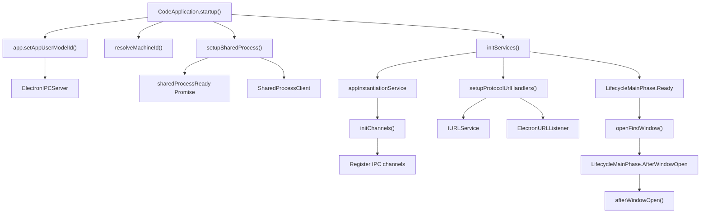
Sources: [src/vs/code/electron-main/app.ts532-628](https://github.com/microsoft/vscode/blob/1be3088d/src/vs/code/electron-main/app.ts#L532-L628)

### Service Initialization in Main Process

The `initServices()` method creates the full service collection for the main process:

| Service | Purpose | Implementation |
| --- | --- | --- |
| `IBackupMainService` | Backup management | `BackupMainService` |
| `IDialogMainService` | Native dialogs | `DialogMainService` |
| `IStorageMainService` | Global storage | `StorageMainService` |
| `IUpdateService` | Auto-updates | Platform-specific (`DarwinUpdateService`, `Win32UpdateService`, etc.) |
| `IWindowsMainService` | Window management | `WindowsMainService` |
| `ILaunchMainService` | CLI integration | `LaunchMainService` |
| `IMenubarMainService` | Native menus | `MenubarMainService` |
| `INativeHostMainService` | Native APIs | `NativeHostMainService` |

Sources: [src/vs/code/electron-main/app.ts893-1116](https://github.com/microsoft/vscode/blob/1be3088d/src/vs/code/electron-main/app.ts#L893-L1116)

---

## Electron Renderer Process (Desktop)

The renderer process hosts the workbench UI and runs in each window. The `DesktopMain` class bootstraps the renderer.

**DesktopMain Bootstrap Sequence**

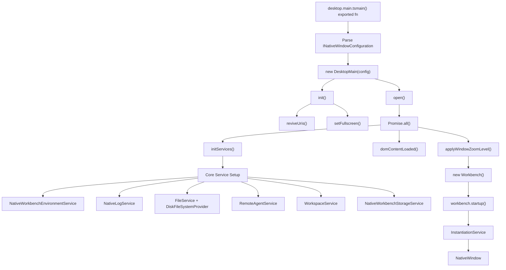
Sources: [src/vs/workbench/electron-browser/desktop.main.ts114-185](https://github.com/microsoft/vscode/blob/1be3088d/src/vs/workbench/electron-browser/desktop.main.ts#L114-L185) [src/vs/workbench/electron-browser/desktop.main.ts187-337](https://github.com/microsoft/vscode/blob/1be3088d/src/vs/workbench/electron-browser/desktop.main.ts#L187-L337)

### Renderer Service Initialization

The renderer process creates its own service collection, distinct from the main process:

**Key Renderer Services**

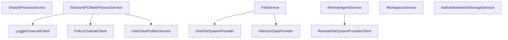
The renderer communicates with the main process via `ElectronIPCMainProcessService` and with the shared process via `SharedProcessService`, both using Electron's IPC mechanisms.

Sources: [src/vs/workbench/electron-browser/desktop.main.ts187-337](https://github.com/microsoft/vscode/blob/1be3088d/src/vs/workbench/electron-browser/desktop.main.ts#L187-L337)

---

## Web Workbench Bootstrap

The web workbench runs entirely in the browser without Electron. The `BrowserMain` class handles initialization.

**BrowserMain.initServices() Flow**

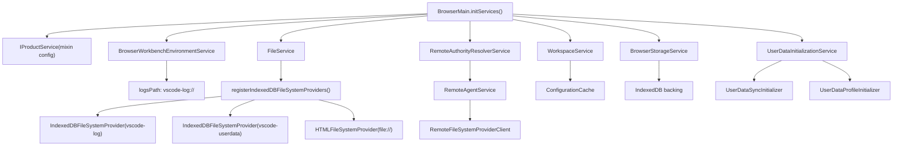
Sources: [src/vs/workbench/browser/web.main.ts257-444](https://github.com/microsoft/vscode/blob/1be3088d/src/vs/workbench/browser/web.main.ts#L257-L444)

### Web-Specific Considerations

The web workbench has unique requirements compared to desktop:

1.  **IndexedDB Storage**: Uses `IndexedDBFileSystemProvider` for persistence instead of native file system
2.  **No Main Process**: All services run in a single browser context
3.  **Remote Resources**: Optional `remoteResourceProvider` for accessing server-side files
4.  **WebSocket Remote**: Remote connections use WebSocket instead of node IPC

**IndexedDB File System Setup**

The web workbench creates multiple IndexedDB-backed file system providers:

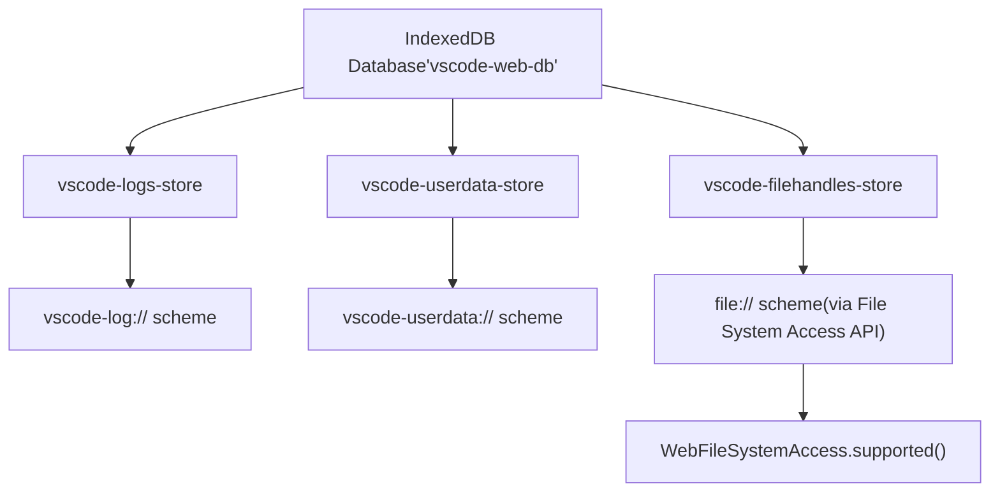
Sources: [src/vs/workbench/browser/web.main.ts462-506](https://github.com/microsoft/vscode/blob/1be3088d/src/vs/workbench/browser/web.main.ts#L462-L506)

---

## CLI Bootstrap

The CLI has multiple modes of operation depending on the command-line arguments.

**CLI Entry Point Decision Tree**

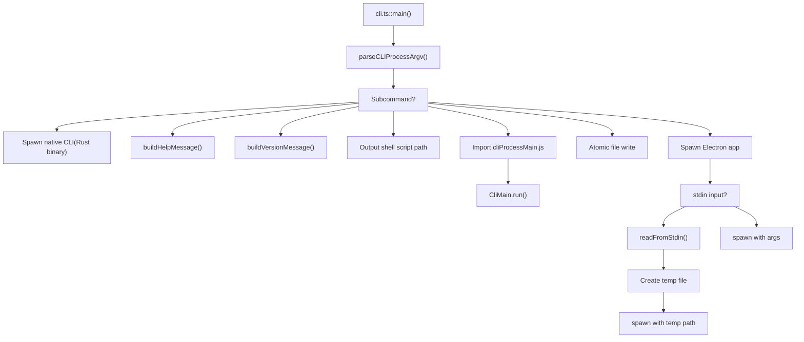
Sources: [src/vs/code/node/cli.ts43-144](https://github.com/microsoft/vscode/blob/1be3088d/src/vs/code/node/cli.ts#L43-L144)

### Extension Management CLI

When managing extensions (`--install-extension`, `--list-extensions`, etc.), the CLI imports `cliProcessMain.js` which creates a full service collection:

**CliMain Service Initialization**

| Service | Purpose |
| --- | --- |
| `NativeEnvironmentService` | Environment/paths configuration |
| `FileService` | File operations |
| `StateReadonlyService` | Persistent state |
| `UserDataProfilesReadonlyService` | Profile management |
| `ExtensionsScannerService` | Extension discovery |
| `ExtensionManagementService` | Extension install/uninstall |
| `ExtensionGalleryServiceWithNoStorageService` | Marketplace access |

The CLI then uses `ExtensionManagementCLI` to execute the requested operation.

Sources: [src/vs/code/node/cliProcessMain.ts97-271](https://github.com/microsoft/vscode/blob/1be3088d/src/vs/code/node/cliProcessMain.ts#L97-L271)

---

## Service Initialization Patterns

All bootstrap sequences follow common patterns for service initialization.

### Dependency Injection

VS Code uses `InstantiationService` for dependency injection:

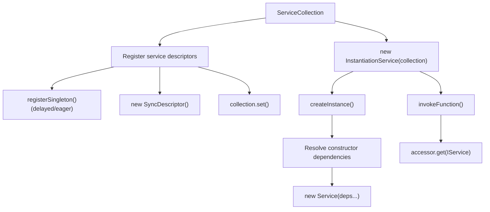
**Example Service Registration**

Desktop main process example:

```
// Direct instance
services.set(IProductService, productService);

// Sync descriptor (lazy)
services.set(IUpdateService, new SyncDescriptor(Win32UpdateService));

// Global singleton registration (in workbench.common.main.ts)
registerSingleton(IMarkerService, MarkerService, InstantiationType.Delayed);
```
Sources: [src/vs/code/electron-main/main.ts162-227](https://github.com/microsoft/vscode/blob/1be3088d/src/vs/code/electron-main/main.ts#L162-L227) [src/vs/workbench/workbench.common.main.ts137-181](https://github.com/microsoft/vscode/blob/1be3088d/src/vs/workbench/workbench.common.main.ts#L137-L181)

### Lifecycle Phases

The main process tracks lifecycle phases via `LifecycleMainService`:

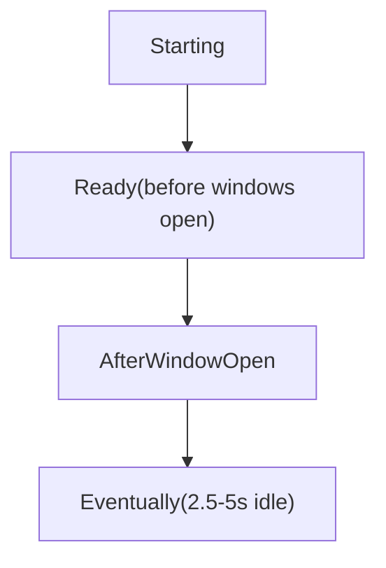
Services can wait for specific phases before executing expensive operations:

-   **Ready**: Before first window opens, for critical initialization
-   **AfterWindowOpen**: After first window, for less critical services
-   **Eventually**: For background tasks that can be deferred

Sources: [src/vs/code/electron-main/app.ts605-627](https://github.com/microsoft/vscode/blob/1be3088d/src/vs/code/electron-main/app.ts#L605-L627) [src/vs/platform/lifecycle/electron-main/lifecycleMainService.ts](https://github.com/microsoft/vscode/blob/1be3088d/src/vs/platform/lifecycle/electron-main/lifecycleMainService.ts)

---

## Multi-Process IPC Architecture

VS Code's multi-process architecture requires IPC for communication between processes.

**IPC Channel Architecture**

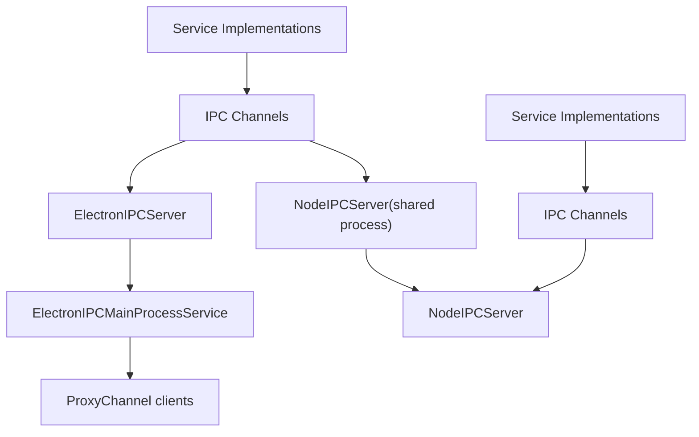
**Common IPC Channels**

| Channel Name | Service | Provider Process |
| --- | --- | --- |
| `logger` | `ILoggerService` | Main |
| `policy` | `IPolicyService` | Main |
| `storage` | `IStorageMainService` | Main |
| `update` | `IUpdateService` | Main |
| `telemetryAppender` | Telemetry | Shared |
| `extensions` | `IExtensionManagementService` | Shared |
| `userDataProfiles` | `IUserDataProfilesService` | Main |

Sources: [src/vs/code/electron-main/app.ts1118-1252](https://github.com/microsoft/vscode/blob/1be3088d/src/vs/code/electron-main/app.ts#L1118-L1252)

### IPC Channel Example

Example of how the Update service is exposed via IPC:

```
// Main process - register channel
const updateChannel = new UpdateChannel(updateService);
mainProcessElectronServer.registerChannel('update', updateChannel);

// Renderer process - create proxy client
const updateChannel = mainProcessService.getChannel('update');
const updateService = ProxyChannel.toService<IUpdateService>(updateChannel);
```
Sources: [src/vs/platform/update/common/updateIpc.ts](https://github.com/microsoft/vscode/blob/1be3088d/src/vs/platform/update/common/updateIpc.ts) [src/vs/code/electron-main/app.ts1189](https://github.com/microsoft/vscode/blob/1be3088d/src/vs/code/electron-main/app.ts#L1189-L1189)

---

## Shared Process

The shared process runs background services shared across all windows, such as extension management and telemetry.

**Shared Process Bootstrap**

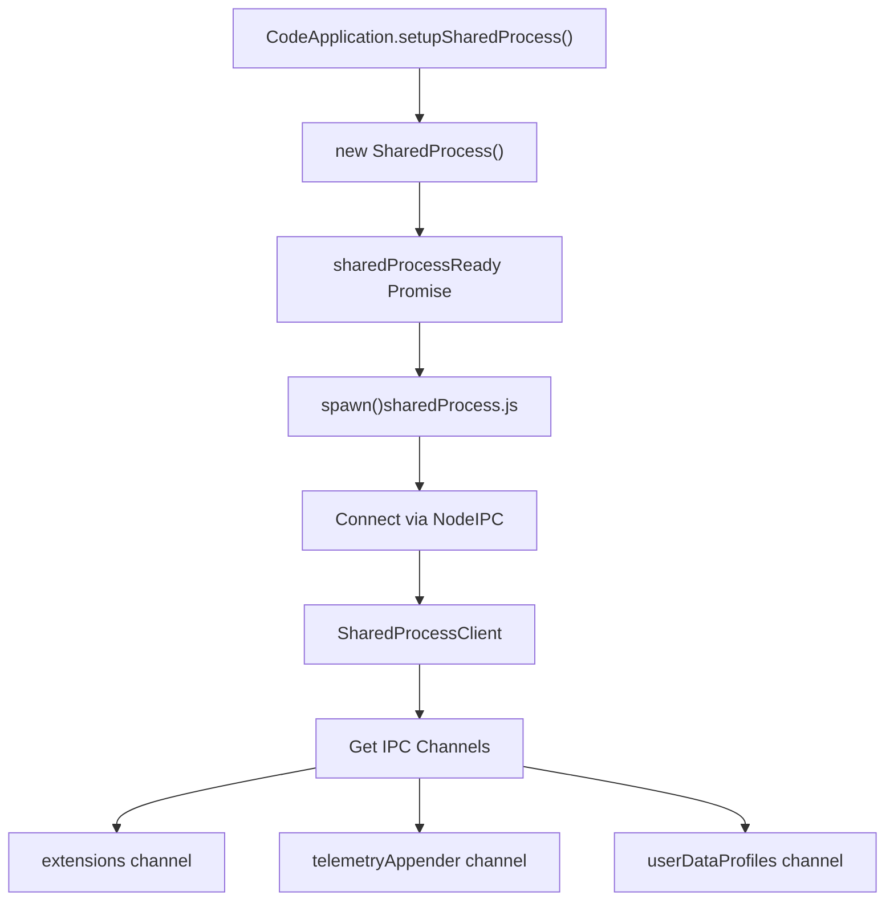
The shared process is spawned lazily when first needed and uses Node.js IPC for communication with the main process.

Sources: [src/vs/code/electron-main/app.ts1254-1310](https://github.com/microsoft/vscode/blob/1be3088d/src/vs/code/electron-main/app.ts#L1254-L1310) [src/vs/platform/sharedProcess/electron-main/sharedProcess.ts](https://github.com/microsoft/vscode/blob/1be3088d/src/vs/platform/sharedProcess/electron-main/sharedProcess.ts)

---

## Window Opening

After service initialization, the main process opens the first window based on command-line arguments.

**openFirstWindow() Logic**

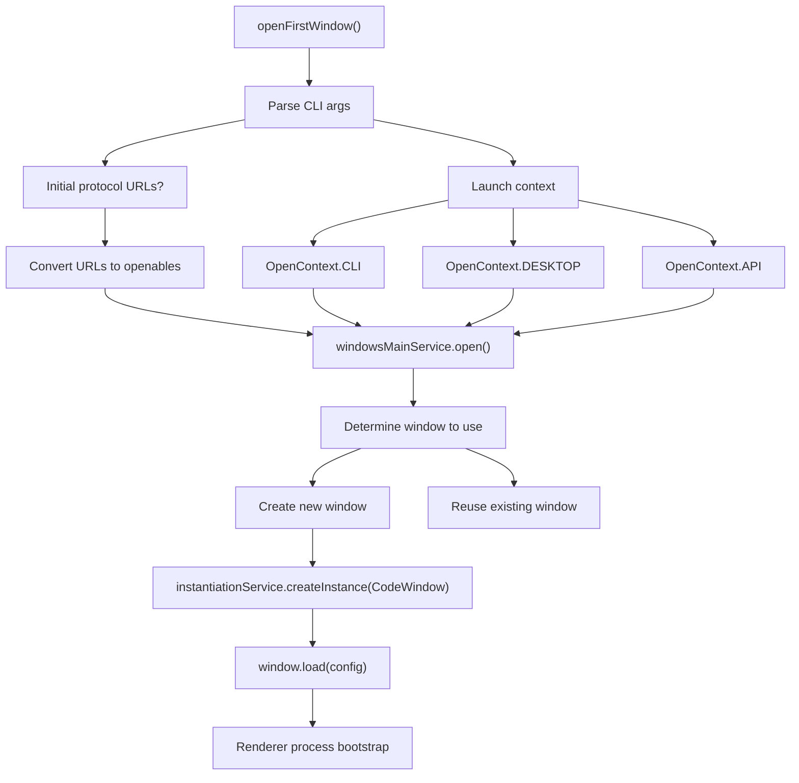
The window configuration (`INativeWindowConfiguration`) is passed to the renderer process and includes:

-   Workspace/folder to open
-   Files to open/create
-   Environment variables
-   Extension development paths
-   User data directory
-   Zoom level

Sources: [src/vs/code/electron-main/app.ts1458-1672](https://github.com/microsoft/vscode/blob/1be3088d/src/vs/code/electron-main/app.ts#L1458-L1672) [src/vs/platform/windows/electron-main/windowsMainService.ts](https://github.com/microsoft/vscode/blob/1be3088d/src/vs/platform/windows/electron-main/windowsMainService.ts)

---

## Summary

VS Code's application lifecycle follows these key principles:

1.  **Multi-Process**: Main, renderer, shared, extension host, and utility processes each have distinct responsibilities
2.  **Service-Oriented**: Dependency injection via `InstantiationService` and `ServiceCollection`
3.  **IPC Communication**: Processes communicate via typed IPC channels (`ElectronIPCServer`, `NodeIPCServer`)
4.  **Lazy Initialization**: Services use `SyncDescriptor` for delayed instantiation
5.  **Lifecycle Phases**: Main process coordinates startup through well-defined phases
6.  **Environment Abstraction**: `IEnvironmentService` abstracts configuration across execution modes
7.  **Instance Locking**: Single-instance enforcement via IPC socket/named pipe

The bootstrap sequence ensures proper ordering of initialization, from low-level services (file system, logging) through high-level services (workbench, extensions), with careful coordination across process boundaries.
