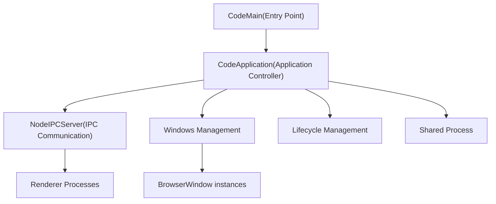
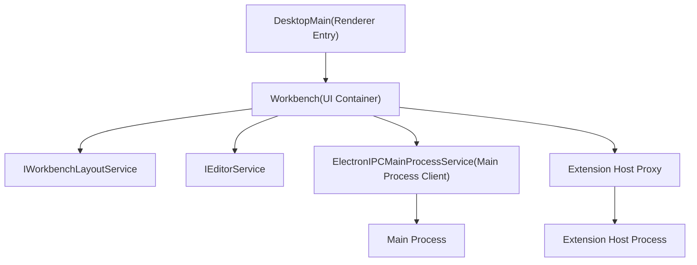
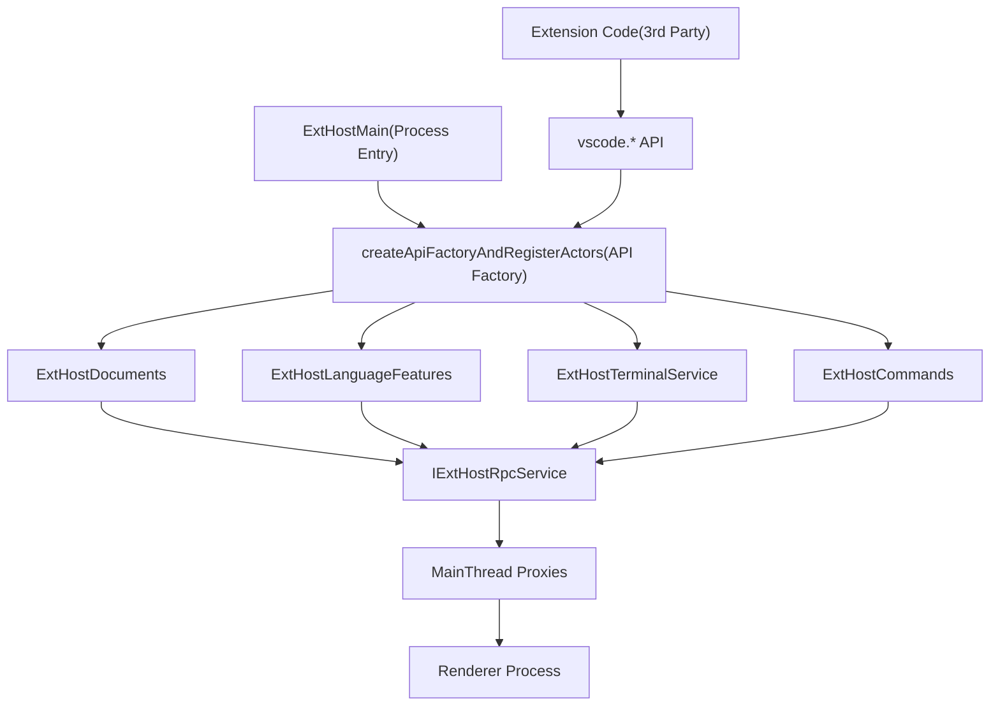
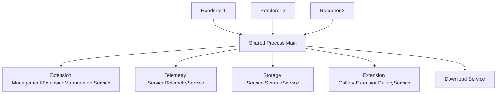
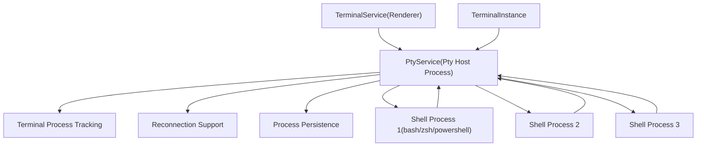
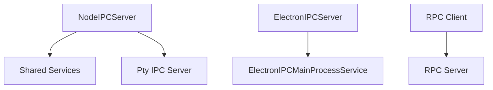
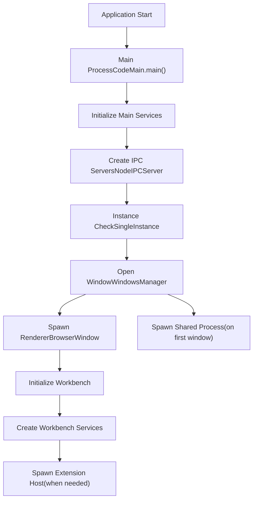
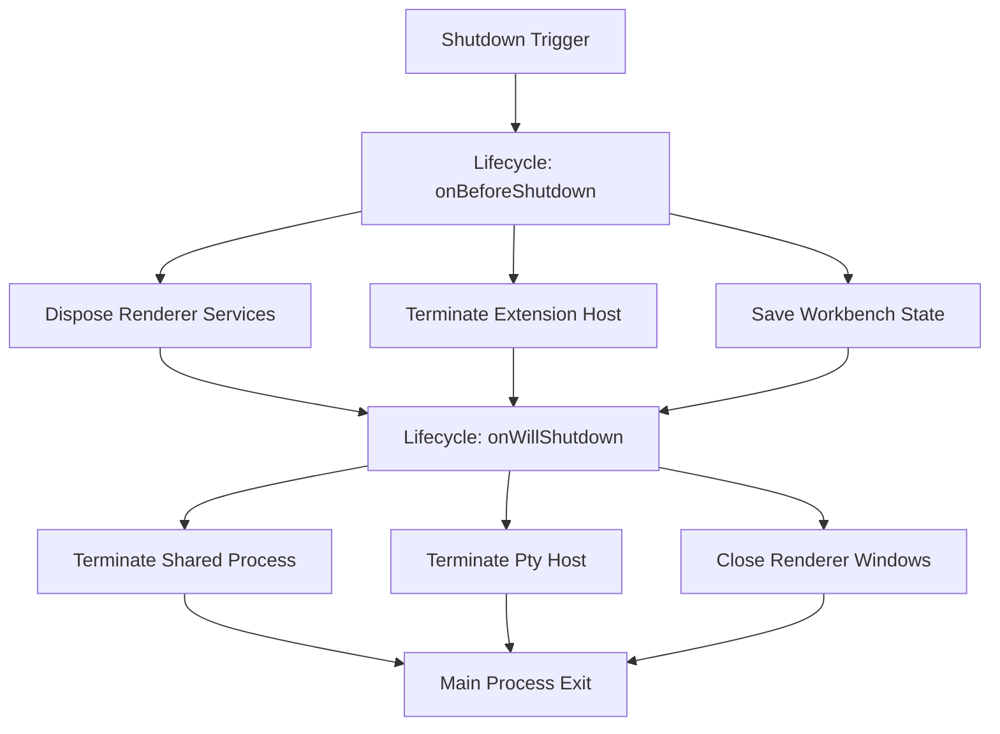

# 多进程架构

Relevant source files

-   [build/lib/i18n.resources.json](https://github.com/microsoft/vscode/blob/1be3088d/build/lib/i18n.resources.json)
-   [cli/src/bin/code/legacy\_args.rs](https://github.com/microsoft/vscode/blob/1be3088d/cli/src/bin/code/legacy_args.rs)
-   [extensions/vscode-api-tests/package.json](https://github.com/microsoft/vscode/blob/1be3088d/extensions/vscode-api-tests/package.json)
-   [extensions/vscode-api-tests/src/singlefolder-tests/chat.test.ts](https://github.com/microsoft/vscode/blob/1be3088d/extensions/vscode-api-tests/src/singlefolder-tests/chat.test.ts)
-   [resources/completions/bash/code](https://github.com/microsoft/vscode/blob/1be3088d/resources/completions/bash/code)
-   [resources/completions/zsh/\_code](https://github.com/microsoft/vscode/blob/1be3088d/resources/completions/zsh/_code)
-   [src/vs/base/node/terminalEncoding.ts](https://github.com/microsoft/vscode/blob/1be3088d/src/vs/base/node/terminalEncoding.ts)
-   [src/vs/code/browser/workbench/workbench-dev.html](https://github.com/microsoft/vscode/blob/1be3088d/src/vs/code/browser/workbench/workbench-dev.html)
-   [src/vs/code/browser/workbench/workbench.html](https://github.com/microsoft/vscode/blob/1be3088d/src/vs/code/browser/workbench/workbench.html)
-   [src/vs/code/browser/workbench/workbench.ts](https://github.com/microsoft/vscode/blob/1be3088d/src/vs/code/browser/workbench/workbench.ts)
-   [src/vs/code/electron-main/app.ts](https://github.com/microsoft/vscode/blob/1be3088d/src/vs/code/electron-main/app.ts)
-   [src/vs/code/electron-main/main.ts](https://github.com/microsoft/vscode/blob/1be3088d/src/vs/code/electron-main/main.ts)
-   [src/vs/code/node/cli.ts](https://github.com/microsoft/vscode/blob/1be3088d/src/vs/code/node/cli.ts)
-   [src/vs/code/node/cliProcessMain.ts](https://github.com/microsoft/vscode/blob/1be3088d/src/vs/code/node/cliProcessMain.ts)
-   [src/vs/editor/common/languages.ts](https://github.com/microsoft/vscode/blob/1be3088d/src/vs/editor/common/languages.ts)
-   [src/vs/platform/environment/common/argv.ts](https://github.com/microsoft/vscode/blob/1be3088d/src/vs/platform/environment/common/argv.ts)
-   [src/vs/platform/environment/common/environment.ts](https://github.com/microsoft/vscode/blob/1be3088d/src/vs/platform/environment/common/environment.ts)
-   [src/vs/platform/environment/common/environmentService.ts](https://github.com/microsoft/vscode/blob/1be3088d/src/vs/platform/environment/common/environmentService.ts)
-   [src/vs/platform/environment/electron-main/environmentMainService.ts](https://github.com/microsoft/vscode/blob/1be3088d/src/vs/platform/environment/electron-main/environmentMainService.ts)
-   [src/vs/platform/environment/node/argv.ts](https://github.com/microsoft/vscode/blob/1be3088d/src/vs/platform/environment/node/argv.ts)
-   [src/vs/platform/environment/node/argvHelper.ts](https://github.com/microsoft/vscode/blob/1be3088d/src/vs/platform/environment/node/argvHelper.ts)
-   [src/vs/platform/environment/node/environmentService.ts](https://github.com/microsoft/vscode/blob/1be3088d/src/vs/platform/environment/node/environmentService.ts)
-   [src/vs/platform/environment/node/stdin.ts](https://github.com/microsoft/vscode/blob/1be3088d/src/vs/platform/environment/node/stdin.ts)
-   [src/vs/platform/extensionManagement/common/extensionManagementCLI.ts](https://github.com/microsoft/vscode/blob/1be3088d/src/vs/platform/extensionManagement/common/extensionManagementCLI.ts)
-   [src/vs/platform/extensions/common/extensionsApiProposals.ts](https://github.com/microsoft/vscode/blob/1be3088d/src/vs/platform/extensions/common/extensionsApiProposals.ts)
-   [src/vs/server/node/remoteExtensionHostAgentCli.ts](https://github.com/microsoft/vscode/blob/1be3088d/src/vs/server/node/remoteExtensionHostAgentCli.ts)
-   [src/vs/server/node/server.cli.ts](https://github.com/microsoft/vscode/blob/1be3088d/src/vs/server/node/server.cli.ts)
-   [src/vs/server/node/serverEnvironmentService.ts](https://github.com/microsoft/vscode/blob/1be3088d/src/vs/server/node/serverEnvironmentService.ts)
-   [src/vs/server/node/serverServices.ts](https://github.com/microsoft/vscode/blob/1be3088d/src/vs/server/node/serverServices.ts)
-   [src/vs/workbench/api/browser/mainThreadChatAgents2.ts](https://github.com/microsoft/vscode/blob/1be3088d/src/vs/workbench/api/browser/mainThreadChatAgents2.ts)
-   [src/vs/workbench/api/browser/mainThreadChatStatus.ts](https://github.com/microsoft/vscode/blob/1be3088d/src/vs/workbench/api/browser/mainThreadChatStatus.ts)
-   [src/vs/workbench/api/browser/mainThreadLanguageFeatures.ts](https://github.com/microsoft/vscode/blob/1be3088d/src/vs/workbench/api/browser/mainThreadLanguageFeatures.ts)
-   [src/vs/workbench/api/common/extHost.api.impl.ts](https://github.com/microsoft/vscode/blob/1be3088d/src/vs/workbench/api/common/extHost.api.impl.ts)
-   [src/vs/workbench/api/common/extHost.protocol.ts](https://github.com/microsoft/vscode/blob/1be3088d/src/vs/workbench/api/common/extHost.protocol.ts)
-   [src/vs/workbench/api/common/extHostChatAgents2.ts](https://github.com/microsoft/vscode/blob/1be3088d/src/vs/workbench/api/common/extHostChatAgents2.ts)
-   [src/vs/workbench/api/common/extHostChatStatus.ts](https://github.com/microsoft/vscode/blob/1be3088d/src/vs/workbench/api/common/extHostChatStatus.ts)
-   [src/vs/workbench/api/common/extHostLanguageFeatures.ts](https://github.com/microsoft/vscode/blob/1be3088d/src/vs/workbench/api/common/extHostLanguageFeatures.ts)
-   [src/vs/workbench/api/common/extHostTypeConverters.ts](https://github.com/microsoft/vscode/blob/1be3088d/src/vs/workbench/api/common/extHostTypeConverters.ts)
-   [src/vs/workbench/api/common/extHostTypes.ts](https://github.com/microsoft/vscode/blob/1be3088d/src/vs/workbench/api/common/extHostTypes.ts)
-   [src/vs/workbench/browser/web.api.ts](https://github.com/microsoft/vscode/blob/1be3088d/src/vs/workbench/browser/web.api.ts)
-   [src/vs/workbench/browser/web.factory.ts](https://github.com/microsoft/vscode/blob/1be3088d/src/vs/workbench/browser/web.factory.ts)
-   [src/vs/workbench/browser/web.main.ts](https://github.com/microsoft/vscode/blob/1be3088d/src/vs/workbench/browser/web.main.ts)
-   [src/vs/workbench/contrib/chat/browser/actions/chatActions.ts](https://github.com/microsoft/vscode/blob/1be3088d/src/vs/workbench/contrib/chat/browser/actions/chatActions.ts)
-   [src/vs/workbench/contrib/chat/browser/actions/chatExecuteActions.ts](https://github.com/microsoft/vscode/blob/1be3088d/src/vs/workbench/contrib/chat/browser/actions/chatExecuteActions.ts)
-   [src/vs/workbench/contrib/chat/browser/actions/chatGettingStarted.ts](https://github.com/microsoft/vscode/blob/1be3088d/src/vs/workbench/contrib/chat/browser/actions/chatGettingStarted.ts)
-   [src/vs/workbench/contrib/chat/browser/chat.contribution.ts](https://github.com/microsoft/vscode/blob/1be3088d/src/vs/workbench/contrib/chat/browser/chat.contribution.ts)
-   [src/vs/workbench/contrib/chat/browser/chat.ts](https://github.com/microsoft/vscode/blob/1be3088d/src/vs/workbench/contrib/chat/browser/chat.ts)
-   [src/vs/workbench/contrib/chat/common/constants.ts](https://github.com/microsoft/vscode/blob/1be3088d/src/vs/workbench/contrib/chat/common/constants.ts)
-   [src/vs/workbench/contrib/chat/test/common/voiceChatService.test.ts](https://github.com/microsoft/vscode/blob/1be3088d/src/vs/workbench/contrib/chat/test/common/voiceChatService.test.ts)
-   [src/vs/workbench/electron-browser/desktop.main.ts](https://github.com/microsoft/vscode/blob/1be3088d/src/vs/workbench/electron-browser/desktop.main.ts)
-   [src/vs/workbench/services/environment/browser/environmentService.ts](https://github.com/microsoft/vscode/blob/1be3088d/src/vs/workbench/services/environment/browser/environmentService.ts)
-   [src/vs/workbench/services/environment/common/environmentService.ts](https://github.com/microsoft/vscode/blob/1be3088d/src/vs/workbench/services/environment/common/environmentService.ts)
-   [src/vs/workbench/services/environment/electron-browser/environmentService.ts](https://github.com/microsoft/vscode/blob/1be3088d/src/vs/workbench/services/environment/electron-browser/environmentService.ts)
-   [src/vs/workbench/services/extensions/electron-browser/nativeExtensionService.ts](https://github.com/microsoft/vscode/blob/1be3088d/src/vs/workbench/services/extensions/electron-browser/nativeExtensionService.ts)
-   [src/vs/workbench/workbench.common.main.ts](https://github.com/microsoft/vscode/blob/1be3088d/src/vs/workbench/workbench.common.main.ts)
-   [src/vs/workbench/workbench.desktop.main.ts](https://github.com/microsoft/vscode/blob/1be3088d/src/vs/workbench/workbench.desktop.main.ts)
-   [src/vs/workbench/workbench.web.main.ts](https://github.com/microsoft/vscode/blob/1be3088d/src/vs/workbench/workbench.web.main.ts)
-   [src/vscode-dts/vscode.d.ts](https://github.com/microsoft/vscode/blob/1be3088d/src/vscode-dts/vscode.d.ts)
-   [src/vscode-dts/vscode.proposed.chatParticipantAdditions.d.ts](https://github.com/microsoft/vscode/blob/1be3088d/src/vscode-dts/vscode.proposed.chatParticipantAdditions.d.ts)
-   [src/vscode-dts/vscode.proposed.chatStatusItem.d.ts](https://github.com/microsoft/vscode/blob/1be3088d/src/vscode-dts/vscode.proposed.chatStatusItem.d.ts)
-   [src/vscode-dts/vscode.proposed.defaultChatParticipant.d.ts](https://github.com/microsoft/vscode/blob/1be3088d/src/vscode-dts/vscode.proposed.defaultChatParticipant.d.ts)
-   [src/vscode-dts/vscode.proposed.inlineCompletionsAdditions.d.ts](https://github.com/microsoft/vscode/blob/1be3088d/src/vscode-dts/vscode.proposed.inlineCompletionsAdditions.d.ts)

This document describes VS Code's multi-process architecture, explaining how the application separates concerns across different operating system processes to achieve stability, security, and isolation. This architecture is primarily relevant to the Electron desktop version of VS Code.

For information about how services are instantiated and connected within these processes, see [Service Initialization and Dependency Injection](/microsoft/vscode/3.5-service-initialization-and-dependency-injection). For details on the extension system's RPC communication, see [Extension Host Architecture and RPC Protocol](/microsoft/vscode/5.1-layout-system-and-parts). For terminal-specific process management, see [Terminal Architecture Overview](/microsoft/vscode/6.1-extension-host-architecture-and-rpc-protocol).

## 概览

VS Code employs a multi-process architecture based on Chromium/Electron's design. The application separates execution into multiple operating system processes:

-   **Main Process**: Native Node.js process managing application lifecycle and windows
-   **Renderer Process(es)**: Chromium renderer processes hosting the workbench UI (one per window)
-   **Extension Host Process**: Isolated Node.js process running third-party extension code
-   **Shared Process**: Long-running Node.js process hosting services shared across windows
-   **Pty Host Process**: Specialized process managing terminal shell processes

This separation provides crash isolation (extension or terminal crashes don't affect the main UI), security boundaries (untrusted code runs in separate processes), and resource management (processes can be independently managed and restarted).

Sources: [src/vs/code/electron-main/app.ts](https://github.com/microsoft/vscode/blob/1be3088d/src/vs/code/electron-main/app.ts) [src/vs/workbench/api/common/extHost.protocol.ts](https://github.com/microsoft/vscode/blob/1be3088d/src/vs/workbench/api/common/extHost.protocol.ts)

## Process Type Breakdown

### Main Process


The main process is the application entry point and orchestrates the entire application lifecycle. It is a native Node.js process with full system access.

**Key Responsibilities:**

-   **Window Management**: Creates and manages `BrowserWindow` instances for each editor window
-   **Application Lifecycle**: Handles startup, shutdown, updates, and system integration
-   **IPC Server**: Hosts `NodeIPCServer` to coordinate communication with other processes
-   **Menu and Native UI**: Manages native menus, dialogs, and system tray
-   **Instance Claiming**: Ensures single instance behavior and handles command-line arguments from new instances

**Key Classes:**

-   `CodeMain` [src/vs/code/electron-main/main.ts](https://github.com/microsoft/vscode/blob/1be3088d/src/vs/code/electron-main/main.ts) - Entry point
-   `CodeApplication` [src/vs/code/electron-main/app.ts62-1107](https://github.com/microsoft/vscode/blob/1be3088d/src/vs/code/electron-main/app.ts#L62-L1107) - Main application controller
-   `NodeIPCServer` [src/vs/base/parts/ipc/node/ipc.net.js](https://github.com/microsoft/vscode/blob/1be3088d/src/vs/base/parts/ipc/node/ipc.net.js) - IPC server implementation

The main process initializes services via dependency injection and creates the IPC server that other processes connect to. When a renderer needs to communicate with the main process, it uses `ElectronIPCServer` which bridges Electron's IPC mechanism.

**Process Creation:**

```
app.on('ready')
  → CodeMain.main()
  → CodeApplication.startup()
  → WindowsManager.openWindow()
  → BrowserWindow.create()
```
Sources: [src/vs/code/electron-main/main.ts](https://github.com/microsoft/vscode/blob/1be3088d/src/vs/code/electron-main/main.ts) [src/vs/code/electron-main/app.ts62-1107](https://github.com/microsoft/vscode/blob/1be3088d/src/vs/code/electron-main/app.ts#L62-L1107)

### Renderer Process


Each renderer process hosts a workbench instance - the complete VS Code UI including editors, panels, sidebars, and status bar. This is a Chromium renderer process with a Node.js integration layer.

**Key Responsibilities:**

-   **UI Rendering**: Renders all visual components using DOM and Monaco editor
-   **User Input Handling**: Processes keyboard, mouse, and touch input
-   **Editor Management**: Hosts text editors, diff editors, custom editors
-   **View Management**: Manages sidebars, panels, and auxiliary windows
-   **Service Layer**: Runs workbench-level services (editor service, layout service, etc.)

**Key Classes:**

-   `DesktopMain` - Renderer entry point for desktop
-   `Workbench` [src/vs/workbench/browser/workbench.ts](https://github.com/microsoft/vscode/blob/1be3088d/src/vs/workbench/browser/workbench.ts) - Main UI container
-   `IEditorService` - Editor lifecycle management
-   `IWorkbenchLayoutService` - Layout and part management

**Communication Paths:**

-   **To Main Process**: Via `ElectronIPCMainProcessService` using Electron IPC
-   **To Extension Host**: Via RPC protocol defined in `extHost.protocol.ts`
-   **To Shared Process**: Via IPC channels for shared services

Multiple renderer processes can exist simultaneously (one per window). Each is sandboxed and cannot directly access the file system without going through the main process.

Sources: [src/vs/workbench/browser/web.main.ts](https://github.com/microsoft/vscode/blob/1be3088d/src/vs/workbench/browser/web.main.ts) [src/vs/workbench/browser/workbench.ts](https://github.com/microsoft/vscode/blob/1be3088d/src/vs/workbench/browser/workbench.ts)

### Extension Host Process


The extension host is an isolated Node.js process that executes third-party extension code. This isolation is critical for stability - extension crashes cannot bring down the UI.

**Key Responsibilities:**

-   **Extension Execution**: Loads and runs extension JavaScript/TypeScript code
-   **API Surface**: Provides the `vscode.*` API to extensions
-   **Extension Host Services**: Maintains extension-side state (documents, editors, etc.)
-   **RPC Client**: Communicates with renderer via message passing
-   **Resource Management**: Manages extension lifecycle and disposal

**Key Classes:**

-   `ExtHostMain` - Extension host entry point
-   `createApiFactoryAndRegisterActors` [src/vs/workbench/api/common/extHost.api.impl.ts132-1058](https://github.com/microsoft/vscode/blob/1be3088d/src/vs/workbench/api/common/extHost.api.impl.ts#L132-L1058) - Creates the vscode API
-   `IExtHostRpcService` - RPC protocol implementation
-   `ExtHostDocuments` [src/vs/workbench/api/common/extHostDocuments.ts](https://github.com/microsoft/vscode/blob/1be3088d/src/vs/workbench/api/common/extHostDocuments.ts) - Document synchronization
-   `ExtHostLanguageFeatures` [src/vs/workbench/api/common/extHostLanguageFeatures.ts](https://github.com/microsoft/vscode/blob/1be3088d/src/vs/workbench/api/common/extHostLanguageFeatures.ts) - Language feature providers
-   `ExtHostTerminalService` [src/vs/workbench/api/common/extHostTerminalService.ts](https://github.com/microsoft/vscode/blob/1be3088d/src/vs/workbench/api/common/extHostTerminalService.ts) - Terminal API implementation

**RPC Protocol:**

The extension host communicates with the renderer via a bidirectional RPC protocol defined in `extHost.protocol.ts`. This protocol uses message passing with typed interfaces:

-   **MainThread...Shape**: Interfaces for renderer-side implementations
-   **ExtHost...Shape**: Interfaces for extension host-side implementations
-   **ProxyIdentifier**: Type-safe references for RPC endpoints

For example, when an extension calls `vscode.window.showInformationMessage()`:

1.  Call goes to `ExtHostMessageService` in extension host
2.  `ExtHostMessageService` sends RPC message to `MainThreadMessageService` in renderer
3.  Renderer shows notification and sends response back

**Process Spawning:**

```
Main Process
  → spawn Node.js process
  → env: VSCODE_PARENT_PID
  → execute: bootstrap-fork.js
  → load: extensionHostProcess.js
  → initialize RPC connection
```
Sources: [src/vs/workbench/api/common/extHost.api.impl.ts132-1058](https://github.com/microsoft/vscode/blob/1be3088d/src/vs/workbench/api/common/extHost.api.impl.ts#L132-L1058) [src/vs/workbench/api/common/extHost.protocol.ts](https://github.com/microsoft/vscode/blob/1be3088d/src/vs/workbench/api/common/extHost.protocol.ts) [src/vs/workbench/api/common/extHostLanguageFeatures.ts](https://github.com/microsoft/vscode/blob/1be3088d/src/vs/workbench/api/common/extHostLanguageFeatures.ts)

### Shared Process


The shared process is a long-running Node.js process that hosts services shared across all windows. This avoids duplicating expensive operations like extension scanning or telemetry batching.

**Key Responsibilities:**

-   **Extension Management**: Scans, installs, uninstalls extensions (one instance for all windows)
-   **Telemetry**: Aggregates and sends telemetry data
-   **Storage**: Manages shared storage (global state)
-   **Extension Gallery**: Communicates with marketplace
-   **Downloads**: Manages extension and update downloads

**Service Location:**

Services in the shared process are accessed via IPC channels:

-   Each renderer gets a channel to the shared process
-   Channels are created via `getDelayedChannel` or `ProxyChannel`
-   Services are registered by identifier (e.g., `IExtensionManagementService`)

**Lifecycle:**

The shared process is created by the main process on first window open and remains alive until application shutdown, even if all windows close. This persistence enables background operations like extension updates.

Sources: [src/vs/code/electron-main/app.ts](https://github.com/microsoft/vscode/blob/1be3088d/src/vs/code/electron-main/app.ts)

### Pty Host Process


The pty (pseudoterminal) host is a specialized Node.js process that manages terminal shell processes. It provides crash isolation - if a shell process crashes or hangs, it doesn't affect the renderer.

**Key Responsibilities:**

-   **Shell Process Management**: Spawns and manages shell processes (bash, zsh, PowerShell, etc.)
-   **PTY Management**: Creates and manages pseudoterminal pairs
-   **Data Flow**: Streams terminal input/output between shell and renderer
-   **Process Persistence**: Supports terminal reconnection across window reloads
-   **Environment Handling**: Manages shell environment variables and working directories

**Key Classes:**

-   `PtyService` [src/vs/platform/terminal/node/ptyService.ts63-1090](https://github.com/microsoft/vscode/blob/1be3088d/src/vs/platform/terminal/node/ptyService.ts#L63-L1090) - Main pty host service
-   `TerminalProcess` [src/vs/platform/terminal/node/terminalProcess.ts](https://github.com/microsoft/vscode/blob/1be3088d/src/vs/platform/terminal/node/terminalProcess.ts) - Individual shell process wrapper
-   `TerminalProcessManager` [src/vs/workbench/contrib/terminal/browser/terminalProcessManager.ts38-722](https://github.com/microsoft/vscode/blob/1be3088d/src/vs/workbench/contrib/terminal/browser/terminalProcessManager.ts#L38-L722) - Renderer-side process coordinator

**Communication Flow:**

```
User types in terminal
  → TerminalInstance (Renderer)
  → TerminalProcessManager.write()
  → IPC to PtyService
  → write to PTY master
  → Shell receives input

Shell outputs data
  → PTY master receives data
  → PtyService buffers and sends via IPC
  → TerminalProcessManager receives
  → TerminalInstance.xterm.write()
  → XtermTerminal renders
```
**Process Spawning:**

The pty host is spawned by the main process when the first terminal is created:

```
TerminalService.createTerminal()
  → TerminalInstanceService.createInstance()
  → TerminalBackend.getBackend()
  → spawn pty host process (if not exists)
  → establish IPC connection
```
**Reconnection Support:**

The pty host maintains a registry of active terminals by ID, enabling reconnection:

-   Terminals persist across window reloads
-   Layout information stored in `ITerminalsLayoutInfo`
-   Process reconnection via `IReconnectionProperties`
-   Supports "revive on exit" and "revive on window close" modes

Sources: [src/vs/platform/terminal/node/ptyService.ts63-1090](https://github.com/microsoft/vscode/blob/1be3088d/src/vs/platform/terminal/node/ptyService.ts#L63-L1090) [src/vs/workbench/contrib/terminal/browser/terminalProcessManager.ts38-722](https://github.com/microsoft/vscode/blob/1be3088d/src/vs/workbench/contrib/terminal/browser/terminalProcessManager.ts#L38-L722) [src/vs/workbench/contrib/terminal/browser/terminalInstance.ts](https://github.com/microsoft/vscode/blob/1be3088d/src/vs/workbench/contrib/terminal/browser/terminalInstance.ts)

## IPC Communication Mechanisms


VS Code uses multiple IPC mechanisms depending on the process types communicating:

### Electron IPC (Main ↔ Renderer)

**Mechanism**: Electron's built-in IPC using `ipcMain` and `ipcRenderer`

**Implementation**:

-   `ElectronIPCServer` [src/vs/base/parts/ipc/electron-main/ipc.electron.ts](https://github.com/microsoft/vscode/blob/1be3088d/src/vs/base/parts/ipc/electron-main/ipc.electron.ts) in main process
-   `ElectronIPCMainProcessService` in renderer process
-   Uses Electron's message passing over named channels

**Key APIs**:

-   `validatedIpcMain.handle()` - Register IPC handlers in main process
-   `ipcRenderer.invoke()` - Call from renderer to main
-   Messages are automatically serialized/deserialized

### Node IPC (Main ↔ Shared/Pty Host)

**Mechanism**: Node.js IPC over Unix domain sockets or named pipes

**Implementation**:

-   `NodeIPCServer` [src/vs/base/parts/ipc/node/ipc.net.ts](https://github.com/microsoft/vscode/blob/1be3088d/src/vs/base/parts/ipc/node/ipc.net.ts) creates IPC server
-   Processes connect via `Client` to server's socket path
-   Bi-directional message passing with multiplexed channels

**Server Setup**:

```
const server = new NodeIPCServer('vscode-shared-process');
server.registerChannel('extensionManagement', extensionManagementChannel);
```
**Client Connection**:

```
const client = new Client(socketPath);
const channel = client.getChannel('extensionManagement');
```
### RPC Protocol (Renderer ↔ Extension Host)

**Mechanism**: Custom RPC protocol over MessagePort or WebWorker message passing

**Protocol Definition**: `extHost.protocol.ts` [src/vs/workbench/api/common/extHost.protocol.ts1-2750](https://github.com/microsoft/vscode/blob/1be3088d/src/vs/workbench/api/common/extHost.protocol.ts#L1-L2750)

**Key Interfaces**:

-   `MainThread...Shape` - Methods callable from extension host
-   `ExtHost...Shape` - Methods callable from renderer
-   `IRPCProtocol` - Protocol implementation interface

**Message Structure**:

```
interface RPCMessage {
  type: MessageType.Request | Response | ...
  id: number  // For request/response matching
  proxyId: ProxyIdentifier
  methodName: string
  args: any[]
}
```
**Proxy Pattern**:

Both sides use proxies to make RPC calls appear local:

```
// Renderer side
const proxy = rpcProtocol.getProxy(ExtHostContext.ExtHostDocuments);
await proxy.$acceptModelChanged(...);

// Extension host side - implementation
class ExtHostDocuments {
  $acceptModelChanged(...) {
    // Update local state
  }
}
```
**Data Marshalling**:

The protocol handles serialization of complex types:

-   `URI` → `UriComponents`
-   `Range` → `IRange` (plain object)
-   `Buffer` → `VSBuffer` (optimized transfer)
-   Circular references detected and prevented

**Type Converters**: [src/vs/workbench/api/common/extHostTypeConverters.ts](https://github.com/microsoft/vscode/blob/1be3088d/src/vs/workbench/api/common/extHostTypeConverters.ts) provides bidirectional conversion between VS Code types and protocol DTOs.

### Channel-based Communication

VS Code uses a **channel pattern** for organizing IPC services:

**Channel Interface**:

```
interface IChannel {
  call<T>(command: string, args?: any): Promise<T>;
  listen<T>(event: string, args?: any): Event<T>;
}
```
**Example Channels**:

-   `LOCAL_FILE_SYSTEM_CHANNEL_NAME` - File system operations
-   `ipcExtensionHostStarterChannelName` - Extension host lifecycle
-   `ipcBrowserViewChannelName` - Browser view management

Channels enable:

-   **Service Multiplexing**: Multiple services over one IPC connection
-   **Type Safety**: Strongly-typed service interfaces
-   **Lazy Connection**: Channels created on first use via `getDelayedChannel`

Sources: [src/vs/base/parts/ipc/electron-main/ipc.electron.ts](https://github.com/microsoft/vscode/blob/1be3088d/src/vs/base/parts/ipc/electron-main/ipc.electron.ts) [src/vs/base/parts/ipc/node/ipc.net.ts](https://github.com/microsoft/vscode/blob/1be3088d/src/vs/base/parts/ipc/node/ipc.net.ts) [src/vs/workbench/api/common/extHost.protocol.ts1-2750](https://github.com/microsoft/vscode/blob/1be3088d/src/vs/workbench/api/common/extHost.protocol.ts#L1-L2750) [src/vs/workbench/api/common/extHostTypeConverters.ts](https://github.com/microsoft/vscode/blob/1be3088d/src/vs/workbench/api/common/extHostTypeConverters.ts)

## Process Lifecycle

### Startup Sequence


**Detailed Steps:**

1.  **Main Process Initialization** [src/vs/code/electron-main/main.ts](https://github.com/microsoft/vscode/blob/1be3088d/src/vs/code/electron-main/main.ts)

    -   `CodeMain.main()` entry point
    -   Parse command-line arguments via `NativeParsedArgs`
    -   Initialize logging and crash reporting
    -   Load product configuration
2.  **Service Creation** [src/vs/code/electron-main/app.ts200-500](https://github.com/microsoft/vscode/blob/1be3088d/src/vs/code/electron-main/app.ts#L200-L500)

    -   Create `ServiceCollection`
    -   Instantiate platform services (IEnvironmentService, ILogService, etc.)
    -   Register IPC channels for main process services
    -   Initialize `CodeApplication`
3.  **IPC Server Setup**

    -   Create `NodeIPCServer` for shared/pty host communication
    -   Create `ElectronIPCServer` for renderer communication
    -   Register service channels
4.  **Window Opening** [src/vs/code/electron-main/app.ts700-900](https://github.com/microsoft/vscode/blob/1be3088d/src/vs/code/electron-main/app.ts#L700-L900)

    -   `CodeApplication.startup()`
    -   Check for existing instance via `IInstanceService`
    -   If single instance, delegate to existing instance
    -   Otherwise, open window via `WindowsMainService`
5.  **Renderer Bootstrap**

    -   Create `BrowserWindow` with preload script
    -   Load `index.html` (workbench entry point)
    -   Execute workbench bootstrap code
6.  **Workbench Initialization** [src/vs/workbench/browser/workbench.ts](https://github.com/microsoft/vscode/blob/1be3088d/src/vs/workbench/browser/workbench.ts)

    -   Create renderer-side service collection
    -   Instantiate `Workbench` class
    -   Initialize layout (parts: sidebar, panel, editor area)
    -   Load saved layout state
7.  **Extension Host Spawn**

    -   First extension activation triggers spawn
    -   Main process spawns Node.js process
    -   Extension host connects via RPC
    -   Load and activate extensions
8.  **Shared Process Spawn** [src/vs/code/electron-main/app.ts](https://github.com/microsoft/vscode/blob/1be3088d/src/vs/code/electron-main/app.ts)

    -   Spawned on first window open
    -   Connects via Node IPC
    -   Initializes shared services
    -   Remains alive for application lifetime

### Window Reload

When a window reloads (e.g., after extension install):

1.  Renderer disposes all services
2.  Extension host is terminated
3.  New renderer loads in same BrowserWindow
4.  New extension host spawned
5.  Terminals reconnect to existing pty host processes

### Shutdown Sequence


**Lifecycle Events**:

-   `onBeforeShutdown`: Veto-able event, can prevent shutdown
-   `onWillShutdown`: Guaranteed shutdown, perform cleanup
-   `onDidShutdown`: After all processes terminated

**Cleanup Priorities**:

1.  Save user data (open editors, terminal states)
2.  Flush telemetry
3.  Dispose renderer services
4.  Terminate child processes
5.  Close main process

**Terminal Persistence**:

Terminals can be configured to persist via `IReconnectionProperties`:

-   `persistentSessionReviveProcess` setting controls when terminals revive
-   Pty host maintains process registry
-   On next startup, renderers reconnect to existing shells

Sources: [src/vs/code/electron-main/main.ts](https://github.com/microsoft/vscode/blob/1be3088d/src/vs/code/electron-main/main.ts) [src/vs/code/electron-main/app.ts200-900](https://github.com/microsoft/vscode/blob/1be3088d/src/vs/code/electron-main/app.ts#L200-L900) [src/vs/workbench/browser/workbench.ts](https://github.com/microsoft/vscode/blob/1be3088d/src/vs/workbench/browser/workbench.ts)

## Process Crash Recovery

### Extension Host Crashes

When the extension host crashes:

1.  Renderer detects connection loss via RPC protocol
2.  `IExtensionService.onDidChangeExtensionsStatus` fires
3.  User sees notification: "Extension host terminated unexpectedly"
4.  Option to reload window or continue without extensions
5.  If reloaded, new extension host spawned

**Auto-restart**: Not enabled by default to prevent crash loops from bad extensions.

### Renderer Crashes

If a renderer process crashes:

1.  Main process detects via Electron's `BrowserWindow` events
2.  Window closes automatically
3.  User prompted to reopen or close
4.  Other windows remain unaffected (isolated)

### Pty Host Crashes

Terminal process isolation ensures:

1.  Shell process continues running (pty host independent)
2.  Renderer detects pty host crash
3.  New pty host spawned automatically
4.  Terminals attempt reconnection
5.  If reconnection fails, terminal shows disconnected state

### Shared Process Crashes

1.  Main process monitors shared process
2.  If crash detected, automatic restart
3.  Renderers re-establish connections
4.  Some state may be lost (in-progress operations)

Sources: [src/vs/workbench/contrib/terminal/browser/terminalProcessManager.ts](https://github.com/microsoft/vscode/blob/1be3088d/src/vs/workbench/contrib/terminal/browser/terminalProcessManager.ts) [src/vs/workbench/api/common/extHost.protocol.ts](https://github.com/microsoft/vscode/blob/1be3088d/src/vs/workbench/api/common/extHost.protocol.ts)

## Security Boundaries

The multi-process architecture enforces security isolation:

| Process | Trust Level | Capabilities | Restrictions |
| --- | --- | --- | --- |
| Main | Full Trust | Full system access, native APIs | None |
| Renderer | Sandboxed | DOM, limited Node.js APIs | No direct file system access |
| Extension Host | Untrusted Code | Node.js APIs, controlled vscode API | Cannot access renderer DOM directly |
| Shared Process | Trusted | File system, network | Cannot interact with windows directly |
| Pty Host | Trusted | Process spawning, pty management | Limited to terminal operations |

**Key Security Features:**

-   Extension host cannot directly manipulate UI (must go through RPC)
-   Renderers cannot directly access file system (must go through main process)
-   Extensions cannot access other extensions' state
-   RPC protocol validates all messages and types

**Context Isolation**: Electron's `contextIsolation` ensures renderer processes have limited Node.js access, with preload scripts providing controlled bridges.

Sources: [src/vs/code/electron-main/app.ts](https://github.com/microsoft/vscode/blob/1be3088d/src/vs/code/electron-main/app.ts) [src/vs/workbench/api/common/extHost.protocol.ts](https://github.com/microsoft/vscode/blob/1be3088d/src/vs/workbench/api/common/extHost.protocol.ts)

## Web vs Desktop Differences

While the desktop version uses the multi-process architecture described above, the web version has a different model:

| Aspect | Desktop (Electron) | Web (Browser) |
| --- | --- | --- |
| Main Process | Separate Node.js process | None (browser controls windows) |
| Renderer | Chromium renderer with Node.js | Pure web renderer, no Node.js |
| Extension Host | Separate Node.js process | Web Worker |
| Shared Process | Separate Node.js process | None (or remote server) |
| Pty Host | Separate Node.js process | Remote server |

**Web Architecture Key Points**:

-   Extension host runs in a Web Worker (limited APIs)
-   No direct file system access (uses virtual file systems)
-   Terminal backend runs on remote server
-   All IPC replaced with MessageChannel/MessagePort

The web version's architecture is covered in more detail in [Web Workbench Bootstrap](/microsoft/vscode/3.4-web-workbench-bootstrap).

Sources: [src/vs/workbench/browser/web.main.ts](https://github.com/microsoft/vscode/blob/1be3088d/src/vs/workbench/browser/web.main.ts)
