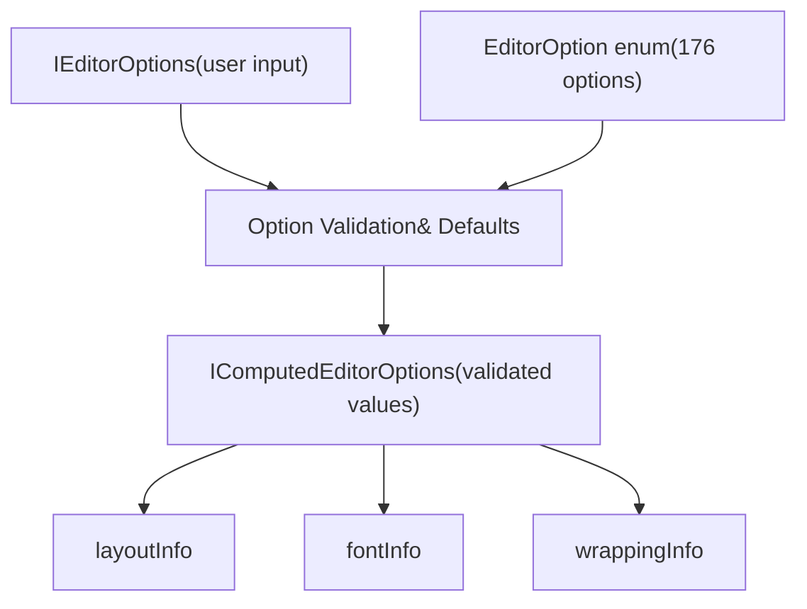
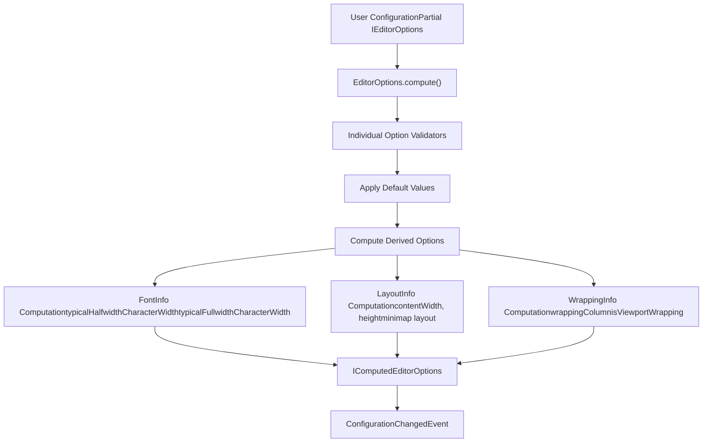
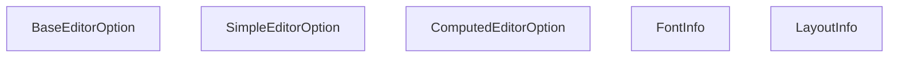
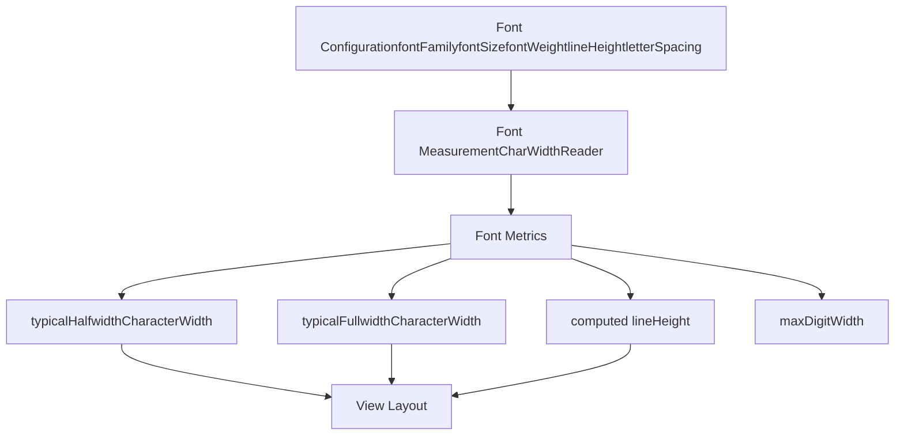
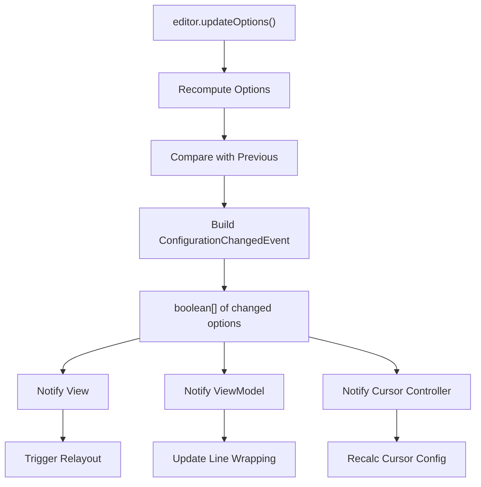
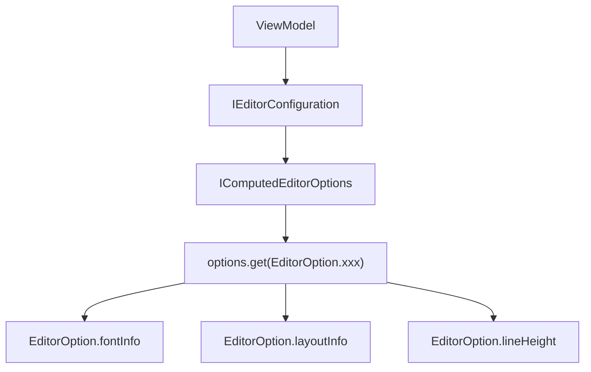
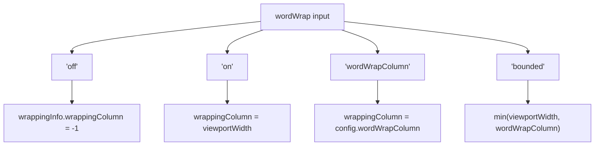
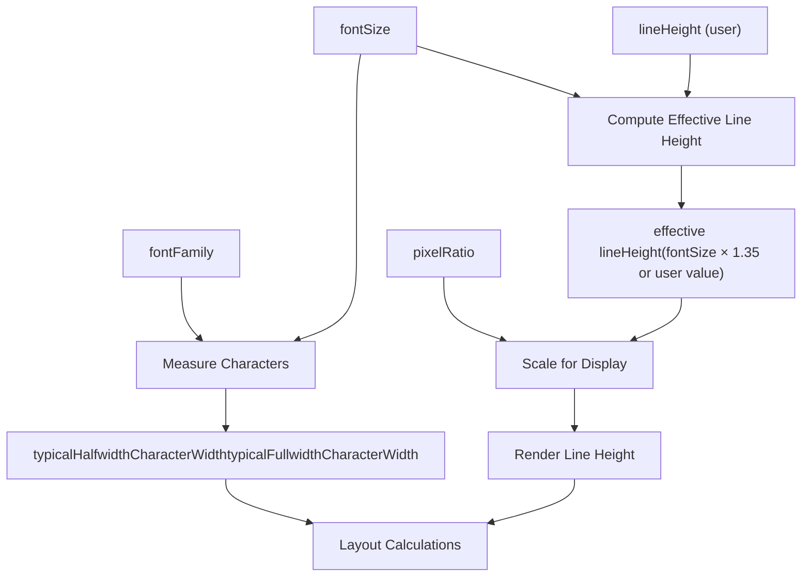
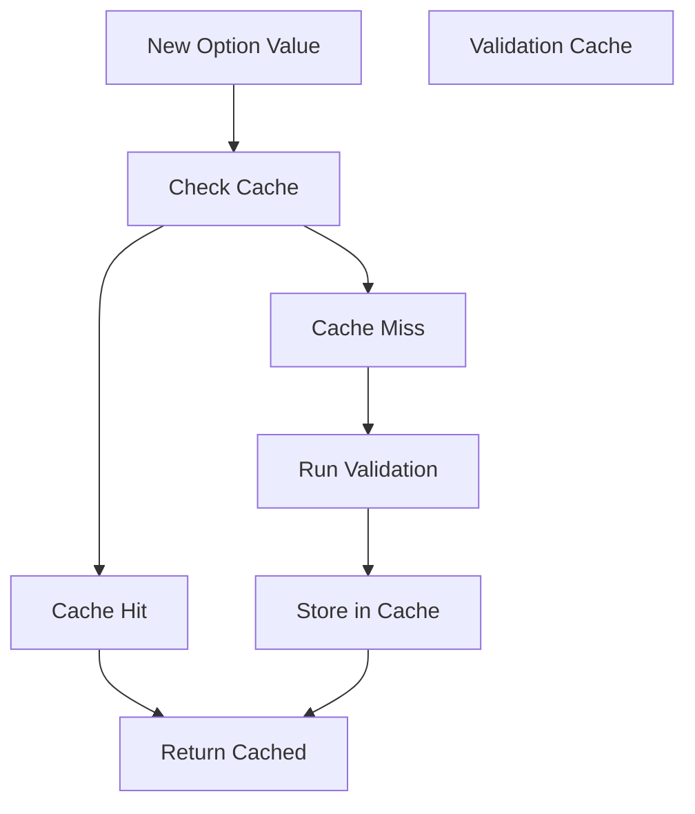

# Editor Configuration and Options

Relevant source files

-   [build/monaco/monaco.d.ts.recipe](https://github.com/microsoft/vscode/blob/1be3088d/build/monaco/monaco.d.ts.recipe)
-   [extensions/vscode-colorize-perf-tests/test/colorize-fixtures/test-treeView.ts](https://github.com/microsoft/vscode/blob/1be3088d/extensions/vscode-colorize-perf-tests/test/colorize-fixtures/test-treeView.ts)
-   [src/vs/editor/browser/config/charWidthReader.ts](https://github.com/microsoft/vscode/blob/1be3088d/src/vs/editor/browser/config/charWidthReader.ts)
-   [src/vs/editor/browser/editorBrowser.ts](https://github.com/microsoft/vscode/blob/1be3088d/src/vs/editor/browser/editorBrowser.ts)
-   [src/vs/editor/browser/view/domLineBreaksComputer.ts](https://github.com/microsoft/vscode/blob/1be3088d/src/vs/editor/browser/view/domLineBreaksComputer.ts)
-   [src/vs/editor/browser/view/renderingContext.ts](https://github.com/microsoft/vscode/blob/1be3088d/src/vs/editor/browser/view/renderingContext.ts)
-   [src/vs/editor/browser/viewParts/contentWidgets/contentWidgets.ts](https://github.com/microsoft/vscode/blob/1be3088d/src/vs/editor/browser/viewParts/contentWidgets/contentWidgets.ts)
-   [src/vs/editor/browser/viewParts/margin/margin.ts](https://github.com/microsoft/vscode/blob/1be3088d/src/vs/editor/browser/viewParts/margin/margin.ts)
-   [src/vs/editor/browser/viewParts/minimap/minimap.ts](https://github.com/microsoft/vscode/blob/1be3088d/src/vs/editor/browser/viewParts/minimap/minimap.ts)
-   [src/vs/editor/browser/viewParts/minimap/minimapCharRenderer.ts](https://github.com/microsoft/vscode/blob/1be3088d/src/vs/editor/browser/viewParts/minimap/minimapCharRenderer.ts)
-   [src/vs/editor/browser/viewParts/minimap/minimapCharRendererFactory.ts](https://github.com/microsoft/vscode/blob/1be3088d/src/vs/editor/browser/viewParts/minimap/minimapCharRendererFactory.ts)
-   [src/vs/editor/browser/viewParts/minimap/minimapCharSheet.ts](https://github.com/microsoft/vscode/blob/1be3088d/src/vs/editor/browser/viewParts/minimap/minimapCharSheet.ts)
-   [src/vs/editor/browser/viewParts/minimap/minimapPreBaked.ts](https://github.com/microsoft/vscode/blob/1be3088d/src/vs/editor/browser/viewParts/minimap/minimapPreBaked.ts)
-   [src/vs/editor/browser/viewParts/overlayWidgets/overlayWidgets.ts](https://github.com/microsoft/vscode/blob/1be3088d/src/vs/editor/browser/viewParts/overlayWidgets/overlayWidgets.ts)
-   [src/vs/editor/browser/viewParts/scrollDecoration/scrollDecoration.ts](https://github.com/microsoft/vscode/blob/1be3088d/src/vs/editor/browser/viewParts/scrollDecoration/scrollDecoration.ts)
-   [src/vs/editor/browser/viewParts/viewZones/viewZones.ts](https://github.com/microsoft/vscode/blob/1be3088d/src/vs/editor/browser/viewParts/viewZones/viewZones.ts)
-   [src/vs/editor/common/config/editorOptions.ts](https://github.com/microsoft/vscode/blob/1be3088d/src/vs/editor/common/config/editorOptions.ts)
-   [src/vs/editor/common/config/fontInfo.ts](https://github.com/microsoft/vscode/blob/1be3088d/src/vs/editor/common/config/fontInfo.ts)
-   [src/vs/editor/common/editorCommon.ts](https://github.com/microsoft/vscode/blob/1be3088d/src/vs/editor/common/editorCommon.ts)
-   [src/vs/editor/common/model.ts](https://github.com/microsoft/vscode/blob/1be3088d/src/vs/editor/common/model.ts)
-   [src/vs/editor/common/model/guidesTextModelPart.ts](https://github.com/microsoft/vscode/blob/1be3088d/src/vs/editor/common/model/guidesTextModelPart.ts)
-   [src/vs/editor/common/model/textModel.ts](https://github.com/microsoft/vscode/blob/1be3088d/src/vs/editor/common/model/textModel.ts)
-   [src/vs/editor/common/modelLineProjectionData.ts](https://github.com/microsoft/vscode/blob/1be3088d/src/vs/editor/common/modelLineProjectionData.ts)
-   [src/vs/editor/common/standalone/standaloneEnums.ts](https://github.com/microsoft/vscode/blob/1be3088d/src/vs/editor/common/standalone/standaloneEnums.ts)
-   [src/vs/editor/common/textModelGuides.ts](https://github.com/microsoft/vscode/blob/1be3088d/src/vs/editor/common/textModelGuides.ts)
-   [src/vs/editor/common/viewLayout/linesLayout.ts](https://github.com/microsoft/vscode/blob/1be3088d/src/vs/editor/common/viewLayout/linesLayout.ts)
-   [src/vs/editor/common/viewLayout/viewLayout.ts](https://github.com/microsoft/vscode/blob/1be3088d/src/vs/editor/common/viewLayout/viewLayout.ts)
-   [src/vs/editor/common/viewLayout/viewLinesViewportData.ts](https://github.com/microsoft/vscode/blob/1be3088d/src/vs/editor/common/viewLayout/viewLinesViewportData.ts)
-   [src/vs/editor/common/viewModel.ts](https://github.com/microsoft/vscode/blob/1be3088d/src/vs/editor/common/viewModel.ts)
-   [src/vs/editor/common/viewModel/minimapTokensColorTracker.ts](https://github.com/microsoft/vscode/blob/1be3088d/src/vs/editor/common/viewModel/minimapTokensColorTracker.ts)
-   [src/vs/editor/common/viewModel/modelLineProjection.ts](https://github.com/microsoft/vscode/blob/1be3088d/src/vs/editor/common/viewModel/modelLineProjection.ts)
-   [src/vs/editor/common/viewModel/monospaceLineBreaksComputer.ts](https://github.com/microsoft/vscode/blob/1be3088d/src/vs/editor/common/viewModel/monospaceLineBreaksComputer.ts)
-   [src/vs/editor/common/viewModel/viewModelDecorations.ts](https://github.com/microsoft/vscode/blob/1be3088d/src/vs/editor/common/viewModel/viewModelDecorations.ts)
-   [src/vs/editor/common/viewModel/viewModelImpl.ts](https://github.com/microsoft/vscode/blob/1be3088d/src/vs/editor/common/viewModel/viewModelImpl.ts)
-   [src/vs/editor/common/viewModel/viewModelLines.ts](https://github.com/microsoft/vscode/blob/1be3088d/src/vs/editor/common/viewModel/viewModelLines.ts)
-   [src/vs/editor/standalone/browser/standaloneCodeEditor.ts](https://github.com/microsoft/vscode/blob/1be3088d/src/vs/editor/standalone/browser/standaloneCodeEditor.ts)
-   [src/vs/editor/standalone/browser/standaloneEditor.ts](https://github.com/microsoft/vscode/blob/1be3088d/src/vs/editor/standalone/browser/standaloneEditor.ts)
-   [src/vs/editor/test/browser/view/minimapCharRenderer.test.ts](https://github.com/microsoft/vscode/blob/1be3088d/src/vs/editor/test/browser/view/minimapCharRenderer.test.ts)
-   [src/vs/editor/test/browser/viewModel/modelLineProjection.test.ts](https://github.com/microsoft/vscode/blob/1be3088d/src/vs/editor/test/browser/viewModel/modelLineProjection.test.ts)
-   [src/vs/editor/test/common/model/modelInjectedText.test.ts](https://github.com/microsoft/vscode/blob/1be3088d/src/vs/editor/test/common/model/modelInjectedText.test.ts)
-   [src/vs/editor/test/common/viewLayout/linesLayout.test.ts](https://github.com/microsoft/vscode/blob/1be3088d/src/vs/editor/test/common/viewLayout/linesLayout.test.ts)
-   [src/vs/editor/test/common/viewModel/lineBreakData.test.ts](https://github.com/microsoft/vscode/blob/1be3088d/src/vs/editor/test/common/viewModel/lineBreakData.test.ts)
-   [src/vs/editor/test/common/viewModel/monospaceLineBreaksComputer.test.ts](https://github.com/microsoft/vscode/blob/1be3088d/src/vs/editor/test/common/viewModel/monospaceLineBreaksComputer.test.ts)
-   [src/vs/monaco.d.ts](https://github.com/microsoft/vscode/blob/1be3088d/src/vs/monaco.d.ts)

This document describes the Monaco Editor's configuration system, which provides extensive control over editor behavior, appearance, and functionality through a comprehensive options API.

**范围**: This page covers the editor option system (`IEditorOptions`), option validation and computation, configuration change events, and how options affect editor behavior. For information about the editor's text model options (tab size, indentation, etc.), see [4.2](/microsoft/vscode/4.2-text-model-and-view-model-architecture). For information about editor startup and initialization, see [3](/microsoft/vscode/3-application-lifecycle-and-bootstrap).

## Purpose and Architecture

The Monaco Editor uses a sophisticated configuration system that transforms user-provided options into validated, computed values that drive editor behavior. The system ensures type safety, provides sensible defaults, and allows runtime updates to any option.

**来源**: [src/vs/editor/common/config/editorOptions.ts1-1027](https://github.com/microsoft/vscode/blob/1be3088d/src/vs/editor/common/config/editorOptions.ts#L1-L1027)

## Configuration Types

### User-Facing Options Interface

The `IEditorOptions` interface defines all user-configurable editor settings. This interface accepts partial configurations, with all properties being optional:

| Category | Examples | Description |
| --- | --- | --- |
| Appearance | `lineNumbers`, `renderWhitespace`, `minimap` | Visual presentation settings |
| Behavior | `autoClosingBrackets`, `dragAndDrop`, `multiCursorModifier` | Interaction and editing behavior |
| Typography | `fontFamily`, `fontSize`, `lineHeight`, `fontLigatures` | Font and text rendering |
| Scrolling | `scrollbar`, `scrollBeyondLastLine`, `smoothScrolling` | Scroll behavior and appearance |
| Editing | `wordWrap`, `autoIndent`, `formatOnPaste` | Text editing features |
| Accessibility | `accessibilitySupport`, `ariaLabel`, `screenReaderAnnounceInlineSuggestion` | Screen reader and accessibility |

**来源**: [src/vs/editor/common/config/editorOptions.ts53-853](https://github.com/microsoft/vscode/blob/1be3088d/src/vs/editor/common/config/editorOptions.ts#L53-L853)

### EditorOption Enum

Every configuration option has a corresponding numeric identifier in the `EditorOption` enum. This enum serves as a type-safe key system for accessing computed options:


**来源**: [src/vs/editor/common/standalone/standaloneEnums.ts176-350](https://github.com/microsoft/vscode/blob/1be3088d/src/vs/editor/common/standalone/standaloneEnums.ts#L176-L350) [src/vs/editor/common/config/editorOptions.ts1036-1280](https://github.com/microsoft/vscode/blob/1be3088d/src/vs/editor/common/config/editorOptions.ts#L1036-L1280)

## Option Processing Pipeline


**来源**: [src/vs/editor/common/config/editorOptions.ts1387-1692](https://github.com/microsoft/vscode/blob/1be3088d/src/vs/editor/common/config/editorOptions.ts#L1387-L1692) [src/vs/editor/common/config/fontInfo.ts1-184](https://github.com/microsoft/vscode/blob/1be3088d/src/vs/editor/common/config/fontInfo.ts#L1-L184)

## Key Option Classes

### EditorOptions Base Class

Each option type extends the `BaseEditorOption` class and implements validation and computation logic:


**来源**: [src/vs/editor/common/config/editorOptions.ts1280-1387](https://github.com/microsoft/vscode/blob/1be3088d/src/vs/editor/common/config/editorOptions.ts#L1280-L1387)

### FontInfo Option

The `FontInfo` option computes typography measurements used throughout the editor:


The `FontInfo` class contains critical measurements:

-   `typicalHalfwidthCharacterWidth`: Width of ASCII characters
-   `typicalFullwidthCharacterWidth`: Width of CJK characters
-   `lineHeight`: Computed line height (font size × ratio or explicit value)
-   `canUseHalfwidthRightwardsArrow`: Whether → character is half-width

**来源**: [src/vs/editor/common/config/fontInfo.ts24-184](https://github.com/microsoft/vscode/blob/1be3088d/src/vs/editor/common/config/fontInfo.ts#L24-L184) [src/vs/editor/browser/config/charWidthReader.ts1-119](https://github.com/microsoft/vscode/blob/1be3088d/src/vs/editor/browser/config/charWidthReader.ts#L1-L119)

### LayoutInfo Option

The `LayoutInfo` option computes the editor's layout dimensions:

| Property | Description |
| --- | --- |
| `width`, `height` | Overall editor dimensions |
| `contentLeft` | X-offset where content starts (after line numbers, glyph margin) |
| `contentWidth`, `contentHeight` | Scrollable content area size |
| `glyphMarginLeft`, `glyphMarginWidth` | Glyph margin position and size |
| `lineNumbersLeft`, `lineNumbersWidth` | Line numbers position and size |
| `minimap` | Minimap layout info (if enabled) |
| `verticalScrollbarWidth`, `horizontalScrollbarHeight` | Scrollbar sizes |

**来源**: [src/vs/editor/common/config/editorOptions.ts2846-3280](https://github.com/microsoft/vscode/blob/1be3088d/src/vs/editor/common/config/editorOptions.ts#L2846-L3280)

## Configuration Updates

### ConfigurationChangedEvent

When options change at runtime, a `ConfigurationChangedEvent` is emitted:


The event provides the `hasChanged(id: EditorOption)` method to check if a specific option changed:

**来源**: [src/vs/editor/common/config/editorOptions.ts1016-1027](https://github.com/microsoft/vscode/blob/1be3088d/src/vs/editor/common/config/editorOptions.ts#L1016-L1027) [src/vs/editor/common/viewModel/viewModelImpl.ts272-312](https://github.com/microsoft/vscode/blob/1be3088d/src/vs/editor/common/viewModel/viewModelImpl.ts#L272-L312)

## Complex Option Types

### Minimap Options

The minimap has nested configuration:

```
interface IEditorMinimapOptions {
    enabled?: boolean;
    autohide?: 'none' | 'mouseover' | 'scroll';
    side?: 'right' | 'left';
    size?: 'proportional' | 'fill' | 'fit';
    showSlider?: 'always' | 'mouseover';
    renderCharacters?: boolean;
    maxColumn?: number;
    scale?: number;
}
```
**来源**: [src/vs/editor/common/config/editorOptions.ts206-214](https://github.com/microsoft/vscode/blob/1be3088d/src/vs/editor/common/config/editorOptions.ts#L206-L214) [src/vs/editor/browser/viewParts/minimap/minimap.ts50-155](https://github.com/microsoft/vscode/blob/1be3088d/src/vs/editor/browser/viewParts/minimap/minimap.ts#L50-L155)

### Scrollbar Options

```
interface IEditorScrollbarOptions {
    vertical?: 'auto' | 'visible' | 'hidden';
    horizontal?: 'auto' | 'visible' | 'hidden';
    verticalScrollbarSize?: number;
    horizontalScrollbarSize?: number;
    scrollByPage?: boolean;
    useShadows?: boolean;
    verticalHasArrows?: boolean;
    horizontalHasArrows?: boolean;
}
```
**来源**: [src/vs/editor/common/config/editorOptions.ts204-206](https://github.com/microsoft/vscode/blob/1be3088d/src/vs/editor/common/config/editorOptions.ts#L204-L206)

### Suggest (Autocomplete) Options

```
interface ISuggestOptions {
    insertMode?: 'insert' | 'replace';
    filterGraceful?: boolean;
    snippetsPreventQuickSuggestions?: boolean;
    localityBonus?: boolean;
    shareSuggestSelections?: boolean;
    showIcons?: boolean;
    showStatusBar?: boolean;
    preview?: boolean;
    previewMode?: 'prefix' | 'subword' | 'subwordSmart';
    showInlineDetails?: boolean;
    matchOnWordStartOnly?: boolean;
}
```
**来源**: [src/vs/monaco.d.ts1360-1542](https://github.com/microsoft/vscode/blob/1be3088d/src/vs/monaco.d.ts#L1360-L1542)

## Accessing Options

### In View Model

The `ViewModel` accesses options through the configuration:


**来源**: [src/vs/editor/common/viewModel/viewModelImpl.ts181-183](https://github.com/microsoft/vscode/blob/1be3088d/src/vs/editor/common/viewModel/viewModelImpl.ts#L181-L183)

### In View Parts

View parts (minimap, scrollbar, etc.) receive configuration through their `ViewContext`:

**来源**: [src/vs/editor/browser/view/viewPart.ts1-50](https://github.com/microsoft/vscode/blob/1be3088d/src/vs/editor/browser/view/viewPart.ts#L1-L50) [src/vs/editor/browser/viewParts/minimap/minimap.ts113-155](https://github.com/microsoft/vscode/blob/1be3088d/src/vs/editor/browser/viewParts/minimap/minimap.ts#L113-L155)

## Option Validation Examples

### Line Numbers Option

The `lineNumbers` option accepts multiple input types and normalizes them:

| Input Type | Example | Normalized To |
| --- | --- | --- |
| String | `'on'`, `'off'`, `'relative'` | `RenderLineNumbersType` enum |
| Function | `(lineNumber) => string` | Custom renderer function |
| Boolean | `true`, `false` | `'on'` or `'off'` |

**来源**: [src/vs/editor/common/config/editorOptions.ts3655-3735](https://github.com/microsoft/vscode/blob/1be3088d/src/vs/editor/common/config/editorOptions.ts#L3655-L3735)

### Word Wrap Option


**来源**: [src/vs/editor/common/config/editorOptions.ts5450-5544](https://github.com/microsoft/vscode/blob/1be3088d/src/vs/editor/common/config/editorOptions.ts#L5450-L5544)

## Standalone Editor Usage

Creating a standalone editor with options:

```
// Example from standalone API
monaco.editor.create(domElement, {
    value: 'code content',
    language: 'typescript',
    theme: 'vs-dark',

    // Font options
    fontSize: 14,
    fontFamily: 'Consolas, monospace',
    fontLigatures: true,

    // Behavior options
    autoClosingBrackets: 'languageDefined',
    wordWrap: 'on',
    minimap: { enabled: true },
    scrollbar: {
        vertical: 'auto',
        horizontal: 'auto'
    },

    // Editing options
    formatOnPaste: true,
    formatOnType: true
});
```
**来源**: [src/vs/editor/standalone/browser/standaloneEditor.ts49-52](https://github.com/microsoft/vscode/blob/1be3088d/src/vs/editor/standalone/browser/standaloneEditor.ts#L49-L52) [src/vs/editor/standalone/browser/standaloneCodeEditor.ts132-234](https://github.com/microsoft/vscode/blob/1be3088d/src/vs/editor/standalone/browser/standaloneCodeEditor.ts#L132-L234)

## Option Dependencies and Computed Values

Some options depend on others and are computed rather than directly set:


**来源**: [src/vs/editor/common/config/fontInfo.ts14-90](https://github.com/microsoft/vscode/blob/1be3088d/src/vs/editor/common/config/fontInfo.ts#L14-L90) [src/vs/editor/common/config/editorOptions.ts2695-2744](https://github.com/microsoft/vscode/blob/1be3088d/src/vs/editor/common/config/editorOptions.ts#L2695-L2744)

## Default Values

The editor provides comprehensive defaults through `EDITOR_FONT_DEFAULTS` and `EDITOR_MODEL_DEFAULTS`:

| Category | Option | Default Value |
| --- | --- | --- |
| Font | `fontFamily` | Platform-dependent monospace |
| Font | `fontSize` | Platform-dependent (13-14) |
| Font | `lineHeight` | 0 (computed from font size) |
| Model | `tabSize` | 4 |
| Model | `insertSpaces` | true |
| Model | `trimAutoWhitespace` | true |
| Wrapping | `wordWrap` | 'off' |
| Wrapping | `wrappingIndent` | 'same' |

**来源**: [src/vs/editor/common/config/editorOptions.ts13](https://github.com/microsoft/vscode/blob/1be3088d/src/vs/editor/common/config/editorOptions.ts#L13-L13) [src/vs/editor/common/core/misc/textModelDefaults.ts1-38](https://github.com/microsoft/vscode/blob/1be3088d/src/vs/editor/common/core/misc/textModelDefaults.ts#L1-L38)

## Performance Considerations

### Validation Caching

Option validators cache their results to avoid redundant computation:


**来源**: [src/vs/editor/common/config/editorOptions.ts1337-1387](https://github.com/microsoft/vscode/blob/1be3088d/src/vs/editor/common/config/editorOptions.ts#L1337-L1387)

### Incremental Updates

When options change, only affected subsystems are notified:

-   Font changes trigger font measurement and re-layout
-   Wrapping changes trigger line break recomputation
-   Theme changes trigger decoration refresh
-   Scroll options only update scrollbar widget

**来源**: [src/vs/editor/common/viewModel/viewModelImpl.ts272-312](https://github.com/microsoft/vscode/blob/1be3088d/src/vs/editor/common/viewModel/viewModelImpl.ts#L272-L312)

## Diff Editor Options

The diff editor extends base editor options with additional settings:

```
interface IDiffEditorOptions extends IEditorOptions {
    enableSplitViewResizing?: boolean;
    renderSideBySide?: boolean;
    ignoreTrimWhitespace?: boolean;
    renderIndicators?: boolean;
    originalEditable?: boolean;
    diffAlgorithm?: 'legacy' | 'advanced';
    hideUnchangedRegions?: {
        enabled?: boolean;
        contextLineCount?: number;
    };
}
```
**来源**: [src/vs/editor/common/config/editorOptions.ts861-998](https://github.com/microsoft/vscode/blob/1be3088d/src/vs/editor/common/config/editorOptions.ts#L861-L998)

---

This configuration system provides the foundation for Monaco Editor's flexibility and extensibility, allowing fine-grained control over every aspect of editor behavior while maintaining type safety and reasonable defaults.
