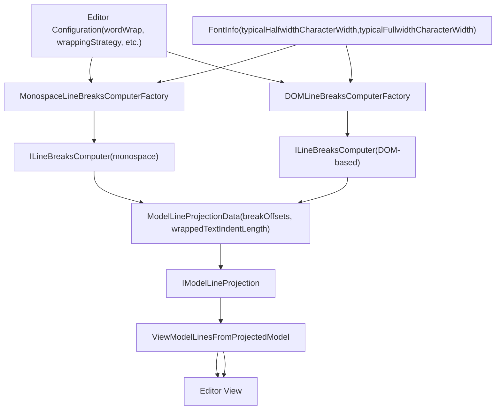
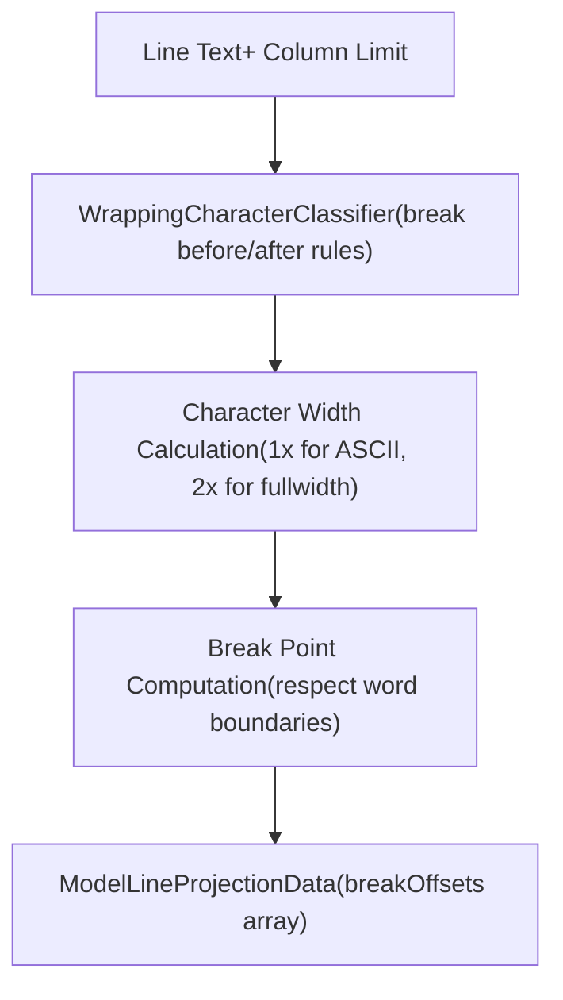
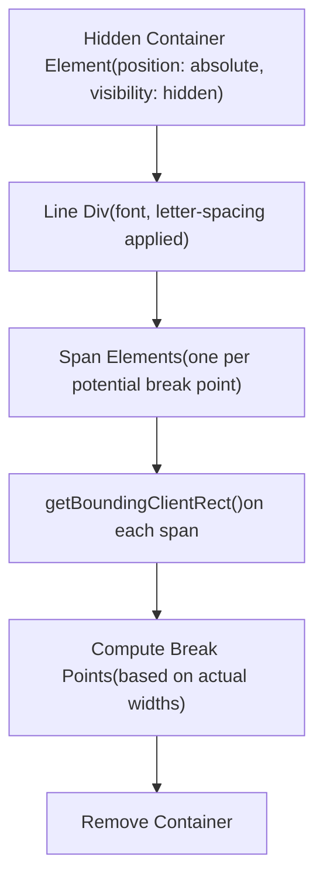
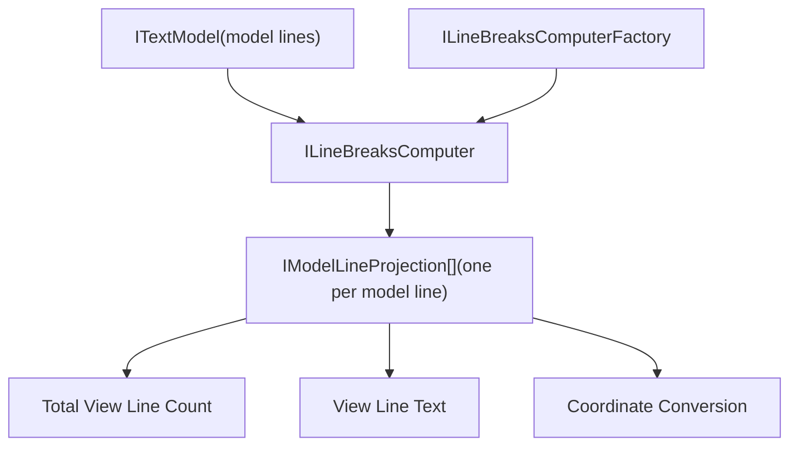
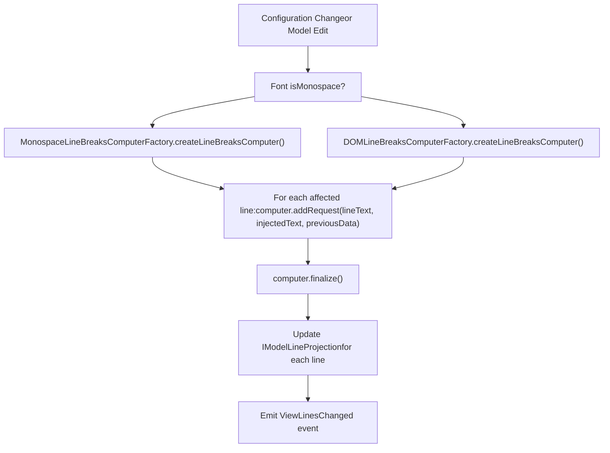
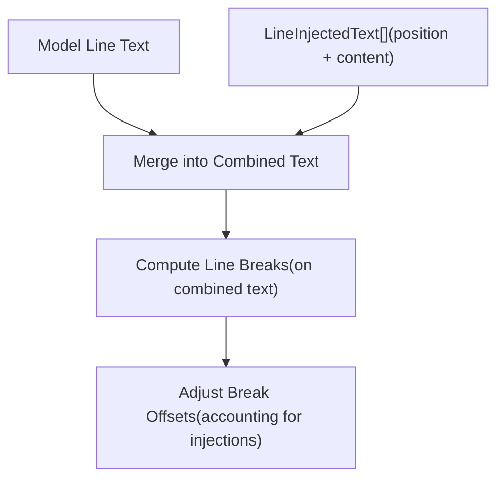

# Line Breaking and Text Wrapping

Relevant source files

-   [build/monaco/monaco.d.ts.recipe](https://github.com/microsoft/vscode/blob/1be3088d/build/monaco/monaco.d.ts.recipe)
-   [extensions/vscode-colorize-perf-tests/test/colorize-fixtures/test-treeView.ts](https://github.com/microsoft/vscode/blob/1be3088d/extensions/vscode-colorize-perf-tests/test/colorize-fixtures/test-treeView.ts)
-   [src/vs/editor/browser/config/charWidthReader.ts](https://github.com/microsoft/vscode/blob/1be3088d/src/vs/editor/browser/config/charWidthReader.ts)
-   [src/vs/editor/browser/editorBrowser.ts](https://github.com/microsoft/vscode/blob/1be3088d/src/vs/editor/browser/editorBrowser.ts)
-   [src/vs/editor/browser/view/domLineBreaksComputer.ts](https://github.com/microsoft/vscode/blob/1be3088d/src/vs/editor/browser/view/domLineBreaksComputer.ts)
-   [src/vs/editor/browser/view/renderingContext.ts](https://github.com/microsoft/vscode/blob/1be3088d/src/vs/editor/browser/view/renderingContext.ts)
-   [src/vs/editor/browser/viewParts/contentWidgets/contentWidgets.ts](https://github.com/microsoft/vscode/blob/1be3088d/src/vs/editor/browser/viewParts/contentWidgets/contentWidgets.ts)
-   [src/vs/editor/browser/viewParts/margin/margin.ts](https://github.com/microsoft/vscode/blob/1be3088d/src/vs/editor/browser/viewParts/margin/margin.ts)
-   [src/vs/editor/browser/viewParts/minimap/minimap.ts](https://github.com/microsoft/vscode/blob/1be3088d/src/vs/editor/browser/viewParts/minimap/minimap.ts)
-   [src/vs/editor/browser/viewParts/minimap/minimapCharRenderer.ts](https://github.com/microsoft/vscode/blob/1be3088d/src/vs/editor/browser/viewParts/minimap/minimapCharRenderer.ts)
-   [src/vs/editor/browser/viewParts/minimap/minimapCharRendererFactory.ts](https://github.com/microsoft/vscode/blob/1be3088d/src/vs/editor/browser/viewParts/minimap/minimapCharRendererFactory.ts)
-   [src/vs/editor/browser/viewParts/minimap/minimapCharSheet.ts](https://github.com/microsoft/vscode/blob/1be3088d/src/vs/editor/browser/viewParts/minimap/minimapCharSheet.ts)
-   [src/vs/editor/browser/viewParts/minimap/minimapPreBaked.ts](https://github.com/microsoft/vscode/blob/1be3088d/src/vs/editor/browser/viewParts/minimap/minimapPreBaked.ts)
-   [src/vs/editor/browser/viewParts/overlayWidgets/overlayWidgets.ts](https://github.com/microsoft/vscode/blob/1be3088d/src/vs/editor/browser/viewParts/overlayWidgets/overlayWidgets.ts)
-   [src/vs/editor/browser/viewParts/scrollDecoration/scrollDecoration.ts](https://github.com/microsoft/vscode/blob/1be3088d/src/vs/editor/browser/viewParts/scrollDecoration/scrollDecoration.ts)
-   [src/vs/editor/browser/viewParts/viewZones/viewZones.ts](https://github.com/microsoft/vscode/blob/1be3088d/src/vs/editor/browser/viewParts/viewZones/viewZones.ts)
-   [src/vs/editor/common/config/editorOptions.ts](https://github.com/microsoft/vscode/blob/1be3088d/src/vs/editor/common/config/editorOptions.ts)
-   [src/vs/editor/common/config/fontInfo.ts](https://github.com/microsoft/vscode/blob/1be3088d/src/vs/editor/common/config/fontInfo.ts)
-   [src/vs/editor/common/editorCommon.ts](https://github.com/microsoft/vscode/blob/1be3088d/src/vs/editor/common/editorCommon.ts)
-   [src/vs/editor/common/model.ts](https://github.com/microsoft/vscode/blob/1be3088d/src/vs/editor/common/model.ts)
-   [src/vs/editor/common/model/guidesTextModelPart.ts](https://github.com/microsoft/vscode/blob/1be3088d/src/vs/editor/common/model/guidesTextModelPart.ts)
-   [src/vs/editor/common/model/textModel.ts](https://github.com/microsoft/vscode/blob/1be3088d/src/vs/editor/common/model/textModel.ts)
-   [src/vs/editor/common/modelLineProjectionData.ts](https://github.com/microsoft/vscode/blob/1be3088d/src/vs/editor/common/modelLineProjectionData.ts)
-   [src/vs/editor/common/standalone/standaloneEnums.ts](https://github.com/microsoft/vscode/blob/1be3088d/src/vs/editor/common/standalone/standaloneEnums.ts)
-   [src/vs/editor/common/textModelGuides.ts](https://github.com/microsoft/vscode/blob/1be3088d/src/vs/editor/common/textModelGuides.ts)
-   [src/vs/editor/common/viewLayout/linesLayout.ts](https://github.com/microsoft/vscode/blob/1be3088d/src/vs/editor/common/viewLayout/linesLayout.ts)
-   [src/vs/editor/common/viewLayout/viewLayout.ts](https://github.com/microsoft/vscode/blob/1be3088d/src/vs/editor/common/viewLayout/viewLayout.ts)
-   [src/vs/editor/common/viewLayout/viewLinesViewportData.ts](https://github.com/microsoft/vscode/blob/1be3088d/src/vs/editor/common/viewLayout/viewLinesViewportData.ts)
-   [src/vs/editor/common/viewModel.ts](https://github.com/microsoft/vscode/blob/1be3088d/src/vs/editor/common/viewModel.ts)
-   [src/vs/editor/common/viewModel/minimapTokensColorTracker.ts](https://github.com/microsoft/vscode/blob/1be3088d/src/vs/editor/common/viewModel/minimapTokensColorTracker.ts)
-   [src/vs/editor/common/viewModel/modelLineProjection.ts](https://github.com/microsoft/vscode/blob/1be3088d/src/vs/editor/common/viewModel/modelLineProjection.ts)
-   [src/vs/editor/common/viewModel/monospaceLineBreaksComputer.ts](https://github.com/microsoft/vscode/blob/1be3088d/src/vs/editor/common/viewModel/monospaceLineBreaksComputer.ts)
-   [src/vs/editor/common/viewModel/viewModelDecorations.ts](https://github.com/microsoft/vscode/blob/1be3088d/src/vs/editor/common/viewModel/viewModelDecorations.ts)
-   [src/vs/editor/common/viewModel/viewModelImpl.ts](https://github.com/microsoft/vscode/blob/1be3088d/src/vs/editor/common/viewModel/viewModelImpl.ts)
-   [src/vs/editor/common/viewModel/viewModelLines.ts](https://github.com/microsoft/vscode/blob/1be3088d/src/vs/editor/common/viewModel/viewModelLines.ts)
-   [src/vs/editor/standalone/browser/standaloneCodeEditor.ts](https://github.com/microsoft/vscode/blob/1be3088d/src/vs/editor/standalone/browser/standaloneCodeEditor.ts)
-   [src/vs/editor/standalone/browser/standaloneEditor.ts](https://github.com/microsoft/vscode/blob/1be3088d/src/vs/editor/standalone/browser/standaloneEditor.ts)
-   [src/vs/editor/test/browser/view/minimapCharRenderer.test.ts](https://github.com/microsoft/vscode/blob/1be3088d/src/vs/editor/test/browser/view/minimapCharRenderer.test.ts)
-   [src/vs/editor/test/browser/viewModel/modelLineProjection.test.ts](https://github.com/microsoft/vscode/blob/1be3088d/src/vs/editor/test/browser/viewModel/modelLineProjection.test.ts)
-   [src/vs/editor/test/common/model/modelInjectedText.test.ts](https://github.com/microsoft/vscode/blob/1be3088d/src/vs/editor/test/common/model/modelInjectedText.test.ts)
-   [src/vs/editor/test/common/viewLayout/linesLayout.test.ts](https://github.com/microsoft/vscode/blob/1be3088d/src/vs/editor/test/common/viewLayout/linesLayout.test.ts)
-   [src/vs/editor/test/common/viewModel/lineBreakData.test.ts](https://github.com/microsoft/vscode/blob/1be3088d/src/vs/editor/test/common/viewModel/lineBreakData.test.ts)
-   [src/vs/editor/test/common/viewModel/monospaceLineBreaksComputer.test.ts](https://github.com/microsoft/vscode/blob/1be3088d/src/vs/editor/test/common/viewModel/monospaceLineBreaksComputer.test.ts)
-   [src/vs/monaco.d.ts](https://github.com/microsoft/vscode/blob/1be3088d/src/vs/monaco.d.ts)

## Purpose and Scope

This document describes the line breaking and text wrapping system in the Monaco Editor. This system determines how long lines of text are split into multiple visual lines when word wrap is enabled. It covers the configuration options, the computation pipeline, and the integration with the view model.

For information about text layout and rendering after line breaks have been computed, see the rendering system documentation. For editor configuration in general, see [4.3](/microsoft/vscode/4.3-editor-configuration-and-options).

---

## 概览

The line breaking system transforms logical model lines into multiple visual lines (view lines) when text exceeds the viewport width. The system supports two primary strategies:

1.  **Monospace Line Breaking** - Fast algorithm optimized for monospace fonts where all characters have the same width
2.  **DOM-Based Line Breaking** - Accurate algorithm for proportional fonts that uses browser DOM measurement

The pipeline consists of:

-   **Configuration** - User settings that control wrapping behavior
-   **Factories** - Create line break computers based on font and strategy
-   **Computers** - Execute the line breaking algorithm
-   **Projection Data** - Store and apply line break results

Sources: [src/vs/editor/common/viewModel/monospaceLineBreaksComputer.ts1-500](https://github.com/microsoft/vscode/blob/1be3088d/src/vs/editor/common/viewModel/monospaceLineBreaksComputer.ts#L1-L500) [src/vs/editor/browser/view/domLineBreaksComputer.ts1-300](https://github.com/microsoft/vscode/blob/1be3088d/src/vs/editor/browser/view/domLineBreaksComputer.ts#L1-L300) [src/vs/editor/common/viewModel/viewModelLines.ts1-100](https://github.com/microsoft/vscode/blob/1be3088d/src/vs/editor/common/viewModel/viewModelLines.ts#L1-L100)

---

## Configuration Options

The following editor options control line breaking behavior:

| Option | Type | Description |
| --- | --- | --- |
| `wordWrap` | `'off' | 'on' | 'wordWrapColumn' | 'bounded'` | Main wrapping mode control |
| `wordWrapColumn` | `number` | Column at which to wrap (default: 80) |
| `wrappingStrategy` | `'simple' | 'advanced'` | Algorithm to use for breaking |
| `wrappingIndent` | `'none' | 'same' | 'indent' | 'deepIndent'` | Indentation of wrapped lines |
| `wordBreak` | `'normal' | 'keepAll'` | CJK text breaking behavior |
| `wordWrapBreakBeforeCharacters` | `string` | Characters that force break before |
| `wordWrapBreakAfterCharacters` | `string` | Characters that force break after |
| `wrapOnEscapedLineFeeds` | `boolean` | Create soft wraps on `\n` literals |

The `wordWrap` modes:

-   **off** - No wrapping
-   **on** - Wrap at viewport width
-   **wordWrapColumn** - Wrap at `wordWrapColumn` value
-   **bounded** - Wrap at minimum of viewport width and `wordWrapColumn`

Sources: [src/vs/editor/common/config/editorOptions.ts336-390](https://github.com/microsoft/vscode/blob/1be3088d/src/vs/editor/common/config/editorOptions.ts#L336-L390)

---

## Architecture Overview


**Line Breaking Pipeline Architecture**

The configuration drives factory selection, which creates computers that produce projection data for the view model.

Sources: [src/vs/editor/common/viewModel/viewModelLines.ts95-120](https://github.com/microsoft/vscode/blob/1be3088d/src/vs/editor/common/viewModel/viewModelLines.ts#L95-L120) [src/vs/editor/common/modelLineProjectionData.ts1-50](https://github.com/microsoft/vscode/blob/1be3088d/src/vs/editor/common/modelLineProjectionData.ts#L1-L50)

---

## Line Breaks Computer Interface

All line breaking algorithms implement the `ILineBreaksComputer` interface:

```
interface ILineBreaksComputer {
    /**
     * Add a request to compute line breaks for a line
     */
    addRequest(
        lineText: string,
        injectedText: LineInjectedText[] | null,
        previousLineBreakData: ModelLineProjectionData | null
    ): void;

    /**
     * Compute line breaks for all added requests
     */
    finalize(): (ModelLineProjectionData | null)[];
}
```
The computation follows a batch pattern:

1.  Call `addRequest()` for each line to process
2.  Call `finalize()` to compute all line breaks at once
3.  Receive `ModelLineProjectionData` for each line

This batch design enables optimization and DOM reuse in the proportional font case.

Sources: [src/vs/editor/common/modelLineProjectionData.ts70-85](https://github.com/microsoft/vscode/blob/1be3088d/src/vs/editor/common/modelLineProjectionData.ts#L70-L85)

---

## Monospace Line Breaking

### Algorithm

The `MonospaceLineBreaksComputerFactory` uses a character-by-character algorithm that assumes all characters have uniform width:


**Monospace Line Breaking Flow**

### Character Classification

The `WrappingCharacterClassifier` categorizes characters into three classes:

| Class | Code | Behavior |
| --- | --- | --- |
| `CanBreakBefore` | 1 | Break can occur before this character |
| `CanBreakAfter` | 2 | Break can occur after this character |
| `NoBreak` | 0 | No special break behavior |

Default break-before characters: `([{'"〈《「『【〔（［｛｢£¥＄￡￥+＋`

Default break-after characters: `)]}'\"〉》」』】〕）］｝｣‐－¬~?!‼⁇⁈⁉·、。：；，¿¡`

Sources: [src/vs/editor/common/viewModel/monospaceLineBreaksComputer.ts15-27](https://github.com/microsoft/vscode/blob/1be3088d/src/vs/editor/common/viewModel/monospaceLineBreaksComputer.ts#L15-L27) [src/vs/editor/common/viewModel/monospaceLineBreaksComputer.ts335-430](https://github.com/microsoft/vscode/blob/1be3088d/src/vs/editor/common/viewModel/monospaceLineBreaksComputer.ts#L335-L430)

### Width Calculation

Character widths are computed as multiples of `typicalHalfwidthCharacterWidth`:

-   **ASCII characters (0-127)** - 1x width
-   **Fullwidth characters** - Configured ratio (`columnsForFullWidthChar`)
-   **Tab characters** - Rounded to next tab stop

Sources: [src/vs/editor/common/viewModel/monospaceLineBreaksComputer.ts40-50](https://github.com/microsoft/vscode/blob/1be3088d/src/vs/editor/common/viewModel/monospaceLineBreaksComputer.ts#L40-L50)

---

## DOM-Based Line Breaking

### 概览

For proportional fonts, the `DOMLineBreaksComputerFactory` uses browser DOM measurement to accurately compute line breaks:


**DOM Measurement Process**

### Implementation Strategy

The DOM-based computer creates a hidden container and uses actual browser text measurement:

1.  **Batch Setup** - Create single hidden container for all lines
2.  **Line Processing** - For each line:
    -   Insert text with potential break points wrapped in spans
    -   Measure each span's bounding rectangle
    -   Determine break points from actual widths
3.  **Cleanup** - Remove container after all measurements

This approach handles:

-   Variable character widths in proportional fonts
-   Kerning and ligatures
-   Complex scripts and combining characters
-   Font fallback chains

Sources: [src/vs/editor/browser/view/domLineBreaksComputer.ts29-200](https://github.com/microsoft/vscode/blob/1be3088d/src/vs/editor/browser/view/domLineBreaksComputer.ts#L29-L200)

---

## Model Line Projection Data

### Data Structure

The `ModelLineProjectionData` class stores the result of line breaking:

```
class ModelLineProjectionData {
    /**
     * Positions (in the line) where breaks occur.
     * null if no breaks (single-line projection).
     */
    public readonly breakOffsets: number[] | null;

    /**
     * Visible column at each break offset.
     */
    public readonly breakOffsetsVisibleColumn: number[] | null;

    /**
     * Indentation for wrapped lines.
     */
    public readonly wrappedTextIndentLength: number;

    /**
     * Total number of injected characters.
     */
    public readonly injectionOffsets: number[] | null;
    public readonly injectionOptions: InjectedTextOptions[] | null;
}
```
### Break Offset Encoding

Break offsets represent column positions where line breaks occur:

-   **null** - Line fits in viewport, no breaks needed
-   **\[col1, col2, ...\]** - Array of column positions for breaks
-   Offsets are **after** the character at that position

Example: Text `"Hello World"` with break at column 6:

-   `breakOffsets = [6]`
-   View line 1: `"Hello "`
-   View line 2: `"World"`

Sources: [src/vs/editor/common/modelLineProjectionData.ts100-200](https://github.com/microsoft/vscode/blob/1be3088d/src/vs/editor/common/modelLineProjectionData.ts#L100-L200)

---

## Wrapping Indent

The `wrappingIndent` option controls indentation of wrapped continuation lines:

| Mode | Behavior | Visual Example |
| --- | --- | --- |
| `none` | No indentation | `abc`
`def` |
| `same` | Same as first line | `abc`
`def` |
| `indent` | Add one indent unit | `abc`
`def` |
| `deepIndent` | Add two indent units | `abc`
`def` |

The indentation is computed during line breaking and stored in `wrappedTextIndentLength`.

Sources: [src/vs/editor/common/viewModel/monospaceLineBreaksComputer.ts50-80](https://github.com/microsoft/vscode/blob/1be3088d/src/vs/editor/common/viewModel/monospaceLineBreaksComputer.ts#L50-L80)

---

## Integration with View Model

### ViewModelLinesFromProjectedModel

The `ViewModelLinesFromProjectedModel` class manages the projection from model lines to view lines:


**View Model Integration**

### Coordinate Conversion

The projection system provides bidirectional coordinate conversion:

**Model → View**

-   Model line → Multiple view lines
-   Model column → View line number + view column

**View → Model**

-   View line → Model line
-   View column → Model column

The `IModelLineProjection` interface handles conversion for a single model line:

Sources: [src/vs/editor/common/viewModel/viewModelLines.ts107-120](https://github.com/microsoft/vscode/blob/1be3088d/src/vs/editor/common/viewModel/viewModelLines.ts#L107-L120) [src/vs/editor/common/viewModel/modelLineProjection.ts1-100](https://github.com/microsoft/vscode/blob/1be3088d/src/vs/editor/common/viewModel/modelLineProjection.ts#L1-L100)

---

## Line Breaking Pipeline


**Complete Line Breaking Pipeline**

Sources: [src/vs/editor/common/viewModel/viewModelLines.ts200-350](https://github.com/microsoft/vscode/blob/1be3088d/src/vs/editor/common/viewModel/viewModelLines.ts#L200-L350)

---

## Wrapping Strategy: Simple vs Advanced

### Simple Strategy

The simple wrapping strategy (`wrappingStrategy: 'simple'`) uses basic word boundary detection:

-   Breaks at whitespace when possible
-   Falls back to character breaks if words are too long
-   Fast computation, suitable for most cases

### Advanced Strategy

The advanced wrapping strategy (`wrappingStrategy: 'advanced'`) provides better typography:

-   Respects `wordWrapBreakBeforeCharacters` and `wordWrapBreakAfterCharacters`
-   Applies language-specific rules
-   Handles CJK text according to `wordBreak` setting
-   More expensive but produces better results

The strategy is passed to the line breaks computer and affects the break point selection algorithm.

Sources: [src/vs/editor/common/viewModel/monospaceLineBreaksComputer.ts150-300](https://github.com/microsoft/vscode/blob/1be3088d/src/vs/editor/common/viewModel/monospaceLineBreaksComputer.ts#L150-L300) [src/vs/editor/common/config/editorOptions.ts367-370](https://github.com/microsoft/vscode/blob/1be3088d/src/vs/editor/common/config/editorOptions.ts#L367-L370)

---

## Injected Text Handling

Injected text (text added via decorations without modifying the model) is incorporated into line breaking:


**Injected Text Integration**

The `ModelLineProjectionData` stores:

-   `injectionOffsets` - Where injected text appears
-   `injectionOptions` - Rendering options for injected text

Break offsets account for injected text, ensuring proper wrapping.

Sources: [src/vs/editor/common/modelLineProjectionData.ts150-250](https://github.com/microsoft/vscode/blob/1be3088d/src/vs/editor/common/modelLineProjectionData.ts#L150-L250) [src/vs/editor/common/textModelEvents.ts1-100](https://github.com/microsoft/vscode/blob/1be3088d/src/vs/editor/common/textModelEvents.ts#L1-L100)

---

## Performance Optimizations

### Incremental Updates

The line breaking system supports incremental updates:

-   `previousLineBreakData` parameter allows reusing previous computations
-   If line text hasn't changed and viewport width is the same, previous breaks are reused
-   Only affected lines are recomputed on edits

### Batch Processing

The `ILineBreaksComputer` interface enables batch processing:

-   Multiple lines collected via `addRequest()`
-   Single DOM container used for all measurements (DOM strategy)
-   Reduces DOM manipulation overhead

### Caching

The `ViewModelLinesFromProjectedModel` caches:

-   `IModelLineProjection` instances per model line
-   Projection data until next edit
-   Conversion results for frequently accessed positions

Sources: [src/vs/editor/common/viewModel/viewModelLines.ts300-400](https://github.com/microsoft/vscode/blob/1be3088d/src/vs/editor/common/viewModel/viewModelLines.ts#L300-L400) [src/vs/editor/browser/view/domLineBreaksComputer.ts100-200](https://github.com/microsoft/vscode/blob/1be3088d/src/vs/editor/browser/view/domLineBreaksComputer.ts#L100-L200)

---

## Key Classes Reference

| Class/Interface | Location | Purpose |
| --- | --- | --- |
| `ILineBreaksComputerFactory` | [modelLineProjectionData.ts1-100](https://github.com/microsoft/vscode/blob/1be3088d/modelLineProjectionData.ts#L1-L100) | Creates line break computers |
| `ILineBreaksComputer` | [modelLineProjectionData.ts70-85](https://github.com/microsoft/vscode/blob/1be3088d/modelLineProjectionData.ts#L70-L85) | Computes line breaks for multiple lines |
| `MonospaceLineBreaksComputerFactory` | [monospaceLineBreaksComputer.ts15-30](https://github.com/microsoft/vscode/blob/1be3088d/monospaceLineBreaksComputer.ts#L15-L30) | Factory for monospace fonts |
| `DOMLineBreaksComputerFactory` | [domLineBreaksComputer.ts20-30](https://github.com/microsoft/vscode/blob/1be3088d/domLineBreaksComputer.ts#L20-L30) | Factory for proportional fonts |
| `ModelLineProjectionData` | [modelLineProjectionData.ts100-250](https://github.com/microsoft/vscode/blob/1be3088d/modelLineProjectionData.ts#L100-L250) | Stores line break results |
| `IModelLineProjection` | [modelLineProjection.ts1-100](https://github.com/microsoft/vscode/blob/1be3088d/modelLineProjection.ts#L1-L100) | Projects one model line to view lines |
| `ViewModelLinesFromProjectedModel` | [viewModelLines.ts50-500](https://github.com/microsoft/vscode/blob/1be3088d/viewModelLines.ts#L50-L500) | Manages all line projections |
| `WrappingCharacterClassifier` | [monospaceLineBreaksComputer.ts335-430](https://github.com/microsoft/vscode/blob/1be3088d/monospaceLineBreaksComputer.ts#L335-L430) | Classifies break-before/after characters |

Sources: Multiple files as indicated in table

---

## Configuration Example

Typical configuration for different scenarios:

**Code Editor (monospace, no wrap)**

```
{
  "editor.wordWrap": "off",
  "editor.fontFamily": "monospace"
}
```
**Markdown Editor (proportional, wrap at viewport)**

```
{
  "editor.wordWrap": "on",
  "editor.wrappingIndent": "same",
  "editor.fontFamily": "sans-serif"
}
```
**Constrained Width (wrap at 80 columns)**

```
{
  "editor.wordWrap": "wordWrapColumn",
  "editor.wordWrapColumn": 80,
  "editor.wrappingIndent": "indent"
}
```
Sources: [src/vs/editor/common/config/editorOptions.ts336-395](https://github.com/microsoft/vscode/blob/1be3088d/src/vs/editor/common/config/editorOptions.ts#L336-L395)
