# Editor Input and Pane System

Relevant source files

-   [src/vs/platform/action/common/action.ts](https://github.com/microsoft/vscode/blob/1be3088d/src/vs/platform/action/common/action.ts)
-   [src/vs/platform/actions/browser/actionViewItemService.ts](https://github.com/microsoft/vscode/blob/1be3088d/src/vs/platform/actions/browser/actionViewItemService.ts)
-   [src/vs/platform/actions/browser/menuEntryActionViewItem.css](https://github.com/microsoft/vscode/blob/1be3088d/src/vs/platform/actions/browser/menuEntryActionViewItem.css)
-   [src/vs/platform/actions/browser/menuEntryActionViewItem.ts](https://github.com/microsoft/vscode/blob/1be3088d/src/vs/platform/actions/browser/menuEntryActionViewItem.ts)
-   [src/vs/platform/actions/browser/toolbar.ts](https://github.com/microsoft/vscode/blob/1be3088d/src/vs/platform/actions/browser/toolbar.ts)
-   [src/vs/platform/actions/common/actions.ts](https://github.com/microsoft/vscode/blob/1be3088d/src/vs/platform/actions/common/actions.ts)
-   [src/vs/platform/actions/common/menuService.ts](https://github.com/microsoft/vscode/blob/1be3088d/src/vs/platform/actions/common/menuService.ts)
-   [src/vs/platform/editor/common/editor.ts](https://github.com/microsoft/vscode/blob/1be3088d/src/vs/platform/editor/common/editor.ts)
-   [src/vs/platform/observable/common/platformObservableUtils.ts](https://github.com/microsoft/vscode/blob/1be3088d/src/vs/platform/observable/common/platformObservableUtils.ts)
-   [src/vs/workbench/browser/actions/layoutActions.ts](https://github.com/microsoft/vscode/blob/1be3088d/src/vs/workbench/browser/actions/layoutActions.ts)
-   [src/vs/workbench/browser/actions/quickAccessActions.ts](https://github.com/microsoft/vscode/blob/1be3088d/src/vs/workbench/browser/actions/quickAccessActions.ts)
-   [src/vs/workbench/browser/contextkeys.ts](https://github.com/microsoft/vscode/blob/1be3088d/src/vs/workbench/browser/contextkeys.ts)
-   [src/vs/workbench/browser/dnd.ts](https://github.com/microsoft/vscode/blob/1be3088d/src/vs/workbench/browser/dnd.ts)
-   [src/vs/workbench/browser/layout.ts](https://github.com/microsoft/vscode/blob/1be3088d/src/vs/workbench/browser/layout.ts)
-   [src/vs/workbench/browser/parts/auxiliarybar/auxiliaryBarActions.ts](https://github.com/microsoft/vscode/blob/1be3088d/src/vs/workbench/browser/parts/auxiliarybar/auxiliaryBarActions.ts)
-   [src/vs/workbench/browser/parts/editor/auxiliaryEditorPart.ts](https://github.com/microsoft/vscode/blob/1be3088d/src/vs/workbench/browser/parts/editor/auxiliaryEditorPart.ts)
-   [src/vs/workbench/browser/parts/editor/editor.contribution.ts](https://github.com/microsoft/vscode/blob/1be3088d/src/vs/workbench/browser/parts/editor/editor.contribution.ts)
-   [src/vs/workbench/browser/parts/editor/editor.ts](https://github.com/microsoft/vscode/blob/1be3088d/src/vs/workbench/browser/parts/editor/editor.ts)
-   [src/vs/workbench/browser/parts/editor/editorActions.ts](https://github.com/microsoft/vscode/blob/1be3088d/src/vs/workbench/browser/parts/editor/editorActions.ts)
-   [src/vs/workbench/browser/parts/editor/editorCommands.ts](https://github.com/microsoft/vscode/blob/1be3088d/src/vs/workbench/browser/parts/editor/editorCommands.ts)
-   [src/vs/workbench/browser/parts/editor/editorDropTarget.ts](https://github.com/microsoft/vscode/blob/1be3088d/src/vs/workbench/browser/parts/editor/editorDropTarget.ts)
-   [src/vs/workbench/browser/parts/editor/editorGroupView.ts](https://github.com/microsoft/vscode/blob/1be3088d/src/vs/workbench/browser/parts/editor/editorGroupView.ts)
-   [src/vs/workbench/browser/parts/editor/editorPart.ts](https://github.com/microsoft/vscode/blob/1be3088d/src/vs/workbench/browser/parts/editor/editorPart.ts)
-   [src/vs/workbench/browser/parts/editor/editorParts.ts](https://github.com/microsoft/vscode/blob/1be3088d/src/vs/workbench/browser/parts/editor/editorParts.ts)
-   [src/vs/workbench/browser/parts/panel/panelActions.ts](https://github.com/microsoft/vscode/blob/1be3088d/src/vs/workbench/browser/parts/panel/panelActions.ts)
-   [src/vs/workbench/browser/parts/titlebar/commandCenterControl.ts](https://github.com/microsoft/vscode/blob/1be3088d/src/vs/workbench/browser/parts/titlebar/commandCenterControl.ts)
-   [src/vs/workbench/browser/parts/titlebar/media/titlebarpart.css](https://github.com/microsoft/vscode/blob/1be3088d/src/vs/workbench/browser/parts/titlebar/media/titlebarpart.css)
-   [src/vs/workbench/browser/parts/titlebar/titlebarActions.ts](https://github.com/microsoft/vscode/blob/1be3088d/src/vs/workbench/browser/parts/titlebar/titlebarActions.ts)
-   [src/vs/workbench/browser/parts/titlebar/titlebarPart.ts](https://github.com/microsoft/vscode/blob/1be3088d/src/vs/workbench/browser/parts/titlebar/titlebarPart.ts)
-   [src/vs/workbench/browser/parts/titlebar/windowTitle.ts](https://github.com/microsoft/vscode/blob/1be3088d/src/vs/workbench/browser/parts/titlebar/windowTitle.ts)
-   [src/vs/workbench/browser/workbench.contribution.ts](https://github.com/microsoft/vscode/blob/1be3088d/src/vs/workbench/browser/workbench.contribution.ts)
-   [src/vs/workbench/browser/workbench.ts](https://github.com/microsoft/vscode/blob/1be3088d/src/vs/workbench/browser/workbench.ts)
-   [src/vs/workbench/common/contextkeys.ts](https://github.com/microsoft/vscode/blob/1be3088d/src/vs/workbench/common/contextkeys.ts)
-   [src/vs/workbench/common/editor.ts](https://github.com/microsoft/vscode/blob/1be3088d/src/vs/workbench/common/editor.ts)
-   [src/vs/workbench/contrib/chat/browser/widget/chatContentParts/chatInlineAnchorWidget.ts](https://github.com/microsoft/vscode/blob/1be3088d/src/vs/workbench/contrib/chat/browser/widget/chatContentParts/chatInlineAnchorWidget.ts)
-   [src/vs/workbench/contrib/chat/browser/widget/chatContentParts/chatMarkdownDecorationsRenderer.ts](https://github.com/microsoft/vscode/blob/1be3088d/src/vs/workbench/contrib/chat/browser/widget/chatContentParts/chatMarkdownDecorationsRenderer.ts)
-   [src/vs/workbench/contrib/chat/browser/widget/chatContentParts/media/chatInlineAnchorWidget.css](https://github.com/microsoft/vscode/blob/1be3088d/src/vs/workbench/contrib/chat/browser/widget/chatContentParts/media/chatInlineAnchorWidget.css)
-   [src/vs/workbench/contrib/debug/browser/statusbarColorProvider.ts](https://github.com/microsoft/vscode/blob/1be3088d/src/vs/workbench/contrib/debug/browser/statusbarColorProvider.ts)
-   [src/vs/workbench/services/actions/common/menusExtensionPoint.ts](https://github.com/microsoft/vscode/blob/1be3088d/src/vs/workbench/services/actions/common/menusExtensionPoint.ts)
-   [src/vs/workbench/services/editor/browser/editorService.ts](https://github.com/microsoft/vscode/blob/1be3088d/src/vs/workbench/services/editor/browser/editorService.ts)
-   [src/vs/workbench/services/editor/common/editorGroupsService.ts](https://github.com/microsoft/vscode/blob/1be3088d/src/vs/workbench/services/editor/common/editorGroupsService.ts)
-   [src/vs/workbench/services/editor/common/editorService.ts](https://github.com/microsoft/vscode/blob/1be3088d/src/vs/workbench/services/editor/common/editorService.ts)
-   [src/vs/workbench/services/editor/test/browser/editorGroupsService.test.ts](https://github.com/microsoft/vscode/blob/1be3088d/src/vs/workbench/services/editor/test/browser/editorGroupsService.test.ts)
-   [src/vs/workbench/services/editor/test/browser/editorService.test.ts](https://github.com/microsoft/vscode/blob/1be3088d/src/vs/workbench/services/editor/test/browser/editorService.test.ts)
-   [src/vs/workbench/services/layout/browser/layoutService.ts](https://github.com/microsoft/vscode/blob/1be3088d/src/vs/workbench/services/layout/browser/layoutService.ts)
-   [src/vs/workbench/test/browser/workbenchTestServices.ts](https://github.com/microsoft/vscode/blob/1be3088d/src/vs/workbench/test/browser/workbenchTestServices.ts)

## Purpose and Scope

This document describes the editor input and pane system in VS Code. The system separates the **model layer** (`EditorInput`) from the **view layer** (`EditorPane`), enabling VS Code to support multiple editor types while maintaining a consistent lifecycle and serialization framework.

**Key components documented:**

-   `EditorInput` abstraction and built-in implementations
-   `EditorPane` abstraction and rendering lifecycle
-   Registration and resolution mechanisms
-   Integration with `EditorGroupView` and `EditorGroupModel`

For information about how editors are organized into groups, see [Editor Service and Groups](/microsoft/vscode/5.2-editor-service-and-groups). For the overall layout system, see [Layout System and Parts](/microsoft/vscode/5.1-layout-system-and-parts).

## Core Abstractions

The editor system is built around two primary abstractions: **EditorInput** and **EditorPane**.

### EditorInput: Representing Editable Content

`EditorInput` is an abstract class defined in [src/vs/workbench/common/editor/editorInput.ts](https://github.com/microsoft/vscode/blob/1be3088d/src/vs/workbench/common/editor/editorInput.ts) that represents a unit of editable content. It is the model layer in the editor architecture and is independent of any visual representation.

**Diagram: EditorInput Class Hierarchy**

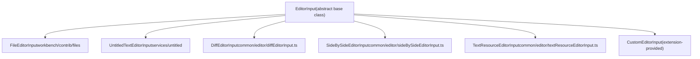
**Key responsibilities of EditorInput:**

| Responsibility | Description |
| --- | --- |
| Identity | Provides unique identification via `typeId` and `resource` |
| Capabilities | Declares capabilities via `EditorInputCapabilities` enum |
| Lifecycle | Manages resolve/save/revert operations |
| Metadata | Provides name, description, title, icon |
| Dirty state | Tracks unsaved changes |
| Serialization | Supports persistence across sessions |

Sources: [src/vs/workbench/common/editor.ts710-1057](https://github.com/microsoft/vscode/blob/1be3088d/src/vs/workbench/common/editor.ts#L710-L1057) [src/vs/workbench/common/editor/editorInput.ts](https://github.com/microsoft/vscode/blob/1be3088d/src/vs/workbench/common/editor/editorInput.ts)

### EditorPane: Visual Container for Editors

`EditorPane` is an abstract class defined in [src/vs/workbench/browser/parts/editor/editorPane.ts](https://github.com/microsoft/vscode/blob/1be3088d/src/vs/workbench/browser/parts/editor/editorPane.ts) that represents the visual container and UI for editing content. An `EditorPane` renders and manages the UI for one or more `EditorInput` instances.

**Diagram: EditorPane Class Hierarchy and Responsibilities**

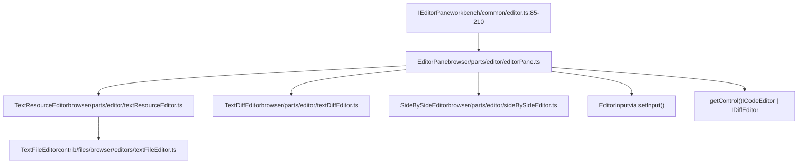
**Key responsibilities of EditorPane:**

| Responsibility | Description |
| --- | --- |
| Rendering | Creates and manages DOM elements for editing |
| Input lifecycle | Handles `setInput()` to bind EditorInput to the pane |
| Control access | Provides access to underlying editor widget via `getControl()` |
| View state | Manages editor-specific view state (scroll, selection) |
| Size constraints | Defines minimum/maximum width/height |
| Context | Provides scoped `IContextKeyService` |

Sources: [src/vs/workbench/common/editor.ts85-210](https://github.com/microsoft/vscode/blob/1be3088d/src/vs/workbench/common/editor.ts#L85-L210) [src/vs/workbench/browser/parts/editor/editorPane.ts](https://github.com/microsoft/vscode/blob/1be3088d/src/vs/workbench/browser/parts/editor/editorPane.ts) [src/vs/workbench/browser/parts/editor/textResourceEditor.ts](https://github.com/microsoft/vscode/blob/1be3088d/src/vs/workbench/browser/parts/editor/textResourceEditor.ts) [src/vs/workbench/browser/parts/editor/textDiffEditor.ts](https://github.com/microsoft/vscode/blob/1be3088d/src/vs/workbench/browser/parts/editor/textDiffEditor.ts)

### Relationship: Input to Pane Mapping

The mapping between `EditorInput` types and `EditorPane` implementations is managed through the `IEditorPaneRegistry` and resolved by `EditorResolverService`.

**Diagram: Editor Opening and Resolution Flow**

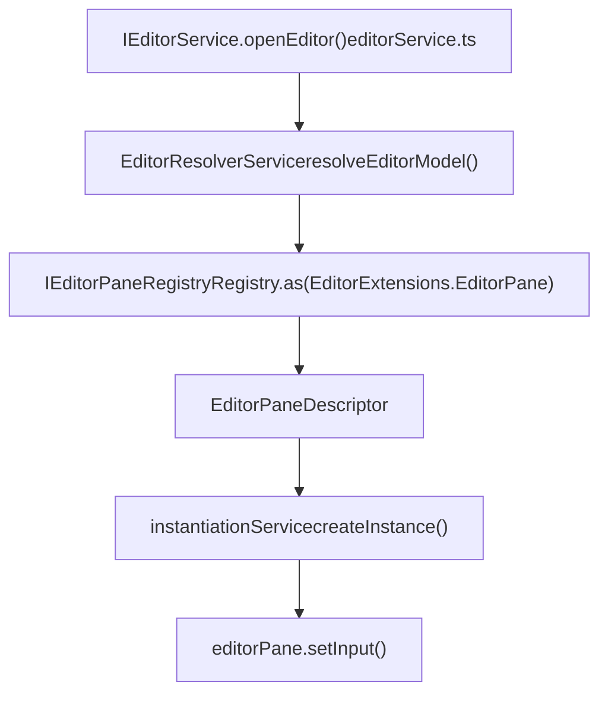
Sources: [src/vs/workbench/services/editor/browser/editorResolverService.ts](https://github.com/microsoft/vscode/blob/1be3088d/src/vs/workbench/services/editor/browser/editorResolverService.ts) [src/vs/workbench/browser/editor.ts115-146](https://github.com/microsoft/vscode/blob/1be3088d/src/vs/workbench/browser/editor.ts#L115-L146) [src/vs/workbench/services/editor/browser/editorService.ts588-724](https://github.com/microsoft/vscode/blob/1be3088d/src/vs/workbench/services/editor/browser/editorService.ts#L588-L724)

## Editor Input Lifecycle

### Creation and Identity

Every `EditorInput` must provide:

-   **typeId**: A unique string identifying the input type
-   **resource**: Optional URI representing the underlying resource
-   **capabilities**: Bitmask of `EditorInputCapabilities` flags

> **[Mermaid stateDiagram]**
> *(图表结构无法解析)*

**EditorInputCapabilities** (defined in [src/vs/workbench/common/editor.ts795-827](https://github.com/microsoft/vscode/blob/1be3088d/src/vs/workbench/common/editor.ts#L795-L827)) define behavioral characteristics:

| Capability | Bit Flag | Description |
| --- | --- | --- |
| `None` | `0` | No special capabilities |
| `Readonly` | `1 << 0` | Input cannot be edited |
| `Untitled` | `1 << 1` | Input has no backing file |
| `RequiresTrust` | `1 << 2` | Requires workspace trust to open |
| `Singleton` | `1 << 3` | Only one instance can exist globally |
| `CanDropIntoEditor` | `1 << 4` | Supports dropping into editor area |
| `AuxWindowUnsupported` | `1 << 5` | Cannot be moved to auxiliary window |
| `Scratchpad` | `1 << 6` | Ephemeral editor (e.g., playground) |
| `CanSplitInGroup` | `1 << 7` | Can be split within a single group |
| `MultipleEditors` | `1 << 8` | Represents multiple sub-editors |
| `ForceDescription` | `1 << 9` | Always show description in UI |

Sources: [src/vs/workbench/common/editor.ts795-827](https://github.com/microsoft/vscode/blob/1be3088d/src/vs/workbench/common/editor.ts#L795-L827)

### Resolution and Model Loading

When an editor input is opened, it may need to load its underlying model via `resolve()`:

> **[Mermaid sequence]**
> *(图表结构无法解析)*

Sources: [src/vs/workbench/browser/parts/editor/editorGroupView.ts1031-1172](https://github.com/microsoft/vscode/blob/1be3088d/src/vs/workbench/browser/parts/editor/editorGroupView.ts#L1031-L1172)

### Dirty State and Save Lifecycle

Editors track unsaved changes through the `isDirty()` method:

Key methods:

-   `isDirty(): boolean` - Check if input has unsaved changes
-   `isSaving(): boolean` - Check if save is in progress
-   `save(group, options): Promise<IEditorInput | undefined>` - Save changes
-   `revert(group, options): Promise<void>` - Discard changes
-   `onDidChangeDirty: Event<void>` - Fired when dirty state changes

Sources: [src/vs/workbench/common/editor.ts877-932](https://github.com/microsoft/vscode/blob/1be3088d/src/vs/workbench/common/editor.ts#L877-L932)

### Disposal and Cleanup

When an editor input is no longer needed:

> **[Mermaid sequence]**
> *(图表结构无法解析)*

Important: Editor inputs may be reference-counted when shared across groups. Actual disposal only occurs when the last reference is removed.

Sources: [src/vs/workbench/common/editor/editorInput.ts](https://github.com/microsoft/vscode/blob/1be3088d/src/vs/workbench/common/editor/editorInput.ts)

## Editor Pane Lifecycle

### Instantiation and Registration

Editor panes are registered using `EditorPaneDescriptor` in the `EditorPaneRegistry`:

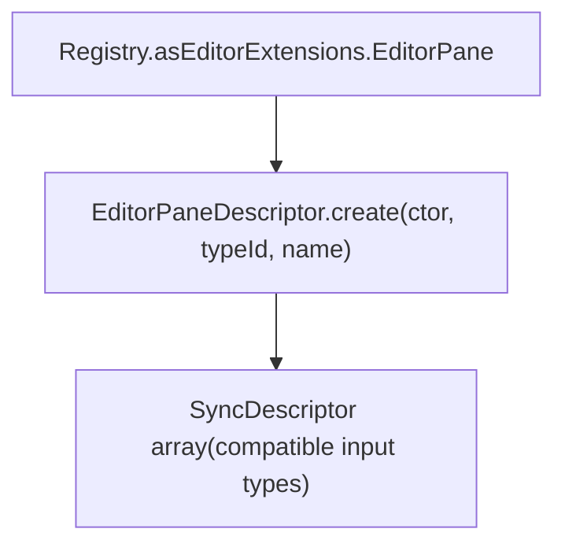
Example registration structure:

```
EditorPaneDescriptor.create(
  TextResourceEditor,           // Pane class
  TextResourceEditor.ID,        // Unique pane ID
  "Text Editor"                 // Display name
)
Supported inputs: [
  UntitledTextEditorInput,
  TextResourceEditorInput
]
```
Sources: [src/vs/workbench/browser/parts/editor/editor.contribution.ts79-89](https://github.com/microsoft/vscode/blob/1be3088d/src/vs/workbench/browser/parts/editor/editor.contribution.ts#L79-L89)

### Input Assignment via setInput()

The `setInput()` method binds an `EditorInput` to the pane. This is defined in [src/vs/workbench/browser/parts/editor/editorPane.ts](https://github.com/microsoft/vscode/blob/1be3088d/src/vs/workbench/browser/parts/editor/editorPane.ts) and typically overridden by subclasses.

**Diagram: setInput() Sequence**

> **[Mermaid sequence]**
> *(图表结构无法解析)*

The `setInput()` implementation pattern:

1.  Check if input is already set (optimization)
2.  Call `super.setInput()` to update base state
3.  Resolve the input to get its model
4.  Update the underlying editor control
5.  Apply any editor options (selection, reveal, etc.)
6.  Handle any errors

Sources: [src/vs/workbench/browser/parts/editor/editorPane.ts](https://github.com/microsoft/vscode/blob/1be3088d/src/vs/workbench/browser/parts/editor/editorPane.ts) [src/vs/workbench/browser/parts/editor/textResourceEditor.ts](https://github.com/microsoft/vscode/blob/1be3088d/src/vs/workbench/browser/parts/editor/textResourceEditor.ts) [src/vs/workbench/browser/parts/editor/textEditor.ts](https://github.com/microsoft/vscode/blob/1be3088d/src/vs/workbench/browser/parts/editor/textEditor.ts) [src/vs/workbench/browser/parts/editor/editorGroupView.ts1031-1172](https://github.com/microsoft/vscode/blob/1be3088d/src/vs/workbench/browser/parts/editor/editorGroupView.ts#L1031-L1172)

### Editor Control Access

The `getControl()` method provides access to the underlying editor widget:

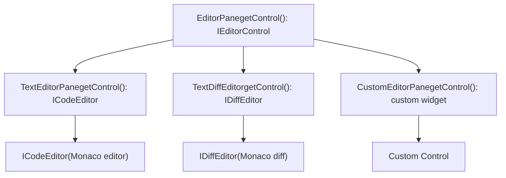
Callers must cast to the specific control type using helpers like:

-   `isCodeEditor(control)`
-   `isDiffEditor(control)`
-   `isCompositeEditor(control)`

Sources: [src/vs/workbench/common/editor.ts168](https://github.com/microsoft/vscode/blob/1be3088d/src/vs/workbench/common/editor.ts#L168-L168) [src/vs/editor/browser/editorBrowser.ts](https://github.com/microsoft/vscode/blob/1be3088d/src/vs/editor/browser/editorBrowser.ts)

### View State Persistence

Editor panes can save and restore view state (scroll position, selection, etc.):

> **[Mermaid sequence]**
> *(图表结构无法解析)*

View state includes:

-   Text editor: Scroll position, selection, folding state
-   Diff editor: Scroll sync, ignore trim whitespace setting
-   Custom editors: Editor-specific state

Sources: [src/vs/workbench/common/editor.ts176-177](https://github.com/microsoft/vscode/blob/1be3088d/src/vs/workbench/common/editor.ts#L176-L177) [src/vs/workbench/browser/parts/editor/textEditor.ts](https://github.com/microsoft/vscode/blob/1be3088d/src/vs/workbench/browser/parts/editor/textEditor.ts)

## Editor Registration System

### EditorPaneRegistry

The `IEditorPaneRegistry` (accessed via `Registry.as<IEditorPaneRegistry>(EditorExtensions.EditorPane)`) maintains the mapping from editor pane IDs to their descriptors.

**Diagram: EditorPaneRegistry Structure**

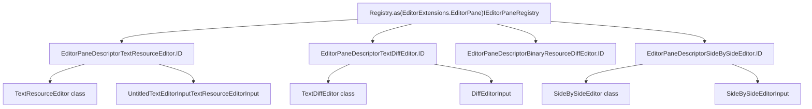
Sources: [src/vs/workbench/browser/parts/editor/editor.contribution.ts79-122](https://github.com/microsoft/vscode/blob/1be3088d/src/vs/workbench/browser/parts/editor/editor.contribution.ts#L79-L122) [src/vs/workbench/browser/editor.ts115-146](https://github.com/microsoft/vscode/blob/1be3088d/src/vs/workbench/browser/editor.ts#L115-L146)

### EditorFactoryRegistry

The `IEditorFactoryRegistry` (accessed via `Registry.as<IEditorFactoryRegistry>(EditorExtensions.EditorFactory)`) manages serialization/deserialization of editor inputs for session restore.

**Diagram: EditorFactoryRegistry and Serializers**

```mermaid
flowchart TD
    Registry["Registry.as(EditorExtensions.EditorFactory)IEditorFactoryRegistry"]
    UTI_S["UntitledTextEditorInputSerializerUntitledTextEditorInput.ID"]
    SBSEI_S["SideBySideEditorInputSerializerSideBySideEditorInput.ID"]
    DEI_S["DiffEditorInputSerializerDiffEditorInput.ID"]
    FEI_F["FileEditorFactoryFILE_EDITOR_INPUT_ID"]
    UTI["UntitledTextEditorInput"]
    SBSEI["SideBySideEditorInput"]
    DEI["DiffEditorInput"]
    FEI["FileEditorInput"]

    Registry --> UTI_S
    Registry --> SBSEI_S
    Registry --> DEI_S
    Registry --> FEI_F
    UTI --> S_UTI
    SBSEI --> S_SBSEI
    DEI --> S_DEI
    FEI --> F_FEI
```
**IEditorSerializer interface** (defined in [src/vs/workbench/common/editor.ts457-475](https://github.com/microsoft/vscode/blob/1be3088d/src/vs/workbench/common/editor.ts#L457-L475)):

```
interface IEditorSerializer {
  canSerialize(editor: EditorInput): boolean
  serialize(editor: EditorInput): string | undefined
  deserialize(instantiationService: IInstantiationService,
              serializedEditor: string): EditorInput | undefined
}
```
**Serialization flow:**

1.  On window close: `EditorGroupsService` calls `serialize()` on each open `EditorInput`
2.  Serialized JSON stored in `IStorageService` (workspace or profile scope)
3.  On window open: `EditorGroupsService` calls `deserialize()` to recreate inputs
4.  Inputs are reopened in their original groups via `EditorGroupModel.openEditor()`

Sources: [src/vs/workbench/common/editor.ts423-475](https://github.com/microsoft/vscode/blob/1be3088d/src/vs/workbench/common/editor.ts#L423-L475) [src/vs/workbench/browser/parts/editor/editor.contribution.ts124-126](https://github.com/microsoft/vscode/blob/1be3088d/src/vs/workbench/browser/parts/editor/editor.contribution.ts#L124-L126) [src/vs/workbench/browser/parts/editor/editorPart.ts](https://github.com/microsoft/vscode/blob/1be3088d/src/vs/workbench/browser/parts/editor/editorPart.ts)

## Editor Resolution Process

### Resolution Pipeline

When opening an editor, the system resolves the input to determine which pane should display it:

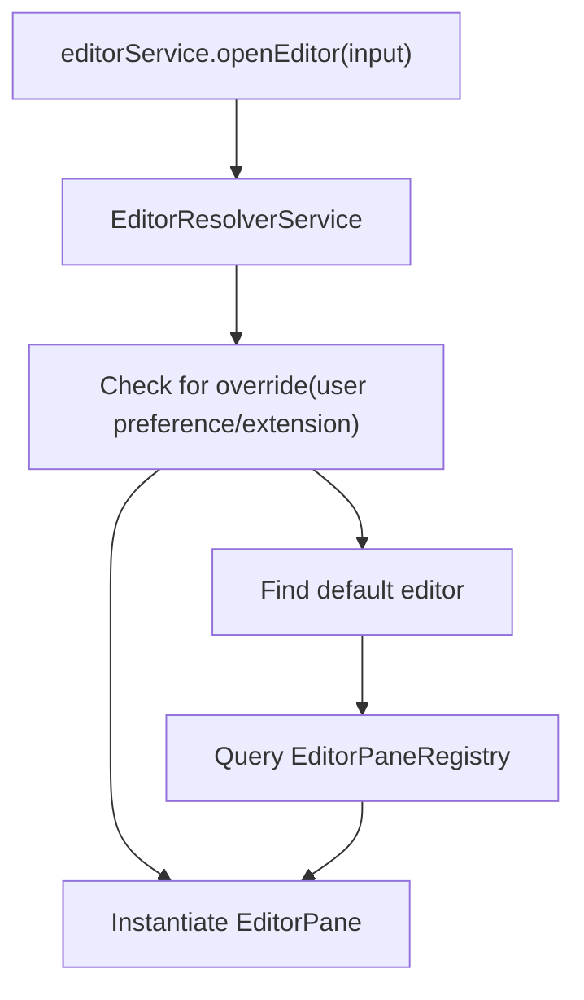
Sources: [src/vs/workbench/services/editor/browser/editorResolverService.ts](https://github.com/microsoft/vscode/blob/1be3088d/src/vs/workbench/services/editor/browser/editorResolverService.ts)

### Priority System

The editor resolver uses a priority system to determine which editor to use:

| Priority Level | Description | Example |
| --- | --- | --- |
| `exclusive` | Only editor that can open this input | Binary file editor |
| `default` | Preferred editor for this input type | Text editor for .txt files |
| `option` | Available as alternative | Hex editor for any file |

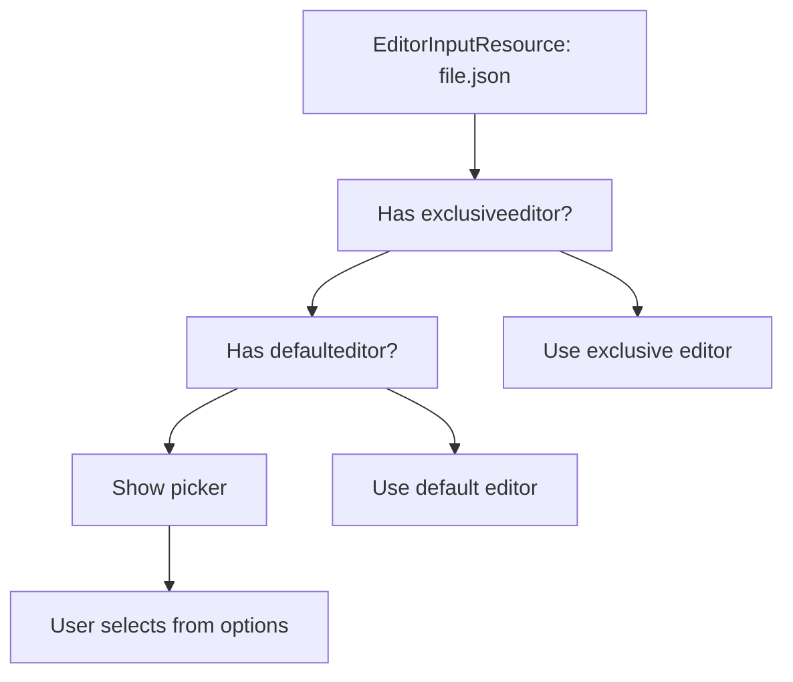
Sources: [src/vs/workbench/services/editor/common/editorResolverService.ts](https://github.com/microsoft/vscode/blob/1be3088d/src/vs/workbench/services/editor/common/editorResolverService.ts)

### Custom Editor Association

Users can override default editor associations:

> **[Mermaid sequence]**
> *(图表结构无法解析)*

Configuration format:

```
"workbench.editorAssociations": {
  "*.md": "vscode.markdown.preview.editor",
  "*.ipynb": "jupyter.notebook.ipynb"
}
```
Sources: [src/vs/workbench/browser/parts/editor/editorCommands.ts63-64](https://github.com/microsoft/vscode/blob/1be3088d/src/vs/workbench/browser/parts/editor/editorCommands.ts#L63-L64)

## Built-in Editor Input Types

### FileEditorInput

Represents a file from the file system:

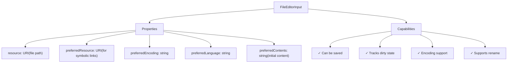
Key features:

-   Backed by `ITextFileService` for save/revert operations
-   Supports encoding detection and conversion
-   Integrates with file watcher for external changes
-   Provides `IEncodingSupport` and `ILanguageSupport`

Sources: [src/vs/workbench/contrib/files/browser/editors/fileEditorInput.ts](https://github.com/microsoft/vscode/blob/1be3088d/src/vs/workbench/contrib/files/browser/editors/fileEditorInput.ts)

### UntitledTextEditorInput

Represents a new, unsaved text file:

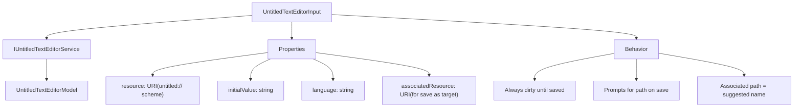
Characteristics:

-   `resource.scheme === 'untitled'`
-   Always considered dirty (`isDirty() === true`)
-   Can have associated file path (for "Save As" hint)
-   Saved via "Save As" workflow

Sources: [src/vs/workbench/services/untitled/common/untitledTextEditorInput.ts](https://github.com/microsoft/vscode/blob/1be3088d/src/vs/workbench/services/untitled/common/untitledTextEditorInput.ts)

### DiffEditorInput

Represents a comparison between two editor inputs:

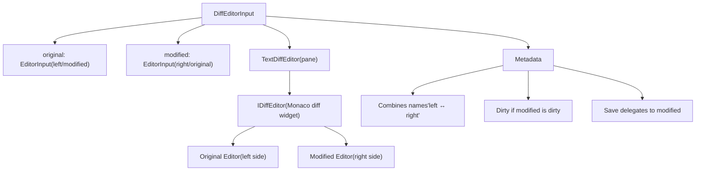
Key behaviors:

-   Name combines both inputs: `{original.name} ↔ {modified.name}`
-   Dirty state follows the `modified` input
-   Save operations delegate to the `modified` input
-   Supports swap operation (`DIFF_SWAP_SIDES` command)

Sources: [src/vs/workbench/common/editor/diffEditorInput.ts](https://github.com/microsoft/vscode/blob/1be3088d/src/vs/workbench/common/editor/diffEditorInput.ts)

### SideBySideEditorInput

Shows two editors side-by-side without comparison highlighting:

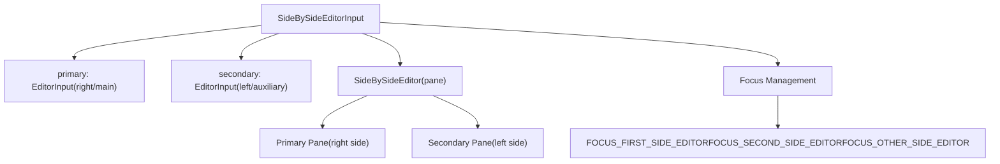
Difference from DiffEditorInput:

-   No diff highlighting or decoration
-   Each side is an independent editor pane
-   Used for reference/comparison without merge semantics
-   Focus can be independently controlled per side

Sources: [src/vs/workbench/common/editor/sideBySideEditorInput.ts](https://github.com/microsoft/vscode/blob/1be3088d/src/vs/workbench/common/editor/sideBySideEditorInput.ts) [src/vs/workbench/browser/parts/editor/sideBySideEditor.ts](https://github.com/microsoft/vscode/blob/1be3088d/src/vs/workbench/browser/parts/editor/sideBySideEditor.ts)

### TextResourceEditorInput

Represents read-only text content (often from non-file sources):

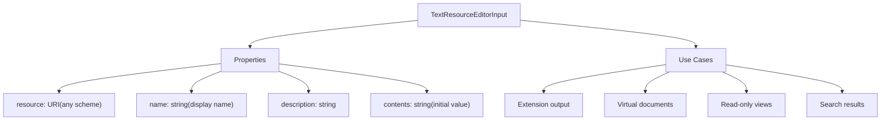
Characteristics:

-   Typically read-only (no save capability)
-   Can represent any URI scheme (not just `file://`)
-   Used by extensions for virtual documents
-   Lightweight compared to `FileEditorInput`

Sources: [src/vs/workbench/common/editor/textResourceEditorInput.ts](https://github.com/microsoft/vscode/blob/1be3088d/src/vs/workbench/common/editor/textResourceEditorInput.ts)

## Integration with Editor Groups

### Active Editor Concept

Within an `EditorGroupView`, one `EditorInput` can be active at a time. The active editor is managed by `EditorGroupModel`.

**Diagram: Active Editor in EditorGroupView**

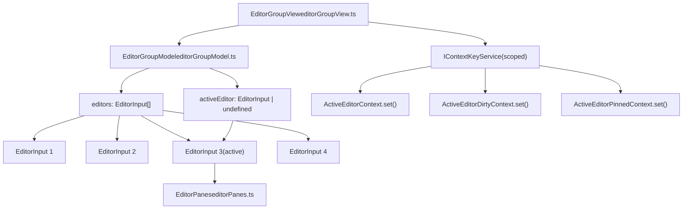
The active editor determines:

-   Which `EditorPane` is visible in the group
-   Which context keys are active (via `handleGroupContextKeys()` in [src/vs/workbench/browser/parts/editor/editorGroupView.ts249-327](https://github.com/microsoft/vscode/blob/1be3088d/src/vs/workbench/browser/parts/editor/editorGroupView.ts#L249-L327))
-   Which commands are available
-   What appears in the `EditorTitleControl`

Sources: [src/vs/workbench/browser/parts/editor/editorGroupView.ts249-327](https://github.com/microsoft/vscode/blob/1be3088d/src/vs/workbench/browser/parts/editor/editorGroupView.ts#L249-L327) [src/vs/workbench/common/editor/editorGroupModel.ts](https://github.com/microsoft/vscode/blob/1be3088d/src/vs/workbench/common/editor/editorGroupModel.ts)

### Opening Editors in Groups

The flow from opening an editor to displaying it:

> **[Mermaid sequence]**
> *(图表结构无法解析)*

Sources: [src/vs/workbench/browser/parts/editor/editorGroupView.ts988-1172](https://github.com/microsoft/vscode/blob/1be3088d/src/vs/workbench/browser/parts/editor/editorGroupView.ts#L988-L1172) [src/vs/workbench/services/editor/browser/editorService.ts588-724](https://github.com/microsoft/vscode/blob/1be3088d/src/vs/workbench/services/editor/browser/editorService.ts#L588-L724)

### Editor Stack Management

Each group maintains a stack of opened editors:

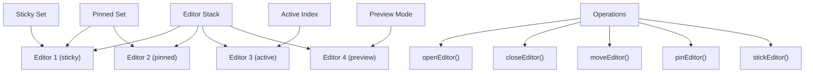
Key concepts:

-   **Sticky editors**: Always appear first, typically pinned
-   **Pinned editors**: Persist in the group (not preview)
-   **Preview editor**: Temporary editor, replaced by next preview
-   **Active editor**: Currently visible editor

Sources: [src/vs/workbench/common/editor/editorGroupModel.ts](https://github.com/microsoft/vscode/blob/1be3088d/src/vs/workbench/common/editor/editorGroupModel.ts)

### Pane Reuse and Pooling

The `EditorPanes` container (defined in [src/vs/workbench/browser/parts/editor/editorPanes.ts](https://github.com/microsoft/vscode/blob/1be3088d/src/vs/workbench/browser/parts/editor/editorPanes.ts)) manages a pool of `EditorPane` instances for performance.

**Diagram: EditorPanes Pooling Mechanism**

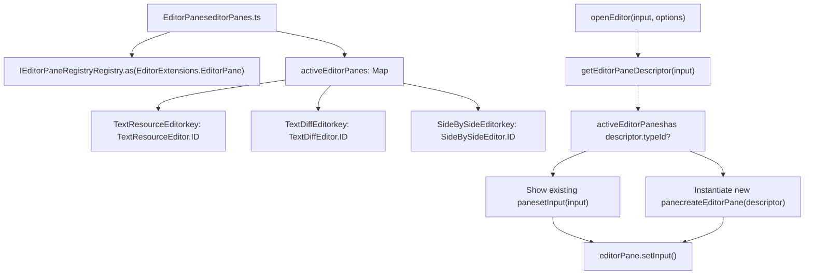
**Key benefits:**

-   Minimizes DOM creation/destruction
-   Preserves Monaco editor widgets between editor switches
-   Faster editor transitions (especially for text editors)
-   Memory efficiency through reuse

Sources: [src/vs/workbench/browser/parts/editor/editorPanes.ts](https://github.com/microsoft/vscode/blob/1be3088d/src/vs/workbench/browser/parts/editor/editorPanes.ts) [src/vs/workbench/browser/parts/editor/editorGroupView.ts1031-1172](https://github.com/microsoft/vscode/blob/1be3088d/src/vs/workbench/browser/parts/editor/editorGroupView.ts#L1031-L1172)

---

## Summary

The Editor Input and Pane System provides the foundation for VS Code's flexible editor architecture:

-   **EditorInput** represents the model/content layer
-   **EditorPane** represents the view/UI layer
-   **Registration system** connects inputs to panes
-   **Resolution system** determines which pane to use
-   **Lifecycle management** handles opening, saving, and closing
-   **Integration with groups** enables multi-editor workflows

This separation of concerns enables:

-   Multiple views of the same content (split editors)
-   Custom editor implementations
-   Flexible serialization and session restore
-   Extension-provided editor types
-   Efficient resource management through pane pooling
