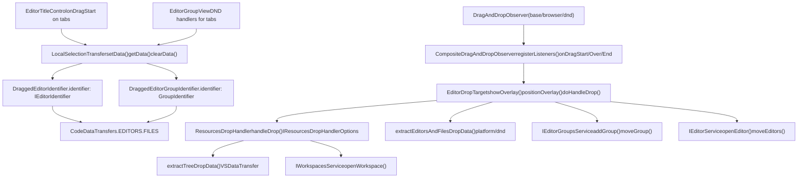
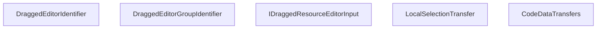
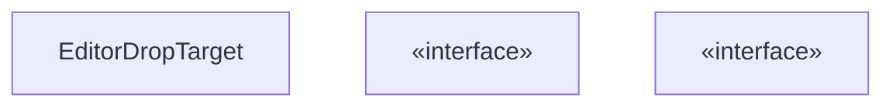
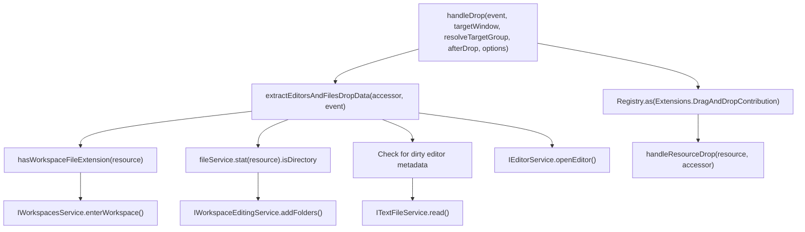
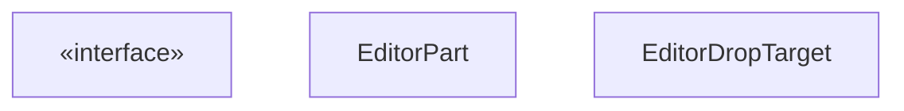
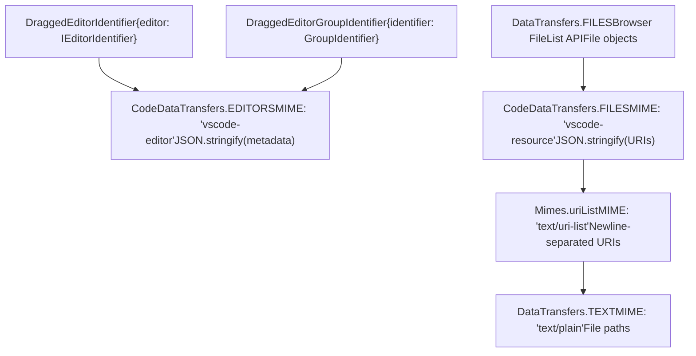

# Drag and Drop System

Relevant source files

-   [src/vs/platform/action/common/action.ts](https://github.com/microsoft/vscode/blob/1be3088d/src/vs/platform/action/common/action.ts)
-   [src/vs/platform/actions/browser/actionViewItemService.ts](https://github.com/microsoft/vscode/blob/1be3088d/src/vs/platform/actions/browser/actionViewItemService.ts)
-   [src/vs/platform/actions/browser/menuEntryActionViewItem.css](https://github.com/microsoft/vscode/blob/1be3088d/src/vs/platform/actions/browser/menuEntryActionViewItem.css)
-   [src/vs/platform/actions/browser/menuEntryActionViewItem.ts](https://github.com/microsoft/vscode/blob/1be3088d/src/vs/platform/actions/browser/menuEntryActionViewItem.ts)
-   [src/vs/platform/actions/browser/toolbar.ts](https://github.com/microsoft/vscode/blob/1be3088d/src/vs/platform/actions/browser/toolbar.ts)
-   [src/vs/platform/actions/common/actions.ts](https://github.com/microsoft/vscode/blob/1be3088d/src/vs/platform/actions/common/actions.ts)
-   [src/vs/platform/actions/common/menuService.ts](https://github.com/microsoft/vscode/blob/1be3088d/src/vs/platform/actions/common/menuService.ts)
-   [src/vs/platform/editor/common/editor.ts](https://github.com/microsoft/vscode/blob/1be3088d/src/vs/platform/editor/common/editor.ts)
-   [src/vs/platform/observable/common/platformObservableUtils.ts](https://github.com/microsoft/vscode/blob/1be3088d/src/vs/platform/observable/common/platformObservableUtils.ts)
-   [src/vs/workbench/browser/actions/layoutActions.ts](https://github.com/microsoft/vscode/blob/1be3088d/src/vs/workbench/browser/actions/layoutActions.ts)
-   [src/vs/workbench/browser/actions/quickAccessActions.ts](https://github.com/microsoft/vscode/blob/1be3088d/src/vs/workbench/browser/actions/quickAccessActions.ts)
-   [src/vs/workbench/browser/contextkeys.ts](https://github.com/microsoft/vscode/blob/1be3088d/src/vs/workbench/browser/contextkeys.ts)
-   [src/vs/workbench/browser/dnd.ts](https://github.com/microsoft/vscode/blob/1be3088d/src/vs/workbench/browser/dnd.ts)
-   [src/vs/workbench/browser/layout.ts](https://github.com/microsoft/vscode/blob/1be3088d/src/vs/workbench/browser/layout.ts)
-   [src/vs/workbench/browser/parts/auxiliarybar/auxiliaryBarActions.ts](https://github.com/microsoft/vscode/blob/1be3088d/src/vs/workbench/browser/parts/auxiliarybar/auxiliaryBarActions.ts)
-   [src/vs/workbench/browser/parts/editor/auxiliaryEditorPart.ts](https://github.com/microsoft/vscode/blob/1be3088d/src/vs/workbench/browser/parts/editor/auxiliaryEditorPart.ts)
-   [src/vs/workbench/browser/parts/editor/editor.contribution.ts](https://github.com/microsoft/vscode/blob/1be3088d/src/vs/workbench/browser/parts/editor/editor.contribution.ts)
-   [src/vs/workbench/browser/parts/editor/editor.ts](https://github.com/microsoft/vscode/blob/1be3088d/src/vs/workbench/browser/parts/editor/editor.ts)
-   [src/vs/workbench/browser/parts/editor/editorActions.ts](https://github.com/microsoft/vscode/blob/1be3088d/src/vs/workbench/browser/parts/editor/editorActions.ts)
-   [src/vs/workbench/browser/parts/editor/editorCommands.ts](https://github.com/microsoft/vscode/blob/1be3088d/src/vs/workbench/browser/parts/editor/editorCommands.ts)
-   [src/vs/workbench/browser/parts/editor/editorDropTarget.ts](https://github.com/microsoft/vscode/blob/1be3088d/src/vs/workbench/browser/parts/editor/editorDropTarget.ts)
-   [src/vs/workbench/browser/parts/editor/editorGroupView.ts](https://github.com/microsoft/vscode/blob/1be3088d/src/vs/workbench/browser/parts/editor/editorGroupView.ts)
-   [src/vs/workbench/browser/parts/editor/editorPart.ts](https://github.com/microsoft/vscode/blob/1be3088d/src/vs/workbench/browser/parts/editor/editorPart.ts)
-   [src/vs/workbench/browser/parts/editor/editorParts.ts](https://github.com/microsoft/vscode/blob/1be3088d/src/vs/workbench/browser/parts/editor/editorParts.ts)
-   [src/vs/workbench/browser/parts/panel/panelActions.ts](https://github.com/microsoft/vscode/blob/1be3088d/src/vs/workbench/browser/parts/panel/panelActions.ts)
-   [src/vs/workbench/browser/parts/titlebar/commandCenterControl.ts](https://github.com/microsoft/vscode/blob/1be3088d/src/vs/workbench/browser/parts/titlebar/commandCenterControl.ts)
-   [src/vs/workbench/browser/parts/titlebar/media/titlebarpart.css](https://github.com/microsoft/vscode/blob/1be3088d/src/vs/workbench/browser/parts/titlebar/media/titlebarpart.css)
-   [src/vs/workbench/browser/parts/titlebar/titlebarActions.ts](https://github.com/microsoft/vscode/blob/1be3088d/src/vs/workbench/browser/parts/titlebar/titlebarActions.ts)
-   [src/vs/workbench/browser/parts/titlebar/titlebarPart.ts](https://github.com/microsoft/vscode/blob/1be3088d/src/vs/workbench/browser/parts/titlebar/titlebarPart.ts)
-   [src/vs/workbench/browser/parts/titlebar/windowTitle.ts](https://github.com/microsoft/vscode/blob/1be3088d/src/vs/workbench/browser/parts/titlebar/windowTitle.ts)
-   [src/vs/workbench/browser/workbench.contribution.ts](https://github.com/microsoft/vscode/blob/1be3088d/src/vs/workbench/browser/workbench.contribution.ts)
-   [src/vs/workbench/browser/workbench.ts](https://github.com/microsoft/vscode/blob/1be3088d/src/vs/workbench/browser/workbench.ts)
-   [src/vs/workbench/common/contextkeys.ts](https://github.com/microsoft/vscode/blob/1be3088d/src/vs/workbench/common/contextkeys.ts)
-   [src/vs/workbench/common/editor.ts](https://github.com/microsoft/vscode/blob/1be3088d/src/vs/workbench/common/editor.ts)
-   [src/vs/workbench/contrib/chat/browser/widget/chatContentParts/chatInlineAnchorWidget.ts](https://github.com/microsoft/vscode/blob/1be3088d/src/vs/workbench/contrib/chat/browser/widget/chatContentParts/chatInlineAnchorWidget.ts)
-   [src/vs/workbench/contrib/chat/browser/widget/chatContentParts/chatMarkdownDecorationsRenderer.ts](https://github.com/microsoft/vscode/blob/1be3088d/src/vs/workbench/contrib/chat/browser/widget/chatContentParts/chatMarkdownDecorationsRenderer.ts)
-   [src/vs/workbench/contrib/chat/browser/widget/chatContentParts/media/chatInlineAnchorWidget.css](https://github.com/microsoft/vscode/blob/1be3088d/src/vs/workbench/contrib/chat/browser/widget/chatContentParts/media/chatInlineAnchorWidget.css)
-   [src/vs/workbench/contrib/debug/browser/statusbarColorProvider.ts](https://github.com/microsoft/vscode/blob/1be3088d/src/vs/workbench/contrib/debug/browser/statusbarColorProvider.ts)
-   [src/vs/workbench/services/actions/common/menusExtensionPoint.ts](https://github.com/microsoft/vscode/blob/1be3088d/src/vs/workbench/services/actions/common/menusExtensionPoint.ts)
-   [src/vs/workbench/services/editor/browser/editorService.ts](https://github.com/microsoft/vscode/blob/1be3088d/src/vs/workbench/services/editor/browser/editorService.ts)
-   [src/vs/workbench/services/editor/common/editorGroupsService.ts](https://github.com/microsoft/vscode/blob/1be3088d/src/vs/workbench/services/editor/common/editorGroupsService.ts)
-   [src/vs/workbench/services/editor/common/editorService.ts](https://github.com/microsoft/vscode/blob/1be3088d/src/vs/workbench/services/editor/common/editorService.ts)
-   [src/vs/workbench/services/editor/test/browser/editorGroupsService.test.ts](https://github.com/microsoft/vscode/blob/1be3088d/src/vs/workbench/services/editor/test/browser/editorGroupsService.test.ts)
-   [src/vs/workbench/services/editor/test/browser/editorService.test.ts](https://github.com/microsoft/vscode/blob/1be3088d/src/vs/workbench/services/editor/test/browser/editorService.test.ts)
-   [src/vs/workbench/services/layout/browser/layoutService.ts](https://github.com/microsoft/vscode/blob/1be3088d/src/vs/workbench/services/layout/browser/layoutService.ts)
-   [src/vs/workbench/test/browser/workbenchTestServices.ts](https://github.com/microsoft/vscode/blob/1be3088d/src/vs/workbench/test/browser/workbenchTestServices.ts)

## Purpose and Scope

This document describes VS Code's drag and drop system, which enables users to rearrange editors, open files, and organize workspaces through drag-and-drop interactions. The system handles dragging editors between groups, dropping files from the operating system, dragging resources within the workbench, and dragging entire editor groups to new locations or windows.

For information about editor management and groups, see [Editor Service and Groups](/microsoft/vscode/4.2-text-model-and-view-model-architecture). For details on window management and auxiliary windows, see [Multi-Process Architecture](/microsoft/vscode/3.3-multi-process-architecture).

## System Architecture

The drag and drop system consists of distinct layers handling different aspects of DND operations:


**Sources:** [src/vs/workbench/browser/dnd.ts1-800](https://github.com/microsoft/vscode/blob/1be3088d/src/vs/workbench/browser/dnd.ts#L1-L800) [src/vs/workbench/browser/parts/editor/editorDropTarget.ts40-100](https://github.com/microsoft/vscode/blob/1be3088d/src/vs/workbench/browser/parts/editor/editorDropTarget.ts#L40-L100) [src/vs/base/browser/dnd.ts1-50](https://github.com/microsoft/vscode/blob/1be3088d/src/vs/base/browser/dnd.ts#L1-L50) [src/vs/platform/dnd/browser/dnd.ts1-150](https://github.com/microsoft/vscode/blob/1be3088d/src/vs/platform/dnd/browser/dnd.ts#L1-L150)

## Core Data Transfer Types

The system defines specific classes to represent dragged items:


These types are used to identify what is being dragged:

-   `DraggedEditorIdentifier`: Represents a single editor being dragged [src/vs/workbench/browser/dnd.ts43-46](https://github.com/microsoft/vscode/blob/1be3088d/src/vs/workbench/browser/dnd.ts#L43-L46)
-   `DraggedEditorGroupIdentifier`: Represents an entire editor group being dragged [src/vs/workbench/browser/dnd.ts48-51](https://github.com/microsoft/vscode/blob/1be3088d/src/vs/workbench/browser/dnd.ts#L48-L51)
-   `LocalSelectionTransfer`: Platform service for transferring data within the same application instance [src/vs/platform/dnd/browser/dnd.ts](https://github.com/microsoft/vscode/blob/1be3088d/src/vs/platform/dnd/browser/dnd.ts)

**Sources:** [src/vs/workbench/browser/dnd.ts43-51](https://github.com/microsoft/vscode/blob/1be3088d/src/vs/workbench/browser/dnd.ts#L43-L51) [src/vs/platform/dnd/browser/dnd.ts1-100](https://github.com/microsoft/vscode/blob/1be3088d/src/vs/platform/dnd/browser/dnd.ts#L1-L100)

## EditorDropTarget Component

`EditorDropTarget` manages drop zones and coordinates with `IEditorGroupsService` to handle drops:

**EditorDropTarget Class Structure**


**Drop Zone Layout Algorithm**

The overlay divides each editor group into five zones calculated by `positionOverlay()`:

| Zone | Position | Action | Method Called |
| --- | --- | --- | --- |
| Center | Middle 40% x 40% | Merge into group | `editorGroupsService.getGroup(id)` |
| Top | Top 20% height | Split vertically above | `editorGroupsService.addGroup(location, GroupDirection.UP)` |
| Bottom | Bottom 20% height | Split vertically below | `editorGroupsService.addGroup(location, GroupDirection.DOWN)` |
| Left | Left 20% width | Split horizontally left | `editorGroupsService.addGroup(location, GroupDirection.LEFT)` |
| Right | Right 20% width | Split horizontally right | `editorGroupsService.addGroup(location, GroupDirection.RIGHT)` |

**Sources:** [src/vs/workbench/browser/parts/editor/editorDropTarget.ts40-600](https://github.com/microsoft/vscode/blob/1be3088d/src/vs/workbench/browser/parts/editor/editorDropTarget.ts#L40-L600)

## Drop Zone Calculation

The `positionOverlay` method divides the editor area into drop zones:

```mermaid
flowchart TD
    FULL_AREA["Full Editor Area(getDimension)"]
    GROUP_VIEWS["Active Group Views(groupViews)"]
    CALC_ZONES["Calculate Zones per Group"]
    TOP_ZONE["Top ZonesplitVertically()"]
    BOTTOM_ZONE["Bottom ZonesplitVertically()"]
    LEFT_ZONE["Left ZonesplitHorizontally()"]
    RIGHT_ZONE["Right ZonesplitHorizontally()"]
    CENTER_ZONE["Center Zonemerge()"]
    OVERLAY_UI["Overlay UI Elements.overlay-{top,left,right,bottom,center}"]

    FULL --> AREA_GROUP_VIEWS
    GROUP --> VIEWS_CALC_ZONES
    CALC --> ZONES_TOP_ZONE
    CALC --> ZONES_BOTTOM_ZONE
    CALC --> ZONES_LEFT_ZONE
    CALC --> ZONES_RIGHT_ZONE
    CALC --> ZONES_CENTER_ZONE
    TOP --> ZONE_OVERLAY_UI
    BOTTOM --> ZONE_OVERLAY_UI
    LEFT --> ZONE_OVERLAY_UI
    RIGHT --> ZONE_OVERLAY_UI
    CENTER --> ZONE_OVERLAY_UI
```


The algorithm in `positionOverlay()` [src/vs/workbench/browser/parts/editor/editorDropTarget.ts200-400](https://github.com/microsoft/vscode/blob/1be3088d/src/vs/workbench/browser/parts/editor/editorDropTarget.ts#L200-L400):

1.  Iterates through visible editor groups
2.  Calculates boundaries for each drop zone (typically 20-30% of group dimensions for edges)
3.  Positions overlay elements with CSS transforms
4.  Handles special cases for maximized groups and grid layouts

**Sources:** [src/vs/workbench/browser/parts/editor/editorDropTarget.ts200-450](https://github.com/microsoft/vscode/blob/1be3088d/src/vs/workbench/browser/parts/editor/editorDropTarget.ts#L200-L450)

## ResourcesDropHandler

`ResourcesDropHandler` processes file system resources dropped onto the workbench:

**ResourcesDropHandler Class**


**Drop Handling Decision Tree**

```
// Pseudocode from handleDrop method
for (const { resource, isExternal } of editors) {
    // Check custom DND handlers first
    if (await dndRegistry.handleResourceDrop(resource)) continue;

    if (options.allowWorkspaceOpen) {
        // Check for workspace file
        if (hasWorkspaceFileExtension(resource)) {
            await workspacesService.enterWorkspace(resource);
            continue;
        }

        // Check for folder
        const stat = await fileService.stat(resource);
        if (stat.isDirectory) {
            await workspaceEditingService.addFolders([{ uri: resource }]);
            continue;
        }
    }

    // Default: open as editor
    await editorService.openEditor({ resource, options });
}
```
**Configuration:**

-   `IResourcesDropHandlerOptions.allowWorkspaceOpen`: Controls whether folders/workspaces can be opened (vs. only files)
-   Dirty editor metadata is stored in `CodeDataTransfers.EDITORS` for cross-window restoration

**Sources:** [src/vs/workbench/browser/dnd.ts86-350](https://github.com/microsoft/vscode/blob/1be3088d/src/vs/workbench/browser/dnd.ts#L86-L350) [src/vs/platform/dnd/browser/dnd.ts150-300](https://github.com/microsoft/vscode/blob/1be3088d/src/vs/platform/dnd/browser/dnd.ts#L150-L300)

## Editor Drag and Drop Flow

Editor tab dragging involves coordination between `EditorTitleControl`, `LocalSelectionTransfer`, and `EditorDropTarget`:

> **[Mermaid sequence]**
> *(图表结构无法解析)*

**Key Methods:**

-   `EditorTitleControl.onDragStart()`: Initiates drag, sets `LocalSelectionTransfer` data [src/vs/workbench/browser/parts/editor/editorTitleControl.ts400-450](https://github.com/microsoft/vscode/blob/1be3088d/src/vs/workbench/browser/parts/editor/editorTitleControl.ts#L400-L450)
-   `EditorDropTarget.positionOverlay()`: Calculates drop zone boundaries [src/vs/workbench/browser/parts/editor/editorDropTarget.ts200-350](https://github.com/microsoft/vscode/blob/1be3088d/src/vs/workbench/browser/parts/editor/editorDropTarget.ts#L200-L350)
-   `EditorDropTarget.doHandleDrop()`: Executes drop action based on zone [src/vs/workbench/browser/parts/editor/editorDropTarget.ts450-550](https://github.com/microsoft/vscode/blob/1be3088d/src/vs/workbench/browser/parts/editor/editorDropTarget.ts#L450-L550)
-   `IEditorGroupsService.addGroup()`: Creates new group for split operations [src/vs/workbench/services/editor/common/editorGroupsService.ts150-200](https://github.com/microsoft/vscode/blob/1be3088d/src/vs/workbench/services/editor/common/editorGroupsService.ts#L150-L200)

**Sources:** [src/vs/workbench/browser/parts/editor/editorDropTarget.ts200-600](https://github.com/microsoft/vscode/blob/1be3088d/src/vs/workbench/browser/parts/editor/editorDropTarget.ts#L200-L600) [src/vs/workbench/browser/dnd.ts43-51](https://github.com/microsoft/vscode/blob/1be3088d/src/vs/workbench/browser/dnd.ts#L43-L51) [src/vs/workbench/browser/parts/editor/editorTitleControl.ts400-500](https://github.com/microsoft/vscode/blob/1be3088d/src/vs/workbench/browser/parts/editor/editorTitleControl.ts#L400-L500)

## Configuration Options

The drag and drop system respects several configuration settings:

| Setting | Purpose | Default |
| --- | --- | --- |
| `workbench.editor.splitOnDragAndDrop` | Enable splitting editor groups by dropping on edges | `true` |
| `workbench.editor.dragToOpenWindow` | Allow dragging editors out to new window | `true` |
| `workbench.editor.closeEmptyGroups` | Close groups when last editor is dragged out | `true` |

Configuration is accessed via `IConfigurationService` throughout the drag and drop handlers [src/vs/workbench/browser/parts/editor/editorDropTarget.ts100-150](https://github.com/microsoft/vscode/blob/1be3088d/src/vs/workbench/browser/parts/editor/editorDropTarget.ts#L100-L150)

**Sources:** [src/vs/workbench/browser/workbench.contribution.ts290-299](https://github.com/microsoft/vscode/blob/1be3088d/src/vs/workbench/browser/workbench.contribution.ts#L290-L299) [src/vs/workbench/browser/parts/editor/editorDropTarget.ts100-150](https://github.com/microsoft/vscode/blob/1be3088d/src/vs/workbench/browser/parts/editor/editorDropTarget.ts#L100-L150)

## CompositeDragAndDropObserver

`CompositeDragAndDropObserver` provides global drag-drop coordination across all workbench windows:

**Observer Architecture**


**Window Registration Flow**

```
// Listens for new windows and registers DND handlers
onDidRegisterWindow(({ window, disposables }) => {
    this.registerListeners(window, disposables);
});

// Per-window event listeners
registerListeners(window: Window, disposables: DisposableStore) {
    disposables.add(addDisposableListener(window.document.body, EventType.DRAG_START, e => this.onDragStart(e)));
    disposables.add(addDisposableListener(window.document.body, EventType.DRAG_OVER, e => this.onDragOver(e)));
    disposables.add(addDisposableListener(window.document.body, EventType.DROP, e => this.onDrop(e)));
    disposables.add(addDisposableListener(window.document.body, EventType.DRAG_END, e => this.onDragEnd(e)));
}
```
**State Cleanup**

The observer schedules cleanup via `RunOnceScheduler` after drag operations:

-   Clears `LocalSelectionTransfer` data after 100ms timeout
-   Handles cases where `dragend`/`drop` events don't fire (e.g., drag to external app)
-   Maintains separate state per drag operation to avoid conflicts

**Sources:** [src/vs/workbench/browser/dnd.ts550-800](https://github.com/microsoft/vscode/blob/1be3088d/src/vs/workbench/browser/dnd.ts#L550-L800) [src/vs/base/browser/dnd.ts100-200](https://github.com/microsoft/vscode/blob/1be3088d/src/vs/base/browser/dnd.ts#L100-L200)

## Drop Target Delegate Interface

The `IEditorDropTargetDelegate` interface allows editor parts to customize drop behavior:


This allows:

-   Custom drop zones for auxiliary windows
-   Per-part drop configuration
-   Integration with the multi-window editor architecture

**Sources:** [src/vs/workbench/browser/parts/editor/editor.ts500-550](https://github.com/microsoft/vscode/blob/1be3088d/src/vs/workbench/browser/parts/editor/editor.ts#L500-L550) [src/vs/workbench/browser/parts/editor/editorDropTarget.ts40-100](https://github.com/microsoft/vscode/blob/1be3088d/src/vs/workbench/browser/parts/editor/editorDropTarget.ts#L40-L100)

## Data Transfer Protocol

The system uses a layered protocol for drag-drop data transfer:

**Data Transfer Types**


**Data Extraction Priority in `extractEditorsAndFilesDropData()`**

```
// Priority order for data extraction
async function extractEditorsAndFilesDropData(accessor: ServicesAccessor, event: DragEvent) {
    const editors: IDraggedResourceEditorInput[] = [];

    // 1. LocalSelectionTransfer (in-process only)
    const draggedEditors = editorTransfer.getData(DraggedEditorIdentifier);
    if (draggedEditors) {
        for (const { editor } of draggedEditors) {
            editors.push({ resource: editor.resource, ... });
        }
    }

    // 2. CodeDataTransfers.EDITORS (cross-window dirty editors)
    const rawEditorsData = event.dataTransfer?.getData(CodeDataTransfers.EDITORS);
    if (rawEditorsData) {
        editors.push(...createDraggedEditorInputFromRawResourcesData(rawEditorsData));
    }

    // 3. CodeDataTransfers.FILES (internal VS Code resources)
    const rawResourcesData = event.dataTransfer?.getData(CodeDataTransfers.FILES);
    if (rawResourcesData) {
        editors.push(...JSON.parse(rawResourcesData));
    }

    // 4. Browser FileList (OS file drag)
    if (event.dataTransfer?.files) {
        for (const file of event.dataTransfer.files) {
            editors.push({ resource: URI.file(file.path) });
        }
    }

    // 5. Mimes.uriList (standard format)
    const rawUriList = event.dataTransfer?.getData(Mimes.uriList);
    if (rawUriList) {
        const uris = UriList.parse(rawUriList);
        editors.push(...uris.map(uri => ({ resource: URI.parse(uri) })));
    }

    return editors;
}
```
**LocalSelectionTransfer Singleton**

`LocalSelectionTransfer<T>` maintains typed in-process state:

-   Indexed by prototype object for type safety
-   Cleared automatically after drop or timeout
-   Shared across all windows in same renderer process
-   Not serialized to `DataTransfer` (stays in memory)

**Sources:** [src/vs/platform/dnd/browser/dnd.ts50-350](https://github.com/microsoft/vscode/blob/1be3088d/src/vs/platform/dnd/browser/dnd.ts#L50-L350) [src/vs/workbench/browser/dnd.ts53-69](https://github.com/microsoft/vscode/blob/1be3088d/src/vs/workbench/browser/dnd.ts#L53-L69) [src/vs/base/common/dataTransfer.ts1-100](https://github.com/microsoft/vscode/blob/1be3088d/src/vs/base/common/dataTransfer.ts#L1-L100)

## Integration with Editor Groups

The drag and drop system tightly integrates with the editor group system:

```mermaid
flowchart TD
    MAIN_PART["mainPart: IEditorPart"]
    AUX_PARTS["Auxiliary Parts"]
    GET_GROUP["getGroup(id)"]
    ADD_GROUP["addGroup(location, direction)"]
    MOVE_GROUP["moveGroup(group, location)"]
    MOVE_EDITOR["moveEditor(editor, target, options)"]
    COPY_EDITOR["copyEditor(editor, target, options)"]
    CLOSE_EDITOR["closeEditor(editor, options)"]
    CONTAINS["contains(editor): boolean"]
    DROP_SPLIT["Drop to Split(edge zones)"]
    DROP_MERGE["Drop to Merge(center zone)"]
    DROP_MOVE["Drop to Move Window(Alt key)"]

    DROP --> SPLIT_ADD_GROUP
    ADD --> GROUP_MOVE_EDITOR
    DROP --> MERGE_GET_GROUP
    GET --> GROUP_MOVE_EDITOR
    DROP --> MOVE_MOVE_GROUP
    MOVE --> GROUP_AUX_PARTS
    MAIN --> PART_GET_GROUP
```


Key integration points:

-   `IEditorGroupsService.addGroup()` creates new groups when dropping on split zones [src/vs/workbench/services/editor/common/editorGroupsService.ts200-250](https://github.com/microsoft/vscode/blob/1be3088d/src/vs/workbench/services/editor/common/editorGroupsService.ts#L200-L250)
-   `IEditorGroup.moveEditor()` transfers editors between groups [src/vs/workbench/services/editor/common/editorGroupsService.ts400-450](https://github.com/microsoft/vscode/blob/1be3088d/src/vs/workbench/services/editor/common/editorGroupsService.ts#L400-L450)
-   Drop zones respect locked groups (no merging allowed) [src/vs/workbench/browser/parts/editor/editorGroupView.ts2500-2600](https://github.com/microsoft/vscode/blob/1be3088d/src/vs/workbench/browser/parts/editor/editorGroupView.ts#L2500-L2600)

**Sources:** [src/vs/workbench/services/editor/common/editorGroupsService.ts200-450](https://github.com/microsoft/vscode/blob/1be3088d/src/vs/workbench/services/editor/common/editorGroupsService.ts#L200-L450) [src/vs/workbench/browser/parts/editor/editorDropTarget.ts400-600](https://github.com/microsoft/vscode/blob/1be3088d/src/vs/workbench/browser/parts/editor/editorDropTarget.ts#L400-L600)

## Multi-Window and Cross-Window DND

The system supports dragging editors between main and auxiliary windows via shared `LocalSelectionTransfer` state:

**Cross-Window Transfer Mechanism**

> **[Mermaid sequence]**
> *(图表结构无法解析)*

**EditorDropTarget Per-Window Instances**

Each editor part (main and auxiliary) has its own `EditorDropTarget` instance:

```
class EditorPart {
    private editorDropTarget: EditorDropTarget;

    constructor(editorPartsView: IEditorPartsView) {
        // Each part creates its own drop target
        this.editorDropTarget = this.instantiationService.createInstance(
            EditorDropTarget,
            this,           // editorPartsView
            this,           // groupsView
        );
    }
}
```
**Configuration:**

| Setting | Effect | Implementation |
| --- | --- | --- |
| `workbench.editor.dragToOpenWindow` | Alt+drag opens editor in new window | Checked in `EditorDropTarget.doHandleDrop()` |
| `workbench.editor.closeEmptyGroups` | Close source group if emptied by drag | Applied after `moveEditor()` completes |

**Window Focus Management:**

`ResourcesDropHandler.handleDrop()` calls `hostService.focus(targetWindow)` before processing to ensure:

-   Target window receives focus before drop processing
-   File dialogs appear on correct screen
-   Editor activation works correctly

**Sources:** [src/vs/workbench/browser/dnd.ts100-150](https://github.com/microsoft/vscode/blob/1be3088d/src/vs/workbench/browser/dnd.ts#L100-L150) [src/vs/workbench/browser/parts/editor/editorDropTarget.ts150-600](https://github.com/microsoft/vscode/blob/1be3088d/src/vs/workbench/browser/parts/editor/editorDropTarget.ts#L150-L600) [src/vs/workbench/browser/parts/editor/editorPart.ts200-300](https://github.com/microsoft/vscode/blob/1be3088d/src/vs/workbench/browser/parts/editor/editorPart.ts#L200-L300)

## CSS and Visual Feedback

The drop overlay uses CSS classes for visual feedback:

| CSS Class | Purpose | Applied When |
| --- | --- | --- |
| `.editor-drop-target` | Main overlay container | Drop is possible |
| `.editor-drop-target-grid` | Grid layout container | Multiple groups visible |
| `.overlay-drop-zone` | Individual drop zone | Always |
| `.overlay-drop-zone-active` | Active/hovered zone | Mouse over zone |
| `.split-{top,bottom,left,right}` | Split direction indicators | Edge zones |
| `.merge-center` | Merge indicator | Center zone |

The overlay is styled with semi-transparent backgrounds and border indicators defined in [src/vs/workbench/browser/parts/editor/media/editordroptarget.css](https://github.com/microsoft/vscode/blob/1be3088d/src/vs/workbench/browser/parts/editor/media/editordroptarget.css)

**Sources:** [src/vs/workbench/browser/parts/editor/editorDropTarget.ts60-150](https://github.com/microsoft/vscode/blob/1be3088d/src/vs/workbench/browser/parts/editor/editorDropTarget.ts#L60-L150) [src/vs/workbench/browser/parts/editor/media/editordroptarget.css1-100](https://github.com/microsoft/vscode/blob/1be3088d/src/vs/workbench/browser/parts/editor/media/editordroptarget.css#L1-L100)
