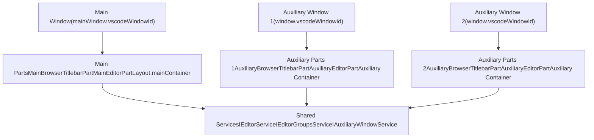
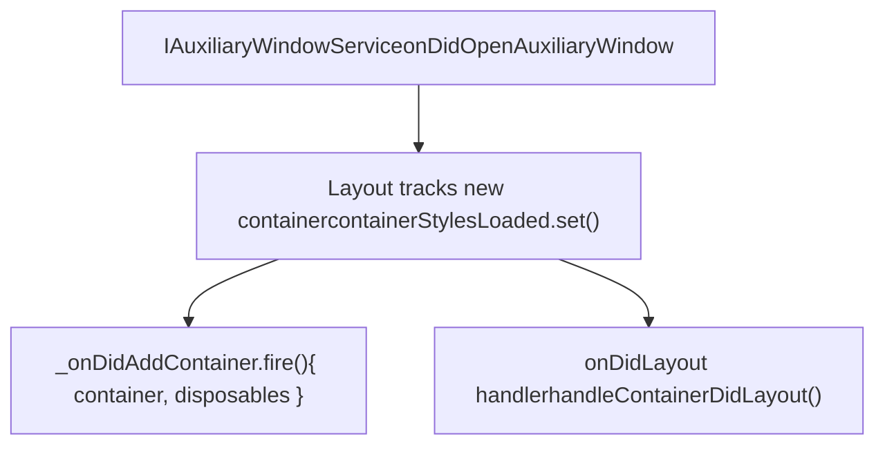
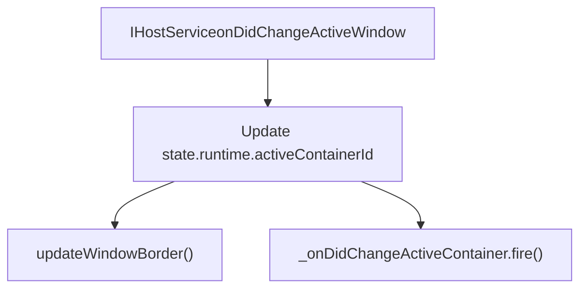
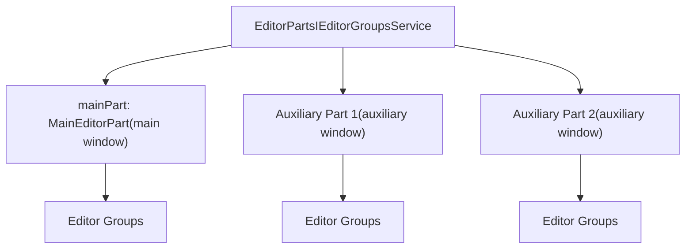
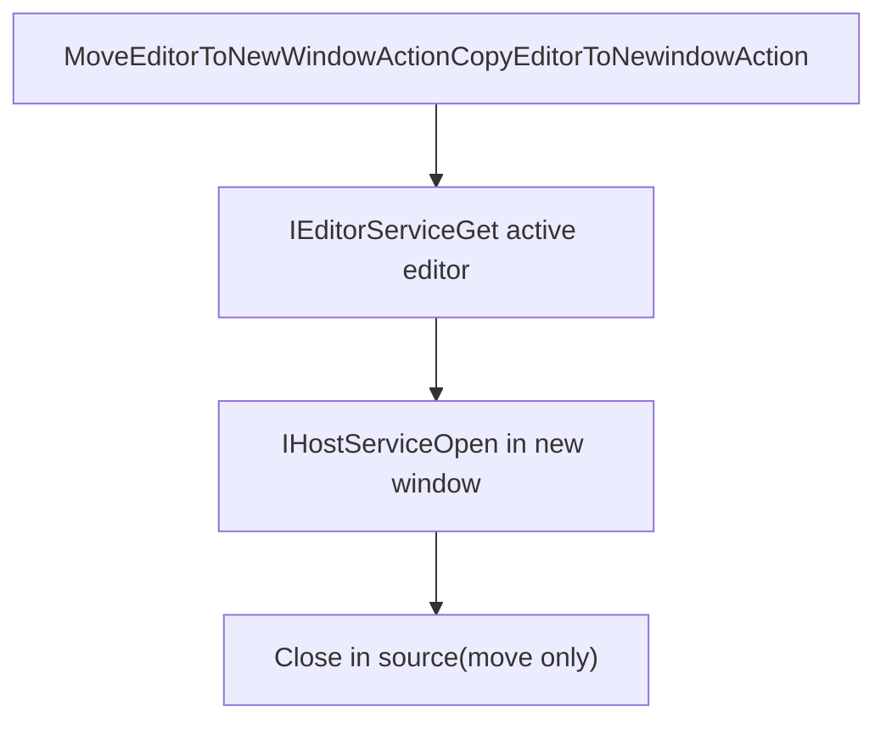
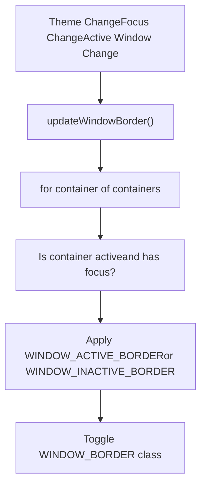
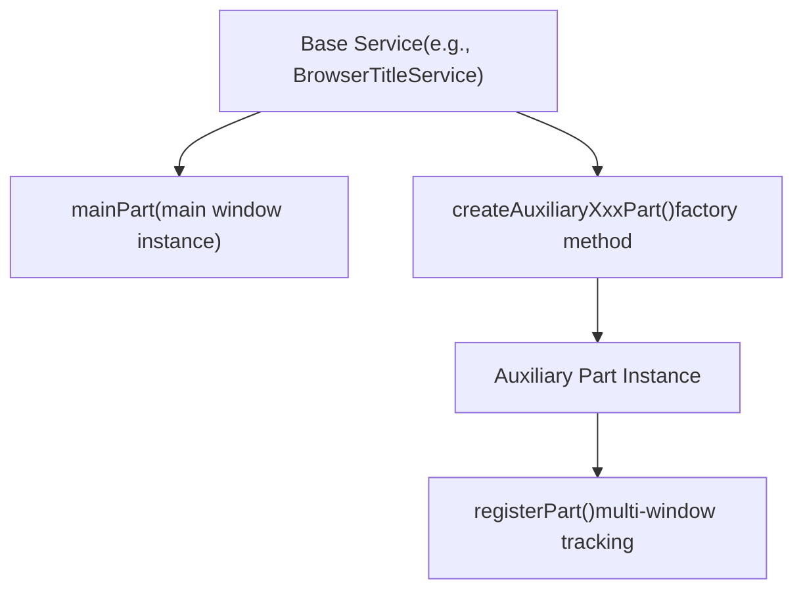

# Multi-Window Support

Relevant source files

-   [src/vs/platform/action/common/action.ts](https://github.com/microsoft/vscode/blob/1be3088d/src/vs/platform/action/common/action.ts)
-   [src/vs/platform/actions/browser/actionViewItemService.ts](https://github.com/microsoft/vscode/blob/1be3088d/src/vs/platform/actions/browser/actionViewItemService.ts)
-   [src/vs/platform/actions/browser/menuEntryActionViewItem.css](https://github.com/microsoft/vscode/blob/1be3088d/src/vs/platform/actions/browser/menuEntryActionViewItem.css)
-   [src/vs/platform/actions/browser/menuEntryActionViewItem.ts](https://github.com/microsoft/vscode/blob/1be3088d/src/vs/platform/actions/browser/menuEntryActionViewItem.ts)
-   [src/vs/platform/actions/browser/toolbar.ts](https://github.com/microsoft/vscode/blob/1be3088d/src/vs/platform/actions/browser/toolbar.ts)
-   [src/vs/platform/actions/common/actions.ts](https://github.com/microsoft/vscode/blob/1be3088d/src/vs/platform/actions/common/actions.ts)
-   [src/vs/platform/actions/common/menuService.ts](https://github.com/microsoft/vscode/blob/1be3088d/src/vs/platform/actions/common/menuService.ts)
-   [src/vs/platform/editor/common/editor.ts](https://github.com/microsoft/vscode/blob/1be3088d/src/vs/platform/editor/common/editor.ts)
-   [src/vs/platform/observable/common/platformObservableUtils.ts](https://github.com/microsoft/vscode/blob/1be3088d/src/vs/platform/observable/common/platformObservableUtils.ts)
-   [src/vs/workbench/browser/actions/layoutActions.ts](https://github.com/microsoft/vscode/blob/1be3088d/src/vs/workbench/browser/actions/layoutActions.ts)
-   [src/vs/workbench/browser/actions/quickAccessActions.ts](https://github.com/microsoft/vscode/blob/1be3088d/src/vs/workbench/browser/actions/quickAccessActions.ts)
-   [src/vs/workbench/browser/contextkeys.ts](https://github.com/microsoft/vscode/blob/1be3088d/src/vs/workbench/browser/contextkeys.ts)
-   [src/vs/workbench/browser/dnd.ts](https://github.com/microsoft/vscode/blob/1be3088d/src/vs/workbench/browser/dnd.ts)
-   [src/vs/workbench/browser/layout.ts](https://github.com/microsoft/vscode/blob/1be3088d/src/vs/workbench/browser/layout.ts)
-   [src/vs/workbench/browser/parts/auxiliarybar/auxiliaryBarActions.ts](https://github.com/microsoft/vscode/blob/1be3088d/src/vs/workbench/browser/parts/auxiliarybar/auxiliaryBarActions.ts)
-   [src/vs/workbench/browser/parts/editor/auxiliaryEditorPart.ts](https://github.com/microsoft/vscode/blob/1be3088d/src/vs/workbench/browser/parts/editor/auxiliaryEditorPart.ts)
-   [src/vs/workbench/browser/parts/editor/editor.contribution.ts](https://github.com/microsoft/vscode/blob/1be3088d/src/vs/workbench/browser/parts/editor/editor.contribution.ts)
-   [src/vs/workbench/browser/parts/editor/editor.ts](https://github.com/microsoft/vscode/blob/1be3088d/src/vs/workbench/browser/parts/editor/editor.ts)
-   [src/vs/workbench/browser/parts/editor/editorActions.ts](https://github.com/microsoft/vscode/blob/1be3088d/src/vs/workbench/browser/parts/editor/editorActions.ts)
-   [src/vs/workbench/browser/parts/editor/editorCommands.ts](https://github.com/microsoft/vscode/blob/1be3088d/src/vs/workbench/browser/parts/editor/editorCommands.ts)
-   [src/vs/workbench/browser/parts/editor/editorDropTarget.ts](https://github.com/microsoft/vscode/blob/1be3088d/src/vs/workbench/browser/parts/editor/editorDropTarget.ts)
-   [src/vs/workbench/browser/parts/editor/editorGroupView.ts](https://github.com/microsoft/vscode/blob/1be3088d/src/vs/workbench/browser/parts/editor/editorGroupView.ts)
-   [src/vs/workbench/browser/parts/editor/editorPart.ts](https://github.com/microsoft/vscode/blob/1be3088d/src/vs/workbench/browser/parts/editor/editorPart.ts)
-   [src/vs/workbench/browser/parts/editor/editorParts.ts](https://github.com/microsoft/vscode/blob/1be3088d/src/vs/workbench/browser/parts/editor/editorParts.ts)
-   [src/vs/workbench/browser/parts/panel/panelActions.ts](https://github.com/microsoft/vscode/blob/1be3088d/src/vs/workbench/browser/parts/panel/panelActions.ts)
-   [src/vs/workbench/browser/parts/titlebar/commandCenterControl.ts](https://github.com/microsoft/vscode/blob/1be3088d/src/vs/workbench/browser/parts/titlebar/commandCenterControl.ts)
-   [src/vs/workbench/browser/parts/titlebar/media/titlebarpart.css](https://github.com/microsoft/vscode/blob/1be3088d/src/vs/workbench/browser/parts/titlebar/media/titlebarpart.css)
-   [src/vs/workbench/browser/parts/titlebar/titlebarActions.ts](https://github.com/microsoft/vscode/blob/1be3088d/src/vs/workbench/browser/parts/titlebar/titlebarActions.ts)
-   [src/vs/workbench/browser/parts/titlebar/titlebarPart.ts](https://github.com/microsoft/vscode/blob/1be3088d/src/vs/workbench/browser/parts/titlebar/titlebarPart.ts)
-   [src/vs/workbench/browser/parts/titlebar/windowTitle.ts](https://github.com/microsoft/vscode/blob/1be3088d/src/vs/workbench/browser/parts/titlebar/windowTitle.ts)
-   [src/vs/workbench/browser/workbench.contribution.ts](https://github.com/microsoft/vscode/blob/1be3088d/src/vs/workbench/browser/workbench.contribution.ts)
-   [src/vs/workbench/browser/workbench.ts](https://github.com/microsoft/vscode/blob/1be3088d/src/vs/workbench/browser/workbench.ts)
-   [src/vs/workbench/common/contextkeys.ts](https://github.com/microsoft/vscode/blob/1be3088d/src/vs/workbench/common/contextkeys.ts)
-   [src/vs/workbench/common/editor.ts](https://github.com/microsoft/vscode/blob/1be3088d/src/vs/workbench/common/editor.ts)
-   [src/vs/workbench/contrib/chat/browser/widget/chatContentParts/chatInlineAnchorWidget.ts](https://github.com/microsoft/vscode/blob/1be3088d/src/vs/workbench/contrib/chat/browser/widget/chatContentParts/chatInlineAnchorWidget.ts)
-   [src/vs/workbench/contrib/chat/browser/widget/chatContentParts/chatMarkdownDecorationsRenderer.ts](https://github.com/microsoft/vscode/blob/1be3088d/src/vs/workbench/contrib/chat/browser/widget/chatContentParts/chatMarkdownDecorationsRenderer.ts)
-   [src/vs/workbench/contrib/chat/browser/widget/chatContentParts/media/chatInlineAnchorWidget.css](https://github.com/microsoft/vscode/blob/1be3088d/src/vs/workbench/contrib/chat/browser/widget/chatContentParts/media/chatInlineAnchorWidget.css)
-   [src/vs/workbench/contrib/debug/browser/statusbarColorProvider.ts](https://github.com/microsoft/vscode/blob/1be3088d/src/vs/workbench/contrib/debug/browser/statusbarColorProvider.ts)
-   [src/vs/workbench/services/actions/common/menusExtensionPoint.ts](https://github.com/microsoft/vscode/blob/1be3088d/src/vs/workbench/services/actions/common/menusExtensionPoint.ts)
-   [src/vs/workbench/services/editor/browser/editorService.ts](https://github.com/microsoft/vscode/blob/1be3088d/src/vs/workbench/services/editor/browser/editorService.ts)
-   [src/vs/workbench/services/editor/common/editorGroupsService.ts](https://github.com/microsoft/vscode/blob/1be3088d/src/vs/workbench/services/editor/common/editorGroupsService.ts)
-   [src/vs/workbench/services/editor/common/editorService.ts](https://github.com/microsoft/vscode/blob/1be3088d/src/vs/workbench/services/editor/common/editorService.ts)
-   [src/vs/workbench/services/editor/test/browser/editorGroupsService.test.ts](https://github.com/microsoft/vscode/blob/1be3088d/src/vs/workbench/services/editor/test/browser/editorGroupsService.test.ts)
-   [src/vs/workbench/services/editor/test/browser/editorService.test.ts](https://github.com/microsoft/vscode/blob/1be3088d/src/vs/workbench/services/editor/test/browser/editorService.test.ts)
-   [src/vs/workbench/services/layout/browser/layoutService.ts](https://github.com/microsoft/vscode/blob/1be3088d/src/vs/workbench/services/layout/browser/layoutService.ts)
-   [src/vs/workbench/test/browser/workbenchTestServices.ts](https://github.com/microsoft/vscode/blob/1be3088d/src/vs/workbench/test/browser/workbenchTestServices.ts)

## Purpose and Scope

This document describes VS Code's multi-window support system, which enables users to open editors in separate operating system windows. The system allows editors and editor groups to be moved or copied into auxiliary windows, providing flexible workspace layouts across multiple displays.

This page covers the architecture for managing multiple windows, coordinating layout and state, and the mechanisms for moving content between windows. For information about the single-window layout system, see [Layout System and Parts](/microsoft/vscode/5.1-layout-system-and-parts). For editor group management within a single window, see [Editor Service and Groups](/microsoft/vscode/5.2-editor-service-and-groups).

## Architecture Overview

VS Code's multi-window system is built on a primary/auxiliary model where one main window exists with zero or more auxiliary windows. Each window contains its own set of UI parts (titlebar, editor area, etc.) but shares service infrastructure through a common instantiation service.

### Window Types


**Sources:** [src/vs/workbench/browser/layout.ts187-205](https://github.com/microsoft/vscode/blob/1be3088d/src/vs/workbench/browser/layout.ts#L187-L205) [src/vs/workbench/browser/parts/titlebar/titlebarPart.ts88-218](https://github.com/microsoft/vscode/blob/1be3088d/src/vs/workbench/browser/parts/titlebar/titlebarPart.ts#L88-L218)

### Key Services and Classes

| Component | Purpose | File |
| --- | --- | --- |
| `IAuxiliaryWindowService` | Manages auxiliary window lifecycle and registration | Referenced in layout.ts:48 |
| `Layout.containers` | Tracks all window containers (main + auxiliary) | [src/vs/workbench/browser/layout.ts189-196](https://github.com/microsoft/vscode/blob/1be3088d/src/vs/workbench/browser/layout.ts#L189-L196) |
| `BrowserTitleService` | Multi-window title bar management | [src/vs/workbench/browser/parts/titlebar/titlebarPart.ts88-218](https://github.com/microsoft/vscode/blob/1be3088d/src/vs/workbench/browser/parts/titlebar/titlebarPart.ts#L88-L218) |
| `EditorParts` | Manages multiple editor parts across windows | [src/vs/workbench/browser/parts/editor/editorParts.ts1-35](https://github.com/microsoft/vscode/blob/1be3088d/src/vs/workbench/browser/parts/editor/editorParts.ts#L1-L35) |
| `AuxiliaryEditorPart` | Editor part instance for auxiliary windows | [src/vs/workbench/browser/parts/editor/auxiliaryEditorPart.ts1-30](https://github.com/microsoft/vscode/blob/1be3088d/src/vs/workbench/browser/parts/editor/auxiliaryEditorPart.ts#L1-L30) |

**Sources:** [src/vs/workbench/browser/layout.ts1-50](https://github.com/microsoft/vscode/blob/1be3088d/src/vs/workbench/browser/layout.ts#L1-L50) [src/vs/workbench/browser/parts/titlebar/titlebarPart.ts1-100](https://github.com/microsoft/vscode/blob/1be3088d/src/vs/workbench/browser/parts/titlebar/titlebarPart.ts#L1-L100)

## Window Lifecycle Management

### Container Registration and Tracking

The `Layout` class maintains awareness of all window containers through a unified container tracking system:


The Layout service registers listeners when auxiliary windows are created:

-   **Container tracking**: Each window container is tracked with its window ID in `containerStylesLoaded` map [src/vs/workbench/browser/layout.ts207-210](https://github.com/microsoft/vscode/blob/1be3088d/src/vs/workbench/browser/layout.ts#L207-L210)
-   **Event propagation**: When a container is added, `_onDidAddContainer` event fires with the container and disposables [src/vs/workbench/browser/layout.ts177-178](https://github.com/microsoft/vscode/blob/1be3088d/src/vs/workbench/browser/layout.ts#L177-L178)
-   **Layout coordination**: Layout events from auxiliary windows are handled through `handleContainerDidLayout` [src/vs/workbench/browser/layout.ts486-496](https://github.com/microsoft/vscode/blob/1be3088d/src/vs/workbench/browser/layout.ts#L486-L496)

**Sources:** [src/vs/workbench/browser/layout.ts449-461](https://github.com/microsoft/vscode/blob/1be3088d/src/vs/workbench/browser/layout.ts#L449-L461) [src/vs/workbench/browser/layout.ts486-496](https://github.com/microsoft/vscode/blob/1be3088d/src/vs/workbench/browser/layout.ts#L486-L496)

### Auxiliary Part Creation

Each auxiliary window requires its own UI parts. The creation pattern follows a factory approach:

> **[Mermaid sequence]**
> *(图表结构无法解析)*

The titlebar part creation process [src/vs/workbench/browser/parts/titlebar/titlebarPart.ts153-177](https://github.com/microsoft/vscode/blob/1be3088d/src/vs/workbench/browser/parts/titlebar/titlebarPart.ts#L153-L177):

1.  Creates a titlebar container element and inserts it as the first child
2.  Instantiates `AuxiliaryBrowserTitlebarPart` through the factory method
3.  Registers the part with the multi-window parts tracker
4.  Subscribes to dimension changes to update container height
5.  Propagates properties and variables to maintain consistency with main window
6.  Links disposal through `Event.once(titlebarPart.onWillDispose)`

**Sources:** [src/vs/workbench/browser/parts/titlebar/titlebarPart.ts153-177](https://github.com/microsoft/vscode/blob/1be3088d/src/vs/workbench/browser/parts/titlebar/titlebarPart.ts#L153-L177) [src/vs/workbench/browser/parts/editor/editorParts.ts1-100](https://github.com/microsoft/vscode/blob/1be3088d/src/vs/workbench/browser/parts/editor/editorParts.ts#L1-L100)

## Layout Coordination Across Windows

### Container Management

The Layout service provides unified access to containers across all windows:

```
// Containers property provides iterable of all containers
get containers(): Iterable<HTMLElement> {
    const containers: HTMLElement[] = [];
    for (const { window } of getWindows()) {
        containers.push(this.getContainerFromDocument(window.document));
    }
    return containers;
}

// Helper to get container for specific document
private getContainerFromDocument(targetDocument: Document): HTMLElement {
    if (targetDocument === this.mainContainer.ownerDocument) {
        return this.mainContainer; // main window
    } else {
        return targetDocument.body.getElementsByClassName('monaco-workbench')[0] as HTMLElement;
    }
}
```
**Sources:** [src/vs/workbench/browser/layout.ts189-205](https://github.com/microsoft/vscode/blob/1be3088d/src/vs/workbench/browser/layout.ts#L189-L205)

### Active Container and Dimension Tracking

The layout system tracks which container is currently active and maintains dimension information:

| Property | Purpose | Implementation |
| --- | --- | --- |
| `activeContainer` | Returns container of active document | [src/vs/workbench/browser/layout.ts188](https://github.com/microsoft/vscode/blob/1be3088d/src/vs/workbench/browser/layout.ts#L188-L188) |
| `activeContainerDimension` | Dimension of active container | [src/vs/workbench/browser/layout.ts215-217](https://github.com/microsoft/vscode/blob/1be3088d/src/vs/workbench/browser/layout.ts#L215-L217) |
| `mainContainerDimension` | Cached dimension of main container | [src/vs/workbench/browser/layout.ts212-213](https://github.com/microsoft/vscode/blob/1be3088d/src/vs/workbench/browser/layout.ts#L212-L213) |
| `activeContainerId` | Window ID of active container | [src/vs/workbench/browser/layout.ts553-557](https://github.com/microsoft/vscode/blob/1be3088d/src/vs/workbench/browser/layout.ts#L553-L557) |

The layout service emits different events based on which container changes:

-   `_onDidLayoutMainContainer` - Fires only for main window layout changes [src/vs/workbench/browser/layout.ts168-169](https://github.com/microsoft/vscode/blob/1be3088d/src/vs/workbench/browser/layout.ts#L168-L169)
-   `_onDidLayoutActiveContainer` - Fires when the active container layouts [src/vs/workbench/browser/layout.ts171-172](https://github.com/microsoft/vscode/blob/1be3088d/src/vs/workbench/browser/layout.ts#L171-L172)
-   `_onDidLayoutContainer` - Fires for any container with `{ container, dimension }` [src/vs/workbench/browser/layout.ts174-175](https://github.com/microsoft/vscode/blob/1be3088d/src/vs/workbench/browser/layout.ts#L174-L175)

**Sources:** [src/vs/workbench/browser/layout.ts212-226](https://github.com/microsoft/vscode/blob/1be3088d/src/vs/workbench/browser/layout.ts#L212-L226) [src/vs/workbench/browser/layout.ts486-496](https://github.com/microsoft/vscode/blob/1be3088d/src/vs/workbench/browser/layout.ts#L486-L496)

### Active Window Tracking

The system tracks active window changes through runtime state:


When the active window changes [src/vs/workbench/browser/layout.ts532-542](https://github.com/microsoft/vscode/blob/1be3088d/src/vs/workbench/browser/layout.ts#L532-L542):

1.  The `onDidChangeActiveWindow` event fires from `IHostService`
2.  Layout updates `state.runtime.activeContainerId` if it changed
3.  Window border styling is updated to indicate active/inactive state
4.  The `_onDidChangeActiveContainer` event propagates the change

**Sources:** [src/vs/workbench/browser/layout.ts532-542](https://github.com/microsoft/vscode/blob/1be3088d/src/vs/workbench/browser/layout.ts#L532-L542) [src/vs/workbench/browser/layout.ts604-647](https://github.com/microsoft/vscode/blob/1be3088d/src/vs/workbench/browser/layout.ts#L604-L647)

## Editor Management Across Windows

### Editor Parts Architecture

The `EditorParts` class manages multiple editor part instances:


Each editor part maintains its own:

-   Editor group layout and organization
-   Active group tracking
-   Grid-based layout management
-   Local UI state and rendering

**Sources:** [src/vs/workbench/browser/parts/editor/editorParts.ts1-100](https://github.com/microsoft/vscode/blob/1be3088d/src/vs/workbench/browser/parts/editor/editorParts.ts#L1-L100)

### Moving Editors Between Windows

The system provides several mechanisms to move editors between windows:

| Command ID | Action | Implementation |
| --- | --- | --- |
| `MOVE_EDITOR_INTO_NEW_WINDOW_COMMAND_ID` | Move active editor to new window | [src/vs/workbench/browser/parts/editor/editorCommands.ts54](https://github.com/microsoft/vscode/blob/1be3088d/src/vs/workbench/browser/parts/editor/editorCommands.ts#L54-L54) |
| `COPY_EDITOR_INTO_NEW_WINDOW_COMMAND_ID` | Copy active editor to new window | [src/vs/workbench/browser/parts/editor/editorCommands.ts54](https://github.com/microsoft/vscode/blob/1be3088d/src/vs/workbench/browser/parts/editor/editorCommands.ts#L54-L54) |
| `MOVE_EDITOR_GROUP_INTO_NEW_WINDOW_COMMAND_ID` | Move entire group to new window | [src/vs/workbench/browser/parts/editor/editorCommands.ts54](https://github.com/microsoft/vscode/blob/1be3088d/src/vs/workbench/browser/parts/editor/editorCommands.ts#L54-L54) |
| `COPY_EDITOR_GROUP_INTO_NEW_WINDOW_COMMAND_ID` | Copy entire group to new window | [src/vs/workbench/browser/parts/editor/editorCommands.ts54](https://github.com/microsoft/vscode/blob/1be3088d/src/vs/workbench/browser/parts/editor/editorCommands.ts#L54-L54) |
| `NEW_EMPTY_EDITOR_WINDOW_COMMAND_ID` | Open new empty window | [src/vs/workbench/browser/parts/editor/editorCommands.ts54](https://github.com/microsoft/vscode/blob/1be3088d/src/vs/workbench/browser/parts/editor/editorCommands.ts#L54-L54) |

**Sources:** [src/vs/workbench/browser/parts/editor/editorCommands.ts45-65](https://github.com/microsoft/vscode/blob/1be3088d/src/vs/workbench/browser/parts/editor/editorCommands.ts#L45-L65) [src/vs/workbench/browser/parts/editor/editorActions.ts15](https://github.com/microsoft/vscode/blob/1be3088d/src/vs/workbench/browser/parts/editor/editorActions.ts#L15-L15)

### Move/Copy Actions Implementation

The action classes implement the window transfer logic:


Key action classes [src/vs/workbench/browser/parts/editor/editorActions.ts2300-2500](https://github.com/microsoft/vscode/blob/1be3088d/src/vs/workbench/browser/parts/editor/editorActions.ts#L2300-L2500):

-   `MoveEditorToNewWindowAction` - Moves editor and closes in source window
-   `CopyEditorToNewindowAction` - Copies editor, keeps in source window
-   `MoveEditorGroupToNewWindowAction` - Moves entire group
-   `CopyEditorGroupToNewWindowAction` - Copies entire group
-   `RestoreEditorsToMainWindowAction` - Restores all editors to main window
-   `NewEmptyEditorWindowAction` - Opens new window without editors

**Sources:** [src/vs/workbench/browser/parts/editor/editorActions.ts2300-2600](https://github.com/microsoft/vscode/blob/1be3088d/src/vs/workbench/browser/parts/editor/editorActions.ts#L2300-L2600)

## Drag and Drop Between Windows

### Configuration

Users can drag editors out of windows to open them in new windows. This is controlled by configuration:

```
'workbench.editor.dragToOpenWindow': {
    'type': 'boolean',
    'default': true,
    'markdownDescription': localize('dragToOpenWindow',
        "Controls if editors can be dragged out of the window to open them in a new window. " +
        "Press and hold the `Alt` key while dragging to toggle this dynamically.")
}
```
**Sources:** [src/vs/workbench/browser/workbench.contribution.ts295-299](https://github.com/microsoft/vscode/blob/1be3088d/src/vs/workbench/browser/workbench.contribution.ts#L295-L299)

### Drag Detection

The drag and drop system detects when editors should open in new windows based on:

-   User configuration `workbench.editor.dragToOpenWindow`
-   Alt key state during drag operation
-   Drag position relative to window boundaries

**Sources:** [src/vs/workbench/browser/workbench.contribution.ts295-299](https://github.com/microsoft/vscode/blob/1be3088d/src/vs/workbench/browser/workbench.contribution.ts#L295-L299) [src/vs/workbench/browser/dnd.ts1-100](https://github.com/microsoft/vscode/blob/1be3088d/src/vs/workbench/browser/dnd.ts#L1-L100)

## Context Keys and State Management

### Window-Specific Context Keys

The system provides context keys to identify window state:

| Context Key | Purpose | Definition |
| --- | --- | --- |
| `IsAuxiliaryWindowContext` | True when code is running in auxiliary window | [src/vs/workbench/common/contextkeys.ts1-100](https://github.com/microsoft/vscode/blob/1be3088d/src/vs/workbench/common/contextkeys.ts#L1-L100) |
| `IsAuxiliaryWindowFocusedContext` | True when auxiliary window has focus | [src/vs/workbench/common/contextkeys.ts1-100](https://github.com/microsoft/vscode/blob/1be3088d/src/vs/workbench/common/contextkeys.ts#L1-L100) |
| `IsMainWindowFullscreenContext` | True when main window is fullscreen | [src/vs/workbench/common/contextkeys.ts1-100](https://github.com/microsoft/vscode/blob/1be3088d/src/vs/workbench/common/contextkeys.ts#L1-L100) |

These context keys enable:

-   Commands to be scoped to specific window types
-   UI elements to show/hide based on window context
-   Different behavior in main vs auxiliary windows

**Sources:** [src/vs/workbench/common/contextkeys.ts1-100](https://github.com/microsoft/vscode/blob/1be3088d/src/vs/workbench/common/contextkeys.ts#L1-L100) [src/vs/workbench/browser/contextkeys.ts1-100](https://github.com/microsoft/vscode/blob/1be3088d/src/vs/workbench/browser/contextkeys.ts#L1-L100)

### Runtime State Coordination

The Layout maintains runtime state that spans windows:

```
interface ILayoutRuntimeState {
    activeContainerId: number;              // Which window is active
    mainWindowFullscreen: boolean;          // Main window fullscreen state
    readonly maximized: Set<number>;        // Maximized window IDs
    hasFocus: boolean;                      // Any window has focus
    mainWindowBorder: boolean;              // Border rendering state
    // ... other state
}
```
This state is updated through:

-   Host service events (`onDidChangeFocus`, `onDidChangeActiveWindow`)
-   Fullscreen change events (`onDidChangeFullscreen`)
-   Window focus events

**Sources:** [src/vs/workbench/browser/layout.ts53-65](https://github.com/microsoft/vscode/blob/1be3088d/src/vs/workbench/browser/layout.ts#L53-L65) [src/vs/workbench/browser/layout.ts532-551](https://github.com/microsoft/vscode/blob/1be3088d/src/vs/workbench/browser/layout.ts#L532-L551)

## Window Border and Styling

### Cross-Window Style Coordination

The layout service manages window borders across all windows to indicate active/inactive state:


The border update logic [src/vs/workbench/browser/layout.ts604-647](https://github.com/microsoft/vscode/blob/1be3088d/src/vs/workbench/browser/layout.ts#L604-L647):

1.  Iterates through all containers (main + auxiliary)
2.  Determines if window should show border based on fullscreen and theme colors
3.  Applies active or inactive border color based on focus state
4.  Updates container's `--window-border-color` CSS variable
5.  Toggles `WINDOW_BORDER` CSS class

**Sources:** [src/vs/workbench/browser/layout.ts604-647](https://github.com/microsoft/vscode/blob/1be3088d/src/vs/workbench/browser/layout.ts#L604-L647)

## Parts and Multi-Window Support

### Parts Classification

VS Code parts are classified as either single-window or multi-window capable:

```
// Parts that exist only in main window
const SINGLE_WINDOW_PARTS = [
    Parts.ACTIVITYBAR_PART,
    Parts.BANNER_PART,
    Parts.STATUSBAR_PART,
    Parts.SIDEBAR_PART,
    Parts.PANEL_PART,
    Parts.AUXILIARYBAR_PART
];

// Parts that can exist in multiple windows
const MULTI_WINDOW_PARTS = [
    Parts.TITLEBAR_PART,
    Parts.EDITOR_PART
];
```
**Sources:** Referenced in [src/vs/workbench/services/layout/browser/layoutService.ts1-100](https://github.com/microsoft/vscode/blob/1be3088d/src/vs/workbench/services/layout/browser/layoutService.ts#L1-L100)

### Multi-Window Parts Pattern

Parts that support multi-window follow a common pattern:


1.  Service extends `MultiWindowParts<T>` base class
2.  Creates and owns a `mainPart` instance
3.  Provides factory method to create auxiliary parts
4.  Each part is registered for lifecycle tracking
5.  Parts share state through the service layer

**Sources:** [src/vs/workbench/browser/parts/titlebar/titlebarPart.ts88-218](https://github.com/microsoft/vscode/blob/1be3088d/src/vs/workbench/browser/parts/titlebar/titlebarPart.ts#L88-L218)
