# Extension System

Relevant source files

-   [extensions/vscode-api-tests/package.json](https://github.com/microsoft/vscode/blob/1be3088d/extensions/vscode-api-tests/package.json)
-   [extensions/vscode-api-tests/src/singlefolder-tests/chat.test.ts](https://github.com/microsoft/vscode/blob/1be3088d/extensions/vscode-api-tests/src/singlefolder-tests/chat.test.ts)
-   [src/vs/editor/common/languages.ts](https://github.com/microsoft/vscode/blob/1be3088d/src/vs/editor/common/languages.ts)
-   [src/vs/platform/extensionManagement/common/abstractExtensionManagementService.ts](https://github.com/microsoft/vscode/blob/1be3088d/src/vs/platform/extensionManagement/common/abstractExtensionManagementService.ts)
-   [src/vs/platform/extensionManagement/common/extensionGalleryService.ts](https://github.com/microsoft/vscode/blob/1be3088d/src/vs/platform/extensionManagement/common/extensionGalleryService.ts)
-   [src/vs/platform/extensionManagement/common/extensionManagement.ts](https://github.com/microsoft/vscode/blob/1be3088d/src/vs/platform/extensionManagement/common/extensionManagement.ts)
-   [src/vs/platform/extensionManagement/common/extensionManagementIpc.ts](https://github.com/microsoft/vscode/blob/1be3088d/src/vs/platform/extensionManagement/common/extensionManagementIpc.ts)
-   [src/vs/platform/extensionManagement/common/extensionManagementUtil.ts](https://github.com/microsoft/vscode/blob/1be3088d/src/vs/platform/extensionManagement/common/extensionManagementUtil.ts)
-   [src/vs/platform/extensionManagement/node/extensionManagementService.ts](https://github.com/microsoft/vscode/blob/1be3088d/src/vs/platform/extensionManagement/node/extensionManagementService.ts)
-   [src/vs/platform/extensions/common/extensionsApiProposals.ts](https://github.com/microsoft/vscode/blob/1be3088d/src/vs/platform/extensions/common/extensionsApiProposals.ts)
-   [src/vs/workbench/api/browser/mainThreadChatAgents2.ts](https://github.com/microsoft/vscode/blob/1be3088d/src/vs/workbench/api/browser/mainThreadChatAgents2.ts)
-   [src/vs/workbench/api/browser/mainThreadChatStatus.ts](https://github.com/microsoft/vscode/blob/1be3088d/src/vs/workbench/api/browser/mainThreadChatStatus.ts)
-   [src/vs/workbench/api/browser/mainThreadLanguageFeatures.ts](https://github.com/microsoft/vscode/blob/1be3088d/src/vs/workbench/api/browser/mainThreadLanguageFeatures.ts)
-   [src/vs/workbench/api/common/extHost.api.impl.ts](https://github.com/microsoft/vscode/blob/1be3088d/src/vs/workbench/api/common/extHost.api.impl.ts)
-   [src/vs/workbench/api/common/extHost.protocol.ts](https://github.com/microsoft/vscode/blob/1be3088d/src/vs/workbench/api/common/extHost.protocol.ts)
-   [src/vs/workbench/api/common/extHostChatAgents2.ts](https://github.com/microsoft/vscode/blob/1be3088d/src/vs/workbench/api/common/extHostChatAgents2.ts)
-   [src/vs/workbench/api/common/extHostChatStatus.ts](https://github.com/microsoft/vscode/blob/1be3088d/src/vs/workbench/api/common/extHostChatStatus.ts)
-   [src/vs/workbench/api/common/extHostLanguageFeatures.ts](https://github.com/microsoft/vscode/blob/1be3088d/src/vs/workbench/api/common/extHostLanguageFeatures.ts)
-   [src/vs/workbench/api/common/extHostTypeConverters.ts](https://github.com/microsoft/vscode/blob/1be3088d/src/vs/workbench/api/common/extHostTypeConverters.ts)
-   [src/vs/workbench/api/common/extHostTypes.ts](https://github.com/microsoft/vscode/blob/1be3088d/src/vs/workbench/api/common/extHostTypes.ts)
-   [src/vs/workbench/contrib/chat/browser/actions/chatActions.ts](https://github.com/microsoft/vscode/blob/1be3088d/src/vs/workbench/contrib/chat/browser/actions/chatActions.ts)
-   [src/vs/workbench/contrib/chat/browser/actions/chatExecuteActions.ts](https://github.com/microsoft/vscode/blob/1be3088d/src/vs/workbench/contrib/chat/browser/actions/chatExecuteActions.ts)
-   [src/vs/workbench/contrib/chat/browser/actions/chatGettingStarted.ts](https://github.com/microsoft/vscode/blob/1be3088d/src/vs/workbench/contrib/chat/browser/actions/chatGettingStarted.ts)
-   [src/vs/workbench/contrib/chat/browser/chat.contribution.ts](https://github.com/microsoft/vscode/blob/1be3088d/src/vs/workbench/contrib/chat/browser/chat.contribution.ts)
-   [src/vs/workbench/contrib/chat/browser/chat.ts](https://github.com/microsoft/vscode/blob/1be3088d/src/vs/workbench/contrib/chat/browser/chat.ts)
-   [src/vs/workbench/contrib/chat/common/constants.ts](https://github.com/microsoft/vscode/blob/1be3088d/src/vs/workbench/contrib/chat/common/constants.ts)
-   [src/vs/workbench/contrib/chat/test/common/voiceChatService.test.ts](https://github.com/microsoft/vscode/blob/1be3088d/src/vs/workbench/contrib/chat/test/common/voiceChatService.test.ts)
-   [src/vs/workbench/contrib/extensions/browser/extensionEditor.ts](https://github.com/microsoft/vscode/blob/1be3088d/src/vs/workbench/contrib/extensions/browser/extensionEditor.ts)
-   [src/vs/workbench/contrib/extensions/browser/extensions.contribution.ts](https://github.com/microsoft/vscode/blob/1be3088d/src/vs/workbench/contrib/extensions/browser/extensions.contribution.ts)
-   [src/vs/workbench/contrib/extensions/browser/extensionsActions.ts](https://github.com/microsoft/vscode/blob/1be3088d/src/vs/workbench/contrib/extensions/browser/extensionsActions.ts)
-   [src/vs/workbench/contrib/extensions/browser/extensionsIcons.ts](https://github.com/microsoft/vscode/blob/1be3088d/src/vs/workbench/contrib/extensions/browser/extensionsIcons.ts)
-   [src/vs/workbench/contrib/extensions/browser/extensionsList.ts](https://github.com/microsoft/vscode/blob/1be3088d/src/vs/workbench/contrib/extensions/browser/extensionsList.ts)
-   [src/vs/workbench/contrib/extensions/browser/extensionsViewer.ts](https://github.com/microsoft/vscode/blob/1be3088d/src/vs/workbench/contrib/extensions/browser/extensionsViewer.ts)
-   [src/vs/workbench/contrib/extensions/browser/extensionsViewlet.ts](https://github.com/microsoft/vscode/blob/1be3088d/src/vs/workbench/contrib/extensions/browser/extensionsViewlet.ts)
-   [src/vs/workbench/contrib/extensions/browser/extensionsViews.ts](https://github.com/microsoft/vscode/blob/1be3088d/src/vs/workbench/contrib/extensions/browser/extensionsViews.ts)
-   [src/vs/workbench/contrib/extensions/browser/extensionsWidgets.ts](https://github.com/microsoft/vscode/blob/1be3088d/src/vs/workbench/contrib/extensions/browser/extensionsWidgets.ts)
-   [src/vs/workbench/contrib/extensions/browser/extensionsWorkbenchService.ts](https://github.com/microsoft/vscode/blob/1be3088d/src/vs/workbench/contrib/extensions/browser/extensionsWorkbenchService.ts)
-   [src/vs/workbench/contrib/extensions/browser/media/extension.css](https://github.com/microsoft/vscode/blob/1be3088d/src/vs/workbench/contrib/extensions/browser/media/extension.css)
-   [src/vs/workbench/contrib/extensions/browser/media/extensionActions.css](https://github.com/microsoft/vscode/blob/1be3088d/src/vs/workbench/contrib/extensions/browser/media/extensionActions.css)
-   [src/vs/workbench/contrib/extensions/browser/media/extensionEditor.css](https://github.com/microsoft/vscode/blob/1be3088d/src/vs/workbench/contrib/extensions/browser/media/extensionEditor.css)
-   [src/vs/workbench/contrib/extensions/browser/media/extensionsViewlet.css](https://github.com/microsoft/vscode/blob/1be3088d/src/vs/workbench/contrib/extensions/browser/media/extensionsViewlet.css)
-   [src/vs/workbench/contrib/extensions/browser/media/extensionsWidgets.css](https://github.com/microsoft/vscode/blob/1be3088d/src/vs/workbench/contrib/extensions/browser/media/extensionsWidgets.css)
-   [src/vs/workbench/contrib/extensions/common/extensions.ts](https://github.com/microsoft/vscode/blob/1be3088d/src/vs/workbench/contrib/extensions/common/extensions.ts)
-   [src/vs/workbench/services/extensionManagement/common/extensionManagement.ts](https://github.com/microsoft/vscode/blob/1be3088d/src/vs/workbench/services/extensionManagement/common/extensionManagement.ts)
-   [src/vs/workbench/services/extensionManagement/common/extensionManagementChannelClient.ts](https://github.com/microsoft/vscode/blob/1be3088d/src/vs/workbench/services/extensionManagement/common/extensionManagementChannelClient.ts)
-   [src/vs/workbench/services/extensionManagement/common/extensionManagementService.ts](https://github.com/microsoft/vscode/blob/1be3088d/src/vs/workbench/services/extensionManagement/common/extensionManagementService.ts)
-   [src/vs/workbench/services/extensionManagement/common/webExtensionManagementService.ts](https://github.com/microsoft/vscode/blob/1be3088d/src/vs/workbench/services/extensionManagement/common/webExtensionManagementService.ts)
-   [src/vscode-dts/vscode.d.ts](https://github.com/microsoft/vscode/blob/1be3088d/src/vscode-dts/vscode.d.ts)
-   [src/vscode-dts/vscode.proposed.chatParticipantAdditions.d.ts](https://github.com/microsoft/vscode/blob/1be3088d/src/vscode-dts/vscode.proposed.chatParticipantAdditions.d.ts)
-   [src/vscode-dts/vscode.proposed.chatStatusItem.d.ts](https://github.com/microsoft/vscode/blob/1be3088d/src/vscode-dts/vscode.proposed.chatStatusItem.d.ts)
-   [src/vscode-dts/vscode.proposed.defaultChatParticipant.d.ts](https://github.com/microsoft/vscode/blob/1be3088d/src/vscode-dts/vscode.proposed.defaultChatParticipant.d.ts)
-   [src/vscode-dts/vscode.proposed.inlineCompletionsAdditions.d.ts](https://github.com/microsoft/vscode/blob/1be3088d/src/vscode-dts/vscode.proposed.inlineCompletionsAdditions.d.ts)

## Purpose and Scope

The Extension System provides the infrastructure for third-party extensions to add functionality to VS Code. It encompasses the isolated extension host runtime, the `vscode.*` API surface, the RPC communication protocol between the extension host and main UI process, language features providers, and extension management (installation, activation, enablement). This system enables VS Code's extensibility while maintaining stability and security through process isolation.

For information about the workbench UI framework where extensions integrate, see [Workbench Architecture](/microsoft/vscode/5-workbench-architecture). For details on specific features like notebooks or chat that expose extension APIs, see [Notebooks](/microsoft/vscode/9-notebooks) and [Chat and AI Integration](/microsoft/vscode/8-chat-and-ai-integration).

---

## Architecture Overview

### Dual-Process Architecture

The extension system uses a two-process architecture to isolate extension code from the main VS Code UI process:

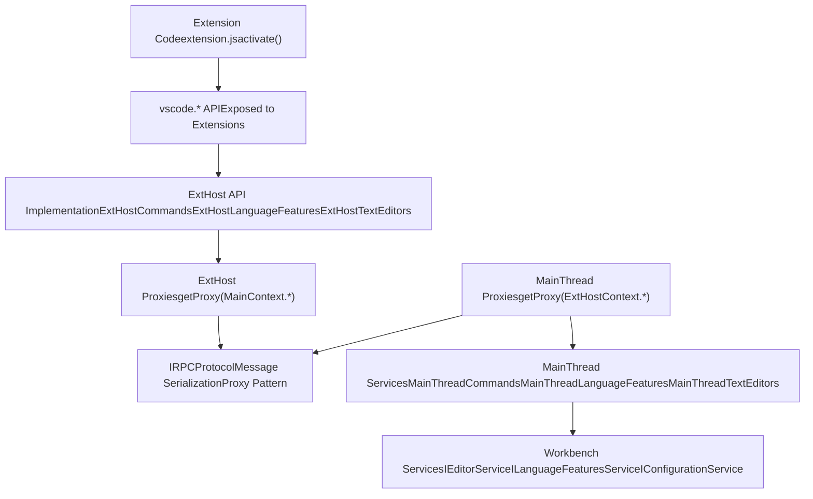
**Sources:** [src/vs/workbench/api/common/extHost.protocol.ts117-119](https://github.com/microsoft/vscode/blob/1be3088d/src/vs/workbench/api/common/extHost.protocol.ts#L117-L119) [src/vs/workbench/api/common/extHost.api.impl.ts132-256](https://github.com/microsoft/vscode/blob/1be3088d/src/vs/workbench/api/common/extHost.api.impl.ts#L132-L256) Diagram 2 from high-level architecture

The main thread runs the UI and core services, while the extension host runs extension code in isolation. Communication happens via an RPC protocol using proxies.

---

## Extension Host and RPC Protocol

### Extension Host Process Initialization

The extension host is a separate Node.js or Web Worker process that loads and runs extension code:

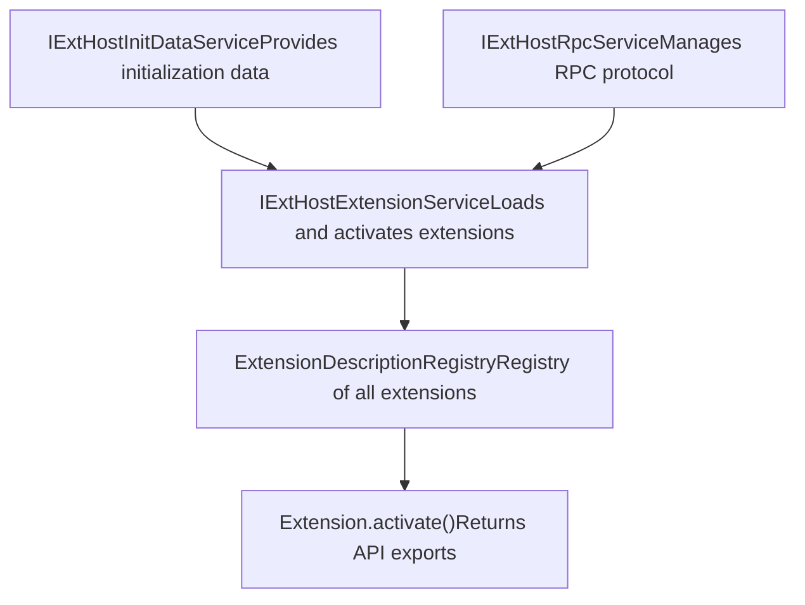
**Sources:** [src/vs/workbench/api/common/extHost.api.impl.ts133-180](https://github.com/microsoft/vscode/blob/1be3088d/src/vs/workbench/api/common/extHost.api.impl.ts#L133-L180)

### RPC Protocol and Proxy Pattern

The RPC protocol enables type-safe communication between processes:

| Component | Location | Purpose |
| --- | --- | --- |
| `IRPCProtocol` | Main & ExtHost | Core protocol interface for bidirectional communication |
| `ProxyIdentifier<T>` | [extHost.protocol.ts](https://github.com/microsoft/vscode/blob/1be3088d/extHost.protocol.ts) | Type-safe identifier for remote objects |
| `ExtHostContext` | [extHost.protocol.ts](https://github.com/microsoft/vscode/blob/1be3088d/extHost.protocol.ts) | Enum of all ExtHost proxy identifiers |
| `MainContext` | [extHost.protocol.ts](https://github.com/microsoft/vscode/blob/1be3088d/extHost.protocol.ts) | Enum of all MainThread proxy identifiers |
| `createProxyIdentifier<T>()` | [proxyIdentifier.ts](https://github.com/microsoft/vscode/blob/1be3088d/proxyIdentifier.ts) | Creates typed proxy identifier |

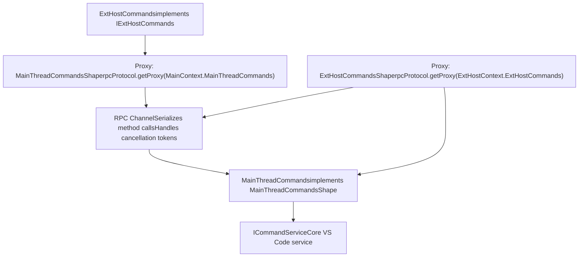
**Sources:** [src/vs/workbench/services/extensions/common/proxyIdentifier.ts](https://github.com/microsoft/vscode/blob/1be3088d/src/vs/workbench/services/extensions/common/proxyIdentifier.ts) [src/vs/workbench/api/common/extHost.protocol.ts117-133](https://github.com/microsoft/vscode/blob/1be3088d/src/vs/workbench/api/common/extHost.protocol.ts#L117-L133)

### Protocol Shape Definitions

The protocol defines bidirectional interfaces for all communication:

**MainThread Shapes** (called from ExtHost):

-   `MainThreadCommandsShape` - execute commands, register commands
-   `MainThreadLanguageFeaturesShape` - register language providers
-   `MainThreadTextEditorsShape` - manipulate text editors
-   `MainThreadDocumentsShape` - document operations

**ExtHost Shapes** (called from MainThread):

-   `ExtHostCommandsShape` - execute extension commands
-   `ExtHostLanguageFeaturesShape` - invoke language providers
-   `ExtHostDocumentsShape` - document change notifications

**Sources:** [src/vs/workbench/api/common/extHost.protocol.ts122-800](https://github.com/microsoft/vscode/blob/1be3088d/src/vs/workbench/api/common/extHost.protocol.ts#L122-L800)

---

## Extension API Surface (vscode.\*)

### API Factory Pattern

The `vscode.*` API is constructed per extension to provide isolation and tracking:

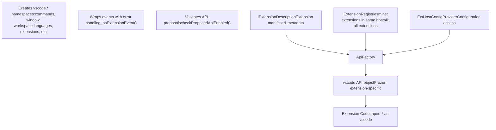
**Sources:** [src/vs/workbench/api/common/extHost.api.impl.ts132-256](https://github.com/microsoft/vscode/blob/1be3088d/src/vs/workbench/api/common/extHost.api.impl.ts#L132-L256)

### Core API Namespaces

The `vscode.*` API is organized into namespaces:

| Namespace | Purpose | Key ExtHost Class |
| --- | --- | --- |
| `vscode.commands` | Register and execute commands | `ExtHostCommands` |
| `vscode.window` | UI interactions, editors, terminals | `ExtHostWindow`, `ExtHostEditors`, `ExtHostTerminalService` |
| `vscode.workspace` | Workspace access, configuration | `ExtHostWorkspace`, `ExtHostConfiguration` |
| `vscode.languages` | Language features, diagnostics | `ExtHostLanguages`, `ExtHostLanguageFeatures`, `ExtHostDiagnostics` |
| `vscode.extensions` | Access other extensions | `ExtHostExtensionService` |
| `vscode.env` | Environment info, clipboard | `ExtHostClipboard`, init data |
| `vscode.authentication` | Authentication providers | `ExtHostAuthentication` |
| `vscode.notebooks` | Notebook support | `ExtHostNotebookController`, `ExtHostNotebookKernels` |
| `vscode.chat` | Chat participants (proposed) | `ExtHostChatAgents2` |

**Sources:** [src/vs/workbench/api/common/extHost.api.impl.ts342-1140](https://github.com/microsoft/vscode/blob/1be3088d/src/vs/workbench/api/common/extHost.api.impl.ts#L342-L1140)

### Type Conversion System

The `extHostTypeConverters` module translates between the extension API types and internal VS Code types:

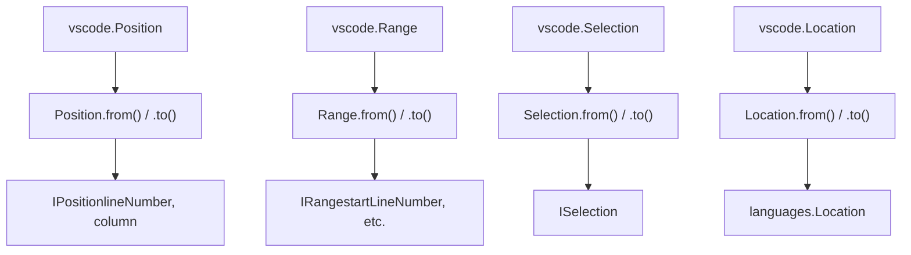
**Key Conversion Details:**

-   **Position**: API uses 0-based line/character, internal uses 1-based lineNumber/column
-   **URIs**: API uses `vscode.Uri`, internal uses `URI`, with URI transformation for remoting
-   **Diagnostics**: API `vscode.Diagnostic` to internal `IMarkerData`
-   **Commands**: API `vscode.Command` to internal `ICommandDto` with disposable tracking

**Sources:** [src/vs/workbench/api/common/extHostTypeConverters.ts72-176](https://github.com/microsoft/vscode/blob/1be3088d/src/vs/workbench/api/common/extHostTypeConverters.ts#L72-L176) [src/vs/workbench/api/common/extHostTypeConverters.ts236-284](https://github.com/microsoft/vscode/blob/1be3088d/src/vs/workbench/api/common/extHostTypeConverters.ts#L236-L284)

---

## Language Features Provider System

### Provider Registration Flow

Extensions register language feature providers through the `vscode.languages.*` API:

> **[Mermaid sequence]**
> *(图表结构无法解析)*

**Sources:** [src/vs/workbench/api/common/extHostLanguageFeatures.ts2200-2250](https://github.com/microsoft/vscode/blob/1be3088d/src/vs/workbench/api/common/extHostLanguageFeatures.ts#L2200-L2250)

### Language Feature Adapters

Adapters wrap extension providers and handle protocol communication:

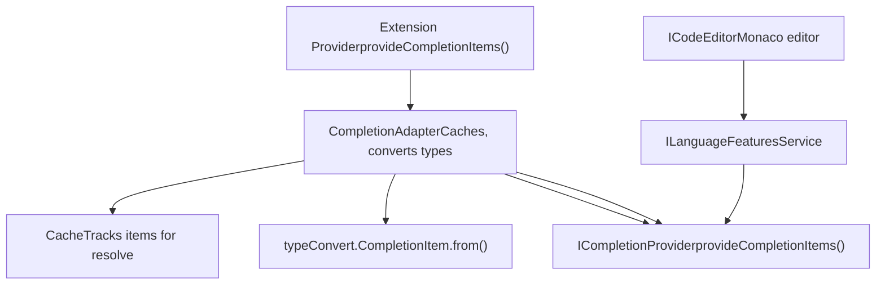
**Key Adapter Classes:**

| Adapter | Provider Type | Protocol Methods |
| --- | --- | --- |
| `CompletionAdapter` | `vscode.CompletionItemProvider` | `provideCompletionItems`, `resolveCompletionItem` |
| `HoverAdapter` | `vscode.HoverProvider` | `provideHover` |
| `DefinitionAdapter` | `vscode.DefinitionProvider` | `provideDefinition` |
| `CodeActionAdapter` | `vscode.CodeActionProvider` | `provideCodeActions`, `resolveCodeAction` |
| `DocumentSymbolAdapter` | `vscode.DocumentSymbolProvider` | `provideDocumentSymbols` |
| `SignatureHelpAdapter` | `vscode.SignatureHelpProvider` | `provideSignatureHelp` |

**Sources:** [src/vs/workbench/api/common/extHostLanguageFeatures.ts107-250](https://github.com/microsoft/vscode/blob/1be3088d/src/vs/workbench/api/common/extHostLanguageFeatures.ts#L107-L250) [src/vs/workbench/api/browser/mainThreadLanguageFeatures.ts1-50](https://github.com/microsoft/vscode/blob/1be3088d/src/vs/workbench/api/browser/mainThreadLanguageFeatures.ts#L1-L50)

### Caching and Handle Management

Many adapters use caching to maintain references between calls:

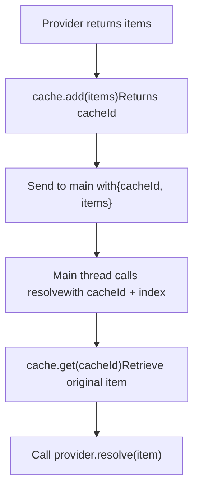
**Example: CodeLens caching**

```
// ExtHost side
const cacheId = this._cache.add(lenses);
result.lenses.push({
    cacheId: [cacheId, i],
    range: typeConvert.Range.from(lenses[i].range),
    command: this._commands.toInternal(lenses[i].command, disposables)
});

// Later, on resolve:
const item = this._cache.get(cacheId[0]);
```
**Sources:** [src/vs/workbench/api/common/extHostLanguageFeatures.ts107-160](https://github.com/microsoft/vscode/blob/1be3088d/src/vs/workbench/api/common/extHostLanguageFeatures.ts#L107-L160) [src/vs/workbench/api/common/cache.ts](https://github.com/microsoft/vscode/blob/1be3088d/src/vs/workbench/api/common/cache.ts)

---

## Extension Management

### Extension Management Architecture

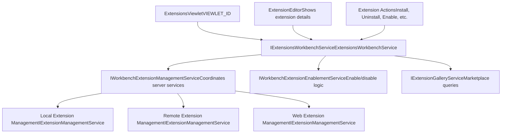
**Sources:** [src/vs/workbench/contrib/extensions/browser/extensionsWorkbenchService.ts78-115](https://github.com/microsoft/vscode/blob/1be3088d/src/vs/workbench/contrib/extensions/browser/extensionsWorkbenchService.ts#L78-L115) [src/vs/workbench/services/extensionManagement/common/extensionManagementService.ts1-60](https://github.com/microsoft/vscode/blob/1be3088d/src/vs/workbench/services/extensionManagement/common/extensionManagementService.ts#L1-L60)

### Extension Class and State

The `Extension` class wraps extension metadata and provides computed state:

```
class Extension implements IExtension {
    // Core data
    local?: ILocalExtension;        // Installed extension
    gallery?: IGalleryExtension;    // Gallery metadata
    server?: IExtensionManagementServer;

    // Computed state
    get state(): ExtensionState {
        // Uninstalled, Installing, Installed
    }
    get enablementState(): EnablementState {
        // EnabledGlobally, EnabledWorkspace,
        // DisabledGlobally, DisabledWorkspace
    }
    get runtimeState(): ExtensionRuntimeState | undefined {
        // Running, stopped, startup failed
    }
}
```
**Sources:** [src/vs/workbench/contrib/extensions/browser/extensionsWorkbenchService.ts93-300](https://github.com/microsoft/vscode/blob/1be3088d/src/vs/workbench/contrib/extensions/browser/extensionsWorkbenchService.ts#L93-L300)

### Installation Flow

> **[Mermaid sequence]**
> *(图表结构无法解析)*

**Key Options:**

-   `installPreReleaseVersion`: Install pre-release instead of release
-   `donotIncludePackAndDependencies`: Skip dependencies
-   `installGivenVersion`: Install specific version
-   `context`: Additional context (e.g., `EXTENSION_INSTALL_SOURCE_CONTEXT`)

**Sources:** [src/vs/workbench/contrib/extensions/browser/extensionsWorkbenchService.ts800-1000](https://github.com/microsoft/vscode/blob/1be3088d/src/vs/workbench/contrib/extensions/browser/extensionsWorkbenchService.ts#L800-L1000) [src/vs/platform/extensionManagement/common/abstractExtensionManagementService.ts200-400](https://github.com/microsoft/vscode/blob/1be3088d/src/vs/platform/extensionManagement/common/abstractExtensionManagementService.ts#L200-L400)

### Extension Gallery Service

The `ExtensionGalleryService` queries the Visual Studio Marketplace:

**Query API:**

| Method | Purpose | Returns |
| --- | --- | --- |
| `query(options, token)` | Search extensions | `IPager<IGalleryExtension>` |
| `getExtensions(ids, token)` | Get by identifiers | `IGalleryExtension[]` |
| `getCompatibleExtension(id, version)` | Get compatible version | `IGalleryExtension` |
| `download(extension, operation)` | Download VSIX | `URI` (file location) |

**Query Options:**

-   `text`: Search text with filters (`@category:themes`, `@tag:python`)
-   `sortBy`: `InstallCount`, `Rating`, `UpdatedDate`
-   `includePreRelease`: Include pre-release versions
-   `source`: Track query source for telemetry

**Sources:** [src/vs/platform/extensionManagement/common/extensionGalleryService.ts1-100](https://github.com/microsoft/vscode/blob/1be3088d/src/vs/platform/extensionManagement/common/extensionGalleryService.ts#L1-L100) [src/vs/platform/extensionManagement/common/extensionManagement.ts200-400](https://github.com/microsoft/vscode/blob/1be3088d/src/vs/platform/extensionManagement/common/extensionManagement.ts#L200-L400)

---

## Extension Lifecycle

### Activation

Extensions are activated based on activation events declared in `package.json`:

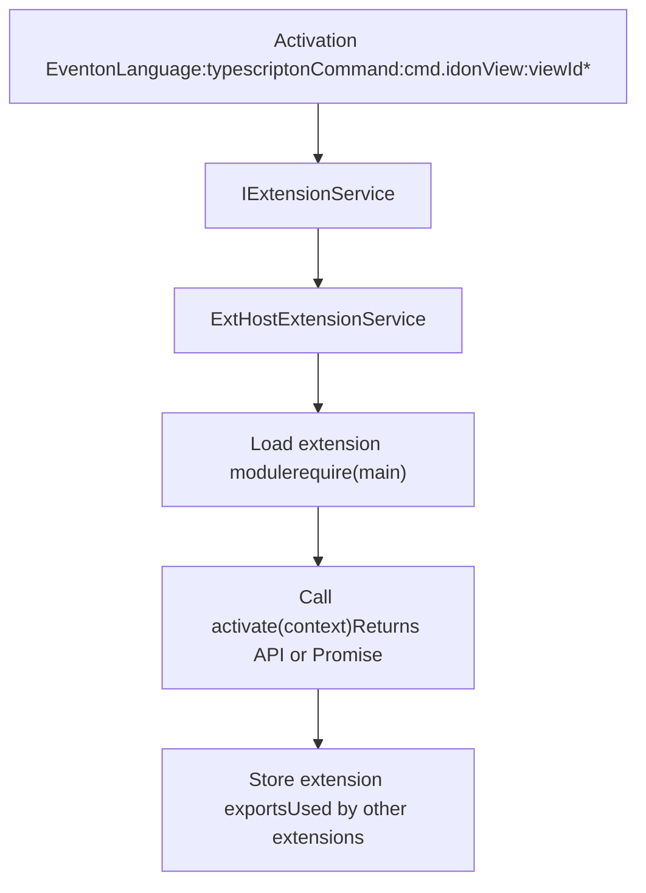
**Activation Events:**

-   `onLanguage:languageId` - When file of language is opened
-   `onCommand:commandId` - Before command executes
-   `onView:viewId` - Before view becomes visible
-   `onUri` - When URI is opened
-   `onStartupFinished` - Shortly after startup
-   `*` - Immediately on startup (discouraged)

**Sources:** [src/vs/workbench/services/extensions/common/extensions.ts](https://github.com/microsoft/vscode/blob/1be3088d/src/vs/workbench/services/extensions/common/extensions.ts) [src/vs/workbench/api/common/extHostExtensionService.ts](https://github.com/microsoft/vscode/blob/1be3088d/src/vs/workbench/api/common/extHostExtensionService.ts)

### Extension Context

The `ExtensionContext` object is passed to `activate()`:

```
interface ExtensionContext {
    subscriptions: Disposable[];
    workspaceState: Memento;
    globalState: Memento & { setKeysForSync(keys: string[]): void };
    secrets: SecretStorage;
    extensionUri: Uri;
    extensionPath: string;
    environmentVariableCollection: EnvironmentVariableCollection;
    storageUri: Uri | undefined;
    globalStorageUri: Uri;
    logUri: Uri;
    extensionMode: ExtensionMode;
    extension: Extension<any>;
    languageModelAccessInformation: LanguageModelAccessInformation;
}
```
**Key Features:**

-   `subscriptions`: Disposables automatically cleaned up on deactivation
-   `workspaceState`/`globalState`: Persistent storage (Memento interface)
-   `secrets`: Secure credential storage
-   `extensionUri`: Extension installation location
-   `environmentVariableCollection`: Modify terminal environment

**Sources:** [src/vscode-dts/vscode.d.ts13000-13100](https://github.com/microsoft/vscode/blob/1be3088d/src/vscode-dts/vscode.d.ts#L13000-L13100)

### Deactivation

Extensions can export a `deactivate()` function for cleanup:

```
export function deactivate(): Thenable<void> | undefined {
    // Clean up resources not in context.subscriptions
    return Promise.resolve();
}
```
**Automatic Cleanup:**

-   All disposables in `context.subscriptions` are disposed
-   Event listeners registered through the API are removed
-   Language providers are unregistered

**Sources:** [src/vs/workbench/api/common/extHostExtensionService.ts](https://github.com/microsoft/vscode/blob/1be3088d/src/vs/workbench/api/common/extHostExtensionService.ts)

---

## Extension API Proposals

VS Code uses "proposed APIs" for experimental features:

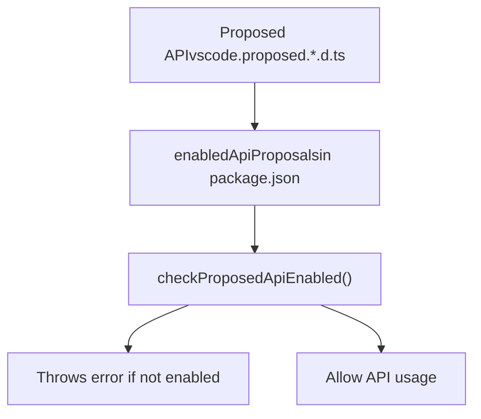
**Enabling Proposed APIs:**

In `package.json`:

```
{
  "enabledApiProposals": [
    "chatParticipantAdditions",
    "languageModels",
    "testObserver"
  ]
}
```
In code:

```
// Automatically checked in API factory
if (options?.authorizationServer) {
    checkProposedApiEnabled(extension, 'authIssuers');
}
```
**Sources:** [src/vs/workbench/api/common/extHost.api.impl.ts300-340](https://github.com/microsoft/vscode/blob/1be3088d/src/vs/workbench/api/common/extHost.api.impl.ts#L300-L340) [src/vs/platform/extensions/common/extensionsApiProposals.ts1-100](https://github.com/microsoft/vscode/blob/1be3088d/src/vs/platform/extensions/common/extensionsApiProposals.ts#L1-L100) [src/vs/workbench/services/extensions/common/extensions.ts](https://github.com/microsoft/vscode/blob/1be3088d/src/vs/workbench/services/extensions/common/extensions.ts)

---

## Extension Host Services Registration

The extension host initializes services and registers RPC proxies:

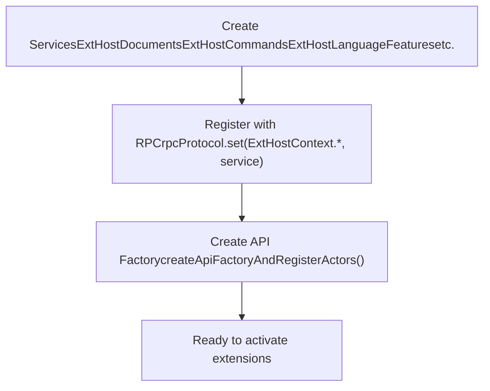
**Key Service Registration (from `extHost.api.impl.ts`):**

```
// Register addressable instances
rpcProtocol.set(ExtHostContext.ExtHostDocuments, extHostDocuments);
rpcProtocol.set(ExtHostContext.ExtHostCommands, extHostCommands);
rpcProtocol.set(ExtHostContext.ExtHostLanguageFeatures, extHostLanguageFeatures);
rpcProtocol.set(ExtHostContext.ExtHostWorkspace, extHostWorkspace);
rpcProtocol.set(ExtHostContext.ExtHostConfiguration, extHostConfiguration);
// ... 30+ more services
```
**Sources:** [src/vs/workbench/api/common/extHost.api.impl.ts160-240](https://github.com/microsoft/vscode/blob/1be3088d/src/vs/workbench/api/common/extHost.api.impl.ts#L160-L240)
