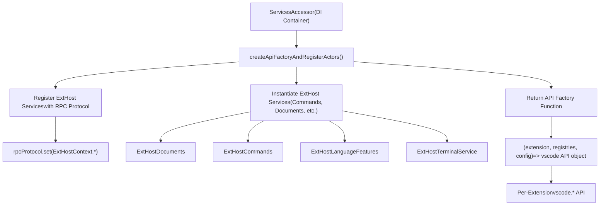
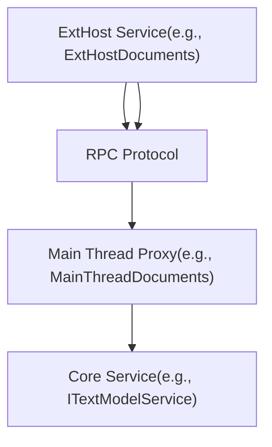
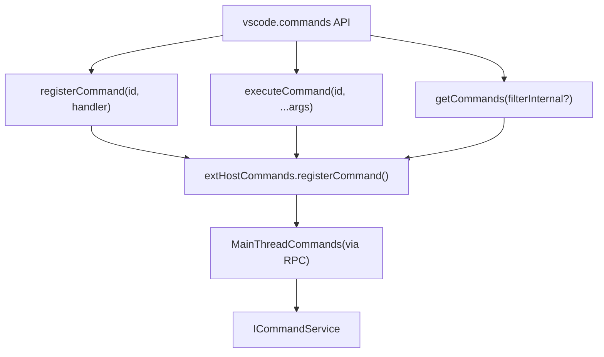
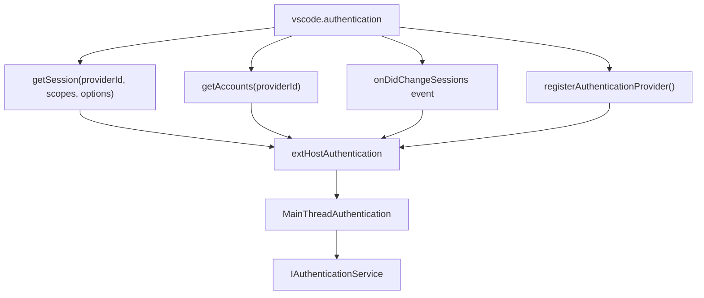
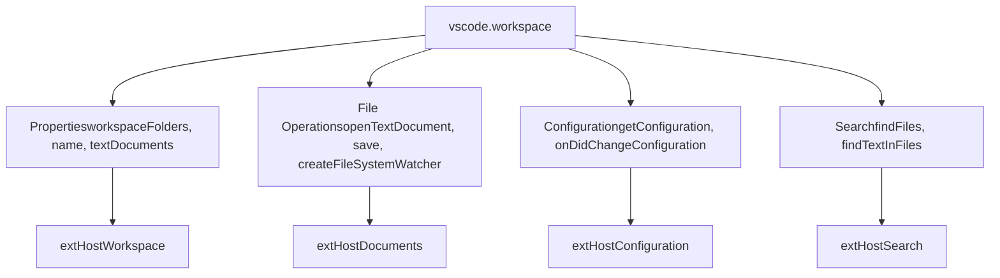
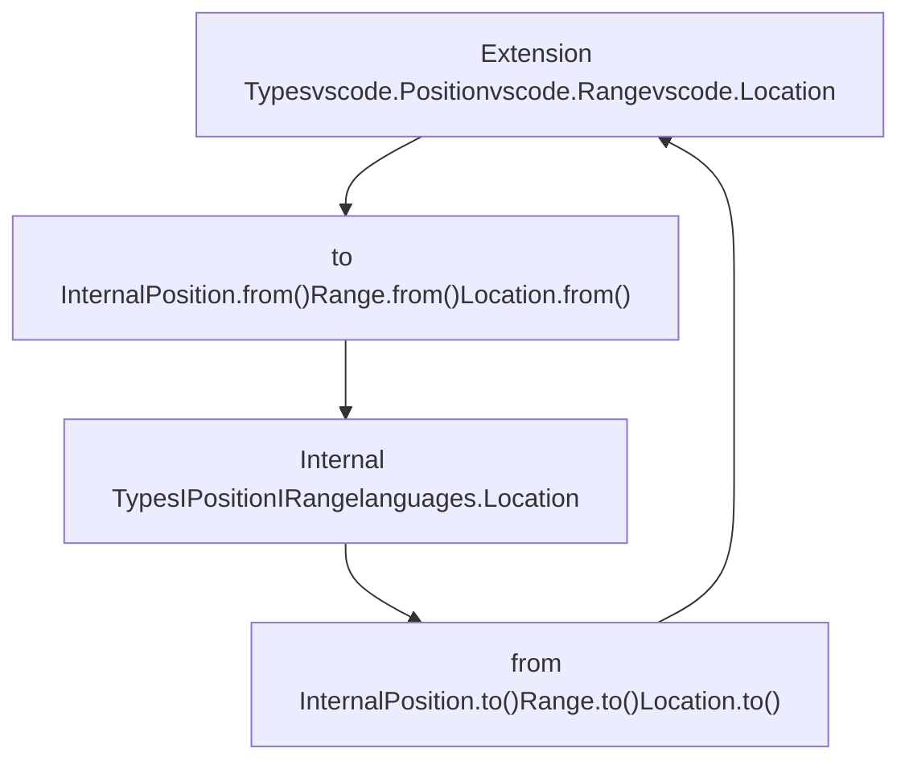
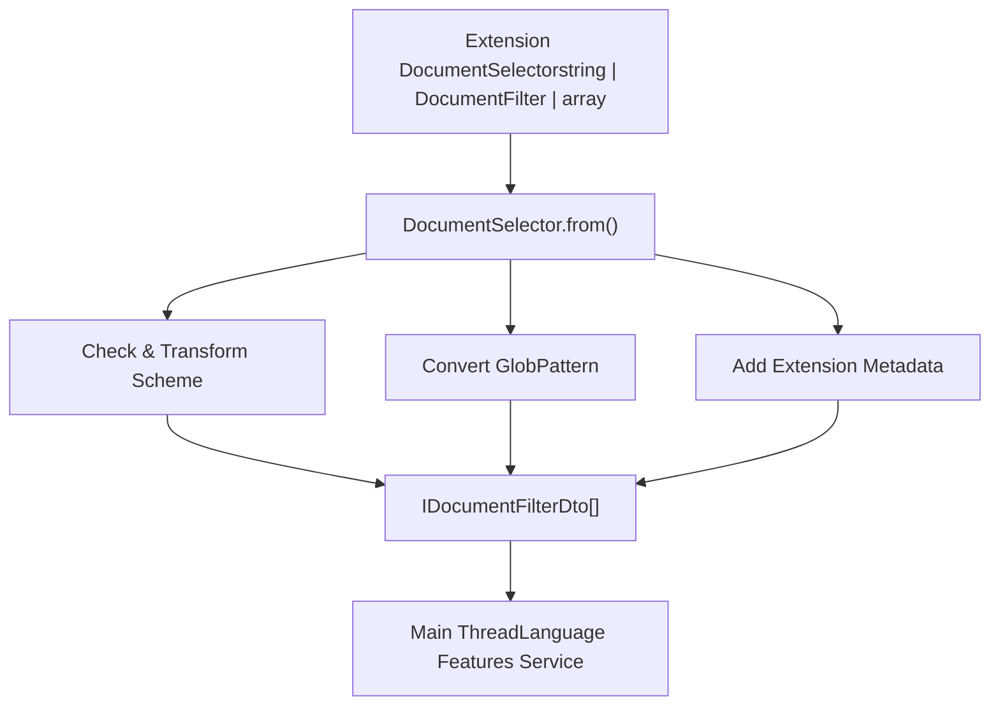
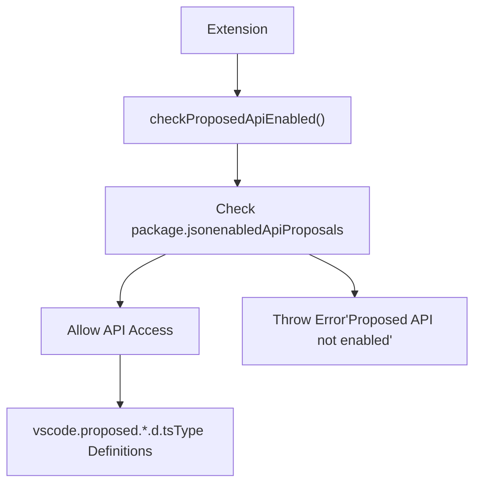
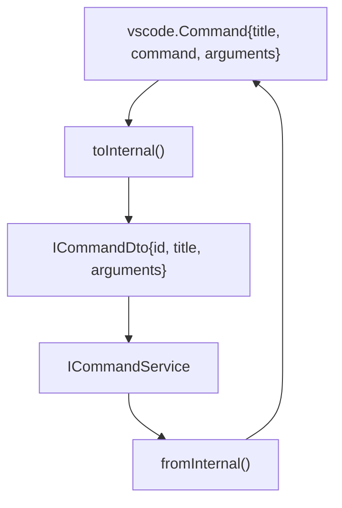

# Extension API Implementation

Relevant source files

-   [extensions/vscode-api-tests/package.json](https://github.com/microsoft/vscode/blob/1be3088d/extensions/vscode-api-tests/package.json)
-   [extensions/vscode-api-tests/src/singlefolder-tests/chat.test.ts](https://github.com/microsoft/vscode/blob/1be3088d/extensions/vscode-api-tests/src/singlefolder-tests/chat.test.ts)
-   [src/vs/editor/common/languages.ts](https://github.com/microsoft/vscode/blob/1be3088d/src/vs/editor/common/languages.ts)
-   [src/vs/platform/extensions/common/extensionsApiProposals.ts](https://github.com/microsoft/vscode/blob/1be3088d/src/vs/platform/extensions/common/extensionsApiProposals.ts)
-   [src/vs/workbench/api/browser/mainThreadChatAgents2.ts](https://github.com/microsoft/vscode/blob/1be3088d/src/vs/workbench/api/browser/mainThreadChatAgents2.ts)
-   [src/vs/workbench/api/browser/mainThreadChatStatus.ts](https://github.com/microsoft/vscode/blob/1be3088d/src/vs/workbench/api/browser/mainThreadChatStatus.ts)
-   [src/vs/workbench/api/browser/mainThreadLanguageFeatures.ts](https://github.com/microsoft/vscode/blob/1be3088d/src/vs/workbench/api/browser/mainThreadLanguageFeatures.ts)
-   [src/vs/workbench/api/common/extHost.api.impl.ts](https://github.com/microsoft/vscode/blob/1be3088d/src/vs/workbench/api/common/extHost.api.impl.ts)
-   [src/vs/workbench/api/common/extHost.protocol.ts](https://github.com/microsoft/vscode/blob/1be3088d/src/vs/workbench/api/common/extHost.protocol.ts)
-   [src/vs/workbench/api/common/extHostChatAgents2.ts](https://github.com/microsoft/vscode/blob/1be3088d/src/vs/workbench/api/common/extHostChatAgents2.ts)
-   [src/vs/workbench/api/common/extHostChatStatus.ts](https://github.com/microsoft/vscode/blob/1be3088d/src/vs/workbench/api/common/extHostChatStatus.ts)
-   [src/vs/workbench/api/common/extHostLanguageFeatures.ts](https://github.com/microsoft/vscode/blob/1be3088d/src/vs/workbench/api/common/extHostLanguageFeatures.ts)
-   [src/vs/workbench/api/common/extHostTypeConverters.ts](https://github.com/microsoft/vscode/blob/1be3088d/src/vs/workbench/api/common/extHostTypeConverters.ts)
-   [src/vs/workbench/api/common/extHostTypes.ts](https://github.com/microsoft/vscode/blob/1be3088d/src/vs/workbench/api/common/extHostTypes.ts)
-   [src/vs/workbench/contrib/chat/browser/actions/chatActions.ts](https://github.com/microsoft/vscode/blob/1be3088d/src/vs/workbench/contrib/chat/browser/actions/chatActions.ts)
-   [src/vs/workbench/contrib/chat/browser/actions/chatExecuteActions.ts](https://github.com/microsoft/vscode/blob/1be3088d/src/vs/workbench/contrib/chat/browser/actions/chatExecuteActions.ts)
-   [src/vs/workbench/contrib/chat/browser/actions/chatGettingStarted.ts](https://github.com/microsoft/vscode/blob/1be3088d/src/vs/workbench/contrib/chat/browser/actions/chatGettingStarted.ts)
-   [src/vs/workbench/contrib/chat/browser/chat.contribution.ts](https://github.com/microsoft/vscode/blob/1be3088d/src/vs/workbench/contrib/chat/browser/chat.contribution.ts)
-   [src/vs/workbench/contrib/chat/browser/chat.ts](https://github.com/microsoft/vscode/blob/1be3088d/src/vs/workbench/contrib/chat/browser/chat.ts)
-   [src/vs/workbench/contrib/chat/common/constants.ts](https://github.com/microsoft/vscode/blob/1be3088d/src/vs/workbench/contrib/chat/common/constants.ts)
-   [src/vs/workbench/contrib/chat/test/common/voiceChatService.test.ts](https://github.com/microsoft/vscode/blob/1be3088d/src/vs/workbench/contrib/chat/test/common/voiceChatService.test.ts)
-   [src/vscode-dts/vscode.d.ts](https://github.com/microsoft/vscode/blob/1be3088d/src/vscode-dts/vscode.d.ts)
-   [src/vscode-dts/vscode.proposed.chatParticipantAdditions.d.ts](https://github.com/microsoft/vscode/blob/1be3088d/src/vscode-dts/vscode.proposed.chatParticipantAdditions.d.ts)
-   [src/vscode-dts/vscode.proposed.chatStatusItem.d.ts](https://github.com/microsoft/vscode/blob/1be3088d/src/vscode-dts/vscode.proposed.chatStatusItem.d.ts)
-   [src/vscode-dts/vscode.proposed.defaultChatParticipant.d.ts](https://github.com/microsoft/vscode/blob/1be3088d/src/vscode-dts/vscode.proposed.defaultChatParticipant.d.ts)
-   [src/vscode-dts/vscode.proposed.inlineCompletionsAdditions.d.ts](https://github.com/microsoft/vscode/blob/1be3088d/src/vscode-dts/vscode.proposed.inlineCompletionsAdditions.d.ts)

## Purpose and Scope

This document explains how the `vscode.*` API is implemented and exposed to extensions. It covers the API factory pattern, type conversion system, and how ExtHost services provide the backing implementation for API namespaces. For information about the RPC protocol and extension host architecture, see [Extension Host Architecture and RPC Protocol](/microsoft/vscode/5.1-layout-system-and-parts). For language provider specifics, see [Language Features Provider System](/microsoft/vscode/5.3-editor-input-and-pane-system).

---

## API Factory Architecture

### The createApiFactoryAndRegisterActors Function

The extension API is created by `createApiFactoryAndRegisterActors` in [src/vs/workbench/api/common/extHost.api.impl.ts132](https://github.com/microsoft/vscode/blob/1be3088d/src/vs/workbench/api/common/extHost.api.impl.ts#L132-L132) which:

1.  **Registers ExtHost services with the RPC protocol** - Makes them addressable by the main thread
2.  **Creates ExtHost service instances** - Instantiates services that implement API functionality
3.  **Returns an API factory function** - Produces a unique `vscode.*` API object for each extension


**Diagram: API Factory Creation Process**

Sources: [src/vs/workbench/api/common/extHost.api.impl.ts132-244](https://github.com/microsoft/vscode/blob/1be3088d/src/vs/workbench/api/common/extHost.api.impl.ts#L132-L244)

### Per-Extension API Instances

Each extension receives its own `vscode.*` API instance created by the factory function. This allows:

-   **Extension identity tracking** - API calls are attributed to specific extensions for telemetry and security
-   **Proposed API access control** - Different extensions can access different proposed APIs
-   **Error isolation** - Extension-specific error handling and reporting
-   **Event wrapping** - Events are wrapped with extension-specific error boundaries

The factory function signature:

```
function(extension: IExtensionDescription,
         extensionInfo: IExtensionRegistries,
         configProvider: ExtHostConfigProvider): typeof vscode
```
Sources: [src/vs/workbench/api/common/extHost.api.impl.ts256](https://github.com/microsoft/vscode/blob/1be3088d/src/vs/workbench/api/common/extHost.api.impl.ts#L256-L256)

---

## ExtHost Services Registration

### RPC Protocol Registration

ExtHost services are registered with the RPC protocol to make them callable from the main thread:

| ExtHost Service | Registration ID | Purpose |
| --- | --- | --- |
| `ExtHostWorkspace` | `ExtHostContext.ExtHostWorkspace` | Workspace folders, file operations |
| `ExtHostConfiguration` | `ExtHostContext.ExtHostConfiguration` | Configuration settings |
| `ExtHostCommands` | `ExtHostContext.ExtHostCommands` | Command registration and execution |
| `ExtHostDocuments` | `ExtHostContext.ExtHostDocuments` | Text document management |
| `ExtHostLanguageFeatures` | `ExtHostContext.ExtHostLanguageFeatures` | Language providers (completion, hover, etc.) |
| `ExtHostTerminalService` | `ExtHostContext.ExtHostTerminalService` | Terminal creation and control |
| `ExtHostDebugService` | `ExtHostContext.ExtHostDebugService` | Debug sessions and configurations |
| `ExtHostAuthentication` | `ExtHostContext.ExtHostAuthentication` | Authentication providers |


**Diagram: ExtHost Service Registration and Communication**

Sources: [src/vs/workbench/api/common/extHost.api.impl.ts162-191](https://github.com/microsoft/vscode/blob/1be3088d/src/vs/workbench/api/common/extHost.api.impl.ts#L162-L191)

### Key ExtHost Service Instances

The factory creates these core service instances:

**Document Management:**

-   `ExtHostDocuments` - Tracks open text documents [src/vs/workbench/api/common/extHost.api.impl.ts194](https://github.com/microsoft/vscode/blob/1be3088d/src/vs/workbench/api/common/extHost.api.impl.ts#L194-L194)
-   `ExtHostDocumentContentProviders` - Virtual document providers [src/vs/workbench/api/common/extHost.api.impl.ts195](https://github.com/microsoft/vscode/blob/1be3088d/src/vs/workbench/api/common/extHost.api.impl.ts#L195-L195)
-   `ExtHostDocumentSaveParticipant` - Pre-save document handlers [src/vs/workbench/api/common/extHost.api.impl.ts196](https://github.com/microsoft/vscode/blob/1be3088d/src/vs/workbench/api/common/extHost.api.impl.ts#L196-L196)

**Editor Management:**

-   `ExtHostEditors` - Active editor instances [src/vs/workbench/api/common/extHost.api.impl.ts203](https://github.com/microsoft/vscode/blob/1be3088d/src/vs/workbench/api/common/extHost.api.impl.ts#L203-L203)
-   `ExtHostDocumentsAndEditors` - Combined document/editor tracking [src/vs/workbench/api/common/extHost.api.impl.ts183](https://github.com/microsoft/vscode/blob/1be3088d/src/vs/workbench/api/common/extHost.api.impl.ts#L183-L183)

**Language Features:**

-   `ExtHostLanguageFeatures` - Providers for completion, hover, etc. [src/vs/workbench/api/common/extHost.api.impl.ts208](https://github.com/microsoft/vscode/blob/1be3088d/src/vs/workbench/api/common/extHost.api.impl.ts#L208-L208)
-   `ExtHostLanguages` - Language configuration [src/vs/workbench/api/common/extHost.api.impl.ts207](https://github.com/microsoft/vscode/blob/1be3088d/src/vs/workbench/api/common/extHost.api.impl.ts#L207-L207)
-   `ExtHostDiagnostics` - Diagnostic collections [src/vs/workbench/api/common/extHost.api.impl.ts206](https://github.com/microsoft/vscode/blob/1be3088d/src/vs/workbench/api/common/extHost.api.impl.ts#L206-L206)

**Terminal & Debug:**

-   `ExtHostTerminalService` - Terminal management [src/vs/workbench/api/common/extHost.api.impl.ts185](https://github.com/microsoft/vscode/blob/1be3088d/src/vs/workbench/api/common/extHost.api.impl.ts#L185-L185)
-   `ExtHostDebugService` - Debug sessions [src/vs/workbench/api/common/extHost.api.impl.ts187](https://github.com/microsoft/vscode/blob/1be3088d/src/vs/workbench/api/common/extHost.api.impl.ts#L187-L187)

**UI Contributions:**

-   `ExtHostTreeViews` - Tree view providers [src/vs/workbench/api/common/extHost.api.impl.ts204](https://github.com/microsoft/vscode/blob/1be3088d/src/vs/workbench/api/common/extHost.api.impl.ts#L204-L204)
-   `ExtHostWebviews` - Webview management [src/vs/workbench/api/common/extHost.api.impl.ts220](https://github.com/microsoft/vscode/blob/1be3088d/src/vs/workbench/api/common/extHost.api.impl.ts#L220-L220)
-   `ExtHostStatusBar` - Status bar items [src/vs/workbench/api/common/extHost.api.impl.ts236](https://github.com/microsoft/vscode/blob/1be3088d/src/vs/workbench/api/common/extHost.api.impl.ts#L236-L236)

Sources: [src/vs/workbench/api/common/extHost.api.impl.ts194-238](https://github.com/microsoft/vscode/blob/1be3088d/src/vs/workbench/api/common/extHost.api.impl.ts#L194-L238)

---

## API Namespace Implementation

### Commands Namespace

The `vscode.commands` namespace provides command registration and execution:


**Diagram: Commands Namespace Implementation**

Implementation details:

-   `registerCommand` - Registers command handler, tracks extension identity [src/vs/workbench/api/common/extHost.api.impl.ts343-344](https://github.com/microsoft/vscode/blob/1be3088d/src/vs/workbench/api/common/extHost.api.impl.ts#L343-L344)
-   `registerTextEditorCommand` - Specialized for text editor commands [src/vs/workbench/api/common/extHost.api.impl.ts346](https://github.com/microsoft/vscode/blob/1be3088d/src/vs/workbench/api/common/extHost.api.impl.ts#L346-L346)
-   `executeCommand` - Executes any registered command [src/vs/workbench/api/common/extHost.api.impl.ts379-380](https://github.com/microsoft/vscode/blob/1be3088d/src/vs/workbench/api/common/extHost.api.impl.ts#L379-L380)
-   `getCommands` - Lists available commands [src/vs/workbench/api/common/extHost.api.impl.ts382-384](https://github.com/microsoft/vscode/blob/1be3088d/src/vs/workbench/api/common/extHost.api.impl.ts#L382-L384)

Sources: [src/vs/workbench/api/common/extHost.api.impl.ts342-385](https://github.com/microsoft/vscode/blob/1be3088d/src/vs/workbench/api/common/extHost.api.impl.ts#L342-L385)

### Env Namespace

The `vscode.env` namespace exposes environment information:

| Property/Method | Implementation | Description |
| --- | --- | --- |
| `machineId` | `initData.telemetryInfo.machineId` | Machine identifier |
| `sessionId` | `initData.telemetryInfo.sessionId` | Session identifier |
| `language` | `initData.environment.appLanguage` | Application language |
| `appName` | `initData.environment.appName` | Application name |
| `uriScheme` | `initData.environment.appUriScheme` | URI scheme |
| `clipboard` | `extHostClipboard.value` | Clipboard access |
| `shell` | `extHostTerminalService.getDefaultShell()` | Default shell path |
| `openExternal()` | `extHostWindow.openUri()` | Open external URIs |
| `asExternalUri()` | `extHostWindow.asExternalUri()` | Convert to external URI |

Sources: [src/vs/workbench/api/common/extHost.api.impl.ts388-477](https://github.com/microsoft/vscode/blob/1be3088d/src/vs/workbench/api/common/extHost.api.impl.ts#L388-L477)

### Authentication Namespace

The `vscode.authentication` namespace manages authentication providers:


**Diagram: Authentication Namespace Flow**

Key features:

-   Extension-scoped session events using `getExtensionScopedSessionsEvent()` [src/vs/workbench/api/common/extHost.api.impl.ts331](https://github.com/microsoft/vscode/blob/1be3088d/src/vs/workbench/api/common/extHost.api.impl.ts#L331-L331)
-   Proposed API checks for advanced features (learnMore, authorizationServer) [src/vs/workbench/api/common/extHost.api.impl.ts313-316](https://github.com/microsoft/vscode/blob/1be3088d/src/vs/workbench/api/common/extHost.api.impl.ts#L313-L316)
-   Provider registration with options [src/vs/workbench/api/common/extHost.api.impl.ts333-338](https://github.com/microsoft/vscode/blob/1be3088d/src/vs/workbench/api/common/extHost.api.impl.ts#L333-L338)

Sources: [src/vs/workbench/api/common/extHost.api.impl.ts307-339](https://github.com/microsoft/vscode/blob/1be3088d/src/vs/workbench/api/common/extHost.api.impl.ts#L307-L339)

### Languages Namespace

The `vscode.languages` namespace provides language feature registration. The implementation delegates to `ExtHostLanguageFeatures`:

**Provider Registration Methods:**

-   `registerCompletionItemProvider` - Code completion
-   `registerHoverProvider` - Hover information
-   `registerDefinitionProvider` - Go to definition
-   `registerCodeActionsProvider` - Code actions/quick fixes
-   `registerDocumentFormattingEditProvider` - Document formatting
-   `registerRenameProvider` - Symbol renaming
-   And many more...

Each registration method:

1.  Validates the document selector using `checkSelector()` [src/vs/workbench/api/common/extHost.api.impl.ts281-305](https://github.com/microsoft/vscode/blob/1be3088d/src/vs/workbench/api/common/extHost.api.impl.ts#L281-L305)
2.  Calls the corresponding `ExtHostLanguageFeatures.register*()` method
3.  Returns a `Disposable` to unregister the provider

Sources: [src/vs/workbench/api/common/extHost.api.impl.ts1114-1644](https://github.com/microsoft/vscode/blob/1be3088d/src/vs/workbench/api/common/extHost.api.impl.ts#L1114-L1644)

### Workspace Namespace

The `vscode.workspace` namespace provides workspace operations:


**Diagram: Workspace Namespace Components**

Sources: [src/vs/workbench/api/common/extHost.api.impl.ts1645-1908](https://github.com/microsoft/vscode/blob/1be3088d/src/vs/workbench/api/common/extHost.api.impl.ts#L1645-L1908)

### Window Namespace

The `vscode.window` namespace manages UI elements:

**UI Components:**

-   `activeTextEditor` / `visibleTextEditors` - Editor access
-   `showInformationMessage()` / `showWarningMessage()` / `showErrorMessage()` - Message boxes
-   `showQuickPick()` / `showInputBox()` - Quick pick and input UI
-   `createStatusBarItem()` - Status bar items
-   `createOutputChannel()` - Output channels
-   `createTerminal()` - Terminal instances
-   `createWebviewPanel()` - Webview panels
-   `createTreeView()` - Tree views

Sources: [src/vs/workbench/api/common/extHost.api.impl.ts1909-2291](https://github.com/microsoft/vscode/blob/1be3088d/src/vs/workbench/api/common/extHost.api.impl.ts#L1909-L2291)

---

## Type Conversion System

### Conversion Architecture

Type converters bridge the gap between extension API types (defined in `extHostTypes.ts`) and internal VS Code types:


**Diagram: Type Conversion Bidirectional Flow**

Sources: [src/vs/workbench/api/common/extHostTypeConverters.ts1-70](https://github.com/microsoft/vscode/blob/1be3088d/src/vs/workbench/api/common/extHostTypeConverters.ts#L1-L70)

### Core Type Converters

#### Position and Range Conversion

The `Position` and `Range` converters handle coordinate transformations:

**Position Conversion:**

-   Extension uses 0-based line/character: `vscode.Position(line, character)`
-   Internal uses 1-based lineNumber/column: `{ lineNumber, column }`
-   `Position.to()` converts internal → extension (subtract 1) [src/vs/workbench/api/common/extHostTypeConverters.ts169-171](https://github.com/microsoft/vscode/blob/1be3088d/src/vs/workbench/api/common/extHostTypeConverters.ts#L169-L171)
-   `Position.from()` converts extension → internal (add 1) [src/vs/workbench/api/common/extHostTypeConverters.ts172-174](https://github.com/microsoft/vscode/blob/1be3088d/src/vs/workbench/api/common/extHostTypeConverters.ts#L172-L174)

**Range Conversion:**

-   `Range.from()` converts extension range to internal [src/vs/workbench/api/common/extHostTypeConverters.ts118-129](https://github.com/microsoft/vscode/blob/1be3088d/src/vs/workbench/api/common/extHostTypeConverters.ts#L118-L129)
-   `Range.to()` converts internal range to extension [src/vs/workbench/api/common/extHostTypeConverters.ts134-140](https://github.com/microsoft/vscode/blob/1be3088d/src/vs/workbench/api/common/extHostTypeConverters.ts#L134-L140)

Sources: [src/vs/workbench/api/common/extHostTypeConverters.ts113-175](https://github.com/microsoft/vscode/blob/1be3088d/src/vs/workbench/api/common/extHostTypeConverters.ts#L113-L175)

#### Selection Conversion

Selection extends Range with anchor/active positions:

```
// Extension → Internal
Selection.from(selection: SelectionLike): ISelection
// Creates { selectionStartLineNumber, selectionStartColumn,
//           positionLineNumber, positionColumn }

// Internal → Extension
Selection.to(selection: ISelection): types.Selection
// Creates vscode.Selection with anchor and active positions
```
Sources: [src/vs/workbench/api/common/extHostTypeConverters.ts94-112](https://github.com/microsoft/vscode/blob/1be3088d/src/vs/workbench/api/common/extHostTypeConverters.ts#L94-L112)

#### Diagnostic Conversion

Diagnostics require conversion of markers, severity, and related information:

| Extension Type | Internal Type | Converter |
| --- | --- | --- |
| `vscode.DiagnosticSeverity` | `MarkerSeverity` | `DiagnosticSeverity.from/to()` |
| `vscode.DiagnosticTag` | `MarkerTag` | `DiagnosticTag.from/to()` |
| `vscode.Diagnostic` | `IMarkerData` | `Diagnostic.from/to()` |
| `vscode.DiagnosticRelatedInformation` | `IRelatedInformation` | `DiagnosticRelatedInformation.from/to()` |

Sources: [src/vs/workbench/api/common/extHostTypeConverters.ts215-315](https://github.com/microsoft/vscode/blob/1be3088d/src/vs/workbench/api/common/extHostTypeConverters.ts#L215-L315)

#### Language Feature Converters

Complex converters for language features:

**CompletionItem:** [src/vs/workbench/api/common/extHostTypeConverters.ts537-705](https://github.com/microsoft/vscode/blob/1be3088d/src/vs/workbench/api/common/extHostTypeConverters.ts#L537-L705)

-   Converts `vscode.CompletionItem` to `languages.CompletionItem`
-   Handles completion kind, tags, range, insert text, additional edits
-   Manages command conversion for command triggers

**CodeAction:** [src/vs/workbench/api/common/extHostTypeConverters.ts777-827](https://github.com/microsoft/vscode/blob/1be3088d/src/vs/workbench/api/common/extHostTypeConverters.ts#L777-L827)

-   Converts `vscode.CodeAction` to `languages.CodeAction`
-   Handles workspace edits, diagnostics, kind hierarchies
-   Supports disabled actions with reasons

**Hover:** [src/vs/workbench/api/common/extHostTypeConverters.ts1015-1041](https://github.com/microsoft/vscode/blob/1be3088d/src/vs/workbench/api/common/extHostTypeConverters.ts#L1015-L1041)

-   Converts hover contents (markdown strings)
-   Handles ranges and verbosity controls

Sources: [src/vs/workbench/api/common/extHostTypeConverters.ts537-1041](https://github.com/microsoft/vscode/blob/1be3088d/src/vs/workbench/api/common/extHostTypeConverters.ts#L537-L1041)

### DocumentSelector Conversion

Document selectors specify which documents a provider applies to:


**Diagram: DocumentSelector Transformation**

Conversion handles:

-   String selectors (language ID only) [src/vs/workbench/api/common/extHostTypeConverters.ts184-190](https://github.com/microsoft/vscode/blob/1be3088d/src/vs/workbench/api/common/extHostTypeConverters.ts#L184-L190)
-   Document filter objects with language, scheme, pattern [src/vs/workbench/api/common/extHostTypeConverters.ts192-202](https://github.com/microsoft/vscode/blob/1be3088d/src/vs/workbench/api/common/extHostTypeConverters.ts#L192-L202)
-   URI scheme transformation for remote connections [src/vs/workbench/api/common/extHostTypeConverters.ts207-212](https://github.com/microsoft/vscode/blob/1be3088d/src/vs/workbench/api/common/extHostTypeConverters.ts#L207-L212)
-   Extension builtin flag [src/vs/workbench/api/common/extHostTypeConverters.ts188](https://github.com/microsoft/vscode/blob/1be3088d/src/vs/workbench/api/common/extHostTypeConverters.ts#L188-L188)

Sources: [src/vs/workbench/api/common/extHostTypeConverters.ts177-213](https://github.com/microsoft/vscode/blob/1be3088d/src/vs/workbench/api/common/extHostTypeConverters.ts#L177-L213)

### Data Transfer and Serialization

Complex types require special serialization for IPC transfer:

**WorkspaceEdit:** [src/vs/workbench/api/common/extHostTypeConverters.ts1270-1416](https://github.com/microsoft/vscode/blob/1be3088d/src/vs/workbench/api/common/extHostTypeConverters.ts#L1270-L1416)

-   Converts file operations (create, delete, rename)
-   Handles text edits with optional metadata
-   Preserves notebook cell edits

**DataTransfer:** [src/vs/workbench/api/common/extHostTypeConverters.ts2197-2276](https://github.com/microsoft/vscode/blob/1be3088d/src/vs/workbench/api/common/extHostTypeConverters.ts#L2197-L2276)

-   Serializes data transfer items for drag/drop and paste operations
-   Handles file URIs and custom MIME types
-   Caches file data for deferred resolution

Sources: [src/vs/workbench/api/common/extHostTypeConverters.ts1270-2276](https://github.com/microsoft/vscode/blob/1be3088d/src/vs/workbench/api/common/extHostTypeConverters.ts#L1270-L2276)

---

## API Surface Generation

### The vscode.d.ts Type Definitions

The public API contract is defined in [src/vscode-dts/vscode.d.ts](https://github.com/microsoft/vscode/blob/1be3088d/src/vscode-dts/vscode.d.ts) This file:

1.  **Defines all stable API types** - Classes, interfaces, enums exposed to extensions
2.  **Documents API behavior** - JSDoc comments become extension API documentation
3.  **Serves as implementation contract** - The runtime implementation must match these signatures

Key API areas in vscode.d.ts:

-   Core types: `Position`, `Range`, `Selection`, `Uri` [src/vscode-dts/vscode.d.ts269-259](https://github.com/microsoft/vscode/blob/1be3088d/src/vscode-dts/vscode.d.ts#L269-L259)
-   Documents: `TextDocument`, `TextEditor` [src/vscode-dts/vscode.d.ts88-259](https://github.com/microsoft/vscode/blob/1be3088d/src/vscode-dts/vscode.d.ts#L88-L259)
-   Language features: `CompletionItem`, `Hover`, `CodeAction` [src/vscode-dts/vscode.d.ts3500-6500](https://github.com/microsoft/vscode/blob/1be3088d/src/vscode-dts/vscode.d.ts#L3500-L6500)
-   Namespaces: `commands`, `window`, `workspace`, `languages` [src/vscode-dts/vscode.d.ts15000-18000](https://github.com/microsoft/vscode/blob/1be3088d/src/vscode-dts/vscode.d.ts#L15000-L18000)

Sources: [src/vscode-dts/vscode.d.ts1-20000](https://github.com/microsoft/vscode/blob/1be3088d/src/vscode-dts/vscode.d.ts#L1-L20000)

### Proposed API Handling

Proposed APIs are unstable features under development:


**Diagram: Proposed API Access Control**

**Proposed API Registration:**

-   Extensions declare enabled proposals in `package.json`: `"enabledApiProposals": ["chatParticipantPrivate", "testObserver"]` [extensions/vscode-api-tests/package.json7-56](https://github.com/microsoft/vscode/blob/1be3088d/extensions/vscode-api-tests/package.json#L7-L56)
-   Each proposal has a corresponding `.d.ts` file [src/platform/extensions/common/extensionsApiProposals.ts8-240](https://github.com/microsoft/vscode/blob/1be3088d/src/platform/extensions/common/extensionsApiProposals.ts#L8-L240)
-   Runtime checks using `checkProposedApiEnabled(extension, 'proposalName')` [src/vs/workbench/api/common/extHost.api.impl.ts300](https://github.com/microsoft/vscode/blob/1be3088d/src/vs/workbench/api/common/extHost.api.impl.ts#L300-L300)

**Example checks in API implementation:**

-   Authentication learn more: [src/vs/workbench/api/common/extHost.api.impl.ts313](https://github.com/microsoft/vscode/blob/1be3088d/src/vs/workbench/api/common/extHost.api.impl.ts#L313-L313)
-   Dev device ID: [src/vs/workbench/api/common/extHost.api.impl.ts391](https://github.com/microsoft/vscode/blob/1be3088d/src/vs/workbench/api/common/extHost.api.impl.ts#L391-L391)
-   Telemetry configuration: [src/vs/workbench/api/common/extHost.api.impl.ts414](https://github.com/microsoft/vscode/blob/1be3088d/src/vs/workbench/api/common/extHost.api.impl.ts#L414-L414)

Sources: [src/vs/workbench/api/common/extHost.api.impl.ts300-414](https://github.com/microsoft/vscode/blob/1be3088d/src/vs/workbench/api/common/extHost.api.impl.ts#L300-L414) [src/platform/extensions/common/extensionsApiProposals.ts8-240](https://github.com/microsoft/vscode/blob/1be3088d/src/platform/extensions/common/extensionsApiProposals.ts#L8-L240)

### API Event Wrapping

Extension API events are wrapped with error handling to prevent extension errors from propagating:

```
function _asExtensionEvent<T>(actual: vscode.Event<T>): vscode.Event<T> {
    return (listener, thisArgs, disposables) => {
        const handle = actual(e => {
            try {
                listener.call(thisArgs, e);
            } catch (err) {
                errors.onUnexpectedExternalError(
                    new ExtensionError(extension.identifier, err, 'FAILED to handle event')
                );
            }
        });
        disposables?.push(handle);
        return handle;
    };
}
```
This wrapper:

1.  Catches exceptions in event listeners [src/vs/workbench/api/common/extHost.api.impl.ts265-268](https://github.com/microsoft/vscode/blob/1be3088d/src/vs/workbench/api/common/extHost.api.impl.ts#L265-L268)
2.  Reports errors with extension attribution [src/vs/workbench/api/common/extHost.api.impl.ts267](https://github.com/microsoft/vscode/blob/1be3088d/src/vs/workbench/api/common/extHost.api.impl.ts#L267-L267)
3.  Prevents one extension's errors from affecting others
4.  Adds disposables to cleanup lists [src/vs/workbench/api/common/extHost.api.impl.ts270](https://github.com/microsoft/vscode/blob/1be3088d/src/vs/workbench/api/common/extHost.api.impl.ts#L270-L270)

All events exposed through the API use this wrapper:

-   `env.onDidChangeShell` [src/vs/workbench/api/common/extHost.api.impl.ts405](https://github.com/microsoft/vscode/blob/1be3088d/src/vs/workbench/api/common/extHost.api.impl.ts#L405-L405)
-   `env.onDidChangeTelemetryEnabled` [src/vs/workbench/api/common/extHost.api.impl.ts411](https://github.com/microsoft/vscode/blob/1be3088d/src/vs/workbench/api/common/extHost.api.impl.ts#L411-L411)
-   `authentication.onDidChangeSessions` [src/vs/workbench/api/common/extHost.api.impl.ts331](https://github.com/microsoft/vscode/blob/1be3088d/src/vs/workbench/api/common/extHost.api.impl.ts#L331-L331)

Sources: [src/vs/workbench/api/common/extHost.api.impl.ts261-273](https://github.com/microsoft/vscode/blob/1be3088d/src/vs/workbench/api/common/extHost.api.impl.ts#L261-L273)

### Extension Context and Identity

Each API instance is bound to extension identity for:

**Telemetry and Diagnostics:**

-   Extension ID tracked in error reports
-   Telemetry attributed to specific extensions
-   Performance metrics per extension

**Security and Isolation:**

-   Proposed API access control
-   Resource access scoping
-   Command attribution

**Storage and State:**

-   Extension-specific storage paths [src/vs/workbench/api/common/extHost.api.impl.ts144-145](https://github.com/microsoft/vscode/blob/1be3088d/src/vs/workbench/api/common/extHost.api.impl.ts#L144-L145)
-   Secret storage scoping [src/vs/workbench/api/common/extHost.api.impl.ts152](https://github.com/microsoft/vscode/blob/1be3088d/src/vs/workbench/api/common/extHost.api.impl.ts#L152-L152)
-   Global/workspace state isolation

The extension context flows through:

1.  API factory receives `IExtensionDescription` [src/vs/workbench/api/common/extHost.api.impl.ts256](https://github.com/microsoft/vscode/blob/1be3088d/src/vs/workbench/api/common/extHost.api.impl.ts#L256-L256)
2.  Extension identity passed to service calls
3.  Services check permissions and track usage
4.  Main thread receives extension ID for attribution

Sources: [src/vs/workbench/api/common/extHost.api.impl.ts256-273](https://github.com/microsoft/vscode/blob/1be3088d/src/vs/workbench/api/common/extHost.api.impl.ts#L256-L273)

---

## Command Registration and Execution

### Command Converter

The `CommandsConverter` handles command serialization across the RPC boundary:


**Diagram: Command Conversion Flow**

The converter:

-   Serializes command objects for RPC [src/vs/workbench/api/common/extHostCommands.ts](https://github.com/microsoft/vscode/blob/1be3088d/src/vs/workbench/api/common/extHostCommands.ts)
-   Handles command disposal tracking
-   Manages argument serialization including `SerializableObjectWithBuffers`

Sources: [src/vs/workbench/api/common/extHostCommands.ts](https://github.com/microsoft/vscode/blob/1be3088d/src/vs/workbench/api/common/extHostCommands.ts) [src/vs/workbench/api/common/extHostTypeConverters.ts72-78](https://github.com/microsoft/vscode/blob/1be3088d/src/vs/workbench/api/common/extHostTypeConverters.ts#L72-L78)

### Command Registration Flow

> **[Mermaid sequence]**
> *(图表结构无法解析)*

**Diagram: Command Registration and Execution Sequence**

Sources: [src/vs/workbench/api/common/extHost.api.impl.ts343-344](https://github.com/microsoft/vscode/blob/1be3088d/src/vs/workbench/api/common/extHost.api.impl.ts#L343-L344) [src/vs/workbench/api/common/extHostCommands.ts](https://github.com/microsoft/vscode/blob/1be3088d/src/vs/workbench/api/common/extHostCommands.ts)

---

## Summary

The Extension API implementation follows a layered architecture:

1.  **API Factory** - `createApiFactoryAndRegisterActors` creates per-extension API instances with identity tracking and error isolation
2.  **ExtHost Services** - Service instances (Commands, Documents, Languages, etc.) provide API implementation and register with RPC protocol
3.  **Type Converters** - Bidirectional conversion between extension types and internal types for RPC marshalling
4.  **API Namespaces** - Organized API surface (commands, env, workspace, window, languages) delegates to ExtHost services
5.  **Protocol Layer** - RPC communication with main thread defined in extHost.protocol.ts (see [Extension Host Architecture and RPC Protocol](/microsoft/vscode/5.1-layout-system-and-parts))

This architecture enables:

-   **Isolation** - Extensions run in separate processes with controlled API access
-   **Security** - Proposed API checks and extension identity tracking
-   **Stability** - Extension errors don't crash the main editor
-   **Extensibility** - New APIs can be added incrementally via proposed APIs

Sources: [src/vs/workbench/api/common/extHost.api.impl.ts132-2700](https://github.com/microsoft/vscode/blob/1be3088d/src/vs/workbench/api/common/extHost.api.impl.ts#L132-L2700) [src/vs/workbench/api/common/extHostTypeConverters.ts1-2600](https://github.com/microsoft/vscode/blob/1be3088d/src/vs/workbench/api/common/extHostTypeConverters.ts#L1-L2600)
