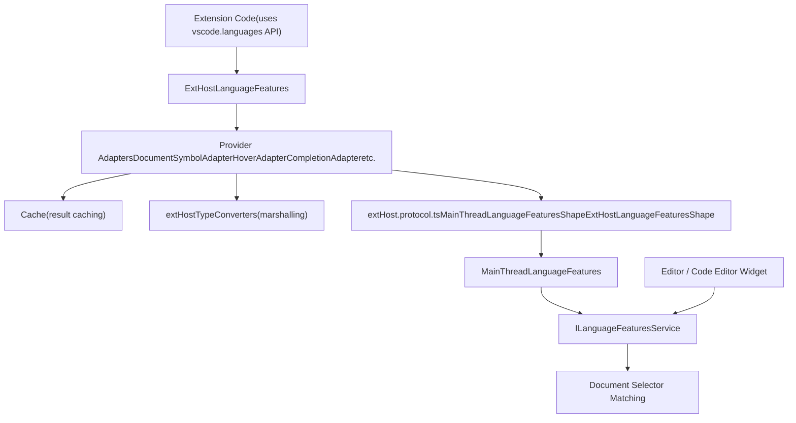
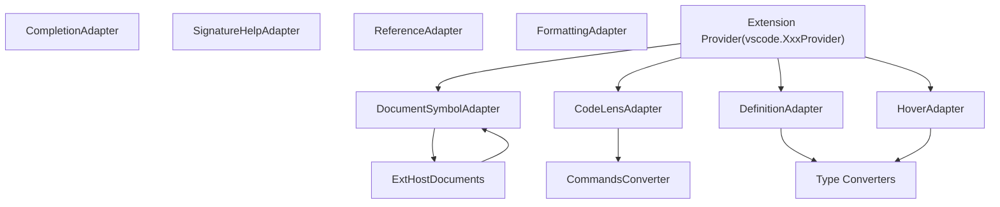
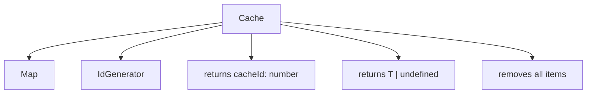
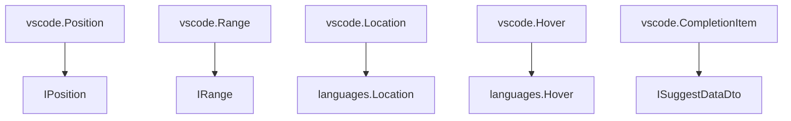
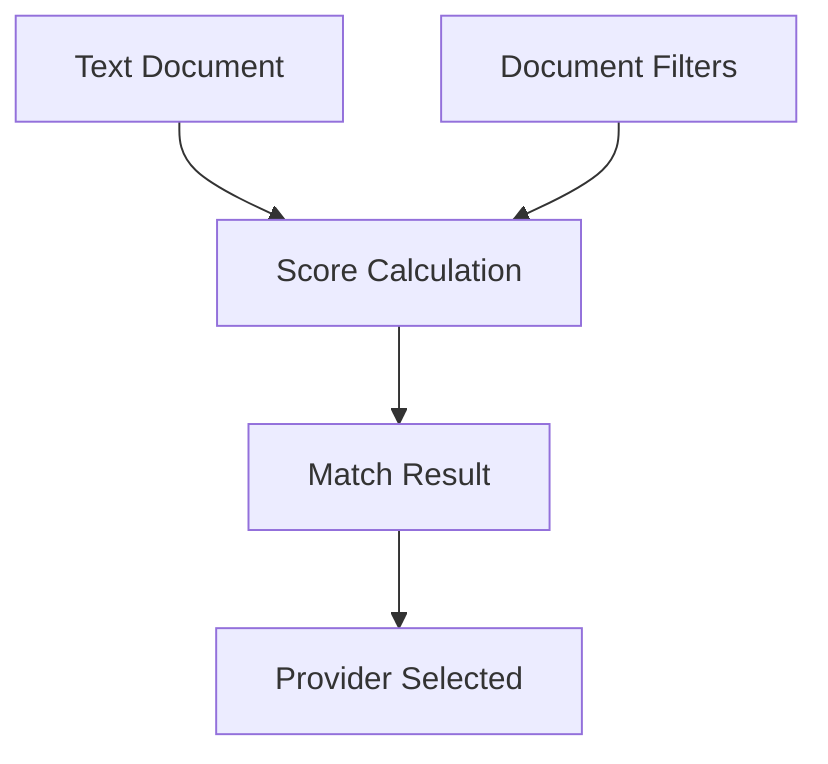
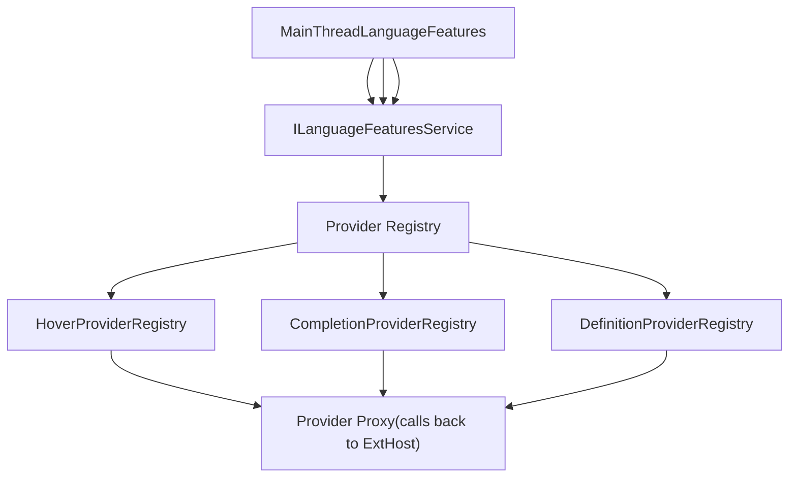

# Language Features Provider System

Relevant source files

-   [extensions/vscode-api-tests/package.json](https://github.com/microsoft/vscode/blob/1be3088d/extensions/vscode-api-tests/package.json)
-   [extensions/vscode-api-tests/src/singlefolder-tests/chat.test.ts](https://github.com/microsoft/vscode/blob/1be3088d/extensions/vscode-api-tests/src/singlefolder-tests/chat.test.ts)
-   [src/vs/editor/common/languages.ts](https://github.com/microsoft/vscode/blob/1be3088d/src/vs/editor/common/languages.ts)
-   [src/vs/platform/extensions/common/extensionsApiProposals.ts](https://github.com/microsoft/vscode/blob/1be3088d/src/vs/platform/extensions/common/extensionsApiProposals.ts)
-   [src/vs/workbench/api/browser/mainThreadChatAgents2.ts](https://github.com/microsoft/vscode/blob/1be3088d/src/vs/workbench/api/browser/mainThreadChatAgents2.ts)
-   [src/vs/workbench/api/browser/mainThreadChatStatus.ts](https://github.com/microsoft/vscode/blob/1be3088d/src/vs/workbench/api/browser/mainThreadChatStatus.ts)
-   [src/vs/workbench/api/browser/mainThreadLanguageFeatures.ts](https://github.com/microsoft/vscode/blob/1be3088d/src/vs/workbench/api/browser/mainThreadLanguageFeatures.ts)
-   [src/vs/workbench/api/common/extHost.api.impl.ts](https://github.com/microsoft/vscode/blob/1be3088d/src/vs/workbench/api/common/extHost.api.impl.ts)
-   [src/vs/workbench/api/common/extHost.protocol.ts](https://github.com/microsoft/vscode/blob/1be3088d/src/vs/workbench/api/common/extHost.protocol.ts)
-   [src/vs/workbench/api/common/extHostChatAgents2.ts](https://github.com/microsoft/vscode/blob/1be3088d/src/vs/workbench/api/common/extHostChatAgents2.ts)
-   [src/vs/workbench/api/common/extHostChatStatus.ts](https://github.com/microsoft/vscode/blob/1be3088d/src/vs/workbench/api/common/extHostChatStatus.ts)
-   [src/vs/workbench/api/common/extHostLanguageFeatures.ts](https://github.com/microsoft/vscode/blob/1be3088d/src/vs/workbench/api/common/extHostLanguageFeatures.ts)
-   [src/vs/workbench/api/common/extHostTypeConverters.ts](https://github.com/microsoft/vscode/blob/1be3088d/src/vs/workbench/api/common/extHostTypeConverters.ts)
-   [src/vs/workbench/api/common/extHostTypes.ts](https://github.com/microsoft/vscode/blob/1be3088d/src/vs/workbench/api/common/extHostTypes.ts)
-   [src/vs/workbench/contrib/chat/browser/actions/chatActions.ts](https://github.com/microsoft/vscode/blob/1be3088d/src/vs/workbench/contrib/chat/browser/actions/chatActions.ts)
-   [src/vs/workbench/contrib/chat/browser/actions/chatExecuteActions.ts](https://github.com/microsoft/vscode/blob/1be3088d/src/vs/workbench/contrib/chat/browser/actions/chatExecuteActions.ts)
-   [src/vs/workbench/contrib/chat/browser/actions/chatGettingStarted.ts](https://github.com/microsoft/vscode/blob/1be3088d/src/vs/workbench/contrib/chat/browser/actions/chatGettingStarted.ts)
-   [src/vs/workbench/contrib/chat/browser/chat.contribution.ts](https://github.com/microsoft/vscode/blob/1be3088d/src/vs/workbench/contrib/chat/browser/chat.contribution.ts)
-   [src/vs/workbench/contrib/chat/browser/chat.ts](https://github.com/microsoft/vscode/blob/1be3088d/src/vs/workbench/contrib/chat/browser/chat.ts)
-   [src/vs/workbench/contrib/chat/common/constants.ts](https://github.com/microsoft/vscode/blob/1be3088d/src/vs/workbench/contrib/chat/common/constants.ts)
-   [src/vs/workbench/contrib/chat/test/common/voiceChatService.test.ts](https://github.com/microsoft/vscode/blob/1be3088d/src/vs/workbench/contrib/chat/test/common/voiceChatService.test.ts)
-   [src/vscode-dts/vscode.d.ts](https://github.com/microsoft/vscode/blob/1be3088d/src/vscode-dts/vscode.d.ts)
-   [src/vscode-dts/vscode.proposed.chatParticipantAdditions.d.ts](https://github.com/microsoft/vscode/blob/1be3088d/src/vscode-dts/vscode.proposed.chatParticipantAdditions.d.ts)
-   [src/vscode-dts/vscode.proposed.chatStatusItem.d.ts](https://github.com/microsoft/vscode/blob/1be3088d/src/vscode-dts/vscode.proposed.chatStatusItem.d.ts)
-   [src/vscode-dts/vscode.proposed.defaultChatParticipant.d.ts](https://github.com/microsoft/vscode/blob/1be3088d/src/vscode-dts/vscode.proposed.defaultChatParticipant.d.ts)
-   [src/vscode-dts/vscode.proposed.inlineCompletionsAdditions.d.ts](https://github.com/microsoft/vscode/blob/1be3088d/src/vscode-dts/vscode.proposed.inlineCompletionsAdditions.d.ts)

## Purpose and Scope

The Language Features Provider System is the architecture that enables extensions to contribute language-specific editor features such as code completion, hover information, go-to-definition, find references, diagnostics, and many others. This system handles the registration, invocation, and result caching of language feature providers that run in the extension host process.

For information about the broader extension API surface, see [Extension API Implementation](/microsoft/vscode/5.2-editor-service-and-groups). For details on the RPC protocol that underpins this system, see [Extension Host Architecture and RPC Protocol](/microsoft/vscode/5.1-layout-system-and-parts).

---

## System Architecture

The Language Features Provider System operates across two processes with an RPC boundary:


**Sources:** [src/vs/workbench/api/common/extHostLanguageFeatures.ts1-2600](https://github.com/microsoft/vscode/blob/1be3088d/src/vs/workbench/api/common/extHostLanguageFeatures.ts#L1-L2600) [src/vs/workbench/api/browser/mainThreadLanguageFeatures.ts1-300](https://github.com/microsoft/vscode/blob/1be3088d/src/vs/workbench/api/browser/mainThreadLanguageFeatures.ts#L1-L300) [src/vs/workbench/api/common/extHost.protocol.ts498-560](https://github.com/microsoft/vscode/blob/1be3088d/src/vs/workbench/api/common/extHost.protocol.ts#L498-L560)

---

## Provider Registration Flow

When an extension registers a language feature provider, the following sequence occurs:

> **[Mermaid sequence]**
> *(图表结构无法解析)*

**Sources:** [src/vs/workbench/api/common/extHost.api.impl.ts700-1000](https://github.com/microsoft/vscode/blob/1be3088d/src/vs/workbench/api/common/extHost.api.impl.ts#L700-L1000) [src/vs/workbench/api/common/extHostLanguageFeatures.ts2400-2600](https://github.com/microsoft/vscode/blob/1be3088d/src/vs/workbench/api/common/extHostLanguageFeatures.ts#L2400-L2600) [src/vs/workbench/api/browser/mainThreadLanguageFeatures.ts100-200](https://github.com/microsoft/vscode/blob/1be3088d/src/vs/workbench/api/browser/mainThreadLanguageFeatures.ts#L100-L200)

---

## Provider Invocation Flow

When the editor needs to invoke a language feature (e.g., showing hover information):

> **[Mermaid sequence]**
> *(图表结构无法解析)*

**Sources:** [src/vs/workbench/api/common/extHostLanguageFeatures.ts250-350](https://github.com/microsoft/vscode/blob/1be3088d/src/vs/workbench/api/common/extHostLanguageFeatures.ts#L250-L350) [src/vs/workbench/api/browser/mainThreadLanguageFeatures.ts300-500](https://github.com/microsoft/vscode/blob/1be3088d/src/vs/workbench/api/browser/mainThreadLanguageFeatures.ts#L300-L500) [src/vs/workbench/api/common/extHostTypeConverters.ts1-200](https://github.com/microsoft/vscode/blob/1be3088d/src/vs/workbench/api/common/extHostTypeConverters.ts#L1-L200)

---

## Key Components

### ExtHostLanguageFeatures

The `ExtHostLanguageFeatures` class is the central coordinator on the extension host side. It maintains a handle-based registry of all registered providers and creates adapter instances.

| Method | Purpose |
| --- | --- |
| `registerHoverProvider()` | Registers hover provider with handle |
| `registerCompletionItemProvider()` | Registers completion provider |
| `registerDefinitionProvider()` | Registers definition provider |
| `$provideHover()` | RPC method invoked from main thread |
| `$provideCompletionItems()` | RPC method for completions |

**Sources:** [src/vs/workbench/api/common/extHostLanguageFeatures.ts2400-2600](https://github.com/microsoft/vscode/blob/1be3088d/src/vs/workbench/api/common/extHostLanguageFeatures.ts#L2400-L2600)

### MainThreadLanguageFeatures

The `MainThreadLanguageFeatures` class receives provider registrations from the extension host and registers them with the `ILanguageFeaturesService`. It acts as a proxy that forwards requests back to the extension host.

Key responsibilities:

-   Receives `$registerXxxProvider` calls via RPC
-   Creates provider proxies that implement core language feature interfaces
-   Marshals data between main thread and extension host representations
-   Manages provider lifecycle via the `_registrations` disposable map

**Sources:** [src/vs/workbench/api/browser/mainThreadLanguageFeatures.ts45-100](https://github.com/microsoft/vscode/blob/1be3088d/src/vs/workbench/api/browser/mainThreadLanguageFeatures.ts#L45-L100)

### ILanguageFeaturesService

The core service that manages all language feature providers in the main thread. It handles:

-   Provider registration by document selector
-   Provider querying and filtering based on document matching
-   Provider invocation with cancellation token support
-   Results aggregation from multiple providers

**Sources:** [src/vs/editor/common/services/languageFeatures.ts](https://github.com/microsoft/vscode/blob/1be3088d/src/vs/editor/common/services/languageFeatures.ts)

---

## Adapter Pattern

Each language feature type has a corresponding adapter class that bridges between the extension API and the internal protocol:


### Example: CodeLensAdapter

The `CodeLensAdapter` demonstrates key adapter responsibilities:

-   **Caching**: Maintains a `Cache<vscode.CodeLens>` to store lenses across resolve calls
-   **Command conversion**: Uses `CommandsConverter` to marshal commands with disposables
-   **Lifecycle management**: Tracks disposables per cache ID
-   **Telemetry**: Reports errors to extension telemetry service

**Sources:** [src/vs/workbench/api/common/extHostLanguageFeatures.ts107-193](https://github.com/microsoft/vscode/blob/1be3088d/src/vs/workbench/api/common/extHostLanguageFeatures.ts#L107-L193)

### Example: CompletionAdapter

The `CompletionAdapter` shows advanced caching patterns:

-   Two-level cache for incomplete results (`ChainedCacheId`)
-   Partial result support via streaming
-   Suggestion resolution for additional details
-   Complex data transformation for `CompletionItem` with `additionalTextEdits`, `command`, etc.

**Sources:** [src/vs/workbench/api/common/extHostLanguageFeatures.ts800-1100](https://github.com/microsoft/vscode/blob/1be3088d/src/vs/workbench/api/common/extHostLanguageFeatures.ts#L800-L1100)

---

## Caching Strategies

The system employs sophisticated caching to optimize performance and maintain object identity across RPC calls:

### Cache Class

The generic `Cache<T>` class provides handle-based storage:


**Key methods:**

-   `add(items)`: Stores items array and returns unique cache ID
-   `get(cacheId, index)`: Retrieves item by cache ID and array index
-   `delete(cacheId)`: Removes all cached items for given ID

**Sources:** [src/vs/workbench/api/common/cache.ts1-100](https://github.com/microsoft/vscode/blob/1be3088d/src/vs/workbench/api/common/cache.ts#L1-L100)

### CacheId Types

Different cache ID strategies are used depending on the feature:

| Type | Structure | Used By |
| --- | --- | --- |
| `number` | Single cache ID | Most providers |
| `[number, number]` | `[cacheId, itemIndex]` | CodeLens, InlayHints |
| `ChainedCacheId` | `[number, number, number?]` | Completions with incomplete results |

**Sources:** [src/vs/workbench/api/common/extHost.protocol.ts100-200](https://github.com/microsoft/vscode/blob/1be3088d/src/vs/workbench/api/common/extHost.protocol.ts#L100-L200)

---

## Type Converters

The `extHostTypeConverters` module provides bidirectional conversion between VS Code API types and internal protocol types:

### Conversion Patterns


### Common Converters

| Converter | From API | To Internal | Notes |
| --- | --- | --- | --- |
| `Position` | `vscode.Position` | `IPosition` | Adjusts 0-based to 1-based line/column |
| `Range` | `vscode.Range` | `IRange` | Converts start/end positions |
| `Location` | `vscode.Location` | `languages.Location` | Includes URI + range |
| `DocumentSelector` | `vscode.DocumentSelector` | `IDocumentFilterDto[]` | Handles language/scheme/pattern |
| `Diagnostic` | `vscode.Diagnostic` | `IMarkerData` | Includes severity, tags, related info |

**Sources:** [src/vs/workbench/api/common/extHostTypeConverters.ts1-500](https://github.com/microsoft/vscode/blob/1be3088d/src/vs/workbench/api/common/extHostTypeConverters.ts#L1-L500)

### URI Transformation

URIs are transformed to handle remote development scenarios:

```
// Uses IURITransformer to convert between local and remote URIs
function _transformScheme(scheme: string | undefined, uriTransformer: IURITransformer | undefined): string | undefined {
    if (uriTransformer && typeof scheme === 'string') {
        return uriTransformer.transformOutgoingScheme(scheme);
    }
    return scheme;
}
```
**Sources:** [src/vs/workbench/api/common/extHostTypeConverters.ts207-213](https://github.com/microsoft/vscode/blob/1be3088d/src/vs/workbench/api/common/extHostTypeConverters.ts#L207-L213)

---

## Document Selector Matching

Document selectors determine which providers apply to which documents:

### IDocumentFilterDto Structure

```
interface IDocumentFilterDto {
    $serialized: true;
    language?: string;          // e.g., "typescript"
    scheme?: string;            // e.g., "file", "untitled"
    pattern?: GlobPattern;      // e.g., "**/*.ts"
    exclusive?: boolean;        // Proposed API
    notebookType?: string;      // For notebook cells
    isBuiltin?: boolean;        // Internal flag
}
```
**Sources:** [src/vs/workbench/api/common/extHost.protocol.ts423-431](https://github.com/microsoft/vscode/blob/1be3088d/src/vs/workbench/api/common/extHost.protocol.ts#L423-L431)

### Selector Evaluation

The main thread evaluates document selectors using the `languageSelector` module:


**Scoring rules:**

-   Base score of 10 for exact language match
-   Scheme match adds to score
-   Glob pattern match adds to score
-   Score of 0 means no match
-   Higher scores indicate better matches

**Sources:** [src/vs/editor/common/languageSelector.ts1-200](https://github.com/microsoft/vscode/blob/1be3088d/src/vs/editor/common/languageSelector.ts#L1-L200)

---

## Provider Types and Interfaces

The system supports numerous language feature provider types:

### Core Provider Interfaces

| Provider Type | Main Interface | Adapter Class | Key Methods |
| --- | --- | --- | --- |
| Document Symbols | `DocumentSymbolProvider` | `DocumentSymbolAdapter` | `provideDocumentSymbols()` |
| Hover | `HoverProvider` | `HoverAdapter` | `provideHover()` |
| Completion | `CompletionItemProvider` | `CompletionAdapter` | `provideCompletionItems()`, `resolveCompletionItem()` |
| Definition | `DefinitionProvider` | `DefinitionAdapter` | `provideDefinition()` |
| References | `ReferenceProvider` | `ReferenceAdapter` | `provideReferences()` |
| Code Actions | `CodeActionProvider` | `CodeActionAdapter` | `provideCodeActions()`, `resolveCodeAction()` |
| Code Lens | `CodeLensProvider` | `CodeLensAdapter` | `provideCodeLenses()`, `resolveCodeLens()` |
| Formatting | `DocumentFormattingEditProvider` | `DocumentFormattingAdapter` | `provideDocumentFormattingEdits()` |
| Signature Help | `SignatureHelpProvider` | `SignatureHelpAdapter` | `provideSignatureHelp()` |
| Semantic Tokens | `DocumentSemanticTokensProvider` | `SemanticTokensAdapter` | `provideDocumentSemanticTokens()` |
| Inlay Hints | `InlayHintsProvider` | `InlayHintsAdapter` | `provideInlayHints()`, `resolveInlayHint()` |

**Sources:** [src/vscode-dts/vscode.d.ts4500-6000](https://github.com/microsoft/vscode/blob/1be3088d/src/vscode-dts/vscode.d.ts#L4500-L6000) [src/vs/workbench/api/common/extHostLanguageFeatures.ts45-2600](https://github.com/microsoft/vscode/blob/1be3088d/src/vs/workbench/api/common/extHostLanguageFeatures.ts#L45-L2600)

### Registration Methods

All registration methods follow the same pattern in the `vscode.languages` namespace:

```
// Example from the public API
export namespace languages {
    export function registerHoverProvider(
        selector: DocumentSelector,
        provider: HoverProvider
    ): Disposable;

    export function registerCompletionItemProvider(
        selector: DocumentSelector,
        provider: CompletionItemProvider,
        ...triggerCharacters: string[]
    ): Disposable;
}
```
**Sources:** [src/vscode-dts/vscode.d.ts4500-5000](https://github.com/microsoft/vscode/blob/1be3088d/src/vscode-dts/vscode.d.ts#L4500-L5000)

---

## Protocol Definitions

The RPC protocol defines the contract between extension host and main thread:

### MainThreadLanguageFeaturesShape

Defines methods the main thread exposes to the extension host:

```
export interface MainThreadLanguageFeaturesShape extends IDisposable {
    $unregister(handle: number): void;
    $registerDocumentSymbolProvider(handle: number, selector: IDocumentFilterDto[], label: string): void;
    $registerHoverProvider(handle: number, selector: IDocumentFilterDto[]): void;
    $registerCompletionsProvider(handle: number, selector: IDocumentFilterDto[],
        triggerCharacters: string[], supportsResolveDetails: boolean,
        extensionId: ExtensionIdentifier): void;
    // ... many more registration methods
}
```
**Sources:** [src/vs/workbench/api/common/extHost.protocol.ts498-560](https://github.com/microsoft/vscode/blob/1be3088d/src/vs/workbench/api/common/extHost.protocol.ts#L498-L560)

### ExtHostLanguageFeaturesShape

Defines methods the extension host exposes to the main thread for provider invocation:

```
export interface ExtHostLanguageFeaturesShape {
    $provideDocumentSymbols(handle: number, resource: UriComponents, token: CancellationToken): Promise<languages.DocumentSymbol[] | undefined>;
    $provideHover(handle: number, resource: UriComponents, position: IPosition, token: CancellationToken): Promise<Hover | undefined>;
    $provideCompletionItems(handle: number, resource: UriComponents, position: IPosition,
        context: languages.CompletionContext, token: CancellationToken): Promise<ISuggestResultDto | undefined>;
    // ... provider invocation methods
}
```
**Sources:** [src/vs/workbench/api/common/extHost.protocol.ts1800-2000](https://github.com/microsoft/vscode/blob/1be3088d/src/vs/workbench/api/common/extHost.protocol.ts#L1800-L2000)

---

## Performance Optimizations

The system includes several performance optimizations:

### 1\. Result Caching

Providers that return resolv-able items (CodeLens, CompletionItem, InlayHint) cache results:

-   Initial result set is cached with a numeric ID
-   Resolve operations reference items by `[cacheId, itemIndex]`
-   Cache is cleared when provider is disposed or new results are requested

**Sources:** [src/vs/workbench/api/common/extHostLanguageFeatures.ts109-193](https://github.com/microsoft/vscode/blob/1be3088d/src/vs/workbench/api/common/extHostLanguageFeatures.ts#L109-L193)

### 2\. Incomplete Results Support

Completion providers support partial/streaming results:

-   Provider can return `isIncomplete: true` to indicate more results available
-   System caches incomplete results for subsequent refinement requests
-   Uses `ChainedCacheId` to track result chains across invocations

**Sources:** [src/vs/workbench/api/common/extHostLanguageFeatures.ts900-1000](https://github.com/microsoft/vscode/blob/1be3088d/src/vs/workbench/api/common/extHostLanguageFeatures.ts#L900-L1000)

### 3\. Document Selector Pre-filtering

The main thread filters providers by document selector before invoking:

-   Uses efficient scoring algorithm from `languageSelector` module
-   Only invokes providers with non-zero match scores
-   Caches match results per document

**Sources:** [src/vs/editor/common/languageSelector.ts50-150](https://github.com/microsoft/vscode/blob/1be3088d/src/vs/editor/common/languageSelector.ts#L50-L150)

### 4\. Cancellation Token Support

All provider methods receive cancellation tokens:

-   User actions can cancel in-flight requests
-   Prevents unnecessary work and RPC traffic
-   Providers should check `token.isCancellationRequested` frequently

**Sources:** [src/vs/workbench/api/common/extHostLanguageFeatures.ts52-60](https://github.com/microsoft/vscode/blob/1be3088d/src/vs/workbench/api/common/extHostLanguageFeatures.ts#L52-L60)

---

## Error Handling and Telemetry

The system includes comprehensive error handling:

### Extension Error Tracking

Errors from extension providers are caught and reported:

```
try {
    const value = await provider.provideXxx(doc, pos, token);
    return convertResult(value);
} catch (err) {
    if (!isCancellationError(err)) {
        this._logService.error('Provider error:', err);
        this._telemetry.onExtensionError(this._extension.identifier, err);
    }
    return undefined;
}
```
**Sources:** [src/vs/workbench/api/common/extHostLanguageFeatures.ts180-185](https://github.com/microsoft/vscode/blob/1be3088d/src/vs/workbench/api/common/extHostLanguageFeatures.ts#L180-L185)

### Validation

Adapters validate extension provider results:

-   Check for required properties (e.g., CodeLens must have a range)
-   Log warnings for invalid results without crashing
-   Filter out invalid items from result arrays

**Example from CodeLensAdapter:**

```
if (!Range.isRange(lenses[i].range)) {
    console.warn('INVALID code lens, range is not defined',
        this._extension.identifier.value);
    continue;
}
```
**Sources:** [src/vs/workbench/api/common/extHostLanguageFeatures.ts137-140](https://github.com/microsoft/vscode/blob/1be3088d/src/vs/workbench/api/common/extHostLanguageFeatures.ts#L137-L140)

---

## Data Transfer Objects (DTOs)

The protocol uses specialized DTO types for efficient serialization:

### Common DTO Patterns

| API Type | DTO Type | Key Differences |
| --- | --- | --- |
| `vscode.Location` | `ILocationDto` | URI as UriComponents, serializable |
| `vscode.Range` | `IRange` | 1-based line/column numbers |
| `vscode.CompletionItem` | `ISuggestDataDto` | Flattened structure, no methods |
| `vscode.CodeLens` | `ICodeLensDto` | Includes cache ID tuple |
| `vscode.SemanticTokens` | Uint32Array | Encoded binary format |

**Sources:** [src/vs/workbench/api/common/extHost.protocol.ts433-470](https://github.com/microsoft/vscode/blob/1be3088d/src/vs/workbench/api/common/extHost.protocol.ts#L433-L470)

### Serialization Helpers

The protocol includes helpers for complex types:

-   `SerializableObjectWithBuffers<T>`: Wraps objects containing VSBuffer instances
-   `UriComponents`: Serializable representation of URI (scheme, authority, path, query, fragment)
-   `revive()`: Reconstructs URI instances on the receiving end

**Sources:** [src/vs/base/common/uri.ts1-100](https://github.com/microsoft/vscode/blob/1be3088d/src/vs/base/common/uri.ts#L1-L100) [src/vs/workbench/services/extensions/common/proxyIdentifier.ts50-100](https://github.com/microsoft/vscode/blob/1be3088d/src/vs/workbench/services/extensions/common/proxyIdentifier.ts#L50-L100)

---

## Integration with ILanguageFeaturesService

The main thread integrates with the core editor's language features service:


**Key service methods:**

-   `registerXxxProvider(selector, provider)`: Returns IDisposable for lifecycle management
-   `getXxx(model, position, token)`: Queries all matching providers
-   Feature-specific registries handle provider ordering and parallel invocation

**Sources:** [src/vs/editor/common/services/languageFeatures.ts](https://github.com/microsoft/vscode/blob/1be3088d/src/vs/editor/common/services/languageFeatures.ts) [src/vs/workbench/api/browser/mainThreadLanguageFeatures.ts150-250](https://github.com/microsoft/vscode/blob/1be3088d/src/vs/workbench/api/browser/mainThreadLanguageFeatures.ts#L150-L250)
