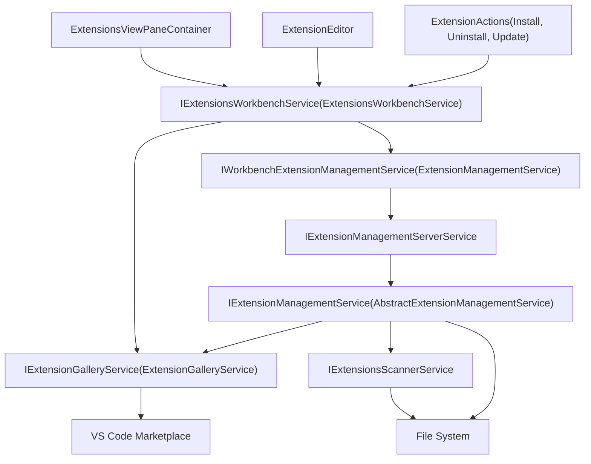
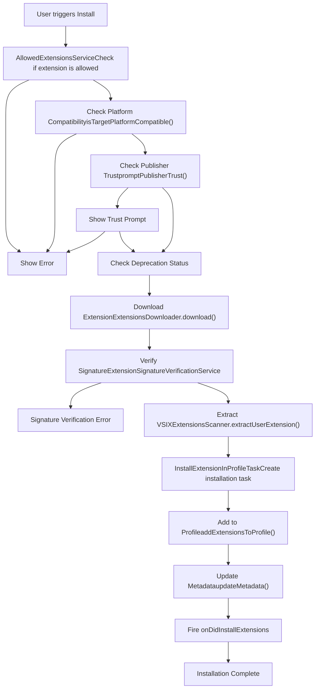
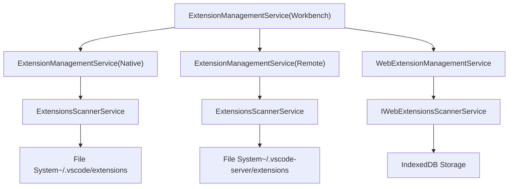
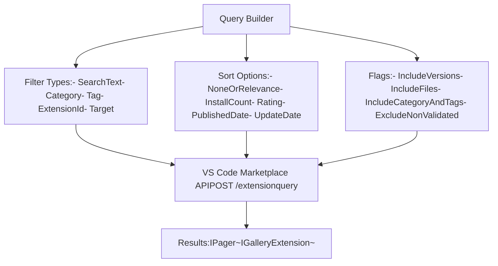
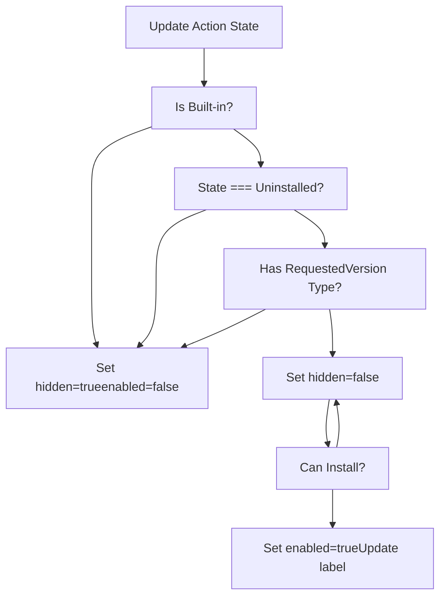

# Extension Management Service

Relevant source files

-   [src/vs/platform/extensionManagement/common/abstractExtensionManagementService.ts](https://github.com/microsoft/vscode/blob/1be3088d/src/vs/platform/extensionManagement/common/abstractExtensionManagementService.ts)
-   [src/vs/platform/extensionManagement/common/extensionGalleryService.ts](https://github.com/microsoft/vscode/blob/1be3088d/src/vs/platform/extensionManagement/common/extensionGalleryService.ts)
-   [src/vs/platform/extensionManagement/common/extensionManagement.ts](https://github.com/microsoft/vscode/blob/1be3088d/src/vs/platform/extensionManagement/common/extensionManagement.ts)
-   [src/vs/platform/extensionManagement/common/extensionManagementIpc.ts](https://github.com/microsoft/vscode/blob/1be3088d/src/vs/platform/extensionManagement/common/extensionManagementIpc.ts)
-   [src/vs/platform/extensionManagement/common/extensionManagementUtil.ts](https://github.com/microsoft/vscode/blob/1be3088d/src/vs/platform/extensionManagement/common/extensionManagementUtil.ts)
-   [src/vs/platform/extensionManagement/node/extensionManagementService.ts](https://github.com/microsoft/vscode/blob/1be3088d/src/vs/platform/extensionManagement/node/extensionManagementService.ts)
-   [src/vs/workbench/contrib/extensions/browser/extensionEditor.ts](https://github.com/microsoft/vscode/blob/1be3088d/src/vs/workbench/contrib/extensions/browser/extensionEditor.ts)
-   [src/vs/workbench/contrib/extensions/browser/extensions.contribution.ts](https://github.com/microsoft/vscode/blob/1be3088d/src/vs/workbench/contrib/extensions/browser/extensions.contribution.ts)
-   [src/vs/workbench/contrib/extensions/browser/extensionsActions.ts](https://github.com/microsoft/vscode/blob/1be3088d/src/vs/workbench/contrib/extensions/browser/extensionsActions.ts)
-   [src/vs/workbench/contrib/extensions/browser/extensionsIcons.ts](https://github.com/microsoft/vscode/blob/1be3088d/src/vs/workbench/contrib/extensions/browser/extensionsIcons.ts)
-   [src/vs/workbench/contrib/extensions/browser/extensionsList.ts](https://github.com/microsoft/vscode/blob/1be3088d/src/vs/workbench/contrib/extensions/browser/extensionsList.ts)
-   [src/vs/workbench/contrib/extensions/browser/extensionsViewer.ts](https://github.com/microsoft/vscode/blob/1be3088d/src/vs/workbench/contrib/extensions/browser/extensionsViewer.ts)
-   [src/vs/workbench/contrib/extensions/browser/extensionsViewlet.ts](https://github.com/microsoft/vscode/blob/1be3088d/src/vs/workbench/contrib/extensions/browser/extensionsViewlet.ts)
-   [src/vs/workbench/contrib/extensions/browser/extensionsViews.ts](https://github.com/microsoft/vscode/blob/1be3088d/src/vs/workbench/contrib/extensions/browser/extensionsViews.ts)
-   [src/vs/workbench/contrib/extensions/browser/extensionsWidgets.ts](https://github.com/microsoft/vscode/blob/1be3088d/src/vs/workbench/contrib/extensions/browser/extensionsWidgets.ts)
-   [src/vs/workbench/contrib/extensions/browser/extensionsWorkbenchService.ts](https://github.com/microsoft/vscode/blob/1be3088d/src/vs/workbench/contrib/extensions/browser/extensionsWorkbenchService.ts)
-   [src/vs/workbench/contrib/extensions/browser/media/extension.css](https://github.com/microsoft/vscode/blob/1be3088d/src/vs/workbench/contrib/extensions/browser/media/extension.css)
-   [src/vs/workbench/contrib/extensions/browser/media/extensionActions.css](https://github.com/microsoft/vscode/blob/1be3088d/src/vs/workbench/contrib/extensions/browser/media/extensionActions.css)
-   [src/vs/workbench/contrib/extensions/browser/media/extensionEditor.css](https://github.com/microsoft/vscode/blob/1be3088d/src/vs/workbench/contrib/extensions/browser/media/extensionEditor.css)
-   [src/vs/workbench/contrib/extensions/browser/media/extensionsViewlet.css](https://github.com/microsoft/vscode/blob/1be3088d/src/vs/workbench/contrib/extensions/browser/media/extensionsViewlet.css)
-   [src/vs/workbench/contrib/extensions/browser/media/extensionsWidgets.css](https://github.com/microsoft/vscode/blob/1be3088d/src/vs/workbench/contrib/extensions/browser/media/extensionsWidgets.css)
-   [src/vs/workbench/contrib/extensions/common/extensions.ts](https://github.com/microsoft/vscode/blob/1be3088d/src/vs/workbench/contrib/extensions/common/extensions.ts)
-   [src/vs/workbench/services/extensionManagement/common/extensionManagement.ts](https://github.com/microsoft/vscode/blob/1be3088d/src/vs/workbench/services/extensionManagement/common/extensionManagement.ts)
-   [src/vs/workbench/services/extensionManagement/common/extensionManagementChannelClient.ts](https://github.com/microsoft/vscode/blob/1be3088d/src/vs/workbench/services/extensionManagement/common/extensionManagementChannelClient.ts)
-   [src/vs/workbench/services/extensionManagement/common/extensionManagementService.ts](https://github.com/microsoft/vscode/blob/1be3088d/src/vs/workbench/services/extensionManagement/common/extensionManagementService.ts)
-   [src/vs/workbench/services/extensionManagement/common/webExtensionManagementService.ts](https://github.com/microsoft/vscode/blob/1be3088d/src/vs/workbench/services/extensionManagement/common/webExtensionManagementService.ts)

The Extension Management Service is the core infrastructure for installing, uninstalling, updating, and managing VS Code extensions. It orchestrates operations between the extension marketplace (gallery), local file system, and the extension runtime, handling both user-installed and built-in extensions across multiple execution contexts (local, remote, and web).

For information about the Extension API implementation and extension host communication, see [Extension API Implementation](/microsoft/vscode/6.2-extension-api-implementation). For extension runtime lifecycle and activation, see [Extension System](/microsoft/vscode/6-extension-system).

---

## Architecture Overview

The Extension Management Service is structured in three architectural layers:

**Platform Layer** (`platform/extensionManagement/`) - Provides core abstractions for extension installation, gallery queries, and file system operations. This layer is environment-agnostic and defines interfaces like `IExtensionManagementService` and `IExtensionGalleryService`.

**Workbench Services Layer** (`workbench/services/extensionManagement/`) - Implements platform abstractions with workbench-specific concerns such as multi-server coordination, user profiles, and settings sync integration.

**UI Contribution Layer** (`workbench/contrib/extensions/`) - Provides the Extensions viewlet, extension editor, and user-facing actions for managing extensions.


Sources: [src/vs/workbench/contrib/extensions/browser/extensionsWorkbenchService.ts1-100](https://github.com/microsoft/vscode/blob/1be3088d/src/vs/workbench/contrib/extensions/browser/extensionsWorkbenchService.ts#L1-L100) [src/vs/workbench/services/extensionManagement/common/extensionManagementService.ts1-100](https://github.com/microsoft/vscode/blob/1be3088d/src/vs/workbench/services/extensionManagement/common/extensionManagementService.ts#L1-L100) [src/vs/platform/extensionManagement/common/extensionManagement.ts399-420](https://github.com/microsoft/vscode/blob/1be3088d/src/vs/platform/extensionManagement/common/extensionManagement.ts#L399-L420)

---

## Core Services

### IExtensionManagementService

The foundational platform service that handles low-level extension installation and uninstallation operations. Each execution context (local, remote, web) has its own implementation.

**Key Methods:**

-   `install(vsix: URI, options?: InstallOptions): Promise<ILocalExtension>` - Install from VSIX file
-   `installFromGallery(extension: IGalleryExtension, options?: InstallOptions): Promise<ILocalExtension>` - Install from marketplace
-   `uninstall(extension: ILocalExtension, options?: UninstallOptions): Promise<void>` - Uninstall extension
-   `getInstalled(type?: ExtensionType, profileLocation?: URI): Promise<ILocalExtension[]>` - Get installed extensions
-   `updateMetadata(local: ILocalExtension, metadata: Metadata, profileLocation: URI): Promise<ILocalExtension>` - Update extension metadata

Sources: [src/vs/platform/extensionManagement/common/extensionManagement.ts399-450](https://github.com/microsoft/vscode/blob/1be3088d/src/vs/platform/extensionManagement/common/extensionManagement.ts#L399-L450)

### IExtensionsWorkbenchService

The primary workbench service that coordinates extension operations with UI concerns. It maintains the `Extension` model objects that combine local installation state with gallery information.

**Key Properties:**

-   `local: IExtension[]` - All locally installed extensions
-   `installed: IExtension[]` - User-installed extensions only
-   `outdated: IExtension[]` - Extensions with available updates

**Key Methods:**

-   `queryLocal(server?: IExtensionManagementServer): Promise<IExtension[]>` - Query installed extensions
-   `queryGallery(options: IQueryOptions, token: CancellationToken): Promise<IPager<IExtension>>` - Search marketplace
-   `install(extension: URI | IExtension, options?: InstallExtensionOptions): Promise<IExtension>` - Install extension
-   `uninstall(extension: IExtension, options?: UninstallOptions): Promise<void>` - Uninstall extension
-   `open(extension: IExtension, options?: IExtensionEditorOptions): Promise<void>` - Open extension details

Sources: [src/vs/workbench/contrib/extensions/common/extensions.ts137-186](https://github.com/microsoft/vscode/blob/1be3088d/src/vs/workbench/contrib/extensions/common/extensions.ts#L137-L186) [src/vs/workbench/contrib/extensions/browser/extensionsWorkbenchService.ts800-1000](https://github.com/microsoft/vscode/blob/1be3088d/src/vs/workbench/contrib/extensions/browser/extensionsWorkbenchService.ts#L800-L1000)

### IExtensionGalleryService

Handles communication with the VS Code Marketplace, including searching, downloading, and retrieving extension metadata.

**Key Methods:**

-   `query(options: IQueryOptions, token: CancellationToken): Promise<IPager<IGalleryExtension>>` - Search extensions
-   `getExtensions(extensionInfos: IExtensionInfo[], token: CancellationToken): Promise<IGalleryExtension[]>` - Get specific extensions
-   `download(extension: IGalleryExtension, location: URI, operation: InstallOperation): Promise<void>` - Download extension VSIX
-   `getManifest(extension: IGalleryExtension, token: CancellationToken): Promise<IExtensionManifest>` - Get extension manifest
-   `getReadme(extension: IGalleryExtension, token: CancellationToken): Promise<string>` - Get README content

Sources: [src/vs/platform/extensionManagement/common/extensionManagement.ts399-450](https://github.com/microsoft/vscode/blob/1be3088d/src/vs/platform/extensionManagement/common/extensionManagement.ts#L399-L450) [src/vs/platform/extensionManagement/common/extensionGalleryService.ts400-500](https://github.com/microsoft/vscode/blob/1be3088d/src/vs/platform/extensionManagement/common/extensionGalleryService.ts#L400-L500)

### IWorkbenchExtensionManagementService

Coordinates extension operations across multiple extension management servers (local, remote, web), handling server selection and cross-server synchronization.

**Key Responsibilities:**

-   Routes installation requests to the appropriate server based on extension manifest properties
-   Handles extension pack installation across multiple servers
-   Manages workspace-scoped extensions
-   Coordinates with Settings Sync for extension synchronization

Sources: [src/vs/workbench/services/extensionManagement/common/extensionManagementService.ts59-200](https://github.com/microsoft/vscode/blob/1be3088d/src/vs/workbench/services/extensionManagement/common/extensionManagementService.ts#L59-L200)

---

## Extension Model

The `Extension` class in `ExtensionsWorkbenchService` is the central model object representing an extension throughout its lifecycle.


**State Properties:**

| Property | Type | Description |
| --- | --- | --- |
| `state` | `ExtensionState` | Installation state: `Installing`, `Installed`, `Uninstalling`, `Uninstalled` |
| `enablementState` | `EnablementState` | Enablement state: `EnabledGlobally`, `DisabledGlobally`, `DisabledByExtensionKind`, etc. |
| `outdated` | `boolean` | Whether a newer version is available in the gallery |
| `runtimeState` | `ExtensionRuntimeState` | Runtime actions needed: `ReloadWindow`, `RestartExtensions`, `ApplyUpdate` |

**Metadata Synchronization:** The `Extension` class synchronizes state between three sources:

1.  **Local installation** (`local: ILocalExtension`) - File system state and manifest
2.  **Gallery information** (`gallery: IGalleryExtension`) - Marketplace metadata and latest version
3.  **Runtime state** (`runtimeStateProvider`) - Execution status from `IExtensionService`

Sources: [src/vs/workbench/contrib/extensions/browser/extensionsWorkbenchService.ts93-586](https://github.com/microsoft/vscode/blob/1be3088d/src/vs/workbench/contrib/extensions/browser/extensionsWorkbenchService.ts#L93-L586)

---

## Installation Pipeline

Extension installation follows a multi-stage pipeline with validation, download, extraction, and metadata management.

### Installation Workflow


### Installation Task Lifecycle

The `InstallExtensionTask` interface defines the contract for installation operations:

```
// From abstractExtensionManagementService.ts:40-50
interface IInstallExtensionTask {
    readonly manifest: IExtensionManifest;
    readonly identifier: IExtensionIdentifier;
    readonly source: IGalleryExtension | URI;
    readonly operation: InstallOperation; // Install, Update, Migrate
    readonly options: InstallExtensionTaskOptions;
    readonly verificationStatus?: ExtensionSignatureVerificationCode;
    run(): Promise<ILocalExtension>;
    waitUntilTaskIsFinished(): Promise<ILocalExtension>;
    cancel(): void;
}
```
**Key Installation Steps:**

1.  **Pre-Installation Validation** [extensionsWorkbenchService.ts1800-1900](https://github.com/microsoft/vscode/blob/1be3088d/extensionsWorkbenchService.ts#L1800-L1900)

    -   Check allowed extensions configuration
    -   Verify platform compatibility
    -   Check publisher trust if required
    -   Validate deprecation status
2.  **Download & Verification** [extensionManagementService.ts299-338](https://github.com/microsoft/vscode/blob/1be3088d/extensionManagementService.ts#L299-L338)

    -   Download VSIX from gallery or use local file
    -   Verify extension signature (if enabled)
    -   Validate manifest against gallery metadata
3.  **Extraction** [extensionManagementService.ts313-327](https://github.com/microsoft/vscode/blob/1be3088d/extensionManagementService.ts#L313-L327)

    -   Extract VSIX to temporary location
    -   Validate extension structure
    -   Copy to extensions directory
4.  **Profile Management** [abstractExtensionManagementService.ts400-500](https://github.com/microsoft/vscode/blob/1be3088d/abstractExtensionManagementService.ts#L400-L500)

    -   Add extension to user profile
    -   Update metadata (gallery ID, publisher info, timestamps)
    -   Handle extension packs and dependencies
5.  **Event Notification** [extensionsWorkbenchService.ts1100-1200](https://github.com/microsoft/vscode/blob/1be3088d/extensionsWorkbenchService.ts#L1100-L1200)

    -   Fire `onDidInstallExtensions` event
    -   Update UI state
    -   Trigger extension host restart if needed

Sources: [src/vs/platform/extensionManagement/node/extensionManagementService.ts145-174](https://github.com/microsoft/vscode/blob/1be3088d/src/vs/platform/extensionManagement/node/extensionManagementService.ts#L145-L174) [src/vs/platform/extensionManagement/common/abstractExtensionManagementService.ts200-400](https://github.com/microsoft/vscode/blob/1be3088d/src/vs/platform/extensionManagement/common/abstractExtensionManagementService.ts#L200-L400) [src/vs/workbench/contrib/extensions/browser/extensionsWorkbenchService.ts1700-2000](https://github.com/microsoft/vscode/blob/1be3088d/src/vs/workbench/contrib/extensions/browser/extensionsWorkbenchService.ts#L1700-L2000)

---

## Multi-Server Architecture

VS Code supports extensions in three execution contexts, each with its own extension management server:

| Server | ID | Context | Extension Location |
| --- | --- | --- | --- |
| Local | `local` | Desktop application | User's local machine |
| Remote | `remote` | SSH/WSL/Containers | Remote machine or container |
| Web | `web` | Browser environment | IndexedDB in browser |

### Server Coordination


**Server Selection Logic:**

The `ExtensionManagementService` (workbench) determines which server(s) to install an extension on based on:

1.  **Extension Manifest Properties** [extensionManagementService.ts500-600](https://github.com/microsoft/vscode/blob/1be3088d/extensionManagementService.ts#L500-L600)

    -   `extensionKind`: `ui`, `workspace`, or `web`
    -   `capabilities.virtualWorkspaces`: Support for virtual file systems
    -   `capabilities.untrustedWorkspaces`: Support for untrusted workspaces
2.  **User Preferences** [extensionManagementService.ts300-400](https://github.com/microsoft/vscode/blob/1be3088d/extensionManagementService.ts#L300-L400)

    -   Explicit server selection in install options
    -   Auto-install preferences for multi-server scenarios
3.  **Extension Type**

    -   Language packs → Install on UI server
    -   Workspace extensions → Install on workspace server
    -   UI extensions → Install on UI server

**Cross-Server Operations:**

| Operation | Behavior |
| --- | --- |
| Install extension pack | Installs pack components to appropriate servers based on their properties |
| Install on both servers | Option to install on both local and remote when compatible |
| Sync extensions | Settings Sync coordinates extensions across servers |
| Update extension | Updates on all servers where currently installed |

Sources: [src/vs/workbench/services/extensionManagement/common/extensionManagement.ts23-44](https://github.com/microsoft/vscode/blob/1be3088d/src/vs/workbench/services/extensionManagement/common/extensionManagement.ts#L23-L44) [src/vs/workbench/services/extensionManagement/common/extensionManagementService.ts200-400](https://github.com/microsoft/vscode/blob/1be3088d/src/vs/workbench/services/extensionManagement/common/extensionManagementService.ts#L200-L400)

---

## Gallery Service Integration

### Query System

The `ExtensionGalleryService` provides a sophisticated query system for searching and filtering marketplace extensions.

**Query Construction:**


**Query Options:**

| Option | Type | Description |
| --- | --- | --- |
| `text` | `string` | Search query text |
| `sortBy` | `SortBy` | Sort criteria (relevance, install count, rating, date) |
| `sortOrder` | `SortOrder` | Ascending or descending |
| `pageSize` | `number` | Results per page (default: 10) |
| `includePreRelease` | `boolean` | Include pre-release versions |
| `productVersion` | `IProductVersion` | VS Code version for compatibility checking |

**Gallery Extension Assets:**

Each `IGalleryExtension` provides access to multiple asset types:

```
// From extensionManagement.ts:181-191
interface IGalleryExtensionAssets {
    manifest: IGalleryExtensionAsset | null;      // package.json
    readme: IGalleryExtensionAsset | null;        // README.md
    changelog: IGalleryExtensionAsset | null;     // CHANGELOG.md
    license: IGalleryExtensionAsset | null;       // LICENSE
    repository: IGalleryExtensionAsset | null;    // Source repository
    download: IGalleryExtensionAsset;             // VSIX download
    icon: IGalleryExtensionAsset | null;          // Extension icon
    signature: IGalleryExtensionAsset | null;     // Signature file
    coreTranslations: [string, IGalleryExtensionAsset][]; // Language packs
}
```
**Compatibility Checking:**

The gallery service performs compatibility checks before installation:

-   Target platform compatibility (OS, architecture)
-   VS Code API version compatibility
-   API proposal compatibility for proposed APIs

Sources: [src/vs/platform/extensionManagement/common/extensionGalleryService.ts244-294](https://github.com/microsoft/vscode/blob/1be3088d/src/vs/platform/extensionManagement/common/extensionGalleryService.ts#L244-L294) [src/vs/platform/extensionManagement/common/extensionManagement.ts175-250](https://github.com/microsoft/vscode/blob/1be3088d/src/vs/platform/extensionManagement/common/extensionManagement.ts#L175-L250)

### Download and Caching

The `ExtensionsDownloader` manages VSIX downloads with caching and signature verification.

**Download Flow:**

1.  Check local cache for previously downloaded VSIX
2.  Download from gallery `fallbackAssetUri` (ensures download is counted)
3.  Verify extension signature if enabled
4.  Cache downloaded VSIX for reuse
5.  Return location and verification status

**Signature Verification:**

When `extensions.verifySignature` is enabled (default: true in native builds):

-   Downloads signature file from gallery
-   Verifies signature using `ExtensionSignatureVerificationService`
-   Returns verification status: `Success`, `NotSigned`, `SignatureVerificationFailed`, etc.
-   Installation fails if verification fails (unless `donotVerifySignature` option is set)

Sources: [src/vs/platform/extensionManagement/node/extensionManagementService.ts253-274](https://github.com/microsoft/vscode/blob/1be3088d/src/vs/platform/extensionManagement/node/extensionManagementService.ts#L253-L274) [src/vs/platform/extensionManagement/node/extensionManagementService.ts340-365](https://github.com/microsoft/vscode/blob/1be3088d/src/vs/platform/extensionManagement/node/extensionManagementService.ts#L340-L365)

---

## Extension Actions

The UI layer provides user-facing actions for extension management through the `ExtensionAction` abstract base class.

### Primary Actions

| Action Class | Purpose | Conditions |
| --- | --- | --- |
| `InstallAction` | Install extension | Extension state is `Uninstalled` |
| `UninstallAction` | Uninstall extension | Extension is user-installed and state is `Installed` |
| `UpdateAction` | Update to latest version | Extension is `outdated` |
| `EnableDropDownAction` | Enable extension | Extension is disabled |
| `DisableDropDownAction` | Disable extension | Extension is enabled and not required |
| `TogglePreReleaseExtensionAction` | Toggle pre-release opt-in | Extension has pre-release version |

### Action State Management

Each `ExtensionAction` maintains its state through:

1.  **Extension Property Observation** [extensionsActions.ts285-318](https://github.com/microsoft/vscode/blob/1be3088d/extensionsActions.ts#L285-L318)

    -   Actions observe the `extension` property
    -   Call `update()` when extension changes
    -   Determine visibility, enablement, and label
2.  **Dynamic State Updates**

    -   `enabled`: Whether action can be executed
    -   `hidden`: Whether action should be displayed
    -   `label`: Display text (can change based on state)
    -   `class`: CSS class for styling
3.  **Context-Aware Behavior**

    -   Different labels for different contexts (e.g., "Install" vs "Install Release Version")
    -   Server-specific actions (install in local vs remote)
    -   Workspace-scoped extension handling

**Example: Install Action State Logic**


Sources: [src/vs/workbench/contrib/extensions/browser/extensionsActions.ts427-495](https://github.com/microsoft/vscode/blob/1be3088d/src/vs/workbench/contrib/extensions/browser/extensionsActions.ts#L427-L495) [src/vs/workbench/contrib/extensions/browser/extensionsActions.ts80-318](https://github.com/microsoft/vscode/blob/1be3088d/src/vs/workbench/contrib/extensions/browser/extensionsActions.ts#L80-L318)

### Compound Actions

Some actions combine multiple sub-actions with dropdown menus:

**`ButtonWithDropDownExtensionAction`** [extensionsActions.ts320-393](https://github.com/microsoft/vscode/blob/1be3088d/extensionsActions.ts#L320-L393)

-   Primary button performs main action
-   Dropdown reveals alternative actions
-   Example: "Install" button with dropdown for "Install Pre-Release" / "Install Release"

**`ManageExtensionAction`** - Context menu for managing extension settings

-   Disable/enable options
-   Uninstall options
-   Copy extension information
-   Configure extension settings

Sources: [src/vs/workbench/contrib/extensions/browser/extensionsActions.ts320-426](https://github.com/microsoft/vscode/blob/1be3088d/src/vs/workbench/contrib/extensions/browser/extensionsActions.ts#L320-L426)

---

## State Management

### Extension State Tracking

Extensions progress through multiple state transitions during their lifecycle:

> **[Mermaid stateDiagram]**
> *(图表结构无法解析)*

**State Properties:**

| State | Property | Source |
| --- | --- | --- |
| Installation State | `state: ExtensionState` | `stateProvider` function |
| Enablement State | `enablementState: EnablementState` | `IWorkbenchExtensionEnablementService` |
| Runtime State | `runtimeState: ExtensionRuntimeState` | `runtimeStateProvider` function |
| Outdated Status | `outdated: boolean` | Version comparison with gallery |

### Enablement States

The `IWorkbenchExtensionEnablementService` manages extension enablement with multiple states:

| EnablementState | Description |
| --- | --- |
| `EnabledGlobally` | Enabled in all contexts |
| `EnabledWorkspace` | Enabled only in current workspace |
| `DisabledGlobally` | User disabled globally |
| `DisabledWorkspace` | User disabled in workspace |
| `DisabledByTrustRequirement` | Disabled due to workspace trust requirements |
| `DisabledByExtensionKind` | Disabled due to incompatible extension kind |
| `DisabledByEnvironment` | Disabled by environment/policy |
| `DisabledByVirtualWorkspace` | Disabled due to virtual workspace limitations |

**Enablement Transitions:**

-   User can enable/disable extensions without uninstalling
-   Enablement can be per-workspace or global
-   System can force disablement due to compatibility or trust requirements
-   Extensions requiring window reload show runtime state actions

Sources: [src/vs/workbench/services/extensionManagement/common/extensionManagement.ts84-105](https://github.com/microsoft/vscode/blob/1be3088d/src/vs/workbench/services/extensionManagement/common/extensionManagement.ts#L84-L105) [src/vs/workbench/contrib/extensions/browser/extensionsWorkbenchService.ts93-150](https://github.com/microsoft/vscode/blob/1be3088d/src/vs/workbench/contrib/extensions/browser/extensionsWorkbenchService.ts#L93-L150)

### Events and Synchronization

The extension management system uses events to coordinate state across components:

**Platform Events:**

-   `onInstallExtension: Event<InstallExtensionEvent>` - Installation started
-   `onDidInstallExtensions: Event<readonly InstallExtensionResult[]>` - Installation(s) completed
-   `onUninstallExtension: Event<UninstallExtensionEvent>` - Uninstallation started
-   `onDidUninstallExtension: Event<DidUninstallExtensionEvent>` - Uninstallation completed
-   `onDidUpdateExtensionMetadata: Event<DidUpdateExtensionMetadata>` - Metadata changed

**Workbench Events:**

-   `onChange: Event<IExtension | undefined>` - Extension state changed (from `ExtensionsWorkbenchService`)
-   `onDidChangeProfile: Event<DidChangeProfileEvent>` - User profile changed
-   Events propagate through the `Extension` model to update UI components

**State Synchronization Flow:**

> **[Mermaid sequence]**
> *(图表结构无法解析)*

Sources: [src/vs/platform/extensionManagement/common/extensionManagement.ts425-460](https://github.com/microsoft/vscode/blob/1be3088d/src/vs/platform/extensionManagement/common/extensionManagement.ts#L425-L460) [src/vs/workbench/contrib/extensions/browser/extensionsWorkbenchService.ts600-700](https://github.com/microsoft/vscode/blob/1be3088d/src/vs/workbench/contrib/extensions/browser/extensionsWorkbenchService.ts#L600-L700)

---

## User Data Profiles

VS Code supports multiple user profiles, each with its own set of installed extensions.

### Profile-Aware Extension Management

The `IProfileAwareExtensionManagementService` extends the base service with profile awareness:

**Profile Operations:**

-   Extensions are scoped to a profile location (URI)
-   Installing an extension adds it to the current profile
-   Switching profiles changes the set of available extensions
-   Extensions can be copied/moved between profiles

**Key Profile Methods:**

| Method | Purpose |
| --- | --- |
| `installExtensionsFromProfile()` | Copy extensions from one profile to another |
| `copyExtensions()` | Replicate all extensions to a new profile |
| `updateMetadata()` | Update extension metadata in specific profile |

**Profile Change Events:**

When the user switches profiles:

1.  `onDidChangeProfile` event fires with added/removed extensions
2.  UI updates to reflect current profile's extensions
3.  Extension host restarts with new profile's extensions
4.  Settings and keybindings sync to new profile

Sources: [src/vs/workbench/services/extensionManagement/common/extensionManagement.ts13-21](https://github.com/microsoft/vscode/blob/1be3088d/src/vs/workbench/services/extensionManagement/common/extensionManagement.ts#L13-L21) [src/vs/workbench/services/extensionManagement/common/extensionManagementService.ts85-127](https://github.com/microsoft/vscode/blob/1be3088d/src/vs/workbench/services/extensionManagement/common/extensionManagementService.ts#L85-L127)

---

## Extension Editor

The `ExtensionEditor` provides a detailed view of extension information with multiple tabs.

### Editor Tabs

| Tab | Content |
| --- | --- |
| Details | README content from extension or gallery |
| Features | Contributed features (commands, settings, languages, etc.) |
| Changelog | CHANGELOG content |
| Extension Pack | List of extensions in pack |
| Dependencies | Extension dependencies |
| Ratings & Review | Marketplace ratings and reviews |

**Content Rendering:**

-   README and Changelog rendered as Markdown in webview
-   Features tab shows structured data from manifest contributions
-   Content fetched lazily when tab is selected
-   Caches content to avoid re-fetching

**State Management:**

-   Editor shows gallery version or local version based on options
-   Can toggle between pre-release and release versions
-   Updates when extension state changes (install/uninstall/update)

Sources: [src/vs/workbench/contrib/extensions/browser/extensionEditor.ts209-257](https://github.com/microsoft/vscode/blob/1be3088d/src/vs/workbench/contrib/extensions/browser/extensionEditor.ts#L209-L257) [src/vs/workbench/contrib/extensions/browser/extensionEditor.ts459-525](https://github.com/microsoft/vscode/blob/1be3088d/src/vs/workbench/contrib/extensions/browser/extensionEditor.ts#L459-L525)

---

## Extension Recommendations

The extension management system integrates with the recommendation service to suggest relevant extensions.

**Recommendation Types:**

-   **Workspace Recommendations** - Extensions listed in `.vscode/extensions.json`
-   **File Type Recommendations** - Extensions for opened file types
-   **Exe Recommendations** - Extensions for detected executables (e.g., Git, Python)
-   **Keymaps** - Keymap extensions for other editors
-   **Dynamic Recommendations** - Machine learning-based suggestions

**Recommendation Integration:**

Extensions have recommendation-related properties:

-   `recommendationReason: string` - Why extension is recommended
-   Recommendation badge displayed in UI
-   "Install All Workspace Recommendations" command
-   Notifications for important recommendations

Sources: [src/vs/workbench/contrib/extensions/browser/extensionsWidgets.ts600-700](https://github.com/microsoft/vscode/blob/1be3088d/src/vs/workbench/contrib/extensions/browser/extensionsWidgets.ts#L600-L700) [src/vs/workbench/contrib/extensions/browser/extensionsViews.ts850-950](https://github.com/microsoft/vscode/blob/1be3088d/src/vs/workbench/contrib/extensions/browser/extensionsViews.ts#L850-L950)

---

This documentation covers the core infrastructure of the Extension Management Service. For details on specific extension capabilities and the extension API, see [Extension API Implementation](/microsoft/vscode/6.2-extension-api-implementation).
