# Integrated Terminal

Relevant source files

-   [src/vs/platform/terminal/common/terminal.ts](https://github.com/microsoft/vscode/blob/1be3088d/src/vs/platform/terminal/common/terminal.ts)
-   [src/vs/platform/terminal/common/terminalEnvironment.ts](https://github.com/microsoft/vscode/blob/1be3088d/src/vs/platform/terminal/common/terminalEnvironment.ts)
-   [src/vs/platform/terminal/common/terminalRecorder.ts](https://github.com/microsoft/vscode/blob/1be3088d/src/vs/platform/terminal/common/terminalRecorder.ts)
-   [src/vs/platform/terminal/node/ptyHostMain.ts](https://github.com/microsoft/vscode/blob/1be3088d/src/vs/platform/terminal/node/ptyHostMain.ts)
-   [src/vs/platform/terminal/node/ptyHostService.ts](https://github.com/microsoft/vscode/blob/1be3088d/src/vs/platform/terminal/node/ptyHostService.ts)
-   [src/vs/platform/terminal/node/ptyService.ts](https://github.com/microsoft/vscode/blob/1be3088d/src/vs/platform/terminal/node/ptyService.ts)
-   [src/vs/platform/terminal/node/terminalProcess.ts](https://github.com/microsoft/vscode/blob/1be3088d/src/vs/platform/terminal/node/terminalProcess.ts)
-   [src/vs/platform/terminal/test/common/terminalEnvironment.test.ts](https://github.com/microsoft/vscode/blob/1be3088d/src/vs/platform/terminal/test/common/terminalEnvironment.test.ts)
-   [src/vs/platform/terminal/test/common/terminalProfiles.test.ts](https://github.com/microsoft/vscode/blob/1be3088d/src/vs/platform/terminal/test/common/terminalProfiles.test.ts)
-   [src/vs/platform/terminal/test/common/terminalRecorder.test.ts](https://github.com/microsoft/vscode/blob/1be3088d/src/vs/platform/terminal/test/common/terminalRecorder.test.ts)
-   [src/vs/workbench/api/browser/mainThreadTerminalService.ts](https://github.com/microsoft/vscode/blob/1be3088d/src/vs/workbench/api/browser/mainThreadTerminalService.ts)
-   [src/vs/workbench/api/common/extHostTerminalService.ts](https://github.com/microsoft/vscode/blob/1be3088d/src/vs/workbench/api/common/extHostTerminalService.ts)
-   [src/vs/workbench/api/node/extHostTerminalService.ts](https://github.com/microsoft/vscode/blob/1be3088d/src/vs/workbench/api/node/extHostTerminalService.ts)
-   [src/vs/workbench/contrib/terminal/browser/media/terminal.css](https://github.com/microsoft/vscode/blob/1be3088d/src/vs/workbench/contrib/terminal/browser/media/terminal.css)
-   [src/vs/workbench/contrib/terminal/browser/media/xterm.css](https://github.com/microsoft/vscode/blob/1be3088d/src/vs/workbench/contrib/terminal/browser/media/xterm.css)
-   [src/vs/workbench/contrib/terminal/browser/remotePty.ts](https://github.com/microsoft/vscode/blob/1be3088d/src/vs/workbench/contrib/terminal/browser/remotePty.ts)
-   [src/vs/workbench/contrib/terminal/browser/terminal.contribution.ts](https://github.com/microsoft/vscode/blob/1be3088d/src/vs/workbench/contrib/terminal/browser/terminal.contribution.ts)
-   [src/vs/workbench/contrib/terminal/browser/terminal.ts](https://github.com/microsoft/vscode/blob/1be3088d/src/vs/workbench/contrib/terminal/browser/terminal.ts)
-   [src/vs/workbench/contrib/terminal/browser/terminalActions.ts](https://github.com/microsoft/vscode/blob/1be3088d/src/vs/workbench/contrib/terminal/browser/terminalActions.ts)
-   [src/vs/workbench/contrib/terminal/browser/terminalEditor.ts](https://github.com/microsoft/vscode/blob/1be3088d/src/vs/workbench/contrib/terminal/browser/terminalEditor.ts)
-   [src/vs/workbench/contrib/terminal/browser/terminalEditorInput.ts](https://github.com/microsoft/vscode/blob/1be3088d/src/vs/workbench/contrib/terminal/browser/terminalEditorInput.ts)
-   [src/vs/workbench/contrib/terminal/browser/terminalEditorService.ts](https://github.com/microsoft/vscode/blob/1be3088d/src/vs/workbench/contrib/terminal/browser/terminalEditorService.ts)
-   [src/vs/workbench/contrib/terminal/browser/terminalGroup.ts](https://github.com/microsoft/vscode/blob/1be3088d/src/vs/workbench/contrib/terminal/browser/terminalGroup.ts)
-   [src/vs/workbench/contrib/terminal/browser/terminalGroupService.ts](https://github.com/microsoft/vscode/blob/1be3088d/src/vs/workbench/contrib/terminal/browser/terminalGroupService.ts)
-   [src/vs/workbench/contrib/terminal/browser/terminalInstance.ts](https://github.com/microsoft/vscode/blob/1be3088d/src/vs/workbench/contrib/terminal/browser/terminalInstance.ts)
-   [src/vs/workbench/contrib/terminal/browser/terminalInstanceService.ts](https://github.com/microsoft/vscode/blob/1be3088d/src/vs/workbench/contrib/terminal/browser/terminalInstanceService.ts)
-   [src/vs/workbench/contrib/terminal/browser/terminalMenus.ts](https://github.com/microsoft/vscode/blob/1be3088d/src/vs/workbench/contrib/terminal/browser/terminalMenus.ts)
-   [src/vs/workbench/contrib/terminal/browser/terminalProcessExtHostProxy.ts](https://github.com/microsoft/vscode/blob/1be3088d/src/vs/workbench/contrib/terminal/browser/terminalProcessExtHostProxy.ts)
-   [src/vs/workbench/contrib/terminal/browser/terminalProcessManager.ts](https://github.com/microsoft/vscode/blob/1be3088d/src/vs/workbench/contrib/terminal/browser/terminalProcessManager.ts)
-   [src/vs/workbench/contrib/terminal/browser/terminalService.ts](https://github.com/microsoft/vscode/blob/1be3088d/src/vs/workbench/contrib/terminal/browser/terminalService.ts)
-   [src/vs/workbench/contrib/terminal/browser/terminalStatusList.ts](https://github.com/microsoft/vscode/blob/1be3088d/src/vs/workbench/contrib/terminal/browser/terminalStatusList.ts)
-   [src/vs/workbench/contrib/terminal/browser/terminalTabbedView.ts](https://github.com/microsoft/vscode/blob/1be3088d/src/vs/workbench/contrib/terminal/browser/terminalTabbedView.ts)
-   [src/vs/workbench/contrib/terminal/browser/terminalTabsList.ts](https://github.com/microsoft/vscode/blob/1be3088d/src/vs/workbench/contrib/terminal/browser/terminalTabsList.ts)
-   [src/vs/workbench/contrib/terminal/browser/terminalView.ts](https://github.com/microsoft/vscode/blob/1be3088d/src/vs/workbench/contrib/terminal/browser/terminalView.ts)
-   [src/vs/workbench/contrib/terminal/browser/xterm/xtermTerminal.ts](https://github.com/microsoft/vscode/blob/1be3088d/src/vs/workbench/contrib/terminal/browser/xterm/xtermTerminal.ts)
-   [src/vs/workbench/contrib/terminal/common/terminal.ts](https://github.com/microsoft/vscode/blob/1be3088d/src/vs/workbench/contrib/terminal/common/terminal.ts)
-   [src/vs/workbench/contrib/terminal/common/terminalColorRegistry.ts](https://github.com/microsoft/vscode/blob/1be3088d/src/vs/workbench/contrib/terminal/common/terminalColorRegistry.ts)
-   [src/vs/workbench/contrib/terminal/common/terminalConfiguration.ts](https://github.com/microsoft/vscode/blob/1be3088d/src/vs/workbench/contrib/terminal/common/terminalConfiguration.ts)
-   [src/vs/workbench/contrib/terminal/common/terminalEnvironment.ts](https://github.com/microsoft/vscode/blob/1be3088d/src/vs/workbench/contrib/terminal/common/terminalEnvironment.ts)
-   [src/vs/workbench/contrib/terminal/common/terminalStrings.ts](https://github.com/microsoft/vscode/blob/1be3088d/src/vs/workbench/contrib/terminal/common/terminalStrings.ts)
-   [src/vs/workbench/contrib/terminal/test/browser/terminalStatusList.test.ts](https://github.com/microsoft/vscode/blob/1be3088d/src/vs/workbench/contrib/terminal/test/browser/terminalStatusList.test.ts)
-   [src/vs/workbench/contrib/terminal/test/common/terminalEnvironment.test.ts](https://github.com/microsoft/vscode/blob/1be3088d/src/vs/workbench/contrib/terminal/test/common/terminalEnvironment.test.ts)

The integrated terminal subsystem provides terminal emulator functionality within VS Code, supporting both local and remote shell sessions. This document covers the terminal's multi-process architecture, instance lifecycle, process management, xterm.js（xterm.js 终端模拟器） integration, PTY host services, shell integration capabilities, and extension API.

For information about terminal-specific contributions (links, quick fixes, suggestions), see the Terminal Contributions subsections (not covered here). For general workbench layout and views, see [Workbench Architecture](/microsoft/vscode/5-workbench-architecture).

---

## Architecture Overview

The terminal uses a multi-process architecture to ensure stability and security. Terminal UI runs in the renderer process, while actual PTY (pseudo-terminal) operations run in an isolated PTY Host process. This prevents shell crashes from affecting VS Code.

### High-Level Component Architecture

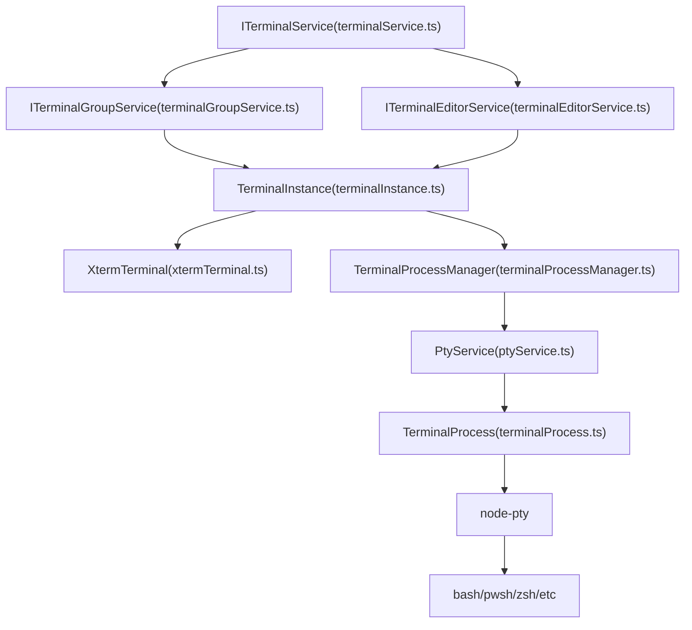
**Sources:** [src/vs/workbench/contrib/terminal/browser/terminalInstance.ts129-648](https://github.com/microsoft/vscode/blob/1be3088d/src/vs/workbench/contrib/terminal/browser/terminalInstance.ts#L129-L648) [src/vs/workbench/contrib/terminal/browser/terminalService.ts66-238](https://github.com/microsoft/vscode/blob/1be3088d/src/vs/workbench/contrib/terminal/browser/terminalService.ts#L66-L238) [src/vs/workbench/contrib/terminal/browser/terminalProcessManager.ts74-168](https://github.com/microsoft/vscode/blob/1be3088d/src/vs/workbench/contrib/terminal/browser/terminalProcessManager.ts#L74-L168) [src/vs/platform/terminal/node/ptyService.ts77-121](https://github.com/microsoft/vscode/blob/1be3088d/src/vs/platform/terminal/node/ptyService.ts#L77-L121)

---

## Terminal Service Hierarchy

The terminal subsystem is organized into several service layers, each with distinct responsibilities.

### Service Responsibilities

| Service | Interface | Purpose |
| --- | --- | --- |
| **TerminalService** | `ITerminalService` | Root service coordinating all terminals, managing backends, handling reconnection |
| **TerminalGroupService** | `ITerminalGroupService` | Manages terminal groups in the panel view, split panes, layout |
| **TerminalEditorService** | `ITerminalEditorService` | Manages terminals opened as editors |
| **TerminalInstanceService** | `ITerminalInstanceService` | Factory for creating terminal instances, backend registry |
| **TerminalConfigurationService** | `ITerminalConfigurationService` | Terminal-specific configuration access |
| **TerminalProfileService** | `ITerminalProfileService` | Manages terminal profiles (shell configurations) |

### Service Interaction Flow

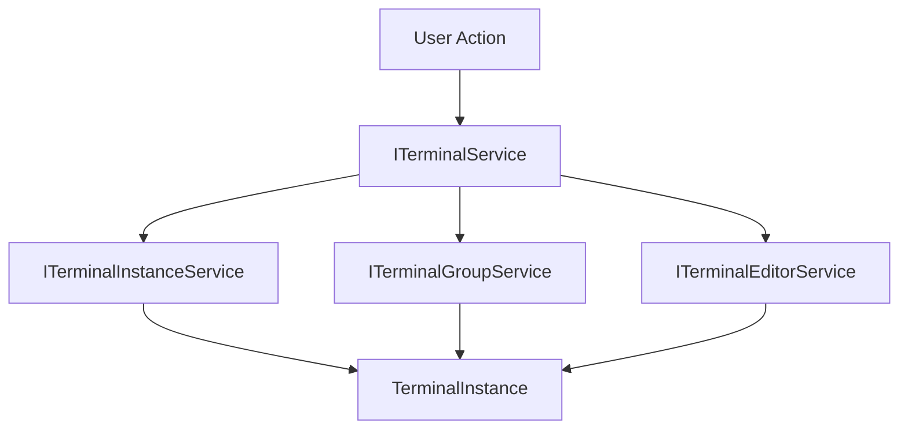
**Sources:** [src/vs/workbench/contrib/terminal/browser/terminal.ts39-46](https://github.com/microsoft/vscode/blob/1be3088d/src/vs/workbench/contrib/terminal/browser/terminal.ts#L39-L46) [src/vs/workbench/contrib/terminal/browser/terminalService.ts66-238](https://github.com/microsoft/vscode/blob/1be3088d/src/vs/workbench/contrib/terminal/browser/terminalService.ts#L66-L238) [src/vs/workbench/contrib/terminal/browser/terminalInstanceService.ts1-80](https://github.com/microsoft/vscode/blob/1be3088d/src/vs/workbench/contrib/terminal/browser/terminalInstanceService.ts#L1-L80)

---

## Terminal Instance Lifecycle

`TerminalInstance` is the core class representing a single terminal. It manages the terminal's UI, process, and lifecycle.

### TerminalInstance Components

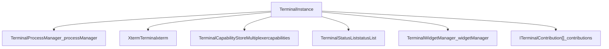
### Key State and Properties

The `TerminalInstance` maintains several critical state properties:

-   **Process State**: `_processManager.processState` tracks initialization, launching, running, or killed states
-   **Dimensions**: `_cols` and `_rows` track terminal dimensions, with optional `_fixedCols`/`_fixedRows`
-   **Title**: `_title` with `_titleSource` indicating origin (API, Process, Sequence, Config)
-   **Working Directory**: `_cwd` for current directory, `_initialCwd` for starting directory
-   **Shell Type**: `_shellType` tracks detected shell (bash, zsh, pwsh, etc.)
-   **Exit State**: `_exitCode` and `_exitReason` track terminal exit

**Sources:** [src/vs/workbench/contrib/terminal/browser/terminalInstance.ts129-305](https://github.com/microsoft/vscode/blob/1be3088d/src/vs/workbench/contrib/terminal/browser/terminalInstance.ts#L129-L305) [src/vs/workbench/contrib/terminal/browser/terminalInstance.ts364-648](https://github.com/microsoft/vscode/blob/1be3088d/src/vs/workbench/contrib/terminal/browser/terminalInstance.ts#L364-L648)

### Terminal Creation Flow

> **[Mermaid sequence]**
> *(图表结构无法解析)*

**Sources:** [src/vs/workbench/contrib/terminal/browser/terminalService.ts240-278](https://github.com/microsoft/vscode/blob/1be3088d/src/vs/workbench/contrib/terminal/browser/terminalService.ts#L240-L278) [src/vs/workbench/contrib/terminal/browser/terminalInstance.ts364-569](https://github.com/microsoft/vscode/blob/1be3088d/src/vs/workbench/contrib/terminal/browser/terminalInstance.ts#L364-L569) [src/vs/workbench/contrib/terminal/browser/terminalProcessManager.ts163-314](https://github.com/microsoft/vscode/blob/1be3088d/src/vs/workbench/contrib/terminal/browser/terminalProcessManager.ts#L163-L314)

---

## Process Management

`TerminalProcessManager` handles all process-related operations, serving as the bridge between `TerminalInstance` and the PTY backend.

### TerminalProcessManager Architecture

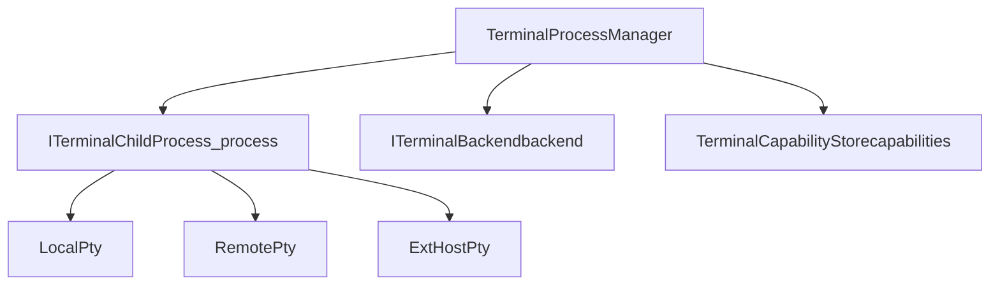
### Process State Management

The process manager tracks state through `ProcessState` enum:

| State | Value | Description |
| --- | --- | --- |
| `Uninitialized` | 1 | Process not yet created |
| `Launching` | 2 | Process being launched |
| `Running` | 3 | Process running normally |
| `KilledDuringLaunch` | 4 | Killed during launch (bad shell/args) |
| `KilledByUser` | 5 | User-initiated kill |
| `KilledByProcess` | 6 | Process exited itself |

### Process Creation and Communication

> **[Mermaid sequence]**
> *(图表结构无法解析)*

**Sources:** [src/vs/workbench/contrib/terminal/browser/terminalProcessManager.ts74-314](https://github.com/microsoft/vscode/blob/1be3088d/src/vs/workbench/contrib/terminal/browser/terminalProcessManager.ts#L74-L314) [src/vs/workbench/contrib/terminal/browser/terminalProcessManager.ts370-500](https://github.com/microsoft/vscode/blob/1be3088d/src/vs/workbench/contrib/terminal/browser/terminalProcessManager.ts#L370-L500) [src/vs/workbench/contrib/terminal/common/terminal.ts258-335](https://github.com/microsoft/vscode/blob/1be3088d/src/vs/workbench/contrib/terminal/common/terminal.ts#L258-L335)

---

## XTerm.js Integration

The `XtermTerminal` class wraps the xterm.js library, providing VS Code-specific functionality and managing addons.

### XtermTerminal Architecture

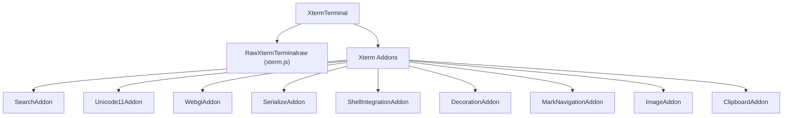
### Key XtermTerminal Responsibilities

1.  **Addon Management**: Loads and manages xterm.js addons based on configuration
2.  **Theme Application**: Applies VS Code themes to terminal colors via `_updateTheme()`
3.  **Configuration Sync**: Syncs terminal configuration changes to xterm.js via `updateConfig()`
4.  **Rendering**: Manages canvas/DOM renderer and WebGL acceleration
5.  **Input Handling**: Processes keyboard input, mouse events, and clipboard operations
6.  **Shell Integration**: Coordinates with `ShellIntegrationAddon` for advanced shell features

### Addon Loading Pattern

> **[Mermaid sequence]**
> *(图表结构无法解析)*

**Sources:** [src/vs/workbench/contrib/terminal/browser/xterm/xtermTerminal.ts1-100](https://github.com/microsoft/vscode/blob/1be3088d/src/vs/workbench/contrib/terminal/browser/xterm/xtermTerminal.ts#L1-L100) [src/vs/workbench/contrib/terminal/browser/xterm/xtermTerminal.ts150-300](https://github.com/microsoft/vscode/blob/1be3088d/src/vs/workbench/contrib/terminal/browser/xterm/xtermTerminal.ts#L150-L300) [src/vs/workbench/contrib/terminal/browser/xterm/xtermAddonImporter.ts1-50](https://github.com/microsoft/vscode/blob/1be3088d/src/vs/workbench/contrib/terminal/browser/xterm/xtermAddonImporter.ts#L1-L50)

---

## PTY Host and Multi-Server Support

The PTY Host is an isolated process that manages actual shell processes, preventing crashes from affecting VS Code. The `PtyService` coordinates between the renderer and PTY Host.

### PTY Host Architecture

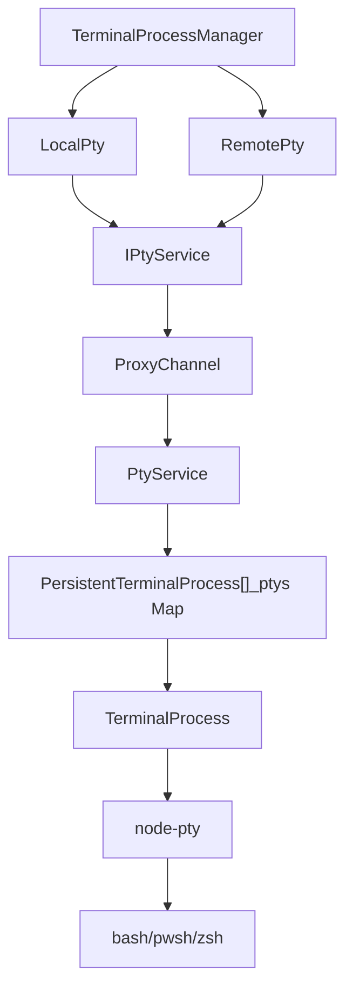
### PtyService Responsibilities

The `PtyService` manages terminal processes in the isolated PTY Host:

| Method | Purpose |
| --- | --- |
| `createProcess()` | Creates new terminal process with shell launch config |
| `attachToProcess()` | Attaches to existing persistent process |
| `listProcesses()` | Lists all active terminal processes |
| `shutdownAll()` | Shuts down all terminal processes |
| `getTerminalLayoutInfo()` | Gets layout info for workspace restoration |
| `setTerminalLayoutInfo()` | Sets layout info during workspace save |
| `reduceConnectionGraceTime()` | Speeds up reconnection timeout |

### Process Persistence and Reconnection

> **[Mermaid sequence]**
> *(图表结构无法解析)*

**Sources:** [src/vs/platform/terminal/node/ptyService.ts77-200](https://github.com/microsoft/vscode/blob/1be3088d/src/vs/platform/terminal/node/ptyService.ts#L77-L200) [src/vs/platform/terminal/node/ptyService.ts200-400](https://github.com/microsoft/vscode/blob/1be3088d/src/vs/platform/terminal/node/ptyService.ts#L200-L400) [src/vs/workbench/contrib/terminal/browser/terminalProcessManager.ts370-450](https://github.com/microsoft/vscode/blob/1be3088d/src/vs/workbench/contrib/terminal/browser/terminalProcessManager.ts#L370-L450)

---

## Shell Integration and Capabilities

Shell integration provides semantic understanding of terminal output through injected shell scripts that emit special escape sequences.

### Shell Integration Architecture

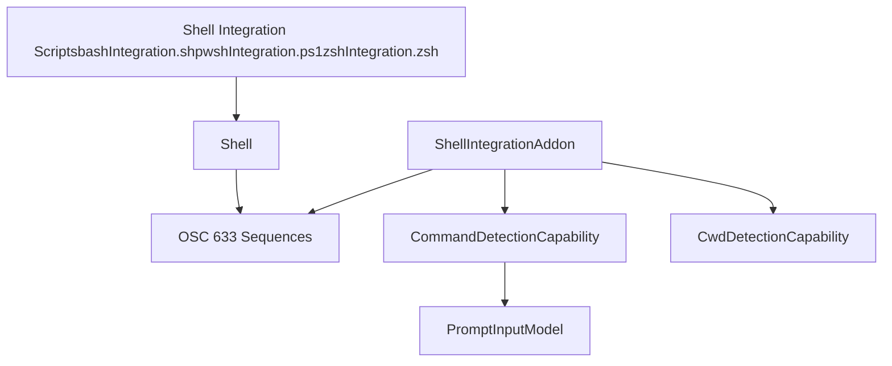
### Supported Shell Types

Shell integration is supported for the following shell types (from `shellIntegrationSupportedShellTypes`):

-   **Bash** (`PosixShellType.Bash`)
-   **Zsh** (`PosixShellType.Zsh`)
-   **PowerShell** (`GeneralShellType.PowerShell`)
-   **Python** (`GeneralShellType.Python`)

### OSC 633 Sequence Protocol

The shell integration uses OSC (Operating System Command) 633 sequences for communication:

| Sequence | Purpose | Example |
| --- | --- | --- |
| `633;A` | Command start | Marks command execution start |
| `633;B` | Command line | Contains the command being executed |
| `633;C` | Command executed | Command finished executing |
| `633;D` | Command exit | Command exit code |
| `633;E` | Command output start | Marks start of command output |
| `633;P` | Property | Shell property (e.g., `Cwd=/home/user`) |

### Terminal Capabilities System

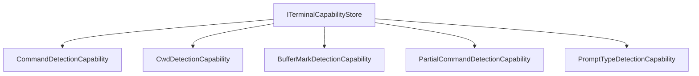
**Sources:** [src/vs/workbench/contrib/terminal/browser/terminalInstance.ts122-128](https://github.com/microsoft/vscode/blob/1be3088d/src/vs/workbench/contrib/terminal/browser/terminalInstance.ts#L122-L128) [src/vs/platform/terminal/common/xterm/shellIntegrationAddon.ts1-100](https://github.com/microsoft/vscode/blob/1be3088d/src/vs/platform/terminal/common/xterm/shellIntegrationAddon.ts#L1-L100) [src/vs/workbench/contrib/terminal/browser/terminalInstance.ts460-502](https://github.com/microsoft/vscode/blob/1be3088d/src/vs/workbench/contrib/terminal/browser/terminalInstance.ts#L460-L502)

---

## Terminal UI and Layout

The terminal UI is organized into views that can appear in the panel, sidebar, or as editors.

### Terminal View Hierarchy

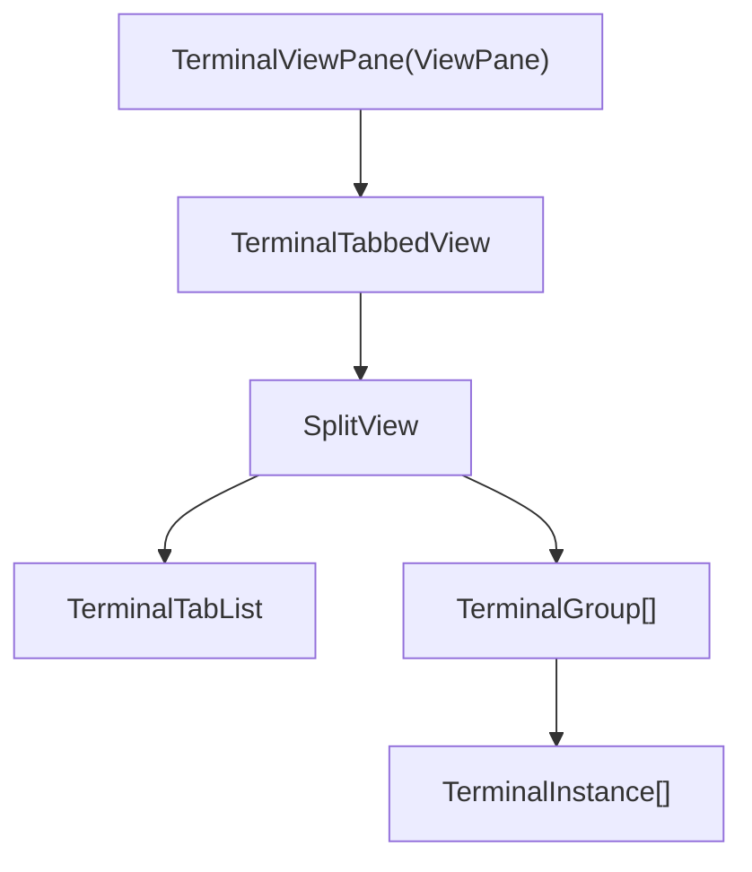
### Terminal Locations

Terminals can appear in multiple locations:

| Location | Managed By | Description |
| --- | --- | --- |
| **Panel** | `ITerminalGroupService` | Traditional terminal panel at bottom |
| **Editor** | `ITerminalEditorService` | Terminal as editor tab |
| **Sidebar** | `ITerminalGroupService` | Terminal in side panel |

### Terminal Tab Rendering

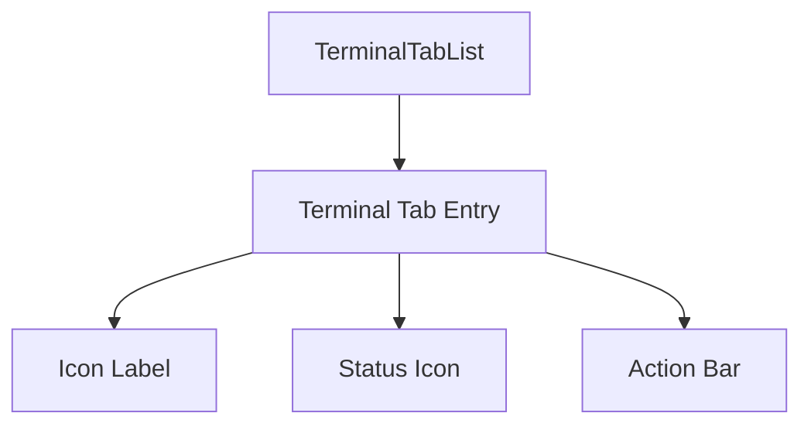
The `TerminalTabList` uses a `WorkbenchList` to display terminal tabs with:

-   **Icon and Color**: Terminal icon with optional color theme
-   **Title**: Computed from `TerminalLabelComputer` based on settings
-   **Status Icons**: Show terminal state (running, exited, etc.)
-   **Actions**: Context menu and quick actions

**Sources:** [src/vs/workbench/contrib/terminal/browser/terminalView.ts57-240](https://github.com/microsoft/vscode/blob/1be3088d/src/vs/workbench/contrib/terminal/browser/terminalView.ts#L57-L240) [src/vs/workbench/contrib/terminal/browser/terminalTabbedView.ts43-200](https://github.com/microsoft/vscode/blob/1be3088d/src/vs/workbench/contrib/terminal/browser/terminalTabbedView.ts#L43-L200) [src/vs/workbench/contrib/terminal/browser/terminalTabsList.ts1-100](https://github.com/microsoft/vscode/blob/1be3088d/src/vs/workbench/contrib/terminal/browser/terminalTabsList.ts#L1-L100)

---

## Terminal Extension API

Extensions interact with terminals through the `vscode.window` API and can create custom pseudoterminals.

### ExtHostTerminalService Architecture

### Terminal Creation Patterns

Extensions can create terminals in several ways:

```
// Simple terminal
vscode.window.createTerminal({
  name: "My Terminal",
  shellPath: "/bin/bash"
});

// Pseudoterminal with custom implementation
vscode.window.createTerminal({
  name: "Custom Terminal",
  pty: new MyPseudoterminal()
});

// Profile-based terminal
terminalProfile.createTerminal(options);
```
### Environment Variable Mutations

Extensions can modify terminal environment variables:

```
const collection = vscode.window.createTerminalEnvironmentVariableCollection();
collection.append("PATH", ":/my/path");
collection.replace("MY_VAR", "value");
collection.prepend("PROMPT", "[ext] ");
```
| Mutator Type | Operation |
| --- | --- |
| `Replace` | Replaces variable value |
| `Append` | Appends to variable value |
| `Prepend` | Prepends to variable value |

**Sources:** [src/vs/workbench/api/common/extHostTerminalService.ts33-200](https://github.com/microsoft/vscode/blob/1be3088d/src/vs/workbench/api/common/extHostTerminalService.ts#L33-L200) [src/vs/workbench/api/browser/mainThreadTerminalService.ts1-150](https://github.com/microsoft/vscode/blob/1be3088d/src/vs/workbench/api/browser/mainThreadTerminalService.ts#L1-L150) [src/vs/workbench/contrib/terminal/browser/terminalProcessExtHostProxy.ts1-100](https://github.com/microsoft/vscode/blob/1be3088d/src/vs/workbench/contrib/terminal/browser/terminalProcessExtHostProxy.ts#L1-L100)

---

## Terminal Process Flow

This diagram shows the complete flow from terminal creation to data rendering:

> **[Mermaid sequence]**
> *(图表结构无法解析)*

**Sources:** [src/vs/workbench/contrib/terminal/browser/terminalInstance.ts527-569](https://github.com/microsoft/vscode/blob/1be3088d/src/vs/workbench/contrib/terminal/browser/terminalInstance.ts#L527-L569) [src/vs/workbench/contrib/terminal/browser/terminalProcessManager.ts370-500](https://github.com/microsoft/vscode/blob/1be3088d/src/vs/workbench/contrib/terminal/browser/terminalProcessManager.ts#L370-L500) [src/vs/platform/terminal/node/ptyService.ts200-350](https://github.com/microsoft/vscode/blob/1be3088d/src/vs/platform/terminal/node/ptyService.ts#L200-L350)

---

## Configuration and Settings

Terminal behavior is controlled through settings in the `terminal.integrated` namespace.

### Key Configuration Settings

| Setting | Purpose | Default |
| --- | --- | --- |
| `terminal.integrated.defaultProfile.*` | Default shell profile per OS | System shell |
| `terminal.integrated.profiles.*` | Available shell profiles | Platform defaults |
| `terminal.integrated.fontFamily` | Terminal font family | Editor font |
| `terminal.integrated.fontSize` | Terminal font size | 12 (macOS), 14 (other) |
| `terminal.integrated.shellIntegration.enabled` | Enable shell integration | `true` |
| `terminal.integrated.enablePersistentSessions` | Enable terminal reconnection | `true` |
| `terminal.integrated.tabs.enabled` | Show terminal tabs | `true` |
| `terminal.integrated.defaultLocation` | Default terminal location | `view` |

### Terminal Profile Structure

A terminal profile defines shell configuration:

```
interface ITerminalProfile {
  profileName: string;
  path: string | string[];
  args?: string | string[];
  icon?: ThemeIcon;
  color?: string;
  env?: ITerminalEnvironment;
}
```
**Sources:** [src/vs/workbench/contrib/terminal/common/terminalConfiguration.ts1-100](https://github.com/microsoft/vscode/blob/1be3088d/src/vs/workbench/contrib/terminal/common/terminalConfiguration.ts#L1-L100) [src/vs/platform/terminal/common/terminal.ts22-134](https://github.com/microsoft/vscode/blob/1be3088d/src/vs/platform/terminal/common/terminal.ts#L22-L134) [src/vs/workbench/contrib/terminal/common/terminal.ts102-218](https://github.com/microsoft/vscode/blob/1be3088d/src/vs/workbench/contrib/terminal/common/terminal.ts#L102-L218)

---

## Terminal Data Flow

The following diagram shows how data flows through the terminal system:

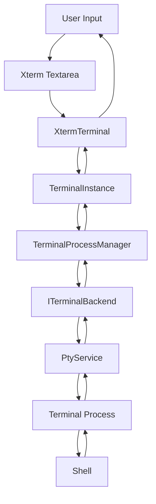
**Sources:** [src/vs/workbench/contrib/terminal/browser/terminalInstance.ts654-657](https://github.com/microsoft/vscode/blob/1be3088d/src/vs/workbench/contrib/terminal/browser/terminalInstance.ts#L654-L657) [src/vs/workbench/contrib/terminal/browser/terminalProcessManager.ts540-600](https://github.com/microsoft/vscode/blob/1be3088d/src/vs/workbench/contrib/terminal/browser/terminalProcessManager.ts#L540-L600) [src/vs/platform/terminal/node/ptyService.ts350-450](https://github.com/microsoft/vscode/blob/1be3088d/src/vs/platform/terminal/node/ptyService.ts#L350-L450)
