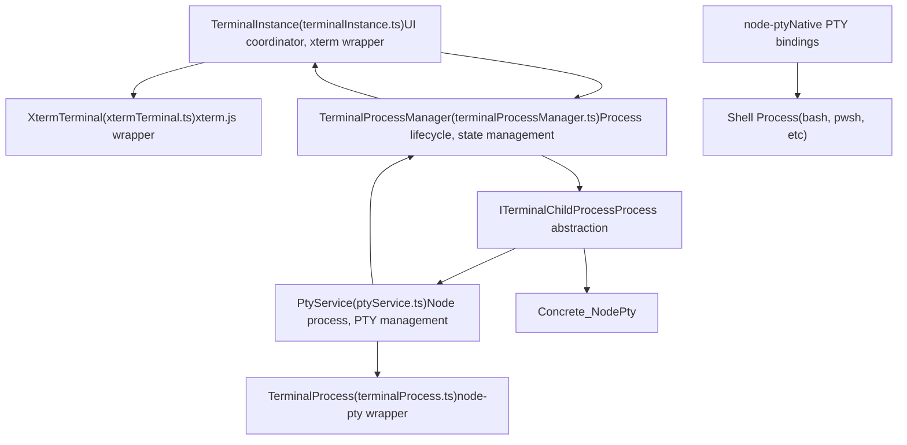
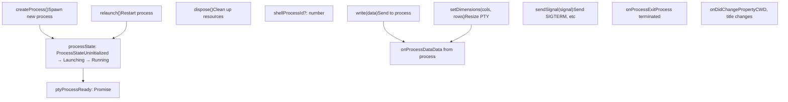
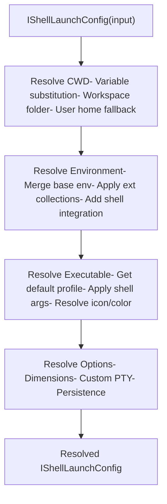
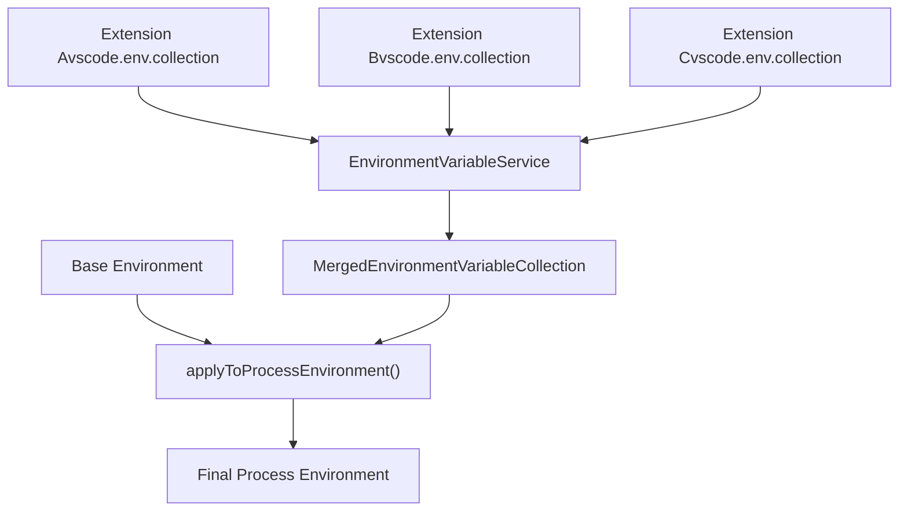
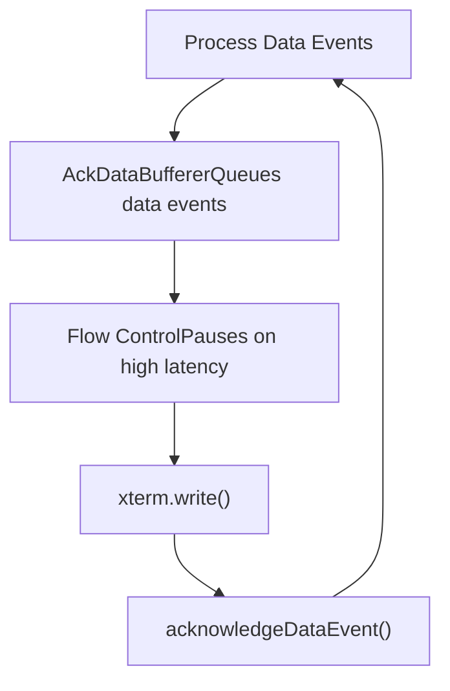
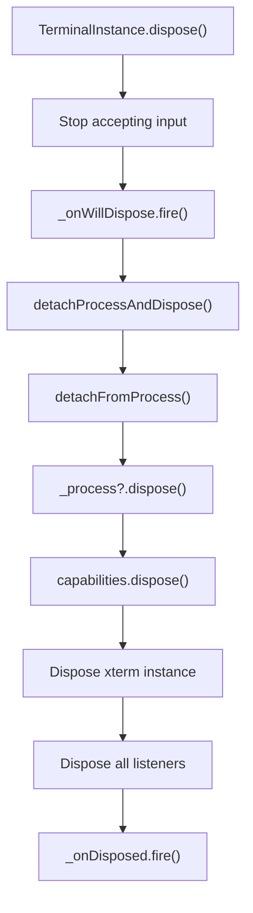
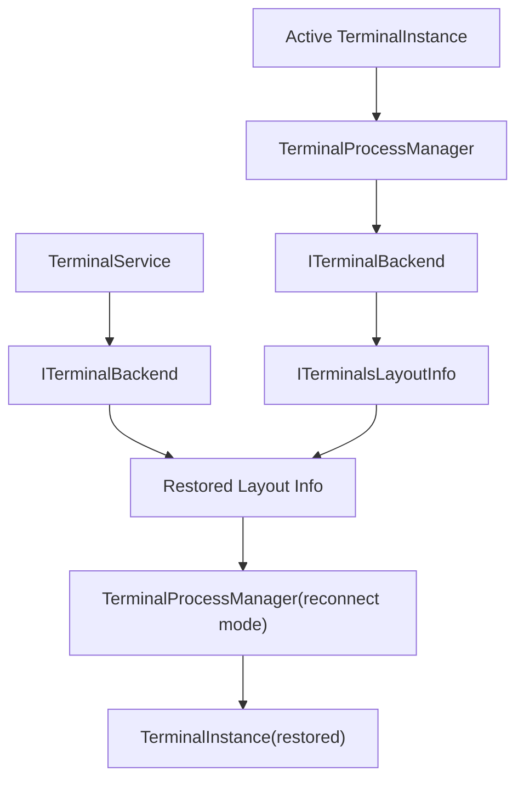
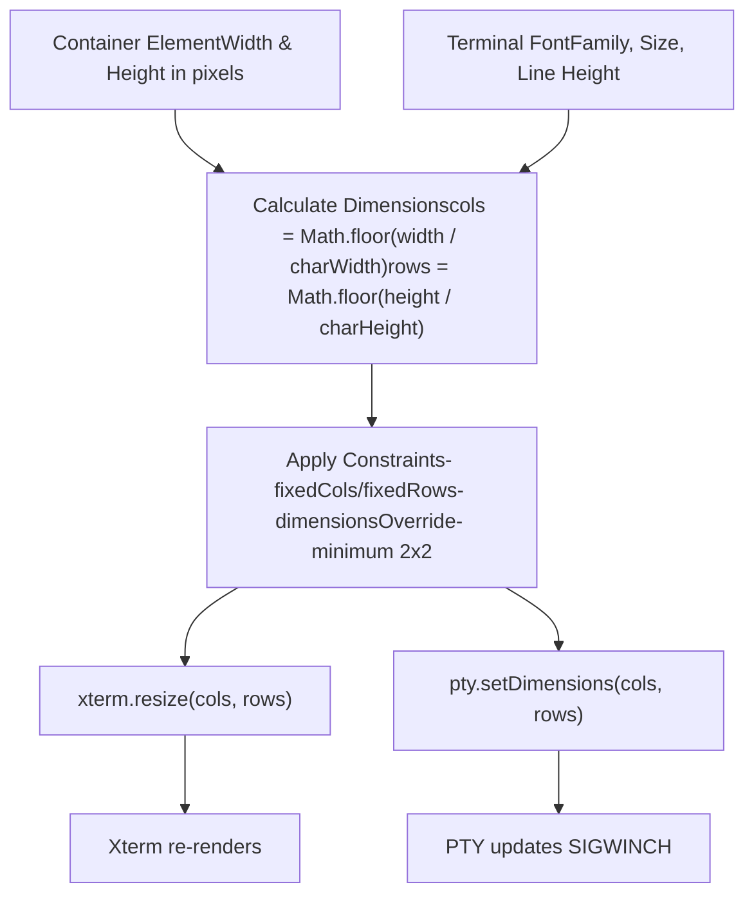

# Terminal Instance and Process Management

Relevant source files

-   [src/vs/platform/terminal/common/terminal.ts](https://github.com/microsoft/vscode/blob/1be3088d/src/vs/platform/terminal/common/terminal.ts)
-   [src/vs/platform/terminal/common/terminalEnvironment.ts](https://github.com/microsoft/vscode/blob/1be3088d/src/vs/platform/terminal/common/terminalEnvironment.ts)
-   [src/vs/platform/terminal/common/terminalRecorder.ts](https://github.com/microsoft/vscode/blob/1be3088d/src/vs/platform/terminal/common/terminalRecorder.ts)
-   [src/vs/platform/terminal/node/ptyHostMain.ts](https://github.com/microsoft/vscode/blob/1be3088d/src/vs/platform/terminal/node/ptyHostMain.ts)
-   [src/vs/platform/terminal/node/ptyHostService.ts](https://github.com/microsoft/vscode/blob/1be3088d/src/vs/platform/terminal/node/ptyHostService.ts)
-   [src/vs/platform/terminal/node/ptyService.ts](https://github.com/microsoft/vscode/blob/1be3088d/src/vs/platform/terminal/node/ptyService.ts)
-   [src/vs/platform/terminal/node/terminalProcess.ts](https://github.com/microsoft/vscode/blob/1be3088d/src/vs/platform/terminal/node/terminalProcess.ts)
-   [src/vs/platform/terminal/test/common/terminalEnvironment.test.ts](https://github.com/microsoft/vscode/blob/1be3088d/src/vs/platform/terminal/test/common/terminalEnvironment.test.ts)
-   [src/vs/platform/terminal/test/common/terminalProfiles.test.ts](https://github.com/microsoft/vscode/blob/1be3088d/src/vs/platform/terminal/test/common/terminalProfiles.test.ts)
-   [src/vs/platform/terminal/test/common/terminalRecorder.test.ts](https://github.com/microsoft/vscode/blob/1be3088d/src/vs/platform/terminal/test/common/terminalRecorder.test.ts)
-   [src/vs/workbench/api/browser/mainThreadTerminalService.ts](https://github.com/microsoft/vscode/blob/1be3088d/src/vs/workbench/api/browser/mainThreadTerminalService.ts)
-   [src/vs/workbench/api/common/extHostTerminalService.ts](https://github.com/microsoft/vscode/blob/1be3088d/src/vs/workbench/api/common/extHostTerminalService.ts)
-   [src/vs/workbench/api/node/extHostTerminalService.ts](https://github.com/microsoft/vscode/blob/1be3088d/src/vs/workbench/api/node/extHostTerminalService.ts)
-   [src/vs/workbench/contrib/terminal/browser/media/terminal.css](https://github.com/microsoft/vscode/blob/1be3088d/src/vs/workbench/contrib/terminal/browser/media/terminal.css)
-   [src/vs/workbench/contrib/terminal/browser/media/xterm.css](https://github.com/microsoft/vscode/blob/1be3088d/src/vs/workbench/contrib/terminal/browser/media/xterm.css)
-   [src/vs/workbench/contrib/terminal/browser/remotePty.ts](https://github.com/microsoft/vscode/blob/1be3088d/src/vs/workbench/contrib/terminal/browser/remotePty.ts)
-   [src/vs/workbench/contrib/terminal/browser/terminal.contribution.ts](https://github.com/microsoft/vscode/blob/1be3088d/src/vs/workbench/contrib/terminal/browser/terminal.contribution.ts)
-   [src/vs/workbench/contrib/terminal/browser/terminal.ts](https://github.com/microsoft/vscode/blob/1be3088d/src/vs/workbench/contrib/terminal/browser/terminal.ts)
-   [src/vs/workbench/contrib/terminal/browser/terminalActions.ts](https://github.com/microsoft/vscode/blob/1be3088d/src/vs/workbench/contrib/terminal/browser/terminalActions.ts)
-   [src/vs/workbench/contrib/terminal/browser/terminalEditor.ts](https://github.com/microsoft/vscode/blob/1be3088d/src/vs/workbench/contrib/terminal/browser/terminalEditor.ts)
-   [src/vs/workbench/contrib/terminal/browser/terminalEditorInput.ts](https://github.com/microsoft/vscode/blob/1be3088d/src/vs/workbench/contrib/terminal/browser/terminalEditorInput.ts)
-   [src/vs/workbench/contrib/terminal/browser/terminalEditorService.ts](https://github.com/microsoft/vscode/blob/1be3088d/src/vs/workbench/contrib/terminal/browser/terminalEditorService.ts)
-   [src/vs/workbench/contrib/terminal/browser/terminalGroup.ts](https://github.com/microsoft/vscode/blob/1be3088d/src/vs/workbench/contrib/terminal/browser/terminalGroup.ts)
-   [src/vs/workbench/contrib/terminal/browser/terminalGroupService.ts](https://github.com/microsoft/vscode/blob/1be3088d/src/vs/workbench/contrib/terminal/browser/terminalGroupService.ts)
-   [src/vs/workbench/contrib/terminal/browser/terminalInstance.ts](https://github.com/microsoft/vscode/blob/1be3088d/src/vs/workbench/contrib/terminal/browser/terminalInstance.ts)
-   [src/vs/workbench/contrib/terminal/browser/terminalInstanceService.ts](https://github.com/microsoft/vscode/blob/1be3088d/src/vs/workbench/contrib/terminal/browser/terminalInstanceService.ts)
-   [src/vs/workbench/contrib/terminal/browser/terminalMenus.ts](https://github.com/microsoft/vscode/blob/1be3088d/src/vs/workbench/contrib/terminal/browser/terminalMenus.ts)
-   [src/vs/workbench/contrib/terminal/browser/terminalProcessExtHostProxy.ts](https://github.com/microsoft/vscode/blob/1be3088d/src/vs/workbench/contrib/terminal/browser/terminalProcessExtHostProxy.ts)
-   [src/vs/workbench/contrib/terminal/browser/terminalProcessManager.ts](https://github.com/microsoft/vscode/blob/1be3088d/src/vs/workbench/contrib/terminal/browser/terminalProcessManager.ts)
-   [src/vs/workbench/contrib/terminal/browser/terminalService.ts](https://github.com/microsoft/vscode/blob/1be3088d/src/vs/workbench/contrib/terminal/browser/terminalService.ts)
-   [src/vs/workbench/contrib/terminal/browser/terminalStatusList.ts](https://github.com/microsoft/vscode/blob/1be3088d/src/vs/workbench/contrib/terminal/browser/terminalStatusList.ts)
-   [src/vs/workbench/contrib/terminal/browser/terminalTabbedView.ts](https://github.com/microsoft/vscode/blob/1be3088d/src/vs/workbench/contrib/terminal/browser/terminalTabbedView.ts)
-   [src/vs/workbench/contrib/terminal/browser/terminalTabsList.ts](https://github.com/microsoft/vscode/blob/1be3088d/src/vs/workbench/contrib/terminal/browser/terminalTabsList.ts)
-   [src/vs/workbench/contrib/terminal/browser/terminalView.ts](https://github.com/microsoft/vscode/blob/1be3088d/src/vs/workbench/contrib/terminal/browser/terminalView.ts)
-   [src/vs/workbench/contrib/terminal/browser/xterm/xtermTerminal.ts](https://github.com/microsoft/vscode/blob/1be3088d/src/vs/workbench/contrib/terminal/browser/xterm/xtermTerminal.ts)
-   [src/vs/workbench/contrib/terminal/common/terminal.ts](https://github.com/microsoft/vscode/blob/1be3088d/src/vs/workbench/contrib/terminal/common/terminal.ts)
-   [src/vs/workbench/contrib/terminal/common/terminalColorRegistry.ts](https://github.com/microsoft/vscode/blob/1be3088d/src/vs/workbench/contrib/terminal/common/terminalColorRegistry.ts)
-   [src/vs/workbench/contrib/terminal/common/terminalConfiguration.ts](https://github.com/microsoft/vscode/blob/1be3088d/src/vs/workbench/contrib/terminal/common/terminalConfiguration.ts)
-   [src/vs/workbench/contrib/terminal/common/terminalEnvironment.ts](https://github.com/microsoft/vscode/blob/1be3088d/src/vs/workbench/contrib/terminal/common/terminalEnvironment.ts)
-   [src/vs/workbench/contrib/terminal/common/terminalStrings.ts](https://github.com/microsoft/vscode/blob/1be3088d/src/vs/workbench/contrib/terminal/common/terminalStrings.ts)
-   [src/vs/workbench/contrib/terminal/test/browser/terminalStatusList.test.ts](https://github.com/microsoft/vscode/blob/1be3088d/src/vs/workbench/contrib/terminal/test/browser/terminalStatusList.test.ts)
-   [src/vs/workbench/contrib/terminal/test/common/terminalEnvironment.test.ts](https://github.com/microsoft/vscode/blob/1be3088d/src/vs/workbench/contrib/terminal/test/common/terminalEnvironment.test.ts)

This document covers the architecture and lifecycle of terminal instances and their associated processes in VS Code. It explains how `TerminalInstance` coordinates the terminal UI with `TerminalProcessManager` to spawn, manage, and communicate with shell processes via the PTY host.

For information about the overall terminal system architecture and service layer, see [Terminal Architecture Overview](/microsoft/vscode/8.1-chat-system-architecture). For terminal UI and rendering with xterm.js, see [XTerm.js Integration and Rendering](/microsoft/vscode/8.4-chat-ui-components). For multi-server and remote terminal support, see [Multi-Server Terminal Support](/microsoft/vscode/8.3-chat-request-and-response-flow).

## Architecture Overview

The terminal instance and process management system follows a layered architecture where each component has distinct responsibilities.

**Sources:** [src/vs/workbench/contrib/terminal/browser/terminalInstance.ts129-210](https://github.com/microsoft/vscode/blob/1be3088d/src/vs/workbench/contrib/terminal/browser/terminalInstance.ts#L129-L210) [src/vs/workbench/contrib/terminal/browser/terminalProcessManager.ts74-137](https://github.com/microsoft/vscode/blob/1be3088d/src/vs/workbench/contrib/terminal/browser/terminalProcessManager.ts#L74-L137) [src/vs/platform/terminal/node/ptyService.ts77-120](https://github.com/microsoft/vscode/blob/1be3088d/src/vs/platform/terminal/node/ptyService.ts#L77-L120)

## TerminalInstance: The UI Coordinator

`TerminalInstance` is the primary class that represents a terminal in the workbench. It manages the UI, coordinates with the process manager, and handles user interactions.

### Key Responsibilities

| Responsibility | Description |
| --- | --- |
| **Xterm Management** | Creates and manages the `XtermTerminal` instance for rendering |
| **Process Coordination** | Delegates to `TerminalProcessManager` for process lifecycle |
| **Input Handling** | Captures user input and sends to the process |
| **Title & Icon Management** | Manages terminal title, icon, and metadata |
| **Event Aggregation** | Aggregates events from process and UI layers |
| **State Management** | Tracks terminal visibility, focus, dimensions |

### Instance Creation and Initialization

> **[Mermaid sequence]**
> *(图表结构无法解析)*

**Sources:** [src/vs/workbench/contrib/terminal/browser/terminalInstance.ts365-650](https://github.com/microsoft/vscode/blob/1be3088d/src/vs/workbench/contrib/terminal/browser/terminalInstance.ts#L365-L650) [src/vs/workbench/contrib/terminal/browser/terminalInstance.ts523-571](https://github.com/microsoft/vscode/blob/1be3088d/src/vs/workbench/contrib/terminal/browser/terminalInstance.ts#L523-L571)

### Core Properties and State

The `TerminalInstance` class maintains extensive state about the terminal:

```mermaid
flowchart TD
    title["_title: string"]
    titleSource["_titleSource: TitleEventSource"]
    icon["_icon?: TerminalIcon"]
    cwd["_cwd?: string"]
    exitCode["_exitCode?: number"]
    exitReason["_exitReason?: TerminalExitReason"]
    isExiting["_isExiting: boolean"]
    cols["_cols: number"]
    rows["_rows: number"]
    fixedCols["_fixedCols?: number"]
    fixedRows["_fixedRows?: number"]
    container["_container: HTMLElement"]
    wrapperElement["_wrapperElement: HTMLElement"]
    isVisible["_isVisible: boolean"]
    hasFocus["hasFocus (computed)"]
    instanceId["_instanceId: number"]
    shellLaunchConfig["_shellLaunchConfig: IShellLaunchConfig"]
    resource["_resource: URI"]
```

**Sources:** [src/vs/workbench/contrib/terminal/browser/terminalInstance.ts148-206](https://github.com/microsoft/vscode/blob/1be3088d/src/vs/workbench/contrib/terminal/browser/terminalInstance.ts#L148-L206) [src/vs/workbench/contrib/terminal/browser/terminalInstance.ts231-305](https://github.com/microsoft/vscode/blob/1be3088d/src/vs/workbench/contrib/terminal/browser/terminalInstance.ts#L231-L305)

### Data Flow: User Input to Process

When a user types in the terminal, the data flows through multiple layers:

> **[Mermaid sequence]**
> *(图表结构无法解析)*

**Sources:** [src/vs/workbench/contrib/terminal/browser/terminalInstance.ts656-659](https://github.com/microsoft/vscode/blob/1be3088d/src/vs/workbench/contrib/terminal/browser/terminalInstance.ts#L656-L659) [src/vs/workbench/contrib/terminal/browser/terminalProcessManager.ts621-625](https://github.com/microsoft/vscode/blob/1be3088d/src/vs/workbench/contrib/terminal/browser/terminalProcessManager.ts#L621-L625)

## TerminalProcessManager: Process Lifecycle Management

`TerminalProcessManager` encapsulates all state and logic related to terminal process creation, management, and communication. It sits between `TerminalInstance` and the actual process implementation.

### Process Manager Responsibilities

**Sources:** [src/vs/workbench/contrib/terminal/browser/terminalProcessManager.ts74-314](https://github.com/microsoft/vscode/blob/1be3088d/src/vs/workbench/contrib/terminal/browser/terminalProcessManager.ts#L74-L314)

### Process State Machine

The process manager tracks the lifecycle through the `ProcessState` enum:

> **[Mermaid stateDiagram]**
> *(图表结构无法解析)*

**Sources:** [src/vs/workbench/contrib/terminal/common/terminal.ts316-333](https://github.com/microsoft/vscode/blob/1be3088d/src/vs/workbench/contrib/terminal/common/terminal.ts#L316-L333) [src/vs/workbench/contrib/terminal/browser/terminalProcessManager.ts347-397](https://github.com/microsoft/vscode/blob/1be3088d/src/vs/workbench/contrib/terminal/browser/terminalProcessManager.ts#L347-L397)

### Process Manager Core Properties

| Property | Type | Description |
| --- | --- | --- |
| `processState` | `ProcessState` | Current state in lifecycle |
| `shellProcessId` | `number | undefined` | PID of the shell process |
| `ptyProcessReady` | `Promise<void>` | Resolves when PTY is ready |
| `backend` | `ITerminalBackend | undefined` | Backend providing the process |
| `capabilities` | `TerminalCapabilityStore` | Shell integration capabilities |
| `os` | `OperatingSystem | undefined` | Operating system of the backend |
| `userHome` | `string | undefined` | User's home directory |
| `initialCwd` | `string` | Initial working directory |

**Sources:** [src/vs/workbench/contrib/terminal/browser/terminalProcessManager.ts75-137](https://github.com/microsoft/vscode/blob/1be3088d/src/vs/workbench/contrib/terminal/browser/terminalProcessManager.ts#L75-L137)

## Process Creation and Spawning

Process creation involves resolving the shell launch configuration, setting up the environment, and spawning the actual process through the PTY host.

### Process Creation Flow

> **[Mermaid sequence]**
> *(图表结构无法解析)*

**Sources:** [src/vs/workbench/contrib/terminal/browser/terminalProcessManager.ts339-528](https://github.com/microsoft/vscode/blob/1be3088d/src/vs/workbench/contrib/terminal/browser/terminalProcessManager.ts#L339-L528) [src/vs/platform/terminal/node/ptyService.ts251-345](https://github.com/microsoft/vscode/blob/1be3088d/src/vs/platform/terminal/node/ptyService.ts#L251-L345)

### Shell Launch Config Resolution

Before spawning a process, the shell launch config must be resolved:

**Sources:** [src/vs/workbench/contrib/terminal/browser/terminalProcessManager.ts410-487](https://github.com/microsoft/vscode/blob/1be3088d/src/vs/workbench/contrib/terminal/browser/terminalProcessManager.ts#L410-L487) [src/vs/workbench/contrib/terminal/common/terminalEnvironment.ts92-199](https://github.com/microsoft/vscode/blob/1be3088d/src/vs/workbench/contrib/terminal/common/terminalEnvironment.ts#L92-L199)

### Environment Variable Collection

Extensions can contribute environment variables through `IEnvironmentVariableCollection`:

**Sources:** [src/vs/workbench/contrib/terminal/browser/terminalProcessManager.ts489-542](https://github.com/microsoft/vscode/blob/1be3088d/src/vs/workbench/contrib/terminal/browser/terminalProcessManager.ts#L489-L542) [src/vs/platform/terminal/common/environmentVariableCollection.ts](https://github.com/microsoft/vscode/blob/1be3088d/src/vs/platform/terminal/common/environmentVariableCollection.ts)

## Data Flow and Communication

The terminal system uses an event-driven architecture for bidirectional communication between the UI and the shell process.

### Data Flow: Process to UI

> **[Mermaid sequence]**
> *(图表结构无法解析)*

**Sources:** [src/vs/workbench/contrib/terminal/browser/terminalProcessManager.ts668-694](https://github.com/microsoft/vscode/blob/1be3088d/src/vs/workbench/contrib/terminal/browser/terminalProcessManager.ts#L668-L694) [src/vs/workbench/contrib/terminal/browser/terminalInstance.ts1158-1190](https://github.com/microsoft/vscode/blob/1be3088d/src/vs/workbench/contrib/terminal/browser/terminalInstance.ts#L1158-L1190)

### Flow Control and Buffering

To prevent overwhelming the renderer, the terminal uses flow control:

**Constants:**

-   `FlowControlConstants.CharCountDifferenceThreshold = 50000`
-   `FlowControlConstants.CharCountDifferenceHighThreshold = 100000`
-   Flow control pauses when unacknowledged chars exceed threshold

**Sources:** [src/vs/platform/terminal/common/terminal.ts939-964](https://github.com/microsoft/vscode/blob/1be3088d/src/vs/platform/terminal/common/terminal.ts#L939-L964) [src/vs/workbench/contrib/terminal/browser/terminalProcessManager.ts166](https://github.com/microsoft/vscode/blob/1be3088d/src/vs/workbench/contrib/terminal/browser/terminalProcessManager.ts#L166-L166)

## Process Property Updates

The process can dynamically update properties like CWD, title, or shell type:

> **[Mermaid sequence]**
> *(图表结构无法解析)*

**Process Property Types:**

-   `Cwd` - Current working directory
-   `InitialCwd` - Initial working directory
-   `Title` - Process-set title
-   `ShellType` - Detected shell type (bash, zsh, pwsh, etc.)
-   `HasChildProcesses` - Whether shell has child processes
-   `FixedDimensions` - Fixed terminal dimensions
-   `OverrideDimensions` - Temporary dimension override

**Sources:** [src/vs/platform/terminal/common/terminal.ts244-275](https://github.com/microsoft/vscode/blob/1be3088d/src/vs/platform/terminal/common/terminal.ts#L244-L275) [src/vs/workbench/contrib/terminal/browser/terminalProcessManager.ts705-747](https://github.com/microsoft/vscode/blob/1be3088d/src/vs/workbench/contrib/terminal/browser/terminalProcessManager.ts#L705-L747)

## Process Lifecycle: Exit and Disposal

### Exit Flow

> **[Mermaid sequence]**
> *(图表结构无法解析)*

**Sources:** [src/vs/workbench/contrib/terminal/browser/terminalInstance.ts1395-1484](https://github.com/microsoft/vscode/blob/1be3088d/src/vs/workbench/contrib/terminal/browser/terminalInstance.ts#L1395-L1484) [src/vs/workbench/contrib/terminal/browser/terminalProcessManager.ts617-620](https://github.com/microsoft/vscode/blob/1be3088d/src/vs/workbench/contrib/terminal/browser/terminalProcessManager.ts#L617-L620)

### Disposal and Cleanup

When a terminal is disposed, resources must be cleaned up carefully:

**Sources:** [src/vs/workbench/contrib/terminal/browser/terminalInstance.ts1352-1394](https://github.com/microsoft/vscode/blob/1be3088d/src/vs/workbench/contrib/terminal/browser/terminalInstance.ts#L1352-L1394) [src/vs/workbench/contrib/terminal/browser/terminalProcessManager.ts301-337](https://github.com/microsoft/vscode/blob/1be3088d/src/vs/workbench/contrib/terminal/browser/terminalProcessManager.ts#L301-L337)

## Persistent Sessions and Reconnection

VS Code supports persisting terminal sessions across window reloads and remote reconnections.

### Persistence Architecture

**Sources:** [src/vs/workbench/contrib/terminal/browser/terminalService.ts455-537](https://github.com/microsoft/vscode/blob/1be3088d/src/vs/workbench/contrib/terminal/browser/terminalService.ts#L455-L537) [src/vs/platform/terminal/node/ptyService.ts551-647](https://github.com/microsoft/vscode/blob/1be3088d/src/vs/platform/terminal/node/ptyService.ts#L551-L647)

### Reconnection Process

When reconnecting to a persisted terminal:

> **[Mermaid sequence]**
> *(图表结构无法解析)*

**Sources:** [src/vs/workbench/contrib/terminal/browser/terminalService.ts500-559](https://github.com/microsoft/vscode/blob/1be3088d/src/vs/workbench/contrib/terminal/browser/terminalService.ts#L500-L559) [src/vs/workbench/contrib/terminal/browser/terminalProcessManager.ts555-617](https://github.com/microsoft/vscode/blob/1be3088d/src/vs/workbench/contrib/terminal/browser/terminalProcessManager.ts#L555-L617)

### Replay Buffer

When reconnecting, the PTY host replays buffered output:

| Property | Description |
| --- | --- |
| **Scrollback Buffer** | Terminal maintains scrollback (default 1000 lines) |
| **Replay Events** | `onProcessReplay` fires with chunks of buffered data |
| **State Restoration** | CWD, title, icon restored from layout info |
| **Capability Restoration** | Command detection capabilities restored if available |

**Sources:** [src/vs/workbench/contrib/terminal/browser/terminalProcessManager.ts668-693](https://github.com/microsoft/vscode/blob/1be3088d/src/vs/workbench/contrib/terminal/browser/terminalProcessManager.ts#L668-L693) [src/vs/platform/terminal/node/ptyService.ts476-547](https://github.com/microsoft/vscode/blob/1be3088d/src/vs/platform/terminal/node/ptyService.ts#L476-L547)

## Dimensions and Resizing

Terminal dimensions must be coordinated between the UI (xterm) and the process (PTY).

### Dimension Calculation

**Sources:** [src/vs/workbench/contrib/terminal/browser/terminalInstance.ts684-745](https://github.com/microsoft/vscode/blob/1be3088d/src/vs/workbench/contrib/terminal/browser/terminalInstance.ts#L684-L745) [src/vs/workbench/contrib/terminal/browser/xterm/xtermTerminal.ts538-565](https://github.com/microsoft/vscode/blob/1be3088d/src/vs/workbench/contrib/terminal/browser/xterm/xtermTerminal.ts#L538-L565)

### Resize Flow

> **[Mermaid sequence]**
> *(图表结构无法解析)*

**Sources:** [src/vs/workbench/contrib/terminal/browser/terminalInstance.ts1067-1134](https://github.com/microsoft/vscode/blob/1be3088d/src/vs/workbench/contrib/terminal/browser/terminalInstance.ts#L1067-L1134) [src/vs/workbench/contrib/terminal/browser/terminalProcessManager.ts626-648](https://github.com/microsoft/vscode/blob/1be3088d/src/vs/workbench/contrib/terminal/browser/terminalProcessManager.ts#L626-L648)

## Summary

The terminal instance and process management system provides a robust, multi-layered architecture:

-   **TerminalInstance** coordinates UI, user input, and process lifecycle
-   **TerminalProcessManager** handles process spawning, state management, and communication
-   **Flow control** prevents renderer overload with data buffering and acknowledgment
-   **Process properties** dynamically update to reflect shell state changes
-   **Persistence** enables session reconnection across restarts
-   **Dimension synchronization** keeps UI and PTY in sync

The separation of concerns allows each layer to focus on its responsibilities while maintaining clean interfaces and event-driven communication.
