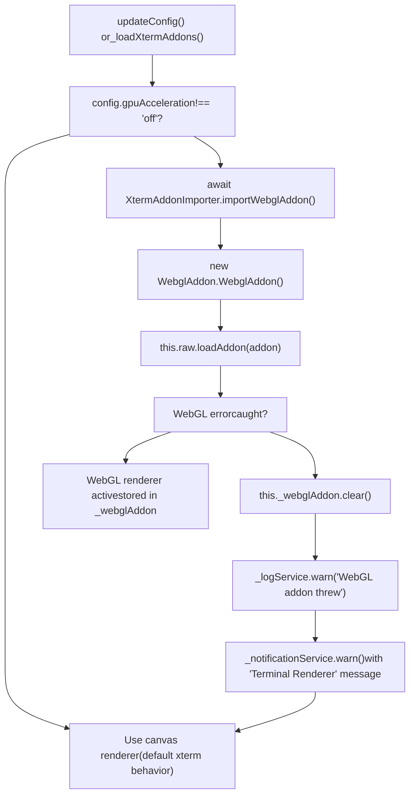
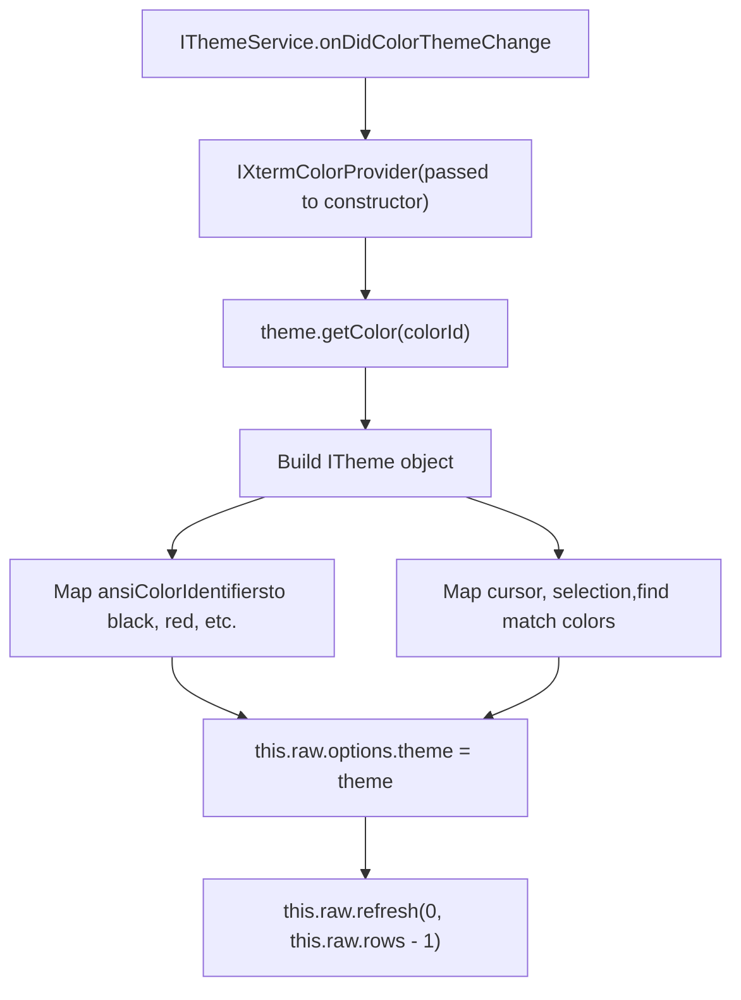
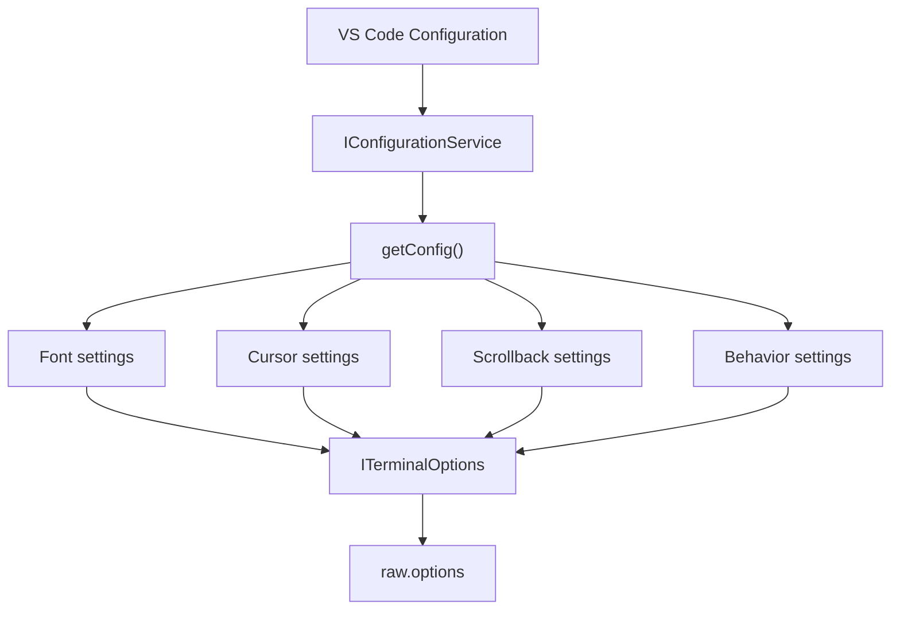
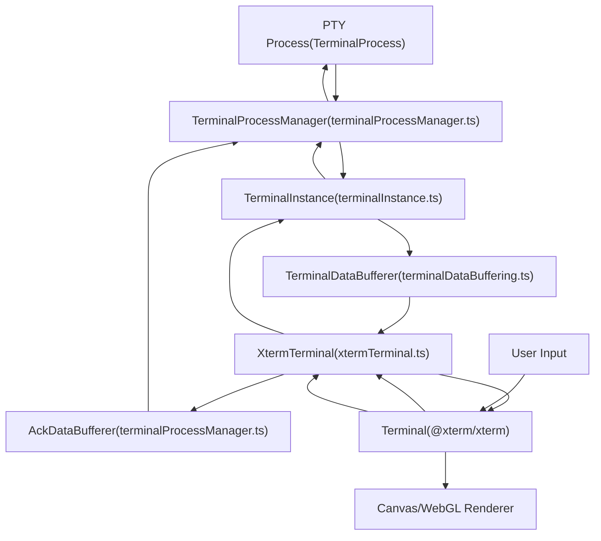
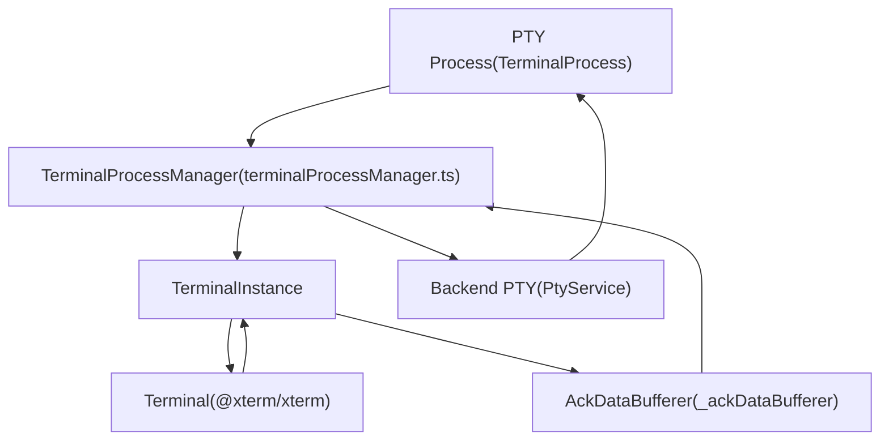
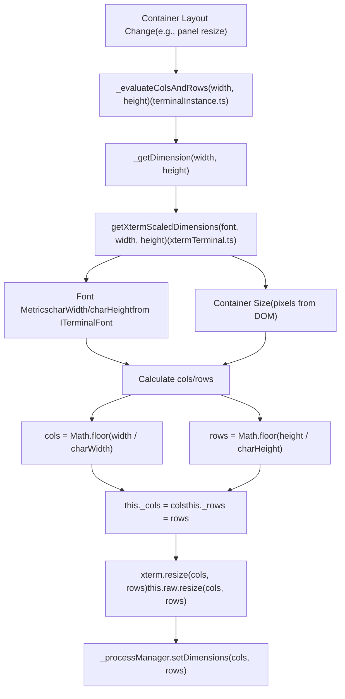

# XTerm.js Integration and Rendering

Relevant source files

-   [src/vs/platform/terminal/common/terminal.ts](https://github.com/microsoft/vscode/blob/1be3088d/src/vs/platform/terminal/common/terminal.ts)
-   [src/vs/platform/terminal/common/terminalEnvironment.ts](https://github.com/microsoft/vscode/blob/1be3088d/src/vs/platform/terminal/common/terminalEnvironment.ts)
-   [src/vs/platform/terminal/common/terminalRecorder.ts](https://github.com/microsoft/vscode/blob/1be3088d/src/vs/platform/terminal/common/terminalRecorder.ts)
-   [src/vs/platform/terminal/node/ptyHostMain.ts](https://github.com/microsoft/vscode/blob/1be3088d/src/vs/platform/terminal/node/ptyHostMain.ts)
-   [src/vs/platform/terminal/node/ptyHostService.ts](https://github.com/microsoft/vscode/blob/1be3088d/src/vs/platform/terminal/node/ptyHostService.ts)
-   [src/vs/platform/terminal/node/ptyService.ts](https://github.com/microsoft/vscode/blob/1be3088d/src/vs/platform/terminal/node/ptyService.ts)
-   [src/vs/platform/terminal/node/terminalProcess.ts](https://github.com/microsoft/vscode/blob/1be3088d/src/vs/platform/terminal/node/terminalProcess.ts)
-   [src/vs/platform/terminal/test/common/terminalEnvironment.test.ts](https://github.com/microsoft/vscode/blob/1be3088d/src/vs/platform/terminal/test/common/terminalEnvironment.test.ts)
-   [src/vs/platform/terminal/test/common/terminalProfiles.test.ts](https://github.com/microsoft/vscode/blob/1be3088d/src/vs/platform/terminal/test/common/terminalProfiles.test.ts)
-   [src/vs/platform/terminal/test/common/terminalRecorder.test.ts](https://github.com/microsoft/vscode/blob/1be3088d/src/vs/platform/terminal/test/common/terminalRecorder.test.ts)
-   [src/vs/workbench/api/browser/mainThreadTerminalService.ts](https://github.com/microsoft/vscode/blob/1be3088d/src/vs/workbench/api/browser/mainThreadTerminalService.ts)
-   [src/vs/workbench/api/common/extHostTerminalService.ts](https://github.com/microsoft/vscode/blob/1be3088d/src/vs/workbench/api/common/extHostTerminalService.ts)
-   [src/vs/workbench/api/node/extHostTerminalService.ts](https://github.com/microsoft/vscode/blob/1be3088d/src/vs/workbench/api/node/extHostTerminalService.ts)
-   [src/vs/workbench/contrib/terminal/browser/media/terminal.css](https://github.com/microsoft/vscode/blob/1be3088d/src/vs/workbench/contrib/terminal/browser/media/terminal.css)
-   [src/vs/workbench/contrib/terminal/browser/media/xterm.css](https://github.com/microsoft/vscode/blob/1be3088d/src/vs/workbench/contrib/terminal/browser/media/xterm.css)
-   [src/vs/workbench/contrib/terminal/browser/remotePty.ts](https://github.com/microsoft/vscode/blob/1be3088d/src/vs/workbench/contrib/terminal/browser/remotePty.ts)
-   [src/vs/workbench/contrib/terminal/browser/terminal.contribution.ts](https://github.com/microsoft/vscode/blob/1be3088d/src/vs/workbench/contrib/terminal/browser/terminal.contribution.ts)
-   [src/vs/workbench/contrib/terminal/browser/terminal.ts](https://github.com/microsoft/vscode/blob/1be3088d/src/vs/workbench/contrib/terminal/browser/terminal.ts)
-   [src/vs/workbench/contrib/terminal/browser/terminalActions.ts](https://github.com/microsoft/vscode/blob/1be3088d/src/vs/workbench/contrib/terminal/browser/terminalActions.ts)
-   [src/vs/workbench/contrib/terminal/browser/terminalEditor.ts](https://github.com/microsoft/vscode/blob/1be3088d/src/vs/workbench/contrib/terminal/browser/terminalEditor.ts)
-   [src/vs/workbench/contrib/terminal/browser/terminalEditorInput.ts](https://github.com/microsoft/vscode/blob/1be3088d/src/vs/workbench/contrib/terminal/browser/terminalEditorInput.ts)
-   [src/vs/workbench/contrib/terminal/browser/terminalEditorService.ts](https://github.com/microsoft/vscode/blob/1be3088d/src/vs/workbench/contrib/terminal/browser/terminalEditorService.ts)
-   [src/vs/workbench/contrib/terminal/browser/terminalGroup.ts](https://github.com/microsoft/vscode/blob/1be3088d/src/vs/workbench/contrib/terminal/browser/terminalGroup.ts)
-   [src/vs/workbench/contrib/terminal/browser/terminalGroupService.ts](https://github.com/microsoft/vscode/blob/1be3088d/src/vs/workbench/contrib/terminal/browser/terminalGroupService.ts)
-   [src/vs/workbench/contrib/terminal/browser/terminalInstance.ts](https://github.com/microsoft/vscode/blob/1be3088d/src/vs/workbench/contrib/terminal/browser/terminalInstance.ts)
-   [src/vs/workbench/contrib/terminal/browser/terminalInstanceService.ts](https://github.com/microsoft/vscode/blob/1be3088d/src/vs/workbench/contrib/terminal/browser/terminalInstanceService.ts)
-   [src/vs/workbench/contrib/terminal/browser/terminalMenus.ts](https://github.com/microsoft/vscode/blob/1be3088d/src/vs/workbench/contrib/terminal/browser/terminalMenus.ts)
-   [src/vs/workbench/contrib/terminal/browser/terminalProcessExtHostProxy.ts](https://github.com/microsoft/vscode/blob/1be3088d/src/vs/workbench/contrib/terminal/browser/terminalProcessExtHostProxy.ts)
-   [src/vs/workbench/contrib/terminal/browser/terminalProcessManager.ts](https://github.com/microsoft/vscode/blob/1be3088d/src/vs/workbench/contrib/terminal/browser/terminalProcessManager.ts)
-   [src/vs/workbench/contrib/terminal/browser/terminalService.ts](https://github.com/microsoft/vscode/blob/1be3088d/src/vs/workbench/contrib/terminal/browser/terminalService.ts)
-   [src/vs/workbench/contrib/terminal/browser/terminalStatusList.ts](https://github.com/microsoft/vscode/blob/1be3088d/src/vs/workbench/contrib/terminal/browser/terminalStatusList.ts)
-   [src/vs/workbench/contrib/terminal/browser/terminalTabbedView.ts](https://github.com/microsoft/vscode/blob/1be3088d/src/vs/workbench/contrib/terminal/browser/terminalTabbedView.ts)
-   [src/vs/workbench/contrib/terminal/browser/terminalTabsList.ts](https://github.com/microsoft/vscode/blob/1be3088d/src/vs/workbench/contrib/terminal/browser/terminalTabsList.ts)
-   [src/vs/workbench/contrib/terminal/browser/terminalView.ts](https://github.com/microsoft/vscode/blob/1be3088d/src/vs/workbench/contrib/terminal/browser/terminalView.ts)
-   [src/vs/workbench/contrib/terminal/browser/xterm/xtermTerminal.ts](https://github.com/microsoft/vscode/blob/1be3088d/src/vs/workbench/contrib/terminal/browser/xterm/xtermTerminal.ts)
-   [src/vs/workbench/contrib/terminal/common/terminal.ts](https://github.com/microsoft/vscode/blob/1be3088d/src/vs/workbench/contrib/terminal/common/terminal.ts)
-   [src/vs/workbench/contrib/terminal/common/terminalColorRegistry.ts](https://github.com/microsoft/vscode/blob/1be3088d/src/vs/workbench/contrib/terminal/common/terminalColorRegistry.ts)
-   [src/vs/workbench/contrib/terminal/common/terminalConfiguration.ts](https://github.com/microsoft/vscode/blob/1be3088d/src/vs/workbench/contrib/terminal/common/terminalConfiguration.ts)
-   [src/vs/workbench/contrib/terminal/common/terminalEnvironment.ts](https://github.com/microsoft/vscode/blob/1be3088d/src/vs/workbench/contrib/terminal/common/terminalEnvironment.ts)
-   [src/vs/workbench/contrib/terminal/common/terminalStrings.ts](https://github.com/microsoft/vscode/blob/1be3088d/src/vs/workbench/contrib/terminal/common/terminalStrings.ts)
-   [src/vs/workbench/contrib/terminal/test/browser/terminalStatusList.test.ts](https://github.com/microsoft/vscode/blob/1be3088d/src/vs/workbench/contrib/terminal/test/browser/terminalStatusList.test.ts)
-   [src/vs/workbench/contrib/terminal/test/common/terminalEnvironment.test.ts](https://github.com/microsoft/vscode/blob/1be3088d/src/vs/workbench/contrib/terminal/test/common/terminalEnvironment.test.ts)

This document describes how VS Code integrates the xterm.js library to provide terminal rendering capabilities. It covers the `XtermTerminal` wrapper class, the addon loading system, rendering modes, theme management, and the data flow between the terminal process and the xterm.js renderer.

For information about terminal process management and PTY communication, see [Terminal Instance and Process Management](/microsoft/vscode/8.2-chat-agents-and-participants). For shell integration features built on top of xterm.js, see [Shell Integration and Capabilities](/microsoft/vscode/8.6-chat-extension-api).

## Architecture Overview

VS Code wraps xterm.js in the `XtermTerminal` class (implementing `IXtermTerminal` and `IInternalXtermTerminal`), which acts as an adapter between xterm.js's API and VS Code's terminal infrastructure. This wrapper handles addon management, theme synchronization, configuration mapping, and lifecycle coordination.

**XtermTerminal Class Integration**

```mermaid
flowchart TD
    TerminalInstance["TerminalInstance(terminalInstance.ts)"]
    XtermTerminal["XtermTerminal(xtermTerminal.ts)"]
    RawXterm["Terminal(@xterm/xterm)"]
    MarkNavigationAddon["MarkNavigationAddon(markNavigationAddon.ts)"]
    ShellIntegrationAddon["ShellIntegrationAddon(shellIntegrationAddon.ts)"]
    DecorationAddon["DecorationAddon(decorationAddon.ts)"]
    SearchAddon["SearchAddon(@xterm/addon-search)"]
    WebglAddon["WebglAddon(@xterm/addon-webgl)"]
    Unicode11Addon["Unicode11Addon(@xterm/addon-unicode11)"]
    SerializeAddon["SerializeAddon(@xterm/addon-serialize)"]
    ImageAddon["ImageAddon(@xterm/addon-image)"]
    ClipboardAddon["ClipboardAddon(@xterm/addon-clipboard)"]
    LigaturesAddon["LigaturesAddon(@xterm/addon-ligatures)"]
    ColorProvider["IXtermColorProvider"]
    CapabilityStore["ITerminalCapabilityStore"]
    ConfigService["ITerminalConfigurationService"]

    TerminalInstance --> XtermTerminal
    XtermTerminal --> RawXterm
    XtermTerminal --> MarkNavigationAddon
    XtermTerminal --> ShellIntegrationAddon
    XtermTerminal --> DecorationAddon
    XtermTerminal --> SearchAddon
    XtermTerminal --> WebglAddon
    XtermTerminal --> Unicode11Addon
    XtermTerminal --> SerializeAddon
    XtermTerminal --> ImageAddon
    XtermTerminal --> ClipboardAddon
    XtermTerminal --> LigaturesAddon
    XtermTerminal --> ColorProvider
    XtermTerminal --> CapabilityStore
    ShellIntegrationAddon --> CapabilityStore
```


**Sources:** [src/vs/workbench/contrib/terminal/browser/xterm/xtermTerminal.ts1-1200](https://github.com/microsoft/vscode/blob/1be3088d/src/vs/workbench/contrib/terminal/browser/xterm/xtermTerminal.ts#L1-L1200) [src/vs/workbench/contrib/terminal/browser/terminalInstance.ts520-570](https://github.com/microsoft/vscode/blob/1be3088d/src/vs/workbench/contrib/terminal/browser/terminalInstance.ts#L520-L570) [src/vs/workbench/contrib/terminal/browser/terminal.ts40-60](https://github.com/microsoft/vscode/blob/1be3088d/src/vs/workbench/contrib/terminal/browser/terminal.ts#L40-L60)

## XTerm.js Dependencies

VS Code uses xterm.js along with multiple official addons. These packages are declared in the project's package manifests and loaded dynamically via `importAMDNodeModule()`.

| Package | Purpose | Load Strategy |
| --- | --- | --- |
| `@xterm/xterm` | Core terminal emulator | Direct import |
| `@xterm/addon-search` | Find functionality | Lazy load on attach |
| `@xterm/addon-unicode11` | Unicode 11 support | Lazy load if configured |
| `@xterm/addon-webgl` | GPU-accelerated rendering | Lazy load if enabled |
| `@xterm/addon-serialize` | Serialize terminal state | Lazy load on attach |
| `@xterm/addon-image` | Inline image support | Lazy load if enabled |
| `@xterm/addon-clipboard` | Enhanced clipboard operations | Lazy load on attach |
| `@xterm/addon-ligatures` | Font ligature rendering | Lazy load if enabled |
| `@xterm/addon-progress` | Progress indicator support | Used via Terminal interface |
| `@xterm/headless` | Headless terminal for backend use | Used in pty service |

**Sources:** [src/vs/workbench/contrib/terminal/browser/xterm/xtermTerminal.ts1-50](https://github.com/microsoft/vscode/blob/1be3088d/src/vs/workbench/contrib/terminal/browser/xterm/xtermTerminal.ts#L1-L50) [src/vs/workbench/contrib/terminal/browser/xterm/xtermAddonImporter.ts1-20](https://github.com/microsoft/vscode/blob/1be3088d/src/vs/workbench/contrib/terminal/browser/xterm/xtermAddonImporter.ts#L1-L20)

## XtermTerminal Wrapper Class

The `XtermTerminal` class in `xtermTerminal.ts` is the primary integration point between VS Code and xterm.js. It implements the `IXtermTerminal` interface and manages a `RawXtermTerminal` instance.

### Class Structure

**XtermTerminal Class Hierarchy**

```mermaid
flowchart TD
    IXtermTerminal["IXtermTerminal(terminal.ts)"]
    IInternalXtermTerminal["IInternalXtermTerminal(terminal.ts)"]
    XtermTerminal["XtermTerminal(xtermTerminal.ts)"]
    Disposable["Disposable"]
    raw["raw: RawXtermTerminal"]
    shellIntegration["shellIntegration:ShellIntegrationAddon"]
    markTracker["markTracker:IMarkTracker"]
    decorationAddon["decorationAddon:IDecorationAddon"]
    findAddon["_searchAddon:MutableDisposable"]
    webglAddon["_webglAddon:MutableDisposable"]
    screenElement["_screenElement:HTMLElement"]
    attachToElement["attachToElement(container, options)"]
    write["write(data, isBinaryData, callback)"]
    resize["resize(cols, rows)"]
    updateConfig["updateConfig()"]
    forceRedraw["forceRedraw()"]
    clearBuffer["clearBuffer()"]
    getXtermTheme["getXtermTheme(theme)"]

    XtermTerminal --> IXtermTerminal
    XtermTerminal --> IInternalXtermTerminal
    XtermTerminal --> Disposable
    XtermTerminal --> raw
    XtermTerminal --> shellIntegration
    XtermTerminal --> markTracker
    XtermTerminal --> decorationAddon
    XtermTerminal --> attachToElement
    XtermTerminal --> write
    XtermTerminal --> resize
    XtermTerminal --> updateConfig
```


### Initialization Flow

The `XtermTerminal` constructor creates the raw xterm.js `Terminal` instance with options derived from VS Code configuration:

1.  **Create Terminal Instance**: Instantiates `Terminal` from `@xterm/xterm` with converted options via `getConfig()`
2.  **Register Core Addons**: Loads `MarkNavigationAddon`, `ShellIntegrationAddon`, `DecorationAddon` immediately
3.  **Setup Event Handlers**: Connects xterm.js events (`onData`, `onSelectionChange`, `onWriteParsed`, etc.) to VS Code's event system
4.  **Apply Theme**: Initializes colors from the current VS Code theme via `getXtermTheme()`

The terminal is not yet attached to the DOM at this point - that happens later via `attachToElement()`.

**Sources:** [src/vs/workbench/contrib/terminal/browser/xterm/xtermTerminal.ts150-350](https://github.com/microsoft/vscode/blob/1be3088d/src/vs/workbench/contrib/terminal/browser/xterm/xtermTerminal.ts#L150-L350) [src/vs/workbench/contrib/terminal/browser/terminal.ts21-60](https://github.com/microsoft/vscode/blob/1be3088d/src/vs/workbench/contrib/terminal/browser/terminal.ts#L21-L60)

### Key Methods

| Method | Purpose |
| --- | --- |
| `attachToElement()` | Opens the terminal in a DOM element, loads optional addons |
| `write()` | Writes data to the terminal buffer |
| `resize()` | Changes terminal dimensions (cols/rows) |
| `refresh()` | Forces a screen redraw |
| `clearBuffer()` | Clears scrollback and screen |
| `updateConfig()` | Applies configuration changes from VS Code settings |
| `getXtermTheme()` | Converts VS Code theme to xterm.js theme object |

**Sources:** [src/vs/workbench/contrib/terminal/browser/xterm/xtermTerminal.ts400-1000](https://github.com/microsoft/vscode/blob/1be3088d/src/vs/workbench/contrib/terminal/browser/xterm/xtermTerminal.ts#L400-L1000)

## Addon Loading System

Addons extend xterm.js functionality. The `XtermTerminal` class manages two categories of addons:

### Always-Loaded Addons

These addons are loaded immediately during construction:

-   **MarkNavigationAddon**: Provides mark-based navigation for shell integration [src/vs/workbench/contrib/terminal/browser/xterm/markNavigationAddon.ts](https://github.com/microsoft/vscode/blob/1be3088d/src/vs/workbench/contrib/terminal/browser/xterm/markNavigationAddon.ts)
-   **ShellIntegrationAddon**: Implements shell integration protocol [src/vs/platform/terminal/common/xterm/shellIntegrationAddon.ts](https://github.com/microsoft/vscode/blob/1be3088d/src/vs/platform/terminal/common/xterm/shellIntegrationAddon.ts)
-   **DecorationAddon**: Renders command decorations in the gutter [src/vs/workbench/contrib/terminal/browser/xterm/decorationAddon.ts](https://github.com/microsoft/vscode/blob/1be3088d/src/vs/workbench/contrib/terminal/browser/xterm/decorationAddon.ts)

### Lazily-Loaded Addons

**Addon Loading Decision Tree**

These addons are loaded on-demand when the terminal is attached to the DOM or when needed:

```mermaid
flowchart TD
    attachToElement["attachToElement(container, options)"]
    gpuAccel["config.gpuAcceleration!== 'off'?"]
    webglAddon["await XtermAddonImporter.importWebglAddon()this.raw.loadAddon(addon)"]
    unicode11["config.unicodeVersion=== '11'?"]
    unicode11Addon["await XtermAddonImporter.importUnicode11Addon()addon.activate(this.raw)"]
    images["config.enableImages?"]
    imageAddon["await XtermAddonImporter.importImageAddon()this.raw.loadAddon(addon)"]
    ligatures["fontLigatures.enabled?"]
    ligaturesAddon["await XtermAddonImporter.importLigaturesAddon()this.raw.loadAddon(addon)"]
    searchAddon["await XtermAddonImporter.importSearchAddon()store in _searchAddon"]
    serializeAddon["await XtermAddonImporter.importSerializeAddon()store in _serializeAddon"]
    clipboardAddon["await XtermAddonImporter.importClipboardAddon()this.raw.loadAddon(addon)"]

    attachToElement --> searchAddon
    attachToElement --> serializeAddon
    attachToElement --> clipboardAddon
    attachToElement --> gpuAccel
    gpuAccel --> webglAddon
    attachToElement --> unicode11
    unicode11 --> unicode11Addon
    attachToElement --> images
    images --> imageAddon
    attachToElement --> ligatures
    ligatures --> ligaturesAddon
```


Addon loading uses dynamic imports via `XtermAddonImporter` class methods which wrap `importAMDNodeModule()` to avoid bundling all addons upfront:

```
// Example from XtermAddonImporter
static async importSearchAddon(): Promise<typeof SearchAddonType> {
    return (await importAMDNodeModule<typeof import('@xterm/addon-search')>(
        '@xterm/addon-search', 'lib/addon-search.js'
    ));
}
```
**Sources:** [src/vs/workbench/contrib/terminal/browser/xterm/xtermTerminal.ts400-700](https://github.com/microsoft/vscode/blob/1be3088d/src/vs/workbench/contrib/terminal/browser/xterm/xtermTerminal.ts#L400-L700) [src/vs/workbench/contrib/terminal/browser/xterm/xtermAddonImporter.ts1-100](https://github.com/microsoft/vscode/blob/1be3088d/src/vs/workbench/contrib/terminal/browser/xterm/xtermAddonImporter.ts#L1-L100)

## Rendering Modes and GPU Acceleration

XTerm.js supports three rendering modes controlled by the `terminal.integrated.gpuAcceleration` setting:

| Setting Value | Renderer | Description |
| --- | --- | --- |
| `'off'` | Canvas | 2D canvas rendering (fallback) |
| `'on'` | WebGL | GPU-accelerated rendering via `WebglAddon` |
| `'auto'` | Automatic | Tries WebGL, falls back to canvas on failure |

### GPU Acceleration Flow

**WebGL Addon Loading and Activation**


The WebGL renderer provides better performance for large terminals but may fail on systems with incompatible GPU drivers. When WebGL activation fails, xterm.js automatically falls back to the canvas renderer. The `_webglAddon` is stored in a `MutableDisposable` to allow cleanup when GPU acceleration is toggled.

**Sources:** [src/vs/workbench/contrib/terminal/browser/xterm/xtermTerminal.ts400-700](https://github.com/microsoft/vscode/blob/1be3088d/src/vs/workbench/contrib/terminal/browser/xterm/xtermTerminal.ts#L400-L700) [src/vs/workbench/contrib/terminal/browser/xterm/xtermTerminal.ts900-1100](https://github.com/microsoft/vscode/blob/1be3088d/src/vs/workbench/contrib/terminal/browser/xterm/xtermTerminal.ts#L900-L1100)

## Theme and Color Management

`XtermTerminal` synchronizes VS Code's theme with xterm.js through the `IXtermColorProvider` interface. The `getXtermTheme()` method constructs an xterm.js `ITheme` object from VS Code's color registry.

### Theme Conversion Process

**Theme Application Flow**


### Color Categories

The theme includes several color categories mapped from VS Code's terminal color registry defined in `terminalColorRegistry.ts`:

| Category | VS Code Color ID Constant | XTerm `ITheme` Property |
| --- | --- | --- |
| Foreground | `TERMINAL_FOREGROUND_COLOR` | `foreground` |
| Background | `TERMINAL_BACKGROUND_COLOR` | `background` |
| Cursor | `TERMINAL_CURSOR_FOREGROUND_COLOR` | `cursor` |
| Cursor Accent | `TERMINAL_CURSOR_BACKGROUND_COLOR` | `cursorAccent` |
| Selection Background | `TERMINAL_SELECTION_BACKGROUND_COLOR` | `selectionBackground` |
| Selection Foreground | `TERMINAL_SELECTION_FOREGROUND_COLOR` | `selectionForeground` |
| Inactive Selection | `TERMINAL_INACTIVE_SELECTION_BACKGROUND_COLOR` | `selectionInactiveBackground` |
| Find Match | `TERMINAL_FIND_MATCH_BACKGROUND_COLOR` | `findMatchBackground` |
| Find Match Highlight | `TERMINAL_FIND_MATCH_HIGHLIGHT_BACKGROUND_COLOR` | `findMatchHighlightBackground` |
| Overview Ruler Border | `TERMINAL_OVERVIEW_RULER_BORDER_COLOR` | `overviewRulerBorder` |
| ANSI Colors (0-15) | `ansiColorIdentifiers[i]` | `black`, `red`, `green`, `yellow`, `blue`, `magenta`, `cyan`, `white`, `brightBlack`, etc. |

**Sources:** [src/vs/workbench/contrib/terminal/browser/xterm/xtermTerminal.ts1000-1200](https://github.com/microsoft/vscode/blob/1be3088d/src/vs/workbench/contrib/terminal/browser/xterm/xtermTerminal.ts#L1000-L1200) [src/vs/workbench/contrib/terminal/common/terminalColorRegistry.ts1-200](https://github.com/microsoft/vscode/blob/1be3088d/src/vs/workbench/contrib/terminal/common/terminalColorRegistry.ts#L1-L200)

## Terminal Lifecycle and DOM Attachment

The lifecycle of an xterm.js terminal in VS Code follows a specific sequence coordinated between `TerminalInstance` and `XtermTerminal`.

### Creation and Attachment Flow

> **[Mermaid sequence]**
> *(图表结构无法解析)*

### Key Lifecycle Events

The `XtermTerminal` class exposes events that `TerminalInstance` listens to:

| Event | Purpose | Fired When |
| --- | --- | --- |
| `onDidChangeFindResults` | Find results changed | Search addon finds/updates matches |
| `onDidChangeSelection` | Selection changed | User selects text |
| `onDidRequestRunCommand` | Command execution requested | User triggers command from menu |
| `onDidRequestFocus` | Focus requested | Terminal requests focus programmatically |

**Sources:** [src/vs/workbench/contrib/terminal/browser/xterm/xtermTerminal.ts150-400](https://github.com/microsoft/vscode/blob/1be3088d/src/vs/workbench/contrib/terminal/browser/xterm/xtermTerminal.ts#L150-L400) [src/vs/workbench/contrib/terminal/browser/terminalInstance.ts520-580](https://github.com/microsoft/vscode/blob/1be3088d/src/vs/workbench/contrib/terminal/browser/terminalInstance.ts#L520-L580)

## Configuration Mapping

The `XtermTerminal` class maps VS Code terminal settings to xterm.js options through the `_configHelper` utility.

### Option Conversion


### Key Settings Mapped

| VS Code Setting | XTerm Option | Notes |
| --- | --- | --- |
| `terminal.integrated.fontSize` | `fontSize` | Default: 14 (Windows/Linux), 12 (macOS) |
| `terminal.integrated.fontFamily` | `fontFamily` | Falls back to editor font family |
| `terminal.integrated.lineHeight` | `lineHeight` | Default: 1 (1.1 on Linux) |
| `terminal.integrated.letterSpacing` | `letterSpacing` | Default: 0 |
| `terminal.integrated.fontWeight` | `fontWeight` | Normal or numeric 1-1000 |
| `terminal.integrated.cursorStyle` | `cursorStyle` | block, underline, line |
| `terminal.integrated.cursorBlinking` | `cursorBlink` | Boolean |
| `terminal.integrated.scrollback` | `scrollback` | Default: 1000 lines |
| `terminal.integrated.fastScrollSensitivity` | `fastScrollSensitivity` | Scroll multiplier |
| `terminal.integrated.tabStopWidth` | `tabStopWidth` | Default: 8 |

The `updateConfig()` method is called whenever relevant configuration changes are detected, applying updates to the live xterm.js instance.

**Sources:** [src/vs/workbench/contrib/terminal/browser/xterm/xtermTerminal.ts900-1100](https://github.com/microsoft/vscode/blob/1be3088d/src/vs/workbench/contrib/terminal/browser/xterm/xtermTerminal.ts#L900-L1100) [src/vs/workbench/contrib/terminal/common/terminalConfiguration.ts40-220](https://github.com/microsoft/vscode/blob/1be3088d/src/vs/workbench/contrib/terminal/common/terminalConfiguration.ts#L40-L220)

## Data Flow Between Process and XTerm

Terminal data flows bidirectionally between the PTY process and xterm.js, with `TerminalInstance` coordinating the flow through `XtermTerminal`. The system implements flow control mechanisms to prevent overwhelming the renderer with data.

### Bidirectional Data Flow

**Data Flow Architecture with Code Symbols**


### Output Flow (Process → XTerm)

The output path from shell to renderer involves several stages coordinated by `TerminalInstance`:

1.  **Process Data Event**: `TerminalProcessManager._onProcessData.fire({ data, trackCommit })` emits when PTY sends output
2.  **Initial Buffering**: Data passes through `_initialDataEventsListener` and stored in `_initialDataEvents` array if terminal not ready
3.  **Data Buffering**: `TerminalDataBufferer` accumulates writes in `_bufferedData` to reduce xterm.js calls
4.  **XTerm Write**: `TerminalInstance` calls `xterm.write(data)` which delegates to `this.raw.write(data, callback)`
5.  **XTerm Processing**: xterm.js parses ANSI escape sequences, updates internal buffer (`IBufferSet`)
6.  **Rendering**: Canvas or WebGL renderer draws updated cells to screen via `IRenderer.renderRows()`
7.  **Acknowledgment**: `raw.onWriteParsed` event triggers flow control acknowledgment via `_ackDataBufferer.ack(charCount)`

The `TerminalDataBufferer` uses a timer-based approach to batch writes:

-   Buffers data for up to `WRITE_INTERVAL_MS` (5ms)
-   Flushes immediately if buffer exceeds `WRITE_MAX_BATCH_SIZE` (50 items)
-   Prevents excessive write calls to xterm.js via `_flushData()` method

### Input Flow (User → Process)

User input follows a simpler path through the xterm.js event system:

1.  **User Input**: User types or pastes in terminal (captured by xterm.js)
2.  **XTerm onData**: `raw.onData` event fires with input string
3.  **Pre-Processing**: `_onWillData.fire()` event allows filtering (e.g., shell integration can intercept)
4.  **Instance Handling**: `TerminalInstance._handleOnData(data)` receives input and calls `_processManager.write(data)`
5.  **Process Write**: `TerminalProcessManager.write(data)` queues data or writes directly
6.  **PTY Input**: Data written to PTY stdin via `_process.input(data)` which goes to the shell process

**Sources:** [src/vs/workbench/contrib/terminal/browser/terminalInstance.ts654-657](https://github.com/microsoft/vscode/blob/1be3088d/src/vs/workbench/contrib/terminal/browser/terminalInstance.ts#L654-L657) [src/vs/workbench/contrib/terminal/browser/terminalInstance.ts1135-1160](https://github.com/microsoft/vscode/blob/1be3088d/src/vs/workbench/contrib/terminal/browser/terminalInstance.ts#L1135-L1160) [src/vs/platform/terminal/common/terminalDataBuffering.ts10-80](https://github.com/microsoft/vscode/blob/1be3088d/src/vs/platform/terminal/common/terminalDataBuffering.ts#L10-L80) [src/vs/workbench/contrib/terminal/browser/terminalProcessManager.ts93-200](https://github.com/microsoft/vscode/blob/1be3088d/src/vs/workbench/contrib/terminal/browser/terminalProcessManager.ts#L93-L200)

## Flow Control and Backpressure

VS Code implements flow control to prevent the PTY process from overwhelming xterm.js with data faster than it can render. This is critical for handling high-throughput scenarios like `cat`\-ing large files.

### Flow Control Architecture

**Flow Control with Code Symbols**


### AckDataBufferer Implementation

The `AckDataBufferer` class (defined in `terminalProcessManager.ts`) batches acknowledgment messages to reduce IPC overhead:

```
// From terminalProcessManager.ts constructor
this._ackDataBufferer = new AckDataBufferer(e => this._process?.acknowledgeDataEvent(e));
```
The `AckDataBufferer` is instantiated in the `TerminalProcessManager` constructor and configured with a callback that invokes `acknowledgeDataEvent()` on the process. Key characteristics:

-   **Batching Window**: Accumulates acks for `BATCH_WINDOW_MS` (40ms) via internal timer
-   **Batch Threshold**: Flushes immediately via `_flush()` if batch reaches `MAX_BATCH_SIZE` (100 acks)
-   **Character Counting**: Tracks total characters acknowledged via `_totalCharCount`, not individual events
-   **Method**: `ack(charCount: number)` called from xterm's `onWriteParsed` handler

### Flow Control Constants

Flow control behavior is governed by constants in `FlowControlConstants` enum defined in `terminal.ts`:

| Constant | Value | Purpose |
| --- | --- | --- |
| `RESUMPTION_THRESHOLD` | 5 | Resume writes when unacked bytes drop below this threshold |
| `HIGH_WATERMARK` | 10 | Pause writes when unacked bytes exceed this threshold |
| `INTERVAL` | 40ms | How often to check flow control state in backend |

These constants create a hysteresis mechanism that prevents rapid pause/resume cycling in the backend PTY service.

### Backpressure Propagation

When the renderer falls behind:

1.  **Detection**: xterm.js reports parsed character counts via `onWriteParsed`
2.  **Throttling**: If unacked data exceeds `HIGH_WATERMARK`, backend pauses PTY reads
3.  **Resumption**: When unacked data drops below `RESUMPTION_THRESHOLD`, reads resume
4.  **IPC Efficiency**: Acknowledgments are batched to minimize IPC message overhead

This prevents the PTY from buffering excessive data and ensures smooth terminal responsiveness even under heavy output load.

**Sources:** [src/vs/workbench/contrib/terminal/browser/terminalProcessManager.ts93-167](https://github.com/microsoft/vscode/blob/1be3088d/src/vs/workbench/contrib/terminal/browser/terminalProcessManager.ts#L93-L167) [src/vs/platform/terminal/common/terminal.ts700-720](https://github.com/microsoft/vscode/blob/1be3088d/src/vs/platform/terminal/common/terminal.ts#L700-L720) [src/vs/platform/terminal/common/terminalDataBuffering.ts80-150](https://github.com/microsoft/vscode/blob/1be3088d/src/vs/platform/terminal/common/terminalDataBuffering.ts#L80-L150)

## XTerm Terminal Dimensions and Resizing

Terminal dimensions are managed through a coordinate system between the terminal instance and xterm.js.

### Dimension Calculation Flow

**Resizing with Code Symbols**


The `getXtermScaledDimensions()` helper function calculates how many character cells fit in the available pixel dimensions based on font metrics from `ITerminalFont`. The result includes:

-   `cols`: Number of character columns (clamped to min 2)
-   `rows`: Number of character rows (clamped to min 2)
-   `cellWidth`: Width of each character cell in pixels
-   `cellHeight`: Height of each character cell in pixels

When dimensions change, both xterm.js (via `raw.resize()`) and the PTY process (via `_processManager.setDimensions()`) are notified to maintain synchronization.

**Sources:** [src/vs/workbench/contrib/terminal/browser/xterm/xtermTerminal.ts1200-1400](https://github.com/microsoft/vscode/blob/1be3088d/src/vs/workbench/contrib/terminal/browser/xterm/xtermTerminal.ts#L1200-L1400) [src/vs/workbench/contrib/terminal/browser/terminalInstance.ts680-800](https://github.com/microsoft/vscode/blob/1be3088d/src/vs/workbench/contrib/terminal/browser/terminalInstance.ts#L680-L800)

## Performance Considerations

The xterm.js integration includes several performance optimizations that ensure responsive terminal operation even with heavy data throughput.

### Performance Optimization Techniques

| Optimization | Implementation | Benefit | Configuration |
| --- | --- | --- | --- |
| **Data Buffering** | `TerminalDataBufferer` batches writes | Reduces xterm.js write() calls | `WRITE_INTERVAL_MS: 5ms` |
| **Ack Buffering** | `AckDataBufferer` batches flow control | Reduces IPC overhead | `BATCH_WINDOW_MS: 40ms` |
| **Lazy Addon Loading** | Dynamic imports via `importAMDNodeModule()` | Faster terminal creation | Automatic |
| **WebGL Rendering** | GPU acceleration via `WebglAddon` | Faster rendering for large terminals | `terminal.integrated.gpuAcceleration` |
| **Flow Control** | High/low watermark throttling | Prevents UI blocking | `FlowControlConstants` |
| **Reflow on Idle** | `runWhenWindowIdle()` delays reflow | Smooth resizing | Automatic |
| **Scrollback Limits** | Configurable line buffer | Controls memory usage | `terminal.integrated.scrollback` |
| **Write Parsing** | xterm.js `onWriteParsed` event | Accurate flow control | Built-in |

### Critical Performance Paths

The most performance-sensitive operations are:

1.  **High-Throughput Output**: Handled by flow control preventing buffer overflow
2.  **Terminal Creation**: Optimized by lazy addon loading and dimension calculation
3.  **Resizing**: Debounced via `TerminalResizeDebouncer` to batch layout changes
4.  **Theme Changes**: Efficient color updates via `getXtermTheme()` mapping
5.  **Scrolling**: Smooth scroll enabled via `terminal.integrated.smoothScrolling`

### Memory Management

Memory usage is controlled through:

-   **Scrollback Limit**: Default 1000 lines, configurable per terminal
-   **Addon Lifecycle**: Addons disposed when terminal destroyed
-   **Buffer Clearing**: `clearBuffer()` method for explicit cleanup
-   **Detached Terminal Reuse**: Headless terminals reused for replay scenarios

**Sources:** [src/vs/platform/terminal/common/terminalDataBuffering.ts10-150](https://github.com/microsoft/vscode/blob/1be3088d/src/vs/platform/terminal/common/terminalDataBuffering.ts#L10-L150) [src/vs/workbench/contrib/terminal/browser/terminalProcessManager.ts93-167](https://github.com/microsoft/vscode/blob/1be3088d/src/vs/workbench/contrib/terminal/browser/terminalProcessManager.ts#L93-L167) [src/vs/workbench/contrib/terminal/browser/xterm/xtermTerminal.ts400-600](https://github.com/microsoft/vscode/blob/1be3088d/src/vs/workbench/contrib/terminal/browser/xterm/xtermTerminal.ts#L400-L600) [src/vs/platform/terminal/common/terminal.ts700-720](https://github.com/microsoft/vscode/blob/1be3088d/src/vs/platform/terminal/common/terminal.ts#L700-L720)

## Detached Terminal Support

VS Code supports "detached" xterm terminals that render outside of a full `TerminalInstance` context. These are used for UI components like chat tool outputs.

### Detached Terminal Creation

The `createDetachedXterm()` method creates a standalone xterm instance with minimal capabilities:

```
interface IDetachedXTermOptions {
    cols: number;
    rows: number;
    colorProvider: IXtermColorProvider;
    capabilities?: ITerminalCapabilityStore;
    readonly?: boolean;
    processInfo: ITerminalProcessInfo;
    disableOverviewRuler?: boolean;
}
```
Detached terminals:

-   Have no `TerminalInstance` wrapper
-   Support read-only mode for displaying command output
-   Can replay existing terminal state
-   Share the same theme and rendering system

**Sources:** [src/vs/workbench/contrib/terminal/browser/terminalService.ts900-1100](https://github.com/microsoft/vscode/blob/1be3088d/src/vs/workbench/contrib/terminal/browser/terminalService.ts#L900-L1100) [src/vs/workbench/contrib/terminal/browser/terminal.ts340-420](https://github.com/microsoft/vscode/blob/1be3088d/src/vs/workbench/contrib/terminal/browser/terminal.ts#L340-L420)
