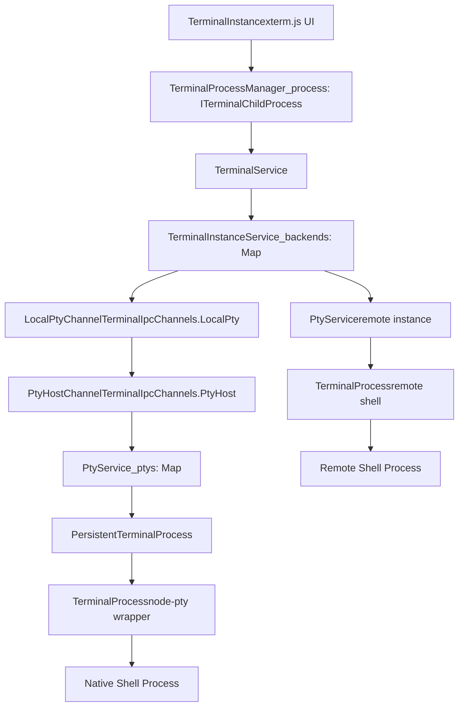
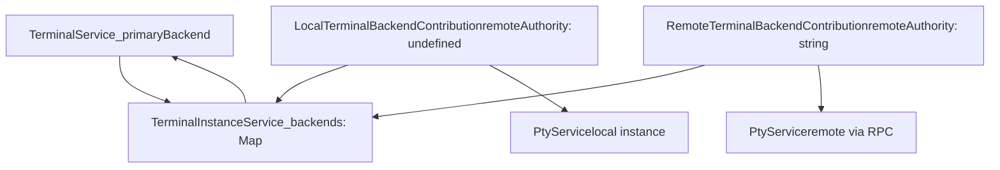
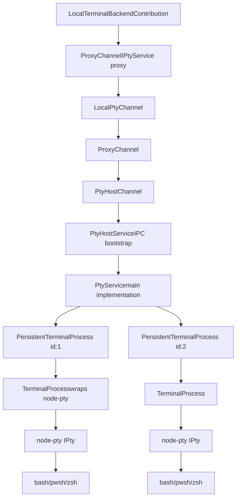
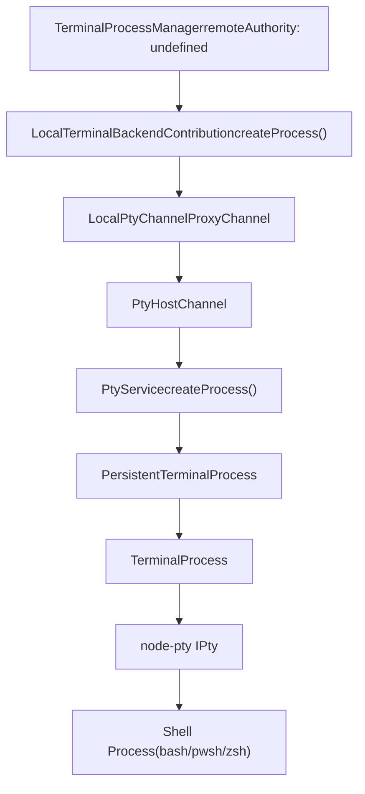
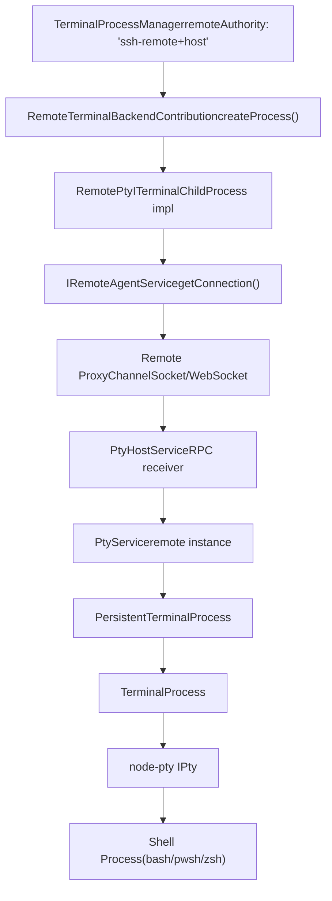
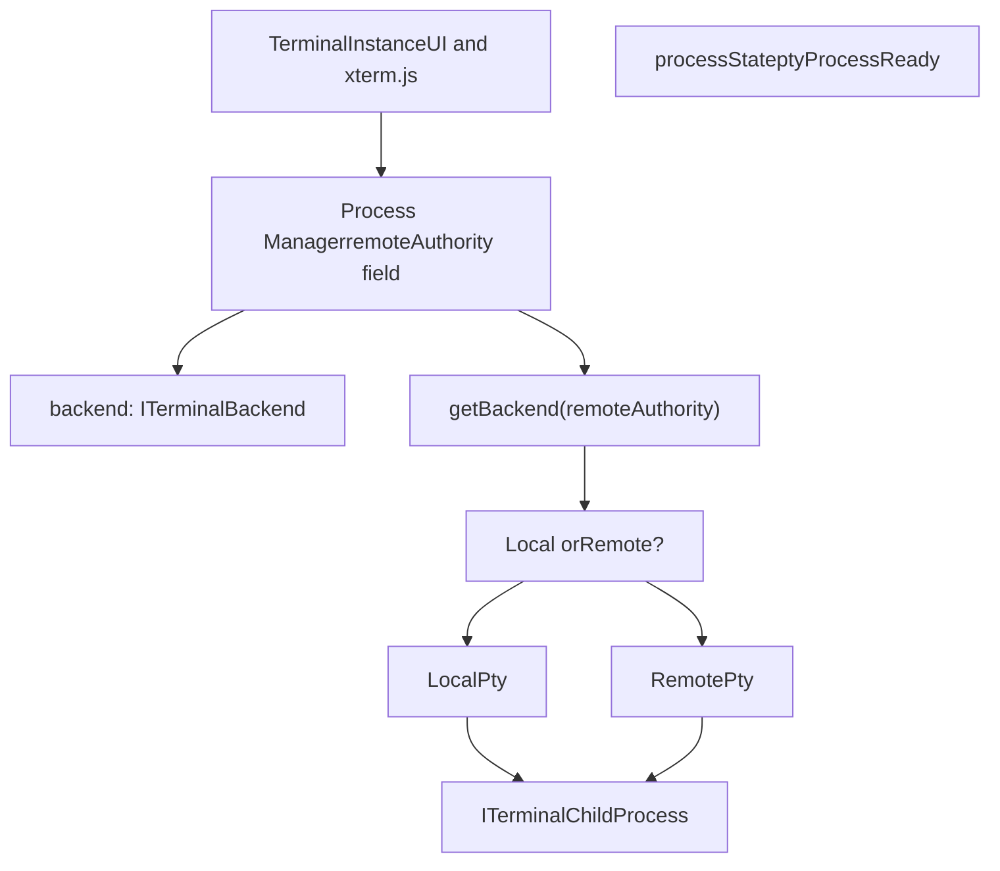
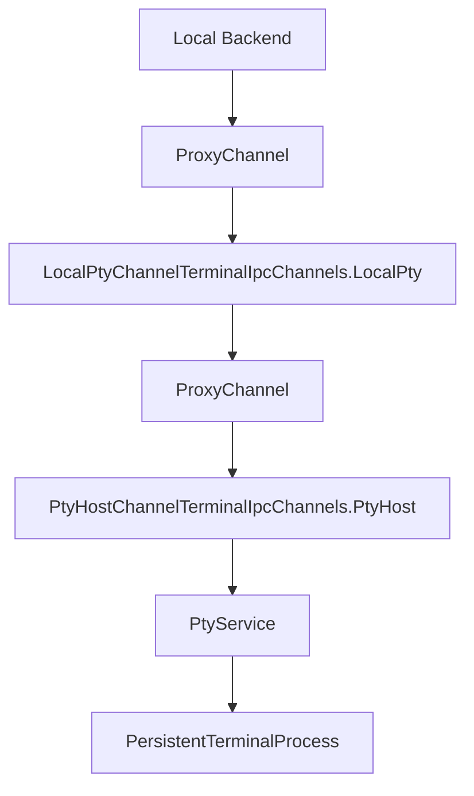
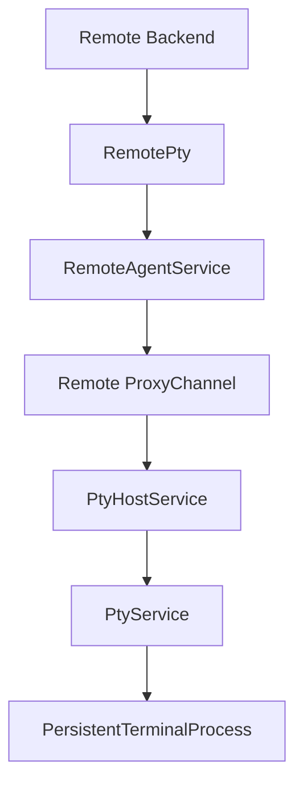
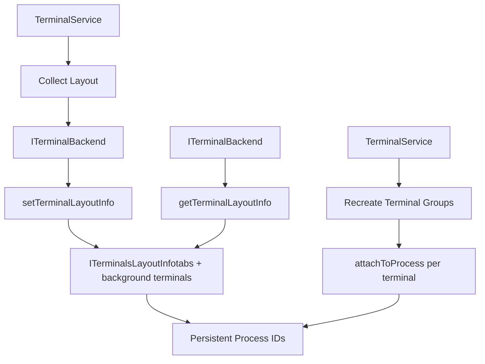

# PTY Host and Multi-Server Support

Relevant source files

-   [src/vs/platform/terminal/common/terminal.ts](https://github.com/microsoft/vscode/blob/1be3088d/src/vs/platform/terminal/common/terminal.ts)
-   [src/vs/platform/terminal/common/terminalEnvironment.ts](https://github.com/microsoft/vscode/blob/1be3088d/src/vs/platform/terminal/common/terminalEnvironment.ts)
-   [src/vs/platform/terminal/common/terminalRecorder.ts](https://github.com/microsoft/vscode/blob/1be3088d/src/vs/platform/terminal/common/terminalRecorder.ts)
-   [src/vs/platform/terminal/node/ptyHostMain.ts](https://github.com/microsoft/vscode/blob/1be3088d/src/vs/platform/terminal/node/ptyHostMain.ts)
-   [src/vs/platform/terminal/node/ptyHostService.ts](https://github.com/microsoft/vscode/blob/1be3088d/src/vs/platform/terminal/node/ptyHostService.ts)
-   [src/vs/platform/terminal/node/ptyService.ts](https://github.com/microsoft/vscode/blob/1be3088d/src/vs/platform/terminal/node/ptyService.ts)
-   [src/vs/platform/terminal/node/terminalProcess.ts](https://github.com/microsoft/vscode/blob/1be3088d/src/vs/platform/terminal/node/terminalProcess.ts)
-   [src/vs/platform/terminal/test/common/terminalEnvironment.test.ts](https://github.com/microsoft/vscode/blob/1be3088d/src/vs/platform/terminal/test/common/terminalEnvironment.test.ts)
-   [src/vs/platform/terminal/test/common/terminalProfiles.test.ts](https://github.com/microsoft/vscode/blob/1be3088d/src/vs/platform/terminal/test/common/terminalProfiles.test.ts)
-   [src/vs/platform/terminal/test/common/terminalRecorder.test.ts](https://github.com/microsoft/vscode/blob/1be3088d/src/vs/platform/terminal/test/common/terminalRecorder.test.ts)
-   [src/vs/workbench/api/browser/mainThreadTerminalService.ts](https://github.com/microsoft/vscode/blob/1be3088d/src/vs/workbench/api/browser/mainThreadTerminalService.ts)
-   [src/vs/workbench/api/common/extHostTerminalService.ts](https://github.com/microsoft/vscode/blob/1be3088d/src/vs/workbench/api/common/extHostTerminalService.ts)
-   [src/vs/workbench/api/node/extHostTerminalService.ts](https://github.com/microsoft/vscode/blob/1be3088d/src/vs/workbench/api/node/extHostTerminalService.ts)
-   [src/vs/workbench/contrib/terminal/browser/media/terminal.css](https://github.com/microsoft/vscode/blob/1be3088d/src/vs/workbench/contrib/terminal/browser/media/terminal.css)
-   [src/vs/workbench/contrib/terminal/browser/media/xterm.css](https://github.com/microsoft/vscode/blob/1be3088d/src/vs/workbench/contrib/terminal/browser/media/xterm.css)
-   [src/vs/workbench/contrib/terminal/browser/remotePty.ts](https://github.com/microsoft/vscode/blob/1be3088d/src/vs/workbench/contrib/terminal/browser/remotePty.ts)
-   [src/vs/workbench/contrib/terminal/browser/terminal.contribution.ts](https://github.com/microsoft/vscode/blob/1be3088d/src/vs/workbench/contrib/terminal/browser/terminal.contribution.ts)
-   [src/vs/workbench/contrib/terminal/browser/terminal.ts](https://github.com/microsoft/vscode/blob/1be3088d/src/vs/workbench/contrib/terminal/browser/terminal.ts)
-   [src/vs/workbench/contrib/terminal/browser/terminalActions.ts](https://github.com/microsoft/vscode/blob/1be3088d/src/vs/workbench/contrib/terminal/browser/terminalActions.ts)
-   [src/vs/workbench/contrib/terminal/browser/terminalEditor.ts](https://github.com/microsoft/vscode/blob/1be3088d/src/vs/workbench/contrib/terminal/browser/terminalEditor.ts)
-   [src/vs/workbench/contrib/terminal/browser/terminalEditorInput.ts](https://github.com/microsoft/vscode/blob/1be3088d/src/vs/workbench/contrib/terminal/browser/terminalEditorInput.ts)
-   [src/vs/workbench/contrib/terminal/browser/terminalEditorService.ts](https://github.com/microsoft/vscode/blob/1be3088d/src/vs/workbench/contrib/terminal/browser/terminalEditorService.ts)
-   [src/vs/workbench/contrib/terminal/browser/terminalGroup.ts](https://github.com/microsoft/vscode/blob/1be3088d/src/vs/workbench/contrib/terminal/browser/terminalGroup.ts)
-   [src/vs/workbench/contrib/terminal/browser/terminalGroupService.ts](https://github.com/microsoft/vscode/blob/1be3088d/src/vs/workbench/contrib/terminal/browser/terminalGroupService.ts)
-   [src/vs/workbench/contrib/terminal/browser/terminalInstance.ts](https://github.com/microsoft/vscode/blob/1be3088d/src/vs/workbench/contrib/terminal/browser/terminalInstance.ts)
-   [src/vs/workbench/contrib/terminal/browser/terminalInstanceService.ts](https://github.com/microsoft/vscode/blob/1be3088d/src/vs/workbench/contrib/terminal/browser/terminalInstanceService.ts)
-   [src/vs/workbench/contrib/terminal/browser/terminalMenus.ts](https://github.com/microsoft/vscode/blob/1be3088d/src/vs/workbench/contrib/terminal/browser/terminalMenus.ts)
-   [src/vs/workbench/contrib/terminal/browser/terminalProcessExtHostProxy.ts](https://github.com/microsoft/vscode/blob/1be3088d/src/vs/workbench/contrib/terminal/browser/terminalProcessExtHostProxy.ts)
-   [src/vs/workbench/contrib/terminal/browser/terminalProcessManager.ts](https://github.com/microsoft/vscode/blob/1be3088d/src/vs/workbench/contrib/terminal/browser/terminalProcessManager.ts)
-   [src/vs/workbench/contrib/terminal/browser/terminalService.ts](https://github.com/microsoft/vscode/blob/1be3088d/src/vs/workbench/contrib/terminal/browser/terminalService.ts)
-   [src/vs/workbench/contrib/terminal/browser/terminalStatusList.ts](https://github.com/microsoft/vscode/blob/1be3088d/src/vs/workbench/contrib/terminal/browser/terminalStatusList.ts)
-   [src/vs/workbench/contrib/terminal/browser/terminalTabbedView.ts](https://github.com/microsoft/vscode/blob/1be3088d/src/vs/workbench/contrib/terminal/browser/terminalTabbedView.ts)
-   [src/vs/workbench/contrib/terminal/browser/terminalTabsList.ts](https://github.com/microsoft/vscode/blob/1be3088d/src/vs/workbench/contrib/terminal/browser/terminalTabsList.ts)
-   [src/vs/workbench/contrib/terminal/browser/terminalView.ts](https://github.com/microsoft/vscode/blob/1be3088d/src/vs/workbench/contrib/terminal/browser/terminalView.ts)
-   [src/vs/workbench/contrib/terminal/browser/xterm/xtermTerminal.ts](https://github.com/microsoft/vscode/blob/1be3088d/src/vs/workbench/contrib/terminal/browser/xterm/xtermTerminal.ts)
-   [src/vs/workbench/contrib/terminal/common/terminal.ts](https://github.com/microsoft/vscode/blob/1be3088d/src/vs/workbench/contrib/terminal/common/terminal.ts)
-   [src/vs/workbench/contrib/terminal/common/terminalColorRegistry.ts](https://github.com/microsoft/vscode/blob/1be3088d/src/vs/workbench/contrib/terminal/common/terminalColorRegistry.ts)
-   [src/vs/workbench/contrib/terminal/common/terminalConfiguration.ts](https://github.com/microsoft/vscode/blob/1be3088d/src/vs/workbench/contrib/terminal/common/terminalConfiguration.ts)
-   [src/vs/workbench/contrib/terminal/common/terminalEnvironment.ts](https://github.com/microsoft/vscode/blob/1be3088d/src/vs/workbench/contrib/terminal/common/terminalEnvironment.ts)
-   [src/vs/workbench/contrib/terminal/common/terminalStrings.ts](https://github.com/microsoft/vscode/blob/1be3088d/src/vs/workbench/contrib/terminal/common/terminalStrings.ts)
-   [src/vs/workbench/contrib/terminal/test/browser/terminalStatusList.test.ts](https://github.com/microsoft/vscode/blob/1be3088d/src/vs/workbench/contrib/terminal/test/browser/terminalStatusList.test.ts)
-   [src/vs/workbench/contrib/terminal/test/common/terminalEnvironment.test.ts](https://github.com/microsoft/vscode/blob/1be3088d/src/vs/workbench/contrib/terminal/test/common/terminalEnvironment.test.ts)

This document describes VS Code's terminal process architecture, which consists of two key systems:

1.  **PTY Host Process Isolation**: A dedicated node process (`ptyHost`) that manages all pseudoterminal (PTY) operations in isolation from the main workbench
2.  **Multi-Server Backend System**: Support for terminals across different execution environments (local, remote, web)

These systems work together to provide reliable terminal functionality with process isolation for stability and flexibility to run terminals in various contexts.

For information about the terminal instance lifecycle and UI components, see [Terminal Instance and Process Management](/microsoft/vscode/7.2-terminal-instance-and-process-management). For extension API details, see [Terminal Extension API](/microsoft/vscode/7.7-terminal-extension-api).

## Purpose and Scope

### PTY Host Process Isolation

The PTY host is a separate Node.js process that hosts all native terminal (PTY) operations. This isolation provides:

-   **Crash isolation**: Shell crashes don't affect the workbench
-   **Performance isolation**: Heavy PTY operations don't block the renderer
-   **Security boundary**: Native process spawning separated from UI code
-   **Reconnection capability**: PTY processes persist across window reloads

The PTY host runs as a child process of the shared process on desktop, or as part of the remote server infrastructure in remote scenarios.

### Multi-Server Backend System

The multi-server architecture allows terminals to run across different execution environments within a single VS Code session:

-   **Local terminals**: Running on the user's local machine via the local PTY host
-   **Remote terminals**: Running on remote machines (SSH hosts, containers, WSL) via remote PTY hosts
-   **Web terminals**: Running in browser contexts with remote backend connections
-   **Concurrent multi-backend operation**: Multiple backends active simultaneously in multi-root workspaces

## Architecture Overview

The terminal system is built on two complementary architectures:

1.  **Process Isolation Layer**: The PTY host process that manages native PTY operations
2.  **Backend Abstraction Layer**: The `ITerminalBackend` interface supporting multiple execution environments

### System Architecture

**Terminal Architecture: Process Isolation and Multi-Server**


**来源**: [src/vs/workbench/contrib/terminal/browser/terminalService.ts66-238](https://github.com/microsoft/vscode/blob/1be3088d/src/vs/workbench/contrib/terminal/browser/terminalService.ts#L66-L238) [src/vs/workbench/contrib/terminal/browser/terminalInstanceService.ts1-100](https://github.com/microsoft/vscode/blob/1be3088d/src/vs/workbench/contrib/terminal/browser/terminalInstanceService.ts#L1-L100) [src/vs/platform/terminal/node/ptyService.ts77-121](https://github.com/microsoft/vscode/blob/1be3088d/src/vs/platform/terminal/node/ptyService.ts#L77-L121) [src/vs/platform/terminal/node/ptyHostService.ts1-200](https://github.com/microsoft/vscode/blob/1be3088d/src/vs/platform/terminal/node/ptyHostService.ts#L1-L200)

### Backend Registration and Discovery

**Backend Registry in ITerminalInstanceService**


**来源**: [src/vs/workbench/contrib/terminal/browser/terminal.ts66-103](https://github.com/microsoft/vscode/blob/1be3088d/src/vs/workbench/contrib/terminal/browser/terminal.ts#L66-L103) [src/vs/workbench/contrib/terminal/browser/terminalService.ts280-337](https://github.com/microsoft/vscode/blob/1be3088d/src/vs/workbench/contrib/terminal/browser/terminalService.ts#L280-L337) [src/vs/workbench/contrib/terminal/browser/terminalInstanceService.ts1-100](https://github.com/microsoft/vscode/blob/1be3088d/src/vs/workbench/contrib/terminal/browser/terminalInstanceService.ts#L1-L100)

The `ITerminalInstanceService` interface defines the backend registry:

```
interface ITerminalInstanceService {
    readonly onDidRegisterBackend: Event<ITerminalBackend>;
    getBackend(remoteAuthority?: string): Promise<ITerminalBackend | undefined>;
    getRegisteredBackends(): IterableIterator<ITerminalBackend>;
    didRegisterBackend(backend: ITerminalBackend): void;
}
```
**来源**: [src/vs/workbench/contrib/terminal/browser/terminal.ts66-103](https://github.com/microsoft/vscode/blob/1be3088d/src/vs/workbench/contrib/terminal/browser/terminal.ts#L66-L103) [src/vs/workbench/contrib/terminal/browser/terminalService.ts280-337](https://github.com/microsoft/vscode/blob/1be3088d/src/vs/workbench/contrib/terminal/browser/terminalService.ts#L280-L337) [src/vs/workbench/contrib/terminal/browser/terminalInstanceService.ts1-100](https://github.com/microsoft/vscode/blob/1be3088d/src/vs/workbench/contrib/terminal/browser/terminalInstanceService.ts#L1-L100)

### Terminal Creation Flow

When a terminal is created via `TerminalService.createTerminal()`, the system resolves the appropriate backend based on `IWorkbenchEnvironmentService.remoteAuthority` and routes process creation through the PTY host (local) or remote server:

**Terminal Creation Sequence with PTY Host**

> **[Mermaid sequence]**
> *(图表结构无法解析)*

**来源**: [src/vs/workbench/contrib/terminal/browser/terminalService.ts240-336](https://github.com/microsoft/vscode/blob/1be3088d/src/vs/workbench/contrib/terminal/browser/terminalService.ts#L240-L336) [src/vs/workbench/contrib/terminal/browser/terminalProcessManager.ts295-450](https://github.com/microsoft/vscode/blob/1be3088d/src/vs/workbench/contrib/terminal/browser/terminalProcessManager.ts#L295-L450) [src/vs/platform/terminal/node/ptyService.ts200-350](https://github.com/microsoft/vscode/blob/1be3088d/src/vs/platform/terminal/node/ptyService.ts#L200-L350)

The `remoteAuthority` value comes from `IWorkbenchEnvironmentService.remoteAuthority` and determines backend selection:

-   `undefined` → Local backend → Local PTY host process
-   `'ssh-remote+hostname'` → Remote backend → PTY host on remote server
-   `'wsl+distro'` → Remote backend → PTY host in WSL environment
-   `'dev-container+...'` → Remote backend → PTY host in container

**来源**: [src/vs/workbench/contrib/terminal/browser/terminalService.ts240-336](https://github.com/microsoft/vscode/blob/1be3088d/src/vs/workbench/contrib/terminal/browser/terminalService.ts#L240-L336) [src/vs/workbench/contrib/terminal/browser/terminalProcessManager.ts139-161](https://github.com/microsoft/vscode/blob/1be3088d/src/vs/workbench/contrib/terminal/browser/terminalProcessManager.ts#L139-L161) [src/vs/workbench/contrib/terminal/browser/terminalInstanceService.ts1-100](https://github.com/microsoft/vscode/blob/1be3088d/src/vs/workbench/contrib/terminal/browser/terminalInstanceService.ts#L1-L100)

## PTY Host Process Isolation

### Why Process Isolation?

The PTY host runs in a separate Node.js process for several critical reasons:

1.  **Crash Isolation**: If a shell crashes or hangs, it doesn't freeze the workbench UI
2.  **Memory Isolation**: PTY buffering and process management don't compete with renderer memory
3.  **Long-lived Processes**: PTY host outlives window reloads, enabling terminal reconnection
4.  **Native Operations**: Direct node-pty and child process access without renderer restrictions
5.  **Security**: Native process spawning isolated from web content and extensions

### PTY Host Architecture

**PTY Host Process Communication**


**来源**: [src/vs/platform/terminal/node/ptyHostService.ts1-200](https://github.com/microsoft/vscode/blob/1be3088d/src/vs/platform/terminal/node/ptyHostService.ts#L1-L200) [src/vs/platform/terminal/node/ptyService.ts77-200](https://github.com/microsoft/vscode/blob/1be3088d/src/vs/platform/terminal/node/ptyService.ts#L77-L200) [src/vs/platform/terminal/node/terminalProcess.ts25-150](https://github.com/microsoft/vscode/blob/1be3088d/src/vs/platform/terminal/node/terminalProcess.ts#L25-L150)

### PTY Host Lifecycle

**PTY Host Startup and Communication**

> **[Mermaid sequence]**
> *(图表结构无法解析)*

The PTY host process is spawned via `child_process.fork()` with the entry point at [src/vs/platform/terminal/node/ptyHostMain.ts](https://github.com/microsoft/vscode/blob/1be3088d/src/vs/platform/terminal/node/ptyHostMain.ts)

**IPC Channel Registration**

| Channel | Purpose | Direction |
| --- | --- | --- |
| `TerminalIpcChannels.LocalPty` | Renderer → Shared process communication | Electron IPC |
| `TerminalIpcChannels.PtyHost` | Shared process → PTY host communication | Node IPC |
| `TerminalIpcChannels.PtyHostWindow` | Direct renderer → PTY host (alternative) | Compound IPC |
| `TerminalIpcChannels.Logger` | PTY host logging to main | Structured logs |
| `TerminalIpcChannels.Heartbeat` | Health monitoring | Bidirectional ping/pong |

**来源**: [src/vs/platform/terminal/common/terminal.ts221-245](https://github.com/microsoft/vscode/blob/1be3088d/src/vs/platform/terminal/common/terminal.ts#L221-L245) [src/vs/platform/terminal/node/ptyHostMain.ts1-100](https://github.com/microsoft/vscode/blob/1be3088d/src/vs/platform/terminal/node/ptyHostMain.ts#L1-L100) [src/vs/platform/terminal/node/ptyHostService.ts50-150](https://github.com/microsoft/vscode/blob/1be3088d/src/vs/platform/terminal/node/ptyHostService.ts#L50-L150)

### PtyService Implementation

The `PtyService` class in [src/vs/platform/terminal/node/ptyService.ts77-900](https://github.com/microsoft/vscode/blob/1be3088d/src/vs/platform/terminal/node/ptyService.ts#L77-L900) is the core implementation managing all PTY operations within the PTY host process:

**PtyService State Management**

```
class PtyService implements IPtyService {
    // Map of persistent process ID to process instance
    private readonly _ptys: Map<number, PersistentTerminalProcess> = new Map();

    // Workspace-specific layout storage for reconnection
    private readonly _workspaceLayoutInfos = new Map<WorkspaceId, ISetTerminalLayoutInfoArgs>();

    // Auto-incrementing ID for new processes
    private _lastPtyId: number = 0;

    // Event emitters for process lifecycle
    private readonly _onProcessData = new Emitter<{ id: number; event: IProcessDataEvent }>();
    private readonly _onProcessReady = new Emitter<{ id: number; event: IProcessReadyEvent }>();
    private readonly _onProcessExit = new Emitter<{ id: number; event: number | undefined }>();
    // ... more events
}
```
**Key PtyService Methods**

| Method | Purpose | Implementation |
| --- | --- | --- |
| `createProcess()` | Spawn new PTY with shell | Creates `PersistentTerminalProcess`, adds to `_ptys` Map |
| `attachToProcess()` | Reattach to existing PTY | Finds process in `_ptys`, replays buffered data |
| `detachFromProcess()` | Detach client, keep process alive | Marks process as orphaned, continues buffering |
| `listProcesses()` | Enumerate active PTYs | Returns all entries in `_ptys` Map |
| `getTerminalLayoutInfo()` | Get workspace layout for reconnection | Reads from `_workspaceLayoutInfos` |
| `setTerminalLayoutInfo()` | Save workspace layout | Stores in `_workspaceLayoutInfos` for persistence |

**来源**: [src/vs/platform/terminal/node/ptyService.ts77-500](https://github.com/microsoft/vscode/blob/1be3088d/src/vs/platform/terminal/node/ptyService.ts#L77-L500)

### PersistentTerminalProcess

Each terminal is represented by a `PersistentTerminalProcess` instance that wraps the actual `TerminalProcess` and provides buffering and persistence:

**PersistentTerminalProcess Lifecycle**

> **[Mermaid stateDiagram]**
> *(图表结构无法解析)*

**Key Features**:

-   **Data Buffering**: `TerminalDataBufferer` buffers output while disconnected for replay on reconnection
-   **Orphan Management**: Tracks whether a client is attached; keeps process alive when orphaned
-   **Process Wrapping**: Wraps `TerminalProcess` which wraps `node-pty` IPty
-   **Property Tracking**: Maintains process properties (cwd, title, shell type) for reconnection

**来源**: [src/vs/platform/terminal/node/ptyService.ts700-1000](https://github.com/microsoft/vscode/blob/1be3088d/src/vs/platform/terminal/node/ptyService.ts#L700-L1000) [src/vs/platform/terminal/common/terminalDataBuffering.ts1-200](https://github.com/microsoft/vscode/blob/1be3088d/src/vs/platform/terminal/common/terminalDataBuffering.ts#L1-L200)

## Backend System

### ITerminalBackend Interface

The `ITerminalBackend` interface in \[src/vs/platform/terminal/common/terminal.ts\] defines the contract for all terminal backends. Each backend wraps an `IPtyService` instance:

| Method/Property | Description | Implementation Location |
| --- | --- | --- |
| `remoteAuthority: string | undefined` | Backend identifier (undefined = local) | Set during registration |
| `createProcess()` | Spawns new terminal process | Delegates to `IPtyService.createProcess()` |
| `attachToProcess()` | Reattaches to persistent process | For reconnection scenarios |
| `listProcesses()` | Lists active processes | Used for process discovery |
| `onDidRequestDetach: Event<...>` | Terminal detachment request | Fired when terminal should persist |
| `setReady()` | Marks backend ready | Called after initialization |
| `getTerminalLayoutInfo()` | Retrieves layout for reconnection | Returns `ITerminalsLayoutInfo` |
| `setTerminalLayoutInfo()` | Persists layout | Stores tabs and background terminals |
| `getPerformanceMarks()` | Performance timing data | For diagnostics |
| `reduceConnectionGraceTime()` | Reduces reconnection timeout | Remote-specific optimization |

**Backend Implementation Pattern**

Backends implement the interface by wrapping an `IPtyService`:

```
class TerminalBackend implements ITerminalBackend {
    constructor(
        private readonly _ptyService: IPtyService,
        public readonly remoteAuthority: string | undefined
    ) {}

    createProcess(shellLaunchConfig, cols, rows, env) {
        return this._ptyService.createProcess(...);
    }
}
```
**来源**: [src/vs/platform/terminal/common/terminal.ts789-875](https://github.com/microsoft/vscode/blob/1be3088d/src/vs/platform/terminal/common/terminal.ts#L789-L875) [src/vs/workbench/contrib/terminal/browser/terminalService.ts280-283](https://github.com/microsoft/vscode/blob/1be3088d/src/vs/workbench/contrib/terminal/browser/terminalService.ts#L280-L283)

### Backend Registration

Backends register themselves with the `ITerminalInstanceService`:

```
// Backend registration pattern
interface ITerminalInstanceService {
    readonly onDidRegisterBackend: Event<ITerminalBackend>;
    getBackend(remoteAuthority?: string): Promise<ITerminalBackend | undefined>;
    getRegisteredBackends(): IterableIterator<ITerminalBackend>;
    didRegisterBackend(backend: ITerminalBackend): void;
}
```
The service maintains a registry of backends indexed by their `remoteAuthority` string. When `undefined` is passed as the authority, it returns the local backend.

**来源**: [src/vs/workbench/contrib/terminal/browser/terminal.ts66-103](https://github.com/microsoft/vscode/blob/1be3088d/src/vs/workbench/contrib/terminal/browser/terminal.ts#L66-L103)

## Backend Types

### Local Backend

The local backend (`LocalTerminalBackendContribution`) manages terminals on the local machine through the local PTY host process. It is registered with `remoteAuthority = undefined`.

**Local Backend Data Flow**


**Key Implementation Details**:

-   **Backend Class**: `LocalTerminalBackendContribution` in [src/vs/workbench/contrib/terminal/electron-sandbox/terminal.contribution.ts](https://github.com/microsoft/vscode/blob/1be3088d/src/vs/workbench/contrib/terminal/electron-sandbox/terminal.contribution.ts)
-   **PTY Service**: `PtyService` in [src/vs/platform/terminal/node/ptyService.ts77-900](https://github.com/microsoft/vscode/blob/1be3088d/src/vs/platform/terminal/node/ptyService.ts#L77-L900)
-   **Process Creation**: `TerminalProcess` wraps `node-pty` IPty in [src/vs/platform/terminal/node/terminalProcess.ts25-600](https://github.com/microsoft/vscode/blob/1be3088d/src/vs/platform/terminal/node/terminalProcess.ts#L25-L600)
-   **IPC Channels**: Uses `TerminalIpcChannels.LocalPty` (renderer → shared) and `TerminalIpcChannels.PtyHost` (shared → PTY host)
-   **Process Spawn**: Native `node-pty.spawn()` creates actual PTY with shell process in [src/vs/platform/terminal/node/terminalProcess.ts150-250](https://github.com/microsoft/vscode/blob/1be3088d/src/vs/platform/terminal/node/terminalProcess.ts#L150-L250)

The local backend is initialized early in workbench startup and registers itself via `ITerminalInstanceService.didRegisterBackend()`.

**来源**: [src/vs/platform/terminal/common/terminal.ts221-242](https://github.com/microsoft/vscode/blob/1be3088d/src/vs/platform/terminal/common/terminal.ts#L221-L242) [src/vs/platform/terminal/node/ptyService.ts77-200](https://github.com/microsoft/vscode/blob/1be3088d/src/vs/platform/terminal/node/ptyService.ts#L77-L200) [src/vs/platform/terminal/node/terminalProcess.ts25-250](https://github.com/microsoft/vscode/blob/1be3088d/src/vs/platform/terminal/node/terminalProcess.ts#L25-L250)

### Remote Backend

The remote backend (`RemoteTerminalBackendContribution`) manages terminals on remote machines via the remote agent connection. It communicates with a `PtyService` instance running on the remote server. The backend is registered with a `remoteAuthority` string (e.g., `'ssh-remote+hostname'`).

**Remote Backend RPC Architecture**


**Key Implementation Details**:

-   **Backend Class**: `RemoteTerminalBackendContribution` in [src/vs/workbench/contrib/terminal/browser/remoteTerminalBackend.ts24-100](https://github.com/microsoft/vscode/blob/1be3088d/src/vs/workbench/contrib/terminal/browser/remoteTerminalBackend.ts#L24-L100)
-   **Remote PTY**: `RemotePty` implements `ITerminalChildProcess` in [src/vs/workbench/contrib/terminal/browser/remotePty.ts1-100](https://github.com/microsoft/vscode/blob/1be3088d/src/vs/workbench/contrib/terminal/browser/remotePty.ts#L1-L100)
-   **PTY Host Service**: `PtyHostService` in [src/vs/platform/terminal/node/ptyHostService.ts1-200](https://github.com/microsoft/vscode/blob/1be3088d/src/vs/platform/terminal/node/ptyHostService.ts#L1-L200) wraps remote `PtyService`
-   **Connection**: Uses `IRemoteAgentService.getConnection()` to establish RPC channel via socket/WebSocket
-   **Reconnection**: Supports persistent sessions via `attachToProcess()` with persistent process IDs

**Remote Process Lifecycle**:

1.  `RemotePty.start()` calls remote `IPtyService.createProcess()` via RPC through socket
2.  Remote `PtyService` on the server spawns `PersistentTerminalProcess` → `TerminalProcess` → `node-pty`
3.  Data flow: Remote shell → node-pty → TerminalProcess → PtyService → RPC channel → RemotePty → TerminalProcessManager → TerminalInstance → xterm.js
4.  Process persists on remote machine; can be reattached after connection loss using persistent process ID

**Remote vs Local PTY Host**:

| Aspect | Local Backend | Remote Backend |
| --- | --- | --- |
| PTY Host Location | Local machine (child of shared process) | Remote server (part of server infrastructure) |
| IPC Mechanism | Node child\_process IPC | Socket/WebSocket RPC |
| Process Persistence | Across window reloads | Across connection drops and window reloads |
| Shell Environment | Local user environment | Remote user environment |

**来源**: [src/vs/workbench/contrib/terminal/browser/remoteTerminalBackend.ts24-100](https://github.com/microsoft/vscode/blob/1be3088d/src/vs/workbench/contrib/terminal/browser/remoteTerminalBackend.ts#L24-L100) [src/vs/workbench/contrib/terminal/browser/remotePty.ts1-100](https://github.com/microsoft/vscode/blob/1be3088d/src/vs/workbench/contrib/terminal/browser/remotePty.ts#L1-L100) [src/vs/platform/terminal/node/ptyHostService.ts1-200](https://github.com/microsoft/vscode/blob/1be3088d/src/vs/platform/terminal/node/ptyHostService.ts#L1-L200)

### Web Backend

In web contexts, terminals use alternative backends:

-   **Authority**: Varies based on remote connection or local web worker
-   **Pty Service**: Either remote pty service or web worker-based pseudoterminal
-   **Process Type**: Browser-based or remote native processes
-   **Limitations**: No direct native process spawning capability

**来源**: [src/vs/workbench/contrib/terminal/browser/terminalService.ts222](https://github.com/microsoft/vscode/blob/1be3088d/src/vs/workbench/contrib/terminal/browser/terminalService.ts#L222-L222)

## Process Management Across Backends

### TerminalProcessManager

The `TerminalProcessManager` class abstracts terminal process operations, allowing the same interface to work across different backends:


**来源**: [src/vs/workbench/contrib/terminal/browser/terminalProcessManager.ts74-161](https://github.com/microsoft/vscode/blob/1be3088d/src/vs/workbench/contrib/terminal/browser/terminalProcessManager.ts#L74-L161)

### Process Creation with Backend Selection

The `TerminalProcessManager.createProcess()` method in [src/vs/workbench/contrib/terminal/browser/terminalProcessManager.ts295-450](https://github.com/microsoft/vscode/blob/1be3088d/src/vs/workbench/contrib/terminal/browser/terminalProcessManager.ts#L295-L450) determines the appropriate backend and routes creation through the correct PTY host:

**Backend Resolution Logic in TerminalProcessManager**

```
// TerminalProcessManager.createProcess()
async createProcess(
    shellLaunchConfig: IShellLaunchConfig,
    cols: number,
    rows: number
): Promise<ITerminalLaunchError | ITerminalLaunchResult | undefined> {

    // 1. Resolve backend based on this.remoteAuthority field
    this.backend = await this._terminalInstanceService.getBackend(this.remoteAuthority);
    if (!this.backend) {
        throw new Error(`No backend registered for remote authority: ${this.remoteAuthority}`);
    }

    // 2. Get OS from backend (may be remote OS)
    const backend = this.backend;
    this.os = await backend.getBackendOS();

    // 3. Resolve shell launch config for target OS
    await this._terminalProfileResolverService.resolveShellLaunchConfig(
        shellLaunchConfig,
        { remoteAuthority: this.remoteAuthority, os: this.os }
    );

    // 4. Create process via backend's IPtyService
    //    - Local: goes through PTY host IPC
    //    - Remote: goes through remote RPC
    const result = await backend.createProcess(
        shellLaunchConfig,
        cwd,
        cols,
        rows,
        unicodeVersion,
        env,
        shouldPersist
    );

    // 5. Result is ITerminalChildProcess (LocalPty or RemotePty)
    this._process = result;
    this._setupProcessListeners(this._process);
}
```
**Backend Selection Table**

| Scenario | `remoteAuthority` Value | Backend Used | PTY Location |
| --- | --- | --- | --- |
| Local terminal | `undefined` | `LocalTerminalBackendContribution` | Local pty-host process |
| SSH remote | `'ssh-remote+hostname'` | `RemoteTerminalBackendContribution` | Remote machine |
| WSL | `'wsl+distro'` | `RemoteTerminalBackendContribution` | WSL distro |
| Dev Container | `'dev-container+...'` | `RemoteTerminalBackendContribution` | Container |
| Web (no remote) | `undefined` | Web backend (limited) | Browser/web worker |

Multiple instances can use different backends simultaneously in a multi-folder workspace with mixed local/remote folders.

**来源**: [src/vs/workbench/contrib/terminal/browser/terminalProcessManager.ts295-450](https://github.com/microsoft/vscode/blob/1be3088d/src/vs/workbench/contrib/terminal/browser/terminalProcessManager.ts#L295-L450) [src/vs/workbench/contrib/terminal/browser/terminalService.ts280-283](https://github.com/microsoft/vscode/blob/1be3088d/src/vs/workbench/contrib/terminal/browser/terminalService.ts#L280-L283)

## Backend Communication

### IPC Channel Architecture

Terminal backends communicate with PTY services through different IPC mechanisms depending on whether they're local or remote.

**Local Backend IPC Architecture**


**Remote Backend RPC Architecture**


**IPC Channel Definitions**

The `TerminalIpcChannels` enum in [src/vs/platform/terminal/common/terminal.ts221-242](https://github.com/microsoft/vscode/blob/1be3088d/src/vs/platform/terminal/common/terminal.ts#L221-L242) defines channel identifiers:

| Channel | Source → Target | Purpose |
| --- | --- | --- |
| `LocalPty` | Renderer → Shared process | Initial IPC hop for local terminals |
| `PtyHost` | Shared process → PTY host | Second IPC hop to isolated PTY host |
| `PtyHostWindow` | Renderer → PTY host | Direct channel (alternative path) |
| `Logger` | PTY host → Main | Logging data from PTY host |
| `Heartbeat` | PTY host ↔ Main | Connection health checks |

**Channel Creation Example**

```
// Local backend gets channel
const localPtyChannel = mainProcessService.getChannel(TerminalIpcChannels.LocalPty);
const ptyService = ProxyChannel.toService<IPtyService>(localPtyChannel);

// Remote backend gets channel
const connection = remoteAgentService.getConnection();
const channel = connection?.getChannel(REMOTE_TERMINAL_CHANNEL_NAME);
const ptyService = ProxyChannel.toService<IPtyService>(channel);
```
**来源**: [src/vs/platform/terminal/common/terminal.ts221-242](https://github.com/microsoft/vscode/blob/1be3088d/src/vs/platform/terminal/common/terminal.ts#L221-L242) [src/vs/platform/terminal/node/ptyService.ts77-120](https://github.com/microsoft/vscode/blob/1be3088d/src/vs/platform/terminal/node/ptyService.ts#L77-L120) [src/vs/workbench/contrib/terminal/browser/remotePty.ts20-50](https://github.com/microsoft/vscode/blob/1be3088d/src/vs/workbench/contrib/terminal/browser/remotePty.ts#L20-L50)

### IPtyService Interface

The `IPtyService` interface in [src/vs/platform/terminal/common/terminal.ts296-502](https://github.com/microsoft/vscode/blob/1be3088d/src/vs/platform/terminal/common/terminal.ts#L296-L502) defines the contract for all PTY services. Both `PtyService` (local/remote) and custom implementations must conform to this interface.

**IPtyService Core Methods**

| Method | Parameters | Returns | Purpose |
| --- | --- | --- | --- |
| `createProcess()` | `IShellLaunchConfig, cwd, cols, rows, env, ...` | `Promise<ITerminalLaunchResult>` | Spawns new PTY with shell |
| `attachToProcess()` | `id: number` | `Promise<void>` | Reattaches to persistent process |
| `detachFromProcess()` | `id: number, forcePersist?: boolean` | `Promise<void>` | Detaches for later reattachment |
| `listProcesses()` | \- | `Promise<IProcessDetails[]>` | Lists active processes |
| `getDefaultSystemShell()` | `osOverride?: OS` | `Promise<string>` | Gets default shell path |
| `getProfiles()` | `workspaceId, profiles, defaultProfile` | `Promise<ITerminalProfile[]>` | Resolves available profiles |
| `getEnvironment()` | \- | `Promise<IProcessEnvironment>` | Gets process environment |
| `setTerminalLayoutInfo()` | `ISetTerminalLayoutInfoArgs` | `Promise<void>` | Persists layout for reconnection |
| `getTerminalLayoutInfo()` | `IGetTerminalLayoutInfoArgs` | `Promise<ITerminalsLayoutInfo>` | Retrieves persisted layout |
| `reduceConnectionGraceTime()` | \- | `Promise<void>` | Optimizes reconnection timeout |
| `getPerformanceMarks()` | \- | `Promise<PerformanceMark[]>` | Returns timing diagnostics |
| `processBinary()` | `id: number, data: string` | `Promise<void>` | Sends binary data to process |
| `acceptDetachInstanceReply()` | `requestId, persistentProcessId` | `Promise<void>` | Confirms detachment |

**IPtyService Event Streams**

| Event | Payload | Description |
| --- | --- | --- |
| `onProcessData` | `{ id: number, event: IProcessDataEvent | string }` | Terminal output data |
| `onProcessReady` | `{ id: number, event: IProcessReadyEvent }` | Process initialized with PID |
| `onProcessReplay` | `{ id: number, event: IPtyHostProcessReplayEvent }` | Buffered data replay on reconnect |
| `onProcessExit` | `{ id: number, event: number | undefined }` | Process exited with code |
| `onProcessOrphanQuestion` | `{ id: number }` | Process orphaned, ask to keep |
| `onDidChangeProperty` | `{ id: number, property: IProcessProperty }` | Property changed (cwd, title, etc.) |
| `onDidRequestDetach` | `{ requestId, workspaceId, instanceId }` | Backend requests detachment |

**Implementation: PtyService**

The main implementation is `PtyService` in [src/vs/platform/terminal/node/ptyService.ts77-900](https://github.com/microsoft/vscode/blob/1be3088d/src/vs/platform/terminal/node/ptyService.ts#L77-L900):

```
export class PtyService extends Disposable implements IPtyService {
    private readonly _ptys: Map<number, PersistentTerminalProcess> = new Map();
    private _lastPtyId: number = 0;

    async createProcess(
        shellLaunchConfig: IShellLaunchConfig,
        cwd: string,
        cols: number,
        rows: number,
        // ... more params
    ): Promise<ITerminalLaunchResult> {
        const id = ++this._lastPtyId;
        const persistentTerminalProcess = new PersistentTerminalProcess(
            id,
            shellLaunchConfig,
            cwd,
            cols,
            rows,
            // ...
        );
        this._ptys.set(id, persistentTerminalProcess);
        return { persistentTerminalId: id, resolvedShellLaunchConfig };
    }
}
```
**来源**: [src/vs/platform/terminal/common/terminal.ts296-502](https://github.com/microsoft/vscode/blob/1be3088d/src/vs/platform/terminal/common/terminal.ts#L296-L502) [src/vs/platform/terminal/node/ptyService.ts77-200](https://github.com/microsoft/vscode/blob/1be3088d/src/vs/platform/terminal/node/ptyService.ts#L77-L200)

## Connection State Management

### TerminalConnectionState

The terminal service tracks the overall connection state to backends:

```
enum TerminalConnectionState {
    Connecting,
    Connected
}
```
The connection state affects:

-   Whether new terminals can be created
-   UI indicators showing backend availability
-   Reconnection logic for remote terminals

**来源**: [src/vs/workbench/contrib/terminal/browser/terminal.ts323-326](https://github.com/microsoft/vscode/blob/1be3088d/src/vs/workbench/contrib/terminal/browser/terminal.ts#L323-L326)

### Connection State Flow

> **[Mermaid stateDiagram]**
> *(图表结构无法解析)*

The state transition happens in `TerminalService`:

```
private _setConnected() {
    this._connectionState = TerminalConnectionState.Connected;
    this._onDidChangeConnectionState.fire();
    this._logService.trace('Pty host ready');
}
```
**来源**: [src/vs/workbench/contrib/terminal/browser/terminalService.ts445-449](https://github.com/microsoft/vscode/blob/1be3088d/src/vs/workbench/contrib/terminal/browser/terminalService.ts#L445-L449)

## Reconnection and Persistence

### Terminal Layout Persistence

Terminal layout persistence enables reconnection to terminal processes after window reload or connection loss. This is especially important for remote backends where processes persist on the server.

**Layout Persistence Flow**


**Layout Data Structures**

The layout information is defined in [src/vs/platform/terminal/common/terminal.ts158-219](https://github.com/microsoft/vscode/blob/1be3088d/src/vs/platform/terminal/common/terminal.ts#L158-L219):

```
interface ITerminalsLayoutInfo {
    tabs: IRawTerminalTabLayoutInfo<IPtyHostAttachTarget | null>[];
    background: (IPtyHostAttachTarget | null)[] | null;
}

interface IRawTerminalTabLayoutInfo<T> {
    isActive: boolean;
    activePersistentProcessId: number | undefined;
    terminals: IRawTerminalInstanceLayoutInfo<T>[];
}

interface IRawTerminalInstanceLayoutInfo<T> {
    relativeSize: number;
    terminal: T;  // IPtyHostAttachTarget with persistent data
}

interface IPtyHostAttachTarget {
    id: number;                              // Persistent process ID for reattachment
    pid: number;                             // OS process ID
    title: string;
    cwd: string;
    workspaceId: string;
    isOrphan: boolean;                       // Process lost parent connection
    hasChildProcesses: boolean;
    icon: TerminalIcon | undefined;
    fixedDimensions: IFixedTerminalDimensions | undefined;
    reconnectionProperties?: IReconnectionProperties;  // Custom reconnection data
    shellIntegrationNonce: string;
    // ... more properties
}
```
**Storage Implementation**

Layout persistence is backed by workspace storage:

```
// Save layout during shutdown (TerminalService._saveState())
private _saveState(): void {
    const tabs = this._terminalGroupService.groups.map(group => ({
        isActive: group === this._terminalGroupService.activeGroup,
        activePersistentProcessId: group.activeInstance?.persistentProcessId,
        terminals: group.terminalInstances.map(instance => ({
            relativeSize: instance.relativeSize,
            terminal: instance.persistentProcessId
        }))
    }));

    const layoutInfo: ITerminalsLayoutInfoById = { tabs, background: [] };
    this._primaryBackend?.setTerminalLayoutInfo(layoutInfo);
}

// Restore layout during startup (TerminalService._reconnectToRemoteTerminals())
const layoutInfo = await backend.getTerminalLayoutInfo();
await this._recreateTerminalGroups(layoutInfo);
```
**来源**: [src/vs/platform/terminal/common/terminal.ts158-219](https://github.com/microsoft/vscode/blob/1be3088d/src/vs/platform/terminal/common/terminal.ts#L158-L219) [src/vs/workbench/contrib/terminal/browser/terminalService.ts451-523](https://github.com/microsoft/vscode/blob/1be3088d/src/vs/workbench/contrib/terminal/browser/terminalService.ts#L451-L523) [src/vs/platform/terminal/node/ptyService.ts400-500](https://github.com/microsoft/vscode/blob/1be3088d/src/vs/platform/terminal/node/ptyService.ts#L400-L500)

### Remote Reconnection Flow

Remote reconnection restores terminal sessions after connection loss. The `PtyService` on the remote machine keeps processes alive while the local workbench reconnects.

**Remote Reconnection Sequence**

> **[Mermaid sequence]**
> *(图表结构无法解析)*

**Reconnection Steps in Code**

From [src/vs/workbench/contrib/terminal/browser/terminalService.ts455-476](https://github.com/microsoft/vscode/blob/1be3088d/src/vs/workbench/contrib/terminal/browser/terminalService.ts#L455-L476):

```
private async _reconnectToRemoteTerminals(): Promise<void> {
    const remoteAuthority = this._environmentService.remoteAuthority;
    if (!remoteAuthority) {
        return;
    }

    // 1. Get backend for remote authority
    const backend = await this._terminalInstanceService.getBackend(remoteAuthority);
    if (!backend) {
        return;
    }

    // 2. Retrieve layout info from remote
    const layoutInfo = await backend.getTerminalLayoutInfo();

    // 3. Reduce connection grace time (optimization)
    backend.reduceConnectionGraceTime();

    // 4. Recreate terminal groups from layout
    await this._recreateTerminalGroups(layoutInfo);

    // 5. Attach process listeners for future changes
    this._attachProcessLayoutListeners();
}
```
**Process Reattachment**

From [src/vs/workbench/contrib/terminal/browser/terminalService.ts526-558](https://github.com/microsoft/vscode/blob/1be3088d/src/vs/workbench/contrib/terminal/browser/terminalService.ts#L526-L558):

```
private async _recreateTerminalGroup(
    tabLayout: IRawTerminalTabLayoutInfo,
    terminalLayouts: IRawTerminalInstanceLayoutInfo[]
): Promise<ITerminalGroup | undefined> {

    for (const terminalLayout of terminalLayouts) {
        const attachPersistentProcess = terminalLayout.terminal!;

        // Create terminal with attachPersistentProcess in shellLaunchConfig
        const instance = await this.createTerminal({
            config: { attachPersistentProcess },
            location: lastInstance ? { parentTerminal: lastInstance } : TerminalLocation.Panel
        });

        // TerminalProcessManager.createProcess() will call:
        // backend.attachToProcess(attachPersistentProcess.id)
        // which triggers replay of buffered data
    }
}
```
**Replay Mechanism**

The `PersistentTerminalProcess` in [src/vs/platform/terminal/node/ptyService.ts700-850](https://github.com/microsoft/vscode/blob/1be3088d/src/vs/platform/terminal/node/ptyService.ts#L700-L850) buffers data while disconnected:

```
class PersistentTerminalProcess {
    private _bufferer: TerminalDataBufferer;

    async replay(): Promise<IPtyHostProcessReplayEvent> {
        // Return buffered data from disconnected period
        const events = this._bufferer.getEvents();
        return {
            events: events.map(e => ({ cols, rows, data: e.data }))
        };
    }
}
```
The replay data flows: `PtyService` → `RemotePty` → `TerminalProcessManager` → `TerminalInstance` → XTerm buffer restoration.

**来源**: [src/vs/workbench/contrib/terminal/browser/terminalService.ts455-558](https://github.com/microsoft/vscode/blob/1be3088d/src/vs/workbench/contrib/terminal/browser/terminalService.ts#L455-L558) [src/vs/platform/terminal/node/ptyService.ts700-850](https://github.com/microsoft/vscode/blob/1be3088d/src/vs/platform/terminal/node/ptyService.ts#L700-L850) [src/vs/workbench/contrib/terminal/browser/remotePty.ts50-100](https://github.com/microsoft/vscode/blob/1be3088d/src/vs/workbench/contrib/terminal/browser/remotePty.ts#L50-L100)

## Backend Resolution Examples

### Local Terminal Creation

```
// User creates a terminal without specifying remote
const instance = await terminalService.createTerminal({
    name: 'My Terminal'
});
// Results in: remoteAuthority = undefined → Local backend
```
### Remote Terminal Creation

```
// In a remote workspace context
const remoteAuthority = environmentService.remoteAuthority; // e.g., 'ssh-remote+host'
const instance = await terminalService.createTerminal({
    name: 'Remote Terminal'
});
// Results in: remoteAuthority = 'ssh-remote+host' → Remote backend
```
### Explicit Backend Selection

```
// Get specific backend
const backend = await terminalInstanceService.getBackend('ssh-remote+myhost');
if (backend) {
    // Create terminal explicitly on this backend
    const instance = terminalInstanceService.createInstance(
        launchConfig,
        TerminalLocation.Panel
    );
}
```
**来源**: [src/vs/workbench/contrib/terminal/browser/terminalService.ts240-278](https://github.com/microsoft/vscode/blob/1be3088d/src/vs/workbench/contrib/terminal/browser/terminalService.ts#L240-L278)

## Backend Performance Monitoring

Each backend tracks performance metrics:

```
interface IPtyHostLatencyMeasurement {
    label: string;
    latency: number;  // milliseconds
}

// Backend provides performance marks
async getPerformanceMarks(): Promise<performance.PerformanceMark[]>
```
These metrics are used to diagnose issues with specific backends and measure:

-   Process creation latency
-   Data transmission delays
-   Connection establishment time

**来源**: [src/vs/platform/terminal/common/terminal.ts752-756](https://github.com/microsoft/vscode/blob/1be3088d/src/vs/platform/terminal/common/terminal.ts#L752-L756) [src/vs/workbench/contrib/terminal/browser/terminalService.ts329-335](https://github.com/microsoft/vscode/blob/1be3088d/src/vs/workbench/contrib/terminal/browser/terminalService.ts#L329-L335)
