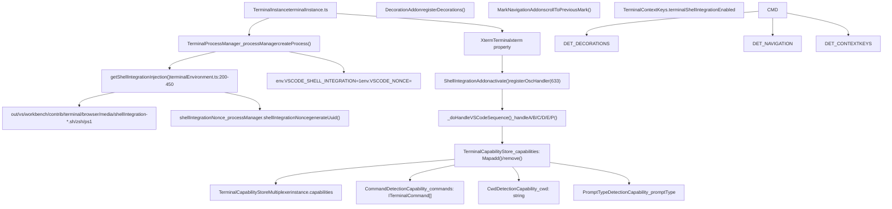
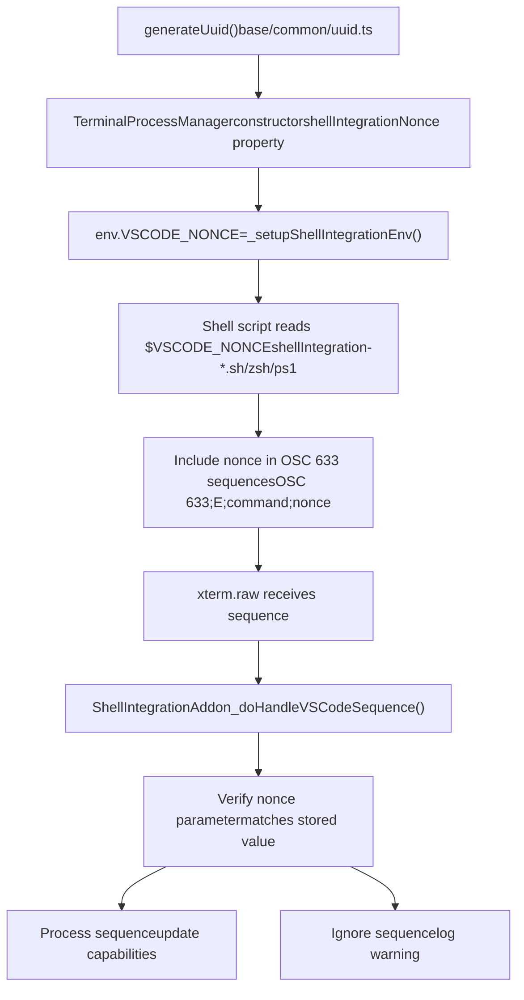
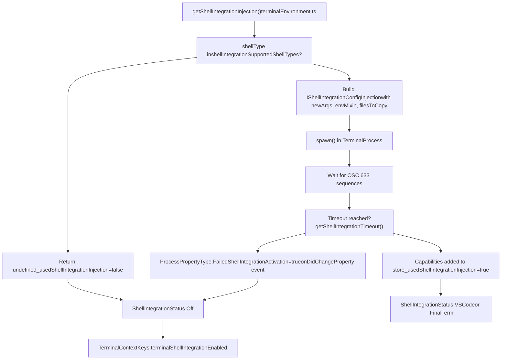
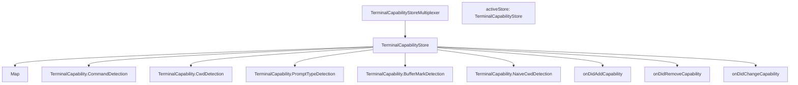
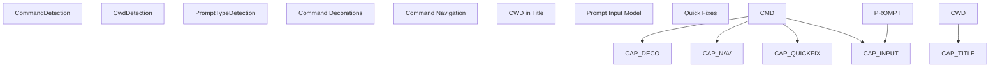
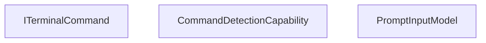
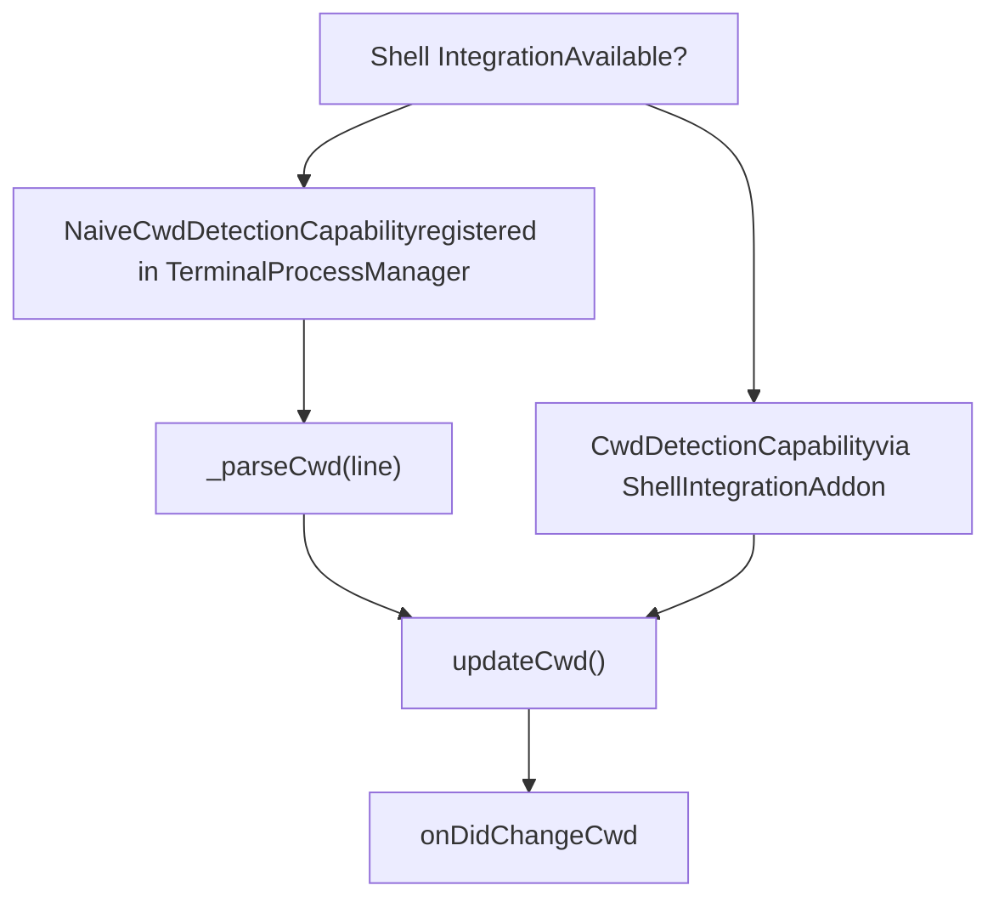

# Shell Integration and Capabilities

Relevant source files

-   [src/vs/platform/terminal/common/terminal.ts](https://github.com/microsoft/vscode/blob/1be3088d/src/vs/platform/terminal/common/terminal.ts)
-   [src/vs/platform/terminal/common/terminalEnvironment.ts](https://github.com/microsoft/vscode/blob/1be3088d/src/vs/platform/terminal/common/terminalEnvironment.ts)
-   [src/vs/platform/terminal/common/terminalRecorder.ts](https://github.com/microsoft/vscode/blob/1be3088d/src/vs/platform/terminal/common/terminalRecorder.ts)
-   [src/vs/platform/terminal/node/ptyHostMain.ts](https://github.com/microsoft/vscode/blob/1be3088d/src/vs/platform/terminal/node/ptyHostMain.ts)
-   [src/vs/platform/terminal/node/ptyHostService.ts](https://github.com/microsoft/vscode/blob/1be3088d/src/vs/platform/terminal/node/ptyHostService.ts)
-   [src/vs/platform/terminal/node/ptyService.ts](https://github.com/microsoft/vscode/blob/1be3088d/src/vs/platform/terminal/node/ptyService.ts)
-   [src/vs/platform/terminal/node/terminalProcess.ts](https://github.com/microsoft/vscode/blob/1be3088d/src/vs/platform/terminal/node/terminalProcess.ts)
-   [src/vs/platform/terminal/test/common/terminalEnvironment.test.ts](https://github.com/microsoft/vscode/blob/1be3088d/src/vs/platform/terminal/test/common/terminalEnvironment.test.ts)
-   [src/vs/platform/terminal/test/common/terminalProfiles.test.ts](https://github.com/microsoft/vscode/blob/1be3088d/src/vs/platform/terminal/test/common/terminalProfiles.test.ts)
-   [src/vs/platform/terminal/test/common/terminalRecorder.test.ts](https://github.com/microsoft/vscode/blob/1be3088d/src/vs/platform/terminal/test/common/terminalRecorder.test.ts)
-   [src/vs/workbench/api/browser/mainThreadTerminalService.ts](https://github.com/microsoft/vscode/blob/1be3088d/src/vs/workbench/api/browser/mainThreadTerminalService.ts)
-   [src/vs/workbench/api/common/extHostTerminalService.ts](https://github.com/microsoft/vscode/blob/1be3088d/src/vs/workbench/api/common/extHostTerminalService.ts)
-   [src/vs/workbench/api/node/extHostTerminalService.ts](https://github.com/microsoft/vscode/blob/1be3088d/src/vs/workbench/api/node/extHostTerminalService.ts)
-   [src/vs/workbench/contrib/terminal/browser/media/terminal.css](https://github.com/microsoft/vscode/blob/1be3088d/src/vs/workbench/contrib/terminal/browser/media/terminal.css)
-   [src/vs/workbench/contrib/terminal/browser/media/xterm.css](https://github.com/microsoft/vscode/blob/1be3088d/src/vs/workbench/contrib/terminal/browser/media/xterm.css)
-   [src/vs/workbench/contrib/terminal/browser/remotePty.ts](https://github.com/microsoft/vscode/blob/1be3088d/src/vs/workbench/contrib/terminal/browser/remotePty.ts)
-   [src/vs/workbench/contrib/terminal/browser/terminal.contribution.ts](https://github.com/microsoft/vscode/blob/1be3088d/src/vs/workbench/contrib/terminal/browser/terminal.contribution.ts)
-   [src/vs/workbench/contrib/terminal/browser/terminal.ts](https://github.com/microsoft/vscode/blob/1be3088d/src/vs/workbench/contrib/terminal/browser/terminal.ts)
-   [src/vs/workbench/contrib/terminal/browser/terminalActions.ts](https://github.com/microsoft/vscode/blob/1be3088d/src/vs/workbench/contrib/terminal/browser/terminalActions.ts)
-   [src/vs/workbench/contrib/terminal/browser/terminalEditor.ts](https://github.com/microsoft/vscode/blob/1be3088d/src/vs/workbench/contrib/terminal/browser/terminalEditor.ts)
-   [src/vs/workbench/contrib/terminal/browser/terminalEditorInput.ts](https://github.com/microsoft/vscode/blob/1be3088d/src/vs/workbench/contrib/terminal/browser/terminalEditorInput.ts)
-   [src/vs/workbench/contrib/terminal/browser/terminalEditorService.ts](https://github.com/microsoft/vscode/blob/1be3088d/src/vs/workbench/contrib/terminal/browser/terminalEditorService.ts)
-   [src/vs/workbench/contrib/terminal/browser/terminalGroup.ts](https://github.com/microsoft/vscode/blob/1be3088d/src/vs/workbench/contrib/terminal/browser/terminalGroup.ts)
-   [src/vs/workbench/contrib/terminal/browser/terminalGroupService.ts](https://github.com/microsoft/vscode/blob/1be3088d/src/vs/workbench/contrib/terminal/browser/terminalGroupService.ts)
-   [src/vs/workbench/contrib/terminal/browser/terminalInstance.ts](https://github.com/microsoft/vscode/blob/1be3088d/src/vs/workbench/contrib/terminal/browser/terminalInstance.ts)
-   [src/vs/workbench/contrib/terminal/browser/terminalInstanceService.ts](https://github.com/microsoft/vscode/blob/1be3088d/src/vs/workbench/contrib/terminal/browser/terminalInstanceService.ts)
-   [src/vs/workbench/contrib/terminal/browser/terminalMenus.ts](https://github.com/microsoft/vscode/blob/1be3088d/src/vs/workbench/contrib/terminal/browser/terminalMenus.ts)
-   [src/vs/workbench/contrib/terminal/browser/terminalProcessExtHostProxy.ts](https://github.com/microsoft/vscode/blob/1be3088d/src/vs/workbench/contrib/terminal/browser/terminalProcessExtHostProxy.ts)
-   [src/vs/workbench/contrib/terminal/browser/terminalProcessManager.ts](https://github.com/microsoft/vscode/blob/1be3088d/src/vs/workbench/contrib/terminal/browser/terminalProcessManager.ts)
-   [src/vs/workbench/contrib/terminal/browser/terminalService.ts](https://github.com/microsoft/vscode/blob/1be3088d/src/vs/workbench/contrib/terminal/browser/terminalService.ts)
-   [src/vs/workbench/contrib/terminal/browser/terminalStatusList.ts](https://github.com/microsoft/vscode/blob/1be3088d/src/vs/workbench/contrib/terminal/browser/terminalStatusList.ts)
-   [src/vs/workbench/contrib/terminal/browser/terminalTabbedView.ts](https://github.com/microsoft/vscode/blob/1be3088d/src/vs/workbench/contrib/terminal/browser/terminalTabbedView.ts)
-   [src/vs/workbench/contrib/terminal/browser/terminalTabsList.ts](https://github.com/microsoft/vscode/blob/1be3088d/src/vs/workbench/contrib/terminal/browser/terminalTabsList.ts)
-   [src/vs/workbench/contrib/terminal/browser/terminalView.ts](https://github.com/microsoft/vscode/blob/1be3088d/src/vs/workbench/contrib/terminal/browser/terminalView.ts)
-   [src/vs/workbench/contrib/terminal/browser/xterm/xtermTerminal.ts](https://github.com/microsoft/vscode/blob/1be3088d/src/vs/workbench/contrib/terminal/browser/xterm/xtermTerminal.ts)
-   [src/vs/workbench/contrib/terminal/common/terminal.ts](https://github.com/microsoft/vscode/blob/1be3088d/src/vs/workbench/contrib/terminal/common/terminal.ts)
-   [src/vs/workbench/contrib/terminal/common/terminalColorRegistry.ts](https://github.com/microsoft/vscode/blob/1be3088d/src/vs/workbench/contrib/terminal/common/terminalColorRegistry.ts)
-   [src/vs/workbench/contrib/terminal/common/terminalConfiguration.ts](https://github.com/microsoft/vscode/blob/1be3088d/src/vs/workbench/contrib/terminal/common/terminalConfiguration.ts)
-   [src/vs/workbench/contrib/terminal/common/terminalEnvironment.ts](https://github.com/microsoft/vscode/blob/1be3088d/src/vs/workbench/contrib/terminal/common/terminalEnvironment.ts)
-   [src/vs/workbench/contrib/terminal/common/terminalStrings.ts](https://github.com/microsoft/vscode/blob/1be3088d/src/vs/workbench/contrib/terminal/common/terminalStrings.ts)
-   [src/vs/workbench/contrib/terminal/test/browser/terminalStatusList.test.ts](https://github.com/microsoft/vscode/blob/1be3088d/src/vs/workbench/contrib/terminal/test/browser/terminalStatusList.test.ts)
-   [src/vs/workbench/contrib/terminal/test/common/terminalEnvironment.test.ts](https://github.com/microsoft/vscode/blob/1be3088d/src/vs/workbench/contrib/terminal/test/common/terminalEnvironment.test.ts)

Shell integration is a system that enables VS Code to understand and interact with terminal shell sessions at a deeper level. When enabled, VS Code injects small scripts into supported shells (Bash, Zsh, PowerShell, Python) that emit special OSC (Operating System Command) sequences. These sequences allow VS Code to detect commands, track the current working directory, identify prompts, and provide enhanced terminal features like command decorations, quick fixes, and command navigation.

For information about the broader terminal architecture, see [Integrated Terminal](/microsoft/vscode/8-chat-and-ai-integration). For terminal process management, see [Terminal Instance and Process Management](/microsoft/vscode/8.2-chat-agents-and-participants). For the terminal extension API that exposes shell integration capabilities, see [Terminal Extension API](#8.8).

## Architecture Overview

Shell integration consists of three main layers: injection, communication, and capability detection. The `TerminalProcessManager` calls `getShellIntegrationInjection()` to modify shell arguments, which causes shell-specific scripts to emit OSC 633 sequences. The `ShellIntegrationAddon` parses these sequences and populates the `TerminalCapabilityStore` with capabilities.

**Shell Integration Data Flow Diagram**


**Sources:** [src/vs/workbench/contrib/terminal/browser/terminalInstance.ts521-570](https://github.com/microsoft/vscode/blob/1be3088d/src/vs/workbench/contrib/terminal/browser/terminalInstance.ts#L521-L570) [src/vs/workbench/contrib/terminal/browser/terminalProcessManager.ts74-350](https://github.com/microsoft/vscode/blob/1be3088d/src/vs/workbench/contrib/terminal/browser/terminalProcessManager.ts#L74-L350) [src/vs/platform/terminal/common/xterm/shellIntegrationAddon.ts100-200](https://github.com/microsoft/vscode/blob/1be3088d/src/vs/platform/terminal/common/xterm/shellIntegrationAddon.ts#L100-L200) [src/vs/platform/terminal/node/terminalEnvironment.ts200-450](https://github.com/microsoft/vscode/blob/1be3088d/src/vs/platform/terminal/node/terminalEnvironment.ts#L200-L450)

## Shell Integration Injection

VS Code injects shell integration scripts by modifying the shell launch configuration. The injection process determines the appropriate script for the shell type and prepends arguments to source the integration code.

### Supported Shell Types

Shell integration is supported for specific shell types, defined in the `shellIntegrationSupportedShellTypes` array constant at [src/vs/workbench/contrib/terminal/browser/terminalInstance.ts122-127](https://github.com/microsoft/vscode/blob/1be3088d/src/vs/workbench/contrib/terminal/browser/terminalInstance.ts#L122-L127):

| Shell Type | Enum Value | Integration Script | Location |
| --- | --- | --- | --- |
| Bash | `PosixShellType.Bash` | `shellIntegration-bash.sh` | `out/vs/workbench/contrib/terminal/browser/media/` |
| Zsh | `PosixShellType.Zsh` | `shellIntegration-rc.zsh` | `out/vs/workbench/contrib/terminal/browser/media/` |
| PowerShell | `GeneralShellType.PowerShell` | `shellIntegration.ps1` | `out/vs/workbench/contrib/terminal/browser/media/` |
| Python | `GeneralShellType.Python` | Python-specific integration | `out/vs/workbench/contrib/terminal/browser/media/` |

The `getShellIntegrationInjection()` function checks if the shell's `shellType` property matches one of these supported types before injecting shell integration.

**Sources:** [src/vs/workbench/contrib/terminal/browser/terminalInstance.ts122-127](https://github.com/microsoft/vscode/blob/1be3088d/src/vs/workbench/contrib/terminal/browser/terminalInstance.ts#L122-L127) [src/vs/platform/terminal/node/terminalEnvironment.ts200-300](https://github.com/microsoft/vscode/blob/1be3088d/src/vs/platform/terminal/node/terminalEnvironment.ts#L200-L300)

### Injection Process Flow

The injection process modifies the `IShellLaunchConfig` to prepend shell-specific arguments that source the integration scripts before the shell's normal initialization.

**Shell Integration Injection Sequence**

> **[Mermaid sequence]**
> *(图表结构无法解析)*

**Sources:** [src/vs/workbench/contrib/terminal/browser/terminalProcessManager.ts200-350](https://github.com/microsoft/vscode/blob/1be3088d/src/vs/workbench/contrib/terminal/browser/terminalProcessManager.ts#L200-L350) [src/vs/platform/terminal/node/terminalEnvironment.ts200-450](https://github.com/microsoft/vscode/blob/1be3088d/src/vs/platform/terminal/node/terminalEnvironment.ts#L200-L450) [src/vs/platform/terminal/node/terminalProcess.ts250-350](https://github.com/microsoft/vscode/blob/1be3088d/src/vs/platform/terminal/node/terminalProcess.ts#L250-L350)

### Shell Integration Nonce

Each terminal instance generates a unique `shellIntegrationNonce` using `generateUuid()` for security. This nonce prevents untrusted or malicious OSC sequences from being processed as shell integration data.

**Nonce Generation and Validation Flow**


The nonce is stored in `TerminalProcessManager.shellIntegrationNonce` and passed to the shell via `VSCODE_NONCE` environment variable. Shell integration scripts include this nonce in certain OSC 633 sequences (like `633;E` for command line). The `ShellIntegrationAddon` validates the nonce before processing these sequences.

**Sources:** [src/vs/workbench/contrib/terminal/browser/terminalProcessManager.ts84-180](https://github.com/microsoft/vscode/blob/1be3088d/src/vs/workbench/contrib/terminal/browser/terminalProcessManager.ts#L84-L180) [src/vs/workbench/contrib/terminal/browser/terminalInstance.ts303](https://github.com/microsoft/vscode/blob/1be3088d/src/vs/workbench/contrib/terminal/browser/terminalInstance.ts#L303-L303) [src/vs/platform/terminal/common/xterm/shellIntegrationAddon.ts300-400](https://github.com/microsoft/vscode/blob/1be3088d/src/vs/platform/terminal/common/xterm/shellIntegrationAddon.ts#L300-L400) [src/vs/base/common/uuid.ts](https://github.com/microsoft/vscode/blob/1be3088d/src/vs/base/common/uuid.ts)

### Injection Failure Handling

VS Code tracks shell integration injection status through instance properties and emits process property events when failures occur. The `_usedShellIntegrationInjection` flag (line 196 in `terminalInstance.ts`) indicates whether injection was attempted, and `_shellIntegrationInjectionInfo` (line 198) stores failure reasons.

**Injection Status Tracking**


The timeout for shell integration activation is determined by `getShellIntegrationTimeout()` at [src/vs/workbench/contrib/terminal/common/terminalEnvironment.ts400-450](https://github.com/microsoft/vscode/blob/1be3088d/src/vs/workbench/contrib/terminal/common/terminalEnvironment.ts#L400-L450) This function returns platform-specific defaults:

-   **Windows**: 3000ms (3 seconds)
-   **macOS/Linux**: 5000ms (5 seconds)

The timeout can be configured via `TerminalSettingId.ShellIntegrationTimeout` setting.

**Sources:** [src/vs/workbench/contrib/terminal/browser/terminalInstance.ts196-200](https://github.com/microsoft/vscode/blob/1be3088d/src/vs/workbench/contrib/terminal/browser/terminalInstance.ts#L196-L200) [src/vs/platform/terminal/common/terminal.ts257-278](https://github.com/microsoft/vscode/blob/1be3088d/src/vs/platform/terminal/common/terminal.ts#L257-L278) [src/vs/workbench/contrib/terminal/common/terminalEnvironment.ts400-450](https://github.com/microsoft/vscode/blob/1be3088d/src/vs/workbench/contrib/terminal/common/terminalEnvironment.ts#L400-L450)

## Capability System

The capability system dynamically detects and registers terminal capabilities as shell integration becomes active. Capabilities represent features that the terminal supports based on shell integration.

### Capability Store Architecture


**Sources:** [src/vs/platform/terminal/common/capabilities/terminalCapabilityStore.ts](https://github.com/microsoft/vscode/blob/1be3088d/src/vs/platform/terminal/common/capabilities/terminalCapabilityStore.ts) [src/vs/workbench/contrib/terminal/browser/terminalInstance.ts205](https://github.com/microsoft/vscode/blob/1be3088d/src/vs/workbench/contrib/terminal/browser/terminalInstance.ts#L205-L205)

### Capability Registration and Lifecycle

Capabilities are registered dynamically as the terminal process emits shell integration sequences. `TerminalInstance` sets up listeners for capability additions in its constructor using a `DisposableMap` to track per-capability subscriptions.

**Capability Registration and Event Handling**

**Sources:** [src/vs/workbench/contrib/terminal/browser/terminalInstance.ts460-503](https://github.com/microsoft/vscode/blob/1be3088d/src/vs/workbench/contrib/terminal/browser/terminalInstance.ts#L460-L503) [src/vs/platform/terminal/common/capabilities/terminalCapabilityStore.ts80-150](https://github.com/microsoft/vscode/blob/1be3088d/src/vs/platform/terminal/common/capabilities/terminalCapabilityStore.ts#L80-L150)

### Capability Types and Their Functions

| Capability | Enum Value | Purpose | Provided By |
| --- | --- | --- | --- |
| Command Detection | `TerminalCapability.CommandDetection` | Detects when commands are executed, tracks command boundaries | ShellIntegrationAddon |
| CWD Detection | `TerminalCapability.CwdDetection` | Tracks current working directory changes | ShellIntegrationAddon |
| Naive CWD Detection | `TerminalCapability.NaiveCwdDetection` | Fallback CWD detection without shell integration | NaiveCwdDetectionCapability |
| Prompt Type Detection | `TerminalCapability.PromptTypeDetection` | Identifies different prompt states (input, continuation, right prompt) | ShellIntegrationAddon |
| Buffer Mark Detection | `TerminalCapability.BufferMarkDetection` | Marks buffer positions for navigation | ShellIntegrationAddon |
| Partial Command Detection | `TerminalCapability.PartialCommandDetection` | Tracks partial/incomplete commands | ShellIntegrationAddon |

**Sources:** [src/vs/platform/terminal/common/capabilities/capabilities.ts](https://github.com/microsoft/vscode/blob/1be3088d/src/vs/platform/terminal/common/capabilities/capabilities.ts) [src/vs/workbench/contrib/terminal/browser/terminalInstance.ts469-500](https://github.com/microsoft/vscode/blob/1be3088d/src/vs/workbench/contrib/terminal/browser/terminalInstance.ts#L469-L500)

### Capability-Dependent Features

Features that depend on capabilities are enabled progressively:


**Sources:** [src/vs/workbench/contrib/terminal/browser/terminalInstance.ts462-500](https://github.com/microsoft/vscode/blob/1be3088d/src/vs/workbench/contrib/terminal/browser/terminalInstance.ts#L462-L500)

## OSC Sequences and Communication Protocol

Shell integration uses OSC (Operating System Command) sequences in the 633 series to communicate between the shell and VS Code. These sequences are emitted by the shell integration scripts and parsed by xterm.js, which routes them to the `ShellIntegrationAddon`.

### OSC 633 Sequence Format

OSC sequences follow the pattern: `ESC ] 633 ; <type> ; <data> ST`

Where:

-   `ESC ]` is the OSC start sequence (`\x1b]` or `\033]`)
-   `633` is the VS Code shell integration identifier (defined as constant in `ShellIntegrationAddon`)
-   `<type>` identifies the sequence type (single letter: A, B, C, D, E, P, etc.)
-   `<data>` contains sequence-specific information (optional, semicolon-separated)
-   `ST` is the string terminator (`\x07` bell or `\x1b\\` ESC backslash)

### Common OSC 633 Sequences

| Sequence | Handler Method | Capability Updated | Purpose | Data Format | Example |
| --- | --- | --- | --- | --- | --- |
| `633;A` | `_handleA()` | `CommandDetectionCapability` | Mark prompt start | None | `\x1b]633;A\x07` |
| `633;B` | `_handleB()` | `CommandDetectionCapability` | Mark prompt end / command input start | None | `\x1b]633;B\x07` |
| `633;C` | `_handleC()` | `CommandDetectionCapability` | Mark command execution start | None | `\x1b]633;C\x07` |
| `633;D;exitCode` | `_handleD()` | `CommandDetectionCapability` | Mark command finished | Exit code (number) | `\x1b]633;D;0\x07` |
| `633;E;commandLine[;nonce]` | `_handleE()` | `CommandDetectionCapability` | Set executed command line | Command text with optional nonce | `\x1b]633;E;ls -la;abc123\x07` |
| `633;P;property=value` | `_handleP()` | Various (CwdDetection, PromptTypeDetection) | Set property | Key=value pairs | `\x1b]633;P;Cwd=/home/user\x07` |

Additional sequences include:

-   `633;L` - Right prompt start
-   `633;M` - Right prompt end
-   `633;N` - Continuation prompt start
-   `633;O` - Command line start (alternative to B)

The shell integration addon is registered at xterm.js initialization by calling `xterm.raw.loadAddon(shellIntegrationAddon)` in the `XtermTerminal` class.

**Sources:** [src/vs/platform/terminal/common/xterm/shellIntegrationAddon.ts200-800](https://github.com/microsoft/vscode/blob/1be3088d/src/vs/platform/terminal/common/xterm/shellIntegrationAddon.ts#L200-L800) [src/vs/workbench/contrib/terminal/browser/xterm/xtermTerminal.ts300-400](https://github.com/microsoft/vscode/blob/1be3088d/src/vs/workbench/contrib/terminal/browser/xterm/xtermTerminal.ts#L300-L400)

### Sequence Processing Pipeline

The `ShellIntegrationAddon` implements the xterm.js `ITerminalAddon` interface and registers an OSC handler during the `activate()` method. The handler is called by xterm.js's internal parser when OSC 633 sequences are received.

**OSC 633 Processing Flow**

```mermaid
flowchart TD
    XTERM["Terminal.raw(RawXtermTerminal instance)"]
    PARSER["xterm internal OSC parsercalls registered handlers"]
    ADDON["ShellIntegrationAddonactivate(terminal)"]
    REGISTER["terminal.parser.registerOscHandler(633, callback)"]
    DISPATCH["_doHandleVSCodeSequence(data)splits on semicolon"]
    A_HANDLER["_handleA()capability.handlePromptStart()"]
    B_HANDLER["_handleB()capability.handlePromptEnd()"]
    C_HANDLER["_handleC()capability.handleCommandStart()"]
    D_HANDLER["_handleD(data)capability.handleCommandExecuted(exitCode)"]
    E_HANDLER["_handleE(data)capability.setCommandLine(command, nonce)"]
    P_HANDLER["_handleP(data)parse key=value properties"]
    CMD_DET["CommandDetectionCapability_commands: ITerminalCommand[]promptInputModel"]
    CWD_DET["CwdDetectionCapability_cwd: stringonDidChangeCwd event"]
    PROMPT_DET["PromptTypeDetectionCapability_promptType: PromptType"]

    XTERM --> ADDON
    ADDON --> REGISTER
    PARSER --> DISPATCH
    DISPATCH --> A_HANDLER
    DISPATCH --> B_HANDLER
    DISPATCH --> C_HANDLER
    DISPATCH --> D_HANDLER
    DISPATCH --> E_HANDLER
    DISPATCH --> P_HANDLER
    A --> HANDLER_CMD_DET
    B --> HANDLER_CMD_DET
    C --> HANDLER_CMD_DET
    D --> HANDLER_CMD_DET
    E --> HANDLER_CMD_DET
    P --> HANDLER_CWD_DET
    P --> HANDLER_PROMPT_DET
```


The `_doHandleVSCodeSequence()` method at [src/vs/platform/terminal/common/xterm/shellIntegrationAddon.ts300-400](https://github.com/microsoft/vscode/blob/1be3088d/src/vs/platform/terminal/common/xterm/shellIntegrationAddon.ts#L300-L400) is the entry point that parses the data string, splits it on semicolons, and dispatches to the appropriate handler based on the first character (sequence type).

**Sources:** [src/vs/platform/terminal/common/xterm/shellIntegrationAddon.ts100-800](https://github.com/microsoft/vscode/blob/1be3088d/src/vs/platform/terminal/common/xterm/shellIntegrationAddon.ts#L100-L800) [src/vs/workbench/contrib/terminal/browser/xterm/xtermTerminal.ts300-400](https://github.com/microsoft/vscode/blob/1be3088d/src/vs/workbench/contrib/terminal/browser/xterm/xtermTerminal.ts#L300-L400)

### Nonce Verification in OSC Sequences

Only certain OSC 633 sequences require nonce verification. Specifically, the `633;E` (command line) sequence includes an optional nonce parameter as the third field. This prevents malicious or unintended command lines from being recorded in the command history.

**Nonce Verification Flow for OSC 633;E**

The `isTrusted` flag on `ITerminalCommand` determines whether the command is considered safe for automated actions. Commands without valid nonces are still stored but marked as untrusted.

**Sources:** [src/vs/platform/terminal/common/xterm/shellIntegrationAddon.ts500-600](https://github.com/microsoft/vscode/blob/1be3088d/src/vs/platform/terminal/common/xterm/shellIntegrationAddon.ts#L500-L600) [src/vs/platform/terminal/common/capabilities/commandDetectionCapability.ts200-300](https://github.com/microsoft/vscode/blob/1be3088d/src/vs/platform/terminal/common/capabilities/commandDetectionCapability.ts#L200-L300) [src/vs/workbench/contrib/terminal/browser/terminalProcessManager.ts84](https://github.com/microsoft/vscode/blob/1be3088d/src/vs/workbench/contrib/terminal/browser/terminalProcessManager.ts#L84-L84)

## Command Detection Capability

The `CommandDetectionCapability` tracks the full lifecycle of shell commands by processing OSC 633 sequences. It maintains a `_commands` array of `ITerminalCommand` objects and provides a `promptInputModel` for tracking user input.

### Command Model and Data Structures

**Command Detection Class Structure**


The `_commands` array stores all executed commands with their markers, exit codes, and output. Each command tracks its position in the xterm.js buffer via `IXtermMarker` objects.

**Sources:** [src/vs/platform/terminal/common/capabilities/capabilities.ts300-450](https://github.com/microsoft/vscode/blob/1be3088d/src/vs/platform/terminal/common/capabilities/capabilities.ts#L300-L450) [src/vs/platform/terminal/common/capabilities/commandDetectionCapability.ts50-800](https://github.com/microsoft/vscode/blob/1be3088d/src/vs/platform/terminal/common/capabilities/commandDetectionCapability.ts#L50-L800) [src/vs/platform/terminal/common/capabilities/commandDetection/promptInputModel.ts30-250](https://github.com/microsoft/vscode/blob/1be3088d/src/vs/platform/terminal/common/capabilities/commandDetection/promptInputModel.ts#L30-L250)

### Command Lifecycle with OSC Sequences

**Sources:** [src/vs/platform/terminal/common/xterm/shellIntegrationAddon.ts](https://github.com/microsoft/vscode/blob/1be3088d/src/vs/platform/terminal/common/xterm/shellIntegrationAddon.ts) [src/vs/platform/terminal/common/capabilities/commandDetectionCapability.ts](https://github.com/microsoft/vscode/blob/1be3088d/src/vs/platform/terminal/common/capabilities/commandDetectionCapability.ts)

### Command Storage and Navigation

Commands are stored in a linear array that can be navigated:

```
class CommandDetectionCapability {
    private _commands: ITerminalCommand[] = [];

    // Access commands by index
    get commands(): readonly ITerminalCommand[];

    // Navigate to specific command markers
    scrollToPreviousCommand(marker?: IXtermMarker): void;
    scrollToNextCommand(marker?: IXtermMarker): void;

    // Get command at specific marker
    getCommandForMarker(marker: IXtermMarker): ITerminalCommand | undefined;
}
```
**Sources:** [src/vs/platform/terminal/common/capabilities/commandDetectionCapability.ts](https://github.com/microsoft/vscode/blob/1be3088d/src/vs/platform/terminal/common/capabilities/commandDetectionCapability.ts)

## CWD Detection Capability

The `CwdDetectionCapability` tracks the current working directory using OSC 633;P sequences. When shell integration is unavailable, `NaiveCwdDetectionCapability` provides fallback detection.

### CWD Update Flow with Shell Integration

**CWD Detection via OSC Sequences**

**Sources:** [src/vs/platform/terminal/common/capabilities/cwdDetectionCapability.ts30-100](https://github.com/microsoft/vscode/blob/1be3088d/src/vs/platform/terminal/common/capabilities/cwdDetectionCapability.ts#L30-L100) [src/vs/workbench/contrib/terminal/browser/terminalInstance.ts469-473](https://github.com/microsoft/vscode/blob/1be3088d/src/vs/workbench/contrib/terminal/browser/terminalInstance.ts#L469-L473) [src/vs/platform/terminal/common/xterm/shellIntegrationAddon.ts600-700](https://github.com/microsoft/vscode/blob/1be3088d/src/vs/platform/terminal/common/xterm/shellIntegrationAddon.ts#L600-L700)

### Fallback: Naive CWD Detection

When shell integration is not available or has failed, `NaiveCwdDetectionCapability` is registered as a fallback. It attempts to parse CWD from terminal output by looking for common directory patterns.

**Naive CWD Detection**


The `NaiveCwdDetectionCapability` is instantiated in `TerminalProcessManager` constructor and scans each line of terminal output for patterns that might indicate a directory change.

**Sources:** [src/vs/platform/terminal/common/capabilities/naiveCwdDetectionCapability.ts30-150](https://github.com/microsoft/vscode/blob/1be3088d/src/vs/platform/terminal/common/capabilities/naiveCwdDetectionCapability.ts#L30-L150) [src/vs/workbench/contrib/terminal/browser/terminalProcessManager.ts163-450](https://github.com/microsoft/vscode/blob/1be3088d/src/vs/workbench/contrib/terminal/browser/terminalProcessManager.ts#L163-L450)

## Configuration and Context Keys

Shell integration status is exposed through context keys (defined in `TerminalContextKeys` class) and configuration settings (defined in `TerminalSettingId` enum). These allow UI elements and commands to adapt based on shell integration availability.

### Context Keys

Context keys are bound in `TerminalInstance` constructor at lines 450-454 and updated throughout the terminal lifecycle:

**Shell Integration Context Key Bindings and Updates**

```mermaid
flowchart TD
    ENABLED["_terminalShellIntegrationEnabledContextKeyTerminalContextKeys.terminalShellIntegrationEnabled.bindTo()"]
    ALT_BUFFER["_terminalAltBufferActiveContextKeyTerminalContextKeys.altBufferActive.bindTo()"]
    TEXT["_terminalHasTextContextKeyTerminalContextKeys.textSelected.bindTo()"]
    FOCUS["_terminalFocusContextKeyTerminalContextKeys.focus.bindTo()"]
    CAP_ADD["capabilities.onDidAddCapabilityTerminalCapability.CommandDetection"]
    CAP_REMOVE["capabilities.onDidRemoveCapability"]
    XTERM_SELECT["xterm.raw.onSelectionChange"]
    XTERM_BUFFER["xterm.raw.buffer.active event"]
    FOCUS_EVENT["onDidFocus / onDidBlur"]
    MENU["MenuId.TerminalContextwhen: terminalShellIntegrationEnabled"]
    CMD["TerminalCommandId.ScrollToPreviousCommandprecondition check"]
    DECO["DecorationAddonregisterDecorations() check"]
    QUICKFIX["Terminal quick fixesvisibility"]
    STATUS["Terminal status indicators"]

    CAP --> ADD_ENABLED
    CAP --> REMOVE_ENABLED
    XTERM --> SELECT_TEXT
    XTERM --> BUFFER_ALT_BUFFER
    FOCUS --> EVENT_FOCUS
    ENABLED --> MENU
    ENABLED --> CMD
    ENABLED --> DECO
    ENABLED --> QUICKFIX
    ENABLED --> STATUS
```


The context key `terminalShellIntegrationEnabled` is set to `true` when `CommandDetectionCapability` is added to the capability store, indicating that shell integration is active and functional.

**Sources:** [src/vs/workbench/contrib/terminal/browser/terminalInstance.ts450-503](https://github.com/microsoft/vscode/blob/1be3088d/src/vs/workbench/contrib/terminal/browser/terminalInstance.ts#L450-L503) [src/vs/workbench/contrib/terminal/common/terminalContextKey.ts30-80](https://github.com/microsoft/vscode/blob/1be3088d/src/vs/workbench/contrib/terminal/common/terminalContextKey.ts#L30-L80)

### Configuration Settings

| Setting | ID | Purpose | Default |
| --- | --- | --- | --- |
| Shell Integration Enabled | `terminal.integrated.shellIntegration.enabled` | Enable/disable shell integration | `true` |
| Decorations Enabled | `terminal.integrated.shellIntegration.decorationsEnabled` | Show command decorations | `'both'` |
| Show Welcome | `terminal.integrated.shellIntegration.showWelcome` | Show shell integration welcome message | `true` |
| Timeout | `terminal.integrated.shellIntegration.timeout` | Time to wait for shell integration | Platform-specific |
| Quick Fix Enabled | `terminal.integrated.shellIntegration.quickFixEnabled` | Enable quick fixes based on command output | `true` |
| Environment Reporting | `terminal.integrated.shellIntegration.environmentReporting` | Report environment changes via shell integration | `'on'` |

**Sources:** [src/vs/platform/terminal/common/terminal.ts110-115](https://github.com/microsoft/vscode/blob/1be3088d/src/vs/platform/terminal/common/terminal.ts#L110-L115) [src/vs/workbench/contrib/terminal/common/terminalConfiguration.ts](https://github.com/microsoft/vscode/blob/1be3088d/src/vs/workbench/contrib/terminal/common/terminalConfiguration.ts)

### Shell Integration Status Enum

```
enum ShellIntegrationStatus {
    /** No shell integration sequences have been encountered. */
    Off = 0,

    /** The final PS2 before we expect commands to be run is encountered. */
    VSCode = 1,

    /** Final PS1 encountered. */
    FinalTerm = 2
}
```
**Sources:** [src/vs/platform/terminal/common/terminal.ts](https://github.com/microsoft/vscode/blob/1be3088d/src/vs/platform/terminal/common/terminal.ts)

## Integration with Terminal Features

Shell integration capabilities enable numerous terminal features:

### Feature Dependencies

```mermaid
flowchart TD
    SI["Shell Integration Active"]
    CMD_CAP["CommandDetection"]
    CWD_CAP["CwdDetection"]
    PROMPT_CAP["PromptTypeDetection"]
    GUTTER["Gutter Decorations"]
    OVERVIEW["Overview Ruler"]
    NAV_PREV["Navigate to Previous Command"]
    NAV_NEXT["Navigate to Next Command"]
    SELECT["Select Command Output"]
    CWD_TITLE["CWD in Title"]
    CONTEXT_KEYS["Context Key Updates"]
    TOOLTIP["Command Tooltips"]
    QUICKFIX["Quick Fixes"]
    COMPLETION["Terminal Suggestions"]
    RERUN["Re-run Commands"]

    SI --> CMD_CAP
    SI --> CWD_CAP
    SI --> PROMPT_CAP
    CMD --> CAP_GUTTER
    CMD --> CAP_OVERVIEW
    CMD --> CAP_NAV_PREV
    CMD --> CAP_NAV_NEXT
    CMD --> CAP_SELECT
    CMD --> CAP_QUICKFIX
    CMD --> CAP_COMPLETION
    CMD --> CAP_RERUN
    CMD --> CAP_TOOLTIP
    CWD --> CAP_CWD_TITLE
    CWD --> CAP_CONTEXT_KEYS
    PROMPT --> CAP_COMPLETION
```


**Sources:** [src/vs/workbench/contrib/terminal/browser/terminalInstance.ts462-504](https://github.com/microsoft/vscode/blob/1be3088d/src/vs/workbench/contrib/terminal/browser/terminalInstance.ts#L462-L504) [src/vs/workbench/contrib/terminal/browser/xterm/decorationAddon.ts](https://github.com/microsoft/vscode/blob/1be3088d/src/vs/workbench/contrib/terminal/browser/xterm/decorationAddon.ts)

### Shell Integration Information Status

A status indicator shows shell integration state in the terminal status bar:

```
// Terminal instance refreshes shell integration info status
private _refreshShellIntegrationInfoStatus(instance: ITerminalInstance): void {
    // Check if shell integration is enabled but not working
    // Show status with failure reason if available
    // Update status list with appropriate icon and message
}
```
**Sources:** [src/vs/workbench/contrib/terminal/browser/terminalInstance.ts466-468](https://github.com/microsoft/vscode/blob/1be3088d/src/vs/workbench/contrib/terminal/browser/terminalInstance.ts#L466-L468)
