# Chat and AI Integration

Relevant source files

-   [extensions/vscode-api-tests/package.json](https://github.com/microsoft/vscode/blob/1be3088d/extensions/vscode-api-tests/package.json)
-   [extensions/vscode-api-tests/src/singlefolder-tests/chat.test.ts](https://github.com/microsoft/vscode/blob/1be3088d/extensions/vscode-api-tests/src/singlefolder-tests/chat.test.ts)
-   [src/vs/editor/common/languages.ts](https://github.com/microsoft/vscode/blob/1be3088d/src/vs/editor/common/languages.ts)
-   [src/vs/platform/extensions/common/extensionsApiProposals.ts](https://github.com/microsoft/vscode/blob/1be3088d/src/vs/platform/extensions/common/extensionsApiProposals.ts)
-   [src/vs/workbench/api/browser/mainThreadChatAgents2.ts](https://github.com/microsoft/vscode/blob/1be3088d/src/vs/workbench/api/browser/mainThreadChatAgents2.ts)
-   [src/vs/workbench/api/browser/mainThreadChatStatus.ts](https://github.com/microsoft/vscode/blob/1be3088d/src/vs/workbench/api/browser/mainThreadChatStatus.ts)
-   [src/vs/workbench/api/browser/mainThreadLanguageFeatures.ts](https://github.com/microsoft/vscode/blob/1be3088d/src/vs/workbench/api/browser/mainThreadLanguageFeatures.ts)
-   [src/vs/workbench/api/common/extHost.api.impl.ts](https://github.com/microsoft/vscode/blob/1be3088d/src/vs/workbench/api/common/extHost.api.impl.ts)
-   [src/vs/workbench/api/common/extHost.protocol.ts](https://github.com/microsoft/vscode/blob/1be3088d/src/vs/workbench/api/common/extHost.protocol.ts)
-   [src/vs/workbench/api/common/extHostChatAgents2.ts](https://github.com/microsoft/vscode/blob/1be3088d/src/vs/workbench/api/common/extHostChatAgents2.ts)
-   [src/vs/workbench/api/common/extHostChatStatus.ts](https://github.com/microsoft/vscode/blob/1be3088d/src/vs/workbench/api/common/extHostChatStatus.ts)
-   [src/vs/workbench/api/common/extHostLanguageFeatures.ts](https://github.com/microsoft/vscode/blob/1be3088d/src/vs/workbench/api/common/extHostLanguageFeatures.ts)
-   [src/vs/workbench/api/common/extHostTypeConverters.ts](https://github.com/microsoft/vscode/blob/1be3088d/src/vs/workbench/api/common/extHostTypeConverters.ts)
-   [src/vs/workbench/api/common/extHostTypes.ts](https://github.com/microsoft/vscode/blob/1be3088d/src/vs/workbench/api/common/extHostTypes.ts)
-   [src/vs/workbench/contrib/chat/browser/actions/chatActions.ts](https://github.com/microsoft/vscode/blob/1be3088d/src/vs/workbench/contrib/chat/browser/actions/chatActions.ts)
-   [src/vs/workbench/contrib/chat/browser/actions/chatExecuteActions.ts](https://github.com/microsoft/vscode/blob/1be3088d/src/vs/workbench/contrib/chat/browser/actions/chatExecuteActions.ts)
-   [src/vs/workbench/contrib/chat/browser/actions/chatGettingStarted.ts](https://github.com/microsoft/vscode/blob/1be3088d/src/vs/workbench/contrib/chat/browser/actions/chatGettingStarted.ts)
-   [src/vs/workbench/contrib/chat/browser/chat.contribution.ts](https://github.com/microsoft/vscode/blob/1be3088d/src/vs/workbench/contrib/chat/browser/chat.contribution.ts)
-   [src/vs/workbench/contrib/chat/browser/chat.ts](https://github.com/microsoft/vscode/blob/1be3088d/src/vs/workbench/contrib/chat/browser/chat.ts)
-   [src/vs/workbench/contrib/chat/common/constants.ts](https://github.com/microsoft/vscode/blob/1be3088d/src/vs/workbench/contrib/chat/common/constants.ts)
-   [src/vs/workbench/contrib/chat/test/common/voiceChatService.test.ts](https://github.com/microsoft/vscode/blob/1be3088d/src/vs/workbench/contrib/chat/test/common/voiceChatService.test.ts)
-   [src/vscode-dts/vscode.d.ts](https://github.com/microsoft/vscode/blob/1be3088d/src/vscode-dts/vscode.d.ts)
-   [src/vscode-dts/vscode.proposed.chatParticipantAdditions.d.ts](https://github.com/microsoft/vscode/blob/1be3088d/src/vscode-dts/vscode.proposed.chatParticipantAdditions.d.ts)
-   [src/vscode-dts/vscode.proposed.chatStatusItem.d.ts](https://github.com/microsoft/vscode/blob/1be3088d/src/vscode-dts/vscode.proposed.chatStatusItem.d.ts)
-   [src/vscode-dts/vscode.proposed.defaultChatParticipant.d.ts](https://github.com/microsoft/vscode/blob/1be3088d/src/vscode-dts/vscode.proposed.defaultChatParticipant.d.ts)
-   [src/vscode-dts/vscode.proposed.inlineCompletionsAdditions.d.ts](https://github.com/microsoft/vscode/blob/1be3088d/src/vscode-dts/vscode.proposed.inlineCompletionsAdditions.d.ts)

This document describes the chat and AI integration system in VS Code, which provides a conversational interface for AI-powered assistance. The system enables both built-in and extension-contributed chat participants (agents) to respond to user queries with streaming responses, tool invocations, and rich UI elements.

For information about the Extension System architecture that enables chat participants, see [Extension System](/microsoft/vscode/5-workbench-architecture). For details about language models and tools, see the Language Model and Tools documentation.

## Overview and Architecture

The chat system consists of four primary layers:

1.  **Service Layer**: Core business logic (`ChatService`, `ChatAgentService`, `ChatModeService`)
2.  **UI Layer**: Widget components (`ChatWidget`, `ChatInputPart`, `QuickChatService`)
3.  **Extension Integration**: RPC bridge between main thread and extension host (`MainThreadChatAgents2` ↔ `ExtHostChatAgents2`)
4.  **Extension API**: Public `vscode.chat` API surface for third-party extensions

**System Architecture Diagram**

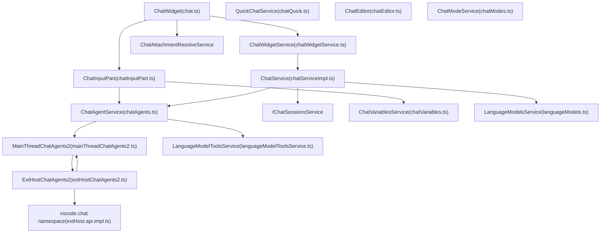
**Sources:**

-   [src/vs/workbench/contrib/chat/browser/chat.contribution.ts34-138](https://github.com/microsoft/vscode/blob/1be3088d/src/vs/workbench/contrib/chat/browser/chat.contribution.ts#L34-L138)
-   [src/vs/workbench/contrib/chat/browser/chat.ts52-98](https://github.com/microsoft/vscode/blob/1be3088d/src/vs/workbench/contrib/chat/browser/chat.ts#L52-L98)
-   [src/vs/workbench/contrib/chat/common/chatService/chatServiceImpl.ts1-50](https://github.com/microsoft/vscode/blob/1be3088d/src/vs/workbench/contrib/chat/common/chatService/chatServiceImpl.ts#L1-L50)
-   [src/vs/workbench/api/browser/mainThreadChatAgents2.ts1-50](https://github.com/microsoft/vscode/blob/1be3088d/src/vs/workbench/api/browser/mainThreadChatAgents2.ts#L1-L50)
-   [src/vs/workbench/api/common/extHostChatAgents2.ts1-50](https://github.com/microsoft/vscode/blob/1be3088d/src/vs/workbench/api/common/extHostChatAgents2.ts#L1-L50)

## Core Services

### IChatService and Session Management

`IChatService` (implemented by `ChatService`) manages the lifecycle of chat sessions, coordinates request/response flow, and maintains conversation history. Each session is represented by an `IChatModel` stored at a unique `LocalChatSessionUri`.

**Chat Service Architecture**

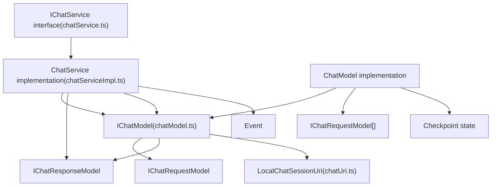
**Key Methods and Properties:**

| Method | Return Type | Description |
| --- | --- | --- |
| `startSession(location, token)` | `IChatModel` | Creates new session for given location |
| `sendRequest(resource, message, options?)` | `Promise<IChatResponseModel | undefined>` | Sends request and returns response stream |
| `getSession(resource)` | `IChatModel | undefined` | Retrieves existing session by URI |
| `transferChatSession(session, target)` | `Promise<void>` | Moves session to different workspace |
| `getSessionId(resource)` | `string` | Gets session identifier from resource URI |
| `addCompleteRequest(resource, message, attempt, result)` | `void` | Adds pre-completed request to history |

**Session Resource Format:**

Sessions are identified by URIs with the schema `LOCAL_CHAT_SESSION_SCHEME` (`chatSessionInternal`):

```
chatSessionInternal://session/<uuid>?workspaceFolder=<folder-uri>
```
**Sources:**

-   [src/vs/workbench/contrib/chat/common/chatService/chatService.ts200-350](https://github.com/microsoft/vscode/blob/1be3088d/src/vs/workbench/contrib/chat/common/chatService/chatService.ts#L200-L350)
-   [src/vs/workbench/contrib/chat/common/chatService/chatServiceImpl.ts1-100](https://github.com/microsoft/vscode/blob/1be3088d/src/vs/workbench/contrib/chat/common/chatService/chatServiceImpl.ts#L1-L100)
-   [src/vs/workbench/contrib/chat/common/model/chatUri.ts1-50](https://github.com/microsoft/vscode/blob/1be3088d/src/vs/workbench/contrib/chat/common/model/chatUri.ts#L1-L50)
-   [src/vs/workbench/contrib/chat/common/model/chatModel.ts1-100](https://github.com/microsoft/vscode/blob/1be3088d/src/vs/workbench/contrib/chat/common/model/chatModel.ts#L1-L100)

### IChatAgentService and Participant Management

`IChatAgentService` (implemented by `ChatAgentService`) maintains the registry of chat agents, coordinates agent invocation, and manages the agent lifecycle. Agents are registered through two paths:

1.  **Static registration**: Via `chatParticipants` contribution in `package.json`
2.  **Dynamic registration**: Via `vscode.chat.createChatParticipant()` extension API

**Agent Service Architecture**

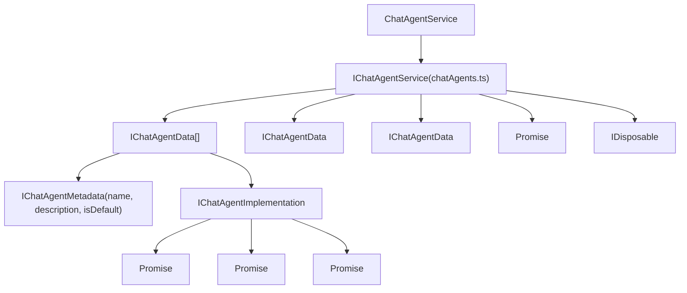
**Agent Data Structure:**

```
interface IChatAgentData {
    id: string;                      // e.g., 'copilot.workspace'
    name: string;                    // Display name
    description: string;
    extensionId: ExtensionIdentifier;
    metadata: IChatAgentMetadata;
    slashCommands: IChatAgentCommand[];
    locations: ChatAgentLocation[];  // Where agent is available
}

interface IChatAgentMetadata {
    isDefault?: boolean;            // Whether this is the default agent
    fullName?: string;
    icon?: URI;
    iconDark?: URI;
    themeIcon?: ThemeIcon;
    sampleRequest?: string;
    modes?: ChatModeKind[];         // Supported modes (ask/edit/agent)
}
```
**Agent Registration Flow:**

> **[Mermaid sequence]**
> *(图表结构无法解析)*

**Sources:**

-   [src/vs/workbench/contrib/chat/common/participants/chatAgents.ts1-200](https://github.com/microsoft/vscode/blob/1be3088d/src/vs/workbench/contrib/chat/common/participants/chatAgents.ts#L1-L200)
-   [src/vs/workbench/api/browser/mainThreadChatAgents2.ts168-249](https://github.com/microsoft/vscode/blob/1be3088d/src/vs/workbench/api/browser/mainThreadChatAgents2.ts#L168-L249)
-   [src/vs/workbench/api/common/extHostChatAgents2.ts462-478](https://github.com/microsoft/vscode/blob/1be3088d/src/vs/workbench/api/common/extHostChatAgents2.ts#L462-L478)

### IChatWidgetService

`IChatWidgetService` manages chat widget instances across different locations (panel, editor, quick chat) and provides methods for revealing and accessing widgets.

Key methods:

-   `lastFocusedWidget`: Returns the most recently focused widget
-   `revealWidget()`: Reveals and optionally focuses the last active widget
-   `openSession(sessionResource, target)`: Opens a chat session in a specific target location
-   `getWidgetBySessionResource(uri)`: Retrieves widget displaying a specific session

**Sources:**

-   [src/vs/workbench/contrib/chat/browser/chat.ts52-98](https://github.com/microsoft/vscode/blob/1be3088d/src/vs/workbench/contrib/chat/browser/chat.ts#L52-L98)
-   [src/vs/workbench/contrib/chat/browser/actions/chatActions.ts180-196](https://github.com/microsoft/vscode/blob/1be3088d/src/vs/workbench/contrib/chat/browser/actions/chatActions.ts#L180-L196)

## Chat Widget Architecture

### ChatWidget Component

`ChatWidget` is the primary UI component that renders chat conversations, manages input, and coordinates user interactions. It can be hosted in various locations: sidebar panel, editor, or quick chat overlay.

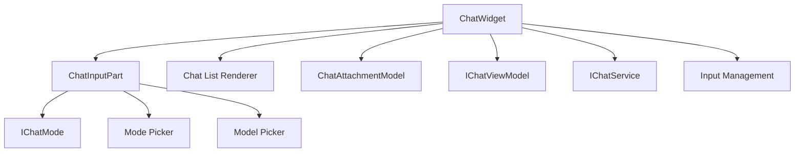
Key properties and methods:

-   `input`: Instance of `ChatInputPart` managing user input and attachments
-   `viewModel`: `IChatViewModel` containing the session data and UI state
-   `acceptInput(query?, options?)`: Submits the current input as a chat request
-   `setInput(query?)` / `getInput()`: Manages the input field content
-   `focusInput()` / `focusResponseItem()`: Controls focus within the widget
-   `parsedInput`: `IParsedChatRequest` containing the parsed agent, command, and text
-   `attachmentModel`: Manages file attachments and context items

**Sources:**

-   [src/vs/workbench/contrib/chat/browser/chat.ts250-311](https://github.com/microsoft/vscode/blob/1be3088d/src/vs/workbench/contrib/chat/browser/chat.ts#L250-L311)
-   [src/vs/workbench/contrib/chat/browser/actions/chatExecuteActions.ts46-147](https://github.com/microsoft/vscode/blob/1be3088d/src/vs/workbench/contrib/chat/browser/actions/chatExecuteActions.ts#L46-L147)

### Chat Locations and Context

Chat widgets can appear in different locations, each with specific behavior:

| Location | Value | Description |
| --- | --- | --- |
| `ChatAgentLocation.Chat` | `'panel'` | Main chat view (sidebar, editor, quick chat) |
| `ChatAgentLocation.Terminal` | `'terminal'` | Terminal-specific chat |
| `ChatAgentLocation.Notebook` | `'notebook'` | Notebook cell chat |
| `ChatAgentLocation.EditorInline` | `'editor'` | Inline chat in text editors |

**Sources:**

-   [src/vs/workbench/contrib/chat/common/constants.ts77-103](https://github.com/microsoft/vscode/blob/1be3088d/src/vs/workbench/contrib/chat/common/constants.ts#L77-L103)
-   [src/vs/workbench/contrib/chat/browser/chat.ts260](https://github.com/microsoft/vscode/blob/1be3088d/src/vs/workbench/contrib/chat/browser/chat.ts#L260-L260)

### Quick Chat Service

`IQuickChatService` provides a lightweight overlay chat interface that can be toggled without opening the full chat view.

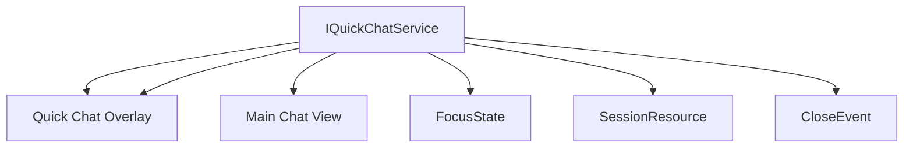
**Sources:**

-   [src/vs/workbench/contrib/chat/browser/chat.ts102-115](https://github.com/microsoft/vscode/blob/1be3088d/src/vs/workbench/contrib/chat/browser/chat.ts#L102-L115)
-   [src/vs/workbench/contrib/chat/browser/actions/chatActions.ts461-495](https://github.com/microsoft/vscode/blob/1be3088d/src/vs/workbench/contrib/chat/browser/actions/chatActions.ts#L461-L495)

## Chat Agents (Participants)

### Agent Registration and Implementation

Chat agents (also called participants) can be registered through the extension API. The registration flows from the extension host through the RPC protocol to the main thread.

> **[Mermaid sequence]**
> *(图表结构无法解析)*

**Agent Implementation Interface** (`IChatAgentImplementation`):

-   `invoke(request, progress, history, token)`: Handles the agent request and reports progress
-   `setRequestTools(requestId, tools)`: Updates which tools are enabled for a request
-   `provideFollowups(request, result, history, token)`: Provides suggested follow-up questions
-   `provideChatTitle(history, token)`: Generates a title for the conversation
-   `provideChatSummary(history, token)`: Provides a summary of the conversation

**Sources:**

-   [src/vs/workbench/api/common/extHostChatAgents2.ts462-478](https://github.com/microsoft/vscode/blob/1be3088d/src/vs/workbench/api/common/extHostChatAgents2.ts#L462-L478)
-   [src/vs/workbench/api/browser/mainThreadChatAgents2.ts182-211](https://github.com/microsoft/vscode/blob/1be3088d/src/vs/workbench/api/browser/mainThreadChatAgents2.ts#L182-L211)

### Agent Request Flow

When a user submits input, the request flows from the UI through multiple service layers, crosses the RPC boundary to the extension host, and returns streamed progress chunks.

**Complete Request Flow with RPC Protocol**

> **[Mermaid sequence]**
> *(图表结构无法解析)*

**Key Data Structures in Request Flow:**

| Layer | Type | Description |
| --- | --- | --- |
| ChatWidget | `string` | Raw input text |
| ChatWidget | `IParsedChatRequest` | Parsed agent, command, variables |
| ChatService | `IChatRequestModel` | Request with metadata |
| AgentService | `IChatAgentRequest` | Agent-specific request format |
| MainThread | `IChatAgentRequest (DTO)` | Serialized for RPC |
| ExtHost | `vscode.ChatRequest` | Extension API type |

**Sources:**

-   [src/vs/workbench/contrib/chat/browser/widget/chatWidget.ts500-600](https://github.com/microsoft/vscode/blob/1be3088d/src/vs/workbench/contrib/chat/browser/widget/chatWidget.ts#L500-L600)
-   [src/vs/workbench/contrib/chat/common/chatService/chatServiceImpl.ts200-400](https://github.com/microsoft/vscode/blob/1be3088d/src/vs/workbench/contrib/chat/common/chatService/chatServiceImpl.ts#L200-L400)
-   [src/vs/workbench/contrib/chat/common/participants/chatAgents.ts300-500](https://github.com/microsoft/vscode/blob/1be3088d/src/vs/workbench/contrib/chat/common/participants/chatAgents.ts#L300-L500)
-   [src/vs/workbench/api/browser/mainThreadChatAgents2.ts182-300](https://github.com/microsoft/vscode/blob/1be3088d/src/vs/workbench/api/browser/mainThreadChatAgents2.ts#L182-L300)
-   [src/vs/workbench/api/common/extHostChatAgents2.ts623-756](https://github.com/microsoft/vscode/blob/1be3088d/src/vs/workbench/api/common/extHostChatAgents2.ts#L623-L756)

### Response Streaming

Extensions stream responses through the `ChatResponseStream` API, which provides methods for each content type. The stream batches chunks in microtasks and sends them via RPC to the main thread.

**Response Streaming Architecture**

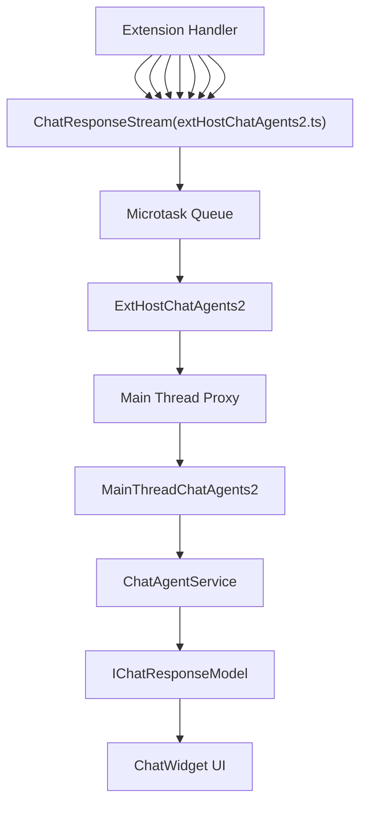
**Stream Content Types and DTOs:**

| Method | Creates | DTO Type | UI Rendering |
| --- | --- | --- | --- |
| `markdown(text)` | `IChatMarkdownContent` | `{ kind: 'markdownContent', content }` | Markdown renderer |
| `anchor(uri, title?)` | `IChatContentReference` | `{ kind: 'reference', reference }` | Clickable link |
| `button(command)` | `IChatCommandButton` | `{ kind: 'command', command }` | Button widget |
| `progress(text, task?)` | `IChatProgressMessage` | `{ kind: 'progressMessage', content }` | Progress indicator |
| `reference(uri, range?)` | `IChatContentReference` | `{ kind: 'reference', reference }` | File reference |
| `textEdit(uri, edits)` | `IChatTextEdit` | `{ kind: 'textEditGroup', edits }` | Diff editor |
| `confirmation(title, msg)` | `IChatConfirmation` | `{ kind: 'confirmation' }` | Confirmation dialog |
| `push(part)` | Various | Part-specific DTO | Renders based on part type |

**Batching and Performance:**

The `ChatResponseStream` uses a microtask queue to batch multiple stream calls into a single RPC message:

```
// In ChatResponseStream (extHostChatAgents2.ts)
const sendQueue: (IChatProgressDto | [IChatProgressDto, number])[] = [];

function send(chunk: IChatProgressDto) {
    const newLen = sendQueue.push(chunk);
    if (newLen === 1) {
        // First item schedules the microtask
        queueMicrotask(() => {
            proxy.$handleProgressChunk(requestId, sendQueue);
            sendQueue.length = 0; // Clear after sending
        });
    }
}
```
This ensures:

-   Multiple rapid calls are batched into one IPC message
-   Reduced overhead from RPC serialization
-   Better performance for streaming responses

**Sources:**

-   [src/vs/workbench/api/common/extHostChatAgents2.ts43-397](https://github.com/microsoft/vscode/blob/1be3088d/src/vs/workbench/api/common/extHostChatAgents2.ts#L43-L397)
-   [src/vs/workbench/api/common/extHostChatAgents2.ts88-105](https://github.com/microsoft/vscode/blob/1be3088d/src/vs/workbench/api/common/extHostChatAgents2.ts#L88-L105)
-   [src/vs/workbench/api/browser/mainThreadChatAgents2.ts262-474](https://github.com/microsoft/vscode/blob/1be3088d/src/vs/workbench/api/browser/mainThreadChatAgents2.ts#L262-L474)
-   [src/vs/workbench/contrib/chat/common/chatService/chatService.ts400-600](https://github.com/microsoft/vscode/blob/1be3088d/src/vs/workbench/contrib/chat/common/chatService/chatService.ts#L400-L600)

## Extension API

### ChatParticipant Registration

Extensions register chat participants using the `vscode.chat` namespace:

**API Structure:**

-   `vscode.chat.createChatParticipant(id, handler)`: Creates a new chat participant
-   `ChatParticipant`: API object with properties like `iconPath`, `followupProvider`, `titleProvider`
-   `ChatRequest`: Represents an incoming request with `prompt`, `command`, `variables`, and `tools`
-   `ChatResponseStream`: API for streaming response parts back to the UI

**Participant Handler:**

```
(request: ChatRequest, context: ChatContext, response: ChatResponseStream, token: CancellationToken)
    => ProviderResult<ChatResult>
```
**Sources:**

-   [src/vs/workbench/api/common/extHostChatAgents2.ts462-478](https://github.com/microsoft/vscode/blob/1be3088d/src/vs/workbench/api/common/extHostChatAgents2.ts#L462-L478)
-   [src/vscode-dts/vscode.proposed.chatParticipantAdditions.d.ts6-42](https://github.com/microsoft/vscode/blob/1be3088d/src/vscode-dts/vscode.proposed.chatParticipantAdditions.d.ts#L6-L42)

### Tools and Context

Chat participants can reference language model tools and receive context:

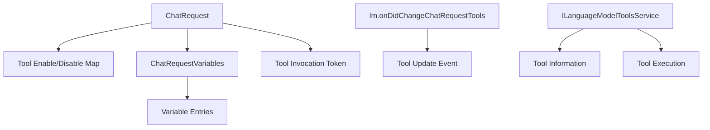
**Sources:**

-   [src/vscode-dts/vscode.proposed.chatParticipantAdditions.d.ts419-432](https://github.com/microsoft/vscode/blob/1be3088d/src/vscode-dts/vscode.proposed.chatParticipantAdditions.d.ts#L419-L432)
-   [src/vs/workbench/api/common/extHostChatAgents2.ts427-431](https://github.com/microsoft/vscode/blob/1be3088d/src/vs/workbench/api/common/extHostChatAgents2.ts#L427-L431)

## Chat Modes

Chat operates in different modes that determine agent behavior, available tools, and UI affordances. Modes are defined by `IChatMode` and managed by `IChatModeService`.

### Mode System Architecture

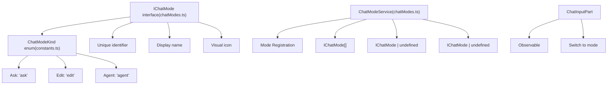
**Built-in Mode Definitions:**

| Mode Kind | ID | Label | Description | Tools Enabled |
| --- | --- | --- | --- | --- |
| `ChatModeKind.Ask` | `'chat-ask'` | "Ask" | Standard Q&A mode | Limited (search, workspace) |
| `ChatModeKind.Edit` | `'chat-edit'` | "Edit" | File modification mode | File operations, edits |
| `ChatModeKind.Agent` | `'chat-agent'` | "Agent" | Autonomous mode | All registered tools |

**Mode Interface:**

```
interface IChatMode {
    id: string;              // e.g., 'chat-ask'
    kind: ChatModeKind;      // Ask, Edit, or Agent
    label: string;           // Display name
    icon?: ThemeIcon;        // Icon for mode picker
    description?: string;    // Tooltip text
}
```
**Mode Configuration:**

Modes can be configured in settings and affect:

-   Which agents are available
-   Tool auto-approval policies
-   UI elements (submit button text, available commands)
-   Session behavior (checkpoints, undo/redo)

**Sources:**

-   [src/vs/workbench/contrib/chat/common/constants.ts43-66](https://github.com/microsoft/vscode/blob/1be3088d/src/vs/workbench/contrib/chat/common/constants.ts#L43-L66)
-   [src/vs/workbench/contrib/chat/common/chatModes.ts1-100](https://github.com/microsoft/vscode/blob/1be3088d/src/vs/workbench/contrib/chat/common/chatModes.ts#L1-L100)
-   [src/vs/workbench/contrib/chat/browser/widget/input/chatInputPart.ts200-300](https://github.com/microsoft/vscode/blob/1be3088d/src/vs/workbench/contrib/chat/browser/widget/input/chatInputPart.ts#L200-L300)
-   [src/vs/workbench/contrib/chat/browser/actions/chatExecuteActions.ts151-210](https://github.com/microsoft/vscode/blob/1be3088d/src/vs/workbench/contrib/chat/browser/actions/chatExecuteActions.ts#L151-L210)

### Mode Switching

Mode switching is handled through `ToggleChatModeAction` and the mode picker UI:

> **[Mermaid sequence]**
> *(图表结构无法解析)*

**Sources:**

-   [src/vs/workbench/contrib/chat/browser/actions/chatExecuteActions.ts242-328](https://github.com/microsoft/vscode/blob/1be3088d/src/vs/workbench/contrib/chat/browser/actions/chatExecuteActions.ts#L242-L328)
-   [src/vs/workbench/contrib/chat/browser/actions/chatExecuteActions.ts391-431](https://github.com/microsoft/vscode/blob/1be3088d/src/vs/workbench/contrib/chat/browser/actions/chatExecuteActions.ts#L391-L431)

## Voice Chat Integration

`VoiceChatService` integrates speech-to-text capabilities with chat, enabling voice input with automatic agent and command detection.

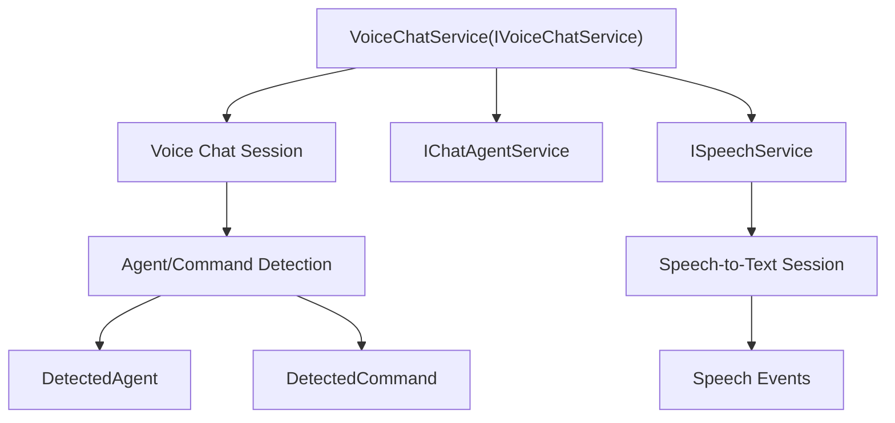
**Voice Detection Rules:**

-   Converts spoken phrases like "At workspace" to agent references: `@workspace`
-   Converts "slash fix" to slash commands: `/fix`
-   Strips punctuation and handles variations in capitalization
-   Sets `waitingForInput` flag when an agent or command is detected without additional text

**Sources:**

-   [src/vs/workbench/contrib/chat/test/common/voiceChatService.test.ts19](https://github.com/microsoft/vscode/blob/1be3088d/src/vs/workbench/contrib/chat/test/common/voiceChatService.test.ts#L19-L19)
-   [src/vs/workbench/contrib/chat/test/common/voiceChatService.test.ts141-342](https://github.com/microsoft/vscode/blob/1be3088d/src/vs/workbench/contrib/chat/test/common/voiceChatService.test.ts#L141-L342)

## Chat Entitlements and Quotas

### ChatEntitlementService

`IChatEntitlementService` manages user access levels, quotas, and feature availability for chat:

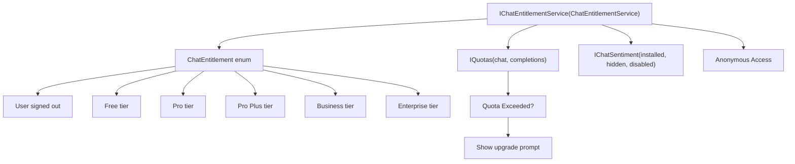
**Context Keys:**

-   `ChatEntitlementContextKeys.Entitlement.planFree`: True when user has Free plan
-   `ChatEntitlementContextKeys.chatQuotaExceeded`: True when chat quota exhausted
-   `ChatEntitlementContextKeys.completionsQuotaExceeded`: True when completions quota exhausted
-   `ChatEntitlementContextKeys.chatAnonymous`: True for anonymous access

**Sources:**

-   [src/vs/workbench/services/chat/common/chatEntitlementService.ts67-164](https://github.com/microsoft/vscode/blob/1be3088d/src/vs/workbench/services/chat/common/chatEntitlementService.ts#L67-L164)
-   [src/vs/workbench/services/chat/common/chatEntitlementService.ts35-65](https://github.com/microsoft/vscode/blob/1be3088d/src/vs/workbench/services/chat/common/chatEntitlementService.ts#L35-L65)

## Actions and Commands

### Primary Chat Actions

Key actions for chat interaction:

| Action ID | Class | Purpose |
| --- | --- | --- |
| `workbench.action.chat.open` | `PrimaryOpenChatGlobalAction` | Opens main chat view |
| `workbench.action.chat.newChat` | `NewChatEditorAction` | Creates new chat in editor |
| `workbench.action.chat.submit` | `ChatSubmitAction` | Submits current input |
| `workbench.action.chat.cancel` | `CancelAction` | Cancels in-progress request |
| `workbench.action.chat.toggleAgentMode` | `ToggleChatModeAction` | Switches between modes |
| `workbench.action.chat.openModelPicker` | `OpenModelPickerAction` | Opens model selection |
| `workbench.action.chat.openModePicker` | `OpenModePickerAction` | Opens agent/mode selection |

**Sources:**

-   [src/vs/workbench/contrib/chat/browser/actions/chatActions.ts72-80](https://github.com/microsoft/vscode/blob/1be3088d/src/vs/workbench/contrib/chat/browser/actions/chatActions.ts#L72-L80)
-   [src/vs/workbench/contrib/chat/browser/actions/chatActions.ts396-495](https://github.com/microsoft/vscode/blob/1be3088d/src/vs/workbench/contrib/chat/browser/actions/chatActions.ts#L396-L495)
-   [src/vs/workbench/contrib/chat/browser/actions/chatExecuteActions.ts151-209](https://github.com/microsoft/vscode/blob/1be3088d/src/vs/workbench/contrib/chat/browser/actions/chatExecuteActions.ts#L151-L209)

### Chat View Opening Options

The `OpenChatGlobalAction` and related actions support rich options for opening chat:

```
interface IChatViewOpenOptions {
    query: string;                    // Initial query text
    isPartialQuery?: boolean;         // Whether input is partial
    toolIds?: string[];               // Tool IDs to attach
    previousRequests?: IChatViewOpenRequestEntry[];  // History to prepopulate
    attachScreenshot?: boolean;       // Attach window screenshot
    attachFiles?: (URI | { uri: URI; range: IRange })[];  // Files to attach
    mode?: ChatModeKind | string;     // Mode to open in
    modelSelector?: ILanguageModelChatSelector;  // Model to use
    blockOnResponse?: boolean;        // Wait for response completion
}
```
**Sources:**

-   [src/vs/workbench/contrib/chat/browser/actions/chatActions.ts82-156](https://github.com/microsoft/vscode/blob/1be3088d/src/vs/workbench/contrib/chat/browser/actions/chatActions.ts#L82-L156)
-   [src/vs/workbench/contrib/chat/browser/actions/chatActions.ts176-361](https://github.com/microsoft/vscode/blob/1be3088d/src/vs/workbench/contrib/chat/browser/actions/chatActions.ts#L176-L361)

## Session Management

### Chat Session Providers

Chat sessions can be provided by different providers, enabling various backend implementations:

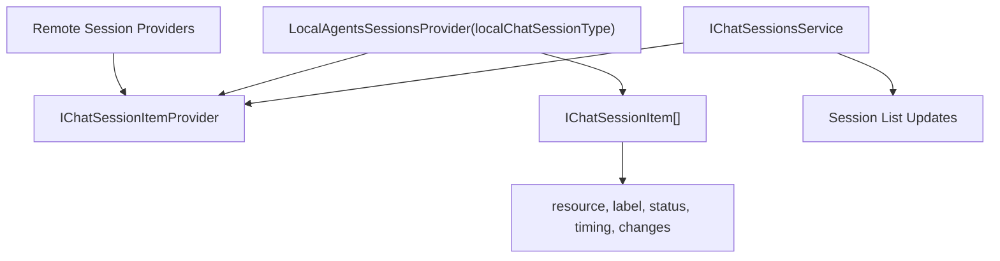
**Session Item Properties:**

-   `resource`: URI identifying the session
-   `label`: Display title
-   `status`: `ChatSessionStatus` (InProgress, Completed, Failed, NeedsInput)
-   `timing`: Request/response timing information
-   `changes`: File modification statistics (insertions, deletions, file count)

**Sources:**

-   [src/vs/workbench/contrib/chat/browser/agentSessions/localAgentSessionsProvider.ts23-163](https://github.com/microsoft/vscode/blob/1be3088d/src/vs/workbench/contrib/chat/browser/agentSessions/localAgentSessionsProvider.ts#L23-L163)
-   [src/vs/workbench/contrib/chat/browser/agentSessions/localAgentSessionsProvider.ts99-125](https://github.com/microsoft/vscode/blob/1be3088d/src/vs/workbench/contrib/chat/browser/agentSessions/localAgentSessionsProvider.ts#L99-L125)

### Session Transfer

Chat sessions can be transferred between workspaces:

> **[Mermaid sequence]**
> *(图表结构无法解析)*

**Sources:**

-   [src/vs/workbench/api/common/extHostChatAgents2.ts458-460](https://github.com/microsoft/vscode/blob/1be3088d/src/vs/workbench/api/common/extHostChatAgents2.ts#L458-L460)
-   [src/vs/workbench/api/browser/mainThreadChatAgents2.ts157-166](https://github.com/microsoft/vscode/blob/1be3088d/src/vs/workbench/api/browser/mainThreadChatAgents2.ts#L157-L166)
