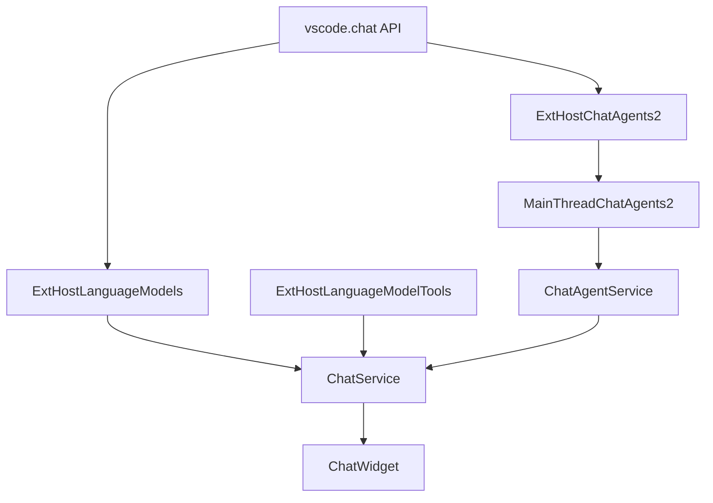
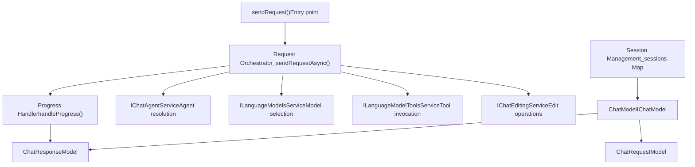
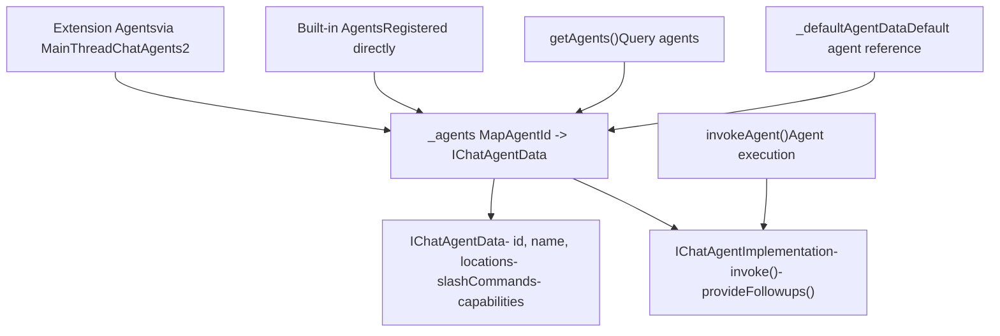
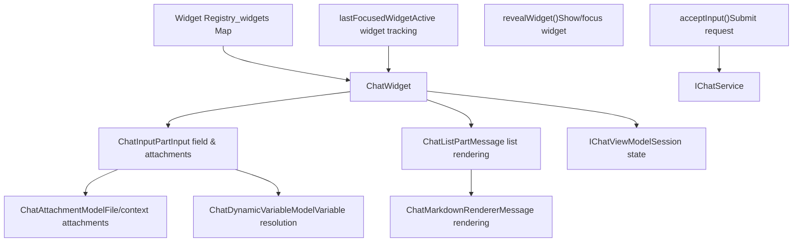
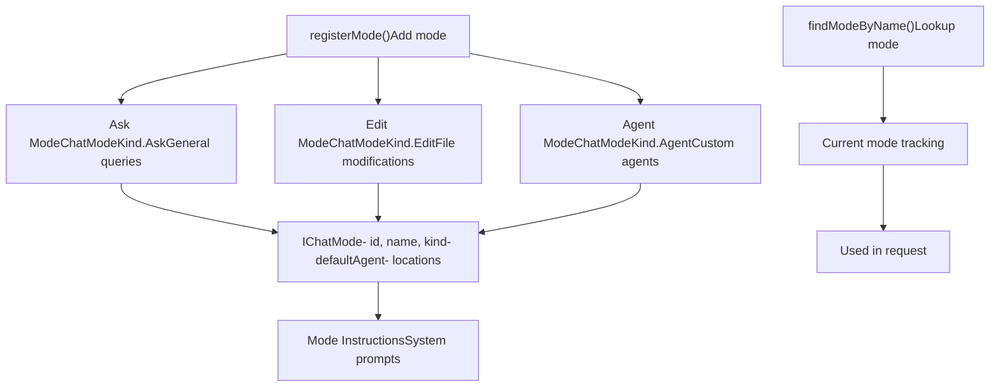
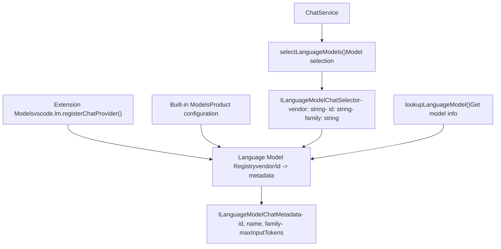
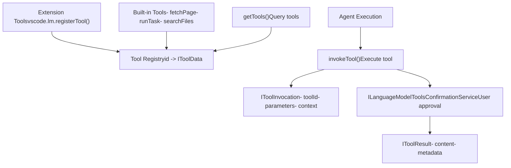
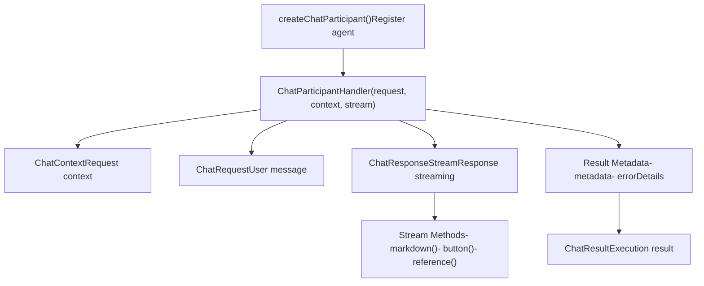

# Chat System Architecture

Relevant source files

-   [extensions/vscode-api-tests/package.json](https://github.com/microsoft/vscode/blob/1be3088d/extensions/vscode-api-tests/package.json)
-   [extensions/vscode-api-tests/src/singlefolder-tests/chat.test.ts](https://github.com/microsoft/vscode/blob/1be3088d/extensions/vscode-api-tests/src/singlefolder-tests/chat.test.ts)
-   [src/vs/editor/common/languages.ts](https://github.com/microsoft/vscode/blob/1be3088d/src/vs/editor/common/languages.ts)
-   [src/vs/platform/extensions/common/extensionsApiProposals.ts](https://github.com/microsoft/vscode/blob/1be3088d/src/vs/platform/extensions/common/extensionsApiProposals.ts)
-   [src/vs/workbench/api/browser/mainThreadChatAgents2.ts](https://github.com/microsoft/vscode/blob/1be3088d/src/vs/workbench/api/browser/mainThreadChatAgents2.ts)
-   [src/vs/workbench/api/browser/mainThreadChatStatus.ts](https://github.com/microsoft/vscode/blob/1be3088d/src/vs/workbench/api/browser/mainThreadChatStatus.ts)
-   [src/vs/workbench/api/browser/mainThreadLanguageFeatures.ts](https://github.com/microsoft/vscode/blob/1be3088d/src/vs/workbench/api/browser/mainThreadLanguageFeatures.ts)
-   [src/vs/workbench/api/common/extHost.api.impl.ts](https://github.com/microsoft/vscode/blob/1be3088d/src/vs/workbench/api/common/extHost.api.impl.ts)
-   [src/vs/workbench/api/common/extHost.protocol.ts](https://github.com/microsoft/vscode/blob/1be3088d/src/vs/workbench/api/common/extHost.protocol.ts)
-   [src/vs/workbench/api/common/extHostChatAgents2.ts](https://github.com/microsoft/vscode/blob/1be3088d/src/vs/workbench/api/common/extHostChatAgents2.ts)
-   [src/vs/workbench/api/common/extHostChatStatus.ts](https://github.com/microsoft/vscode/blob/1be3088d/src/vs/workbench/api/common/extHostChatStatus.ts)
-   [src/vs/workbench/api/common/extHostLanguageFeatures.ts](https://github.com/microsoft/vscode/blob/1be3088d/src/vs/workbench/api/common/extHostLanguageFeatures.ts)
-   [src/vs/workbench/api/common/extHostTypeConverters.ts](https://github.com/microsoft/vscode/blob/1be3088d/src/vs/workbench/api/common/extHostTypeConverters.ts)
-   [src/vs/workbench/api/common/extHostTypes.ts](https://github.com/microsoft/vscode/blob/1be3088d/src/vs/workbench/api/common/extHostTypes.ts)
-   [src/vs/workbench/contrib/chat/browser/actions/chatActions.ts](https://github.com/microsoft/vscode/blob/1be3088d/src/vs/workbench/contrib/chat/browser/actions/chatActions.ts)
-   [src/vs/workbench/contrib/chat/browser/actions/chatExecuteActions.ts](https://github.com/microsoft/vscode/blob/1be3088d/src/vs/workbench/contrib/chat/browser/actions/chatExecuteActions.ts)
-   [src/vs/workbench/contrib/chat/browser/actions/chatGettingStarted.ts](https://github.com/microsoft/vscode/blob/1be3088d/src/vs/workbench/contrib/chat/browser/actions/chatGettingStarted.ts)
-   [src/vs/workbench/contrib/chat/browser/chat.contribution.ts](https://github.com/microsoft/vscode/blob/1be3088d/src/vs/workbench/contrib/chat/browser/chat.contribution.ts)
-   [src/vs/workbench/contrib/chat/browser/chat.ts](https://github.com/microsoft/vscode/blob/1be3088d/src/vs/workbench/contrib/chat/browser/chat.ts)
-   [src/vs/workbench/contrib/chat/common/constants.ts](https://github.com/microsoft/vscode/blob/1be3088d/src/vs/workbench/contrib/chat/common/constants.ts)
-   [src/vs/workbench/contrib/chat/test/common/voiceChatService.test.ts](https://github.com/microsoft/vscode/blob/1be3088d/src/vs/workbench/contrib/chat/test/common/voiceChatService.test.ts)
-   [src/vscode-dts/vscode.d.ts](https://github.com/microsoft/vscode/blob/1be3088d/src/vscode-dts/vscode.d.ts)
-   [src/vscode-dts/vscode.proposed.chatParticipantAdditions.d.ts](https://github.com/microsoft/vscode/blob/1be3088d/src/vscode-dts/vscode.proposed.chatParticipantAdditions.d.ts)
-   [src/vscode-dts/vscode.proposed.chatStatusItem.d.ts](https://github.com/microsoft/vscode/blob/1be3088d/src/vscode-dts/vscode.proposed.chatStatusItem.d.ts)
-   [src/vscode-dts/vscode.proposed.defaultChatParticipant.d.ts](https://github.com/microsoft/vscode/blob/1be3088d/src/vscode-dts/vscode.proposed.defaultChatParticipant.d.ts)
-   [src/vscode-dts/vscode.proposed.inlineCompletionsAdditions.d.ts](https://github.com/microsoft/vscode/blob/1be3088d/src/vscode-dts/vscode.proposed.inlineCompletionsAdditions.d.ts)

## Purpose and Scope

This document describes the high-level architecture of VS Code's chat system, including its core services, multi-process design, and service interactions. For information about chat agents and participants, see [Chat Agents and Participants](/microsoft/vscode/8.2-chat-agents-and-participants). For details on UI components, see [Chat UI Components](/microsoft/vscode/8.4-chat-ui-components). For chat modes and session management, see [Chat Modes and Sessions](/microsoft/vscode/8.5-chat-modes-and-sessions).

The chat system enables AI-powered interactions within VS Code, supporting multiple chat modes (Ask, Edit, Agent), streaming responses, tool invocations, and extensibility through a public API.

## Core Services Registry

The chat system is built around a set of core services registered as singletons during workbench initialization:

| Service | Interface | Implementation | Purpose |
| --- | --- | --- | --- |
| Chat Service | `IChatService` | `ChatService` | Manages chat sessions, requests, and responses |
| Chat Agent Service | `IChatAgentService` | `ChatAgentService` | Registers and manages chat agents/participants |
| Chat Widget Service | `IChatWidgetService` | `ChatWidgetService` | Manages chat widget instances |
| Chat Mode Service | `IChatModeService` | `ChatModeService` | Handles chat mode switching (Ask/Edit/Agent) |
| Language Models Service | `ILanguageModelsService` | `LanguageModelsService` | Manages language model providers |
| Language Model Tools Service | `ILanguageModelToolsService` | `LanguageModelToolsService` | Registers and invokes tools |
| Chat Sessions Service | `IChatSessionsService` | \- | Manages agent session providers |
| Chat Variables Service | `IChatVariablesService` | `ChatVariablesService` | Handles context variables |
| Chat Editing Service | `IChatEditingService` | `ChatEditingService` | Manages edit mode and file modifications |

**Service Registration Diagram**

```mermaid
flowchart TD
    ContribRegistry["chat.contribution.tsService Registration"]
    ChatService["ChatServiceIChatService"]
    AgentService["ChatAgentServiceIChatAgentService"]
    WidgetService["ChatWidgetServiceIChatWidgetService"]
    ModeService["ChatModeServiceIChatModeService"]
    LMService["LanguageModelsServiceILanguageModelsService"]
    ToolsService["LanguageModelToolsServiceILanguageModelToolsService"]
    SessionsService["IChatSessionsService"]
    VariablesService["ChatVariablesServiceIChatVariablesService"]
    EditingService["ChatEditingServiceIChatEditingService"]

    ContribRegistry --> ChatService
    ContribRegistry --> AgentService
    ContribRegistry --> WidgetService
    ContribRegistry --> ModeService
    ContribRegistry --> LMService
    ContribRegistry --> ToolsService
    ContribRegistry --> SessionsService
    ContribRegistry --> VariablesService
    ContribRegistry --> EditingService
```

Sources: [src/vs/workbench/contrib/chat/browser/chat.contribution.ts20-62](https://github.com/microsoft/vscode/blob/1be3088d/src/vs/workbench/contrib/chat/browser/chat.contribution.ts#L20-L62)

## 多进程架构

The chat system follows VS Code's extension host architecture, splitting functionality between the main thread (UI process) and the extension host (isolated process) for security and stability:

**Extension Host Communication**

Sources: [src/vs/workbench/api/common/extHost.protocol.ts30-90](https://github.com/microsoft/vscode/blob/1be3088d/src/vs/workbench/api/common/extHost.protocol.ts#L30-L90) [src/vs/workbench/api/common/extHostChatAgents2.ts1-50](https://github.com/microsoft/vscode/blob/1be3088d/src/vs/workbench/api/common/extHostChatAgents2.ts#L1-L50) [src/vs/workbench/api/browser/mainThreadChatAgents2.ts1-50](https://github.com/microsoft/vscode/blob/1be3088d/src/vs/workbench/api/browser/mainThreadChatAgents2.ts#L1-L50)

### RPC Protocol Interfaces

The extension host and main thread communicate through typed RPC proxies:

**Extension Host Shape** (`ExtHostChatAgentsShape2`):

-   `$invokeAgent()` - Execute agent request
-   `$releaseSession()` - Clean up agent session
-   `$provideFollowups()` - Get followup suggestions
-   `$acceptFeedback()` - Handle user feedback
-   `$acceptAction()` - Process user actions

**Main Thread Shape** (`MainThreadChatAgentsShape2`):

-   `$registerAgent()` - Register chat participant
-   `$unregisterAgent()` - Remove chat participant
-   `$handleProgressChunk()` - Stream progress updates
-   `$registerAgentCompletionsProvider()` - Register @ completions

Sources: [src/vs/workbench/api/common/extHost.protocol.ts1147-1225](https://github.com/microsoft/vscode/blob/1be3088d/src/vs/workbench/api/common/extHost.protocol.ts#L1147-L1225)

## Chat Service Architecture

The `ChatService` is the central orchestrator that coordinates between agents, language models, and UI components:

**ChatService Core Components**

Sources: [src/vs/workbench/contrib/chat/common/chatService/chatServiceImpl.ts](https://github.com/microsoft/vscode/blob/1be3088d/src/vs/workbench/contrib/chat/common/chatService/chatServiceImpl.ts)

### Key ChatService Methods

| Method | Parameters | Returns | Purpose |
| --- | --- | --- | --- |
| `startSession()` | `location: ChatAgentLocation, token: CancellationToken` | `ChatModel` | Creates new chat session |
| `sendRequest()` | `sessionId: string, message: string, options: IChatSendRequestOptions` | `IChatSendRequestResponseState` | Sends chat request |
| `getSession()` | `sessionId: string` | `IChatModel` | Retrieves existing session |
| `removeRequest()` | `sessionId: string, requestId: string` | `Promise<void>` | Removes request from history |
| `adoptRequest()` | `sessionId: string, request: IChatRequestModel` | `void` | Adopts request from another session |

Sources: [src/vs/workbench/contrib/chat/common/chatService/chatService.ts104-265](https://github.com/microsoft/vscode/blob/1be3088d/src/vs/workbench/contrib/chat/common/chatService/chatService.ts#L104-L265)

## Agent Service Architecture

The `ChatAgentService` manages the registry of chat agents/participants and handles agent invocation:

**Agent Registry and Invocation**

Sources: [src/vs/workbench/contrib/chat/common/participants/chatAgents.ts1-500](https://github.com/microsoft/vscode/blob/1be3088d/src/vs/workbench/contrib/chat/common/participants/chatAgents.ts#L1-L500)

### Agent Lifecycle

1.  **Registration**: Extensions register agents via `vscode.chat.createChatParticipant()`
2.  **Discovery**: `ChatAgentService` maintains registry of available agents
3.  **Selection**: Agent selected based on `@` mention or default agent for mode
4.  **Invocation**: `invokeAgent()` called with request context
5.  **Streaming**: Agent streams progress chunks back through RPC
6.  **Completion**: Agent returns result with metadata

Sources: [src/vs/workbench/api/common/extHostChatAgents2.ts200-400](https://github.com/microsoft/vscode/blob/1be3088d/src/vs/workbench/api/common/extHostChatAgents2.ts#L200-L400)

## Widget Service and UI Layer

The `ChatWidgetService` manages the lifecycle of chat widget instances and coordinates between UI and business logic:

**Widget Architecture**

Sources: [src/vs/workbench/contrib/chat/browser/widget/chatWidget.ts1-200](https://github.com/microsoft/vscode/blob/1be3088d/src/vs/workbench/contrib/chat/browser/widget/chatWidget.ts#L1-L200) [src/vs/workbench/contrib/chat/browser/widget/chatWidgetService.ts1-100](https://github.com/microsoft/vscode/blob/1be3088d/src/vs/workbench/contrib/chat/browser/widget/chatWidgetService.ts#L1-L100)

### Widget Lifecycle

1.  **Creation**: Widget created for chat view or editor
2.  **Initialization**: ViewModel attached to session
3.  **Input Handling**: User types in `ChatInputPart`
4.  **Submission**: `acceptInput()` triggers `ChatService.sendRequest()`
5.  **Rendering**: `ChatListPart` renders streaming response
6.  **Disposal**: Widget disposed when view closed

Sources: [src/vs/workbench/contrib/chat/browser/chat.ts90-180](https://github.com/microsoft/vscode/blob/1be3088d/src/vs/workbench/contrib/chat/browser/chat.ts#L90-L180)

## Request and Response Flow

The complete flow from user input to rendered response:

**End-to-End Request Flow**

> **[Mermaid sequence]**
> *(图表结构无法解析)*

Sources: [src/vs/workbench/contrib/chat/common/chatService/chatServiceImpl.ts200-600](https://github.com/microsoft/vscode/blob/1be3088d/src/vs/workbench/contrib/chat/common/chatService/chatServiceImpl.ts#L200-L600) [src/vs/workbench/api/common/extHostChatAgents2.ts300-600](https://github.com/microsoft/vscode/blob/1be3088d/src/vs/workbench/api/common/extHostChatAgents2.ts#L300-L600)

## Mode System Integration

The `ChatModeService` enables switching between different chat modes (Ask, Edit, Agent):

**Mode Management**

Sources: [src/vs/workbench/contrib/chat/common/chatModes.ts1-200](https://github.com/microsoft/vscode/blob/1be3088d/src/vs/workbench/contrib/chat/common/chatModes.ts#L1-L200) [src/vs/workbench/contrib/chat/common/constants.ts51-66](https://github.com/microsoft/vscode/blob/1be3088d/src/vs/workbench/contrib/chat/common/constants.ts#L51-L66)

## Language Models Integration

The `LanguageModelsService` manages available language models and handles model selection:

**Language Model Architecture**

Sources: [src/vs/workbench/contrib/chat/common/languageModels.ts1-300](https://github.com/microsoft/vscode/blob/1be3088d/src/vs/workbench/contrib/chat/common/languageModels.ts#L1-L300)

### Model Selection Flow

When a chat request is submitted:

1.  **Explicit Selection**: If user selected a model in UI, use that model
2.  **Mode Default**: Otherwise, use default model for current mode
3.  **System Default**: Fall back to system default model
4.  **Validation**: Verify model supports required capabilities
5.  **Invocation**: Send request to selected model

Sources: [src/vs/workbench/contrib/chat/browser/actions/chatExecuteActions.ts175-225](https://github.com/microsoft/vscode/blob/1be3088d/src/vs/workbench/contrib/chat/browser/actions/chatExecuteActions.ts#L175-L225)

## Tools System Integration

The `LanguageModelToolsService` enables agents to invoke tools (functions) during execution:

**Tools Architecture**

Sources: [src/vs/workbench/contrib/chat/common/tools/languageModelToolsService.ts1-400](https://github.com/microsoft/vscode/blob/1be3088d/src/vs/workbench/contrib/chat/common/tools/languageModelToolsService.ts#L1-L400)

### Tool Invocation Flow

1.  **Tool Registration**: Extensions register tools with `vscode.lm.registerTool()`
2.  **Tool Discovery**: Agent queries available tools for request
3.  **Tool Selection**: Language model decides to invoke tool
4.  **Confirmation**: User approves tool invocation (if required)
5.  **Execution**: Tool handler executed with parameters
6.  **Result**: Tool result sent back to language model
7.  **Continuation**: Agent continues with tool result

Sources: [src/vs/workbench/contrib/chat/browser/tools/languageModelToolsService.ts1-400](https://github.com/microsoft/vscode/blob/1be3088d/src/vs/workbench/contrib/chat/browser/tools/languageModelToolsService.ts#L1-L400)

## Configuration and Settings

Key configuration options that control chat system behavior:

| Configuration Key | Type | Default | Purpose |
| --- | --- | --- | --- |
| `chat.agent.enabled` | boolean | true | Enable/disable agents |
| `chat.detectParticipant.enabled` | boolean | true | Auto-detect participant from input |
| `chat.editing.autoAcceptDelay` | number | 0 | Auto-accept edits delay (seconds) |
| `chat.tools.global.autoApprove` | boolean | false | Auto-approve all tool invocations |
| `chat.tools.edits.autoApprove` | object | {...} | Auto-approve edits by glob pattern |
| `chat.viewSessions.enabled` | boolean | true | Show session panel |
| `chat.undoRequests.restoreInput` | boolean | true | Restore input on undo |

Sources: [src/vs/workbench/contrib/chat/browser/chat.contribution.ts143-434](https://github.com/microsoft/vscode/blob/1be3088d/src/vs/workbench/contrib/chat/browser/chat.contribution.ts#L143-L434) [src/vs/workbench/contrib/chat/common/constants.ts11-46](https://github.com/microsoft/vscode/blob/1be3088d/src/vs/workbench/contrib/chat/common/constants.ts#L11-L46)

## Extension API Surface

The public API exposed to extensions through `vscode.chat`:

**Public API Structure**

Sources: [src/vscode-dts/vscode.d.ts18000-18600](https://github.com/microsoft/vscode/blob/1be3088d/src/vscode-dts/vscode.d.ts#L18000-L18600) [src/vscode-dts/vscode.proposed.chatParticipantPrivate.d.ts1-200](https://github.com/microsoft/vscode/blob/1be3088d/src/vscode-dts/vscode.proposed.chatParticipantPrivate.d.ts#L1-L200)

### Key API Types

**ChatParticipant**: Registered participant/agent

-   `id: string` - Unique identifier
-   `name: string` - Display name
-   `iconPath?: Uri | ThemeIcon` - Icon
-   `requestHandler: ChatRequestHandler` - Handler function
-   `followupProvider?: ChatFollowupProvider` - Followup suggestions

**ChatRequest**: Incoming user request

-   `prompt: string` - User message
-   `command?: string` - Slash command
-   `references: ChatPromptReference[]` - Context items
-   `location: ChatLocation` - Widget location

**ChatResponseStream**: Response streaming interface

-   `markdown(value: string | MarkdownString): void`
-   `button(command: Command): void`
-   `reference(value: Uri | Location): void`
-   `progress(value: string): void`

Sources: [src/vscode-dts/vscode.d.ts18100-18500](https://github.com/microsoft/vscode/blob/1be3088d/src/vscode-dts/vscode.d.ts#L18100-L18500)
