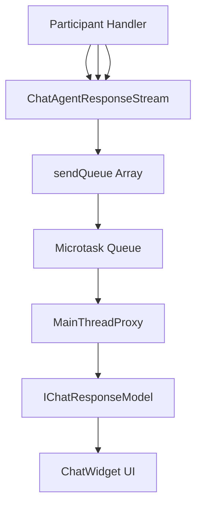
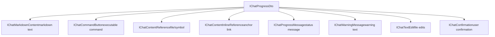
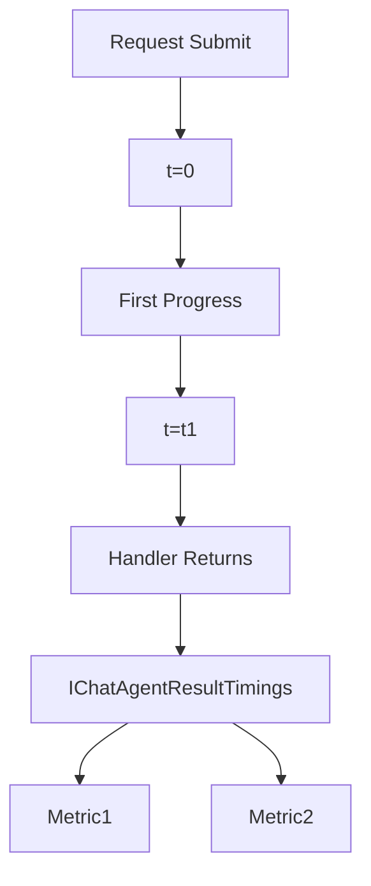
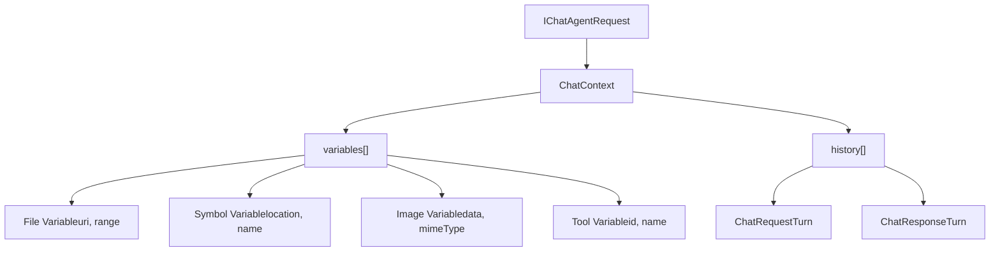

# Chat Request and Response Flow

Relevant source files

-   [extensions/vscode-api-tests/package.json](https://github.com/microsoft/vscode/blob/1be3088d/extensions/vscode-api-tests/package.json)
-   [extensions/vscode-api-tests/src/singlefolder-tests/chat.test.ts](https://github.com/microsoft/vscode/blob/1be3088d/extensions/vscode-api-tests/src/singlefolder-tests/chat.test.ts)
-   [src/vs/editor/common/languages.ts](https://github.com/microsoft/vscode/blob/1be3088d/src/vs/editor/common/languages.ts)
-   [src/vs/platform/extensions/common/extensionsApiProposals.ts](https://github.com/microsoft/vscode/blob/1be3088d/src/vs/platform/extensions/common/extensionsApiProposals.ts)
-   [src/vs/workbench/api/browser/mainThreadChatAgents2.ts](https://github.com/microsoft/vscode/blob/1be3088d/src/vs/workbench/api/browser/mainThreadChatAgents2.ts)
-   [src/vs/workbench/api/browser/mainThreadChatStatus.ts](https://github.com/microsoft/vscode/blob/1be3088d/src/vs/workbench/api/browser/mainThreadChatStatus.ts)
-   [src/vs/workbench/api/browser/mainThreadLanguageFeatures.ts](https://github.com/microsoft/vscode/blob/1be3088d/src/vs/workbench/api/browser/mainThreadLanguageFeatures.ts)
-   [src/vs/workbench/api/common/extHost.api.impl.ts](https://github.com/microsoft/vscode/blob/1be3088d/src/vs/workbench/api/common/extHost.api.impl.ts)
-   [src/vs/workbench/api/common/extHost.protocol.ts](https://github.com/microsoft/vscode/blob/1be3088d/src/vs/workbench/api/common/extHost.protocol.ts)
-   [src/vs/workbench/api/common/extHostChatAgents2.ts](https://github.com/microsoft/vscode/blob/1be3088d/src/vs/workbench/api/common/extHostChatAgents2.ts)
-   [src/vs/workbench/api/common/extHostChatStatus.ts](https://github.com/microsoft/vscode/blob/1be3088d/src/vs/workbench/api/common/extHostChatStatus.ts)
-   [src/vs/workbench/api/common/extHostLanguageFeatures.ts](https://github.com/microsoft/vscode/blob/1be3088d/src/vs/workbench/api/common/extHostLanguageFeatures.ts)
-   [src/vs/workbench/api/common/extHostTypeConverters.ts](https://github.com/microsoft/vscode/blob/1be3088d/src/vs/workbench/api/common/extHostTypeConverters.ts)
-   [src/vs/workbench/api/common/extHostTypes.ts](https://github.com/microsoft/vscode/blob/1be3088d/src/vs/workbench/api/common/extHostTypes.ts)
-   [src/vs/workbench/contrib/chat/browser/actions/chatActions.ts](https://github.com/microsoft/vscode/blob/1be3088d/src/vs/workbench/contrib/chat/browser/actions/chatActions.ts)
-   [src/vs/workbench/contrib/chat/browser/actions/chatExecuteActions.ts](https://github.com/microsoft/vscode/blob/1be3088d/src/vs/workbench/contrib/chat/browser/actions/chatExecuteActions.ts)
-   [src/vs/workbench/contrib/chat/browser/actions/chatGettingStarted.ts](https://github.com/microsoft/vscode/blob/1be3088d/src/vs/workbench/contrib/chat/browser/actions/chatGettingStarted.ts)
-   [src/vs/workbench/contrib/chat/browser/chat.contribution.ts](https://github.com/microsoft/vscode/blob/1be3088d/src/vs/workbench/contrib/chat/browser/chat.contribution.ts)
-   [src/vs/workbench/contrib/chat/browser/chat.ts](https://github.com/microsoft/vscode/blob/1be3088d/src/vs/workbench/contrib/chat/browser/chat.ts)
-   [src/vs/workbench/contrib/chat/common/constants.ts](https://github.com/microsoft/vscode/blob/1be3088d/src/vs/workbench/contrib/chat/common/constants.ts)
-   [src/vs/workbench/contrib/chat/test/common/voiceChatService.test.ts](https://github.com/microsoft/vscode/blob/1be3088d/src/vs/workbench/contrib/chat/test/common/voiceChatService.test.ts)
-   [src/vscode-dts/vscode.d.ts](https://github.com/microsoft/vscode/blob/1be3088d/src/vscode-dts/vscode.d.ts)
-   [src/vscode-dts/vscode.proposed.chatParticipantAdditions.d.ts](https://github.com/microsoft/vscode/blob/1be3088d/src/vscode-dts/vscode.proposed.chatParticipantAdditions.d.ts)
-   [src/vscode-dts/vscode.proposed.chatStatusItem.d.ts](https://github.com/microsoft/vscode/blob/1be3088d/src/vscode-dts/vscode.proposed.chatStatusItem.d.ts)
-   [src/vscode-dts/vscode.proposed.defaultChatParticipant.d.ts](https://github.com/microsoft/vscode/blob/1be3088d/src/vscode-dts/vscode.proposed.defaultChatParticipant.d.ts)
-   [src/vscode-dts/vscode.proposed.inlineCompletionsAdditions.d.ts](https://github.com/microsoft/vscode/blob/1be3088d/src/vscode-dts/vscode.proposed.inlineCompletionsAdditions.d.ts)

## Purpose and Scope

This document details the lifecycle of a chat request from user submission through response completion. It covers the request creation, validation, routing to participants, the streaming response protocol, progress reporting mechanisms, and state management.

For information about the chat system architecture and services, see [Chat System Architecture](/microsoft/vscode/8.1-chat-system-architecture). For details on chat agents and participant implementation, see [Chat Agents and Participants](/microsoft/vscode/8.2-chat-agents-and-participants). For UI component implementation, see [Chat UI Components](/microsoft/vscode/8.4-chat-ui-components).

---

## Request Submission Flow

When a user submits a chat request, the flow begins in the UI and propagates through multiple layers before reaching the extension host where participant handlers execute.

### High-Level Request Flow

> **[Mermaid sequence]**
> *(图表结构无法解析)*

**Sources:**

-   [src/vs/workbench/contrib/chat/browser/actions/chatExecuteActions.ts50-157](https://github.com/microsoft/vscode/blob/1be3088d/src/vs/workbench/contrib/chat/browser/actions/chatExecuteActions.ts#L50-L157)
-   [src/vs/workbench/contrib/chat/browser/widget/chatWidget.ts](https://github.com/microsoft/vscode/blob/1be3088d/src/vs/workbench/contrib/chat/browser/widget/chatWidget.ts)
-   [src/vs/workbench/api/common/extHostChatAgents2.ts1-50](https://github.com/microsoft/vscode/blob/1be3088d/src/vs/workbench/api/common/extHostChatAgents2.ts#L1-L50)
-   [src/vs/workbench/api/browser/mainThreadChatAgents2.ts1-100](https://github.com/microsoft/vscode/blob/1be3088d/src/vs/workbench/api/browser/mainThreadChatAgents2.ts#L1-L100)

### Request Creation and Context

The `ChatSubmitAction` class handles user submission. When invoked, it performs several operations:

1.  **Checks for pending delegation** - If the widget has a `pendingDelegationTarget`, it delegates to a remote session provider
2.  **Handles editing mode** - If in edit mode, manages undo/confirmation dialogs
3.  **Accepts input** - Calls `widget.acceptInput()` to process the request
4.  **Waits for response** - If `blockOnResponse` is set, waits until the response reaches a terminal state

The request object (`IChatAgentRequest`) contains:

-   `sessionId` - Unique identifier for the chat session
-   `requestId` - Unique identifier for this specific request
-   `agentId` - Target agent/participant identifier
-   `message` - The user's input text
-   `command` - Optional slash command
-   `variables` - Attached context items (files, symbols, etc.)
-   `location` - Where the chat is located (panel, editor, etc.)

**Sources:**

-   [src/vs/workbench/contrib/chat/browser/actions/chatExecuteActions.ts50-157](https://github.com/microsoft/vscode/blob/1be3088d/src/vs/workbench/contrib/chat/browser/actions/chatExecuteActions.ts#L50-L157)
-   [src/vs/workbench/api/common/extHost.protocol.ts57-67](https://github.com/microsoft/vscode/blob/1be3088d/src/vs/workbench/api/common/extHost.protocol.ts#L57-L67)

---

## Response Streaming Protocol

Chat responses are streamed incrementally to provide immediate feedback to users. The streaming mechanism uses a batching queue and microtask scheduling to optimize RPC calls.

### ChatAgentResponseStream Architecture


**Sources:**

-   [src/vs/workbench/api/common/extHostChatAgents2.ts42-155](https://github.com/microsoft/vscode/blob/1be3088d/src/vs/workbench/api/common/extHostChatAgents2.ts#L42-L155)
-   [src/vs/workbench/api/browser/mainThreadChatAgents2.ts200-250](https://github.com/microsoft/vscode/blob/1be3088d/src/vs/workbench/api/browser/mainThreadChatAgents2.ts#L200-L250)

### Response Stream Implementation

The `ChatAgentResponseStream` class provides the API surface for participants to stream response content. Key features:

**Batching Queue**

```
sendQueue: (IChatProgressDto | [IChatProgressDto, number])[]
```
Items are pushed into the queue and the first item schedules a microtask. This ensures multiple synchronous calls to `stream.markdown()` etc. are batched into a single RPC call.

**Progress Methods**

| Method | Purpose | DTO Type |
| --- | --- | --- |
| `markdown(value)` | Stream markdown content | `IChatMarkdownContent` |
| `anchor(value, title)` | Add hyperlink | `IChatContentInlineReference` |
| `button(command)` | Add command button | `IChatCommandButton` |
| `reference(value)` | Add file/symbol reference | `IChatContentReference` |
| `progress(value)` | Show progress message | `IChatProgressMessage` |
| `warning(value)` | Show warning message | `IChatWarningMessage` |
| `textEdit(target, edits)` | Stream text edits | `IChatTextEdit` |
| `push(part)` | Generic push | Any `ChatResponsePart` |

**Timing Tracking**

The stream tracks:

-   `_firstProgress` - Timestamp of first progress item
-   `_stopWatch` - Total elapsed time
-   Returns `IChatAgentResultTimings` with these metrics

**Sources:**

-   [src/vs/workbench/api/common/extHostChatAgents2.ts42-250](https://github.com/microsoft/vscode/blob/1be3088d/src/vs/workbench/api/common/extHostChatAgents2.ts#L42-L250)
-   [src/vs/workbench/api/common/extHost.protocol.ts62](https://github.com/microsoft/vscode/blob/1be3088d/src/vs/workbench/api/common/extHost.protocol.ts#L62-L62)

### Progress Chunk Protocol

> **[Mermaid sequence]**
> *(图表结构无法解析)*

**Sources:**

-   [src/vs/workbench/api/common/extHostChatAgents2.ts88-110](https://github.com/microsoft/vscode/blob/1be3088d/src/vs/workbench/api/common/extHostChatAgents2.ts#L88-L110)

---

## Progress Content Types

Chat responses support multiple content types, each with specific DTOs transferred across the RPC boundary.

### Core Progress Types


### Content Type Definitions

| Type | Structure | UI Rendering |
| --- | --- | --- |
| **Markdown** | `{ kind: 'markdownContent'; content: IMarkdownString }` | Rendered markdown with code highlighting |
| **Button** | `{ kind: 'command'; command: ICommandDto }` | Clickable button that executes command |
| **Reference** | `{ kind: 'reference'; reference: URI | Location; ... }` | Badge linking to file/symbol |
| **Inline Reference** | `{ kind: 'inlineReference'; inlineReference: URI | Location; name?: string }` | Inline hyperlink anchor |
| **Progress** | `{ kind: 'progressMessage'; content: IMarkdownString }` | Temporary status message |
| **Warning** | `{ kind: 'warning'; content: IMarkdownString }` | Warning badge with message |
| **Text Edit** | `{ kind: 'textEdit'; uri: URI; edits: TextEdit[] }` | Live file edit preview |
| **Confirmation** | `{ kind: 'confirmation'; title: string; message: string; ... }` | Modal requiring user input |

**Sources:**

-   [src/vs/workbench/api/common/extHost.protocol.ts62](https://github.com/microsoft/vscode/blob/1be3088d/src/vs/workbench/api/common/extHost.protocol.ts#L62-L62)
-   [src/vs/workbench/contrib/chat/common/chatService/chatService.ts1-100](https://github.com/microsoft/vscode/blob/1be3088d/src/vs/workbench/contrib/chat/common/chatService/chatService.ts#L1-L100)
-   [src/vs/workbench/api/common/extHostTypeConverters.ts45](https://github.com/microsoft/vscode/blob/1be3088d/src/vs/workbench/api/common/extHostTypeConverters.ts#L45-L45)

### Type Conversion Examples

The `extHostTypeConverters` module handles conversion between VS Code API types and internal DTOs:

**Markdown Content**

```
ChatMarkdownPart -> IChatMarkdownContent
{
  kind: 'markdownContent',
  content: { value: markdownString }
}
```
**Command Button**

```
ChatCommandButtonPart -> IChatCommandButton
{
  kind: 'command',
  command: { id, title, arguments }
}
```
**File Reference**

```
ChatResponseReferencePart -> IChatContentReference
{
  kind: 'reference',
  reference: URI | Location,
  iconPath: ThemeIcon | URI
}
```
**Sources:**

-   [src/vs/workbench/api/common/extHostTypeConverters.ts45-100](https://github.com/microsoft/vscode/blob/1be3088d/src/vs/workbench/api/common/extHostTypeConverters.ts#L45-L100)

---

## Request and Response State Machine

Chat requests and responses transition through well-defined states during their lifecycle.

### Response State Transitions

> **[Mermaid stateDiagram]**
> *(图表结构无法解析)*

### Response Model Properties

The `IChatResponseModel` tracks state through observable properties:

| Property | Type | Description |
| --- | --- | --- |
| `isComplete` | `boolean` | Response has finished (success or error) |
| `isCanceled` | `boolean` | Request was cancelled |
| `isPendingConfirmation` | `IObservable<boolean>` | Waiting for user confirmation |
| `response` | `IObservable<ReadonlyArray<IChatProgressResponseContent>>` | Array of response parts |
| `result` | `IChatAgentResult | undefined` | Final result with metadata |
| `onDidChange` | `Event<void>` | Fires when response updates |

**Sources:**

-   [src/vs/workbench/contrib/chat/common/model/chatModel.ts](https://github.com/microsoft/vscode/blob/1be3088d/src/vs/workbench/contrib/chat/common/model/chatModel.ts)
-   [src/vs/workbench/contrib/chat/browser/actions/chatExecuteActions.ts345-360](https://github.com/microsoft/vscode/blob/1be3088d/src/vs/workbench/contrib/chat/browser/actions/chatExecuteActions.ts#L345-L360)

### Blocking on Response Completion

When `blockOnResponse` is true, the submit action waits for terminal state:

```
const response = await resp;
if (response) {
  await new Promise<void>(resolve => {
    const d = response.onDidChange(() => {
      if (response.isComplete || response.isPendingConfirmation.get()) {
        d.dispose();
        resolve();
      }
    });
  });

  return {
    ...response.result,
    type: response.isPendingConfirmation.get() ? 'confirmation' : undefined
  };
}
```
This allows commands to wait for chat completion and access the final result.

**Sources:**

-   [src/vs/workbench/contrib/chat/browser/actions/chatExecuteActions.ts345-360](https://github.com/microsoft/vscode/blob/1be3088d/src/vs/workbench/contrib/chat/browser/actions/chatExecuteActions.ts#L345-L360)

---

## Cancellation Handling

Cancellation propagates through the request/response pipeline using `CancellationToken`.

### Cancellation Flow

> **[Mermaid sequence]**
> *(图表结构无法解析)*

### Token Handling in Handlers

Participant handlers should check `token.isCancellationRequested` and respond appropriately:

```
async handler(
  request: ChatRequest,
  context: ChatContext,
  stream: ChatResponseStream,
  token: CancellationToken
) {
  for (const item of longRunningOperation()) {
    if (token.isCancellationRequested) {
      stream.markdown("Operation cancelled");
      return { cancelled: true };
    }

    stream.progress(item.status);
    await processItem(item, token);
  }

  return {};
}
```
### Error vs Cancellation

The response model distinguishes between errors and cancellation:

-   **Error**: Handler throws an exception → `result.errorDetails` populated
-   **Cancellation**: Token cancelled → `isCanceled = true`, no error details
-   **User rejection**: Confirmation denied → `isCanceled = true`

**Sources:**

-   [src/vs/workbench/api/common/extHostChatAgents2.ts300-400](https://github.com/microsoft/vscode/blob/1be3088d/src/vs/workbench/api/common/extHostChatAgents2.ts#L300-L400)
-   [src/vs/workbench/contrib/chat/common/chatService/chatService.ts](https://github.com/microsoft/vscode/blob/1be3088d/src/vs/workbench/contrib/chat/common/chatService/chatService.ts)

---

## Timing and Telemetry

The response stream tracks timing metrics for performance analysis and telemetry.

### Timing Metrics Collection


### IChatAgentResultTimings Structure

```
interface IChatAgentResultTimings {
  firstProgress?: number;  // Time to first progress item
  totalElapsed: number;    // Total request duration
}
```
These timings are included in the final `IChatAgentResult` and used for:

-   Performance monitoring
-   Slowness detection
-   Telemetry events
-   User experience metrics

**Sources:**

-   [src/vs/workbench/api/common/extHostChatAgents2.ts44-67](https://github.com/microsoft/vscode/blob/1be3088d/src/vs/workbench/api/common/extHostChatAgents2.ts#L44-L67)
-   [src/vs/workbench/contrib/chat/common/participants/chatAgents.ts](https://github.com/microsoft/vscode/blob/1be3088d/src/vs/workbench/contrib/chat/common/participants/chatAgents.ts)

---

## Task and Progress Management

Some chat operations involve long-running tasks that require dedicated progress UIs.

### Task Creation Flow

> **[Mermaid sequence]**
> *(图表结构无法解析)*

**Task Handle API**

```
interface ChatResponseTaskHandle {
  progress(status: string): void;
  complete(result: string): void;
}
```
Tasks are rendered as expandable widgets in the chat UI showing:

-   Task title/description
-   Progress status updates
-   Final result or error
-   Timing information

**Sources:**

-   [src/vs/workbench/api/common/extHostChatAgents2.ts150-200](https://github.com/microsoft/vscode/blob/1be3088d/src/vs/workbench/api/common/extHostChatAgents2.ts#L150-L200)
-   [src/vs/workbench/contrib/chat/common/chatService/chatService.ts62](https://github.com/microsoft/vscode/blob/1be3088d/src/vs/workbench/contrib/chat/common/chatService/chatService.ts#L62-L62)

---

## Request Context and Variables

Chat requests carry context from the UI including attached files, selected code, and variable references.

### Context Structure


### Variable Types

| Variable Kind | Properties | Usage |
| --- | --- | --- |
| **file** | `uri: URI, range?: Range` | File attachment or selection |
| **symbol** | `location: Location, name: string` | Code symbol reference |
| **image** | `data: Uint8Array, mimeType: string` | Screenshot or image |
| **tool** | `id: string, name: string` | Tool reference |
| **text** | `value: string` | Plain text snippet |

Variables are accessed via:

```
for (const variable of request.variables) {
  if (variable.kind === 'file') {
    const content = await workspace.openTextDocument(variable.uri);
    // Process file content
  }
}
```
**Sources:**

-   [src/vs/workbench/contrib/chat/common/attachments/chatVariableEntries.ts](https://github.com/microsoft/vscode/blob/1be3088d/src/vs/workbench/contrib/chat/common/attachments/chatVariableEntries.ts)
-   [src/vs/workbench/api/common/extHost.protocol.ts57-64](https://github.com/microsoft/vscode/blob/1be3088d/src/vs/workbench/api/common/extHost.protocol.ts#L57-L64)
-   [src/vscode-dts/vscode.d.ts17000-17100](https://github.com/microsoft/vscode/blob/1be3088d/src/vscode-dts/vscode.d.ts#L17000-L17100)

---

## Summary

The chat request and response flow implements a sophisticated streaming protocol that enables:

1.  **Efficient batching** - Multiple progress updates batched via microtask queue
2.  **Incremental rendering** - UI updates as content streams in
3.  **Rich content types** - Markdown, buttons, references, edits, and more
4.  **State management** - Clear state transitions from pending to complete
5.  **Cancellation support** - Proper cleanup when requests are cancelled
6.  **Timing telemetry** - Performance metrics for monitoring and optimization
7.  **Context propagation** - Variables and history flow through the request

This architecture ensures responsive user experience while maintaining clean separation between UI, service layer, and extension host.

**Sources:**

-   [src/vs/workbench/api/common/extHostChatAgents2.ts1-600](https://github.com/microsoft/vscode/blob/1be3088d/src/vs/workbench/api/common/extHostChatAgents2.ts#L1-L600)
-   [src/vs/workbench/contrib/chat/browser/actions/chatExecuteActions.ts1-200](https://github.com/microsoft/vscode/blob/1be3088d/src/vs/workbench/contrib/chat/browser/actions/chatExecuteActions.ts#L1-L200)
-   [src/vs/workbench/api/browser/mainThreadChatAgents2.ts1-300](https://github.com/microsoft/vscode/blob/1be3088d/src/vs/workbench/api/browser/mainThreadChatAgents2.ts#L1-L300)
-   [src/vs/workbench/contrib/chat/common/chatService/chatService.ts1-150](https://github.com/microsoft/vscode/blob/1be3088d/src/vs/workbench/contrib/chat/common/chatService/chatService.ts#L1-L150)
