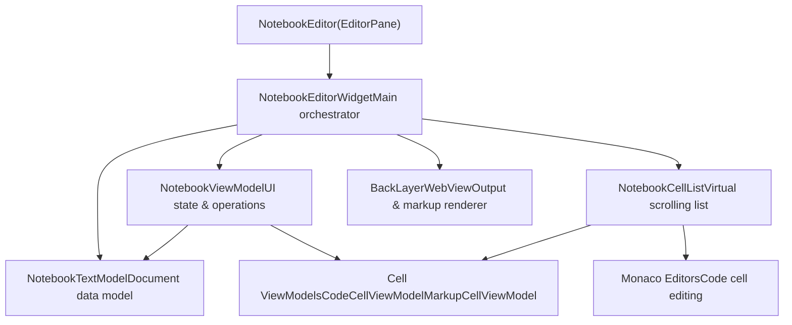
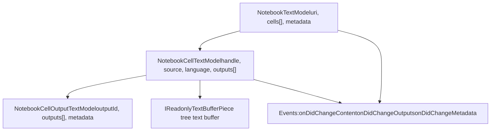
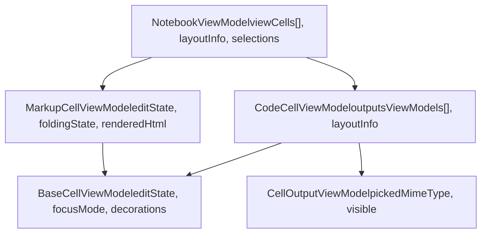
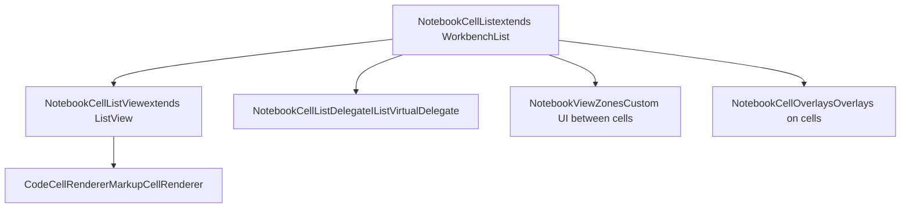
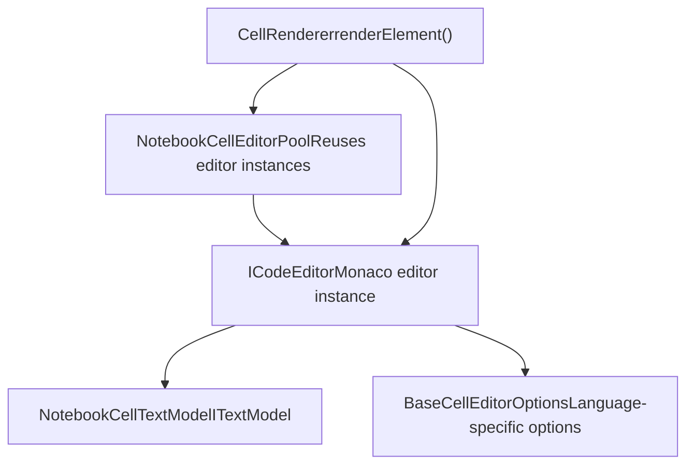
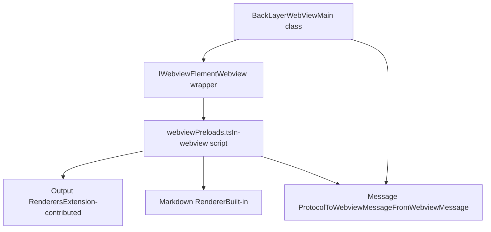
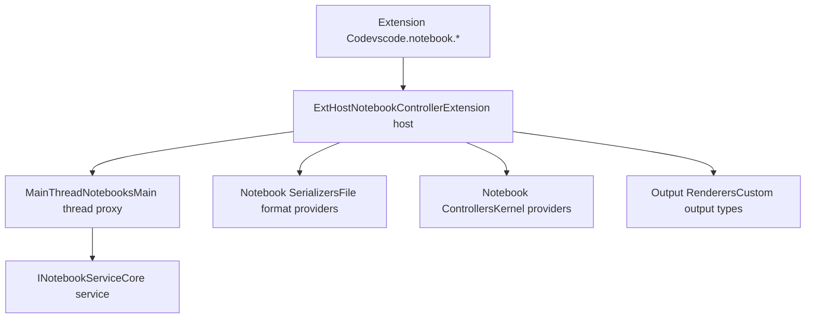
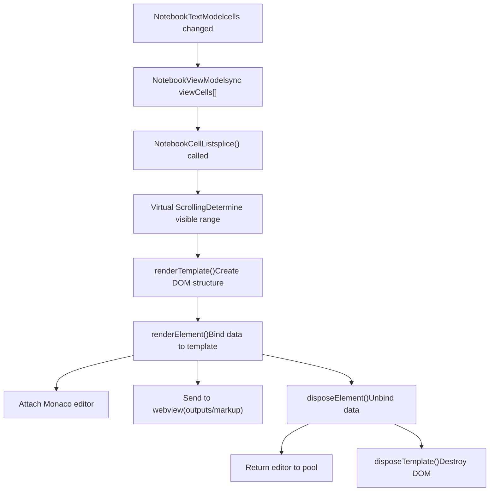

# Notebook Architecture Overview

Relevant source files

-   [extensions/markdown-language-features/notebook/index.ts](https://github.com/microsoft/vscode/blob/1be3088d/extensions/markdown-language-features/notebook/index.ts)
-   [src/vs/workbench/api/browser/mainThreadNotebook.ts](https://github.com/microsoft/vscode/blob/1be3088d/src/vs/workbench/api/browser/mainThreadNotebook.ts)
-   [src/vs/workbench/api/common/extHostNotebook.ts](https://github.com/microsoft/vscode/blob/1be3088d/src/vs/workbench/api/common/extHostNotebook.ts)
-   [src/vs/workbench/contrib/notebook/browser/media/notebook.css](https://github.com/microsoft/vscode/blob/1be3088d/src/vs/workbench/contrib/notebook/browser/media/notebook.css)
-   [src/vs/workbench/contrib/notebook/browser/notebook.contribution.ts](https://github.com/microsoft/vscode/blob/1be3088d/src/vs/workbench/contrib/notebook/browser/notebook.contribution.ts)
-   [src/vs/workbench/contrib/notebook/browser/notebookBrowser.ts](https://github.com/microsoft/vscode/blob/1be3088d/src/vs/workbench/contrib/notebook/browser/notebookBrowser.ts)
-   [src/vs/workbench/contrib/notebook/browser/notebookEditor.ts](https://github.com/microsoft/vscode/blob/1be3088d/src/vs/workbench/contrib/notebook/browser/notebookEditor.ts)
-   [src/vs/workbench/contrib/notebook/browser/notebookEditorWidget.ts](https://github.com/microsoft/vscode/blob/1be3088d/src/vs/workbench/contrib/notebook/browser/notebookEditorWidget.ts)
-   [src/vs/workbench/contrib/notebook/browser/view/notebookCellList.ts](https://github.com/microsoft/vscode/blob/1be3088d/src/vs/workbench/contrib/notebook/browser/view/notebookCellList.ts)
-   [src/vs/workbench/contrib/notebook/browser/view/renderers/backLayerWebView.ts](https://github.com/microsoft/vscode/blob/1be3088d/src/vs/workbench/contrib/notebook/browser/view/renderers/backLayerWebView.ts)
-   [src/vs/workbench/contrib/notebook/browser/view/renderers/cellRenderer.ts](https://github.com/microsoft/vscode/blob/1be3088d/src/vs/workbench/contrib/notebook/browser/view/renderers/cellRenderer.ts)
-   [src/vs/workbench/contrib/notebook/browser/view/renderers/webviewMessages.ts](https://github.com/microsoft/vscode/blob/1be3088d/src/vs/workbench/contrib/notebook/browser/view/renderers/webviewMessages.ts)
-   [src/vs/workbench/contrib/notebook/browser/view/renderers/webviewPreloads.ts](https://github.com/microsoft/vscode/blob/1be3088d/src/vs/workbench/contrib/notebook/browser/view/renderers/webviewPreloads.ts)
-   [src/vs/workbench/contrib/notebook/browser/viewModel/baseCellViewModel.ts](https://github.com/microsoft/vscode/blob/1be3088d/src/vs/workbench/contrib/notebook/browser/viewModel/baseCellViewModel.ts)
-   [src/vs/workbench/contrib/notebook/browser/viewModel/codeCellViewModel.ts](https://github.com/microsoft/vscode/blob/1be3088d/src/vs/workbench/contrib/notebook/browser/viewModel/codeCellViewModel.ts)
-   [src/vs/workbench/contrib/notebook/browser/viewModel/markupCellViewModel.ts](https://github.com/microsoft/vscode/blob/1be3088d/src/vs/workbench/contrib/notebook/browser/viewModel/markupCellViewModel.ts)
-   [src/vs/workbench/contrib/notebook/common/model/notebookCellTextModel.ts](https://github.com/microsoft/vscode/blob/1be3088d/src/vs/workbench/contrib/notebook/common/model/notebookCellTextModel.ts)
-   [src/vs/workbench/contrib/notebook/common/model/notebookTextModel.ts](https://github.com/microsoft/vscode/blob/1be3088d/src/vs/workbench/contrib/notebook/common/model/notebookTextModel.ts)
-   [src/vs/workbench/contrib/notebook/common/notebookCommon.ts](https://github.com/microsoft/vscode/blob/1be3088d/src/vs/workbench/contrib/notebook/common/notebookCommon.ts)
-   [src/vs/workbench/contrib/notebook/common/notebookEditorModel.ts](https://github.com/microsoft/vscode/blob/1be3088d/src/vs/workbench/contrib/notebook/common/notebookEditorModel.ts)
-   [src/vs/workbench/contrib/notebook/common/notebookService.ts](https://github.com/microsoft/vscode/blob/1be3088d/src/vs/workbench/contrib/notebook/common/notebookService.ts)

## Purpose and Scope

This document describes the core architecture of the Notebook Editor in VS Code. It covers the main components that enable interactive notebook editing, including the editor widget, data models, view models, rendering system, and webview integration. The notebook system supports multiple cell types (code and markup), cell outputs, and kernel integration.

For information about the extension API for notebooks, see the Extension System documentation. For details about kernel management and execution, see the relevant kernel service documentation.

## High-Level Architecture

The notebook architecture follows a Model-View-ViewModel pattern with a specialized dual-rendering system:

**Notebook Editor Architecture**

Sources: [src/vs/workbench/contrib/notebook/browser/notebookEditorWidget.ts142-476](https://github.com/microsoft/vscode/blob/1be3088d/src/vs/workbench/contrib/notebook/browser/notebookEditorWidget.ts#L142-L476) [src/vs/workbench/contrib/notebook/browser/notebookEditor.ts55-106](https://github.com/microsoft/vscode/blob/1be3088d/src/vs/workbench/contrib/notebook/browser/notebookEditor.ts#L55-L106) [src/vs/workbench/contrib/notebook/common/model/notebookTextModel.ts1-100](https://github.com/microsoft/vscode/blob/1be3088d/src/vs/workbench/contrib/notebook/common/model/notebookTextModel.ts#L1-L100)

## Core Components

### NotebookEditorWidget

The `NotebookEditorWidget` class is the central orchestrator for the notebook editor. It manages the lifecycle of all notebook components and coordinates between the model, view model, cell list, and webview.

**NotebookEditorWidget Responsibilities**

| Component | Responsibility |
| --- | --- |
| `_notebookViewModel` | Current view model instance |
| `_list` | Cell list (virtual scrolling) |
| `_webview` | BackLayerWebView for outputs |
| `_renderedEditors` | Map of cell to Monaco editor instances |
| `_notebookTopToolbar` | Toolbar component |
| `_viewContext` | Shared context for view components |

The widget creates and manages these components in its initialization:

Sources: [src/vs/workbench/contrib/notebook/browser/notebookEditorWidget.ts142-476](https://github.com/microsoft/vscode/blob/1be3088d/src/vs/workbench/contrib/notebook/browser/notebookEditorWidget.ts#L142-L476) [src/vs/workbench/contrib/notebook/browser/notebookEditorWidget.ts614-641](https://github.com/microsoft/vscode/blob/1be3088d/src/vs/workbench/contrib/notebook/browser/notebookEditorWidget.ts#L614-L641)

### NotebookTextModel and Cell Models

The data layer consists of `NotebookTextModel` which contains an array of cell models (`NotebookCellTextModel`).

**Data Model Hierarchy**

Key characteristics:

-   **NotebookTextModel** ([src/vs/workbench/contrib/notebook/common/model/notebookTextModel.ts103-200](https://github.com/microsoft/vscode/blob/1be3088d/src/vs/workbench/contrib/notebook/common/model/notebookTextModel.ts#L103-L200)): Manages cell array, handles edits via `applyEdits()`, emits change events
-   **NotebookCellTextModel** ([src/vs/workbench/contrib/notebook/common/model/notebookCellTextModel.ts26-150](https://github.com/microsoft/vscode/blob/1be3088d/src/vs/workbench/contrib/notebook/common/model/notebookCellTextModel.ts#L26-L150)): Represents a single cell with text content, metadata, outputs
-   **Undo/Redo**: Uses `StackOperation` for grouping edits and supports per-cell or per-document undo

Sources: [src/vs/workbench/contrib/notebook/common/model/notebookTextModel.ts103-350](https://github.com/microsoft/vscode/blob/1be3088d/src/vs/workbench/contrib/notebook/common/model/notebookTextModel.ts#L103-L350) [src/vs/workbench/contrib/notebook/common/model/notebookCellTextModel.ts26-150](https://github.com/microsoft/vscode/blob/1be3088d/src/vs/workbench/contrib/notebook/common/model/notebookCellTextModel.ts#L26-L150)

### NotebookViewModel and Cell ViewModels

The view model layer adds UI state and computed properties on top of the data model.

**ViewModel Architecture**

The view models provide:

-   **UI State**: Edit state, focus mode, selection state
-   **Layout Information**: Cell heights, editor dimensions, output container positions
-   **Event Handling**: State changes, layout changes, content changes
-   **Operations**: Find matches, decorations, selection management

Sources: [src/vs/workbench/contrib/notebook/browser/viewModel/notebookViewModelImpl.ts1-200](https://github.com/microsoft/vscode/blob/1be3088d/src/vs/workbench/contrib/notebook/browser/viewModel/notebookViewModelImpl.ts#L1-L200) [src/vs/workbench/contrib/notebook/browser/viewModel/codeCellViewModel.ts30-100](https://github.com/microsoft/vscode/blob/1be3088d/src/vs/workbench/contrib/notebook/browser/viewModel/codeCellViewModel.ts#L30-L100) [src/vs/workbench/contrib/notebook/browser/viewModel/markupCellViewModel.ts22-80](https://github.com/microsoft/vscode/blob/1be3088d/src/vs/workbench/contrib/notebook/browser/viewModel/markupCellViewModel.ts#L22-L80)

### NotebookCellList

The `NotebookCellList` extends `WorkbenchList` to provide virtual scrolling and rendering of notebook cells.

**Cell List Components**

Key features:

-   **Virtual Scrolling**: Only renders visible cells for performance
-   **Dynamic Heights**: Cells can have dynamic heights based on content
-   **View Zones**: Custom UI elements between cells (e.g., toolbars)
-   **Hidden Ranges**: Support for folded/collapsed cell ranges

Sources: [src/vs/workbench/contrib/notebook/browser/view/notebookCellList.ts80-200](https://github.com/microsoft/vscode/blob/1be3088d/src/vs/workbench/contrib/notebook/browser/view/notebookCellList.ts#L80-L200) [src/vs/workbench/contrib/notebook/browser/view/renderers/cellRenderer.ts57-110](https://github.com/microsoft/vscode/blob/1be3088d/src/vs/workbench/contrib/notebook/browser/view/renderers/cellRenderer.ts#L57-L110)

## Dual-Rendering System

The notebook editor uses two separate rendering systems for different purposes:

### Monaco Editors for Cell Editing

Each code cell and markdown cell in edit mode uses an independent Monaco editor instance.

**Monaco Editor Management**

**Editor Lifecycle**:

1.  `CellRenderer.renderElement()` requests editor from pool
2.  Editor is attached to DOM and configured
3.  Editor's model is set to cell's `ITextModel`
4.  On cell disposal, editor is returned to pool for reuse

Sources: [src/vs/workbench/contrib/notebook/browser/view/notebookCellEditorPool.ts1-100](https://github.com/microsoft/vscode/blob/1be3088d/src/vs/workbench/contrib/notebook/browser/view/notebookCellEditorPool.ts#L1-L100) [src/vs/workbench/contrib/notebook/browser/view/renderers/cellRenderer.ts237-300](https://github.com/microsoft/vscode/blob/1be3088d/src/vs/workbench/contrib/notebook/browser/view/renderers/cellRenderer.ts#L237-L300)

### BackLayerWebView for Outputs and Markdown

The `BackLayerWebView` is an iframe-based webview that renders:

-   **Cell Outputs**: Rich outputs from code execution (HTML, images, etc.)
-   **Markdown Previews**: Rendered markdown content

**Webview Architecture**

The webview is positioned absolutely and sized to match the notebook layout. It renders outputs and markup in the same coordinate space as the cell list, creating a seamless appearance.

Sources: [src/vs/workbench/contrib/notebook/browser/view/renderers/backLayerWebView.ts129-226](https://github.com/microsoft/vscode/blob/1be3088d/src/vs/workbench/contrib/notebook/browser/view/renderers/backLayerWebView.ts#L129-L226) [src/vs/workbench/contrib/notebook/browser/view/renderers/webviewPreloads.ts92-500](https://github.com/microsoft/vscode/blob/1be3088d/src/vs/workbench/contrib/notebook/browser/view/renderers/webviewPreloads.ts#L92-L500)

## Webview Communication Protocol

Communication between the main thread and the webview uses a bidirectional message protocol.

**Message Flow**

> **[Mermaid sequence]**
> *(图表结构无法解析)*

**Key Message Types**:

| Direction | Message Type | Purpose |
| --- | --- | --- |
| To Webview | `createOutput` | Create and render an output |
| To Webview | `showOutput` | Make output visible |
| To Webview | `hideOutput` | Hide output |
| To Webview | `updateMarkup` | Render markdown cell |
| From Webview | `dimension` | Report rendered size |
| From Webview | `outputFocus` | Output element focused |
| From Webview | `clicked-link` | Link clicked in output |

Sources: [src/vs/workbench/contrib/notebook/browser/view/renderers/webviewMessages.ts10-200](https://github.com/microsoft/vscode/blob/1be3088d/src/vs/workbench/contrib/notebook/browser/view/renderers/webviewMessages.ts#L10-L200) [src/vs/workbench/contrib/notebook/browser/view/renderers/backLayerWebView.ts605-750](https://github.com/microsoft/vscode/blob/1be3088d/src/vs/workbench/contrib/notebook/browser/view/renderers/backLayerWebView.ts#L605-L750)

## Extension Integration

Extensions interact with notebooks through the Extension Host API, which communicates with the main thread via RPC.

**Extension API Flow**

**Extension Capabilities**:

-   **Serializers**: Convert between file formats and `NotebookData`
-   **Controllers**: Execute cells and manage kernel state
-   **Renderers**: Custom output rendering in webview
-   **Document Access**: Read/write notebook content via API

Sources: [src/vs/workbench/api/common/extHostNotebook.ts43-150](https://github.com/microsoft/vscode/blob/1be3088d/src/vs/workbench/api/common/extHostNotebook.ts#L43-L150) [src/vs/workbench/api/browser/mainThreadNotebook.ts29-82](https://github.com/microsoft/vscode/blob/1be3088d/src/vs/workbench/api/browser/mainThreadNotebook.ts#L29-L82)

## Cell Lifecycle and Rendering

Understanding how cells are created, rendered, and disposed is crucial for performance.

**Cell Rendering Lifecycle**

**Performance Optimizations**:

-   **Editor Pool**: Monaco editors are reused across cells ([src/vs/workbench/contrib/notebook/browser/view/notebookCellEditorPool.ts](https://github.com/microsoft/vscode/blob/1be3088d/src/vs/workbench/contrib/notebook/browser/view/notebookCellEditorPool.ts))
-   **Idle Rendering**: Outputs are rendered during idle time ([src/vs/workbench/contrib/notebook/browser/view/renderers/backLayerWebView.ts140-163](https://github.com/microsoft/vscode/blob/1be3088d/src/vs/workbench/contrib/notebook/browser/view/renderers/backLayerWebView.ts#L140-L163))
-   **Virtual Scrolling**: Only visible cells are rendered
-   **Height Caching**: Cell heights are cached in view state

Sources: [src/vs/workbench/contrib/notebook/browser/view/renderers/cellRenderer.ts210-234](https://github.com/microsoft/vscode/blob/1be3088d/src/vs/workbench/contrib/notebook/browser/view/renderers/cellRenderer.ts#L210-L234) [src/vs/workbench/contrib/notebook/browser/view/notebookCellList.ts1-100](https://github.com/microsoft/vscode/blob/1be3088d/src/vs/workbench/contrib/notebook/browser/view/notebookCellList.ts#L1-L100)

## Component Initialization Flow

The initialization sequence establishes the complete notebook editor:

**Initialization Sequence**

> **[Mermaid sequence]**
> *(图表结构无法解析)*

Sources: [src/vs/workbench/contrib/notebook/browser/notebookEditor.ts197-300](https://github.com/microsoft/vscode/blob/1be3088d/src/vs/workbench/contrib/notebook/browser/notebookEditor.ts#L197-L300) [src/vs/workbench/contrib/notebook/browser/notebookEditorWidget.ts1100-1300](https://github.com/microsoft/vscode/blob/1be3088d/src/vs/workbench/contrib/notebook/browser/notebookEditorWidget.ts#L1100-L1300) [src/vs/workbench/contrib/notebook/browser/view/renderers/backLayerWebView.ts550-620](https://github.com/microsoft/vscode/blob/1be3088d/src/vs/workbench/contrib/notebook/browser/view/renderers/backLayerWebView.ts#L550-L620)

## Key Files Reference

| Component | Primary File | Line Range |
| --- | --- | --- |
| Editor Widget | `notebookEditorWidget.ts` | [142-2000](https://github.com/microsoft/vscode/blob/1be3088d/142-2000) |
| Text Model | `notebookTextModel.ts` | [103-1200](https://github.com/microsoft/vscode/blob/1be3088d/103-1200) |
| Cell Text Model | `notebookCellTextModel.ts` | [26-500](https://github.com/microsoft/vscode/blob/1be3088d/26-500) |
| View Model | `notebookViewModelImpl.ts` | [1-800](https://github.com/microsoft/vscode/blob/1be3088d/1-800) |
| Cell List | `notebookCellList.ts` | [80-1000](https://github.com/microsoft/vscode/blob/1be3088d/80-1000) |
| Webview | `backLayerWebView.ts` | [129-1500](https://github.com/microsoft/vscode/blob/1be3088d/129-1500) |
| Webview Preloads | `webviewPreloads.ts` | [92-2000](https://github.com/microsoft/vscode/blob/1be3088d/92-2000) |
| Cell Renderers | `cellRenderer.ts` | [57-450](https://github.com/microsoft/vscode/blob/1be3088d/57-450) |
| Code Cell ViewModel | `codeCellViewModel.ts` | [30-600](https://github.com/microsoft/vscode/blob/1be3088d/30-600) |
| Markup Cell ViewModel | `markupCellViewModel.ts` | [22-350](https://github.com/microsoft/vscode/blob/1be3088d/22-350) |

Sources: [src/vs/workbench/contrib/notebook/browser/notebookEditorWidget.ts](https://github.com/microsoft/vscode/blob/1be3088d/src/vs/workbench/contrib/notebook/browser/notebookEditorWidget.ts) [src/vs/workbench/contrib/notebook/common/model/notebookTextModel.ts](https://github.com/microsoft/vscode/blob/1be3088d/src/vs/workbench/contrib/notebook/common/model/notebookTextModel.ts) [src/vs/workbench/contrib/notebook/browser/view/notebookCellList.ts](https://github.com/microsoft/vscode/blob/1be3088d/src/vs/workbench/contrib/notebook/browser/view/notebookCellList.ts) [src/vs/workbench/contrib/notebook/browser/view/renderers/backLayerWebView.ts](https://github.com/microsoft/vscode/blob/1be3088d/src/vs/workbench/contrib/notebook/browser/view/renderers/backLayerWebView.ts)
