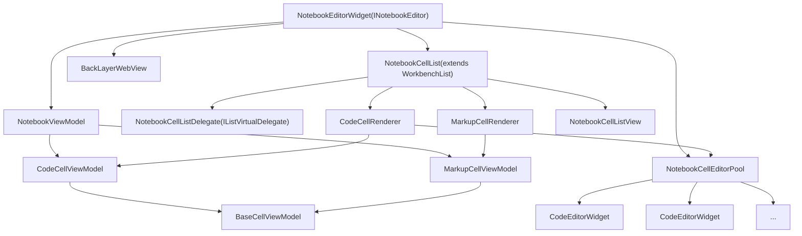
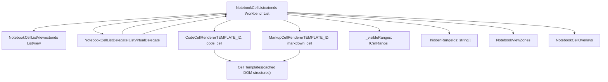
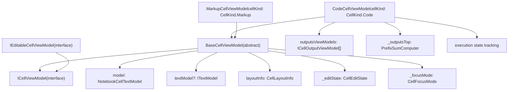
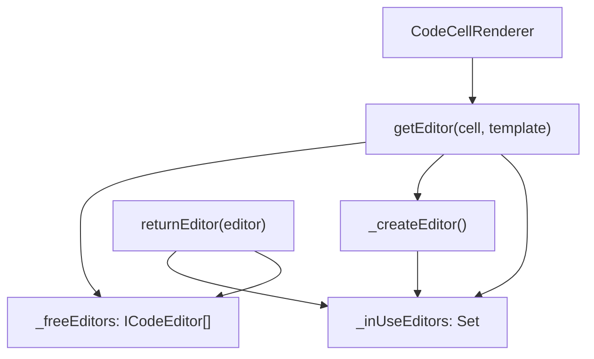
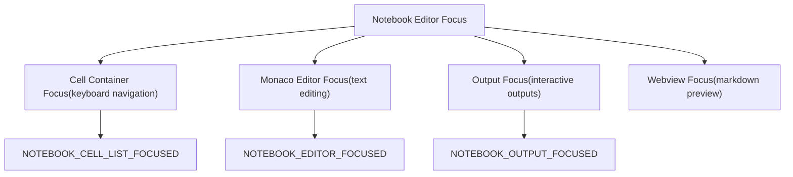

# Notebook Editor and Cell Management

Relevant source files

-   [extensions/markdown-language-features/notebook/index.ts](https://github.com/microsoft/vscode/blob/1be3088d/extensions/markdown-language-features/notebook/index.ts)
-   [src/vs/workbench/api/browser/mainThreadNotebook.ts](https://github.com/microsoft/vscode/blob/1be3088d/src/vs/workbench/api/browser/mainThreadNotebook.ts)
-   [src/vs/workbench/api/common/extHostNotebook.ts](https://github.com/microsoft/vscode/blob/1be3088d/src/vs/workbench/api/common/extHostNotebook.ts)
-   [src/vs/workbench/contrib/notebook/browser/media/notebook.css](https://github.com/microsoft/vscode/blob/1be3088d/src/vs/workbench/contrib/notebook/browser/media/notebook.css)
-   [src/vs/workbench/contrib/notebook/browser/notebook.contribution.ts](https://github.com/microsoft/vscode/blob/1be3088d/src/vs/workbench/contrib/notebook/browser/notebook.contribution.ts)
-   [src/vs/workbench/contrib/notebook/browser/notebookBrowser.ts](https://github.com/microsoft/vscode/blob/1be3088d/src/vs/workbench/contrib/notebook/browser/notebookBrowser.ts)
-   [src/vs/workbench/contrib/notebook/browser/notebookEditor.ts](https://github.com/microsoft/vscode/blob/1be3088d/src/vs/workbench/contrib/notebook/browser/notebookEditor.ts)
-   [src/vs/workbench/contrib/notebook/browser/notebookEditorWidget.ts](https://github.com/microsoft/vscode/blob/1be3088d/src/vs/workbench/contrib/notebook/browser/notebookEditorWidget.ts)
-   [src/vs/workbench/contrib/notebook/browser/view/notebookCellList.ts](https://github.com/microsoft/vscode/blob/1be3088d/src/vs/workbench/contrib/notebook/browser/view/notebookCellList.ts)
-   [src/vs/workbench/contrib/notebook/browser/view/renderers/backLayerWebView.ts](https://github.com/microsoft/vscode/blob/1be3088d/src/vs/workbench/contrib/notebook/browser/view/renderers/backLayerWebView.ts)
-   [src/vs/workbench/contrib/notebook/browser/view/renderers/cellRenderer.ts](https://github.com/microsoft/vscode/blob/1be3088d/src/vs/workbench/contrib/notebook/browser/view/renderers/cellRenderer.ts)
-   [src/vs/workbench/contrib/notebook/browser/view/renderers/webviewMessages.ts](https://github.com/microsoft/vscode/blob/1be3088d/src/vs/workbench/contrib/notebook/browser/view/renderers/webviewMessages.ts)
-   [src/vs/workbench/contrib/notebook/browser/view/renderers/webviewPreloads.ts](https://github.com/microsoft/vscode/blob/1be3088d/src/vs/workbench/contrib/notebook/browser/view/renderers/webviewPreloads.ts)
-   [src/vs/workbench/contrib/notebook/browser/viewModel/baseCellViewModel.ts](https://github.com/microsoft/vscode/blob/1be3088d/src/vs/workbench/contrib/notebook/browser/viewModel/baseCellViewModel.ts)
-   [src/vs/workbench/contrib/notebook/browser/viewModel/codeCellViewModel.ts](https://github.com/microsoft/vscode/blob/1be3088d/src/vs/workbench/contrib/notebook/browser/viewModel/codeCellViewModel.ts)
-   [src/vs/workbench/contrib/notebook/browser/viewModel/markupCellViewModel.ts](https://github.com/microsoft/vscode/blob/1be3088d/src/vs/workbench/contrib/notebook/browser/viewModel/markupCellViewModel.ts)
-   [src/vs/workbench/contrib/notebook/common/model/notebookCellTextModel.ts](https://github.com/microsoft/vscode/blob/1be3088d/src/vs/workbench/contrib/notebook/common/model/notebookCellTextModel.ts)
-   [src/vs/workbench/contrib/notebook/common/model/notebookTextModel.ts](https://github.com/microsoft/vscode/blob/1be3088d/src/vs/workbench/contrib/notebook/common/model/notebookTextModel.ts)
-   [src/vs/workbench/contrib/notebook/common/notebookCommon.ts](https://github.com/microsoft/vscode/blob/1be3088d/src/vs/workbench/contrib/notebook/common/notebookCommon.ts)
-   [src/vs/workbench/contrib/notebook/common/notebookEditorModel.ts](https://github.com/microsoft/vscode/blob/1be3088d/src/vs/workbench/contrib/notebook/common/notebookEditorModel.ts)
-   [src/vs/workbench/contrib/notebook/common/notebookService.ts](https://github.com/microsoft/vscode/blob/1be3088d/src/vs/workbench/contrib/notebook/common/notebookService.ts)

## Purpose and Scope

This document describes the notebook editor's core UI component and cell management system in VS Code. It covers the `NotebookEditorWidget` class, the cell list rendering architecture, cell view models, and the lifecycle of cells within the editor.

For information about the overall notebook architecture and services, see [Notebook Architecture Overview](/microsoft/vscode/9.1-notebook-architecture-overview). For details about the notebook data model and text models, see [Notebook Data Model](/microsoft/vscode/9.3-notebook-data-model). For output rendering specifics, see [Cell Outputs and WebView Rendering](/microsoft/vscode/9.4-cell-outputs-and-webview-rendering).

## NotebookEditorWidget Overview

The `NotebookEditorWidget` is the primary UI component for displaying and editing notebook documents. It orchestrates cell rendering, user interaction, and communication between the notebook view and underlying data model.

**Key Responsibilities:**

-   Managing the cell list and visible ranges
-   Coordinating between the webview (for outputs and markdown) and Monaco editors (for code input)
-   Handling user interactions (focus, selection, scrolling)
-   Managing the editor pool for efficient Monaco editor reuse
-   Synchronizing view state with the notebook view model

**Main Components:**

| Component | Type | Purpose |
| --- | --- | --- |
| `_list` | `INotebookCellList` | Virtual list managing cell rendering and scrolling |
| `_webview` | `BackLayerWebView` | Renders outputs and markdown previews |
| `_notebookViewModel` | `NotebookViewModel` | View model containing cell data and state |
| `_editorPool` | `NotebookCellEditorPool` | Pool of reusable Monaco editors |
| `_renderedEditors` | `Map<ICellViewModel, ICodeEditor>` | Tracks active editor instances |

Sources: [src/vs/workbench/contrib/notebook/browser/notebookEditorWidget.ts142-334](https://github.com/microsoft/vscode/blob/1be3088d/src/vs/workbench/contrib/notebook/browser/notebookEditorWidget.ts#L142-L334)

## Notebook Editor Architecture


**Notebook Editor Component Relationships**

Sources: [src/vs/workbench/contrib/notebook/browser/notebookEditorWidget.ts142-476](https://github.com/microsoft/vscode/blob/1be3088d/src/vs/workbench/contrib/notebook/browser/notebookEditorWidget.ts#L142-L476) [src/vs/workbench/contrib/notebook/browser/view/notebookCellList.ts80-132](https://github.com/microsoft/vscode/blob/1be3088d/src/vs/workbench/contrib/notebook/browser/view/notebookCellList.ts#L80-L132) [src/vs/workbench/contrib/notebook/browser/view/renderers/cellRenderer.ts87-254](https://github.com/microsoft/vscode/blob/1be3088d/src/vs/workbench/contrib/notebook/browser/view/renderers/cellRenderer.ts#L87-L254)

## Cell List Management

The `NotebookCellList` is a specialized virtual list that manages the rendering and display of notebook cells. It extends the `WorkbenchList` and provides notebook-specific functionality.

### Cell List Architecture


**Cell List Component Structure**

### Key Responsibilities

**Virtual List Management:**

-   Calculates which cells should be rendered based on scroll position
-   Manages cell height and layout calculations
-   Handles dynamic cell resizing

**Visible Range Tracking:**

-   Maintains `_visibleRanges` indicating which cells are currently visible
-   Fires `onDidChangeVisibleRanges` event when visibility changes
-   Supports hidden ranges for collapsed/folded sections

**Cell Focus and Selection:**

-   Tracks focused cell and selection ranges
-   Manages focus indicators and selection UI
-   Handles keyboard navigation between cells

**View Zones and Overlays:**

-   `NotebookViewZones`: Additional UI elements inserted between cells
-   `NotebookCellOverlays`: UI overlays on top of cells
-   Both support dynamic addition/removal via accessor APIs

Sources: [src/vs/workbench/contrib/notebook/browser/view/notebookCellList.ts80-1100](https://github.com/microsoft/vscode/blob/1be3088d/src/vs/workbench/contrib/notebook/browser/view/notebookCellList.ts#L80-L1100)

## Cell Rendering Pipeline

### Renderer Architecture

The notebook uses two specialized renderers that implement the `IListRenderer` interface:

**CodeCellRenderer** (`TEMPLATE_ID: 'code_cell'`):

-   Renders code cells with input editors and outputs
-   Creates execution order indicators and run buttons
-   Manages collapsed input/output states

**MarkupCellRenderer** (`TEMPLATE_ID: 'markdown_cell'`):

-   Renders markdown cells with preview and editor modes
-   Handles folding indicators
-   Manages markdown-specific UI elements

### Cell Template Structure


**Cell Template DOM Structure**

### Rendering Process

1.  **Template Creation** (`renderTemplate`):

    -   Creates reusable DOM structure
    -   Instantiates cell parts (toolbars, decorations, etc.)
    -   Sets up disposables for cleanup
    -   Returns template object for reuse
2.  **Element Rendering** (`renderElement`):

    -   Called when cell becomes visible
    -   Attaches cell view model to template
    -   Creates cell part instances (CodeCell, MarkupCell)
    -   Initializes Monaco editor if needed
3.  **Template Disposal** (`disposeTemplate`):

    -   Cleans up template resources
    -   Removes event listeners
4.  **Element Disposal** (`disposeElement`):

    -   Cleans up cell-specific resources
    -   Returns editor to pool if applicable

Sources: [src/vs/workbench/contrib/notebook/browser/view/renderers/cellRenderer.ts112-235](https://github.com/microsoft/vscode/blob/1be3088d/src/vs/workbench/contrib/notebook/browser/view/renderers/cellRenderer.ts#L112-L235) [src/vs/workbench/contrib/notebook/browser/view/renderers/cellRenderer.ts237-361](https://github.com/microsoft/vscode/blob/1be3088d/src/vs/workbench/contrib/notebook/browser/view/renderers/cellRenderer.ts#L237-L361)

## Cell View Models

Cell view models bridge the data model (`NotebookCellTextModel`) and the UI. They maintain presentation state, layout information, and handle user interactions.

### View Model Hierarchy


**Cell View Model Class Hierarchy**

### BaseCellViewModel

The `BaseCellViewModel` provides common functionality for all cell types:

**State Management:**

-   `_editState`: Tracks whether cell is in editing or preview mode
-   `_focusMode`: Indicates editor, container, or output focus
-   `editorAttached`: Whether a Monaco editor is currently attached

**Text Model Integration:**

-   Manages reference to `ITextModel` via `ITextModelService`
-   Handles text model lifecycle (creation, disposal)
-   Synchronizes text model state with cell model

**Layout Information:**

-   Maintains `layoutInfo` with dimensions and positioning
-   Fires `onDidChangeLayout` when layout updates
-   Handles dynamic height calculations

**Editor Operations:**

-   `getSelections()`, `setSelections()`: Manage cursor/selection state
-   `deltaModelDecorations()`: Add/remove decorations in editor
-   `resolveTextModel()`: Lazy-loads Monaco text model

Sources: [src/vs/workbench/contrib/notebook/browser/viewModel/baseCellViewModel.ts30-800](https://github.com/microsoft/vscode/blob/1be3088d/src/vs/workbench/contrib/notebook/browser/viewModel/baseCellViewModel.ts#L30-L800)

### CodeCellViewModel

Extends `BaseCellViewModel` with code execution and output management:

**Output Management:**

```
// Output view models track rendered outputs
outputsViewModels: ICellOutputViewModel[]

// Prefix sum computer for efficient output height calculations
private _outputsTop: PrefixSumComputer | null

// Methods
updateOutputHeight(index: number, height: number)
getOutputOffset(index: number): number
spliceOutputHeights(start: number, deleteCount: number, heights: number[])
```
**Execution State:**

-   Tracks running/pending/success/error states
-   Integrates with `INotebookExecutionStateService`
-   Fires `onDidStartExecution` and `onDidStopExecution` events

**Layout Calculations:**

-   Computes total height including outputs
-   Manages `outputContainerOffset` and `outputTotalHeight`
-   Handles output scrolling and "show more" container

Sources: [src/vs/workbench/contrib/notebook/browser/viewModel/codeCellViewModel.ts30-500](https://github.com/microsoft/vscode/blob/1be3088d/src/vs/workbench/contrib/notebook/browser/viewModel/codeCellViewModel.ts#L30-L500)

### MarkupCellViewModel

Extends `BaseCellViewModel` for markdown cells:

**Preview State:**

-   Tracks rendered HTML content
-   Manages preview vs edit mode
-   Handles folding state for nested markdown sections

**Layout Specifics:**

-   `previewHeight`: Height of rendered markdown
-   `foldHintHeight`: Height of folding UI
-   Simpler layout than code cells (no outputs)

**Edit State Transitions:**

-   `CellEditState.Preview`: Showing rendered markdown
-   `CellEditState.Editing`: Monaco editor visible
-   Transitions managed via `updateEditState()`

Sources: [src/vs/workbench/contrib/notebook/browser/viewModel/markupCellViewModel.ts22-300](https://github.com/microsoft/vscode/blob/1be3088d/src/vs/workbench/contrib/notebook/browser/viewModel/markupCellViewModel.ts#L22-L300)

## Cell Lifecycle Management

### Cell Creation and Initialization

> **[Mermaid sequence]**
> *(图表结构无法解析)*

**Cell Creation Sequence**

### Cell State Transitions

Cells transition through various states during their lifecycle:

**Edit States** (`CellEditState`):

-   `Preview`: Initial state, cell is not being edited
-   `Editing`: User is actively editing the cell

**Focus Modes** (`CellFocusMode`):

-   `Container`: Cell container has focus (keyboard navigation)
-   `Editor`: Monaco editor has focus (typing)
-   `Output`: Output area has focus (for interactive outputs)

**Layout States** (`CellLayoutState`):

-   `Uninitialized`: No layout calculated yet
-   `Estimated`: Height estimated based on content
-   `FromCache`: Using cached dimensions
-   `Measured`: Actual measured dimensions

### Cell Disposal

When cells are removed from view:

1.  **Element Disposal**: `disposeElement()` called on renderer

    -   Clears cell-specific event listeners
    -   Disposes element-specific resources
    -   Returns editor to pool
2.  **Cell Removal from List**:

    -   Fires `onDidRemoveCellsFromView` event
    -   Updates visible ranges
    -   Removes from rendered editors map
3.  **View Model Cleanup**:

    -   Detaches text model if present
    -   Disposes cell view model resources
    -   Removes from view model's cell array

Sources: [src/vs/workbench/contrib/notebook/browser/view/renderers/cellRenderer.ts228-234](https://github.com/microsoft/vscode/blob/1be3088d/src/vs/workbench/contrib/notebook/browser/view/renderers/cellRenderer.ts#L228-L234) [src/vs/workbench/contrib/notebook/browser/notebookEditorWidget.ts1489-1550](https://github.com/microsoft/vscode/blob/1be3088d/src/vs/workbench/contrib/notebook/browser/notebookEditorWidget.ts#L1489-L1550)

## Editor Pool and Reuse

The `NotebookCellEditorPool` manages Monaco editor instances to improve performance by reusing editors across cells.

### Editor Pool Architecture


**Editor Pool Management Flow**

**Key Operations:**

1.  **Get Editor**:

    -   Check free pool first
    -   Create new editor if pool empty
    -   Configure editor options for cell
    -   Track in `_inUseEditors`
2.  **Return Editor**:

    -   Detach text model
    -   Reset editor state
    -   Return to free pool
    -   Remove from `_inUseEditors`
3.  **Editor Limits**:

    -   Maximum number of editors constrained by configuration
    -   Old editors disposed when limit exceeded
    -   Warm-up creates editors proactively

Sources: [src/vs/workbench/contrib/notebook/browser/view/notebookCellEditorPool.ts1-200](https://github.com/microsoft/vscode/blob/1be3088d/src/vs/workbench/contrib/notebook/browser/view/notebookCellEditorPool.ts#L1-L200)

## Focus and Selection Management

### Focus Model

The notebook editor manages focus at multiple levels:


**Notebook Focus Hierarchy**

### Selection Management

Selections in notebooks use cell ranges (`ICellRange`):

```
interface ICellRange {
    start: number;  // inclusive
    end: number;    // exclusive
}
```
**Selection Operations:**

-   `getSelections()`: Returns array of selected cell ranges
-   `setSelections(ranges: ICellRange[])`: Updates selection
-   `reduceCellRanges()`: Merges overlapping ranges
-   `cellRangesToIndexes()`: Converts ranges to cell indices

**Selection State Types** (`SelectionStateType`):

-   `Handle`: Selection by cell handle (stable identifier)
-   `Index`: Selection by cell index (position in list)

Sources: [src/vs/workbench/contrib/notebook/browser/notebookEditorWidget.ts502-553](https://github.com/microsoft/vscode/blob/1be3088d/src/vs/workbench/contrib/notebook/browser/notebookEditorWidget.ts#L502-L553) [src/vs/workbench/contrib/notebook/common/notebookRange.ts1-200](https://github.com/microsoft/vscode/blob/1be3088d/src/vs/workbench/contrib/notebook/common/notebookRange.ts#L1-L200)

## Cell Scrolling and Revealing

### Reveal API

The `NotebookEditorWidget` provides APIs to scroll cells into view:

```
// Reveal cell types
enum CellRevealType {
    Default = 1,        // Scroll minimally
    Top = 2,            // Align to top
    Center = 3,         // Align to center
    CenterIfOutsideViewport = 4,  // Center only if not visible
    NearTopIfOutsideViewport = 5, // Near top if not visible
    FirstLineIfOutsideViewport = 6 // First line visible if not visible
}

// Main reveal method
async revealCellRangeInView(range: ICellRange, type: CellRevealType)
```
### Scroll Calculation

The notebook list uses several mechanisms for scroll positioning:

**Anchor-based Scrolling:**

-   `NotebookCellAnchor`: Tracks a reference cell during layout changes
-   Maintains scroll position relative to anchor cell
-   Updates when cells are added/removed above anchor

**View Range Calculation:**

-   Tracks `_visibleRanges` based on scroll position
-   Uses `getVisibleRangesPlusViewportAboveAndBelow()` for prefetching
-   Fires `onDidChangeVisibleRanges` for lazy rendering

Sources: [src/vs/workbench/contrib/notebook/browser/notebookEditorWidget.ts1736-1900](https://github.com/microsoft/vscode/blob/1be3088d/src/vs/workbench/contrib/notebook/browser/notebookEditorWidget.ts#L1736-L1900) [src/vs/workbench/contrib/notebook/browser/view/notebookCellList.ts300-600](https://github.com/microsoft/vscode/blob/1be3088d/src/vs/workbench/contrib/notebook/browser/view/notebookCellList.ts#L300-L600)

## Integration with Monaco Editor

### Editor Configuration

Each cell's Monaco editor is configured through `IBaseCellEditorOptions`:

**Option Sources:**

-   `BaseCellEditorOptions`: Default editor settings
-   `NotebookOptions`: Notebook-specific overrides
-   User configuration: Per-language settings
-   Cell metadata: Per-cell overrides

**Key Options:**

-   Line numbers: Controlled by cell configuration
-   Minimap: Usually disabled in notebooks
-   Scrollbar: Customized for cell context
-   Word wrap: Configurable per cell
-   Font settings: Inherited or overridden

### Editor Lifecycle

> **[Mermaid sequence]**
> *(图表结构无法解析)*

**Editor Attachment and Detachment Flow**

### Text Model Management

Text models are managed lazily:

1.  **Creation**: On first edit or explicit resolution
2.  **Caching**: Kept alive while cell is visible
3.  **Disposal**: When cell is hidden or removed
4.  **Serialization**: Changes synced back to `NotebookCellTextModel`

Sources: [src/vs/workbench/contrib/notebook/browser/viewModel/cellEditorOptions.ts1-300](https://github.com/microsoft/vscode/blob/1be3088d/src/vs/workbench/contrib/notebook/browser/viewModel/cellEditorOptions.ts#L1-L300) [src/vs/workbench/contrib/notebook/browser/viewModel/baseCellViewModel.ts200-400](https://github.com/microsoft/vscode/blob/1be3088d/src/vs/workbench/contrib/notebook/browser/viewModel/baseCellViewModel.ts#L200-L400)

## Cell Decorations and Status Bar

### Cell Decorations

Cells support various decoration types:

**Decoration Options** (`INotebookCellDecorationOptions`):

-   `className`: CSS class for cell container
-   `gutterClassName`: CSS class for gutter (left margin)
-   `outputClassName`: CSS class for output area
-   `topClassName`: CSS class for top border

**Overview Ruler Decorations:**

-   Display colored markers in cell list scrollbar
-   Indicate search results, errors, breakpoints
-   Support `NotebookOverviewRulerLane` positioning

### Status Bar Items

Code cells display status bar items at the bottom:

**Status Bar Components:**

-   Language indicator
-   Execution state (running, success, error)
-   Execution timing
-   Kernel information
-   Extension-contributed items

**Provider System:**

-   Extensions register via `INotebookCellStatusBarService`
-   Items can be cell-specific or global
-   Support priority ordering and alignment

Sources: [src/vs/workbench/contrib/notebook/browser/notebookBrowser.ts324-367](https://github.com/microsoft/vscode/blob/1be3088d/src/vs/workbench/contrib/notebook/browser/notebookBrowser.ts#L324-L367) [src/vs/workbench/contrib/notebook/common/notebookCellStatusBarService.ts1-200](https://github.com/microsoft/vscode/blob/1be3088d/src/vs/workbench/contrib/notebook/common/notebookCellStatusBarService.ts#L1-L200)

## Summary

The Notebook Editor and Cell Management system in VS Code is built on several key architectural patterns:

1.  **Virtual List Rendering**: The `NotebookCellList` efficiently renders only visible cells using a virtual scrolling approach with the `NotebookCellListDelegate`.

2.  **View Model Pattern**: Cell view models (`CodeCellViewModel`, `MarkupCellViewModel`) separate presentation concerns from the data model, managing layout, focus, and editor state.

3.  **Template Reuse**: Cell renderers create reusable DOM templates that are populated with different cells as they scroll into view.

4.  **Editor Pooling**: The `NotebookCellEditorPool` reuses Monaco editor instances across cells to optimize performance.

5.  **Multi-Layer Focus**: Focus management spans multiple levels (container, editor, output, webview) with appropriate context keys.

6.  **Lazy Resource Loading**: Text models and editors are created on-demand and disposed when cells leave the viewport.


This architecture enables VS Code to handle large notebooks efficiently while providing a rich editing experience comparable to standalone Monaco editors.

Sources: [src/vs/workbench/contrib/notebook/browser/notebookEditorWidget.ts142-2000](https://github.com/microsoft/vscode/blob/1be3088d/src/vs/workbench/contrib/notebook/browser/notebookEditorWidget.ts#L142-L2000) [src/vs/workbench/contrib/notebook/browser/view/notebookCellList.ts80-1100](https://github.com/microsoft/vscode/blob/1be3088d/src/vs/workbench/contrib/notebook/browser/view/notebookCellList.ts#L80-L1100) [src/vs/workbench/contrib/notebook/browser/view/renderers/cellRenderer.ts87-361](https://github.com/microsoft/vscode/blob/1be3088d/src/vs/workbench/contrib/notebook/browser/view/renderers/cellRenderer.ts#L87-L361) [src/vs/workbench/contrib/notebook/browser/viewModel/codeCellViewModel.ts30-500](https://github.com/microsoft/vscode/blob/1be3088d/src/vs/workbench/contrib/notebook/browser/viewModel/codeCellViewModel.ts#L30-L500) [src/vs/workbench/contrib/notebook/browser/viewModel/markupCellViewModel.ts22-300](https://github.com/microsoft/vscode/blob/1be3088d/src/vs/workbench/contrib/notebook/browser/viewModel/markupCellViewModel.ts#L22-L300)
