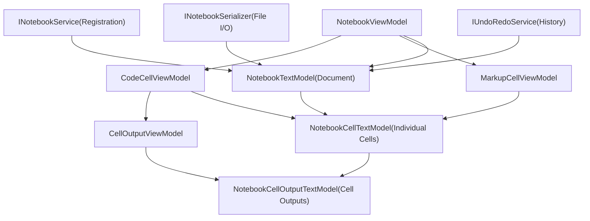
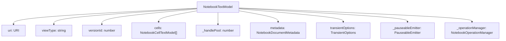
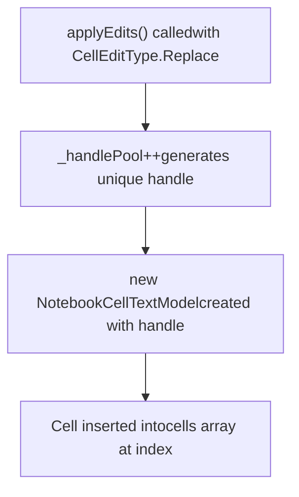
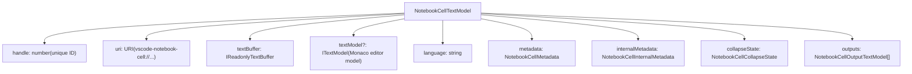
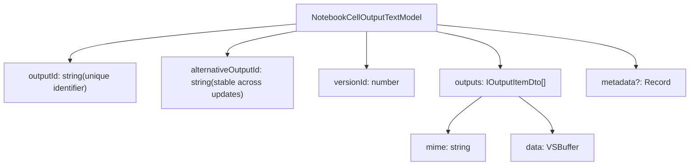
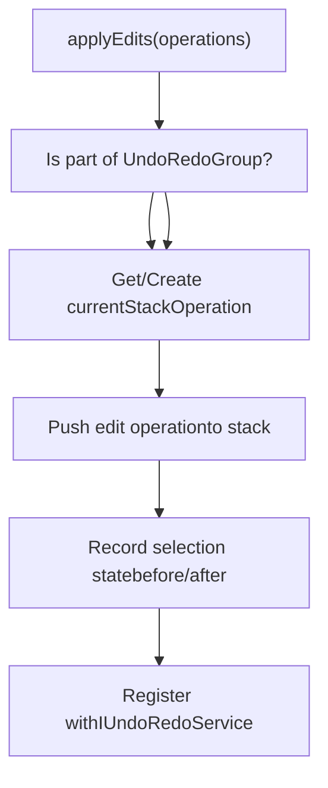
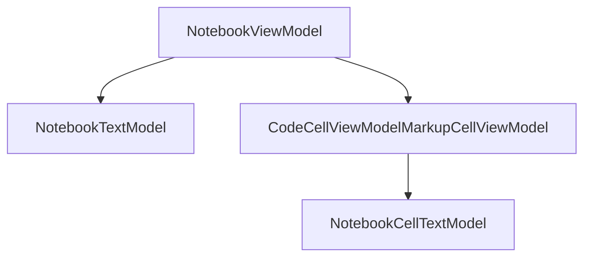

# Notebook Data Model

Relevant source files

-   [extensions/markdown-language-features/notebook/index.ts](https://github.com/microsoft/vscode/blob/1be3088d/extensions/markdown-language-features/notebook/index.ts)
-   [src/vs/workbench/api/browser/mainThreadNotebook.ts](https://github.com/microsoft/vscode/blob/1be3088d/src/vs/workbench/api/browser/mainThreadNotebook.ts)
-   [src/vs/workbench/api/common/extHostNotebook.ts](https://github.com/microsoft/vscode/blob/1be3088d/src/vs/workbench/api/common/extHostNotebook.ts)
-   [src/vs/workbench/contrib/notebook/browser/media/notebook.css](https://github.com/microsoft/vscode/blob/1be3088d/src/vs/workbench/contrib/notebook/browser/media/notebook.css)
-   [src/vs/workbench/contrib/notebook/browser/notebook.contribution.ts](https://github.com/microsoft/vscode/blob/1be3088d/src/vs/workbench/contrib/notebook/browser/notebook.contribution.ts)
-   [src/vs/workbench/contrib/notebook/browser/notebookBrowser.ts](https://github.com/microsoft/vscode/blob/1be3088d/src/vs/workbench/contrib/notebook/browser/notebookBrowser.ts)
-   [src/vs/workbench/contrib/notebook/browser/notebookEditor.ts](https://github.com/microsoft/vscode/blob/1be3088d/src/vs/workbench/contrib/notebook/browser/notebookEditor.ts)
-   [src/vs/workbench/contrib/notebook/browser/notebookEditorWidget.ts](https://github.com/microsoft/vscode/blob/1be3088d/src/vs/workbench/contrib/notebook/browser/notebookEditorWidget.ts)
-   [src/vs/workbench/contrib/notebook/browser/view/notebookCellList.ts](https://github.com/microsoft/vscode/blob/1be3088d/src/vs/workbench/contrib/notebook/browser/view/notebookCellList.ts)
-   [src/vs/workbench/contrib/notebook/browser/view/renderers/backLayerWebView.ts](https://github.com/microsoft/vscode/blob/1be3088d/src/vs/workbench/contrib/notebook/browser/view/renderers/backLayerWebView.ts)
-   [src/vs/workbench/contrib/notebook/browser/view/renderers/cellRenderer.ts](https://github.com/microsoft/vscode/blob/1be3088d/src/vs/workbench/contrib/notebook/browser/view/renderers/cellRenderer.ts)
-   [src/vs/workbench/contrib/notebook/browser/view/renderers/webviewMessages.ts](https://github.com/microsoft/vscode/blob/1be3088d/src/vs/workbench/contrib/notebook/browser/view/renderers/webviewMessages.ts)
-   [src/vs/workbench/contrib/notebook/browser/view/renderers/webviewPreloads.ts](https://github.com/microsoft/vscode/blob/1be3088d/src/vs/workbench/contrib/notebook/browser/view/renderers/webviewPreloads.ts)
-   [src/vs/workbench/contrib/notebook/browser/viewModel/baseCellViewModel.ts](https://github.com/microsoft/vscode/blob/1be3088d/src/vs/workbench/contrib/notebook/browser/viewModel/baseCellViewModel.ts)
-   [src/vs/workbench/contrib/notebook/browser/viewModel/codeCellViewModel.ts](https://github.com/microsoft/vscode/blob/1be3088d/src/vs/workbench/contrib/notebook/browser/viewModel/codeCellViewModel.ts)
-   [src/vs/workbench/contrib/notebook/browser/viewModel/markupCellViewModel.ts](https://github.com/microsoft/vscode/blob/1be3088d/src/vs/workbench/contrib/notebook/browser/viewModel/markupCellViewModel.ts)
-   [src/vs/workbench/contrib/notebook/common/model/notebookCellTextModel.ts](https://github.com/microsoft/vscode/blob/1be3088d/src/vs/workbench/contrib/notebook/common/model/notebookCellTextModel.ts)
-   [src/vs/workbench/contrib/notebook/common/model/notebookTextModel.ts](https://github.com/microsoft/vscode/blob/1be3088d/src/vs/workbench/contrib/notebook/common/model/notebookTextModel.ts)
-   [src/vs/workbench/contrib/notebook/common/notebookCommon.ts](https://github.com/microsoft/vscode/blob/1be3088d/src/vs/workbench/contrib/notebook/common/notebookCommon.ts)
-   [src/vs/workbench/contrib/notebook/common/notebookEditorModel.ts](https://github.com/microsoft/vscode/blob/1be3088d/src/vs/workbench/contrib/notebook/common/notebookEditorModel.ts)
-   [src/vs/workbench/contrib/notebook/common/notebookService.ts](https://github.com/microsoft/vscode/blob/1be3088d/src/vs/workbench/contrib/notebook/common/notebookService.ts)

## Purpose and Scope

This document describes the **data model layer** of VS Code's notebook system, which represents the structure and state of notebook documents. The notebook data model manages cells, outputs, metadata, and provides change tracking with undo/redo support. This layer is independent of the UI and handles the core data representation of `.ipynb` files and other notebook formats.

For information about:

-   The notebook editor UI and cell rendering, see [Notebook Editor and Cell Management](/microsoft/vscode/9.2-notebook-editor-and-cell-management)
-   Cell output rendering in webviews, see [Cell Outputs and WebView Rendering](/microsoft/vscode/9.4-cell-outputs-and-webview-rendering)
-   The notebook extension API and kernel management, see [Notebook Extension API](/microsoft/vscode/9.5-notebook-extension-api)

---

## Architecture Overview

The notebook data model consists of three primary layers that separate data representation from UI concerns:


**Sources:** [src/vs/workbench/contrib/notebook/common/model/notebookTextModel.ts1-100](https://github.com/microsoft/vscode/blob/1be3088d/src/vs/workbench/contrib/notebook/common/model/notebookTextModel.ts#L1-L100) [src/vs/workbench/contrib/notebook/browser/viewModel/notebookViewModelImpl.ts1-100](https://github.com/microsoft/vscode/blob/1be3088d/src/vs/workbench/contrib/notebook/browser/viewModel/notebookViewModelImpl.ts#L1-L100)

---

## NotebookTextModel

`NotebookTextModel` is the central class representing a complete notebook document. It manages the collection of cells, document metadata, and coordinates all changes with proper event notifications and undo/redo support.

### Core Structure

| Property | Type | Description |
| --- | --- | --- |
| `uri` | `URI` | The notebook document URI |
| `viewType` | `string` | Notebook type identifier (e.g., 'jupyter-notebook') |
| `cells` | `readonly NotebookCellTextModel[]` | Array of cell models |
| `metadata` | `NotebookDocumentMetadata` | Document-level metadata |
| `versionId` | `number` | Monotonically increasing version counter |
| `transientOptions` | `TransientOptions` | Configuration for transient data |


**Sources:** [src/vs/workbench/contrib/notebook/common/model/notebookTextModel.ts96-200](https://github.com/microsoft/vscode/blob/1be3088d/src/vs/workbench/contrib/notebook/common/model/notebookTextModel.ts#L96-L200)

### Cell Handle System

Each cell is assigned a unique **handle** (integer) that serves as its stable identifier throughout the notebook's lifetime, even as cells are moved or modified:


**Sources:** [src/vs/workbench/contrib/notebook/common/model/notebookTextModel.ts400-450](https://github.com/microsoft/vscode/blob/1be3088d/src/vs/workbench/contrib/notebook/common/model/notebookTextModel.ts#L400-L450)

### TransientOptions

`TransientOptions` determine which parts of the notebook are persisted to disk versus kept only in memory:

```
interface TransientOptions {
    readonly transientOutputs: boolean;           // If true, outputs aren't saved
    readonly transientCellMetadata: TransientCellMetadata;    // Which metadata keys are transient
    readonly transientDocumentMetadata: TransientDocumentMetadata; // Document metadata keys
    readonly cellContentMetadata: CellContentMetadata;  // Keys that affect cell content
}
```
**Sources:** [src/vs/workbench/contrib/notebook/common/notebookCommon.ts156-161](https://github.com/microsoft/vscode/blob/1be3088d/src/vs/workbench/contrib/notebook/common/notebookCommon.ts#L156-L161)

---

## NotebookCellTextModel

`NotebookCellTextModel` represents an individual cell within a notebook. Each cell has its own text model, metadata, outputs (for code cells), and change tracking.

### Cell Types

| Cell Kind | Purpose | Has Outputs | Text Content |
| --- | --- | --- | --- |
| `CellKind.Code` (2) | Executable code | Yes | Source code |
| `CellKind.Markup` (1) | Markdown/documentation | No | Markdown text |

**Sources:** [src/vs/workbench/contrib/notebook/common/notebookCommon.ts49-52](https://github.com/microsoft/vscode/blob/1be3088d/src/vs/workbench/contrib/notebook/common/notebookCommon.ts#L49-L52)

### Cell Structure


**Sources:** [src/vs/workbench/contrib/notebook/common/model/notebookCellTextModel.ts26-150](https://github.com/microsoft/vscode/blob/1be3088d/src/vs/workbench/contrib/notebook/common/model/notebookCellTextModel.ts#L26-L150)

### Cell URI Format

Cells use a special URI scheme for identification:

```
vscode-notebook-cell:/<notebookPath>#<cellHandle>
```
Example: `vscode-notebook-cell:/notebook.ipynb#W1`

The URI is generated by `CellUri.generate(notebookUri, handle)` and can be parsed back using `CellUri.parse(cellUri)`.

**Sources:** [src/vs/workbench/contrib/notebook/common/notebookCommon.ts611-620](https://github.com/microsoft/vscode/blob/1be3088d/src/vs/workbench/contrib/notebook/common/notebookCommon.ts#L611-L620)

### Cell Metadata

Cells have two types of metadata:

**User-Facing Metadata** (`NotebookCellMetadata`):

-   Custom key-value pairs stored in the notebook file
-   Defined by notebook format (e.g., Jupyter metadata)
-   Example: `{ "tags": ["parameters"], "collapsed": false }`

**Internal Metadata** (`NotebookCellInternalMetadata`):

-   Runtime execution state managed by VS Code
-   Not persisted to disk (transient)
-   Includes: `executionOrder`, `lastRunSuccess`, `runStartTime`, `runEndTime`

**Sources:** [src/vs/workbench/contrib/notebook/common/notebookCommon.ts116-138](https://github.com/microsoft/vscode/blob/1be3088d/src/vs/workbench/contrib/notebook/common/notebookCommon.ts#L116-L138)

---

## Cell Outputs

Code cells can produce outputs that are stored as `NotebookCellOutputTextModel` instances. Each output contains one or more output items with different MIME types.

### Output Structure


**Sources:** [src/vs/workbench/contrib/notebook/common/notebookCommon.ts229-245](https://github.com/microsoft/vscode/blob/1be3088d/src/vs/workbench/contrib/notebook/common/notebookCommon.ts#L229-L245)

### Output Items

Each output contains an array of `IOutputItemDto`, where each item represents the same output in a different MIME type format:

```
interface IOutputItemDto {
    readonly mime: string;      // e.g., 'text/plain', 'application/json', 'image/png'
    readonly data: VSBuffer;    // Binary data buffer
}
```
This allows renderers to choose the most appropriate format. For example, a data frame might have:

-   `text/plain`: "DataFrame with 100 rows"
-   `text/html`: Rich HTML table
-   `application/json`: Raw JSON data

**Sources:** [src/vs/workbench/contrib/notebook/common/notebookCommon.ts218-221](https://github.com/microsoft/vscode/blob/1be3088d/src/vs/workbench/contrib/notebook/common/notebookCommon.ts#L218-L221)

### Output Modification

Outputs support incremental updates:

| Operation | Method | Description |
| --- | --- | --- |
| Replace | `replaceData(items)` | Replace all output items |
| Append | `appendData(items)` | Add new output items (e.g., streaming output) |
| Get Appended | `appendedSinceVersion(versionId, mime)` | Get data appended since a specific version |

**Sources:** [src/vs/workbench/contrib/notebook/common/model/notebookCellOutputTextModel.ts40-90](https://github.com/microsoft/vscode/blob/1be3088d/src/vs/workbench/contrib/notebook/common/model/notebookCellOutputTextModel.ts#L40-L90)

---

## Edit Operations

Changes to the notebook are performed through `applyEdits()` with structured edit operations. This ensures proper change tracking, event notifications, and undo/redo support.

### Edit Types

```mermaid
flowchart TD
    ApplyEdits["notebookTextModel.applyEdits(edits)"]
    Replace["ICellReplaceEditInsert/Delete cells"]
    Move["ICellMoveEditMove cells"]
    Output["ICellOutputEditUpdate outputs"]
    OutputItems["ICellOutputItemEditUpdate output items"]
    Language["ICellLanguageEditChange language"]
    CellMetadata["ICellMetadataEditFull metadata replace"]
    PartialCellMeta["ICellPartialMetadataEditPartial metadata update"]
    InternalMeta["ICellPartialInternalMetadataEditInternal metadata update"]
    DocMetadata["IDocumentMetadataEditDocument metadata"]

    ApplyEdits --> Replace
    ApplyEdits --> Move
    ApplyEdits --> Output
    ApplyEdits --> OutputItems
    ApplyEdits --> Language
    ApplyEdits --> CellMetadata
    ApplyEdits --> PartialCellMeta
    ApplyEdits --> InternalMeta
    ApplyEdits --> DocMetadata
```


**Sources:** [src/vs/workbench/contrib/notebook/common/notebookCommon.ts462-570](https://github.com/microsoft/vscode/blob/1be3088d/src/vs/workbench/contrib/notebook/common/notebookCommon.ts#L462-L570)

### Example Edit Operations

**Adding a Cell:**

```
{
    editType: CellEditType.Replace,
    index: 2,              // Insert at position 2
    count: 0,              // Delete 0 cells
    cells: [{              // Add 1 new cell
        source: 'print("hello")',
        language: 'python',
        cellKind: CellKind.Code,
        outputs: [],
        metadata: {}
    }]
}
```
**Moving Cells:**

```
{
    editType: CellEditType.Move,
    index: 0,       // Start at cell 0
    length: 2,      // Move 2 cells
    newIdx: 5       // Move to position 5
}
```
**Updating Output:**

```
{
    editType: CellEditType.Output,
    handle: 123,    // Cell handle
    outputs: [{     // New output array
        outputId: 'output-456',
        outputs: [{
            mime: 'text/plain',
            data: VSBuffer.fromString('result')
        }]
    }],
    append: false   // Replace existing outputs
}
```
**Sources:** [src/vs/workbench/contrib/notebook/common/notebookCommon.ts485-567](https://github.com/microsoft/vscode/blob/1be3088d/src/vs/workbench/contrib/notebook/common/notebookCommon.ts#L485-L567)

---

## Change Events

The notebook data model emits fine-grained change events that allow observers to react to specific modifications.

### Event Hierarchy

```mermaid
flowchart TD
    TextModel["NotebookTextModelonDidChangeContent"]
    Initialize["NotebookCellsInitializeEventInitial cell load"]
    ModelChange["NotebookCellsModelChangedEventCells added/removed"]
    Move["NotebookCellsModelMoveEventCells reordered"]
    OutputChange["NotebookOutputChangedEventCell outputs changed"]
    OutputItemChange["NotebookOutputItemChangedEventOutput items changed"]
    ContentChange["NotebookCellContentChangeEventCell text changed"]
    MetaChange["NotebookCellsChangeMetadataEventCell metadata changed"]
    InternalMetaChange["NotebookCellsChangeInternalMetadataEventInternal metadata changed"]
    LanguageChange["NotebookCellsChangeLanguageEventCell language changed"]
    DocMetaChange["NotebookDocumentChangeMetadataEventDocument metadata changed"]

    TextModel --> Initialize
    TextModel --> ModelChange
    TextModel --> Move
    TextModel --> OutputChange
    TextModel --> OutputItemChange
    TextModel --> ContentChange
    TextModel --> MetaChange
    TextModel --> InternalMetaChange
    TextModel --> LanguageChange
    TextModel --> DocMetaChange
```


**Sources:** [src/vs/workbench/contrib/notebook/common/notebookCommon.ts337-421](https://github.com/microsoft/vscode/blob/1be3088d/src/vs/workbench/contrib/notebook/common/notebookCommon.ts#L337-L421)

### Event Batching

Changes are batched together and emitted as a single `NotebookTextModelChangedEvent`:

```
interface NotebookTextModelChangedEvent {
    readonly rawEvents: NotebookRawContentEvent[];  // Array of individual changes
    readonly versionId: number;                     // New version after changes
    readonly synchronous: boolean | undefined;      // Was change synchronous?
    readonly endSelectionState: ISelectionState | undefined;  // Selection after change
}
```
This allows efficient processing of multiple related changes (e.g., inserting multiple cells in one operation).

**Sources:** [src/vs/workbench/contrib/notebook/common/notebookCommon.ts451-456](https://github.com/microsoft/vscode/blob/1be3088d/src/vs/workbench/contrib/notebook/common/notebookCommon.ts#L451-L456)

---

## Undo/Redo System

The notebook data model integrates with VS Code's `IUndoRedoService` to provide multi-level undo/redo support. Changes are grouped into logical operations that can be undone/redone atomically.

### Undo Stack Management


**Sources:** [src/vs/workbench/contrib/notebook/common/model/notebookTextModel.ts33-95](https://github.com/microsoft/vscode/blob/1be3088d/src/vs/workbench/contrib/notebook/common/model/notebookTextModel.ts#L33-L95)

### Cell Edit Operations

Different edit types create different undo operations:

| Edit Type | Undo Operation Class | Undo Action |
| --- | --- | --- |
| Cell Replace | `SpliceCellsEdit` | Restores deleted cells, removes inserted cells |
| Cell Move | `MoveCellEdit` | Moves cells back to original position |
| Cell Metadata | `CellMetadataEdit` | Restores previous metadata |
| Output Change | Handled by `NotebookCellTextModel` | Restores previous output state |

**Sources:** [src/vs/workbench/contrib/notebook/common/model/cellEdit.ts1-250](https://github.com/microsoft/vscode/blob/1be3088d/src/vs/workbench/contrib/notebook/common/model/cellEdit.ts#L1-L250)

### Undo/Redo Per Cell

VS Code supports two undo modes controlled by `NotebookSetting.undoRedoPerCell`:

-   **Per-Cell Mode** (`true`): Each cell has its own undo stack (text edits don't affect other cells)
-   **Document Mode** (`false`): All changes share a single undo stack (default)

This is implemented via URI comparison keys that map cell URIs to their parent notebook URI.

**Sources:** [src/vs/workbench/contrib/notebook/browser/notebook.contribution.ts322-343](https://github.com/microsoft/vscode/blob/1be3088d/src/vs/workbench/contrib/notebook/browser/notebook.contribution.ts#L322-L343)

---

## Snapshot and Serialization

Notebooks support creating snapshots for backup and serialization for saving to disk.

### Creating Snapshots

```
interface INotebookSnapshotOptions {
    context: SnapshotContext;        // 'save' | 'backup'
    outputSizeLimit: number;         // Max output size in bytes
    transientOptions?: TransientOptions;
}

const snapshot: NotebookData = notebookTextModel.createSnapshot(options);
```
The snapshot process:

1.  Serializes all cell text buffers
2.  Filters outputs based on size limits
3.  Applies transient options to exclude non-persistent data
4.  Returns a `NotebookData` object with cells and metadata

**Sources:** [src/vs/workbench/contrib/notebook/common/model/notebookTextModel.ts217-280](https://github.com/microsoft/vscode/blob/1be3088d/src/vs/workbench/contrib/notebook/common/model/notebookTextModel.ts#L217-L280)

### NotebookData Structure

`NotebookData` is the serializable representation:

```
interface NotebookData {
    readonly cells: ICellDto2[];              // Cell data transfer objects
    readonly metadata: NotebookDocumentMetadata;
}

interface ICellDto2 {
    source: string;                           // Cell text content
    language: string;                         // Language ID
    mime: string | undefined;                 // Preferred MIME type
    cellKind: CellKind;                       // Code or Markup
    outputs: IOutputDto[];                    // Cell outputs
    metadata?: NotebookCellMetadata;          // User metadata
    internalMetadata?: NotebookCellInternalMetadata;  // Internal state
    collapseState?: NotebookCellCollapseState;        // UI collapse state
}
```
**Sources:** [src/vs/workbench/contrib/notebook/common/notebookCommon.ts474-483](https://github.com/microsoft/vscode/blob/1be3088d/src/vs/workbench/contrib/notebook/common/notebookCommon.ts#L474-L483) [src/vs/workbench/contrib/notebook/common/notebookCommon.ts587-590](https://github.com/microsoft/vscode/blob/1be3088d/src/vs/workbench/contrib/notebook/common/notebookCommon.ts#L587-L590)

### Serialization Flow

> **[Mermaid sequence]**
> *(图表结构无法解析)*

**Sources:** [src/vs/workbench/contrib/notebook/common/notebookService.ts33-37](https://github.com/microsoft/vscode/blob/1be3088d/src/vs/workbench/contrib/notebook/common/notebookService.ts#L33-L37)

---

## View Model Relationship

While this document focuses on the data model, it's important to understand the boundary between data and view models:

### Separation of Concerns

| Aspect | Data Model | View Model |
| --- | --- | --- |
| **位置** | `common/model/` | `browser/viewModel/` |
| **Primary Class** | `NotebookTextModel` | `NotebookViewModel` |
| **Cell Class** | `NotebookCellTextModel` | `CodeCellViewModel`, `MarkupCellViewModel` |
| **Responsibility** | Data storage, change tracking | UI state, layout, rendering |
| **Lifetime** | Tied to file | Tied to editor instance |
| **Observability** | Emits data change events | Emits UI state events |

### Connection Pattern


View models are created when a notebook editor is opened and disposed when closed. Multiple editors can share the same `NotebookTextModel` but each has its own `NotebookViewModel`.

**Sources:** [src/vs/workbench/contrib/notebook/browser/viewModel/notebookViewModelImpl.ts60-150](https://github.com/microsoft/vscode/blob/1be3088d/src/vs/workbench/contrib/notebook/browser/viewModel/notebookViewModelImpl.ts#L60-L150)

---

## Summary

The notebook data model provides:

1.  **NotebookTextModel**: Central document representation with cells array and metadata
2.  **NotebookCellTextModel**: Individual cell models with text buffers, outputs, and metadata
3.  **NotebookCellOutputTextModel**: Output storage with multiple MIME type representations
4.  **Structured Edit System**: Type-safe edit operations for all modifications
5.  **Change Events**: Fine-grained notifications for observers
6.  **Undo/Redo Integration**: Full undo stack support with optional per-cell mode
7.  **Snapshot/Serialization**: Efficient backup and file saving with transient data filtering

This architecture separates data concerns from UI concerns, enabling features like:

-   Multiple editors viewing the same notebook
-   Efficient diff computation between notebook versions
-   Reliable undo/redo across complex operations
-   Extension API that works with pure data without UI dependencies
