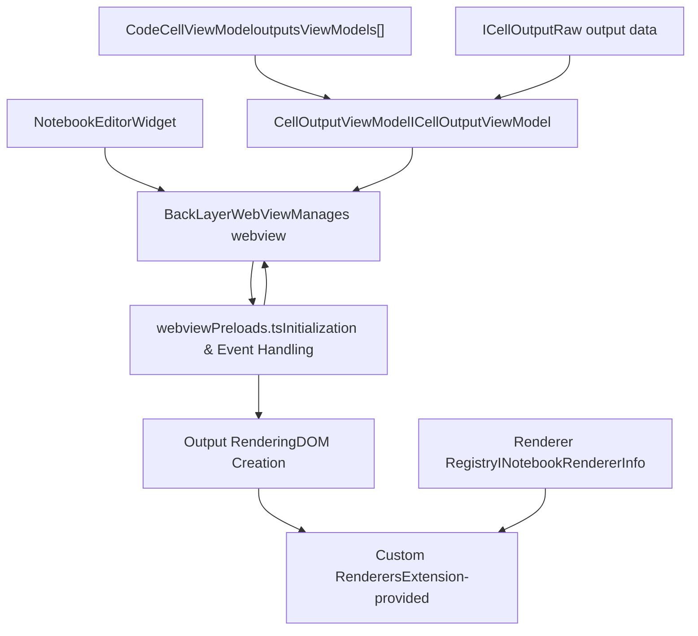
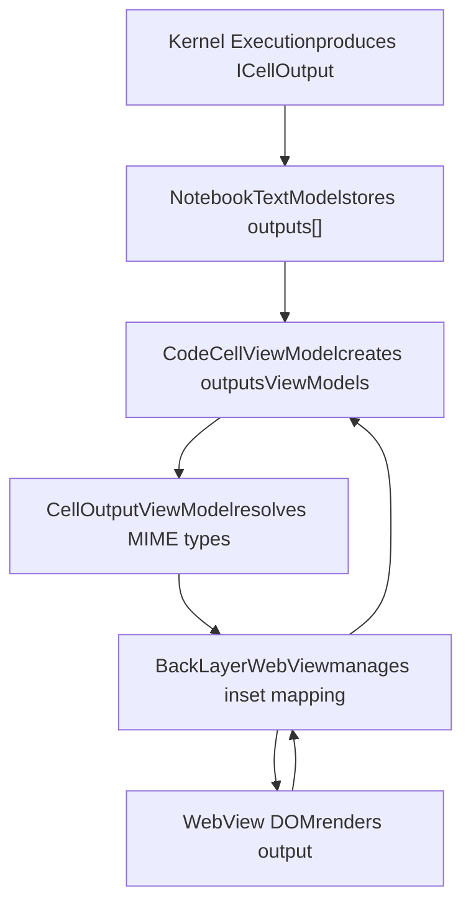
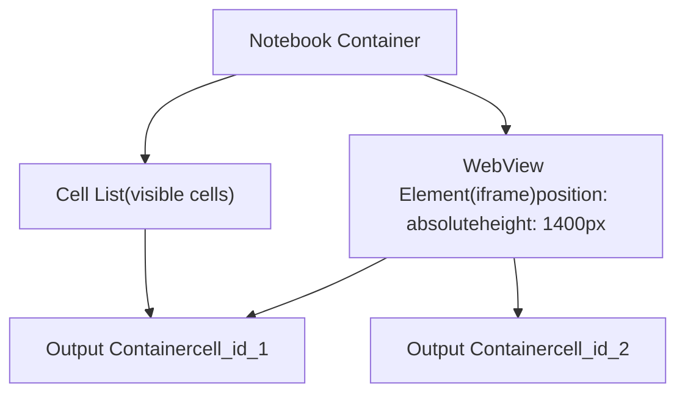
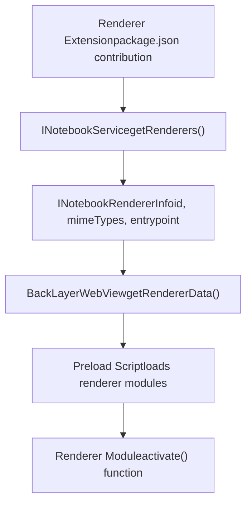
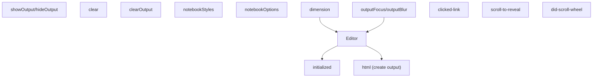

# Cell Outputs and WebView Rendering

Relevant source files

-   [extensions/markdown-language-features/notebook/index.ts](https://github.com/microsoft/vscode/blob/1be3088d/extensions/markdown-language-features/notebook/index.ts)
-   [src/vs/workbench/api/browser/mainThreadNotebook.ts](https://github.com/microsoft/vscode/blob/1be3088d/src/vs/workbench/api/browser/mainThreadNotebook.ts)
-   [src/vs/workbench/api/common/extHostNotebook.ts](https://github.com/microsoft/vscode/blob/1be3088d/src/vs/workbench/api/common/extHostNotebook.ts)
-   [src/vs/workbench/contrib/notebook/browser/media/notebook.css](https://github.com/microsoft/vscode/blob/1be3088d/src/vs/workbench/contrib/notebook/browser/media/notebook.css)
-   [src/vs/workbench/contrib/notebook/browser/notebook.contribution.ts](https://github.com/microsoft/vscode/blob/1be3088d/src/vs/workbench/contrib/notebook/browser/notebook.contribution.ts)
-   [src/vs/workbench/contrib/notebook/browser/notebookBrowser.ts](https://github.com/microsoft/vscode/blob/1be3088d/src/vs/workbench/contrib/notebook/browser/notebookBrowser.ts)
-   [src/vs/workbench/contrib/notebook/browser/notebookEditor.ts](https://github.com/microsoft/vscode/blob/1be3088d/src/vs/workbench/contrib/notebook/browser/notebookEditor.ts)
-   [src/vs/workbench/contrib/notebook/browser/notebookEditorWidget.ts](https://github.com/microsoft/vscode/blob/1be3088d/src/vs/workbench/contrib/notebook/browser/notebookEditorWidget.ts)
-   [src/vs/workbench/contrib/notebook/browser/view/notebookCellList.ts](https://github.com/microsoft/vscode/blob/1be3088d/src/vs/workbench/contrib/notebook/browser/view/notebookCellList.ts)
-   [src/vs/workbench/contrib/notebook/browser/view/renderers/backLayerWebView.ts](https://github.com/microsoft/vscode/blob/1be3088d/src/vs/workbench/contrib/notebook/browser/view/renderers/backLayerWebView.ts)
-   [src/vs/workbench/contrib/notebook/browser/view/renderers/cellRenderer.ts](https://github.com/microsoft/vscode/blob/1be3088d/src/vs/workbench/contrib/notebook/browser/view/renderers/cellRenderer.ts)
-   [src/vs/workbench/contrib/notebook/browser/view/renderers/webviewMessages.ts](https://github.com/microsoft/vscode/blob/1be3088d/src/vs/workbench/contrib/notebook/browser/view/renderers/webviewMessages.ts)
-   [src/vs/workbench/contrib/notebook/browser/view/renderers/webviewPreloads.ts](https://github.com/microsoft/vscode/blob/1be3088d/src/vs/workbench/contrib/notebook/browser/view/renderers/webviewPreloads.ts)
-   [src/vs/workbench/contrib/notebook/browser/viewModel/baseCellViewModel.ts](https://github.com/microsoft/vscode/blob/1be3088d/src/vs/workbench/contrib/notebook/browser/viewModel/baseCellViewModel.ts)
-   [src/vs/workbench/contrib/notebook/browser/viewModel/codeCellViewModel.ts](https://github.com/microsoft/vscode/blob/1be3088d/src/vs/workbench/contrib/notebook/browser/viewModel/codeCellViewModel.ts)
-   [src/vs/workbench/contrib/notebook/browser/viewModel/markupCellViewModel.ts](https://github.com/microsoft/vscode/blob/1be3088d/src/vs/workbench/contrib/notebook/browser/viewModel/markupCellViewModel.ts)
-   [src/vs/workbench/contrib/notebook/common/model/notebookCellTextModel.ts](https://github.com/microsoft/vscode/blob/1be3088d/src/vs/workbench/contrib/notebook/common/model/notebookCellTextModel.ts)
-   [src/vs/workbench/contrib/notebook/common/model/notebookTextModel.ts](https://github.com/microsoft/vscode/blob/1be3088d/src/vs/workbench/contrib/notebook/common/model/notebookTextModel.ts)
-   [src/vs/workbench/contrib/notebook/common/notebookCommon.ts](https://github.com/microsoft/vscode/blob/1be3088d/src/vs/workbench/contrib/notebook/common/notebookCommon.ts)
-   [src/vs/workbench/contrib/notebook/common/notebookEditorModel.ts](https://github.com/microsoft/vscode/blob/1be3088d/src/vs/workbench/contrib/notebook/common/notebookEditorModel.ts)
-   [src/vs/workbench/contrib/notebook/common/notebookService.ts](https://github.com/microsoft/vscode/blob/1be3088d/src/vs/workbench/contrib/notebook/common/notebookService.ts)

This document describes the architecture and implementation of cell output rendering in VS Code's notebook editor. Cell outputs are the results of code execution (text, images, HTML, errors, etc.) that are displayed below code cells. These outputs are rendered in an isolated webview environment to provide security and flexibility for custom renderer extensions.

For information about the overall notebook editor architecture, see [Notebooks](/microsoft/vscode/9-notebooks). For details on notebook data models and cell management, see [Notebook Data Model](/microsoft/vscode/9.3-notebook-data-model). For information about notebook kernels and execution, see [Notebook Extension API](/microsoft/vscode/9.5-notebook-extension-api).

## Architecture Overview

The cell output rendering system uses a dual-process architecture where outputs are rendered in an isolated webview (iframe) separate from the main editor process. This provides security isolation and allows custom renderer extensions to safely render arbitrary content.


**Sources:**

-   [src/vs/workbench/contrib/notebook/browser/notebookEditorWidget.ts1-1000](https://github.com/microsoft/vscode/blob/1be3088d/src/vs/workbench/contrib/notebook/browser/notebookEditorWidget.ts#L1-L1000)
-   [src/vs/workbench/contrib/notebook/browser/view/renderers/backLayerWebView.ts1-300](https://github.com/microsoft/vscode/blob/1be3088d/src/vs/workbench/contrib/notebook/browser/view/renderers/backLayerWebView.ts#L1-L300)
-   [src/vs/workbench/contrib/notebook/browser/viewModel/codeCellViewModel.ts1-100](https://github.com/microsoft/vscode/blob/1be3088d/src/vs/workbench/contrib/notebook/browser/viewModel/codeCellViewModel.ts#L1-L100)

## Output Data Flow

Outputs flow from kernel execution through view models to the webview renderer. Each stage transforms and enriches the output data.


**Diagram: Output Data Flow from Execution to Rendering**

**Sources:**

-   [src/vs/workbench/contrib/notebook/common/model/notebookCellTextModel.ts1-300](https://github.com/microsoft/vscode/blob/1be3088d/src/vs/workbench/contrib/notebook/common/model/notebookCellTextModel.ts#L1-L300)
-   [src/vs/workbench/contrib/notebook/browser/viewModel/codeCellViewModel.ts30-100](https://github.com/microsoft/vscode/blob/1be3088d/src/vs/workbench/contrib/notebook/browser/viewModel/codeCellViewModel.ts#L30-L100)
-   [src/vs/workbench/contrib/notebook/browser/view/renderers/backLayerWebView.ts129-300](https://github.com/microsoft/vscode/blob/1be3088d/src/vs/workbench/contrib/notebook/browser/view/renderers/backLayerWebView.ts#L129-L300)

## WebView Infrastructure

### BackLayerWebView Class

The `BackLayerWebView` class is the central component managing the webview that hosts all cell outputs. It creates a single webview element positioned absolutely behind the notebook cells.

**Key Responsibilities:**

| Responsibility | Implementation |
| --- | --- |
| **Webview Creation** | Creates `IWebviewElement` via `IWebviewService` |
| **Output Tracking** | Maintains `insetMapping` Map from outputs to cached insets |
| **Message Handling** | Processes messages from webview (dimension, focus, click events) |
| **Renderer Coordination** | Loads renderer metadata and preloads |
| **Height Management** | Tracks output heights and notifies editor of changes |

The webview element is styled absolutely and positioned to align with notebook cells:


**Diagram: WebView Layout and Positioning**

**Sources:**

-   [src/vs/workbench/contrib/notebook/browser/view/renderers/backLayerWebView.ts129-226](https://github.com/microsoft/vscode/blob/1be3088d/src/vs/workbench/contrib/notebook/browser/view/renderers/backLayerWebView.ts#L129-L226)
-   [src/vs/workbench/contrib/notebook/browser/view/renderers/backLayerWebView.ts550-594](https://github.com/microsoft/vscode/blob/1be3088d/src/vs/workbench/contrib/notebook/browser/view/renderers/backLayerWebView.ts#L550-L594)

### Inset Management

The `BackLayerWebView` tracks rendered outputs using several mapping structures:

```
// Maps output view model to cached inset data
insetMapping: Map<IDisplayOutputViewModel, ICachedInset<T>>

// Maps output ID to view model (reverse lookup)
reversedInsetMapping: Map<string, IDisplayOutputViewModel>

// Pending idle-rendered outputs
pendingWebviewIdleInsetMapping: Map<IDisplayOutputViewModel, ICachedInset<T>>

// Hidden outputs (not destroyed but not visible)
hiddenInsetMapping: Set<IDisplayOutputViewModel>
```
The `ICachedInset` interface stores information about each rendered output:

| Field | Type | Description |
| --- | --- | --- |
| `outputId` | string | Unique identifier for the output |
| `cellInfo` | T | Cell information (ID, handle, URI) |
| `renderer` | INotebookRendererInfo | Selected renderer for this output |
| `cachedCreation` | ICreationRequestMessage | Cached creation request data |
| `initialized` | boolean | Whether webview has acknowledged creation |

**Sources:**

-   [src/vs/workbench/contrib/notebook/browser/view/renderers/backLayerWebView.ts66-73](https://github.com/microsoft/vscode/blob/1be3088d/src/vs/workbench/contrib/notebook/browser/view/renderers/backLayerWebView.ts#L66-L73)
-   [src/vs/workbench/contrib/notebook/browser/view/renderers/backLayerWebView.ts129-158](https://github.com/microsoft/vscode/blob/1be3088d/src/vs/workbench/contrib/notebook/browser/view/renderers/backLayerWebView.ts#L129-L158)

## Output View Models

### ICellOutputViewModel Interface

Cell outputs are represented by the `ICellOutputViewModel` interface, which wraps the raw `ICellOutput` model:


**Diagram: Output View Model Class Structure**

### MIME Type Resolution

Outputs contain multiple representations (MIME types). The view model resolves which MIME type to display based on:

1.  **Available renderers** - Extensions that can render specific MIME types
2.  **Kernel provides** - MIME types the kernel supports
3.  **Display order** - Configured preference order (e.g., `image/png` before `text/plain`)
4.  **Trust state** - Whether workspace is trusted for rich rendering

The `resolveMimeTypes()` method returns ordered MIME types:

```
resolveMimeTypes(
    textModel: NotebookTextModel,
    kernelProvides: readonly string[] | undefined
): [readonly IOrderedMimeType[], number]
```
**Sources:**

-   [src/vs/workbench/contrib/notebook/browser/notebookBrowser.ts103-122](https://github.com/microsoft/vscode/blob/1be3088d/src/vs/workbench/contrib/notebook/browser/notebookBrowser.ts#L103-L122)
-   [src/vs/workbench/contrib/notebook/browser/viewModel/codeCellViewModel.ts1-100](https://github.com/microsoft/vscode/blob/1be3088d/src/vs/workbench/contrib/notebook/browser/viewModel/codeCellViewModel.ts#L1-L100)

## Rendering Pipeline

### Output Creation Flow

When a cell produces outputs, they flow through the following pipeline:

> **[Mermaid sequence]**
> *(图表结构无法解析)*

**Diagram: Output Creation Sequence**

### Creation Request Message

The `ICreationRequestMessage` sent to the webview contains all information needed to render an output:

| Field | Type | Description |
| --- | --- | --- |
| `type` | 'html' | Message type identifier |
| `cellId` | string | Cell identifier |
| `cellTop` | number | Cell's top position |
| `outputId` | string | Output identifier |
| `rendererId` | string | ID of renderer to use |
| `content` | any | Output content data |
| `metadata` | NotebookCellMetadata | Cell metadata |

**Sources:**

-   [src/vs/workbench/contrib/notebook/browser/view/renderers/webviewMessages.ts87-130](https://github.com/microsoft/vscode/blob/1be3088d/src/vs/workbench/contrib/notebook/browser/view/renderers/webviewMessages.ts#L87-L130)
-   [src/vs/workbench/contrib/notebook/browser/view/renderers/backLayerWebView.ts900-1100](https://github.com/microsoft/vscode/blob/1be3088d/src/vs/workbench/contrib/notebook/browser/view/renderers/backLayerWebView.ts#L900-L1100)

### Render Output Types

Outputs are rendered in two ways, represented by `RenderOutputType` enum:

```
enum RenderOutputType {
    Html = 0,        // Static HTML rendered directly
    Extension = 1    // Custom renderer provided by extension
}
```
**HTML Rendering (RenderOutputType.Html):**

-   Used for simple outputs like text, error messages
-   Content is sanitized and injected as HTML
-   No extension activation required
-   Example: Plain text output, stack traces

**Extension Rendering (RenderOutputType.Extension):**

-   Used for rich interactive outputs
-   Requires a notebook renderer extension
-   Renderer gets output data via `render()` API
-   Example: Plotly graphs, DataFrames, custom visualizations

**Sources:**

-   [src/vs/workbench/contrib/notebook/browser/notebookBrowser.ts83-101](https://github.com/microsoft/vscode/blob/1be3088d/src/vs/workbench/contrib/notebook/browser/notebookBrowser.ts#L83-L101)
-   [src/vs/workbench/contrib/notebook/browser/view/renderers/backLayerWebView.ts1000-1200](https://github.com/microsoft/vscode/blob/1be3088d/src/vs/workbench/contrib/notebook/browser/view/renderers/backLayerWebView.ts#L1000-L1200)

## Custom Renderers

### Renderer Registration and Metadata

Custom renderers are registered via the `notebookRenderer` contribution point. The `BackLayerWebView` loads renderer metadata and sends it to the webview:


**Diagram: Renderer Registration and Loading**

### RendererMetadata Structure

The `RendererMetadata` interface sent to the webview:

```
interface RendererMetadata {
    id: string;                    // Renderer ID
    entrypoint: {
        extends?: string;           // Parent renderer to extend
        path: string;              // URI to renderer script
    };
    mimeTypes: string[];           // MIME types this renderer handles
    messaging: boolean;            // Whether renderer uses messaging API
    isBuiltin: boolean;            // Built-in vs extension renderer
}
```
**Sources:**

-   [src/vs/workbench/contrib/notebook/browser/view/renderers/webviewMessages.ts142-152](https://github.com/microsoft/vscode/blob/1be3088d/src/vs/workbench/contrib/notebook/browser/view/renderers/webviewMessages.ts#L142-L152)
-   [src/vs/workbench/contrib/notebook/browser/view/renderers/backLayerWebView.ts502-516](https://github.com/microsoft/vscode/blob/1be3088d/src/vs/workbench/contrib/notebook/browser/view/renderers/backLayerWebView.ts#L502-L516)

### Renderer Activation and API

When an output needs rendering, the webview preload script:

1.  **Loads renderer module** - Uses `__import()` to dynamically load
2.  **Calls activate()** - Invokes renderer's activation function
3.  **Creates output element** - Renderer creates DOM for the output
4.  **Appends to container** - Output element added to output container

Renderers implement the `ActivationFunction` interface from `vscode-notebook-renderer`:

```
type ActivationFunction = (context: RendererContext) => RendererApi | void;

interface RendererContext {
    readonly onDidCreateOutput: Event<OutputItem>;
    readonly settings: RendererSettings;
    postMessage(message: any): void;
    onDidReceiveMessage: Event<any>;
}

interface RendererApi {
    renderOutputItem(outputItem: OutputItem, element: HTMLElement): void;
    destroyOutputItem?(outputId?: string): void;
}
```
**Sources:**

-   [src/vs/workbench/contrib/notebook/browser/view/renderers/webviewPreloads.ts1-100](https://github.com/microsoft/vscode/blob/1be3088d/src/vs/workbench/contrib/notebook/browser/view/renderers/webviewPreloads.ts#L1-L100)
-   [extensions/markdown-language-features/notebook/index.ts1-50](https://github.com/microsoft/vscode/blob/1be3088d/extensions/markdown-language-features/notebook/index.ts#L1-L50)

## Message Communication

### Message Protocol

The editor and webview communicate via `postMessage()`. Messages are strongly typed and use a discriminated union pattern:


**Diagram: Bidirectional Message Flow**

### Key Message Types

**Editor → WebView:**

| Message Type | Purpose | Key Fields |
| --- | --- | --- |
| `initialized` | Webview ready signal | \- |
| `html` | Create/update output | `outputId`, `content`, `rendererId` |
| `showOutput` | Make output visible | `outputId`, `cellTop` |
| `hideOutput` | Hide output | `outputId` |
| `clearOutput` | Remove output | `outputId` |
| `notebookStyles` | Update CSS variables | `styles` object |

**WebView → Editor:**

| Message Type | Purpose | Key Fields |
| --- | --- | --- |
| `dimension` | Report output height | `id`, `height`, `isOutput` |
| `outputFocus` | Output gained focus | `id` |
| `outputBlur` | Output lost focus | `id` |
| `outputInputFocus` | Input within output focused | `id`, `inputFocused` |
| `clicked-link` | User clicked link | `href` |
| `scroll-to-reveal` | Request scroll to position | `scrollTop` |

**Sources:**

-   [src/vs/workbench/contrib/notebook/browser/view/renderers/webviewMessages.ts1-400](https://github.com/microsoft/vscode/blob/1be3088d/src/vs/workbench/contrib/notebook/browser/view/renderers/webviewMessages.ts#L1-L400)
-   [src/vs/workbench/contrib/notebook/browser/view/renderers/backLayerWebView.ts605-850](https://github.com/microsoft/vscode/blob/1be3088d/src/vs/workbench/contrib/notebook/browser/view/renderers/backLayerWebView.ts#L605-L850)

## Output Height Management

### Dynamic Height Tracking

Outputs have dynamic heights that must be measured and communicated back to the editor for proper layout. This is handled through a multi-step process:

> **[Mermaid sequence]**
> *(图表结构无法解析)*

**Diagram: Output Height Measurement and Update Sequence**

### Height Update Flow

1.  **Initial Render** - Webview renders output with unknown height
2.  **ResizeObserver** - Detects size changes in webview
3.  **Dimension Message** - Webview sends `{type: 'dimension', height: X}`
4.  **Output Resolution** - Editor looks up output by ID
5.  **ViewModel Update** - Updates `CodeCellViewModel.outputsViewModels` height
6.  **Layout Recalculation** - `NotebookCellList` recalculates cell positions
7.  **Height Acknowledgment** - Editor confirms height update to webview

### Output Height Storage

The `CodeCellViewModel` tracks output heights using a `PrefixSumComputer`:

```
// From CodeCellViewModel
private _outputCollection: number[] = [];  // Output heights
private _outputsTop: PrefixSumComputer | null = null;

getOutputOffset(index: number): number {
    if (!this._outputsTop) {
        return 0;
    }
    return this._outputsTop.getPrefixSum(index - 1);
}

updateOutputHeight(index: number, height: number, source?: string): void {
    if (index >= this._outputCollection.length) {
        return;
    }

    this._outputCollection[index] = height;
    this._ensureOutputsTop();
    this._outputsTop!.setValue(index, height);

    this._fireOnLayoutChange();
}
```
**Sources:**

-   [src/vs/workbench/contrib/notebook/browser/viewModel/codeCellViewModel.ts30-120](https://github.com/microsoft/vscode/blob/1be3088d/src/vs/workbench/contrib/notebook/browser/viewModel/codeCellViewModel.ts#L30-L120)
-   [src/vs/workbench/contrib/notebook/browser/view/renderers/backLayerWebView.ts605-676](https://github.com/microsoft/vscode/blob/1be3088d/src/vs/workbench/contrib/notebook/browser/view/renderers/backLayerWebView.ts#L605-L676)
-   [src/vs/workbench/contrib/notebook/browser/view/renderers/webviewPreloads.ts800-1000](https://github.com/microsoft/vscode/blob/1be3088d/src/vs/workbench/contrib/notebook/browser/view/renderers/webviewPreloads.ts#L800-L1000)

## Webview Content Generation

### HTML Structure

The `BackLayerWebView.generateContent()` method creates the initial HTML document for the webview:

```
<html lang="en">
  <head>
    <base href="${baseUrl}/" />
    <meta http-equiv="Content-Security-Policy" content="...">
    <style>/* Cell output styling */</style>
  </head>
  <body>
    <div id='findStart' tabIndex=-1></div>
    <div id='container' class="widgetarea"></div>
    <div id="_defaultColorPalatte"></div>
    <script type="module">${preloadScript}</script>
  </body>
</html>
```
The container div holds all output elements, organized by cell ID:

```
<div id='container'>
  <div id='cell_id_1' class='cell_container'>
    <div class='output_container'>
      <div id='output_id_1' class='output'>
        <!-- Rendered output content -->
      </div>
    </div>
  </div>
  <div id='cell_id_2' class='cell_container'>
    <!-- ... -->
  </div>
</div>
```
**Sources:**

-   [src/vs/workbench/contrib/notebook/browser/view/renderers/backLayerWebView.ts290-500](https://github.com/microsoft/vscode/blob/1be3088d/src/vs/workbench/contrib/notebook/browser/view/renderers/backLayerWebView.ts#L290-L500)

### Preload Script Injection

The preload script is injected as a module and handles:

-   **Output rendering** - Creates DOM for outputs
-   **Event delegation** - Captures clicks, focus, scrolls
-   **ResizeObserver** - Monitors output size changes
-   **Custom renderer loading** - Dynamically imports renderer modules
-   **Message passing** - Communicates with main editor

Key preload functions:

| Function | Purpose |
| --- | --- |
| `createEmitter<T>()` | Creates event emitter for renderer API |
| `handleInnerClick()` | Processes clicks on links and anchors |
| `dimensionUpdater` | Sends dimension updates to editor |
| `renderOutputItem()` | Renders individual output items |
| `requestOutputPresentationUpdate()` | Requests re-render of output |

**Sources:**

-   [src/vs/workbench/contrib/notebook/browser/view/renderers/webviewPreloads.ts92-500](https://github.com/microsoft/vscode/blob/1be3088d/src/vs/workbench/contrib/notebook/browser/view/renderers/webviewPreloads.ts#L92-L500)

## Output Lifecycle

### Creation and Initialization

> **[Mermaid stateDiagram]**
> *(图表结构无法解析)*

**Diagram: Output Lifecycle State Machine**

### Idle Rendering

To optimize initial load time, outputs can be created with idle rendering:

```
// Idle creation request stored for later
this.pendingWebviewIdleCreationRequest.set(output, idleDisposable);
this.pendingWebviewIdleInsetMapping.set(output, cachedInset);
this.reversedPendingWebviewIdleInsetMapping.set(outputId, output);

// Actual creation deferred
const idleDisposable = runWhenIdle(() => {
    this._sendMessageToWebview({
        type: 'html',
        // ... creation data
    });
});
```
When the webview sends back the dimension message with `init: true`, the output transitions from pending to initialized.

**Sources:**

-   [src/vs/workbench/contrib/notebook/browser/view/renderers/backLayerWebView.ts900-1100](https://github.com/microsoft/vscode/blob/1be3088d/src/vs/workbench/contrib/notebook/browser/view/renderers/backLayerWebView.ts#L900-L1100)
-   [src/vs/workbench/contrib/notebook/browser/view/renderers/backLayerWebView.ts628-656](https://github.com/microsoft/vscode/blob/1be3088d/src/vs/workbench/contrib/notebook/browser/view/renderers/backLayerWebView.ts#L628-L656)

### Output Updates and Removal

Outputs can be updated or removed during cell execution:

**Update Flow:**

1.  Kernel appends/replaces output data
2.  `NotebookCellTextModel` fires `onDidChangeOutputs`
3.  `CodeCellViewModel` updates `outputsViewModels`
4.  `BackLayerWebView.updateOutput()` called
5.  Webview receives updated content
6.  Renderer re-renders if needed

**Removal Flow:**

1.  Cell outputs cleared/removed
2.  `BackLayerWebView.removeInset()` called
3.  Webview receives `clearOutput` message
4.  Output DOM element removed
5.  Inset mapping cleaned up
6.  `onDidRemoveOutputs` event fired

**Sources:**

-   [src/vs/workbench/contrib/notebook/browser/view/renderers/backLayerWebView.ts1300-1500](https://github.com/microsoft/vscode/blob/1be3088d/src/vs/workbench/contrib/notebook/browser/view/renderers/backLayerWebView.ts#L1300-L1500)
-   [src/vs/workbench/contrib/notebook/browser/viewModel/codeCellViewModel.ts200-400](https://github.com/microsoft/vscode/blob/1be3088d/src/vs/workbench/contrib/notebook/browser/viewModel/codeCellViewModel.ts#L200-L400)

## Security and Sandboxing

The webview provides security isolation through several mechanisms:

### Content Security Policy

A strict CSP is applied when `notebook.experimental.enableCsp` is enabled:

```
<meta http-equiv="Content-Security-Policy" content="
    default-src 'none';
    script-src ${webviewGenericCspSource} 'unsafe-inline' 'unsafe-eval';
    style-src ${webviewGenericCspSource} 'unsafe-inline';
    img-src ${webviewGenericCspSource} https: http: data:;
    font-src ${webviewGenericCspSource} https:;
    connect-src https:;
    child-src https: data:;
">
```
### Workspace Trust

Output rendering respects workspace trust state:

-   **Trusted workspace** - All renderers and rich outputs enabled
-   **Untrusted workspace** - Only safe, read-only renderers allowed
-   **HTML sanitization** - DOMPurify sanitizes HTML outputs

### Resource Access

Local resource access is controlled through:

1.  **Local resource roots** - Whitelisted directories
2.  **asWebviewUri()** - Converts file URIs to webview-safe URIs
3.  **Origin store** - Tracks allowed webview origins

**Sources:**

-   [src/vs/workbench/contrib/notebook/browser/view/renderers/backLayerWebView.ts290-330](https://github.com/microsoft/vscode/blob/1be3088d/src/vs/workbench/contrib/notebook/browser/view/renderers/backLayerWebView.ts#L290-L330)
-   [src/vs/workbench/contrib/notebook/browser/view/renderers/backLayerWebView.ts524-586](https://github.com/microsoft/vscode/blob/1be3088d/src/vs/workbench/contrib/notebook/browser/view/renderers/backLayerWebView.ts#L524-L586)

## Performance Considerations

### Output Display Limit

To prevent performance issues with cells producing many outputs, there's a display limit:

```
export const outputDisplayLimit = 500;

// In CodeCellViewModel
private _outputsTop: PrefixSumComputer | null = null;
```
When a cell exceeds this limit, older outputs may be virtualized or hidden.

### Webview Boundary

Output positioning is constrained within a boundary to optimize rendering:

```
export const NOTEBOOK_WEBVIEW_BOUNDARY = 5000;

function validateWebviewBoundary(element: HTMLElement) {
    const webviewTop = 0 - (parseInt(element.style.top, 10) || 0);
    return webviewTop >= 0 && webviewTop <= NOTEBOOK_WEBVIEW_BOUNDARY * 2;
}
```
Outputs outside this boundary may be hidden to reduce DOM complexity.

### Idle Rendering Strategy

Non-visible outputs use idle rendering to defer creation:

1.  Outputs below the fold are marked for idle creation
2.  `runWhenIdle()` callback queues the creation
3.  Creation happens during browser idle time
4.  Reduces initial page load time

**Sources:**

-   [src/vs/workbench/contrib/notebook/browser/viewModel/codeCellViewModel.ts28](https://github.com/microsoft/vscode/blob/1be3088d/src/vs/workbench/contrib/notebook/browser/viewModel/codeCellViewModel.ts#L28-L28)
-   [src/vs/workbench/contrib/notebook/browser/view/notebookCellList.ts73-78](https://github.com/microsoft/vscode/blob/1be3088d/src/vs/workbench/contrib/notebook/browser/view/notebookCellList.ts#L73-L78)
-   [src/vs/workbench/contrib/notebook/browser/view/renderers/backLayerWebView.ts900-1000](https://github.com/microsoft/vscode/blob/1be3088d/src/vs/workbench/contrib/notebook/browser/view/renderers/backLayerWebView.ts#L900-L1000)
