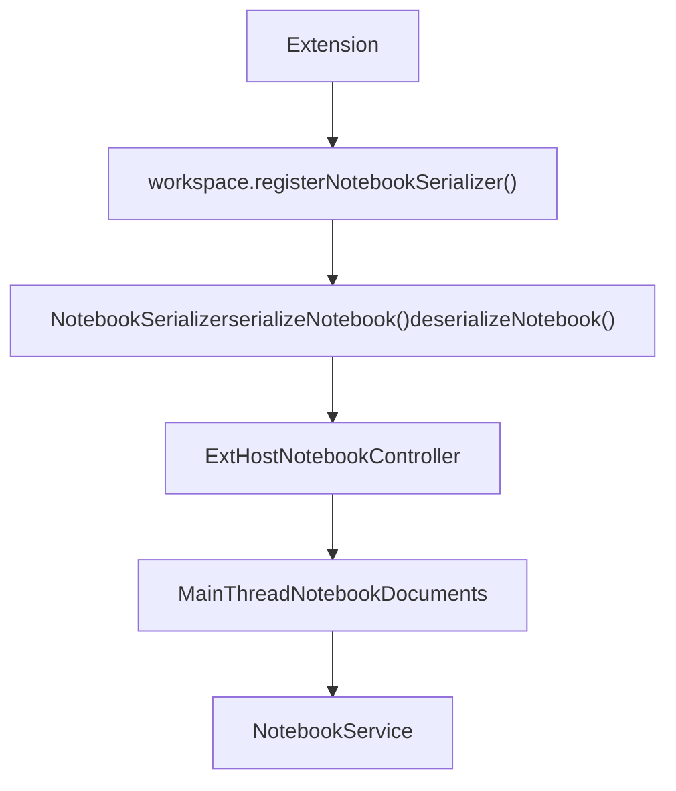
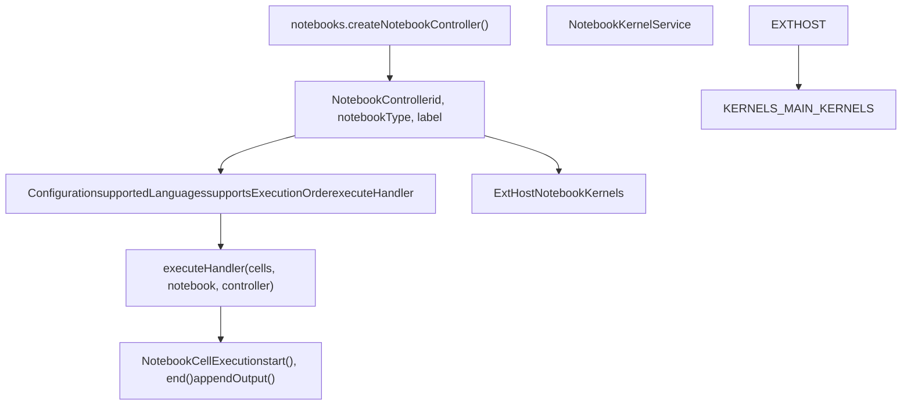
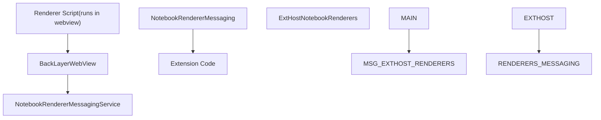
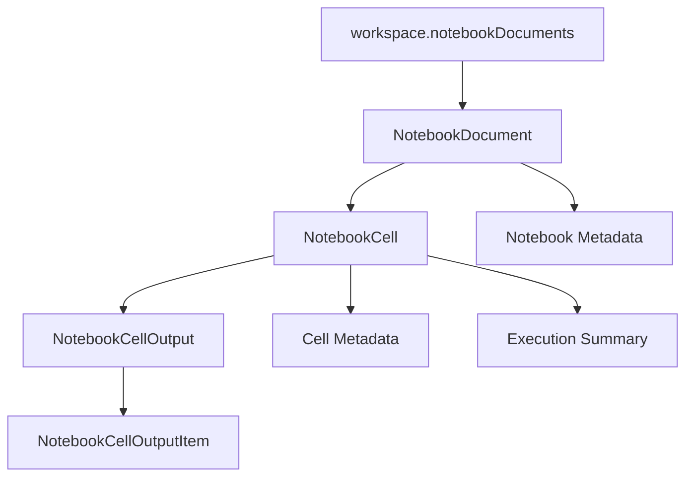
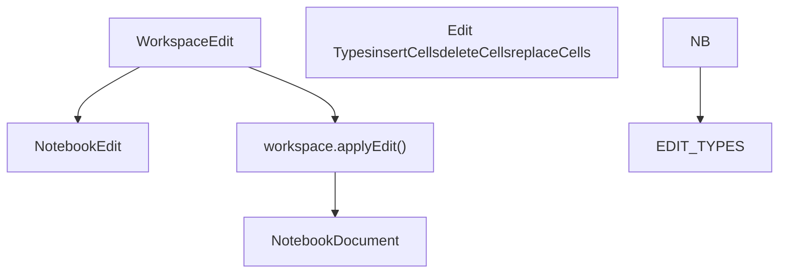
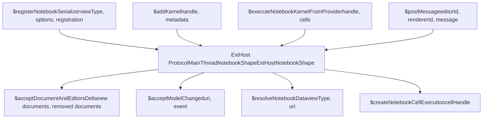

# Notebook Extension API

Relevant source files

-   [extensions/markdown-language-features/notebook/index.ts](https://github.com/microsoft/vscode/blob/1be3088d/extensions/markdown-language-features/notebook/index.ts)
-   [src/vs/workbench/api/browser/mainThreadNotebook.ts](https://github.com/microsoft/vscode/blob/1be3088d/src/vs/workbench/api/browser/mainThreadNotebook.ts)
-   [src/vs/workbench/api/common/extHostNotebook.ts](https://github.com/microsoft/vscode/blob/1be3088d/src/vs/workbench/api/common/extHostNotebook.ts)
-   [src/vs/workbench/contrib/notebook/browser/media/notebook.css](https://github.com/microsoft/vscode/blob/1be3088d/src/vs/workbench/contrib/notebook/browser/media/notebook.css)
-   [src/vs/workbench/contrib/notebook/browser/notebook.contribution.ts](https://github.com/microsoft/vscode/blob/1be3088d/src/vs/workbench/contrib/notebook/browser/notebook.contribution.ts)
-   [src/vs/workbench/contrib/notebook/browser/notebookBrowser.ts](https://github.com/microsoft/vscode/blob/1be3088d/src/vs/workbench/contrib/notebook/browser/notebookBrowser.ts)
-   [src/vs/workbench/contrib/notebook/browser/notebookEditor.ts](https://github.com/microsoft/vscode/blob/1be3088d/src/vs/workbench/contrib/notebook/browser/notebookEditor.ts)
-   [src/vs/workbench/contrib/notebook/browser/notebookEditorWidget.ts](https://github.com/microsoft/vscode/blob/1be3088d/src/vs/workbench/contrib/notebook/browser/notebookEditorWidget.ts)
-   [src/vs/workbench/contrib/notebook/browser/view/notebookCellList.ts](https://github.com/microsoft/vscode/blob/1be3088d/src/vs/workbench/contrib/notebook/browser/view/notebookCellList.ts)
-   [src/vs/workbench/contrib/notebook/browser/view/renderers/backLayerWebView.ts](https://github.com/microsoft/vscode/blob/1be3088d/src/vs/workbench/contrib/notebook/browser/view/renderers/backLayerWebView.ts)
-   [src/vs/workbench/contrib/notebook/browser/view/renderers/cellRenderer.ts](https://github.com/microsoft/vscode/blob/1be3088d/src/vs/workbench/contrib/notebook/browser/view/renderers/cellRenderer.ts)
-   [src/vs/workbench/contrib/notebook/browser/view/renderers/webviewMessages.ts](https://github.com/microsoft/vscode/blob/1be3088d/src/vs/workbench/contrib/notebook/browser/view/renderers/webviewMessages.ts)
-   [src/vs/workbench/contrib/notebook/browser/view/renderers/webviewPreloads.ts](https://github.com/microsoft/vscode/blob/1be3088d/src/vs/workbench/contrib/notebook/browser/view/renderers/webviewPreloads.ts)
-   [src/vs/workbench/contrib/notebook/browser/viewModel/baseCellViewModel.ts](https://github.com/microsoft/vscode/blob/1be3088d/src/vs/workbench/contrib/notebook/browser/viewModel/baseCellViewModel.ts)
-   [src/vs/workbench/contrib/notebook/browser/viewModel/codeCellViewModel.ts](https://github.com/microsoft/vscode/blob/1be3088d/src/vs/workbench/contrib/notebook/browser/viewModel/codeCellViewModel.ts)
-   [src/vs/workbench/contrib/notebook/browser/viewModel/markupCellViewModel.ts](https://github.com/microsoft/vscode/blob/1be3088d/src/vs/workbench/contrib/notebook/browser/viewModel/markupCellViewModel.ts)
-   [src/vs/workbench/contrib/notebook/common/model/notebookCellTextModel.ts](https://github.com/microsoft/vscode/blob/1be3088d/src/vs/workbench/contrib/notebook/common/model/notebookCellTextModel.ts)
-   [src/vs/workbench/contrib/notebook/common/model/notebookTextModel.ts](https://github.com/microsoft/vscode/blob/1be3088d/src/vs/workbench/contrib/notebook/common/model/notebookTextModel.ts)
-   [src/vs/workbench/contrib/notebook/common/notebookCommon.ts](https://github.com/microsoft/vscode/blob/1be3088d/src/vs/workbench/contrib/notebook/common/notebookCommon.ts)
-   [src/vs/workbench/contrib/notebook/common/notebookEditorModel.ts](https://github.com/microsoft/vscode/blob/1be3088d/src/vs/workbench/contrib/notebook/common/notebookEditorModel.ts)
-   [src/vs/workbench/contrib/notebook/common/notebookService.ts](https://github.com/microsoft/vscode/blob/1be3088d/src/vs/workbench/contrib/notebook/common/notebookService.ts)

## Purpose and Scope

This document explains the extension API surface that allows VS Code extensions to integrate with the notebook system. Extensions can contribute notebook serializers, execution kernels (controllers), output renderers, and programmatically interact with notebook documents and cells.

For the core notebook architecture and internal implementation details, see [Notebook Architecture Overview](/microsoft/vscode/9.1-notebook-architecture-overview). For information about notebook data models and cell lifecycle, see [Notebook Data Model](/microsoft/vscode/9.3-notebook-data-model) and [Cell Lifecycle and State Management](/microsoft/vscode/9.5-notebook-extension-api).

## API Surface Overview

The notebook extension API consists of four primary contribution points exposed through the `vscode` namespace:

| API Area | Purpose | Key Types |
| --- | --- | --- |
| **NotebookSerializer** | Read/write notebook files in custom formats | `NotebookSerializer`, `NotebookData` |
| **NotebookController** | Execute notebook cells (kernels) | `NotebookController`, `NotebookCellExecution` |
| **NotebookRenderer** | Custom rendering of cell outputs | `NotebookRendererMessaging` |
| **Document Access** | Programmatic access to notebook documents | `NotebookDocument`, `NotebookCell` |

Extensions register these contributions through workspace methods like `workspace.registerNotebookSerializer()` and create controllers via `notebooks.createNotebookController()`.

**Sources:** [src/vscode-dts/vscode.d.ts12888-13856](https://github.com/microsoft/vscode/blob/1be3088d/src/vscode-dts/vscode.d.ts#L12888-L13856) [src/vs/workbench/api/common/extHost.api.impl.ts977-1164](https://github.com/microsoft/vscode/blob/1be3088d/src/vs/workbench/api/common/extHost.api.impl.ts#L977-L1164)

## High-Level Architecture

```mermaid
flowchart TD
    EXT["Extension Code"]
    API["vscode.notebooks APIvscode.workspace API"]
    EXTHOST_NB["ExtHostNotebookController"]
    EXTHOST_KERNELS["ExtHostNotebookKernels"]
    EXTHOST_RENDERERS["ExtHostNotebookRenderers"]
    PROTOCOL["ExtHost ProtocolSerializableObjectWithBuffers"]
    MAIN_NB["MainThreadNotebookDocumentsMainThreadNotebookEditors"]
    MAIN_KERNELS["MainThreadNotebookKernels"]
    MAIN_RENDERERS["MainThreadNotebookRenderers"]
    NB_SERVICE["INotebookService"]
    KERNEL_SERVICE["INotebookKernelService"]
    RENDERER_SERVICE["INotebookRendererMessagingService"]

    EXT --> API
    API --> EXTHOST_NB
    API --> EXTHOST_KERNELS
    API --> EXTHOST_RENDERERS
    EXTHOST --> NB_PROTOCOL
    EXTHOST --> KERNELS_PROTOCOL
    EXTHOST --> RENDERERS_PROTOCOL
    PROTOCOL --> MAIN_NB
    PROTOCOL --> MAIN_KERNELS
    PROTOCOL --> MAIN_RENDERERS
    MAIN --> NB_NB_SERVICE
    MAIN --> KERNELS_KERNEL_SERVICE
    MAIN --> RENDERERS_RENDERER_SERVICE
```


**Diagram: Notebook Extension API Architecture**

The notebook extension API follows VS Code's standard ExtHost-MainThread architecture. Extension code runs in a separate process (Extension Host) and communicates with the main UI thread via RPC. This isolation provides stability and security.

**Sources:** [src/vs/workbench/api/common/extHostNotebook.ts1-1094](https://github.com/microsoft/vscode/blob/1be3088d/src/vs/workbench/api/common/extHostNotebook.ts#L1-L1094) [src/vs/workbench/api/browser/mainThreadNotebook.ts1-329](https://github.com/microsoft/vscode/blob/1be3088d/src/vs/workbench/api/browser/mainThreadNotebook.ts#L1-L329) [src/vs/workbench/api/common/extHost.protocol.ts800-900](https://github.com/microsoft/vscode/blob/1be3088d/src/vs/workbench/api/common/extHost.protocol.ts#L800-L900)

## NotebookSerializer

NotebookSerializers handle reading and writing notebook files in specific formats. Extensions register serializers for particular notebook view types (e.g., "jupyter-notebook", "interactive").

### Registration and Interface


**Diagram: NotebookSerializer Registration Flow**

Extensions implement the `NotebookSerializer` interface with two methods:

-   `deserializeNotebook(data: Uint8Array, token: CancellationToken): NotebookData | Thenable<NotebookData>` - Converts file bytes to notebook structure
-   `serializeNotebook(data: NotebookData, token: CancellationToken): Uint8Array | Thenable<Uint8Array>` - Converts notebook structure to file bytes

**Sources:** [src/vscode-dts/vscode.d.ts13788-13817](https://github.com/microsoft/vscode/blob/1be3088d/src/vscode-dts/vscode.d.ts#L13788-L13817) [src/vs/workbench/api/common/extHostNotebook.ts269-339](https://github.com/microsoft/vscode/blob/1be3088d/src/vs/workbench/api/common/extHostNotebook.ts#L269-L339)

### NotebookData Structure

The `NotebookData` type represents a notebook's complete structure:

```
interface NotebookData {
    cells: NotebookCellData[];
    metadata?: { [key: string]: any };
}

interface NotebookCellData {
    kind: NotebookCellKind;
    value: string;
    languageId: string;
    outputs?: NotebookCellOutput[];
    metadata?: { [key: string]: any };
    executionSummary?: NotebookCellExecutionSummary;
}
```
The serializer converts between this structured format and the raw bytes on disk. The `ExtHostNotebookController` class manages serializer registration and invocation.

**Sources:** [src/vscode-dts/vscode.d.ts13626-13713](https://github.com/microsoft/vscode/blob/1be3088d/src/vscode-dts/vscode.d.ts#L13626-L13713) [src/vs/workbench/api/common/extHostTypeConverters.ts2490-2630](https://github.com/microsoft/vscode/blob/1be3088d/src/vs/workbench/api/common/extHostTypeConverters.ts#L2490-L2630)

## NotebookController (Kernels)

NotebookControllers (also called kernels) execute notebook cells. Extensions create controllers to provide execution environments for different languages and runtimes.

### Controller Creation and Configuration


**Diagram: NotebookController Creation and Execution**

Controllers have the following key properties:

-   `id: string` - Unique identifier
-   `notebookType: string` - Which notebook types this controller supports (e.g., "jupyter-notebook")
-   `label: string` - Display name shown in kernel picker
-   `supportedLanguages?: string[]` - Languages this controller can execute
-   `executeHandler: (cells, notebook, controller) => void | Thenable<void>` - The execution function

**Sources:** [src/vscode-dts/vscode.d.ts13269-13425](https://github.com/microsoft/vscode/blob/1be3088d/src/vscode-dts/vscode.d.ts#L13269-L13425) [src/vs/workbench/api/common/extHost.api.impl.ts1061-1095](https://github.com/microsoft/vscode/blob/1be3088d/src/vs/workbench/api/common/extHost.api.impl.ts#L1061-L1095)

### Cell Execution Flow

When a controller executes cells, it receives a `NotebookCellExecution` object for each cell:

> **[Mermaid sequence]**
> *(图表结构无法解析)*

**Diagram: Cell Execution Sequence**

The `NotebookCellExecution` object provides methods to:

-   `start(startTime?: number): void` - Mark execution start
-   `end(success: boolean | undefined, endTime?: number): void` - Mark execution completion
-   `appendOutput(output: NotebookCellOutput | readonly NotebookCellOutput[], cell?: NotebookCell): Promise<void>` - Add output to cell
-   `replaceOutput(output: NotebookCellOutput | readonly NotebookCellOutput[], cell?: NotebookCell): Promise<void>` - Replace cell output
-   `clearOutput(cell?: NotebookCell): Promise<void>` - Clear cell output

**Sources:** [src/vscode-dts/vscode.d.ts13427-13554](https://github.com/microsoft/vscode/blob/1be3088d/src/vscode-dts/vscode.d.ts#L13427-L13554) [src/vs/workbench/api/common/extHostNotebookKernels.ts1-667](https://github.com/microsoft/vscode/blob/1be3088d/src/vs/workbench/api/common/extHostNotebookKernels.ts#L1-L667)

### Controller Metadata and Features

Controllers can expose additional metadata:

| Property | Type | Purpose |
| --- | --- | --- |
| `supportedLanguages` | `string[]` | Languages the controller can execute |
| `supportsExecutionOrder` | `boolean` | Whether execution order should be tracked |
| `description` | `string` | Additional description text |
| `detail` | `string` | Detail text shown in kernel picker |
| `kind` | `NotebookControllerKind` | `1` (primary) or `2` (secondary) |

Controllers are matched to notebooks based on `notebookType` and optionally filtered by `updateNotebookAffinity()` method.

**Sources:** [src/vscode-dts/vscode.d.ts13269-13425](https://github.com/microsoft/vscode/blob/1be3088d/src/vscode-dts/vscode.d.ts#L13269-L13425) [src/vs/workbench/contrib/notebook/common/notebookKernelService.ts1-515](https://github.com/microsoft/vscode/blob/1be3088d/src/vs/workbench/contrib/notebook/common/notebookKernelService.ts#L1-L515)

## NotebookRenderer

NotebookRenderers provide custom visualizations for cell outputs. Renderers are declared in `package.json` rather than registered via API calls.

### Renderer Declaration

Renderers are declared in the extension's `package.json`:

```
{
  "contributes": {
    "notebookRenderer": [
      {
        "id": "my-renderer",
        "displayName": "My Renderer",
        "entrypoint": "./out/renderer.js",
        "mimeTypes": ["application/x-custom"],
        "requiresMessaging": "optional"
      }
    ]
  }
}
```
### Renderer Communication


**Diagram: Renderer Messaging Flow**

Renderers can optionally communicate with their extension using the `NotebookRendererMessaging` API:

-   `onDidReceiveMessage: Event<{ editor: NotebookEditor, message: any }>` - Receive messages from renderer
-   `postMessage(message: any, editor?: NotebookEditor): Thenable<boolean>` - Send messages to renderer

The renderer script (running in the webview) uses the `acquireNotebookRendererApi()` function to access the messaging API.

**Sources:** [src/vscode-dts/vscode.d.ts13556-13624](https://github.com/microsoft/vscode/blob/1be3088d/src/vscode-dts/vscode.d.ts#L13556-L13624) [src/vs/workbench/api/common/extHostNotebookRenderers.ts1-187](https://github.com/microsoft/vscode/blob/1be3088d/src/vs/workbench/api/common/extHostNotebookRenderers.ts#L1-L187) [src/vs/workbench/contrib/notebook/browser/view/renderers/webviewPreloads.ts1800-2000](https://github.com/microsoft/vscode/blob/1be3088d/src/vs/workbench/contrib/notebook/browser/view/renderers/webviewPreloads.ts#L1800-L2000)

### Renderer API in Webview

The renderer script running in the notebook webview receives an API object:

```
interface RendererContext<T> {
  setState(state: T): void;
  getState(): T | undefined;
  getRenderer(rendererId: string): Promise<RendererApi>;
  workspace: {
    isTrusted: boolean;
  };
  settings: {
    lineLimit: number;
    outputScrolling: boolean;
    outputWordWrap: boolean;
  };
}
```
Renderers implement the `createOutputItem()` method to generate DOM elements for outputs.

**Sources:** [src/vs/workbench/contrib/notebook/browser/view/renderers/webviewPreloads.ts1950-2400](https://github.com/microsoft/vscode/blob/1be3088d/src/vs/workbench/contrib/notebook/browser/view/renderers/webviewPreloads.ts#L1950-L2400)

## Programmatic Document Access

Extensions can access and manipulate notebook documents programmatically through the `workspace.notebookDocuments` API.

### Document and Cell Model


**Diagram: Notebook Document Object Model**

Key interfaces for document access:

| Interface | Key Properties | Purpose |
| --- | --- | --- |
| `NotebookDocument` | `uri`, `notebookType`, `cells`, `metadata`, `version` | Represents entire notebook |
| `NotebookCell` | `index`, `kind`, `document`, `outputs`, `metadata`, `executionSummary` | Represents single cell |
| `NotebookCellOutput` | `items`, `metadata` | Cell execution output |
| `NotebookCellOutputItem` | `mime`, `data` | Single MIME-typed output |

**Sources:** [src/vscode-dts/vscode.d.ts12888-13267](https://github.com/microsoft/vscode/blob/1be3088d/src/vscode-dts/vscode.d.ts#L12888-L13267) [src/vs/workbench/api/common/extHostNotebookDocument.ts1-370](https://github.com/microsoft/vscode/blob/1be3088d/src/vs/workbench/api/common/extHostNotebookDocument.ts#L1-L370)

### Document Editing

Extensions can edit notebooks using `WorkspaceEdit`:


**Diagram: Notebook Document Editing**

Available notebook edit operations:

-   `NotebookEdit.insertCells(index, cells)` - Insert new cells
-   `NotebookEdit.deleteCells(range)` - Delete cells
-   `NotebookEdit.replaceCells(range, cells)` - Replace cells
-   `NotebookEdit.updateCellMetadata(index, metadata)` - Update cell metadata
-   `NotebookEdit.updateNotebookMetadata(metadata)` - Update notebook metadata

**Sources:** [src/vscode-dts/vscode.d.ts4584-4674](https://github.com/microsoft/vscode/blob/1be3088d/src/vscode-dts/vscode.d.ts#L4584-L4674) [src/vs/workbench/api/common/extHostTypeConverters.ts2300-2490](https://github.com/microsoft/vscode/blob/1be3088d/src/vs/workbench/api/common/extHostTypeConverters.ts#L2300-L2490)

## RPC Protocol Layer

The notebook extension API uses VS Code's ExtHost-MainThread RPC protocol to communicate between processes. This section details the protocol messages specific to notebooks.

### Protocol Message Types


**Diagram: Notebook RPC Protocol Messages**

Key protocol interfaces:

-   `MainThreadNotebookShape` - Methods called on main thread by extension host
-   `ExtHostNotebookShape` - Methods called on extension host by main thread
-   `MainThreadNotebookDocumentsShape` - Document-specific operations
-   `MainThreadNotebookEditorsShape` - Editor-specific operations
-   `MainThreadNotebookKernelsShape` - Kernel-specific operations

**Sources:** [src/vs/workbench/api/common/extHost.protocol.ts800-1000](https://github.com/microsoft/vscode/blob/1be3088d/src/vs/workbench/api/common/extHost.protocol.ts#L800-L1000) [src/vs/workbench/api/browser/mainThreadNotebook.ts1-329](https://github.com/microsoft/vscode/blob/1be3088d/src/vs/workbench/api/browser/mainThreadNotebook.ts#L1-L329)

### Type Converters

Type converters transform between VS Code API types (ExtHost) and internal protocol DTOs (MainThread):

| API Type | DTO Type | Converter Location |
| --- | --- | --- |
| `vscode.NotebookData` | `NotebookDataDto` | `typeConverters.NotebookData` |
| `vscode.NotebookCellData` | `IMainCellDto` | `typeConverters.NotebookCellData` |
| `vscode.NotebookCellOutput` | `IOutputDto` | `typeConverters.NotebookCellOutput` |
| `vscode.NotebookCellOutputItem` | `IOutputItemDto` | `typeConverters.NotebookCellOutputItem` |

The converters handle:

-   URI transformations
-   Buffer/Uint8Array conversions
-   Metadata filtering based on `TransientOptions`
-   Output ID generation and tracking

**Sources:** [src/vs/workbench/api/common/extHostTypeConverters.ts2300-2700](https://github.com/microsoft/vscode/blob/1be3088d/src/vs/workbench/api/common/extHostTypeConverters.ts#L2300-L2700) [src/vs/workbench/api/browser/mainThreadNotebookDto.ts1-179](https://github.com/microsoft/vscode/blob/1be3088d/src/vs/workbench/api/browser/mainThreadNotebookDto.ts#L1-L179)

## Event Notification Flow

Extensions receive notifications about notebook changes through several event emitters:

```mermaid
flowchart TD
    MODEL["NotebookTextModel(Main Thread)"]
    MAIN_NB["MainThreadNotebookDocuments"]
    EXTHOST_NB["ExtHostNotebookController"]
    EXTHOST_DOC["ExtHostNotebookDocument"]
    EVENT1["workspace.onDidOpenNotebookDocument"]
    EVENT2["workspace.onDidCloseNotebookDocument"]
    EVENT3["workspace.onDidChangeNotebookDocument"]
    EVENT4["workspace.onDidSaveNotebookDocument"]

    MODEL --> MAIN_NB
    MAIN --> NB_EXTHOST_NB
    EXTHOST --> NB_EXTHOST_DOC
    EXTHOST --> DOC_EVENT3
    MAIN --> NB_EXTHOST_NB
    EXTHOST --> NB_EVENT1
    EXTHOST --> NB_EVENT2
    MAIN --> NB_EXTHOST_NB
    EXTHOST --> NB_EVENT4
```


**Diagram: Notebook Event Notification Flow**

Event types:

-   `onDidOpenNotebookDocument` - Fired when a notebook is opened
-   `onDidCloseNotebookDocument` - Fired when a notebook is closed
-   `onDidChangeNotebookDocument` - Fired when notebook content changes (cell edits, output changes, metadata changes)
-   `onDidSaveNotebookDocument` - Fired when a notebook is saved

The `NotebookDocumentChangeEvent` provides detailed change information including:

-   `cellChanges: NotebookCellContentChangeEvent[]` - Cell text changes
-   `contentChanges: NotebookDocumentContentChange[]` - Structural changes (add/remove/move cells)
-   `metadata: { [key: string]: any }` - Metadata changes

**Sources:** [src/vscode-dts/vscode.d.ts8860-8991](https://github.com/microsoft/vscode/blob/1be3088d/src/vscode-dts/vscode.d.ts#L8860-L8991) [src/vs/workbench/api/common/extHostNotebookDocument.ts155-370](https://github.com/microsoft/vscode/blob/1be3088d/src/vs/workbench/api/common/extHostNotebookDocument.ts#L155-L370)

## Integration Points Summary

The notebook extension API integrates with other VS Code extension APIs:

| Integration | API Surface | Use Case |
| --- | --- | --- |
| **File System** | `workspace.fs`, `FileSystemProvider` | Custom notebook storage backends |
| **Text Documents** | `workspace.textDocuments` | Access cell contents as text documents |
| **Commands** | `commands.registerCommand` | Register notebook-specific commands |
| **Decorations** | `TextEditorDecorationType` | Decorate cell editor content |
| **Languages** | `languages.*` | Provide IntelliSense for notebook cells |
| **Debug** | `debug.*` | Debug notebook cell execution |
| **Testing** | `tests.*` | Test notebook cells |

Notebook cells are represented as regular `TextDocument` objects, allowing full language feature integration including completions, hovers, diagnostics, and code actions.

**Sources:** [src/vs/workbench/api/common/extHost.api.impl.ts977-1164](https://github.com/microsoft/vscode/blob/1be3088d/src/vs/workbench/api/common/extHost.api.impl.ts#L977-L1164) [src/vs/workbench/api/common/extHostDocuments.ts1-354](https://github.com/microsoft/vscode/blob/1be3088d/src/vs/workbench/api/common/extHostDocuments.ts#L1-L354)
